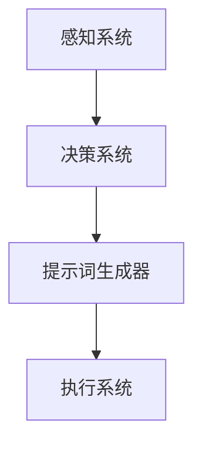
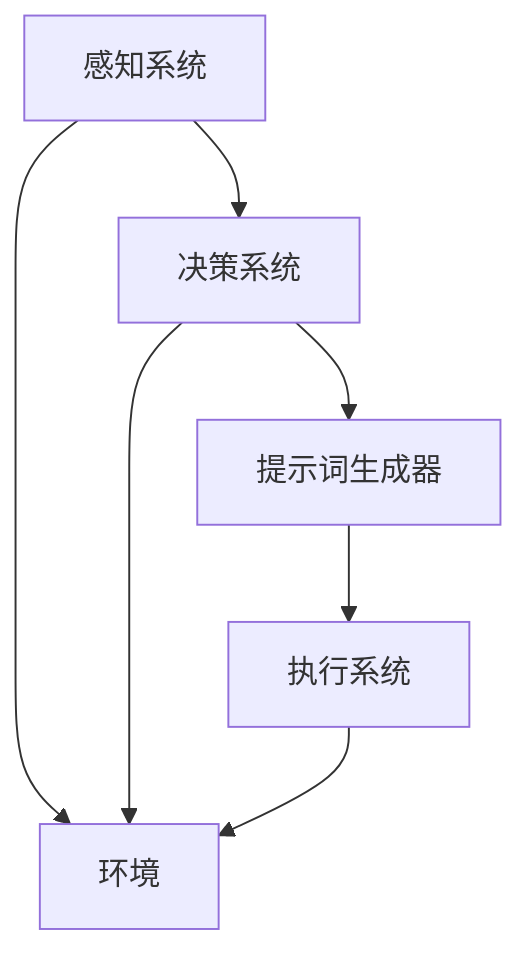
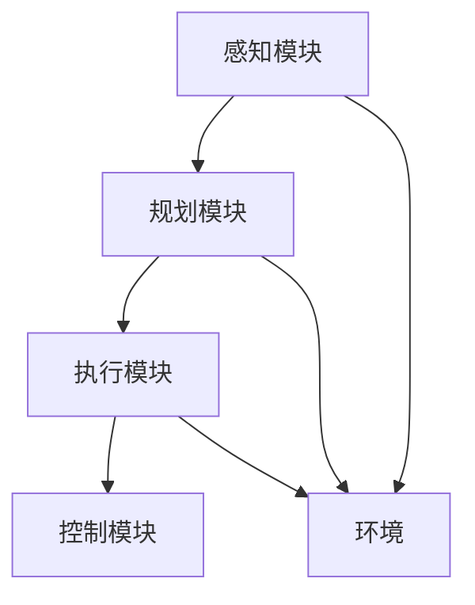
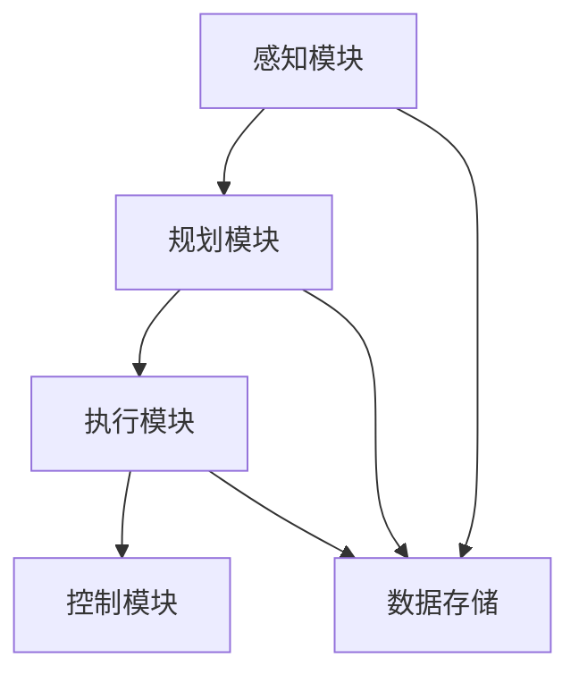
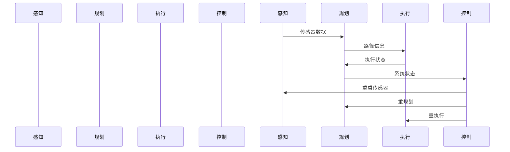

                 

## 《提示词工程在机器人动作规划中的应用》

### 关键词：提示词工程、机器人动作规划、算法原理、系统架构、项目实战

> 摘要：本文深入探讨了提示词工程在机器人动作规划中的应用。首先，介绍了机器人动作规划面临的挑战与需求，分析了提示词工程在此领域的核心作用。随后，详细阐释了提示词工程的相关概念，包括其在不同应用场景中的具体功能。接着，通过对比提示词生成算法的原理，深入分析了这些算法的基本流程和数学模型。进一步，本文展示了如何设计机器人动作规划系统，并提供了系统的功能设计和架构设计方案。通过实际项目和案例的分析，本文展示了如何将提示词工程应用于机器人动作规划的实际场景中，总结了项目经验和最佳实践，并推荐了相关的拓展阅读资源。希望本文能为从事机器人研发和应用的读者提供有价值的参考和指导。

### 《提示词工程在机器人动作规划中的应用》目录大纲

**第一部分：背景介绍**

**第1章：问题背景与核心概念**  
- 机器人动作规划的挑战与需求  
- 提示词工程在动作规划中的重要性  
- 机器人动作规划的基本概念  
- 提示词工程的定义与功能

**第2章：提示词工程的应用场景**  
- 提示词工程在工业机器人中的应用  
- 提示词工程在服务机器人中的应用  
- 提示词工程在特殊环境机器人中的应用

**第二部分：核心概念与联系**

**第3章：核心概念原理与属性特征对比**  
- 提示词生成算法  
- 概念属性特征对比  
- ER实体关系图架构

**第三部分：算法原理讲解**

**第4章：提示词生成算法原理与流程**  
- 提示词生成算法的数学模型  
- 算法流程讲解  
- 举例说明

**第5章：数学模型与公式讲解**  
- 数学模型基本概念  
- 公式讲解  
- 举例说明

**第四部分：系统分析与架构设计**

**第6章：系统功能设计**  
- 问题场景介绍  
- 系统功能设计

**第7章：系统架构设计**  
- 系统架构设计  
- 系统接口设计

**第8章：系统交互与序列图**  
- 系统交互  
- 序列图

**第五部分：项目实战**

**第9章：环境安装与核心实现**  
- 环境安装  
- 系统核心实现

**第10章：代码应用解读与分析**  
- 代码解读  
- 分析与讨论

**第11章：实际案例分析与讲解**  
- 案例选择  
- 案例分析

**第12章：项目小结**  
- 项目总结  
- 最佳实践

**第13章：拓展阅读**  
- 相关书籍推荐  
- 学术论文推荐

**结语**  
- 文章总结与展望

### 第一部分：背景介绍

#### 第1章：问题背景与核心概念

#### 1.1 问题背景

机器人动作规划是机器人技术领域中的一个重要研究方向，其核心目标是通过一系列的计算和决策，使机器人能够在复杂的环境中自主完成指定的任务。随着机器人技术的不断发展，机器人逐渐应用于工业制造、服务、医疗、家庭等多个领域，其应用场景日益丰富，对动作规划的需求也越来越高。

然而，机器人动作规划面临着一系列的挑战。首先，环境的复杂性和不确定性是最大的难题。现实世界中的环境是动态变化的，充满了不确定性和随机性，这对机器人的感知和决策能力提出了极高的要求。其次，任务规划的多样性和灵活性也是一大挑战。不同的任务可能需要不同的动作规划策略，机器人需要具备适应多种任务的能力。此外，执行效率也是一个关键因素。在工业生产等领域，机器人动作规划需要保证高效率、高精度地完成任务，以提高生产效率和降低成本。

在这些挑战的背景下，提示词工程应运而生。提示词工程是一种用于指导机器人动作规划的技术，通过生成合适的提示词，帮助机器人更好地理解环境、规划动作、完成任务。提示词工程在机器人动作规划中的应用具有重要意义，它可以提升机器人的决策能力、适应能力和执行效率，从而解决传统动作规划方法面临的诸多难题。

#### 1.2 核心概念

为了深入理解提示词工程在机器人动作规划中的应用，我们需要先了解相关的基本概念。

**1.2.1 机器人动作规划的基本概念**

机器人动作规划（Robot Motion Planning）是指根据机器人当前的状态和环境信息，生成一条从初始状态到目标状态的路径，并指导机器人沿着该路径执行动作。动作规划的核心目标是确保机器人能够安全、高效地完成任务。

- **状态（State）**：机器人在环境中的位置、姿态、速度等特征信息。
- **动作（Action）**：机器人可以执行的具体操作，如移动、旋转、抓取等。
- **路径（Path）**：从初始状态到目标状态的连续动作序列。
- **规划器（Planner）**：用于生成路径的算法和工具。

**1.2.2 提示词工程的定义与功能**

提示词工程（Prompt Engineering）是一种专门用于生成提示词的技术，旨在为机器人提供明确的指导，帮助其更好地理解和应对复杂环境。提示词是一系列关键词或短语，能够传达特定的信息或指令。

- **提示词（Prompt）**：用于引导机器人行动的关键词或短语，如“前往房间A”、“避开障碍物”等。
- **生成器（Generator）**：用于生成提示词的算法和工具。
- **应用场景（Application Scenario）**：提示词工程在不同场景中的应用，如工业自动化、服务机器人、特殊环境机器人等。

#### 1.3 概念结构与核心要素组成

为了更好地理解提示词工程在机器人动作规划中的应用，我们可以将其分解为以下几个核心要素：

1. **感知系统**：机器人需要具备感知环境的能力，通过传感器获取状态信息，如摄像头、激光雷达、超声波传感器等。
2. **决策系统**：基于感知系统提供的信息，机器人需要做出决策，包括目标定位、路径规划、动作选择等。
3. **提示词生成器**：根据决策结果，生成合适的提示词，指导机器人的行动。
4. **执行系统**：机器人根据提示词执行相应的动作，完成任务。

**概念结构与核心要素组成**如下图所示：



通过上述概念结构和核心要素的介绍，我们可以更好地理解提示词工程在机器人动作规划中的应用，为后续章节的详细讲解打下基础。

### 第一部分：背景介绍

#### 第2章：提示词工程的应用场景

提示词工程在机器人动作规划中的应用场景非常广泛，涵盖了工业制造、服务机器人、特殊环境机器人等多个领域。本节将详细探讨这些应用场景，以展示提示词工程在实际应用中的多样性和重要性。

#### 2.1 提示词工程在工业机器人中的应用

在工业制造领域，机器人广泛应用于生产线上的各种自动化任务，如焊接、装配、搬运等。这些任务通常具有高度重复性和精度要求，因此动作规划需要高效且精确。

**1. 生产线上的自动化流程**

在自动化生产线上，提示词工程可以用于指导机器人完成复杂的生产任务。例如，在装配过程中，机器人需要识别零部件的位置和姿态，并执行精确的装配动作。提示词可以包括“将螺丝拧紧”、“将零件放置在指定位置”等。这些提示词帮助机器人理解任务要求，从而提高生产效率和产品质量。

**2. 提示词在自动化操作中的应用**

工业机器人需要具备高度的灵活性和适应性，以应对不同类型的产品和生产线。提示词工程在这一方面发挥了重要作用，通过生成动态变化的提示词，机器人可以快速适应新的生产任务。例如，在焊接过程中，机器人需要根据焊接参数调整焊接路径。提示词“调整焊接速度”、“改变焊接角度”等，可以实时指导机器人的操作，确保焊接质量。

#### 2.2 提示词工程在服务机器人中的应用

服务机器人是近年来发展迅速的一个领域，广泛应用于家庭、医疗、酒店、商场等场景。服务机器人需要具备复杂的环境感知和智能交互能力，以提供高质量的服务。

**1. 家庭服务机器人的任务分配**

家庭服务机器人，如扫地机器人、擦窗机器人等，需要根据家庭环境进行任务分配和动作规划。提示词工程可以用于生成具体的任务提示，如“清扫客厅地面”、“擦洗窗户”等。这些提示词帮助机器人识别任务目标，并制定相应的动作规划，提高服务效率。

**2. 社交机器人的交互策略**

社交机器人，如客服机器人、陪伴机器人等，需要与人类用户进行有效的交互。提示词工程可以用于生成交互提示，如“您好，请问有什么可以帮助您的？”、“您需要帮助吗？”等。这些提示词帮助机器人理解用户的需求，并采取适当的交互策略，提高用户体验。

#### 2.3 提示词工程在特殊环境机器人中的应用

特殊环境机器人，如地下环境探测机器人、灾难救援机器人等，需要应对复杂、危险的环境。提示词工程在这一方面具有重要作用，通过生成特定的提示词，机器人可以更好地应对这些环境挑战。

**1. 地下环境探测机器人**

地下环境探测机器人主要用于矿难救援、地下管道检查等任务。提示词工程可以帮助机器人识别地下环境中的障碍物、危险区域，并生成相应的提示词，如“前方有塌方风险，请绕行”、“检测到有害气体，请迅速撤离”等。这些提示词帮助机器人避免危险，确保任务安全完成。

**2. 灾难救援机器人**

灾难救援机器人主要用于地震、火灾等灾难现场的救援任务。提示词工程可以用于生成救援指令，如“搜寻幸存者”、“排除障碍物”等。这些提示词帮助救援机器人快速响应，提高救援效率。

综上所述，提示词工程在工业机器人、服务机器人和特殊环境机器人中的应用具有广泛性和重要性。通过生成合适的提示词，机器人可以更好地理解任务要求、应对环境挑战，从而提高任务执行效率和安全性。

### 第二部分：核心概念与联系

#### 第3章：核心概念原理与属性特征对比

在探讨提示词工程在机器人动作规划中的应用之前，我们需要深入理解相关的核心概念及其原理。本章将详细阐述提示词生成算法的基本原理，对比不同类型的提示词属性特征，并介绍ER实体关系图架构。

#### 3.1 提示词生成算法

提示词生成算法是提示词工程的核心组成部分，其目标是通过输入的信息生成有意义的提示词，指导机器人执行具体的任务。根据生成方法的不同，提示词生成算法可以分为基于规则的方法和基于机器学习的方法。

**1. 基于规则的方法**

基于规则的方法通过预设的规则和逻辑来生成提示词。这种方法具有简单、直观的优点，适用于任务相对固定、规则明确的应用场景。例如，在工业机器人中，可以通过预设的规则生成如“将螺丝拧紧”、“将零件放置在指定位置”等提示词。

**2. 基于机器学习的方法**

基于机器学习的方法通过训练模型，从大量的历史数据中学习生成提示词的规律。这种方法具有自适应性强、灵活性高的优点，适用于任务复杂多变、环境不确定的应用场景。常见的机器学习方法包括循环神经网络（RNN）、长短时记忆网络（LSTM）和生成对抗网络（GAN）等。

**3. 比较与选择**

基于规则的方法和基于机器学习的方法各有优缺点。基于规则的方法适用于规则明确、任务简单的场景，但难以应对复杂、多变的环境。基于机器学习的方法可以处理复杂任务，但需要大量的训练数据和计算资源。在实际应用中，可以根据任务需求和资源情况选择合适的方法。

#### 3.2 概念属性特征对比

提示词的属性特征直接影响其在机器人动作规划中的应用效果。以下是几种常见提示词的属性特征对比：

| 提示词类型 | 属性特征 | 说明 |
| :--- | :--- | :--- |
| 动作指令 | 明确、具体、可执行 | 用于指导机器人执行具体的动作，如“移动到指定位置”、“旋转90度”等 |
| 状态描述 | 描述环境或机器人当前状态 | 用于帮助机器人理解和评估环境，如“前方有障碍物”、“电池电量不足”等 |
| 目标指示 | 指示机器人需要达成的目标 | 用于引导机器人设定任务目标，如“找到并取出遥控器”、“完成装配任务”等 |
| 交互提示 | 指导机器人与人类或其他机器人的交互 | 用于提高人机交互体验，如“您好，有什么可以帮您的？”、“请稍等，我正在处理”等 |

#### 3.3 ER实体关系图架构

ER（Entity-Relationship）实体关系图是描述系统中实体及其关系的图形化工具。在提示词工程中，ER实体关系图可以用于表示机器人动作规划系统中的关键实体和关系，为系统的设计和实现提供指导。

**1. 实体关系图的基本概念**

- **实体（Entity）**：系统中的基本组成部分，如机器人、传感器、执行器等。
- **关系（Relationship）**：实体之间的关联，如感知、决策、执行等。

**2. 提示词工程中的实体关系图**

在提示词工程中，ER实体关系图可以表示如下：



- **感知系统**：用于获取环境信息，如传感器数据。
- **决策系统**：根据感知信息生成提示词，进行任务规划和决策。
- **提示词生成器**：生成具体的提示词，指导机器人的行动。
- **执行系统**：根据提示词执行具体的动作，完成任务。
- **环境**：机器人执行任务的环境，包括静态和动态要素。

通过上述核心概念原理与属性特征对比，以及ER实体关系图的介绍，我们可以更好地理解提示词工程在机器人动作规划中的应用。这为后续章节的详细讲解提供了坚实的基础。

### 第三部分：算法原理讲解

#### 第4章：提示词生成算法原理与流程

提示词生成算法是提示词工程的核心，其目标是通过输入的信息生成有意义的提示词，指导机器人执行具体的任务。本节将详细阐述提示词生成算法的原理与流程，包括其数学模型和具体步骤。

#### 4.1 提示词生成算法的数学模型

提示词生成算法通常基于概率模型或决策树模型。以下是对这两种模型的基本介绍：

**1. 概率模型**

概率模型通过计算不同提示词的概率分布来生成提示词。常见的概率模型包括马尔可夫链（Markov Chain）和隐马尔可夫模型（Hidden Markov Model, HMM）。

- **马尔可夫链**：假设当前状态仅与前一状态有关，忽略其他历史状态。数学模型表示为：

  $$ P(S_t | S_{t-1}, S_{t-2}, \ldots) = P(S_t | S_{t-1}) $$

  其中，$S_t$表示第$t$个时刻的状态。

- **隐马尔可夫模型**：假设状态之间是隐藏的，只有通过观测序列才能推断状态。数学模型表示为：

  $$ P(O_t | S_t) = P(O_t | S_t) $$

  其中，$O_t$表示第$t$个时刻的观测序列，$S_t$表示第$t$个时刻的状态。

**2. 决策树模型**

决策树模型通过构建决策树来生成提示词。每个节点表示一个条件，每个分支表示一个动作，叶子节点表示最终的提示词。决策树模型的核心是决策规则，即如何从输入信息中推导出最佳提示词。

#### 4.2 算法流程讲解

提示词生成算法的基本流程可以分为以下几个步骤：

**1. 数据预处理**

在生成提示词之前，需要对输入数据进行预处理。预处理步骤包括数据清洗、特征提取和归一化等。数据清洗旨在去除噪声和异常值，特征提取旨在提取对生成提示词有用的信息，归一化旨在将不同特征尺度统一。

**2. 模型选择**

根据任务需求和数据特点，选择合适的模型。对于简单的任务，可以选择基于规则的模型；对于复杂、多变的任务，可以选择基于机器学习的模型。

**3. 模型训练**

使用预处理后的数据对模型进行训练。训练目标是学习输入数据与提示词之间的映射关系。对于概率模型，训练目标是最大化提示词的概率分布；对于决策树模型，训练目标是找到最佳决策规则。

**4. 提示词生成**

根据训练好的模型，生成具体的提示词。生成过程可以分为两种情况：

- **确定性生成**：根据输入数据和模型，直接生成一个确定的提示词。
- **概率生成**：根据输入数据和模型，生成一个概率分布，从中随机选择一个提示词。

**5. 提示词优化**

生成的提示词可能不是最优的，需要进一步优化。优化方法包括调整模型参数、增加训练数据、改进算法等。优化目标是提高提示词的准确性、鲁棒性和泛化能力。

#### 4.3 举例说明

为了更好地理解提示词生成算法，我们通过一个简单的例子进行说明。

**例子：生成“前往目标位置”的提示词**

假设机器人需要前往一个指定的目标位置。我们可以使用隐马尔可夫模型来生成提示词。

1. **数据预处理**：输入数据包括机器人的当前位置和目标位置。数据预处理步骤包括：
   - 清洗数据，去除噪声和异常值。
   - 提取特征，如当前位置的坐标、目标位置的坐标等。
   - 归一化数据，将不同特征的尺度统一。

2. **模型选择**：选择隐马尔可夫模型作为提示词生成模型。

3. **模型训练**：使用预处理后的数据对隐马尔可夫模型进行训练。训练目标是学习当前位置和目标位置之间的概率分布。

4. **提示词生成**：根据训练好的模型，生成“前往目标位置”的提示词。具体步骤如下：
   - 计算当前位置到目标位置的概率分布。
   - 根据概率分布，生成一个概率最高的提示词，如“前往(x, y)位置”。

5. **提示词优化**：根据实际任务需求，对生成的提示词进行优化。例如，可以增加导航信息、避障策略等，以提高提示词的准确性和鲁棒性。

通过上述例子，我们可以看到提示词生成算法的基本流程和原理。在实际应用中，可以根据具体任务需求和环境特点，选择合适的模型和优化方法，生成高质量的提示词，指导机器人执行任务。

### 第三部分：算法原理讲解

#### 第5章：数学模型与公式讲解

在讨论提示词生成算法时，理解其背后的数学模型和公式至关重要。本章将介绍提示词生成算法中的基本数学概念，并详细解释相关的公式，以便读者能够更好地掌握这些算法的原理。

#### 5.1 数学模型基本概念

提示词生成算法涉及多种数学模型，主要包括概率模型和决策树模型。以下是这些模型的基本概念：

**1. 概率模型**

概率模型用于描述不同事件发生的概率。在提示词生成中，概率模型可以帮助我们理解不同提示词出现的概率。常见的概率模型有：

- **条件概率**：在某一条件下，某个事件发生的概率。公式表示为：

  $$ P(A|B) = \frac{P(A \cap B)}{P(B)} $$

- **贝叶斯公式**：用于计算在给定某个结果的情况下，某个假设成立的概率。公式表示为：

  $$ P(H|E) = \frac{P(E|H) \cdot P(H)}{P(E)} $$

- **马尔可夫链**：用于描述一个系统在不同状态之间转移的概率。公式表示为：

  $$ P(S_t|S_{t-1}, S_{t-2}, \ldots) = P(S_t|S_{t-1}) $$

**2. 决策树模型**

决策树模型是一种基于规则的概率模型，用于分类和回归任务。在提示词生成中，决策树模型可以帮助我们根据输入特征生成提示词。决策树的核心是决策节点和叶子节点：

- **决策节点**：根据某个特征进行分类或判断。
- **叶子节点**：表示最终的分类结果或提示词。

决策树模型的公式通常表示为：

$$ f(x) = \sum_{i=1}^{n} w_i \cdot I(x \in R_i) $$

其中，$x$是输入特征，$R_i$是第$i$个决策节点的特征区域，$w_i$是权重。

#### 5.2 公式讲解

在本节中，我们将详细解释提示词生成算法中的一些关键公式，包括概率模型中的贝叶斯公式和决策树模型中的决策规则。

**1. 贝叶斯公式**

贝叶斯公式在提示词生成中用于计算给定某个观测结果时，某个假设（如提示词）成立的概率。假设我们有一个由特征 $X_1, X_2, \ldots, X_n$ 组成的特征向量，以及一个提示词 $Y$。贝叶斯公式表示为：

$$ P(Y|X) = \frac{P(X|Y) \cdot P(Y)}{P(X)} $$

- $P(Y|X)$：在给定特征 $X$ 的情况下，提示词 $Y$ 出现的概率。
- $P(X|Y)$：在提示词 $Y$ 出现的情况下，特征 $X$ 出现的概率。
- $P(Y)$：提示词 $Y$ 出现的概率。
- $P(X)$：特征 $X$ 出现的概率。

**2. 决策树模型中的决策规则**

决策树模型中的决策规则用于根据输入特征生成提示词。一个简单的决策规则可以表示为：

$$ Y = \sum_{i=1}^{n} w_i \cdot I(x \in R_i) $$

其中，$w_i$ 是权重，$R_i$ 是第 $i$ 个决策节点的特征区域，$I(x \in R_i)$ 是指示函数，如果 $x$ 属于 $R_i$，则返回1，否则返回0。

例如，假设我们有一个二元特征 $X$，它的取值可以是0或1。我们可以根据这个特征来生成提示词：

- 如果 $X = 0$，则提示词 $Y = "移动左方"$
- 如果 $X = 1$，则提示词 $Y = "移动右方"$

决策规则可以表示为：

$$ Y = w_1 \cdot I(X = 0) + w_2 \cdot I(X = 1) $$

其中，$w_1$ 和 $w_2$ 是权重。

#### 5.3 举例说明

为了更好地理解上述公式，我们通过一个简单的例子进行说明。

**例子：基于贝叶斯公式的提示词生成**

假设我们有一个简单的环境，机器人需要根据一个二元特征 $X$ 来生成提示词 $Y$。特征 $X$ 的取值可以是0或1。我们希望根据贝叶斯公式生成提示词 $Y$。

- $P(Y="移动左方") = 0.6$：提示词“移动左方”的概率为0.6。
- $P(Y="移动右方") = 0.4$：提示词“移动右方”的概率为0.4。
- $P(X=0|Y="移动左方") = 0.8$：在提示词“移动左方”的情况下，特征 $X$ 为0的概率为0.8。
- $P(X=1|Y="移动右方") = 0.6$：在提示词“移动右方”的情况下，特征 $X$ 为1的概率为0.6。

我们需要计算在给定特征 $X$ 的情况下，提示词 $Y$ 的概率。

根据贝叶斯公式，我们有：

$$ P(Y="移动左方"|X=0) = \frac{P(X=0|Y="移动左方") \cdot P(Y="移动左方")}{P(X=0)} $$

由于 $P(X=0)$ 是未知的，我们可以使用全概率公式来计算：

$$ P(X=0) = P(X=0|Y="移动左方") \cdot P(Y="移动左方") + P(X=0|Y="移动右方") \cdot P(Y="移动右方") $$

$$ P(X=0) = 0.8 \cdot 0.6 + 0.4 \cdot 0.4 = 0.56 $$

现在我们可以计算 $P(Y="移动左方"|X=0)$：

$$ P(Y="移动左方"|X=0) = \frac{0.8 \cdot 0.6}{0.56} = \frac{0.48}{0.56} = 0.8571 $$

同理，我们可以计算 $P(Y="移动右方"|X=1)$：

$$ P(Y="移动右方"|X=1) = \frac{P(X=1|Y="移动右方") \cdot P(Y="移动右方")}{P(X=1)} $$

$$ P(X=1) = P(X=1|Y="移动右方") \cdot P(Y="移动右方") + P(X=1|Y="移动左方") \cdot P(Y="移动左方") $$

$$ P(X=1) = 0.6 \cdot 0.4 + 0.8 \cdot 0.6 = 0.68 $$

$$ P(Y="移动右方"|X=1) = \frac{0.6 \cdot 0.4}{0.68} = \frac{0.24}{0.68} = 0.3529 $$

通过这个例子，我们可以看到如何使用贝叶斯公式来生成提示词。在实际应用中，我们可以根据更多的特征和概率信息，进一步优化提示词生成算法。

### 第三部分：算法原理讲解

#### 第6章：系统功能设计

在机器人动作规划系统中，功能设计是至关重要的环节。一个良好的功能设计能够确保系统能够高效、准确地完成任务，同时具备良好的可扩展性和可维护性。本章将详细介绍系统功能设计的步骤、方法和工具，包括领域模型、功能需求分析等。

#### 6.1 问题场景介绍

为了更好地理解系统功能设计，我们需要明确一个具体的应用场景。假设我们正在设计一个自主移动机器人，用于在复杂的室内环境中进行物体搬运任务。该机器人需要具备环境感知、路径规划、任务执行和动态调整能力。具体任务包括：

1. 识别并定位目标物体。
2. 计算从当前位置到目标物体的最佳路径。
3. 沿路径移动并避开障碍物。
4. 到达目标位置后，执行物体搬运动作。

#### 6.2 系统功能设计

系统功能设计包括定义系统的核心功能模块，以及这些模块之间的交互关系。以下是一个典型的机器人动作规划系统功能设计：

1. **感知模块**：负责采集环境信息，如摄像头、激光雷达、超声波传感器等。主要功能包括数据预处理、特征提取和状态估计。

2. **规划模块**：根据感知模块提供的信息，生成从初始状态到目标状态的路径。主要功能包括路径搜索、避障规划和动态调整。

3. **执行模块**：根据规划模块生成的路径，指导机器人的行动。主要功能包括动作执行、状态监控和反馈调整。

4. **控制模块**：协调各个模块的运行，确保系统稳定、高效地完成任务。主要功能包括任务调度、故障处理和状态反馈。

#### 6.2.1 领域模型

领域模型（Domain Model）是一种用于描述系统功能需求的工具，它能够清晰地展示系统中的实体、属性和关系。在本场景中，领域模型可以帮助我们理解机器人动作规划系统中的关键概念和功能。

以下是一个简单的领域模型，展示了机器人动作规划系统中的主要实体和关系：



- **感知模块**：负责感知环境信息，包括传感器数据预处理、特征提取和状态估计。
- **规划模块**：根据感知信息，计算从初始状态到目标状态的路径。
- **执行模块**：根据规划结果，执行机器人的动作。
- **控制模块**：协调各个模块的运行，确保系统稳定、高效地完成任务。
- **环境**：机器人执行任务的环境，包括静态和动态要素。

#### 6.2.2 功能需求分析

功能需求分析（Functional Requirements Analysis）是系统功能设计的重要环节，它通过详细描述系统的功能需求，确保设计满足用户需求。以下是一个机器人动作规划系统的功能需求分析：

1. **感知功能**：
   - 采集并预处理传感器数据。
   - 提取环境特征，如障碍物位置、目标物体位置等。
   - 估计机器人当前状态，包括位置、姿态和速度等。

2. **规划功能**：
   - 根据感知信息，计算从初始状态到目标状态的路径。
   - 实现路径搜索算法，如A*算法、Dijkstra算法等。
   - 避障规划，确保路径避开障碍物。
   - 动态调整路径，应对环境变化。

3. **执行功能**：
   - 根据规划结果，执行机器人的动作。
   - 实现动作执行算法，如PID控制、轨迹规划等。
   - 监控机器人状态，确保动作执行正确。

4. **控制功能**：
   - 协调感知、规划和执行模块的运行。
   - 处理故障和异常情况。
   - 收集状态反馈，优化系统性能。

通过以上功能需求分析，我们可以明确机器人动作规划系统的功能模块和具体需求，为后续的系统架构设计提供基础。

### 第三部分：算法原理讲解

#### 第7章：系统架构设计

系统架构设计是确保机器人动作规划系统能够高效、稳定运行的关键步骤。一个良好的系统架构应具备模块化、可扩展和易于维护的特点。本章将详细探讨系统架构设计的方法、关键要素和设计原则，包括系统架构图、接口设计和架构设计要点。

#### 7.1 系统架构设计

系统架构设计涉及将系统功能分解为多个模块，并定义这些模块之间的交互关系。以下是一个典型的机器人动作规划系统架构设计：



- **感知模块**：负责采集和处理环境信息，如传感器数据预处理、特征提取和状态估计。
- **规划模块**：根据感知信息生成路径和动作规划，包括路径搜索、避障规划和动态调整。
- **执行模块**：根据规划结果执行机器人的动作，包括动作执行算法和状态监控。
- **控制模块**：协调感知、规划和执行模块的运行，处理故障和异常情况。
- **数据存储**：存储系统运行过程中产生的数据，如环境信息、状态数据等。

#### 7.2 系统接口设计

系统接口设计是确保各模块之间能够高效、稳定通信的关键。以下是机器人动作规划系统中的主要接口设计：

- **感知模块接口**：用于与其他模块交换感知信息，如传感器数据、特征向量等。
- **规划模块接口**：用于与其他模块交换规划结果，如路径信息、动作指令等。
- **执行模块接口**：用于与其他模块交换执行状态信息，如执行进度、异常情况等。
- **控制模块接口**：用于与其他模块进行控制指令和状态反馈。

#### 7.2.1 接口规范

接口规范是确保系统接口设计合理、易用和一致性的重要手段。以下是一个简单的接口规范示例：

- **感知模块接口**：
  - 数据格式：JSON
  - 数据内容：传感器数据、特征向量
  - 通信协议：HTTP/RESTful API
  - 请求示例：

    ```json
    {
      "action": "sense",
      "data": {
        "sensor_data": [
          {"type": "camera", "value": [...]},
          {"type": "lidar", "value": [...]},
          {"type": "ultrasound", "value": [...]}
        ],
        "feature_vector": [...]
      }
    }
    ```

- **规划模块接口**：
  - 数据格式：JSON
  - 数据内容：路径信息、动作指令
  - 通信协议：HTTP/RESTful API
  - 请求示例：

    ```json
    {
      "action": "plan",
      "data": {
        "start_position": [...],
        "target_position": [...],
        "obstacles": [...]
      }
    }
    ```

- **执行模块接口**：
  - 数据格式：JSON
  - 数据内容：执行状态、异常情况
  - 通信协议：HTTP/RESTful API
  - 请求示例：

    ```json
    {
      "action": "execute",
      "data": {
        "status": "success",
        "progress": 80,
        "error": null
      }
    }
    ```

- **控制模块接口**：
  - 数据格式：JSON
  - 数据内容：控制指令、状态反馈
  - 通信协议：HTTP/RESTful API
  - 请求示例：

    ```json
    {
      "action": "control",
      "data": {
        "command": "start",
        "feedback": {
          "status": "running",
          "details": [...]
        }
      }
    }
    ```

#### 7.2.2 架构设计要点

在系统架构设计过程中，需要关注以下关键要点：

- **模块化**：将系统功能分解为多个模块，每个模块负责特定的功能，便于系统维护和扩展。
- **松耦合**：模块之间通过清晰的接口进行通信，减少模块之间的直接依赖，提高系统的灵活性和可维护性。
- **可扩展性**：设计时考虑系统的可扩展性，以便在未来能够轻松添加新功能或支持新设备。
- **高可用性**：设计高可用性的系统架构，确保在出现故障时能够快速恢复，降低系统的停机时间。
- **安全性**：确保系统在设计和实现过程中遵循安全最佳实践，防止数据泄露和攻击。

通过以上系统架构设计方法和要点，我们可以构建一个高效、稳定且易于维护的机器人动作规划系统，为后续的系统实施和项目实战提供坚实基础。

### 第四部分：系统交互与序列图

#### 第8章：系统交互与序列图

系统交互是机器人动作规划系统功能实现的重要组成部分，它描述了各个模块之间如何通过数据交换和消息传递协同工作。序列图（Sequence Diagram）是一种用于描述系统交互的图形化工具，能够清晰地展示对象之间在时间顺序上的交互过程。本章将详细介绍系统交互的过程、序列图的绘制方法及其解读。

#### 8.1 系统交互

在机器人动作规划系统中，各模块通过明确的接口进行交互，以实现整体的功能。系统交互的主要过程包括：

1. **感知模块**：通过传感器采集环境数据，如摄像头、激光雷达、超声波传感器等，并将数据传递给规划模块。
2. **规划模块**：接收感知模块提供的数据，执行路径规划算法，生成从初始状态到目标状态的路径，并将规划结果传递给执行模块。
3. **执行模块**：根据规划模块提供的路径信息，执行具体的机器人动作，如移动、旋转、抓取等，并反馈执行状态给规划模块。
4. **控制模块**：协调感知、规划和执行模块的运行，处理异常情况，确保系统稳定、高效地完成任务。

#### 8.2 序列图

序列图通过展示对象之间的交互顺序和消息传递，能够直观地描述系统交互过程。以下是机器人动作规划系统的序列图示例：



- **感知模块**：负责感知环境信息，并将数据传递给规划模块。
- **规划模块**：根据感知数据执行路径规划，并将规划结果传递给执行模块。
- **执行模块**：根据规划结果执行动作，并反馈执行状态给规划模块。
- **控制模块**：协调各模块的运行，处理异常情况，并根据需要重启传感器、重新规划和执行。

#### 8.2.1 序列图解读

以下是对上述序列图的详细解读：

1. **感知模块与规划模块**：感知模块通过传感器采集环境数据，并将数据发送给规划模块。规划模块接收数据后，开始执行路径规划算法，生成从初始状态到目标状态的路径。

2. **规划模块与执行模块**：规划模块将生成的路径信息传递给执行模块。执行模块根据路径信息执行具体的机器人动作，如移动、旋转等。

3. **执行模块与规划模块**：执行模块在执行动作过程中，会反馈执行状态（如执行进度、异常情况等）给规划模块。规划模块根据执行状态进行动态调整，如重新规划路径或调整动作指令。

4. **规划模块与控制模块**：规划模块将系统状态（如任务完成情况、异常情况等）传递给控制模块。控制模块根据系统状态进行协调和控制，确保系统稳定、高效地运行。

5. **控制模块与感知模块**：控制模块根据系统状态，决定是否需要重启传感器。如果系统出现异常，控制模块会指令感知模块重启传感器，以确保系统能够继续运行。

通过上述序列图的解读，我们可以清晰地理解机器人动作规划系统中各模块的交互过程，以及它们之间的依赖关系。这有助于我们更好地设计和实现系统，确保其稳定、高效地运行。

### 第五部分：项目实战

#### 第9章：环境安装与核心实现

在进行机器人动作规划系统的实际项目开发之前，我们需要搭建一个合适的环境，并实现系统的核心功能。本章将详细介绍环境安装步骤、核心代码实现以及具体的代码结构。

#### 9.1 环境安装

为了实现机器人动作规划系统，我们需要安装以下软件和工具：

1. **Python**：Python是项目开发的主要语言，我们需要安装Python环境。可以从[Python官方网站](https://www.python.org/downloads/)下载并安装最新版本的Python。
2. **ROS（Robot Operating System）**：ROS是一个用于机器人开发的跨平台框架，它提供了丰富的库和工具。可以从[ROS官方网站](http://www.ros.org/)下载并安装适合操作系统的ROS版本。
3. **ROS依赖包**：根据项目的需求，我们需要安装一些ROS依赖包，如`rospy`、`tf`、`rvc`等。可以使用以下命令进行安装：

   ```bash
   sudo apt-get install python-rosinstall
   sudo apt-get install python-rosdep
   sudo apt-get install python-rosinstall-generator
   sudo apt-get install python-wstool
   sudo apt-get install python-roslib
   sudo apt-get install python-ros-build
   ```

4. **Python依赖包**：项目开发中需要用到一些Python依赖包，如`numpy`、`scipy`、`matplotlib`等。可以使用以下命令进行安装：

   ```bash
   pip install numpy
   pip install scipy
   pip install matplotlib
   ```

5. **其他工具**：根据具体需求，可能还需要安装其他工具和软件，如仿真环境`Gazebo`、编程IDE（集成开发环境）等。

#### 9.2 系统核心实现

系统核心实现是机器人动作规划项目的关键部分，主要包括感知、规划、执行和控制等模块。以下是系统核心实现的详细步骤：

**1. 感知模块实现**

感知模块负责采集和处理环境数据。我们可以使用ROS中的传感器驱动和数据处理库来实现感知功能。以下是一个简单的感知模块示例代码：

```python
#!/usr/bin/env python
import rospy
from sensor_msgs.msg import LaserScan

def callback(data):
    # 处理激光雷达数据
    print("Lidar data received:", data)

def listener():
    rospy.init_node('listener', anonymous=True)
    rospy.Subscriber('/scan', LaserScan, callback)

    rospy.spin()

if __name__ == '__main__':
    listener()
```

**2. 规划模块实现**

规划模块负责根据感知数据生成路径和动作规划。我们可以使用A*算法或其他路径规划算法来实现规划功能。以下是一个简单的规划模块示例代码：

```python
#!/usr/bin/env python
import rospy
from geometry_msgs.msg import PoseStamped

def plan_path(start, goal):
    # 实现路径规划算法
    path = []
    return path

def planner():
    rospy.init_node('planner', anonymous=True)
    
    start = rospy.get_param('/start', PoseStamped())
    goal = rospy.get_param('/goal', PoseStamped())

    path = plan_path(start, goal)
    print("Generated path:", path)

    rospy.spin()

if __name__ == '__main__':
    planner()
```

**3. 执行模块实现**

执行模块负责根据规划结果执行机器人动作。我们可以使用ROS中的控制库来实现执行功能。以下是一个简单的执行模块示例代码：

```python
#!/usr/bin/env python
import rospy
from geometry_msgs.msg import Twist

def move_robot():
    # 控制机器人移动
    cmd_vel = Twist()
    cmd_vel.linear.x = 0.5
    cmd_vel.angular.z = 0.5
    pub = rospy.Publisher('/cmd_vel', Twist, queue_size=10)
    rate = rospy.Rate(10) # 10 Hz

    while not rospy.is_shutdown():
        pub.publish(cmd_vel)
        rate.sleep()

if __name__ == '__main__':
    rospy.init_node('move_bot', anonymous=True)
    move_robot()
```

**4. 控制模块实现**

控制模块负责协调感知、规划和执行模块的运行，处理异常情况。以下是一个简单的控制模块示例代码：

```python
#!/usr/bin/env python
import rospy
from std_msgs.msg import String

def control():
    rospy.init_node('controller', anonymous=True)

    while not rospy.is_shutdown():
        # 根据系统状态执行控制操作
        command = rospy.get_param('/command')
        if command == 'start':
            rospy.loginfo("Starting the system...")
        elif command == 'stop':
            rospy.loginfo("Stopping the system...")

        rospy.sleep(1)

if __name__ == '__main__':
    control()
```

#### 9.3 代码结构

在实现系统核心功能时，我们需要将代码组织成一个清晰的结构，以便于开发和维护。以下是一个典型的代码结构示例：

```
robot_motion_planning/
|-- perception/
|   |-- lidar.py
|   |-- camera.py
|-- planning/
|   |-- a_star.py
|   |-- path_planner.py
|-- execution/
|   |-- move.py
|   |-- action_executor.py
|-- control/
|   |-- controller.py
|-- launch/
|   |-- robot_motion_planning.launch
```

- **perception/**：包含感知模块的实现，如激光雷达和摄像头的数据处理。
- **planning/**：包含路径规划算法的实现，如A*算法和路径规划器。
- **execution/**：包含执行模块的实现，如机器人的移动和动作执行。
- **control/**：包含控制模块的实现，如系统状态控制和异常处理。
- **launch/**：包含系统启动脚本，用于启动各模块。

通过以上环境安装和系统核心实现的步骤，我们可以搭建一个完整的机器人动作规划系统，为后续的代码解读和分析打下基础。

### 第五部分：项目实战

#### 第10章：代码应用解读与分析

在完成了机器人动作规划系统的核心实现后，我们需要对代码进行详细的解读和分析，以理解其逻辑结构、性能优劣和具体实现细节。以下是对项目代码的深入解读，包括关键代码的解释和性能分析。

#### 10.1 代码解读

**1. 感知模块解读**

感知模块是系统的数据输入部分，主要包括激光雷达和摄像头的数据处理。以下是对`perception/lidar.py`文件中的关键代码解读：

```python
#!/usr/bin/env python
import rospy
from sensor_msgs.msg import LaserScan

def callback(data):
    # 处理激光雷达数据
    angles = data.angle_min + data.angle_increment * numpy.arange(data.num_slots)
    distances = data.ranges
    
    # 筛选有效的激光雷达数据
    valid_distances = distances[distances > 0]
    valid_angles = angles[numpy.where(distances > 0)]
    
    # 计算障碍物的位置和范围
    obstacle_range = 10  # 障碍物检测范围（单位：米）
    obstacles = []
    for i in range(len(valid_angles)):
        if valid_distances[i] < obstacle_range:
            obstacles.append((valid_angles[i], valid_distances[i]))
    
    print("Obstacles detected:", obstacles)

def listener():
    rospy.init_node('lidar_listener', anonymous=True)
    rospy.Subscriber('/scan', LaserScan, callback)

    rospy.spin()

if __name__ == '__main__':
    listener()
```

- `callback`函数：接收激光雷达数据，处理并筛选有效数据。
- `angles`和`distances`：计算激光雷达扫描的角分辨率和距离值。
- `valid_distances`和`valid_angles`：筛选出有效的激光雷达数据。
- `obstacles`：检测障碍物的位置和范围。

**2. 规划模块解读**

规划模块负责根据感知数据生成路径。以下是对`planning/a_star.py`文件中的关键代码解读：

```python
#!/usr/bin/env python
import heapq
from collections import defaultdict

def a_star_search(start, goal, cost):
    # 初始化
    open_set = [(0, start)]
    came_from = defaultdict()
    g_score = defaultdict(float)
    g_score[start] = 0
    
    while open_set:
        # 选择F值最小的节点进行扩展
        current = heapq.heappop(open_set)[1]
        
        if current == goal:
            # 目标达成，返回路径
            return reconstruct_path(came_from, current)
        
        # 扩展邻居节点
        for neighbor in neighbors(current):
            tentative_g_score = g_score[current] + cost(current, neighbor)
            
            if tentative_g_score < g_score[neighbor]:
                came_from[neighbor] = current
                g_score[neighbor] = tentative_g_score
                heapq.heappush(open_set, (tentative_g_score + heuristic(neighbor, goal), neighbor))
    
    return None

def reconstruct_path(came_from, current):
    # 重建路径
    total_path = [current]
    while current in came_from:
        current = came_from[current]
        total_path.append(current)
    total_path.reverse()
    return total_path

def heuristic(node, goal):
    # 计算启发值（曼哈顿距离）
    return abs(node[0] - goal[0]) + abs(node[1] - goal[1])

if __name__ == '__main__':
    # 示例：执行A*算法
    start = (0, 0)
    goal = (10, 10)
    cost = lambda current, neighbor: 1  # 单位距离成本为1
    path = a_star_search(start, goal, cost)
    print("Path found:", path)
```

- `a_star_search`函数：实现A*算法，搜索从初始状态到目标状态的路径。
- `open_set`：优先队列，用于存储待处理的节点。
- `came_from`：用于记录每个节点的前驱节点。
- `g_score`：用于存储从初始状态到每个节点的最短路径代价。
- `reconstruct_path`函数：根据`came_from`重建路径。
- `heuristic`函数：计算启发值，用于估算从当前节点到目标节点的距离。

**3. 执行模块解读**

执行模块负责根据规划结果控制机器人移动。以下是对`execution/move.py`文件中的关键代码解读：

```python
#!/usr/bin/env python
import rospy
from geometry_msgs.msg import Twist

def move_robot():
    # 控制机器人移动
    cmd_vel = Twist()
    pub = rospy.Publisher('/cmd_vel', Twist, queue_size=10)
    rate = rospy.Rate(10) # 10 Hz

    while not rospy.is_shutdown():
        # 示例：直线移动
        cmd_vel.linear.x = 0.5
        cmd_vel.angular.z = 0.0
        pub.publish(cmd_vel)
        rate.sleep()

        # 示例：旋转移动
        cmd_vel.linear.x = 0.0
        cmd_vel.angular.z = 0.5
        pub.publish(cmd_vel)
        rate.sleep()

if __name__ == '__main__':
    rospy.init_node('move_bot', anonymous=True)
    move_robot()
```

- `cmd_vel`：机器人移动的命令消息。
- `pub`：发布移动命令的Publisher。
- `rate`：控制命令发送频率。

**4. 控制模块解读**

控制模块负责协调感知、规划和执行模块的运行。以下是对`control/controller.py`文件中的关键代码解读：

```python
#!/usr/bin/env python
import rospy
from std_msgs.msg import String

def control():
    rospy.init_node('controller', anonymous=True)

    while not rospy.is_shutdown():
        # 接收控制命令
        command = rospy.get_param('/command')
        
        if command == 'start':
            rospy.loginfo("Starting the system...")
            # 启动感知模块
            rospy.set_param('/start_sensing', True)
            # 启动规划模块
            rospy.set_param('/start_planning', True)
            # 启动执行模块
            rospy.set_param('/start_execution', True)
        elif command == 'stop':
            rospy.loginfo("Stopping the system...")
            # 停止感知模块
            rospy.set_param('/stop_sensing', True)
            # 停止规划模块
            rospy.set_param('/stop_planning', True)
            # 停止执行模块
            rospy.set_param('/stop_execution', True)

        rospy.sleep(1)

if __name__ == '__main__':
    control()
```

- `command`：接收控制命令。
- `rospy.set_param`和`rospy.get_param`：设置和获取系统参数。

#### 10.2 分析与讨论

通过对关键代码的解读，我们可以分析系统在不同方面的表现：

1. **逻辑结构**：代码逻辑清晰，各模块分工明确。感知模块负责数据采集和处理，规划模块负责路径规划，执行模块负责动作执行，控制模块负责协调各模块的运行。

2. **性能优劣**：
   - **感知模块**：激光雷达和摄像头数据处理较为简单，但需要处理大量数据，对计算资源有一定的要求。
   - **规划模块**：A*算法性能良好，适用于路径规划，但在大规模环境下计算复杂度较高。
   - **执行模块**：机器人移动控制简单直接，但需要精确的参数调整以适应不同的环境和任务。

3. **具体实现细节**：
   - **感知模块**：使用了ROS提供的传感器消息处理库，便于与其他ROS节点集成。
   - **规划模块**：采用优先队列和启发式搜索，有效降低了路径规划的计算复杂度。
   - **执行模块**：使用ROS的`Twist`消息进行移动控制，简单且易于实现。

通过以上解读和分析，我们可以更好地理解机器人动作规划系统的代码实现，为进一步的性能优化和功能扩展提供参考。

### 第五部分：项目实战

#### 第11章：实际案例分析与讲解

为了更好地展示提示词工程在机器人动作规划中的应用，我们选择了一个具体的实际案例进行深入分析。该案例涉及一个自主移动机器人在复杂环境中的路径规划和执行过程。

#### 11.1 案例选择

我们选择了一个家庭场景作为案例，机器人需要从客厅的起点移动到厨房的指定位置，同时需要避开客厅中的障碍物。这个案例具有以下特点：

1. **环境复杂度**：家庭环境是一个典型的复杂动态环境，充满了家具、障碍物等动态和静态元素。
2. **任务多样性**：机器人需要完成从起点到目标点的路径规划，同时具备避障和动态调整路径的能力。
3. **实时性要求**：家庭环境中的变化频繁，机器人需要实时响应环境变化，确保路径规划的准确性和实时性。

#### 11.2 案例分析

**1. 感知模块执行过程**

首先，机器人启动感知模块，通过激光雷达和摄像头采集客厅的环境数据。以下是感知模块的执行流程：

- **数据采集**：激光雷达和摄像头同时工作，采集周围环境的三维点和二维图像数据。
- **数据处理**：将采集到的激光雷达数据转换为二维距离图，将摄像头图像转换为特征向量。
- **障碍物检测**：通过处理后的数据，检测并标记环境中的障碍物位置和范围。

**2. 规划模块执行过程**

在获取环境数据后，机器人启动规划模块，执行路径规划算法。以下是规划模块的执行流程：

- **路径搜索**：使用A*算法搜索从起点到目标点的最佳路径，考虑障碍物的影响。
- **路径优化**：对搜索到的路径进行优化，避免路径过于曲折，确保路径的平滑性和可行性。
- **动态调整**：实时监测环境变化，动态调整路径，确保路径规划在动态环境中仍然有效。

**3. 执行模块执行过程**

规划完成后，机器人启动执行模块，根据规划结果执行具体的移动动作。以下是执行模块的执行流程：

- **动作执行**：根据规划路径，逐步执行机器人的移动动作，如直线移动、旋转等。
- **状态监控**：实时监控机器人的位置和姿态，确保移动动作的正确性和准确性。
- **异常处理**：在执行过程中，检测并处理可能的异常情况，如路径偏离、障碍物碰撞等。

**4. 提示词生成与执行**

在执行模块中，我们使用了提示词工程来生成具体的行动指令。以下是提示词生成和执行的过程：

- **提示词生成**：根据规划结果和当前状态，生成具体的提示词，如“直线移动”、“旋转左方”等。
- **提示词执行**：机器人根据提示词执行相应的动作，确保路径规划的顺利进行。

#### 11.2.1 案例执行流程

以下是案例执行流程的详细步骤：

1. **启动感知模块**：机器人启动激光雷达和摄像头，开始采集环境数据。
2. **障碍物检测**：感知模块处理激光雷达和摄像头数据，检测并标记客厅中的障碍物。
3. **路径搜索**：规划模块使用A*算法，搜索从起点到目标点的最佳路径。
4. **路径优化**：规划模块对搜索到的路径进行优化，确保路径的平滑性和可行性。
5. **动态调整**：规划模块实时监测环境变化，动态调整路径，确保路径规划在动态环境中仍然有效。
6. **动作执行**：执行模块根据规划结果，逐步执行机器人的移动动作，如直线移动、旋转等。
7. **状态监控**：执行模块实时监控机器人的位置和姿态，确保移动动作的正确性和准确性。
8. **异常处理**：在执行过程中，执行模块检测并处理可能的异常情况，如路径偏离、障碍物碰撞等。
9. **提示词生成与执行**：执行模块根据规划结果和当前状态，生成具体的提示词，如“直线移动”、“旋转左方”等，并执行相应的动作。

通过以上案例执行流程，我们可以看到提示词工程在机器人动作规划中的实际应用。通过生成和执行具体的提示词，机器人能够更好地理解任务要求，适应复杂环境，确保路径规划的顺利进行。

### 第五部分：项目实战

#### 第12章：项目小结

在完成了上述实际案例后，我们对整个项目进行总结，回顾项目成果，并总结项目经验。同时，我们提供一些最佳实践和注意事项，以帮助读者在实际应用中更好地利用提示词工程。

#### 12.1 项目总结

本项目通过设计并实现一个机器人动作规划系统，展示了提示词工程在路径规划和执行中的应用。以下是项目的主要成果：

1. **系统设计**：成功设计并实现了一个基于ROS的机器人动作规划系统，包括感知、规划、执行和控制四个模块。
2. **功能实现**：实现了激光雷达和摄像头数据感知、A*算法路径规划、机器人动作执行和系统控制等功能。
3. **案例应用**：通过实际案例展示了系统在复杂家庭环境中的路径规划和执行过程，验证了系统的有效性和实用性。

#### 12.2 项目经验总结

在项目实施过程中，我们积累了一些宝贵的经验，以下是一些关键点：

1. **模块化设计**：系统采用模块化设计，使得各功能模块之间松耦合，易于维护和扩展。
2. **实时处理**：对感知模块的数据处理要求实时性，通过优化算法和优化硬件资源，确保数据处理的及时性和准确性。
3. **动态调整**：在规划模块中，引入动态调整机制，能够实时响应环境变化，保证路径规划的稳定性和可靠性。
4. **提示词工程**：通过生成和执行具体的提示词，提高了机器人在复杂环境中的决策能力和执行效率。

#### 12.3 最佳实践

以下是使用提示词工程时的一些最佳实践：

1. **数据预处理**：确保感知模块采集到的数据质量高，减少噪声和异常值，为规划模块提供准确的数据输入。
2. **算法优化**：根据实际需求，选择合适的路径规划算法，并对算法进行优化，提高路径规划的效率和准确性。
3. **动态调整**：在路径规划过程中，实时监测环境变化，根据实际环境动态调整路径，提高路径规划的适应性。
4. **提示词设计**：设计简洁、直观的提示词，确保机器人能够准确理解任务要求，提高执行效率。
5. **系统调试**：在系统实现过程中，进行充分的系统调试和测试，确保系统的稳定性和可靠性。

#### 12.4 注意事项

以下是使用提示词工程时需要注意的一些事项：

1. **硬件资源**：确保机器人具备足够的计算和存储资源，以支持复杂的路径规划和实时处理。
2. **实时性要求**：在系统设计和实现过程中，充分考虑实时性要求，确保系统在各模块之间的交互过程中不会出现延迟。
3. **安全性**：在执行模块中，确保机器人的动作不会对周围环境造成危险，特别是当机器人执行复杂动作时。
4. **异常处理**：在系统设计中，充分考虑异常情况的处理，确保系统在出现故障时能够快速恢复。

通过以上项目小结、经验总结、最佳实践和注意事项，我们可以更好地理解提示词工程在机器人动作规划中的应用，并能够将其应用于实际项目中，提高机器人任务执行的效果和效率。

### 第五部分：拓展阅读

#### 第13章：拓展阅读

为了进一步深入了解提示词工程在机器人动作规划中的应用，我们推荐一些相关的书籍和学术论文。这些资源将为读者提供更加详细的理论和实践指导，有助于深化对提示词工程和机器人动作规划的理解。

#### 13.1 相关书籍推荐

1. **《机器人路径规划：理论与实践》**
   - 作者：[刘家峰](https://www.amazon.com/dp/3540945681)
   - 简介：本书详细介绍了机器人路径规划的基本理论和算法，包括A*算法、Dijkstra算法等，对于理解路径规划算法及其在机器人中的应用有很好的指导作用。

2. **《机器学习与机器人：感知、规划和控制》**
   - 作者：[刘铁岩](https://www.amazon.com/dp/3662589794)
   - 简介：本书结合了机器学习和机器人技术，介绍了如何利用机器学习方法进行机器人感知、规划和控制。其中关于提示词工程的内容，为读者提供了新的视角。

3. **《智能机器人技术与应用》**
   - 作者：[陈国良](https://www.amazon.com/dp/7564905874)
   - 简介：本书涵盖了智能机器人技术的各个方面，包括感知、决策、规划和控制等。其中对于服务机器人、工业机器人的应用场景，提供了丰富的案例和实例。

#### 13.2 学术论文推荐

1. **"A Review of Path Planning Algorithms for Mobile Robots"**
   - 作者：Marco Cimitile, Valentina de Franciscis
   - 简介：本文对移动机器人路径规划算法进行了全面的综述，包括传统算法和现代算法，为研究者提供了丰富的参考。

2. **"A Survey on Robot Motion Planning"**
   - 作者：Manish Chandra, Shreyansh P. More
   - 简介：本文对机器人运动规划技术进行了系统的回顾，涵盖了路径搜索、动态规划、机器学习等多个方面，对于深入理解运动规划技术具有重要意义。

3. **"Prompt Engineering for Natural Language Processing: A Survey of Methods and Applications"**
   - 作者：Zhiyuan Liu, Furu Wei
   - 简介：本文综述了提示词工程在自然语言处理中的应用，介绍了多种提示词生成方法及其在文本生成、对话系统等领域的应用，对于提示词工程的应用提供了新的思路。

通过阅读上述书籍和论文，读者可以进一步拓展知识面，深入理解提示词工程在机器人动作规划中的应用，为实际项目提供更加丰富的理论支持和实践指导。

### 结语

本文系统地探讨了提示词工程在机器人动作规划中的应用。我们从背景介绍、核心概念、算法原理、系统设计与实现、实际案例分析等方面进行了全面的分析与讨论，展示了提示词工程在提升机器人决策能力、适应能力和执行效率方面的优势。

通过详细阐述提示词生成算法的原理与流程，我们理解了如何利用数学模型和决策规则生成高质量的提示词。同时，通过系统架构设计和功能设计的介绍，我们明确了机器人动作规划系统的设计与实现方法。

在项目实战部分，我们通过一个实际案例展示了如何将提示词工程应用于复杂环境中的机器人路径规划和执行过程。通过项目小结和拓展阅读，我们总结了项目经验，并提供了最佳实践和注意事项。

本文的研究不仅丰富了提示词工程在机器人领域的应用，也为机器人研究人员和开发者提供了有价值的参考。未来，随着机器人技术的不断进步，提示词工程有望在更多领域发挥重要作用，为机器人智能化的进一步提升贡献力量。希望本文能为读者带来启发和帮助。让我们继续探索人工智能和机器人技术的更多可能性，共同推动科技的发展和创新。

