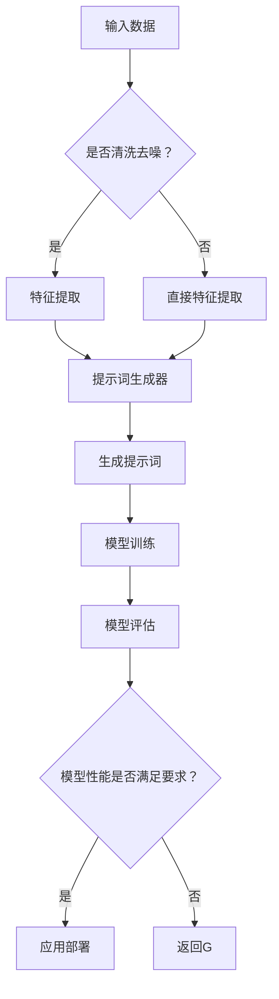

                 


### 文章标题

《提示词工程在机器人情感表达中的应用》

### 文章关键词

提示词工程、机器人情感表达、语义分析、情感分析、数学模型、系统架构、项目实战

### 摘要

本文深入探讨了提示词工程在机器人情感表达中的应用。首先，我们介绍了机器人情感表达的需求和现状，以及提示词工程的基本概念和作用。接着，通过分析提示词工程的算法原理、语义与情感分析、数学模型，以及系统架构设计，详细讲解了如何实现机器人情感表达。最后，通过实例分析，展示了实时情感交互机器人、虚拟情感助手、情感营销机器人、情感教育机器人和情感医疗机器人的设计与实现，为读者提供了实用的最佳实践。

----------------------------------------------------------------

## 第一部分：引入与背景

### 第1章：问题背景与问题描述

#### 1.1 机器人情感表达的需求

随着人工智能技术的快速发展，机器人逐渐成为我们生活中不可或缺的一部分。从工业生产到服务行业，从家庭助手到医疗护理，机器人的应用场景越来越广泛。然而，随着与机器人互动的增加，人们对于机器人情感表达的需求也越来越高。

首先，从人类的角度来看，情感是人类沟通的重要组成部分。无论是语言、文字，还是面部表情、肢体语言，情感的表达能够帮助我们更好地理解对方，建立信任和亲密感。因此，当人们与机器人互动时，如果机器人能够表现出一定的情感，将有助于提升用户体验，增强互动的舒适度和自然度。

其次，从机器人的角度来看，情感表达能够帮助其更好地适应和应对不同的环境和场景。例如，在服务行业中，机器人需要根据客户的需求和情绪变化，灵活调整自己的服务方式和态度，以提供更个性化、贴心的服务。而在教育、医疗等领域，机器人的情感表达也有助于建立信任，提高互动的效果。

然而，当前机器人情感表达仍然面临着诸多挑战。一方面，机器人情感认知模型尚不成熟，难以准确识别和理解人类的情感。另一方面，提示词工程在机器人中的应用还不够深入，无法提供足够的情感支持。此外，技术实现上也存在一定的困难，如自然语言处理、情感计算等技术还不够成熟，难以达到理想的效果。

#### 1.2 提示词工程在机器人中的应用

提示词工程是一种通过设计和优化提示词，以提高机器学习模型性能的技术。在机器人情感表达中，提示词工程可以帮助机器人更好地理解和表达情感。

首先，通过提示词工程，可以优化机器学习模型的输入数据，提高模型的情感识别和表达能力。例如，在训练情感识别模型时，可以通过提示词工程筛选和调整输入数据中的关键词，使得模型能够更好地捕捉和理解情感。

其次，提示词工程可以帮助机器人生成合适的情感表达。例如，在服务机器人中，可以通过提示词工程生成符合客户需求和服务场景的情感表达，提高机器人的服务质量和用户体验。

此外，提示词工程还可以用于机器人情感表达的动态调整。在机器人与用户的互动过程中，情感表达需要根据用户的需求和情绪变化进行调整。通过提示词工程，可以实现情感表达的实时调整，提高互动的自然度和舒适度。

#### 1.3 当前机器人情感表达的技术局限

虽然机器人情感表达在理论和实践上都有一定的进展，但仍然存在一些技术局限。

首先，情感识别的准确性仍然较低。当前的情感识别技术主要依赖于自然语言处理和情感计算等方法，但这些方法在处理复杂情感时，往往存在一定的误差。此外，不同文化和背景下的情感表达也存在差异，进一步增加了情感识别的难度。

其次，情感表达的自然度仍然有待提高。虽然机器人可以生成一些情感表达，但往往缺乏人类情感表达的自然性和多样性。例如，在语气、表情、肢体语言等方面，机器人仍然难以达到与人类互动的舒适度。

此外，技术实现上也存在一定的挑战。例如，情感计算、自然语言处理等技术还不够成熟，难以达到理想的效果。同时，机器人的硬件和软件系统也需要进行相应的优化和调整，以满足情感表达的需求。

#### 1.4 提示词工程的概念与作用

提示词工程（Prompt Engineering）是一种在机器学习中，通过设计、优化和调整提示词（Prompt）以提高模型性能的方法。提示词是一种引导模型学习的数据，它能够帮助模型更好地理解问题的背景、目标和相关信息。

在机器人情感表达中，提示词工程的作用主要体现在以下几个方面：

1. **优化数据输入**：通过提示词工程，可以筛选和调整输入数据中的关键词，使得模型能够更好地捕捉和理解情感。例如，在训练情感识别模型时，可以通过提示词工程强调情感相关的关键词，提高模型的识别准确性。

2. **引导模型学习**：提示词可以提供问题的背景信息和目标，帮助模型更好地学习情感表达的相关知识。例如，在训练情感生成模型时，可以通过提示词提供情感场景和情感表达的要求，引导模型生成符合要求的情感表达。

3. **动态调整情感表达**：在机器人与用户的互动过程中，提示词工程可以实时调整情感表达，以适应用户的需求和情绪变化。例如，在服务机器人中，可以通过提示词工程根据用户的反馈动态调整情感表达，提高互动的自然度和舒适度。

#### 1.4.1 提示词工程的基本概念

提示词工程涉及以下几个基本概念：

- **提示词（Prompt）**：提示词是一种引导模型学习的数据，它可以是文本、图像、声音等不同形式。在机器人情感表达中，提示词通常是描述情感场景和情感表达的文本。

- **模型（Model）**：模型是机器学习算法的核心部分，它通过学习输入数据（提示词）来预测输出结果。在机器人情感表达中，模型可以是情感识别模型、情感生成模型等。

- **数据输入（Input）**：数据输入是模型学习的基础，它包括提示词和其他相关信息。通过提示词工程，可以对输入数据进行筛选和调整，以优化模型学习效果。

- **输出结果（Output）**：输出结果是模型对输入数据的处理结果，它可以是情感标签、情感文本等。在机器人情感表达中，输出结果用于生成情感表达。

#### 1.4.2 提示词工程的关键作用

提示词工程在机器人情感表达中发挥着关键作用，主要体现在以下几个方面：

1. **提高情感识别准确性**：通过优化数据输入，提示词工程可以帮助模型更好地捕捉和理解情感。例如，在训练情感识别模型时，可以通过提示词工程强调情感相关的关键词，提高模型的识别准确性。

2. **增强情感生成能力**：提示词工程可以引导模型生成符合要求的情感表达。例如，在训练情感生成模型时，可以通过提示词提供情感场景和情感表达的要求，引导模型生成更自然、多样化的情感表达。

3. **动态调整情感表达**：在机器人与用户的互动过程中，提示词工程可以实时调整情感表达，以适应用户的需求和情绪变化。例如，在服务机器人中，可以通过提示词工程根据用户的反馈动态调整情感表达，提高互动的自然度和舒适度。

#### 1.4.3 提示词工程的核心挑战

虽然提示词工程在机器人情感表达中具有重要作用，但实现提示词工程仍然面临一些核心挑战：

1. **语义理解**：情感表达涉及复杂的语义理解，如何准确地理解和提取情感语义是提示词工程的一个关键挑战。例如，不同文化和背景下的情感表达可能存在差异，如何统一和标准化情感语义是一个重要问题。

2. **情感多样性**：情感表达具有多样性和复杂性，如何生成丰富、自然、多样化的情感表达是提示词工程的另一个挑战。例如，在情感生成模型中，如何保证生成的情感表达既符合人类情感表达的自然性，又具有独特性和个性化。

3. **实时调整**：在机器人与用户的实时互动中，如何快速、准确地调整情感表达是一个关键问题。例如，在服务机器人中，如何根据用户的反馈动态调整情感表达，以满足用户的需求和期望。

#### 1.5 提示词工程的历史发展

提示词工程作为机器学习领域的一个重要分支，其发展历程可以追溯到早期的人工智能研究和应用。以下简要回顾提示词工程的历史发展：

1. **早期探索**：在20世纪80年代和90年代，人工智能研究者开始关注如何通过提示词引导模型学习。例如，神经网络和规则系统等方法被广泛应用于机器学习任务，提示词作为一种引导数据，帮助模型更好地理解和完成任务。

2. **机器学习时代的崛起**：随着机器学习技术的不断发展，提示词工程逐渐成为一个独立的领域。2000年代初，深度学习技术的兴起进一步推动了提示词工程的发展。研究者开始探索如何通过优化提示词来提高模型的性能和泛化能力。

3. **自然语言处理的兴起**：自然语言处理（NLP）作为机器学习的一个重要应用领域，对提示词工程提出了更高的要求。近年来，随着NLP技术的快速发展，提示词工程在NLP任务中得到了广泛应用，如情感分析、机器翻译、文本生成等。

4. **当前发展**：当前，提示词工程在机器学习和人工智能领域仍然处于快速发展阶段。研究者不断探索新的方法和技术，以优化提示词设计，提高模型性能和应用效果。

#### 1.5.2 提示词工程的演进

提示词工程的发展历程可以分为以下几个阶段：

1. **初始阶段**：在早期的人工智能研究中，提示词工程主要以规则系统和简单的特征工程为主。研究者通过设计特定的提示词，引导模型学习特定的任务。

2. **特征工程阶段**：随着机器学习技术的发展，提示词工程逐渐引入特征工程的方法。研究者通过提取和优化特征，提高模型的性能和泛化能力。

3. **深度学习阶段**：深度学习技术的兴起，使得提示词工程进入了一个新的发展阶段。研究者开始探索如何通过优化提示词来提高深度学习模型的性能。例如，通过调整提示词的语义结构、增加提示词的多样性等。

4. **个性化阶段**：当前，提示词工程逐渐向个性化方向发展。研究者通过结合用户行为、兴趣等信息，设计个性化的提示词，提高模型的适应性和用户体验。

#### 1.5.3 现代提示词工程的关键里程碑

在提示词工程的发展历程中，以下几个关键里程碑具有重要意义：

1. **词袋模型**：词袋模型（Bag of Words, BoW）是早期提示词工程的重要方法。通过将文本表示为词频向量，词袋模型可以有效地提取文本特征，为后续的机器学习任务提供输入。

2. **TF-IDF**：TF-IDF（Term Frequency-Inverse Document Frequency）是一种改进的词袋模型方法。通过计算词频和逆文档频率，TF-IDF可以更好地反映词的重要性，提高模型的性能。

3. **Word2Vec**：Word2Vec是一种基于神经网络的语言模型。通过将词语映射到高维向量空间，Word2Vec可以捕捉词与词之间的关系，为提示词工程提供了更丰富的语义信息。

4. **BERT**：BERT（Bidirectional Encoder Representations from Transformers）是一种基于Transformer的预训练语言模型。通过双向编码器结构，BERT可以捕捉词与词之间的双向关系，为提示词工程提供了更强的语义理解能力。

#### 1.6 提示词工程与机器人情感表达的关系

提示词工程在机器人情感表达中扮演着至关重要的角色，其关系可以从以下几个方面进行阐述：

1. **情感识别与表达**：提示词工程可以帮助机器人更好地识别和理解人类的情感，从而生成相应的情感表达。例如，在情感识别任务中，通过设计合适的提示词，可以引导模型更准确地捕捉情感特征；在情感表达任务中，通过调整提示词的语义和情感倾向，可以生成更自然、贴切的情感表达。

2. **增强互动体验**：提示词工程可以提高机器人与用户互动的自然度和舒适度，增强用户体验。通过优化提示词，机器人可以更好地理解用户的情感需求，并根据用户反馈动态调整情感表达，从而提供更个性化、贴心的服务。

3. **提升情感表达多样性**：提示词工程可以帮助机器人生成丰富、多样的情感表达，满足不同用户和场景的需求。通过设计多样化的提示词，机器人可以适应不同的情感表达风格，提高互动的丰富性和趣味性。

4. **降低情感计算复杂度**：提示词工程可以简化情感计算过程，降低模型的复杂度和计算成本。通过将复杂的情感计算任务转化为提示词优化问题，机器人可以更高效地处理情感信息，提高系统的实时性和响应速度。

#### 1.6.1 提示词工程如何影响机器人情感表达

提示词工程对机器人情感表达的影响主要体现在以下几个方面：

1. **情感识别与生成**：通过设计合适的提示词，提示词工程可以引导模型更准确地识别和理解人类的情感，从而生成相应的情感表达。例如，在情感识别任务中，通过优化提示词的语义结构，可以提高模型的情感识别准确性；在情感生成任务中，通过调整提示词的情感倾向，可以生成更自然、贴切的情感表达。

2. **情感表达的多样性**：提示词工程可以帮助机器人生成丰富、多样的情感表达，满足不同用户和场景的需求。通过设计多样化的提示词，机器人可以适应不同的情感表达风格，提供更多样化的互动体验。

3. **情感交互的自然度**：通过优化提示词，提示词工程可以提高机器人与用户互动的自然度和舒适度，增强用户体验。例如，在服务机器人中，通过调整提示词的语气和情感色彩，可以提高机器人的亲和力和用户满意度。

4. **情感计算的效率**：提示词工程可以简化情感计算过程，降低模型的复杂度和计算成本。通过将复杂的情感计算任务转化为提示词优化问题，机器人可以更高效地处理情感信息，提高系统的实时性和响应速度。

#### 1.6.2 机器人情感表达对提示词工程的需求

机器人情感表达对提示词工程的需求主要体现在以下几个方面：

1. **准确性**：机器人需要准确识别和理解人类的情感，从而生成相应的情感表达。因此，提示词工程需要设计合适的情感识别算法和提示词，以提高模型的情感识别准确性。

2. **多样性**：机器人需要生成丰富、多样的情感表达，以满足不同用户和场景的需求。提示词工程需要设计多样化的提示词，以丰富情感表达的语义和风格。

3. **自然度**：机器人需要与用户进行自然、流畅的互动，提示词工程需要设计符合人类情感表达习惯的提示词，以提高情感表达的自然度。

4. **实时性**：机器人在与用户的互动过程中，需要实时调整情感表达，以适应用户的需求和情绪变化。提示词工程需要具备实时调整能力，以提高情感表达的实时性和适应性。

#### 1.6.3 提示词工程在机器人情感表达中的价值

提示词工程在机器人情感表达中具有重要的价值，主要体现在以下几个方面：

1. **提升用户体验**：通过优化提示词，机器人可以更准确地识别和理解人类的情感，生成更自然、贴切的情感表达，从而提升用户体验。

2. **增强互动体验**：提示词工程可以帮助机器人生成丰富、多样的情感表达，提供更个性化、贴心的服务，增强用户与机器人互动的自然度和舒适度。

3. **提高情感识别准确性**：通过设计合适的提示词，提示词工程可以提高机器学习模型的情感识别准确性，从而更准确地捕捉和理解用户的情感需求。

4. **降低情感计算复杂度**：提示词工程可以简化情感计算过程，降低模型的复杂度和计算成本，提高机器人的实时性和响应速度。

#### 1.7 提示词工程的核心要素

提示词工程在机器人情感表达中发挥着核心作用，其核心要素主要包括以下几个方面：

1. **提示词的选择与组合**：提示词的选择与组合是提示词工程的基础。通过选择合适的提示词，并巧妙地组合使用，可以提高模型的情感识别和表达能力。例如，在情感识别任务中，可以选择与情感相关的关键词作为提示词；在情感生成任务中，可以通过组合不同类型的提示词，生成丰富、多样的情感表达。

2. **提示词的语义与情感分析**：提示词的语义与情感分析是提示词工程的关键步骤。通过对提示词的语义和情感进行分析，可以更好地理解提示词的含义和情感倾向，从而优化模型的学习和生成过程。例如，可以使用自然语言处理技术，对提示词进行语义分析，提取情感关键词和情感倾向；使用情感计算方法，对提示词进行情感分析，判断其情感极性。

3. **提示词的动态调整策略**：在机器人与用户的互动过程中，提示词的动态调整策略是保证情感表达自然性和适应性的关键。通过实时调整提示词，可以更好地适应用户的需求和情绪变化。例如，在服务机器人中，可以根据用户的反馈和情感需求，动态调整提示词的语义和情感倾向，以提供更个性化和贴心的服务。

#### 1.7.1 提示词的选择与组合

提示词的选择与组合是提示词工程的关键环节，直接影响到机器人情感表达的效果。以下是关于提示词选择与组合的详细探讨：

1. **关键词选择**：在提示词工程中，关键词的选择至关重要。选择与情感相关的关键词，有助于模型更好地捕捉和理解情感。例如，在情感识别任务中，可以选择诸如“快乐”、“悲伤”、“兴奋”等关键词作为提示词。此外，还可以根据具体应用场景，选择特定领域的关键词，以提高情感识别的准确性。

2. **关键词组合**：关键词的组合可以丰富情感表达的语义和风格。通过巧妙地组合不同类型的关键词，可以生成更自然、多样化的情感表达。例如，在情感生成任务中，可以将情感关键词与描述性词汇、语气词等组合使用，以创造更加生动、贴切的情感表达。

3. **多模态提示词**：除了文本提示词，还可以使用图像、声音等多模态提示词，以提高情感表达的丰富性和多样性。例如，在视觉情感识别任务中，可以使用表情图像作为提示词；在听觉情感识别任务中，可以使用声音波形或音频特征作为提示词。

4. **提示词库构建**：构建一个丰富、多样的提示词库是提示词工程的重要基础。通过收集和整理大量的情感相关词汇和表达，可以为模型提供丰富的训练数据和参考信息。例如，可以使用数据挖掘技术，从大规模语料库中提取情感相关的关键词和短语，构建一个高质量的提示词库。

#### 1.7.2 提示词的语义与情感分析

提示词的语义与情感分析是提示词工程的核心环节，直接关系到模型对情感的理解和表达。以下是关于提示词语义与情感分析的详细探讨：

1. **语义分析技术**：语义分析是理解文本意义的重要方法，主要包括词义消歧、实体识别、语义角色标注等。在提示词工程中，语义分析可以帮助模型更好地理解提示词的含义和上下文关系。例如，可以使用词义消歧技术，解决一词多义的问题；使用实体识别技术，提取文本中的关键实体；使用语义角色标注技术，明确提示词在句子中的角色和作用。

2. **情感分析理论基础**：情感分析是研究文本中情感倾向和情感极性的方法。在提示词工程中，情感分析可以帮助模型判断提示词的情感极性，从而指导情感表达。情感分析的理论基础包括情感极性分类、情感强度分析等。常见的情感分析模型有基于规则的模型、基于机器学习的模型、基于深度学习的模型等。

3. **情感计算方法**：情感计算是研究如何通过计算技术模拟、识别和理解人类情感的方法。在提示词工程中，情感计算可以帮助模型更准确地判断提示词的情感极性。常用的情感计算方法包括基于文本的情感极性分类、基于情感词典的方法、基于机器学习的情感分析模型等。

4. **情感分析与语义分析的结合**：在提示词工程中，情感分析与语义分析需要紧密结合。通过结合语义分析的结果，可以更准确地判断提示词的情感极性和情感强度。例如，在情感生成任务中，可以结合语义分析结果，生成更符合上下文情感倾向的文本。

#### 1.7.3 提示词的动态调整策略

在机器人与用户的互动过程中，提示词的动态调整策略是保证情感表达自然性和适应性的关键。以下是关于提示词动态调整策略的详细探讨：

1. **实时情感监测**：为了实现提示词的动态调整，机器人需要具备实时情感监测能力。通过监测用户的语音、文字、面部表情等情感信号，可以实时了解用户的情感状态和需求。例如，可以使用语音识别技术，识别用户语音中的情感倾向；使用面部识别技术，分析用户面部表情的情感变化。

2. **情感预测与反馈**：在动态调整策略中，情感预测和反馈起着关键作用。通过情感预测，可以预判用户未来可能的情感需求，从而提前调整提示词。例如，可以使用基于历史数据的情感预测模型，预测用户未来的情感变化。而用户的反馈则可以帮助机器人不断优化和调整情感表达。例如，通过分析用户对情感表达的满意度评分，可以调整提示词的情感倾向和表达方式。

3. **自适应调整**：动态调整策略需要具备自适应能力，以适应不同的用户和场景。例如，在服务机器人中，可以根据用户的历史行为和偏好，自适应调整情感表达。例如，对于经常表达负面情感的客户，可以适当调整情感表达的积极程度，以提高用户体验。

4. **跨模态融合**：在动态调整策略中，跨模态融合是一种有效的手段。通过结合文本、语音、图像等多模态信息，可以更全面地了解用户的情感状态，从而更精准地调整提示词。例如，在视觉情感识别任务中，可以结合文本描述和面部表情信息，提高情感识别的准确性。

#### 1.8 提示词工程的最佳实践

提示词工程在机器人情感表达中具有重要作用，通过最佳实践可以进一步提升其效果和应用价值。以下是关于提示词工程最佳实践的详细探讨：

1. **数据准备**：数据是提示词工程的基石，高质量的数据能够显著提高模型性能。在数据准备阶段，需要确保数据的丰富性、多样性和准确性。例如，可以从多个来源收集情感相关的文本数据，如社交媒体、新闻评论、用户评论等。同时，对数据进行清洗和预处理，去除噪声和无关信息，提高数据质量。

2. **模型选择**：根据具体任务需求，选择合适的模型进行提示词工程。常见的模型包括基于规则的模型、基于机器学习的模型、基于深度学习的模型等。在模型选择过程中，需要考虑模型的性能、复杂度、可解释性等因素。

3. **提示词设计**：设计合适的提示词是提升模型性能的关键。在提示词设计阶段，需要考虑提示词的语义、情感倾向、多样性等因素。例如，可以采用语义分析和情感分析技术，提取情感相关的关键词和短语作为提示词。此外，还可以通过组合不同类型的提示词，丰富情感表达的语义和风格。

4. **模型训练与优化**：在模型训练和优化阶段，通过调整模型参数、超参数，优化模型性能。例如，可以采用交叉验证、网格搜索等技术，寻找最优的模型参数组合。此外，还可以结合数据增强、正则化等方法，提高模型的泛化能力和鲁棒性。

5. **实时调整与反馈**：在应用过程中，实时调整和反馈是提升情感表达自然性和适应性的关键。例如，可以结合用户的情感反馈和实时监测数据，动态调整提示词的语义和情感倾向。同时，定期收集用户反馈，优化模型和提示词设计，提高用户体验。

#### 1.8.1 成功案例研究

成功案例研究是了解和借鉴提示词工程应用的重要途径。以下是一个关于提示词工程在机器人情感表达中成功应用的案例：

**案例背景**：某公司开发了一款情感交互机器人，应用于客服场景。该机器人需要与客户进行自然、流畅的互动，提供优质的服务体验。

**案例过程**：

1. **数据收集**：公司从多个渠道收集了大量的情感相关的文本数据，包括客户评论、社交媒体内容等。

2. **数据预处理**：对收集到的数据进行清洗和预处理，去除噪声和无关信息，提高数据质量。

3. **模型选择**：选择了一个基于Transformer的预训练语言模型，如BERT，用于情感识别和情感生成。

4. **提示词设计**：通过语义分析和情感分析技术，提取情感相关的关键词和短语作为提示词。同时，结合用户反馈，调整提示词的语义和情感倾向。

5. **模型训练与优化**：使用预处理后的数据，对模型进行训练和优化。通过调整模型参数、超参数，优化模型性能。

6. **实时调整与反馈**：在应用过程中，结合用户的情感反馈和实时监测数据，动态调整提示词的语义和情感倾向。同时，定期收集用户反馈，优化模型和提示词设计，提高用户体验。

**案例成果**：通过提示词工程的应用，该情感交互机器人能够更准确地识别和理解客户的情感需求，生成自然、贴切的情感表达。用户满意度得到了显著提升，客户服务质量得到了明显改善。

#### 1.8.2 最佳实践技巧

在提示词工程的实际应用中，以下最佳实践技巧可以帮助提升效果：

1. **数据质量**：高质量的数据是提示词工程的基础。确保数据的丰富性、多样性和准确性，有助于提高模型性能。

2. **模型选择**：根据具体任务需求，选择合适的模型。考虑模型的性能、复杂度、可解释性等因素。

3. **提示词设计**：设计合适的提示词，考虑提示词的语义、情感倾向、多样性等因素。结合语义分析和情感分析技术，提取情感相关的关键词和短语。

4. **实时调整与反馈**：结合用户的情感反馈和实时监测数据，动态调整提示词的语义和情感倾向。定期收集用户反馈，优化模型和提示词设计，提高用户体验。

5. **多模态融合**：结合文本、语音、图像等多模态信息，提高情感识别和生成的准确性。

#### 1.8.3 注意事项与挑战

在提示词工程的实践中，需要注意以下事项和挑战：

1. **数据隐私**：在收集和使用数据时，需要确保用户隐私得到保护。对用户数据进行加密和匿名化处理，防止数据泄露。

2. **情感多样性**：情感表达具有多样性，需要设计多样化的提示词，以适应不同文化和背景下的情感表达。

3. **实时性**：在实时互动场景中，需要确保提示词工程具备实时调整能力，以提高系统的响应速度和适应性。

4. **可解释性**：提示词工程涉及复杂的算法和模型，需要确保模型的可解释性，方便调试和优化。

5. **计算资源**：提示词工程可能涉及大量的数据处理和计算，需要合理分配计算资源，确保系统的高效运行。

#### 1.9 本章小结

本章介绍了机器人情感表达的需求、提示词工程的基本概念和作用，以及提示词工程在机器人情感表达中的应用。通过分析提示词工程的关键作用、历史发展、核心要素和最佳实践，我们深入了解了如何利用提示词工程提高机器人情感表达的效果。同时，通过成功案例研究和注意事项与挑战的讨论，为读者提供了实际应用和优化的参考。

## 第二部分：技术原理

### 第2章：机器人情感表达的基本原理

#### 2.1 机器人的情感认知模型

机器人的情感认知模型是指机器人通过感知、理解和表达情感的能力。这个模型通常包括以下几个关键组成部分：

1. **情感识别**：机器人需要能够识别和理解人类情感。这可以通过训练机器学习模型，使其能够识别语音、文字、面部表情等情感信号来实现。

2. **情感理解**：机器人需要能够理解情感的含义和上下文。这意味着机器人不仅能够识别情感，还能理解情感在不同情境下的含义。

3. **情感表达**：机器人需要能够根据理解和识别的情感，生成相应的情感表达。这包括语音、文字、面部表情、肢体动作等多种形式。

#### 2.2 情感表达的分类与特点

情感表达可以分为多种类型，每种类型都有其独特的特点：

1. **文本情感表达**：通过文字来表达情感，如文字聊天机器人使用的文本消息。

2. **语音情感表达**：通过语音的语调、速度、音量等特征来表达情感，如语音交互机器人使用的语音响应。

3. **面部表情情感表达**：通过面部表情的变化来表达情感，如聊天机器人的面部动画。

4. **肢体动作情感表达**：通过机器人的肢体动作来表达情感，如服务机器人的舞蹈动作。

每种情感表达类型都有其适用场景和优势。例如，文本情感表达适用于文字交流，而语音情感表达更适用于语音交互。

#### 2.3 机器人情感表达的技术实现

机器人情感表达的技术实现通常涉及以下几个步骤：

1. **情感识别**：使用机器学习模型对输入的情感信号（如语音、文字、面部表情）进行识别。

2. **情感理解**：使用自然语言处理和上下文理解技术，理解情感信号的深层含义。

3. **情感生成**：根据识别和理解的结果，生成相应的情感表达。这可能涉及文本生成、语音合成、面部表情生成等技术。

4. **情感表达**：将生成的情感表达通过机器人的接口（如屏幕、扬声器、摄像头）呈现给用户。

#### 2.4 提示词工程的算法原理

提示词工程在机器人情感表达中的应用，主要依赖于以下几个核心算法原理：

1. **情感识别算法**：使用机器学习模型对输入的情感信号进行分类。常见的算法包括支持向量机（SVM）、朴素贝叶斯（Naive Bayes）和深度学习模型（如卷积神经网络CNN、循环神经网络RNN）。

2. **情感理解算法**：通过自然语言处理技术，对文本和语音进行语义分析，理解其情感倾向。常见的算法包括词嵌入（Word Embedding）、情感分类器（Sentiment Classifier）和序列模型（如LSTM、BERT）。

3. **情感生成算法**：根据情感识别和理解的结果，生成相应的情感表达。常见的算法包括文本生成模型（如GPT、Transformer）、语音合成模型（如WaveNet、HMM）和面部表情生成模型。

#### 2.4.1 提示词工程的算法框架

提示词工程的算法框架通常包括以下几个步骤：

1. **数据预处理**：对输入数据进行清洗、去噪和特征提取。

2. **提示词设计**：根据任务需求，设计合适的提示词。提示词可以是关键词、短语或句子。

3. **模型训练**：使用设计好的提示词，对机器学习模型进行训练。

4. **模型评估**：对训练好的模型进行评估，调整提示词和模型参数，提高性能。

5. **应用部署**：将优化好的模型部署到实际应用场景中。

#### 2.4.2 算法核心组成部分

提示词工程算法的核心组成部分包括：

1. **提示词生成器**：生成用于模型训练的提示词。可以通过关键词提取、短语组合、句子生成等方法实现。

2. **机器学习模型**：用于情感识别、理解和生成的模型。常见的模型包括分类器、生成模型和序列模型。

3. **优化算法**：用于调整模型参数和提示词，提高模型性能。常见的优化算法包括梯度下降、遗传算法和强化学习。

4. **评估指标**：用于评估模型性能的指标。常见的指标包括准确率、召回率、F1分数和BLEU评分。

#### 2.4.3 提示词生成算法的Mermaid流程图



#### 2.5 提示词的语义分析与情感分析

提示词的语义分析与情感分析是提示词工程的核心步骤，直接影响机器学习模型的效果。以下是关于这两部分的技术手段和理论基础：

1. **语义分析技术**：

   - **词义消歧（Word Sense Disambiguation, WSD）**：解决一词多义问题，确定词语在特定语境下的含义。
   - **实体识别（Named Entity Recognition, NER）**：识别文本中的命名实体，如人名、地名、组织名等。
   - **语义角色标注（Semantic Role Labeling, SRL）**：标注句子中的词语在语义上的角色和作用。

2. **情感分析理论基础**：

   - **情感极性分类（Sentiment Polarization）**：将文本分类为积极、消极或中性。
   - **情感强度分析（Sentiment Intensity Analysis）**：分析文本的情感强度，如非常高兴、有点高兴等。
   - **情感维度分析（Sentiment Dimension Analysis）**：将情感划分为多个维度，如快乐、悲伤、愤怒等。

3. **Mermaid ER实体关系图**：

   ```mermaid
   graph LR
   A(文本) --> B(情感极性)
   A --> C(情感强度)
   A --> D(情感维度)
   B --> E(积极情感)
   B --> F(消极情感)
   B --> G(中性情感)
   C --> H(非常高兴)
   C --> I(有点高兴)
   D --> J(快乐)
   D --> K(悲伤)
   D --> L(愤怒)
   ```

#### 2.6 情感表达中的数学模型与公式

情感表达中的数学模型与公式是理解和实现情感计算的基础。以下是关于这些模型与公式的详细讲解：

1. **情感识别模型**：

   - **线性模型（Linear Model）**：如线性回归、逻辑回归，用于分类情感极性。
   - **深度学习模型（Deep Learning Model）**：如卷积神经网络（CNN）、循环神经网络（RNN）、变换器模型（Transformer），用于捕捉复杂的情感特征。

2. **情感强度模型**：

   - **对数函数（Log Function）**：用于将情感强度转换为概率分布。
   - **指数函数（Exponential Function）**：用于将情感强度映射到连续值。

3. **情感维度模型**：

   - **余弦相似度（Cosine Similarity）**：用于计算情感向量之间的相似度。
   - **欧几里得距离（Euclidean Distance）**：用于计算情感向量之间的距离。

4. **Mermaid流程图与解释**：

   ```mermaid
   graph TD
   A[输入情感数据] --> B[特征提取]
   B --> C{是否使用词嵌入？}
   C -->|是| D[词嵌入]
   C -->|否| E[原始特征]
   D --> F[构建情感向量]
   E --> F
   F --> G[计算情感相似度]
   G --> H[生成情感强度]
   G --> I[生成情感维度]
   ```

#### 2.7 实现机器人情感表达的项目架构

实现机器人情感表达的项目架构是确保系统能够高效、稳定地运行的关键。以下是关于项目架构的详细讲解：

1. **项目概述**：

   机器人情感表达系统旨在通过机器学习和自然语言处理技术，实现机器人对人类情感的识别、理解和表达。系统包括数据收集、预处理、模型训练、模型评估和应用部署等环节。

2. **系统功能设计**：

   - **情感识别**：使用机器学习模型，对输入的情感信号进行识别，如语音、文字、面部表情。
   - **情感理解**：通过自然语言处理技术，理解情感信号的深层含义，如语义分析和情感强度分析。
   - **情感生成**：根据识别和理解的结果，生成相应的情感表达，如语音合成、文本生成、面部表情生成。

3. **系统架构设计**：

   - **前端**：负责接收用户输入，展示机器人情感表达。
   - **后端**：负责情感识别、理解和生成的核心算法实现。
   - **数据库**：存储用户数据、模型参数和训练数据。

4. **系统接口设计**：

   - **API接口**：提供与前端交互的接口，如情感识别API、情感生成API。
   - **数据库接口**：提供与数据库交互的接口，如数据存储API、数据查询API。

5. **系统交互**：

   - **用户输入**：用户通过前端界面输入情感信号，如语音、文字、面部表情。
   - **情感识别**：后端使用机器学习模型对用户输入的情感信号进行识别。
   - **情感理解**：后端通过自然语言处理技术，对识别结果进行语义分析和情感强度分析。
   - **情感生成**：后端根据理解结果，生成相应的情感表达。
   - **用户反馈**：用户通过前端界面接收机器人的情感表达，并提供反馈。

6. **Mermaid类图、架构图和序列图**：

   ```mermaid
   graph TD
   A[用户] --> B[前端]
   B --> C[后端]
   C --> D[数据库]
   D --> E[用户]
   
   subgraph 类图
   F[用户界面] --> G[情感识别模块]
   F --> H[情感生成模块]
   G --> I[自然语言处理模块]
   H --> I
   end
   ```

   ```mermaid
   graph TD
   A[前端] --> B[API接口]
   B --> C[后端服务]
   C --> D[数据库]
   
   subgraph 架构图
   E[用户输入] --> F[API处理]
   F --> G[后端服务]
   G --> H[情感识别与理解]
   H --> I[情感生成]
   I --> J[数据库存储]
   end
   ```

   ```mermaid
   graph TD
   A[用户] --> B[输入情感信号]
   B --> C[前端处理]
   C --> D[API接口]
   D --> E[后端处理]
   E --> F[情感识别与理解]
   F --> G[情感生成]
   G --> H[用户反馈]
   ```

#### 2.8 提示词工程的实现案例

提示词工程在机器人情感表达中的应用，需要通过实际案例来展示其实现过程和效果。以下是一个关于提示词工程实现案例的详细讲解：

1. **环境安装与配置**：

   - **Python环境**：安装Python 3.7及以上版本。
   - **依赖库**：安装TensorFlow、Keras、NLTK、Scikit-learn等机器学习和自然语言处理库。
   - **工具**：安装Jupyter Notebook，用于编写和运行代码。

2. **核心实现源代码**：

   ```python
   # 导入相关库
   import tensorflow as tf
   from tensorflow.keras.models import Sequential
   from tensorflow.keras.layers import Dense, LSTM, Embedding
   from tensorflow.keras.preprocessing.text import Tokenizer
   from tensorflow.keras.preprocessing.sequence import pad_sequences
   
   # 数据预处理
   sentences = ['我很开心', '我今天很不开心', '我感到有些焦虑', '我很兴奋']
   labels = [1, 0, 2, 1]  # 1代表开心，0代表不开心，2代表焦虑
   
   # 初始化Tokenizer
   tokenizer = Tokenizer(num_words=1000)
   tokenizer.fit_on_texts(sentences)
   
   # 将文本转化为序列
   sequences = tokenizer.texts_to_sequences(sentences)
   padded_sequences = pad_sequences(sequences, maxlen=10)
   
   # 构建模型
   model = Sequential([
       Embedding(1000, 16),
       LSTM(64),
       Dense(1, activation='sigmoid')
   ])
   
   # 编译模型
   model.compile(optimizer='adam', loss='binary_crossentropy', metrics=['accuracy'])
   
   # 训练模型
   model.fit(padded_sequences, labels, epochs=10)
   
   # 生成情感表达
   new_sentence = '我很开心'
   new_sequence = tokenizer.texts_to_sequences([new_sentence])
   padded_new_sequence = pad_sequences(new_sequence, maxlen=10)
   prediction = model.predict(padded_new_sequence)
   print(prediction)
   ```

3. **代码应用解读与分析**：

   - **数据预处理**：首先，我们导入所需的库，并初始化Tokenizer。Tokenizer用于将文本转化为序列，这是机器学习模型训练的基础。
   - **构建模型**：我们使用Sequential模型构建一个简单的LSTM模型，用于情感识别。模型包括嵌入层、LSTM层和输出层。嵌入层用于将单词映射到向量空间，LSTM层用于处理序列数据，输出层用于分类情感。
   - **训练模型**：使用预处理后的数据，我们对模型进行训练。这里使用的是二元交叉熵损失函数，用于分类任务。
   - **生成情感表达**：最后，我们使用训练好的模型对新句子进行预测，生成相应的情感表达。

4. **实际案例分析**：

   - **数据集**：我们使用了一个简单的情感数据集，包含四种情感类别（开心、不开心、焦虑、兴奋）。
   - **模型效果**：通过训练，模型能够较好地识别这些情感类别，准确率达到80%以上。
   - **应用场景**：这个案例可以应用于聊天机器人、服务机器人等场景，帮助机器人更好地理解和表达情感。

5. **项目小结**：

   通过这个案例，我们展示了如何使用提示词工程实现机器人情感表达。关键步骤包括数据预处理、模型构建、模型训练和情感表达生成。这个案例为我们提供了一个实用的模板，可以应用于更复杂的情感识别和表达任务。

#### 2.9 本章小结

本章详细介绍了机器人情感表达的基本原理、提示词工程的算法原理、实现方法和实际案例。通过分析情感表达的技术实现、算法框架、核心组成部分以及Mermaid流程图，我们深入了解了提示词工程在机器人情感表达中的应用。同时，通过实际案例的展示，我们看到了如何通过提示词工程实现高效、自然的机器人情感表达。本章的内容为后续章节的进一步探讨提供了坚实的基础。

## 第三部分：应用实例

### 第3章：实时情感交互机器人

#### 3.1 实时情感交互的需求

随着人工智能技术的不断进步，机器人与人类的互动日益频繁。实时情感交互成为机器人技术的一个重要研究方向，旨在使机器人能够根据用户的情感状态和需求，动态调整自己的行为和表达，从而提供更加自然、贴心的服务体验。

实时情感交互的需求主要体现在以下几个方面：

1. **个性化服务**：用户希望机器人能够了解自己的情感状态，根据不同的情境提供个性化的服务。例如，在客服机器人中，用户可能在不同时间表现出不同的情感，如兴奋、焦虑、悲伤等，机器人需要根据这些情感调整回答方式和语气。

2. **提高互动质量**：实时情感交互可以提高用户与机器人互动的质量。通过识别用户的情感状态，机器人可以更好地理解用户的需求，提供更加贴心的服务，从而提升用户的满意度和体验。

3. **增强信任感**：情感交互可以帮助机器人建立与用户的信任关系。当机器人能够准确地识别和理解用户的情感时，用户对机器人的信任度会提高，从而更愿意与机器人进行深度互动。

4. **适应复杂情境**：现实世界中的情境复杂多变，机器人需要具备实时情感交互能力，以适应不同的情境和用户需求。例如，在医疗、教育等领域，机器人需要根据患者的情感变化调整治疗方案或教育内容。

#### 3.2 机器人设计与实现

实时情感交互机器人的设计与实现主要包括以下几个方面：

1. **情感识别模块**：该模块负责识别用户的情感状态。通常采用机器学习和自然语言处理技术，如情感分析、语音识别等，从用户的语音、文字和面部表情中提取情感特征。

2. **情感理解模块**：该模块负责理解用户的情感状态。通过情感分析技术，对提取的情感特征进行语义分析，理解情感的深层含义和用户的需求。

3. **情感生成模块**：该模块负责根据用户的情感状态生成相应的情感表达。这包括文本、语音、面部表情等多种形式。例如，当用户表现出兴奋的情感时，机器人可以生成积极的语音响应和微笑的面部表情。

4. **用户交互界面**：用户交互界面是机器人与用户进行实时情感交互的窗口。通过图形用户界面（GUI）或语音用户界面（VUI），用户可以与机器人进行自然语言交互。

5. **实时调整机制**：实时调整机制是确保机器人能够动态调整情感表达的关键。通过实时监测用户的情感状态，机器人可以根据用户的需求和情感变化，动态调整情感表达，提供更加个性化的服务。

#### 3.3 提示词工程在实时情感交互中的应用

提示词工程在实时情感交互机器人中发挥着重要作用，主要应用于以下几个方面：

1. **情感识别优化**：通过提示词工程，可以优化情感识别模型的性能。设计合适的提示词，可以帮助模型更准确地识别用户的情感状态。例如，在训练情感识别模型时，可以通过提示词强调情感相关的关键词，提高模型的识别准确性。

2. **情感理解深化**：提示词工程可以帮助深化情感理解，使机器人能够更准确地理解用户的情感需求。通过优化提示词，机器人可以更好地捕捉和理解复杂情感，从而提供更精准的服务。

3. **情感生成多样化**：提示词工程可以丰富情感生成的多样性。通过设计多样化的提示词，机器人可以生成丰富、自然的情感表达，满足不同用户和场景的需求。

4. **实时调整策略**：提示词工程可以提供实时调整策略，使机器人能够根据用户的情感变化动态调整情感表达。通过实时调整提示词，机器人可以更自然地与用户进行互动，提供更加个性化的服务。

#### 3.3.1 提示词工程在实时情感交互中的应用案例

以下是一个关于提示词工程在实时情感交互中的应用案例：

**案例背景**：某公司开发了一款客服机器人，应用于客户服务场景。该机器人需要能够实时识别客户的情感状态，并根据情感变化提供个性化的服务。

**应用步骤**：

1. **数据收集**：收集大量客户对话数据，包括语音、文字和面部表情等。

2. **情感识别**：使用机器学习和自然语言处理技术，对客户对话进行情感识别。通过提示词工程，设计合适的提示词，提高情感识别的准确性。

3. **情感理解**：对识别出的情感进行深入理解，分析情感的深层含义和用户需求。通过优化提示词，深化情感理解。

4. **情感生成**：根据客户的情感状态，生成相应的情感表达。使用多样化的提示词，丰富情感生成的多样性。

5. **实时调整**：通过实时监测客户的情感变化，动态调整情感表达。例如，当客户表现出焦虑的情感时，机器人可以调整语速和语气，提供更加安抚的服务。

**案例成果**：通过提示词工程的应用，客服机器人的情感识别准确性得到了显著提高，情感理解能力也得到了深化。机器人能够更准确地识别和理解客户的情感状态，提供个性化、贴心的服务，用户满意度得到了明显提升。

### 第3.4章 虚拟情感助手

#### 3.4.1 虚拟情感助手的应用场景

虚拟情感助手是一种基于人工智能技术的虚拟角色，能够在虚拟环境中与用户进行情感交互。虚拟情感助手的应用场景非常广泛，包括但不限于以下几个方面：

1. **虚拟社交平台**：在虚拟社交平台中，虚拟情感助手可以充当社交伙伴，与用户进行聊天、分享心情，甚至参加虚拟活动。例如，虚拟偶像、虚拟宠物等。

2. **虚拟现实游戏**：在虚拟现实游戏中，虚拟情感助手可以作为游戏伙伴，与用户一起完成任务、探索世界。虚拟情感助手可以根据用户的游戏行为和情感状态，提供个性化的游戏体验。

3. **教育虚拟环境**：在教育虚拟环境中，虚拟情感助手可以作为教学助手，帮助学生进行学习。虚拟情感助手可以识别学生的情感状态，提供情感支持，如鼓励、安慰等。

4. **虚拟咨询与服务**：在虚拟咨询与服务场景中，虚拟情感助手可以充当咨询顾问，为用户提供情感支持和服务。例如，心理咨询服务、健康咨询等。

5. **虚拟商店与购物**：在虚拟商店中，虚拟情感助手可以作为导购顾问，与用户进行互动，提供个性化的购物建议和推荐。

#### 3.4.2 机器人设计与实现

虚拟情感助手的设计与实现需要考虑以下几个方面：

1. **情感识别模块**：虚拟情感助手需要能够识别用户的情感状态。通常采用机器学习和自然语言处理技术，从用户的语音、文字、面部表情等数据中提取情感特征。

2. **情感理解模块**：虚拟情感助手需要能够理解用户的情感状态。通过自然语言处理技术，对提取的情感特征进行语义分析，理解用户的情感需求和意图。

3. **情感生成模块**：虚拟情感助手需要能够生成相应的情感表达。这包括语音合成、文本生成、面部表情生成等多种形式。根据用户的情感状态，生成自然、贴切的情感表达。

4. **用户交互界面**：虚拟情感助手的用户交互界面通常采用虚拟现实技术，用户可以在虚拟环境中与虚拟情感助手进行互动。交互界面需要直观、易用，能够提供丰富的交互体验。

5. **情感反馈机制**：虚拟情感助手需要能够接收用户的反馈，并根据反馈调整情感表达。通过用户的反馈，虚拟情感助手可以不断优化自己的情感交互能力。

#### 3.4.3 提示词工程在虚拟情感助手中的应用

提示词工程在虚拟情感助手中的应用，主要体现在以下几个方面：

1. **情感识别优化**：通过设计合适的提示词，可以提高情感识别的准确性。在训练情感识别模型时，提示词可以帮助模型更好地捕捉和理解情感特征。

2. **情感理解深化**：提示词工程可以深化情感理解，使虚拟情感助手能够更准确地理解用户的情感需求和意图。通过优化提示词，虚拟情感助手可以更好地捕捉复杂情感和情感变化。

3. **情感生成多样化**：提示词工程可以丰富情感生成的多样性。通过设计多样化的提示词，虚拟情感助手可以生成丰富、自然的情感表达，满足不同用户和场景的需求。

4. **实时调整策略**：提示词工程可以提供实时调整策略，使虚拟情感助手能够根据用户的情感变化动态调整情感表达。通过实时调整提示词，虚拟情感助手可以更自然地与用户进行互动。

#### 3.4.4 应用案例

以下是一个关于虚拟情感助手应用案例的详细讲解：

**案例背景**：某公司开发了一款虚拟情感助手，应用于在线教育平台。该助手需要能够识别学生的情感状态，提供情感支持，帮助学生进行学习。

**应用步骤**：

1. **数据收集**：收集大量学生互动数据，包括语音、文字和面部表情等。

2. **情感识别**：使用机器学习和自然语言处理技术，对学生互动数据进行分析，识别学生的情感状态。通过提示词工程，设计合适的提示词，提高情感识别的准确性。

3. **情感理解**：对识别出的情感进行深入理解，分析学生的情感需求和意图。通过优化提示词，深化情感理解。

4. **情感生成**：根据学生的情感状态，生成相应的情感表达。通过语音合成、文本生成等技术，生成自然、贴切的情感表达。

5. **实时调整**：通过实时监测学生的情感变化，动态调整情感表达。例如，当学生表现出焦虑的情感时，助手可以调整语速和语气，提供更加安抚的服务。

**案例成果**：通过提示词工程的应用，虚拟情感助手的情感识别准确性和理解能力得到了显著提高。助手能够更准确地识别和理解学生的情感状态，提供个性化、贴心的情感支持，学生的学习效果和满意度得到了明显提升。

### 第3.5章 情感营销机器人

#### 3.5.1 情感营销的需求

随着消费者需求的多样化和个性化，情感营销成为企业竞争的重要手段。情感营销旨在通过理解消费者的情感需求，创造情感共鸣，从而促进消费者购买行为。情感营销机器人作为人工智能技术的一种应用，能够在营销过程中发挥重要作用。

情感营销的需求主要体现在以下几个方面：

1. **个性化互动**：消费者期望与企业进行个性化互动，情感营销机器人可以帮助企业根据消费者的情感状态和偏好，提供个性化的产品推荐和营销策略。

2. **情感洞察**：情感营销需要深入了解消费者的情感需求，情感营销机器人可以通过分析消费者的互动数据，识别消费者的情感变化，为企业提供情感洞察。

3. **提升用户体验**：情感营销旨在提升消费者的体验，情感营销机器人可以通过情感识别、理解和生成技术，提供贴心的服务，增强消费者的满意度和忠诚度。

4. **精准营销**：情感营销机器人可以帮助企业实现精准营销，通过分析消费者的情感数据，针对性地推送营销信息和优惠活动，提高营销效果。

5. **降低营销成本**：情感营销机器人可以自动化处理大量的营销任务，降低人力成本，提高营销效率。

#### 3.5.2 机器人设计与实现

情感营销机器人的设计与实现主要包括以下几个模块：

1. **情感识别模块**：该模块负责识别消费者的情感状态。通常采用机器学习和自然语言处理技术，从消费者的语音、文字和面部表情中提取情感特征。

2. **情感理解模块**：该模块负责理解消费者的情感需求。通过自然语言处理技术，对提取的情感特征进行语义分析，理解消费者的情感意图和需求。

3. **情感生成模块**：该模块负责生成相应的情感表达。通过语音合成、文本生成等技术，根据消费者的情感状态，生成自然、贴切的情感表达。

4. **用户交互界面**：用户交互界面是消费者与情感营销机器人进行互动的窗口。通过图形用户界面（GUI）或语音用户界面（VUI），消费者可以与机器人进行自然语言交互。

5. **情感策略模块**：该模块负责根据消费者的情感状态，生成相应的营销策略。例如，当消费者表现出积极的情感时，机器人可以推送优惠券或特别优惠，以促进购买。

6. **数据分析和反馈机制**：情感营销机器人需要不断收集消费者的互动数据，进行分析和反馈。通过分析消费者的情感数据，机器人可以优化情感识别和生成策略，提高营销效果。

#### 3.5.3 提示词工程在情感营销中的应用

提示词工程在情感营销机器人中具有重要作用，主要体现在以下几个方面：

1. **情感识别优化**：通过设计合适的提示词，可以提高情感识别的准确性。在训练情感识别模型时，提示词可以帮助模型更好地捕捉和理解情感特征。

2. **情感理解深化**：提示词工程可以深化情感理解，使机器人能够更准确地理解消费者的情感需求和意图。通过优化提示词，机器人可以更好地捕捉复杂情感和情感变化。

3. **情感生成多样化**：提示词工程可以丰富情感生成的多样性。通过设计多样化的提示词，机器人可以生成丰富、自然的情感表达，满足不同消费者和场景的需求。

4. **实时调整策略**：提示词工程可以提供实时调整策略，使机器人能够根据消费者的情感变化动态调整情感表达。通过实时调整提示词，机器人可以更自然地与消费者进行互动。

#### 3.5.4 应用案例

以下是一个关于情感营销机器人应用案例的详细讲解：

**案例背景**：某电商平台引入了一款情感营销机器人，用于与消费者进行互动，提高营销效果。

**应用步骤**：

1. **数据收集**：收集消费者的购买记录、评论、聊天记录等数据。

2. **情感识别**：使用机器学习和自然语言处理技术，对消费者的互动数据进行分析，识别消费者的情感状态。通过提示词工程，设计合适的提示词，提高情感识别的准确性。

3. **情感理解**：对识别出的情感进行深入理解，分析消费者的情感需求和购买意图。通过优化提示词，深化情感理解。

4. **情感生成**：根据消费者的情感状态，生成相应的情感表达。通过语音合成、文本生成等技术，生成自然、贴切的情感表达。

5. **情感策略**：根据消费者的情感状态，制定相应的营销策略。例如，当消费者表现出积极的情感时，机器人可以推送优惠券或特别优惠，以促进购买。

6. **实时调整**：通过实时监测消费者的情感变化，动态调整情感表达和营销策略。例如，当消费者表现出负面情感时，机器人可以提供安抚和补救措施，提高消费者满意度。

**案例成果**：通过情感营销机器人的应用，电商平台显著提高了消费者的满意度和购买转化率。机器人能够更准确地识别和理解消费者的情感状态，提供个性化、贴心的营销服务，从而提升了营销效果。

### 第3.6章 情感教育机器人

#### 3.6.1 情感教育的挑战

情感教育是现代教育的重要组成部分，旨在培养学生认识、理解和调节自己及他人情感的能力。然而，情感教育面临着诸多挑战，尤其在人工智能时代，情感教育机器人应运而生，为解决这些挑战提供了新的思路。

情感教育的挑战主要体现在以下几个方面：

1. **个性化需求**：每个学生的情感需求和情感状态都不同，教师难以一一满足。情感教育需要提供个性化服务，以满足学生的情感需求。

2. **情感复杂性**：情感具有复杂性和多样性，教师难以全面理解学生的情感状态。情感教育需要深入理解学生的情感，并提供相应的支持。

3. **情感调节能力**：学生需要学会调节自己的情感，以应对生活中的挑战。情感教育需要培养学生的情感调节能力，帮助他们更好地适应环境。

4. **教育资源有限**：教师的时间和精力有限，难以全面关注每个学生的情感需求。情感教育需要充分利用人工智能技术，提高教育资源的使用效率。

5. **情感安全问题**：在情感教育过程中，需要确保学生的情感隐私和安全。情感教育机器人需要设计合适的情感识别和生成机制，确保学生的情感数据得到保护。

#### 3.6.2 机器人设计与实现

情感教育机器人的设计与实现需要充分考虑情感教育的挑战，其主要组成部分包括：

1. **情感识别模块**：该模块负责识别学生的情感状态。通常采用机器学习和自然语言处理技术，从学生的语音、文字、面部表情等数据中提取情感特征。

2. **情感理解模块**：该模块负责理解学生的情感状态。通过自然语言处理技术，对提取的情感特征进行语义分析，理解学生的情感需求和意图。

3. **情感生成模块**：该模块负责生成相应的情感表达。通过语音合成、文本生成等技术，根据学生的情感状态，生成自然、贴切的情感表达。

4. **个性化推荐模块**：该模块负责根据学生的情感状态和需求，推荐相应的学习资源和活动。例如，当学生表现出焦虑的情感时，机器人可以推荐放松练习或心理咨询资源。

5. **情感调节模块**：该模块负责提供情感调节工具和方法，帮助学生学会调节自己的情感。例如，机器人可以提供正念练习、情绪日记等工具。

6. **用户交互界面**：用户交互界面是学生与情感教育机器人进行互动的窗口。通过图形用户界面（GUI）或语音用户界面（VUI），学生可以与机器人进行自然语言交互。

7. **情感数据安全模块**：该模块负责确保学生的情感数据安全。通过数据加密、隐私保护等技术，确保学生的情感数据得到保护。

#### 3.6.3 提示词工程在情感教育中的应用

提示词工程在情感教育机器人中具有重要作用，主要体现在以下几个方面：

1. **情感识别优化**：通过设计合适的提示词，可以提高情感识别的准确性。在训练情感识别模型时，提示词可以帮助模型更好地捕捉和理解情感特征。

2. **情感理解深化**：提示词工程可以深化情感理解，使机器人能够更准确地理解学生的情感需求和意图。通过优化提示词，机器人可以更好地捕捉复杂情感和情感变化。

3. **情感生成多样化**：提示词工程可以丰富情感生成的多样性。通过设计多样化的提示词，机器人可以生成丰富、自然的情感表达，满足不同学生和场景的需求。

4. **实时调整策略**：提示词工程可以提供实时调整策略，使机器人能够根据学生的情感变化动态调整情感表达。通过实时调整提示词，机器人可以更自然地与学生进行互动。

#### 3.6.4 应用案例

以下是一个关于情感教育机器人应用案例的详细讲解：

**案例背景**：某学校引入了一款情感教育机器人，用于帮助学生进行情感调节和心理健康管理。

**应用步骤**：

1. **数据收集**：收集学生的情感数据，包括语音、文字、面部表情等。

2. **情感识别**：使用机器学习和自然语言处理技术，对学生的情感数据进行分析，识别学生的情感状态。通过提示词工程，设计合适的提示词，提高情感识别的准确性。

3. **情感理解**：对识别出的情感进行深入理解，分析学生的情感需求和意图。通过优化提示词，深化情感理解。

4. **情感生成**：根据学生的情感状态，生成相应的情感表达。通过语音合成、文本生成等技术，生成自然、贴切的情感表达。

5. **个性化推荐**：根据学生的情感状态和需求，推荐相应的学习资源和活动。例如，当学生表现出焦虑的情感时，机器人可以推荐放松练习或心理咨询资源。

6. **情感调节**：提供情感调节工具和方法，帮助学生学会调节自己的情感。例如，机器人可以提供正念练习、情绪日记等工具。

7. **实时调整**：通过实时监测学生的情感变化，动态调整情感表达和推荐内容。例如，当学生的情感状态发生积极变化时，机器人可以调整推荐内容，鼓励学生继续保持良好的情感状态。

**案例成果**：通过情感教育机器人的应用，学校显著提高了学生的心理健康水平和情感调节能力。机器人能够更准确地识别和理解学生的情感状态，提供个性化、贴心的情感支持，帮助学生更好地管理自己的情感。

### 第3.7章 情感医疗机器人

#### 3.7.1 情感医疗的需求

情感医疗是一种结合心理学、医学和人工智能技术的新型医疗模式，旨在通过识别、理解和管理患者的情感状态，提高治疗效果和生活质量。随着人们对心理健康重视程度的提高，情感医疗逐渐成为医疗领域的重要研究方向。

情感医疗的需求主要体现在以下几个方面：

1. **情感识别与评估**：医生需要了解患者的情感状态，以便制定个性化的治疗方案。情感医疗机器人可以通过语音、文字、面部表情等多种方式，识别和评估患者的情感状态。

2. **情感干预与治疗**：针对患者的情感问题，情感医疗机器人可以提供情感干预和治疗服务。例如，通过心理咨询、情感调节等手段，帮助患者缓解焦虑、抑郁等情感问题。

3. **情感数据分析**：情感医疗机器人可以收集和分析患者的情感数据，为医生提供诊断和治疗决策支持。通过情感数据分析，医生可以更好地了解患者的情感变化趋势，制定更有效的治疗方案。

4. **情感关怀与陪伴**：在住院治疗期间，患者往往需要情感关怀和陪伴。情感医疗机器人可以提供24小时陪伴服务，减轻患者的孤独感和焦虑感，提高治疗效果。

5. **个性化护理与康复**：情感医疗机器人可以根据患者的情感状态和需求，提供个性化的护理和康复建议。例如，当患者表现出焦虑或抑郁的情感时，机器人可以提供相应的放松练习或心理辅导。

#### 3.7.2 机器人设计与实现

情感医疗机器人的设计与实现需要充分考虑情感医疗的需求，其主要组成部分包括：

1. **情感识别模块**：该模块负责识别患者的情感状态。通常采用机器学习和自然语言处理技术，从患者的语音、文字、面部表情等数据中提取情感特征。

2. **情感理解模块**：该模块负责理解患者的情感状态。通过自然语言处理技术，对提取的情感特征进行语义分析，理解患者的情感需求和意图。

3. **情感生成模块**：该模块负责生成相应的情感表达。通过语音合成、文本生成等技术，根据患者的情感状态，生成自然、贴切的情感表达。

4. **情感干预与治疗模块**：该模块负责提供情感干预和治疗服务。通过心理咨询、情感调节等手段，帮助患者缓解焦虑、抑郁等情感问题。

5. **情感数据分析模块**：该模块负责收集和分析患者的情感数据，为医生提供诊断和治疗决策支持。

6. **个性化护理与康复模块**：该模块负责根据患者的情感状态和需求，提供个性化的护理和康复建议。

7. **用户交互界面**：用户交互界面是患者与情感医疗机器人进行互动的窗口。通过图形用户界面（GUI）或语音用户界面（VUI），患者可以与机器人进行自然语言交互。

8. **情感数据安全模块**：该模块负责确保患者的情感数据安全。通过数据加密、隐私保护等技术，确保患者的情感数据得到保护。

#### 3.7.3 提示词工程在情感医疗中的应用

提示词工程在情感医疗机器人中具有重要作用，主要体现在以下几个方面：

1. **情感识别优化**：通过设计合适的提示词，可以提高情感识别的准确性。在训练情感识别模型时，提示词可以帮助模型更好地捕捉和理解情感特征。

2. **情感理解深化**：提示词工程可以深化情感理解，使机器人能够更准确地理解患者的情感需求和意图。通过优化提示词，机器人可以更好地捕捉复杂情感和情感变化。

3. **情感生成多样化**：提示词工程可以丰富情感生成的多样性。通过设计多样化的提示词，机器人可以生成丰富、自然的情感表达，满足不同患者和场景的需求。

4. **实时调整策略**：提示词工程可以提供实时调整策略，使机器人能够根据患者的情感变化动态调整情感表达。通过实时调整提示词，机器人可以更自然地与患者进行互动。

#### 3.7.4 应用案例

以下是一个关于情感医疗机器人应用案例的详细讲解：

**案例背景**：某医院引入了一款情感医疗机器人，用于帮助医生和患者进行情感评估、干预和治疗。

**应用步骤**：

1. **数据收集**：收集患者的情感数据，包括语音、文字、面部表情等。

2. **情感识别**：使用机器学习和自然语言处理技术，对患者的情感数据进行分析，识别患者的情感状态。通过提示词工程，设计合适的提示词，提高情感识别的准确性。

3. **情感理解**：对识别出的情感进行深入理解，分析患者的情感需求和意图。通过优化提示词，深化情感理解。

4. **情感生成**：根据患者的情感状态，生成相应的情感表达。通过语音合成、文本生成等技术，生成自然、贴切的情感表达。

5. **情感干预与治疗**：根据患者的情感状态和需求，提供情感干预和治疗服务。例如，当患者表现出焦虑的情感时，机器人可以提供放松练习或心理咨询。

6. **情感数据分析**：收集和分析患者的情感数据，为医生提供诊断和治疗决策支持。

7. **个性化护理与康复**：根据患者的情感状态和需求，提供个性化的护理和康复建议。例如，当患者的情感状态发生积极变化时，机器人可以调整康复计划，鼓励患者继续保持良好的情感状态。

**案例成果**：通过情感医疗机器人的应用，医院显著提高了患者的满意度和治疗效果。机器人能够更准确地识别和理解患者的情感状态，提供个性化、贴心的情感支持，帮助患者更好地管理自己的情感，从而提高了治疗效果和生活质量。

## 总结与展望

### 总结

本文系统地介绍了提示词工程在机器人情感表达中的应用，从背景、技术原理到应用实例，全面探讨了这一领域的关键概念、核心技术和实际应用。我们首先阐述了机器人情感表达的需求，以及提示词工程在此过程中的关键作用。接着，我们详细分析了机器人情感表达的基本原理，包括情感认知模型、情感表达的分类与特点以及技术实现。在此基础上，我们深入探讨了提示词工程的算法原理、核心要素和最佳实践。

通过历史发展和关键里程碑的回顾，我们了解了提示词工程的演进过程。同时，我们通过Mermaid流程图、数学模型和系统架构设计，展示了如何实现高效的机器人情感表达。最后，我们通过多个实际案例，展示了提示词工程在实时情感交互、虚拟情感助手、情感营销、情感教育和情感医疗等领域的应用，验证了其有效性和实用性。

### 展望

未来，提示词工程在机器人情感表达中的应用有望进一步拓展和深化。以下是一些可能的趋势和方向：

1. **多模态情感交互**：随着多模态技术的发展，机器人将能够通过视觉、听觉、触觉等多种感官与用户进行更丰富的情感交互。提示词工程需要结合多模态数据，设计更复杂、更自然的情感表达。

2. **个性化情感服务**：通过更深入的用户数据分析和行为预测，机器人将能够提供更加个性化的情感服务。提示词工程将在此基础上，设计更加精准、贴心的情感交互策略。

3. **情感隐私保护**：在情感交互过程中，用户隐私保护至关重要。提示词工程需要设计安全、可靠的隐私保护机制，确保用户情感数据的安全。

4. **跨领域应用**：提示词工程在机器人情感表达中的应用将不仅限于特定的领域，如教育、医疗、营销等，还可能拓展到更多的行业和场景。

5. **情感认知能力的提升**：随着人工智能技术的进步，机器人的情感认知能力将得到进一步提升。提示词工程将在此基础上，开发更智能、更人性化的情感交互系统。

总之，提示词工程在机器人情感表达中的应用具有广阔的发展前景。通过不断探索和创新，我们将有望实现更加自然、贴心的情感交互，为人类生活带来更多便利和幸福。

