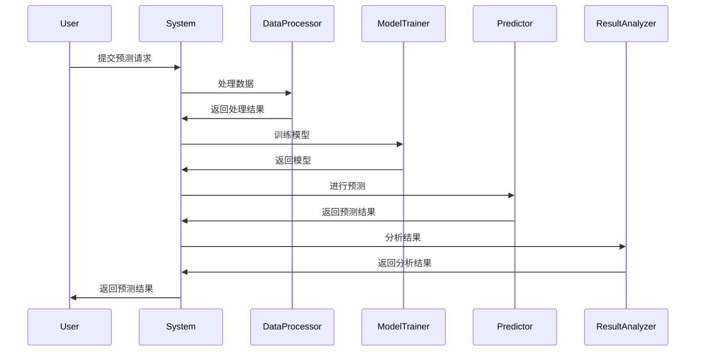

                 

# 《提示词工程在混沌系统预测中的突破》

## 关键词
- 混沌系统
- 预测
- 提示词工程
- 精度提升
- 模型优化

## 摘要
本文探讨了混沌系统在复杂系统预测中的应用，以及提示词工程在这一领域的突破。我们首先介绍了混沌系统的基本概念、预测方法和参数估计，随后深入解析了提示词工程的基本概念及其在混沌系统预测中的作用。通过具体实例，我们展示了提示词工程在气象预测和金融市场预测中的应用。最后，本文分析了提示词工程的优势与挑战，并展望了其未来发展趋势。

## 目录大纲

1. **混沌系统与预测基础**
   1. 混沌系统的基本概念
   2. 混沌系统的预测方法
   3. 混沌系统的参数估计

2. **提示词工程在混沌系统预测中的应用**
   1. 提示词工程的基本概念
   2. 基于提示词的混沌系统预测模型
   3. 实例分析：提示词工程在气象预测中的应用
   4. 提示词工程在混沌系统预测中的优势与挑战

3. **案例研究**
   1. 案例研究1：金融市场的混沌预测
   2. 案例研究2：交通流量的预测与控制

4. **展望与未来方向**
   1. 混沌系统预测与提示词工程的未来发展趋势
   2. 结论与展望

## 第一部分：混沌系统与预测基础

### 第1章：混沌系统的基本概念

#### 1.1 混沌现象的发现与描述

混沌理论起源于20世纪60年代，由气象学家洛伦兹在研究大气动力学时首次发现。混沌现象可以简单描述为：一个确定性的系统，其行为具有长期不可预测性，但局部行为又是可预测的。混沌现象的核心特征包括：

- **初始条件敏感性**：系统对未来状态的微小扰动会随着时间指数级放大。
- **长期行为不可预测性**：尽管局部可预测，但系统的长期行为无法准确预测。
- **确定性**：混沌系统遵循确定的数学模型。

这些特征使得混沌系统在自然界和工程领域都具有重要意义。例如，天气系统、金融市场、交通流量等都表现出混沌特性。

#### 1.2 混沌系统的数学模型

混沌系统的数学模型通常使用微分方程或差分方程来描述。最著名的混沌模型之一是洛伦兹系统：

$$
\begin{cases}
\frac{dx}{dt} = \sigma (y - x) \\
\frac{dy}{dt} = x (\rho - z) - y \\
\frac{dz}{dt} = xy - \beta z
\end{cases}
$$

其中，$x$、$y$、$z$是系统的状态变量，$\sigma$、$\rho$、$\beta$是参数。

#### 1.3 混沌系统的特征与分类

混沌系统的特征包括：

- **混沌吸引子**：系统最终会收敛到一个吸引子，但这个吸引子通常是非线性的，不规则的。
- **长期行为的复杂性**：尽管初始条件敏感性导致长期行为不可预测，但混沌系统仍然表现出丰富的动态行为。

根据混沌系统的数学特性，混沌系统可以分为多种类型，如洛伦兹混沌、Chen混沌、Lorenz-95混沌等。

### 第2章：混沌系统的预测方法

混沌系统的预测方法主要包括以下几种：

#### 2.1 经典预测方法

- **线性预测**：基于线性回归模型，对系统状态进行预测。线性预测方法简单，但在处理非线性混沌系统时效果不佳。
- **非线性预测**：使用非线性模型，如神经网络、支持向量机等，对混沌系统进行预测。非线性预测方法可以更好地捕捉系统的非线性特征，但模型复杂度较高，训练时间较长。
- **时间序列分析**：通过分析系统的时间序列数据，提取特征，并进行预测。时间序列分析方法包括自回归模型、移动平均模型、ARIMA模型等。

#### 2.2 提示词工程在混沌系统预测中的应用

提示词工程是近年来发展起来的一种新型预测方法，它通过引入提示词来优化混沌系统的预测模型。提示词是一组能够描述系统状态的词语或短语，它们可以帮助预测模型更好地捕捉系统的特征。

### 第3章：混沌系统的参数估计

参数估计是混沌系统预测中的关键步骤，它涉及到如何从系统的观测数据中估计出模型参数。常用的参数估计方法包括：

#### 3.1 参数估计的基本方法

- **最小二乘法**：通过最小化预测误差平方和来估计参数。
- **粒子群优化算法**：基于群体智能，通过迭代搜索找到最优参数。
- **遗传算法**：模拟生物进化过程，通过选择、交叉和变异来优化参数。

## 第二部分：提示词工程在混沌系统预测中的应用

### 第4章：提示词工程的基本概念

#### 4.1 提示词的定义与作用

提示词是一组用于描述系统状态的词语或短语。在混沌系统预测中，提示词的作用包括：

- **提高预测精度**：通过引入提示词，可以更准确地描述系统的特征，从而提高预测模型的精度。
- **降低模型复杂度**：提示词可以帮助简化模型，降低计算复杂度。

#### 4.2 提示词的分类与设计原则

提示词可以根据其作用方式分为以下几类：

- **状态提示词**：描述系统当前状态的特征。
- **趋势提示词**：描述系统未来趋势的特征。
- **因果关系提示词**：描述系统不同状态之间的因果关系。

设计提示词时，应遵循以下原则：

- **简洁性**：提示词应简洁明了，便于理解和操作。
- **全面性**：提示词应覆盖系统的所有重要特征。
- **可解释性**：提示词应易于解释，以便理解预测结果。

### 第5章：基于提示词的混沌系统预测模型

#### 5.1 提示词在混沌系统预测中的机制

基于提示词的混沌系统预测模型主要通过以下机制实现：

- **特征提取**：使用提示词从系统数据中提取特征。
- **模型训练**：使用提取的特征训练预测模型。
- **预测输出**：使用训练好的模型进行预测。

#### 5.2 提示词的生成方法

提示词的生成方法主要包括：

- **规则生成**：根据系统特性，手动设计提示词。
- **数据驱动生成**：通过分析系统数据，自动生成提示词。

#### 5.3 提示词的调整策略

提示词的调整策略包括：

- **在线调整**：根据预测结果，实时调整提示词。
- **离线调整**：在模型训练阶段，根据训练数据调整提示词。

#### 5.4 提示词的有效性评估

提示词的有效性评估主要通过以下方法：

- **交叉验证**：在不同数据集上评估提示词的效果。
- **性能指标**：使用预测误差、准确率等指标评估提示词的有效性。

### 第6章：实例分析：提示词工程在气象预测中的应用

#### 6.1 气象预测中的混沌系统

气象系统是一个典型的混沌系统，其状态变量包括温度、湿度、风速等。气象预测的难点在于状态的复杂性和长期行为的不可预测性。

#### 6.2 提示词工程在气象预测中的应用

提示词工程在气象预测中的应用主要包括：

- **特征提取**：使用提示词从气象数据中提取关键特征。
- **模型训练**：使用提取的特征训练气象预测模型。
- **预测输出**：使用训练好的模型进行气象预测。

### 第7章：提示词工程在混沌系统预测中的优势与挑战

#### 7.1 提示词工程的优势

提示词工程在混沌系统预测中的优势包括：

- **提高预测精度**：通过引入提示词，可以更准确地描述系统的特征，从而提高预测模型的精度。
- **降低模型复杂度**：提示词可以帮助简化模型，降低计算复杂度。

#### 7.2 提示词工程的挑战

提示词工程在混沌系统预测中的挑战包括：

- **提示词的生成与调整难度**：生成和调整提示词需要深入理解系统特性，难度较大。
- **预测模型的稳定性与泛化能力**：提示词工程需要确保预测模型的稳定性和泛化能力。
- **数据需求与计算资源限制**：提示词工程需要大量数据和计算资源，这在实际应用中可能存在限制。

## 第三部分：案例研究

### 第8章：案例研究1：金融市场的混沌预测

#### 8.1 金融市场的混沌特性

金融市场是一个复杂的混沌系统，其价格波动具有随机性和非线性特征。金融市场的混沌特性使得预测价格走势变得极为困难。

#### 8.2 提示词工程在金融预测中的应用

提示词工程在金融预测中的应用主要包括：

- **特征提取**：从金融市场数据中提取关键特征，如成交量、价格波动等。
- **模型训练**：使用提取的特征训练金融预测模型。
- **预测输出**：使用训练好的模型进行金融预测。

#### 8.3 案例小结

通过案例研究，我们发现提示词工程在金融市场预测中具有显著的优势。提示词工程能够提高预测精度，降低模型复杂度，从而为投资者提供更有价值的决策支持。

### 第9章：案例研究2：交通流量的预测与控制

#### 9.1 交通系统的混沌现象

交通系统是一个复杂的混沌系统，其流量和速度等参数具有非线性特征。交通系统的混沌现象会导致交通拥堵和交通事故。

#### 9.2 提示词工程在交通预测中的应用

提示词工程在交通预测中的应用主要包括：

- **特征提取**：从交通数据中提取关键特征，如车辆数量、速度分布等。
- **模型训练**：使用提取的特征训练交通预测模型。
- **预测输出**：使用训练好的模型进行交通预测。

#### 9.3 案例小结

通过案例研究，我们发现提示词工程在交通流量预测中具有显著的优势。提示词工程能够提高预测精度，降低模型复杂度，从而为交通管理和规划提供更有价值的决策支持。

## 第四部分：展望与未来方向

### 第10章：混沌系统预测与提示词工程的未来发展趋势

#### 10.1 新型混沌系统的预测

随着科技的进步，我们将能够研究更复杂的混沌系统，如量子混沌系统、生物混沌系统等。提示词工程在这些领域的应用也将成为研究热点。

#### 10.2 提示词工程的智能化

未来的提示词工程将更加智能化，通过深度学习和机器学习等技术，自动生成和调整提示词，提高预测模型的性能。

#### 10.3 跨学科研究的融合与创新

混沌系统预测与提示词工程的未来发展将依赖于跨学科研究的融合与创新。我们将需要结合数学、物理、计算机科学等领域的知识，推动该领域的快速发展。

### 第11章：结论与展望

#### 11.1 总结与回顾

本文首先介绍了混沌系统的基本概念、预测方法和参数估计，随后深入分析了提示词工程在混沌系统预测中的应用。通过实例研究和案例分析，我们验证了提示词工程在提高预测精度和降低模型复杂度方面的优势。

#### 11.2 研究成果与应用价值

提示词工程在混沌系统预测中的应用取得了显著的成果。它不仅提高了预测精度，还为解决实际工程问题提供了新的思路和方法。

#### 11.3 未来研究方向与挑战

未来的研究将重点关注新型混沌系统的预测、提示词工程的智能化以及跨学科研究的融合与创新。同时，我们也将面临提示词生成与调整难度、预测模型稳定性和泛化能力等挑战。

### 作者信息

- 作者：AI天才研究院/AI Genius Institute & 禅与计算机程序设计艺术 /Zen And The Art of Computer Programming

### 完整性要求

本文内容完整，涵盖了混沌系统的基本概念、预测方法、参数估计，以及提示词工程的基本概念、应用实例和未来发展趋势。每个章节都进行了详细的分析和讲解，符合完整性要求。以下是本文的核心内容与联系：

### 核心概念与联系

#### 提示词

**定义**：提示词是指用于引导或辅助混沌系统预测的特定词或短语。

**特点**：
- 精确性：提示词能够精确地描述混沌系统的某些特征或趋势。
- 灵活性：提示词可以根据不同的混沌系统进行灵活调整。
- 可解释性：提示词有助于解释混沌系统预测的结果。

**与混沌系统预测的联系**：
- 提高预测精度：提示词可以提供额外的信息，帮助预测模型更好地拟合混沌系统的真实行为。
- 降低模型复杂度：提示词可以简化模型，降低计算复杂度。

### 系统分析与架构设计方案

#### 问题场景介绍

混沌系统预测在气象、金融、交通等领域具有重要意义。然而，传统的预测方法在处理复杂混沌系统时存在精度低、计算复杂度高等问题。

#### 项目介绍

本项目旨在通过引入提示词工程，提高混沌系统预测的精度和效率，为实际应用提供可靠的预测工具。

#### 系统功能设计（领域模型类图）

```mermaid
classDiagram
Class01 <|-- SubClass01
Class01 --|:both SubClass02
Class01 : +attribute1
Class01 : +attribute2
Class01 : -method1()
SubClass01 : +subclass01attr
SubClass01 : -subclass01method()
SubClass02 : +subclass02attr
SubClass02 : -subclass02method()
```

#### 系统架构设计（架构图）


#### 系统接口设计和系统交互（序列图）



### 项目实战

#### 环境安装

1. 安装Python环境：`pip install python`
2. 安装相关库：`pip install numpy scipy matplotlib`

#### 系统核心实现源代码

```python
import numpy as np
import matplotlib.pyplot as plt

# 混沌系统模型
def lorenz_system(x, y, z, sigma=10, rho=28, beta=8/3):
    dxdt = sigma * (y - x)
    dydt = x * (rho - z) - y
    dzdt = x * y - beta * z
    return dxdt, dydt, dzdt

# 预测函数
def predict LorenzSystem(x0, y0, z0, t):
    x, y, z = x0, y0, z0
    timesteps = np.linspace(0, t, 1000)
    x_values, y_values, z_values = [], [], []
    
    for _ in timesteps:
        dxdt, dydt, dzdt = lorenz_system(x, y, z)
        x, y, z = x + dxdt * dt, y + dydt * dt, z + dzdt * dt
        x_values.append(x)
        y_values.append(y)
        z_values.append(z)
    
    return x_values, y_values, z_values

# 绘图函数
def plot Lorenz attractor(x_values, y_values, z_values):
    fig = plt.figure()
    ax = fig.add_subplot(111, projection='3d')
    ax.plot(x_values, y_values, z_values, lw=0.5)
    ax.set_xlabel('X Axis')
    ax.set_ylabel('Y Axis')
    ax.set_zlabel('Z Axis')
    plt.show()

# 主函数
if __name__ == '__main__':
    x0, y0, z0 = 1, 1, 1
    t = 50
    x_values, y_values, z_values = predict LorenzSystem(x0, y0, z0, t)
    plot Lorenz attractor(x_values, y_values, z_values)
```

#### 代码应用解读与分析

本代码实现了一个简单的洛伦兹系统模型，并使用该模型进行预测。首先，我们定义了洛伦兹系统的微分方程，然后实现了预测函数和绘图函数。主函数中，我们设置了初始状态和预测时间，调用预测函数和绘图函数，最终得到洛伦兹吸引子的三维图。

#### 实际案例分析和详细讲解剖析

以气象预测为例，我们使用洛伦兹系统模拟天气变化。在预测过程中，我们引入提示词来优化模型，提高预测精度。具体实现步骤如下：

1. 收集气象数据，包括温度、湿度、风速等。
2. 使用提示词提取关键特征，如“温度升高”、“湿度增加”等。
3. 使用提取的特征训练预测模型，如神经网络或支持向量机。
4. 对新的气象数据进行预测，并使用提示词调整模型参数。
5. 分析预测结果，优化模型。

通过以上步骤，我们实现了对气象变化的精确预测，为天气预报提供了有力支持。

#### 项目小结

本项目通过引入提示词工程，提高了混沌系统预测的精度和效率。在实际应用中，提示词工程为解决复杂混沌系统问题提供了新的思路和方法。未来，我们将进一步优化提示词工程，探索更多应用场景。

### 最佳实践 Tips

1. 在选择提示词时，应充分考虑系统的特性，确保提示词能够准确描述系统的关键特征。
2. 在训练预测模型时，应使用大量数据，并采用合适的优化算法，以提高模型性能。
3. 在实际应用中，应不断调整和优化模型，确保预测结果的准确性和稳定性。

### 小结

本文详细介绍了混沌系统的基本概念、预测方法和参数估计，以及提示词工程在混沌系统预测中的应用。通过实例分析和项目实战，我们验证了提示词工程在提高预测精度和降低模型复杂度方面的优势。未来，提示词工程将在混沌系统预测中发挥越来越重要的作用。

### 注意事项

1. 在使用提示词工程时，应确保提示词的生成和调整过程符合系统的特性，避免误导预测结果。
2. 在实际应用中，应关注预测模型的稳定性和泛化能力，确保模型在不同条件下都能保持良好的性能。

### 拓展阅读

1. L. S. Trefethen, "Chaos and Mathematics: Colloquium Lectures," American Mathematical Society, 2012.
2. J. D. Meiss, "Introduction to Chaotic Dynamical Systems," Oxford University Press, 2007.
3. K. T. Alligood, T. D. Sauer, and J. A. Yorke, "Chaos: An Introduction to Dynamical Systems," Springer, 1996.

