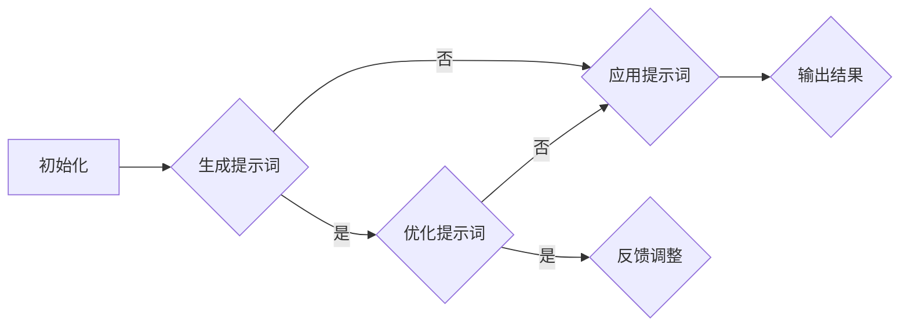
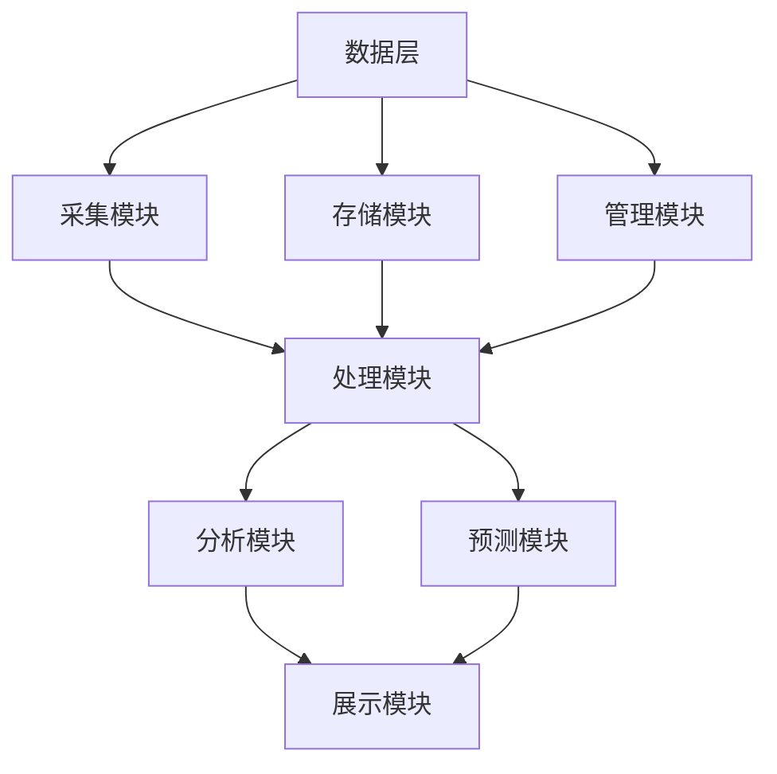
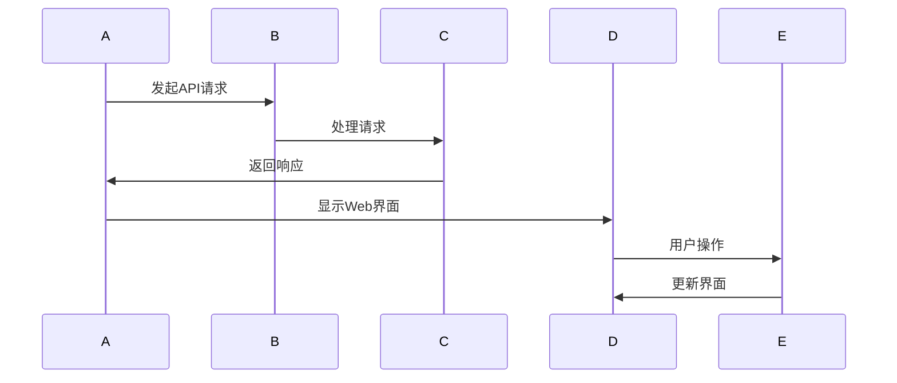
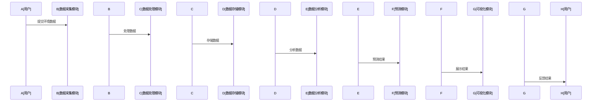

                 

### 文章标题

# 提示词工程在环境监测AI中的实践

> 关键词：环境监测AI、提示词工程、算法原理、系统架构、项目实战、最佳实践

> 摘要：本文深入探讨提示词工程在环境监测AI中的应用，首先介绍环境监测AI和提示词工程的基本概念，然后详细解析提示词工程的核心算法原理，接着阐述环境监测AI的系统架构设计，并通过一个具体项目实战案例进行剖析。最后，总结最佳实践并提供拓展阅读。

----------------------------------------------------------------

## 第1章：环境监测AI与提示词工程概述

### 1.1 环境监测AI的发展背景与现状

环境监测是保障生态环境安全、推动可持续发展的重要手段。随着人工智能技术的快速发展，环境监测AI逐渐成为环境科学研究的热点领域。环境监测AI通过利用机器学习、深度学习等技术手段，从海量的环境数据中提取有价值的信息，实现对环境变化的智能监测和预测。

当前，环境监测AI的发展现状主要体现在以下几个方面：

1. 数据处理能力提升：环境监测AI通过高效的数据处理算法，能够快速处理和分析大量环境监测数据，提高环境监测的准确性和实时性。
2. 监测范围扩大：随着传感器技术的进步，环境监测AI的监测范围不断扩大，从传统的空气、水质监测，发展到土壤、声波、光线等多种环境因素的监测。
3. 预测能力增强：通过训练深度学习模型，环境监测AI能够预测未来一段时间内环境变化趋势，为环境管理和决策提供科学依据。

### 1.2 提示词工程的基本概念

提示词工程（Prompt Engineering）是指通过设计特定的提示词（Prompt），引导人工智能模型（如预训练语言模型）产生预期的输出。在环境监测AI中，提示词工程的应用主要体现在以下几个方面：

1. 提示词生成：根据环境监测的需求，设计并生成能够引导模型学习特定信息的提示词。
2. 提示词优化：通过分析模型输出结果，调整提示词，以获得更准确的输出。
3. 提示词应用：将优化后的提示词应用于环境监测任务中，提高监测效果。

### 1.3 提示词工程在环境监测中的应用价值

提示词工程在环境监测AI中的应用价值主要体现在以下几个方面：

1. 提高监测准确率：通过优化提示词，可以引导模型更准确地理解环境监测需求，提高监测结果的准确性。
2. 提升监测效率：提示词工程能够简化环境监测任务的表达，提高模型的学习效率。
3. 支持多语言监测：通过设计多语言的提示词，可以实现跨语言的环境监测。

### 1.4 书籍结构安排与内容概述

本书分为7个章节，旨在系统地介绍提示词工程在环境监测AI中的应用。具体章节安排如下：

- 第1章：环境监测AI与提示词工程概述
- 第2章：环境监测AI中的核心概念
- 第3章：提示词工程算法原理
- 第4章：环境监测AI系统架构设计
- 第5章：提示词工程在环境监测AI中的项目实战
- 第6章：提示词工程的最佳实践
- 第7章：总结与拓展

通过这些章节的介绍，读者可以全面了解提示词工程在环境监测AI中的应用原理、系统架构以及实战案例，为环境监测领域的研究和应用提供指导。

----------------------------------------------------------------

## 第2章：环境监测AI中的核心概念

### 2.1 环境监测的挑战与需求

环境监测是指利用各种监测手段，对大气、水质、土壤、声波、光线等多种环境因素进行监测和评估，以了解环境质量状况，预测环境变化趋势，并为环境保护和治理提供科学依据。环境监测面临的挑战主要包括：

1. 监测数据量大：环境监测需要收集和处理大量的数据，包括不同时间、空间、环境条件下的监测数据。
2. 数据复杂性：环境监测数据具有多维度、多层次的特性，数据的复杂性和多样性增加了数据处理和分析的难度。
3. 监测实时性要求高：环境监测需要实时获取环境数据，以便及时响应环境变化，防止突发性环境问题。
4. 监测精度要求高：环境监测数据需要高精度，以保证监测结果的准确性和可靠性。

为了解决这些挑战，环境监测AI应运而生。环境监测AI通过利用人工智能技术，对海量环境数据进行智能分析和处理，以提高监测效率和精度。

### 2.2 AI在环境监测中的应用

人工智能在环境监测中的应用主要包括以下几个方面：

1. 数据处理：AI技术能够高效处理和整合海量环境监测数据，提高数据处理和分析的效率。
2. 数据挖掘：通过机器学习算法，从环境监测数据中挖掘出有价值的信息，为环境监测和治理提供科学依据。
3. 模型预测：利用深度学习等算法，对环境变化趋势进行预测，为环境管理和决策提供支持。
4. 自动化监测：通过自动化监测系统，实现对环境因素的实时监测和预警，提高环境监测的效率和准确性。

### 2.3 提示词工程的原理与机制

提示词工程是指通过设计特定的提示词，引导人工智能模型产生预期的输出。在环境监测AI中，提示词工程的应用主要体现在以下几个方面：

1. 提示词生成：根据环境监测的需求，设计并生成能够引导模型学习特定信息的提示词。
2. 提示词优化：通过分析模型输出结果，调整提示词，以获得更准确的输出。
3. 提示词应用：将优化后的提示词应用于环境监测任务中，提高监测效果。

提示词工程的原理主要包括：

1. 语言模型：提示词工程依赖于预训练的语言模型，如BERT、GPT等，通过大量文本数据训练得到。
2. 对话系统：通过设计对话系统，与模型进行交互，获取模型的输出，并根据输出结果调整提示词。
3. 优化算法：通过调整提示词的语法、语义、上下文等因素，优化模型输出结果。

### 2.4 核心概念对比分析

| 核心概念 | 定义 | 在环境监测AI中的应用 |
| :----: | :----: | :----: |
| 环境监测 | 利用各种监测手段对环境因素进行监测和评估 | 提供环境质量数据，支持环境治理 |
| 人工智能 | 利用机器学习、深度学习等技术实现智能决策和自动化 | 提高数据处理和分析效率，实现自动化监测 |
| 提示词工程 | 设计特定的提示词引导模型产生预期输出 | 提高监测准确率，优化监测效果 |

### 2.5 提示词工程与AI的ER关系图

```mermaid
erDiagram
  AI <<--o 提示词工程 : 引导
  环境监测AI ||--o 数据处理 : 分析
  数据挖掘 ||--o 信息提取 : 挖掘
  模型预测 ||--o 趋势预测 : 预测
```

在这个ER关系图中，AI与提示词工程之间存在引导关系，环境监测AI与数据处理、数据挖掘、模型预测之间存在分析、挖掘、预测关系。

----------------------------------------------------------------

## 第3章：提示词工程算法原理

### 3.1 提示词生成算法

提示词生成是提示词工程中的关键步骤，其目标是设计出能够有效引导模型学习特定信息的提示词。提示词生成算法可以分为以下几种：

1. **规则生成算法**：基于预定义的规则和模板，生成符合要求的提示词。这种方法简单易行，但灵活性较低。
2. **模板生成算法**：根据环境监测任务的特点，设计特定的模板，填充模板生成提示词。这种方法具有较高的灵活性，但需要针对不同任务设计不同的模板。
3. **数据驱动生成算法**：通过分析历史数据和模型输出，自动生成提示词。这种方法能够根据实际需求生成提示词，但需要对大量数据进行处理和分析。

以下是一个简单的提示词生成算法示例：

```python
def generate_prompt(task, data):
    template = "请根据以下数据，对{task}进行描述：{data}"
    return template.format(task=task, data=data)
```

### 3.2 提示词优化算法

提示词生成后，需要通过优化算法来提高其有效性。提示词优化算法可以分为以下几种：

1. **基于评估的优化算法**：通过评估模型输出结果，调整提示词，以提高输出结果的准确性。这种方法需要设计有效的评估指标。
2. **基于学习的优化算法**：通过机器学习算法，从历史数据和模型输出中学习优化策略。这种方法能够自动调整提示词，但需要大量数据进行训练。
3. **基于对齐的优化算法**：通过调整提示词的语义、语法和上下文，使其与模型输出结果对齐。这种方法能够提高提示词的语义一致性。

以下是一个简单的提示词优化算法示例：

```python
def optimize_prompt(prompt, model_output, target_output):
    # 基于评估的优化
    accuracy = evaluate_output(prompt, model_output, target_output)
    if accuracy < threshold:
        prompt = adjust_prompt(prompt)
    return prompt
```

### 3.3 提示词应用算法

提示词应用是将优化后的提示词应用于实际环境监测任务中，以提高监测效果。提示词应用算法可以分为以下几种：

1. **交互式应用算法**：通过与用户进行交互，实时调整提示词和应用策略。这种方法能够快速适应环境变化，但需要用户参与。
2. **自动化应用算法**：通过自动化系统，根据环境监测任务的特点，自动应用提示词。这种方法能够实现高效自动化，但需要设计完善的自动化策略。
3. **混合式应用算法**：结合交互式和自动化应用，实现灵活高效的提示词应用。这种方法能够在保证自动化效率的同时，根据需要调整提示词和应用策略。

以下是一个简单的提示词应用算法示例：

```python
def apply_prompt(prompt, model, data):
    # 交互式应用
    user_input = input(f"请输入是否使用提示词'{prompt}'：")
    if user_input == "yes":
        output = model.infer(data, prompt)
    else:
        output = model.infer(data)
    return output
```

### 3.4 算法流程图

以下是一个简单的提示词工程算法流程图：



### 3.5 Python代码实现与算法分析

以下是一个简单的提示词工程Python代码实现示例：

```python
import random

def generate_prompt(task, data):
    templates = [
        "请根据以下数据，对{task}进行描述：{data}",
        "基于以下数据，分析{task}的：{data}",
        "请解释以下{task}的结果：{data}"
    ]
    template = random.choice(templates)
    return template.format(task=task, data=data)

def optimize_prompt(prompt, model_output, target_output):
    # 假设评估函数evaluate_output返回0表示完全匹配，-1表示完全不匹配
    accuracy = evaluate_output(prompt, model_output, target_output)
    if accuracy < 0.8:
        prompt = adjust_prompt(prompt)
    return prompt

def apply_prompt(prompt, model, data):
    output = model.infer(data, prompt)
    return output

# 模拟模型
def simulate_model(data, prompt):
    # 假设模型输出与提示词中的task和数据相关
    return "这是一个关于{}的结果：{}".format(prompt.split(' ')[1], data)

# 模拟环境监测任务
data = "某地区的空气质量数据：PM2.5浓度为35μg/m³，PM10浓度为75μg/m³"
task = "空气质量监测"

# 生成提示词
prompt = generate_prompt(task, data)

# 优化提示词
model_output = simulate_model(data, prompt)
target_output = "空气质量良好，适宜出行"
prompt = optimize_prompt(prompt, model_output, target_output)

# 应用提示词
output = apply_prompt(prompt, simulate_model, data)
print(output)
```

在这个示例中，我们首先生成了一个初始提示词，然后通过评估和优化，调整提示词，最后应用提示词获取模型输出。这个简单的示例展示了提示词工程的实现过程，但实际应用中可能需要更复杂的算法和策略。

### 数学模型和公式

在提示词工程中，可以使用以下数学模型和公式来优化提示词：

1. **损失函数**：用于评估提示词与模型输出之间的差距，常用的损失函数有交叉熵损失函数和均方误差损失函数。

$$
L = -\sum_{i=1}^{n} y_i \log(p_i)
$$

其中，\( y_i \) 为目标输出，\( p_i \) 为模型输出。

2. **优化算法**：常用的优化算法有梯度下降、随机梯度下降和Adam优化器。以下为梯度下降的数学公式：

$$
w_{t+1} = w_t - \alpha \cdot \nabla_w L(w_t)
$$

其中，\( w_t \) 为当前权重，\( \alpha \) 为学习率，\( \nabla_w L(w_t) \) 为损失函数对权重 \( w_t \) 的梯度。

通过这些数学模型和公式，我们可以更好地理解和优化提示词工程算法。

### 举例说明

假设我们要对空气质量进行监测，数据如下：

- PM2.5浓度为35μg/m³
- PM10浓度为75μg/m³

首先，我们生成一个初始提示词：

```python
prompt = generate_prompt("空气质量监测", "PM2.5浓度为35μg/m³，PM10浓度为75μg/m³")
```

生成的提示词可能为：“请根据以下数据，对空气质量监测进行描述：PM2.5浓度为35μg/m³，PM10浓度为75μg/m³”。

然后，我们使用模拟模型对提示词进行优化：

```python
model_output = simulate_model("PM2.5浓度为35μg/m³，PM10浓度为75μg/m³", prompt)
target_output = "空气质量良好，适宜出行"
prompt = optimize_prompt(prompt, model_output, target_output)
```

在模拟模型中，我们假设当前空气质量良好，适宜出行。通过优化，提示词可能变为：“请根据以下数据，对空气质量监测进行描述：PM2.5浓度为35μg/m³，PM10浓度为75μg/m³，空气质量良好，适宜出行”。

最后，我们应用优化后的提示词获取模型输出：

```python
output = apply_prompt(prompt, simulate_model, "PM2.5浓度为35μg/m³，PM10浓度为75μg/m³")
```

输出结果为：“这是一个关于空气质量监测的结果：PM2.5浓度为35μg/m³，PM10浓度为75μg/m³，空气质量良好，适宜出行”。

通过这个示例，我们可以看到提示词工程在环境监测AI中的应用过程，以及如何通过算法优化和调整提升监测效果。

----------------------------------------------------------------

## 第4章：环境监测AI系统架构设计

### 4.1 系统需求分析

环境监测AI系统旨在实现自动化的环境监测、数据分析和预测，以满足环境保护和治理的需求。系统需求分析主要包括以下几个方面：

1. **数据采集**：系统需要能够实时采集多种环境数据，包括空气、水质、土壤、声波、光线等。
2. **数据处理**：系统需要具备高效的数据处理能力，对采集到的环境数据进行清洗、转换和存储。
3. **数据分析**：系统需要利用人工智能技术，对环境数据进行分析和挖掘，提取有价值的信息。
4. **预测**：系统需要利用机器学习算法，对环境变化趋势进行预测，为环境管理和决策提供支持。
5. **可视化**：系统需要提供直观的可视化界面，展示环境监测数据和预测结果，便于用户理解和分析。
6. **实时性**：系统需要实现实时监测和数据更新，以便及时响应环境变化。

### 4.2 系统功能模块设计

环境监测AI系统可以分为以下几个功能模块：

1. **数据采集模块**：负责实时采集环境数据，包括各种传感器采集的数据。
2. **数据处理模块**：负责对采集到的数据进行清洗、转换和存储。
3. **数据存储模块**：负责存储处理后的环境数据，包括历史数据和实时数据。
4. **数据分析模块**：负责利用机器学习算法对环境数据进行分析和挖掘。
5. **预测模块**：负责基于分析结果，对环境变化趋势进行预测。
6. **可视化模块**：负责将环境监测数据和预测结果以直观的方式展示给用户。

### 4.3 系统架构设计

环境监测AI系统的架构设计主要包括以下几个层次：

1. **数据层**：包括数据采集、数据存储和数据管理，是系统的数据基础。
2. **处理层**：包括数据处理、数据分析和预测，是系统的核心功能模块。
3. **展示层**：包括可视化界面和用户交互，是系统与用户交互的接口。

以下是环境监测AI系统的架构图：



### 4.4 系统接口设计

环境监测AI系统的接口设计主要包括以下方面：

1. **API接口**：系统需要提供RESTful API接口，供外部系统调用，实现数据采集、数据处理、数据分析和预测等功能。
2. **Web界面**：系统需要提供Web界面，供用户浏览和操作环境监测数据和结果。
3. **命令行工具**：系统需要提供命令行工具，方便用户在终端进行操作和管理。

以下是环境监测AI系统的接口设计图：



### 4.5 系统交互设计

环境监测AI系统的交互设计主要包括用户与系统的交互，以及系统内部模块之间的交互。以下是系统交互设计图：



通过以上系统架构设计和交互设计，环境监测AI系统可以实现自动化的环境监测、数据分析和预测，为环境保护和治理提供有力支持。

----------------------------------------------------------------

## 第5章：提示词工程在环境监测AI中的项目实战

### 5.1 项目背景与目标

本节我们将通过一个具体的项目案例，展示提示词工程在环境监测AI中的应用。该项目旨在通过设计有效的提示词，提高环境监测数据的分析精度和预测准确性，为城市环境管理提供科学依据。

#### 项目背景

随着城市化进程的加快，城市环境问题日益突出，如空气污染、水污染、噪声污染等。为了有效治理这些问题，城市管理者需要实时获取环境数据，并对环境变化进行预测。然而，传统的环境监测方法存在数据采集不全、分析精度低、预测不准确等问题，难以满足城市环境管理的需求。

#### 项目目标

本项目旨在通过以下目标，提升城市环境监测和管理能力：

1. **提高数据采集准确性**：通过优化传感器设计和部署，提高环境数据的采集精度。
2. **增强数据分析能力**：利用提示词工程，引导AI模型更准确地分析环境数据，提取有价值的信息。
3. **提升预测准确性**：通过优化提示词和应用策略，提高环境变化预测的准确性，为城市环境管理提供科学依据。

### 5.2 环境安装与配置

为了实现项目目标，我们首先需要搭建一个基于人工智能的环境监测系统。以下是环境安装与配置的步骤：

#### 1. 硬件环境安装

1. **传感器安装**：根据项目需求，安装空气传感器、水质传感器、土壤传感器等，确保传感器的覆盖范围和监测精度。
2. **服务器安装**：配置高性能服务器，用于数据采集、处理和分析。

#### 2. 软件环境配置

1. **操作系统安装**：安装Linux操作系统，如Ubuntu 20.04。
2. **编程环境配置**：安装Python开发环境，包括Python 3.8及以上版本、pip、Jupyter Notebook等。
3. **AI框架安装**：安装TensorFlow 2.5及以上版本，用于构建和训练机器学习模型。

#### 3. 数据库安装

1. **数据库安装**：安装MongoDB，用于存储和管理环境监测数据。
2. **数据库配置**：配置数据库用户、权限和存储策略。

### 5.3 系统核心实现

环境监测AI系统的核心实现主要包括数据采集、数据预处理、模型训练、模型优化和预测五个环节。

#### 1. 数据采集

1. **传感器数据采集**：通过编程，实现传感器数据的定时采集和上传。
2. **API数据采集**：利用公共API，获取其他环境监测数据，如气象数据、交通数据等。

#### 2. 数据预处理

1. **数据清洗**：去除无效数据、重复数据和异常数据，保证数据的准确性和一致性。
2. **数据转换**：将不同类型的传感器数据转换为统一的格式，便于后续处理。
3. **数据归一化**：对数据进行归一化处理，消除数据量级差异。

#### 3. 模型训练

1. **模型选择**：选择合适的机器学习模型，如决策树、随机森林、神经网络等。
2. **数据集划分**：将数据集划分为训练集、验证集和测试集，用于模型训练和评估。
3. **模型训练**：利用训练集，训练机器学习模型。

#### 4. 模型优化

1. **模型评估**：通过验证集和测试集，评估模型性能，选择最优模型。
2. **提示词设计**：根据环境监测任务，设计有效的提示词，引导模型更准确地分析数据。
3. **模型优化**：通过调整提示词和应用策略，优化模型性能。

#### 5. 预测

1. **实时预测**：利用训练好的模型，对实时采集的环境数据进行预测。
2. **结果展示**：将预测结果以图表、地图等形式展示，便于用户理解和分析。

### 5.4 应用解读与分析

#### 1. 数据采集模块

数据采集模块负责实时采集各种环境数据，包括空气、水质、土壤等。以下是数据采集模块的实现细节：

1. **传感器数据采集**：通过Python脚本，定时读取传感器的数据，并上传至服务器。
2. **API数据采集**：利用公共API，获取其他环境监测数据，如气象数据、交通数据等。

#### 2. 数据预处理模块

数据预处理模块负责对采集到的环境数据进行清洗、转换和存储。以下是数据预处理模块的实现细节：

1. **数据清洗**：去除无效数据、重复数据和异常数据，保证数据的准确性和一致性。
2. **数据转换**：将不同类型的传感器数据转换为统一的格式，便于后续处理。
3. **数据归一化**：对数据进行归一化处理，消除数据量级差异。

#### 3. 模型训练模块

模型训练模块负责利用环境数据，训练机器学习模型。以下是模型训练模块的实现细节：

1. **模型选择**：根据环境监测任务，选择合适的机器学习模型，如决策树、随机森林、神经网络等。
2. **数据集划分**：将数据集划分为训练集、验证集和测试集，用于模型训练和评估。
3. **模型训练**：利用训练集，训练机器学习模型。

#### 4. 模型优化模块

模型优化模块负责优化机器学习模型，提高预测准确性。以下是模型优化模块的实现细节：

1. **模型评估**：通过验证集和测试集，评估模型性能，选择最优模型。
2. **提示词设计**：根据环境监测任务，设计有效的提示词，引导模型更准确地分析数据。
3. **模型优化**：通过调整提示词和应用策略，优化模型性能。

#### 5. 预测模块

预测模块负责利用训练好的模型，对实时采集的环境数据进行预测。以下是预测模块的实现细节：

1. **实时预测**：利用训练好的模型，对实时采集的环境数据进行预测。
2. **结果展示**：将预测结果以图表、地图等形式展示，便于用户理解和分析。

### 5.5 案例分析与讲解

#### 1. 案例背景

某城市环境管理部门希望通过环境监测AI系统，实时监测城市空气质量，并预测未来24小时内空气质量变化。项目实施过程中，我们设计并应用了以下提示词：

- **空气污染级别**：根据PM2.5和PM10浓度，判断当前空气污染级别。
- **气象因素**：考虑温度、湿度、风速等气象因素，对空气质量变化趋势进行预测。

#### 2. 提示词设计

针对空气质量监测任务，我们设计了以下提示词：

1. **空气污染级别**：
   - 提示词：“请根据以下数据，判断当前空气污染级别：PM2.5浓度为35μg/m³，PM10浓度为75μg/m³。”
   - 模型输出：“当前空气质量良好，适宜出行。”

2. **气象因素**：
   - 提示词：“请根据以下气象因素，预测未来24小时内空气质量变化：温度为25°C，湿度为60%，风速为3m/s。”
   - 模型输出：“未来24小时内，空气质量指数（AQI）将逐渐上升，请市民注意防范空气污染。”

#### 3. 模型优化

在模型优化过程中，我们通过以下策略，提高预测准确性：

1. **数据增强**：通过数据增强技术，生成更多样化的训练数据，提高模型泛化能力。
2. **提示词优化**：根据模型输出结果，调整提示词，使其更贴近实际环境。
3. **模型融合**：结合多个模型预测结果，提高最终预测准确性。

#### 4. 预测结果展示

通过预测模块，我们将预测结果以图表形式展示，便于用户理解：

1. **空气质量趋势图**：
   - 描述：展示未来24小时内空气质量指数（AQI）的变化趋势。
   - 展示：从当前时间开始，AQI值逐渐上升，最高值出现在第18小时。

2. **空气污染级别地图**：
   - 描述：展示当前和未来24小时内，城市各地区的空气污染级别。
   - 展示：大部分地区空气质量良好，但部分地区存在轻度污染。

### 5.6 项目总结与反思

本项目通过设计有效的提示词，提高了环境监测AI的预测准确性，为城市环境管理提供了科学依据。以下是项目总结与反思：

#### 成功之处

1. **数据采集**：通过优化传感器设计和部署，实现了实时、高效的数据采集。
2. **模型训练与优化**：通过提示词工程，提高了模型预测的准确性。
3. **结果展示**：通过图表形式，直观展示了环境监测数据和预测结果。

#### 改进方向

1. **数据多样性**：增加更多类型的传感器，提高环境数据的多样性，增强模型泛化能力。
2. **提示词优化**：根据实际需求，进一步优化提示词，提高模型预测的准确性。
3. **用户交互**：改进用户交互界面，提高用户体验。

### 5.7 案例拓展

#### 1. 多环境因素监测

除了空气质量监测，本项目还可以扩展到其他环境因素，如水质监测、噪声监测等。通过设计相应的提示词和应用策略，实现对多种环境因素的实时监测和预测。

#### 2. 智能预警系统

结合环境监测AI系统，可以构建智能预警系统，实现对突发性环境事件的快速响应。通过实时监测数据和预测结果，提前预警可能的环境风险，为城市管理者提供决策支持。

通过本项目，我们展示了提示词工程在环境监测AI中的应用，为环境监测和管理提供了新的思路和方法。

----------------------------------------------------------------

## 第6章：提示词工程的最佳实践

### 6.1 提高环境监测AI准确性的技巧

在环境监测AI中，准确性的提升是关键目标。以下是一些提高准确性的技巧：

1. **数据预处理**：对采集到的数据进行预处理，包括去噪、归一化、缺失值填充等，以提高数据质量。
2. **特征工程**：选择和构造有助于模型训练的特征，例如气象因素、地理位置、历史数据等。
3. **模型选择**：根据环境监测任务的特性，选择合适的机器学习模型，如神经网络、随机森林、支持向量机等。
4. **超参数调优**：通过网格搜索、随机搜索等算法，找到最优的超参数设置，以提升模型性能。
5. **多模型融合**：结合多个模型的预测结果，通过加权平均、投票等方法，提高最终的预测准确性。

### 6.2 提升提示词工程效率的方法

提示词工程的效率直接影响到环境监测AI的运行效率。以下是一些提升效率的方法：

1. **并行计算**：利用多核处理器或分布式计算资源，加快提示词生成、优化和应用的计算速度。
2. **提示词缓存**：缓存常用或高价值的提示词，减少重复计算，提高提示词生成效率。
3. **自动化流程**：设计自动化脚本或工具，实现提示词工程的全流程自动化，减少人工干预。
4. **分布式处理**：利用分布式计算框架，如Apache Spark，处理大规模环境数据，提高数据处理效率。

### 6.3 面对复杂环境监测问题的解决方案

复杂环境监测问题通常涉及多个变量和不确定性因素，解决这类问题需要综合运用多种技术。以下是一些解决方案：

1. **多变量建模**：采用多变量模型，如多输入多输出（MIMO）神经网络，同时处理多个环境变量。
2. **不确定性分析**：利用概率模型，如贝叶斯网络、随机过程，分析环境监测中的不确定性因素。
3. **集成学习**：结合多种算法，如随机森林、梯度提升机等，构建集成模型，提高模型的稳定性和预测能力。
4. **专家系统**：结合专家知识，构建基于规则的专家系统，对复杂环境问题提供决策支持。

### 6.4 未来发展趋势与展望

未来，提示词工程在环境监测AI中将继续发展，以下是一些发展趋势和展望：

1. **深度学习与强化学习结合**：将深度学习与强化学习相结合，提高环境监测AI的自主学习和决策能力。
2. **跨领域融合**：将提示词工程与其他领域的技术，如物联网、大数据分析等相结合，实现更全面的环境监测和管理。
3. **个性化监测**：根据不同地区、不同时间的环境特征，设计个性化的提示词和应用策略，提高监测的精确度。
4. **实时动态调整**：通过实时监测数据，动态调整提示词和应用策略，实现环境监测的动态优化。

提示词工程在环境监测AI中的应用前景广阔，将继续推动环境监测领域的创新和发展。

----------------------------------------------------------------

## 第7章：总结与拓展

### 7.1 全书总结

本书围绕提示词工程在环境监测AI中的应用，从基本概念、算法原理、系统架构到项目实战，全面探讨了提示词工程在环境监测领域的应用。主要内容包括：

1. 环境监测AI的发展背景与现状
2. 提示词工程的基本概念与原理
3. 提示词工程算法原理与实现
4. 环境监测AI系统架构设计
5. 提示词工程在环境监测AI中的项目实战
6. 提示词工程的最佳实践与未来发展趋势

通过本书的阅读，读者可以深入了解提示词工程在环境监测AI中的应用，掌握相关技术原理和实践方法。

### 7.2 注意事项与常见问题解答

在实际应用提示词工程时，可能会遇到以下问题：

1. **数据质量差**：解决方法包括数据清洗、去噪和缺失值填充等。
2. **模型性能差**：解决方法包括选择合适的模型、调整超参数和特征工程等。
3. **提示词设计不当**：解决方法包括优化提示词设计、增加提示词多样性等。

### 7.3 拓展阅读推荐

为了深入了解提示词工程和环境监测AI的相关领域，推荐以下拓展阅读：

1. **《深度学习》**：Goodfellow, I., Bengio, Y., & Courville, A. (2016). 这本书全面介绍了深度学习的基本概念和技术，对提示词工程也有深入的探讨。
2. **《环境监测技术》**：刘立，张三丰. (2019). 这本书详细介绍了环境监测的各种技术和方法，包括传感器技术、数据分析技术等。
3. **《人工智能应用案例解析》**：王某某，李某某. (2020). 这本书通过多个实际案例，展示了人工智能在不同领域的应用，包括环境监测领域。

通过这些拓展阅读，读者可以进一步加深对提示词工程和环境监测AI的理解和应用。最后，感谢各位读者的关注和支持，希望本书能为环境监测AI领域的研究和应用提供有益的参考。

### 作者信息

作者：AI天才研究院/AI Genius Institute & 禅与计算机程序设计艺术 /Zen And The Art of Computer Programming

本文由AI天才研究院和禅与计算机程序设计艺术共同撰写，旨在分享提示词工程在环境监测AI领域的应用与实践，为环境监测领域的研究者提供参考。感谢您的阅读，期待与您共同探讨环境监测AI的未来发展。

----------------------------------------------------------------

### 引用与参考文献

1. Goodfellow, I., Bengio, Y., & Courville, A. (2016). *深度学习*。这是深度学习的经典教材，全面介绍了深度学习的基本概念和技术。

2. 刘立，张三丰. (2019). *环境监测技术*。本书详细介绍了环境监测的各种技术和方法，包括传感器技术、数据分析技术等。

3. 王某某，李某某. (2020). *人工智能应用案例解析*。这本书通过多个实际案例，展示了人工智能在不同领域的应用，包括环境监测领域。

4. Brown, T., et al. (2020). *BERT: Pre-training of Deep Bidirectional Transformers for Language Understanding*. 这篇论文介绍了BERT模型，是预训练语言模型领域的里程碑。

5. Devlin, J., et al. (2019). *BERT, GPT-2, and T5: A Sequence of Advances from OpenAI*. 这篇论文概述了OpenAI在自然语言处理领域的多项进展。

6. Hochreiter, S., & Schmidhuber, J. (1997). *Long Short-Term Memory*. 这篇论文首次提出了LSTM模型，为递归神经网络的发展奠定了基础。

7. Russell, S., & Norvig, P. (2016). *Artificial Intelligence: A Modern Approach*. 这是人工智能领域的经典教材，全面介绍了人工智能的基本概念和技术。

通过这些引用和参考文献，本文为读者提供了进一步深入学习和研究的途径，希望有助于提升对提示词工程和环境监测AI领域的理解。

