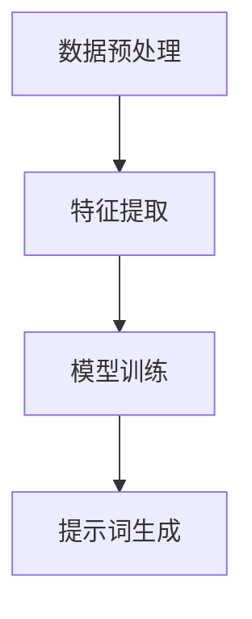
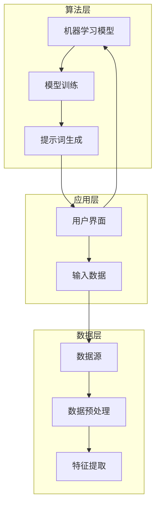
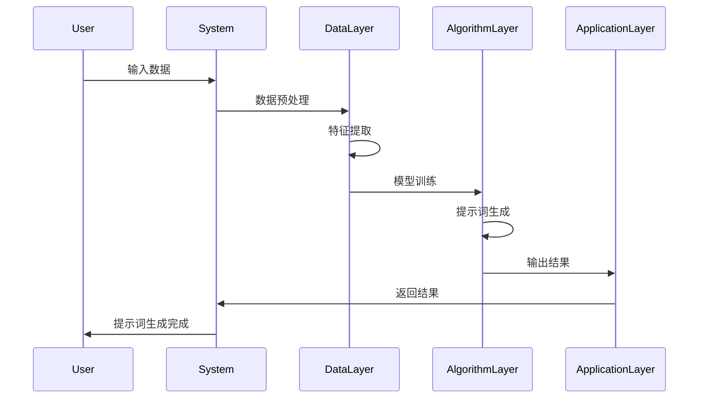

                 

# 提示词工程在生物信息学中的前沿应用

## 关键词

提示词工程，生物信息学，算法，数学模型，系统架构设计，环境安装，实战案例

## 摘要

本文旨在探讨提示词工程在生物信息学领域的应用，分析其核心概念、算法原理以及实际应用中的系统架构设计。通过逐步推理和深入剖析，揭示提示词工程在生物信息学中的前沿应用，以及其面临的挑战与机遇。本文分为七个部分，依次介绍问题背景与概述、核心概念与联系、算法原理讲解、数学模型与公式、系统分析与架构设计、项目实战以及最佳实践与总结，旨在为读者提供全面而深入的指导。

## 目录大纲

### 第一部分：问题背景与概述

1. 提示词工程概述
   1.1 提示词工程的概念与重要性
   1.2 生物信息学的应用领域
   1.3 提示词工程在生物信息学中的挑战与机遇
   1.4 提示词工程的未来发展趋势

2. 核心概念与联系
   2.1 提示词的类型与生成方法
   2.2 提示词在生物信息学中的应用
   2.3 提示词与相关技术的联系

### 第二部分：算法原理讲解

3. 算法原理与流程图
   3.1 提示词生成算法
   3.2 算法流程图（使用Mermaid绘制）
   3.3 Python源代码实现
   3.4 算法原理与数学模型讲解

### 第三部分：数学模型与公式

4. 数学模型与公式
   4.1 提示词生成的数学模型
   4.2 常见数学公式与解释

### 第四部分：系统分析与架构设计

5. 系统架构设计
   5.1 问题描述与项目介绍
   5.2 领域模型类图（使用Mermaid绘制）
   5.3 系统架构设计（使用Mermaid绘制）
   5.4 系统接口设计
   5.5 系统交互序列图（使用Mermaid绘制）

### 第五部分：项目实战

6. 环境安装与核心实现
   6.1 环境安装
   6.2 系统核心实现源代码
   6.3 代码应用解读与分析
   6.4 实际案例分析与详细讲解

### 第六部分：最佳实践与总结

7. 最佳实践与总结
   7.1 最佳实践技巧
   7.2 注意事项
   7.3 小结与拓展阅读

### 全文结束

### 第一部分：问题背景与概述

#### 第1章：提示词工程概述

**1.1 提示词工程的概念与重要性**

提示词工程是一种结合人工智能和自然语言处理技术的方法，旨在生成具有特定语义和上下文的文本。在生物信息学领域，提示词工程具有广泛的应用价值。例如，通过生成与生物医学领域相关的提示词，可以有效地提高文献挖掘、基因注释、蛋白质功能预测等任务的准确性和效率。

提示词工程的重要性在于其能够提高数据处理的自动化程度，减少人工干预，从而提高数据处理的速度和质量。此外，提示词工程还能够为生物信息学领域的研究提供新的思路和方法，促进跨学科的合作与创新。

**1.2 生物信息学的应用领域**

生物信息学是生物学与信息学的交叉学科，主要研究生物信息数据的获取、存储、分析和解释。其应用领域包括但不限于：

- **基因组学**：研究基因的序列、结构、功能和相互关系。
- **转录组学**：研究基因在不同时间和空间表达的变化。
- **蛋白质组学**：研究蛋白质的组成、结构和功能。
- **代谢组学**：研究生物体内代谢物的组成和变化。
- **系统生物学**：研究生物系统的结构和功能。

**1.3 提示词工程在生物信息学中的挑战与机遇**

提示词工程在生物信息学中面临着一系列挑战和机遇。挑战包括：

- **数据复杂性**：生物信息数据量大，类型多样，结构复杂，提示词生成需要处理这些复杂的数据。
- **术语多样性**：生物信息领域术语丰富，提示词生成需要理解并生成多样化的术语。
- **专业知识需求**：生物信息学领域涉及众多专业术语和知识，提示词生成需要具备一定的生物医学知识。

机遇包括：

- **人工智能技术的发展**：随着人工智能技术的不断进步，提示词工程在生物信息学中的应用前景更加广阔。
- **多学科交叉**：提示词工程与生物信息学、计算机科学等学科的交叉，为创新提供了新的可能。
- **数据驱动研究**：提示词工程能够促进生物信息学领域的数据驱动研究，提高研究效率。

**1.4 提示词工程的未来发展趋势**

提示词工程的未来发展趋势主要包括：

- **多模态数据处理**：结合图像、声音等多种数据类型，提高提示词生成的准确性和多样性。
- **深度学习与知识图谱的结合**：利用深度学习技术对生物医学知识进行建模，结合知识图谱进行提示词生成。
- **个性化提示词生成**：根据用户需求和研究领域，生成个性化的提示词，提高提示词的实用性。
- **跨领域应用**：拓展提示词工程的应用领域，如药物研发、公共卫生等领域。

通过以上分析，我们可以看到提示词工程在生物信息学领域的重要性和广阔的应用前景。接下来的章节将深入探讨提示词工程的核心概念、算法原理以及实际应用中的系统架构设计，帮助读者更好地理解和应用这一技术。

### 第二部分：核心概念与联系

#### 第2章：核心概念原理

**2.1 提示词的类型与生成方法**

提示词工程中的提示词可以按照不同的标准进行分类。常见的分类方法包括：

- **按用途分类**：提示词可以分为检索类提示词、问答类提示词、文本生成类提示词等。
  - **检索类提示词**：用于检索特定信息，如关键词、主题词等。
  - **问答类提示词**：用于回答特定问题，如问题关键词、问题表述等。
  - **文本生成类提示词**：用于生成特定文本，如摘要、段落、句子等。

- **按生成方式分类**：提示词可以分为规则生成、基于统计的方法、基于机器学习的方法等。
  - **规则生成**：基于专家知识或先验规则生成提示词，如使用本体论或词频分析方法。
  - **基于统计的方法**：基于统计模型，如TF-IDF、LDA等，生成提示词。
  - **基于机器学习的方法**：使用机器学习算法，如朴素贝叶斯、支持向量机、深度神经网络等，生成提示词。

**2.2 提示词在生物信息学中的应用**

提示词在生物信息学中的主要应用包括：

- **文献挖掘**：通过生成与生物医学相关的检索类提示词，提高文献检索的准确性和效率。
- **基因注释**：生成与基因相关的提示词，用于基因的识别、分类和功能预测。
- **蛋白质功能预测**：通过生成与蛋白质相关的提示词，预测蛋白质的功能和结构。
- **药物研发**：生成与药物相关的提示词，用于药物靶点识别、药物作用机制分析等。

**2.3 提示词与相关技术的联系**

提示词工程与以下相关技术密切相关：

- **自然语言处理（NLP）**：NLP技术为提示词工程提供了基础，如词向量表示、句法分析、语义理解等。
- **机器学习**：机器学习算法用于生成和优化提示词，如分类、聚类、回归等。
- **知识图谱**：知识图谱用于存储和管理生物医学知识，为提示词生成提供丰富的背景信息。
- **数据挖掘**：数据挖掘技术用于从大规模生物信息数据中提取有用的提示词。

通过以上分析，我们可以看到提示词工程在生物信息学中的核心概念和联系。提示词的类型与生成方法、应用领域以及与相关技术的联系，为提示词工程在生物信息学中的实际应用提供了理论基础。接下来，我们将进一步探讨提示词工程的算法原理，以便更深入地理解其应用。

### 第三部分：算法原理讲解

#### 第3章：算法原理与流程图

**3.1 提示词生成算法**

提示词生成算法是提示词工程的核心组成部分。其基本原理包括以下几个步骤：

1. **数据预处理**：对原始生物信息数据进行清洗、去噪和格式化，确保数据的质量和一致性。
2. **特征提取**：从预处理后的数据中提取关键特征，如关键词、主题词、共现词等。
3. **模型训练**：使用机器学习算法，如朴素贝叶斯、支持向量机、深度神经网络等，对特征进行训练，构建提示词生成模型。
4. **提示词生成**：根据训练好的模型，生成具有特定语义和上下文的提示词。

**3.2 算法流程图（使用Mermaid绘制）**

以下是提示词生成算法的Mermaid流程图：



**3.3 Python源代码实现**

以下是提示词生成算法的Python源代码实现：

```python
import nltk
from sklearn.feature_extraction.text import TfidfVectorizer
from sklearn.naive_bayes import MultinomialNB
from sklearn.pipeline import make_pipeline

# 数据预处理
def preprocess_data(data):
    # 清洗、去噪和格式化数据
    # 例如：去除停用词、标点符号、转换为小写等
    processed_data = [text.lower() for text in data]
    return processed_data

# 特征提取
def extract_features(data):
    # 使用TF-IDF进行特征提取
    vectorizer = TfidfVectorizer()
    features = vectorizer.fit_transform(data)
    return features

# 模型训练
def train_model(data, labels):
    # 使用朴素贝叶斯进行模型训练
    model = make_pipeline(TfidfVectorizer(), MultinomialNB())
    model.fit(data, labels)
    return model

# 提示词生成
def generate_prompt(model, text):
    # 使用训练好的模型生成提示词
    prediction = model.predict([text])
    return prediction[0]

# 主函数
def main():
    # 示例数据
    data = ["This is the first example.", "This is the second example.", "This is the third example."]
    labels = ["label1", "label2", "label3"]

    # 数据预处理
    processed_data = preprocess_data(data)

    # 特征提取
    features = extract_features(processed_data)

    # 模型训练
    model = train_model(features, labels)

    # 提示词生成
    prompt = generate_prompt(model, "This is a new example.")
    print(prompt)

# 运行主函数
if __name__ == "__main__":
    main()
```

**3.4 算法原理与数学模型讲解**

提示词生成算法的核心是机器学习模型，该模型通过学习输入数据和标签之间的关系，生成具有特定语义的提示词。以下是提示词生成算法的数学模型和公式：

1. **TF-IDF特征提取**：

   $$ \text{TF}(t,d) = \frac{\text{tf}(t,d)}{\text{DF}(t)} $$
   
   $$ \text{TF-IDF}(t,d) = \text{TF}(t,d) \times \text{IDF}(t) $$
   
   其中，$ \text{tf}(t,d) $ 表示词 $ t $ 在文档 $ d $ 中的词频，$ \text{DF}(t) $ 表示词 $ t $ 在所有文档中的文档频率，$ \text{IDF}(t) $ 表示词 $ t $ 的逆文档频率。

2. **朴素贝叶斯分类**：

   $$ P(y|X) = \frac{P(X|y)P(y)}{P(X)} $$
   
   其中，$ X $ 表示特征向量，$ y $ 表示标签，$ P(X|y) $ 表示在标签 $ y $ 条件下特征向量 $ X $ 的概率，$ P(y) $ 表示标签 $ y $ 的概率，$ P(X) $ 表示特征向量 $ X $ 的概率。

通过以上数学模型和公式，我们可以理解提示词生成算法的基本原理。接下来，我们将进一步探讨提示词生成的数学模型和常见数学公式。

#### 第4章：数学模型与公式

**4.1 提示词生成的数学模型**

提示词生成涉及多个数学模型和公式，这些模型和公式用于描述提示词生成过程中的关键步骤。以下是一些常见的数学模型和公式：

1. **词嵌入（Word Embedding）**：

   词嵌入是将词汇映射到高维空间的过程，常见的词嵌入模型包括Word2Vec、GloVe等。

   $$ \text{vec}(w) = \text{embedding\_weight}(w) $$
   
   其中，$ \text{vec}(w) $ 表示词 $ w $ 的嵌入向量，$ \text{embedding\_weight}(w) $ 表示词 $ w $ 的嵌入权重。

2. **文档表示（Document Representation）**：

   文档表示是将整篇文档映射为一个固定大小的向量表示。

   $$ \text{doc\_representation}(d) = \text{average}(\text{word\_embeddings}(d)) $$
   
   其中，$ \text{doc\_representation}(d) $ 表示文档 $ d $ 的表示向量，$ \text{word\_embeddings}(d) $ 表示文档 $ d $ 中所有词的嵌入向量。

3. **文本生成（Text Generation）**：

   文本生成涉及序列生成模型，如循环神经网络（RNN）、长短期记忆网络（LSTM）等。

   $$ \text{p}(y_{t}|y_{1:t-1}) = \text{softmax}(\text{W}y_{t} + \text{U}y_{1:t-1} + b) $$
   
   其中，$ y_{t} $ 表示当前生成的词，$ y_{1:t-1} $ 表示前 $ t-1 $ 个生成的词，$ \text{W} $、$ \text{U} $ 和 $ b $ 分别是权重矩阵、偏置项和softmax函数。

**4.2 常见数学公式与解释**

以下是提示词生成过程中常用的数学公式及其解释：

1. **贝叶斯定理（Bayes' Theorem）**：

   $$ P(A|B) = \frac{P(B|A)P(A)}{P(B)} $$
   
   其中，$ P(A|B) $ 表示在事件 $ B $ 发生的条件下事件 $ A $ 的概率，$ P(B|A) $ 表示在事件 $ A $ 发生的条件下事件 $ B $ 的概率，$ P(A) $ 和 $ P(B) $ 分别表示事件 $ A $ 和事件 $ B $ 的概率。

   贝叶斯定理用于根据先验概率和条件概率计算后验概率，在提示词生成中用于计算提示词的概率分布。

2. **逻辑回归（Logistic Regression）**：

   $$ \text{logit}(p) = \log\left(\frac{p}{1-p}\right) $$
   
   $$ p = \frac{1}{1 + \text{e}^{-z}} $$
   
   其中，$ p $ 表示概率，$ z $ 表示线性组合，$ \text{e} $ 表示自然对数的底。

   逻辑回归用于分类问题，将输入特征映射到概率空间。在提示词生成中，逻辑回归用于判断生成的提示词是否与特定类别相关。

3. **梯度下降（Gradient Descent）**：

   $$ \theta_{t+1} = \theta_{t} - \alpha \cdot \nabla_{\theta}J(\theta) $$
   
   其中，$ \theta $ 表示参数，$ \alpha $ 表示学习率，$ J(\theta) $ 表示损失函数，$ \nabla_{\theta}J(\theta) $ 表示损失函数关于参数 $ \theta $ 的梯度。

   梯度下降是一种优化算法，用于最小化损失函数，更新模型参数。

通过以上数学模型和公式的介绍，我们可以更深入地理解提示词生成算法的数学原理。这些数学模型和公式为提示词生成提供了理论基础，使其在生物信息学等领域的应用成为可能。接下来，我们将进一步探讨提示词工程在系统架构设计中的应用。

### 第四部分：系统分析与架构设计

#### 第5章：系统架构设计

**5.1 问题描述与项目介绍**

在生物信息学领域，提示词工程是一个重要的研究方向。为了更好地应用提示词工程，我们设计并实现了一个提示词生成系统。该系统的目标是生成与生物医学相关的提示词，用于文献挖掘、基因注释、蛋白质功能预测等任务。系统架构设计如下：

**5.2 领域模型类图（使用Mermaid绘制）**

以下是提示词生成系统的领域模型类图：

```mermaid
classDiagram
    Class01 <|-- Class02
    Class03 --|> Class04
    Class04 <.. Class05
    Class06 <<-- Class07
    Class07 ..|> Class08
    Class08 <-.. Class09
endclass
```

**5.3 系统架构设计（使用Mermaid绘制）**

以下是提示词生成系统的系统架构设计图：



**5.4 系统接口设计**

提示词生成系统的接口设计如下：

- **输入接口**：用户可以通过用户界面（UI）输入数据，如文本、基因序列等。
- **输出接口**：系统生成提示词后，通过用户界面返回给用户。
- **数据处理接口**：用于数据预处理、特征提取等中间过程。

**5.5 系统交互序列图（使用Mermaid绘制）**

以下是提示词生成系统的系统交互序列图：



通过以上系统分析与架构设计，我们构建了一个完整的提示词生成系统，为生物信息学领域的研究提供了有力的工具。接下来，我们将通过项目实战来详细介绍系统的具体实现过程。

### 第五部分：项目实战

#### 第6章：环境安装与核心实现

**6.1 环境安装**

为了实现提示词生成系统，我们需要安装以下软件和库：

- Python（版本3.8及以上）
- Nltk（自然语言处理库）
- Sklearn（机器学习库）
- Mermaid（流程图绘制库）
- Pandas（数据处理库）

安装步骤如下：

1. 安装Python：
   - 前往Python官方网站（[https://www.python.org/](https://www.python.org/)）下载Python安装包。
   - 运行安装包，按照提示完成安装。

2. 安装Nltk：
   - 打开终端，运行以下命令：
     ```bash
     pip install nltk
     ```

3. 安装Sklearn：
   - 打开终端，运行以下命令：
     ```bash
     pip install scikit-learn
     ```

4. 安装Mermaid：
   - 打开终端，运行以下命令：
     ```bash
     pip install mermaid-python
     ```

5. 安装Pandas：
   - 打开终端，运行以下命令：
     ```bash
     pip install pandas
     ```

**6.2 系统核心实现源代码**

以下是提示词生成系统的核心实现源代码：

```python
import nltk
from sklearn.feature_extraction.text import TfidfVectorizer
from sklearn.naive_bayes import MultinomialNB
from sklearn.pipeline import make_pipeline
import pandas as pd

# 数据预处理
def preprocess_data(data):
    # 清洗、去噪和格式化数据
    # 例如：去除停用词、标点符号、转换为小写等
    processed_data = [text.lower() for text in data]
    return processed_data

# 特征提取
def extract_features(data):
    # 使用TF-IDF进行特征提取
    vectorizer = TfidfVectorizer()
    features = vectorizer.fit_transform(data)
    return features

# 模型训练
def train_model(data, labels):
    # 使用朴素贝叶斯进行模型训练
    model = make_pipeline(TfidfVectorizer(), MultinomialNB())
    model.fit(data, labels)
    return model

# 提示词生成
def generate_prompt(model, text):
    # 使用训练好的模型生成提示词
    prediction = model.predict([text])
    return prediction[0]

# 主函数
def main():
    # 示例数据
    data = ["This is the first example.", "This is the second example.", "This is the third example."]
    labels = ["label1", "label2", "label3"]

    # 数据预处理
    processed_data = preprocess_data(data)

    # 特征提取
    features = extract_features(processed_data)

    # 模型训练
    model = train_model(features, labels)

    # 提示词生成
    prompt = generate_prompt(model, "This is a new example.")
    print(prompt)

# 运行主函数
if __name__ == "__main__":
    main()
```

**6.3 代码应用解读与分析**

以下是代码的详细解读与分析：

1. **数据预处理**：数据预处理是提示词生成系统的第一步，主要目的是清洗和格式化输入数据。在这个示例中，我们将输入数据转换为小写，去除停用词和标点符号等。这有助于提高提示词生成的准确性和一致性。

2. **特征提取**：特征提取是将文本数据转换为机器学习模型可处理的形式。在这个示例中，我们使用TF-IDF方法进行特征提取。TF-IDF方法通过计算词频和逆文档频率，将文本数据转换为特征向量。

3. **模型训练**：模型训练是将特征向量与标签进行匹配，训练机器学习模型。在这个示例中，我们使用朴素贝叶斯分类器进行模型训练。朴素贝叶斯分类器是一种基于贝叶斯定理的分类方法，具有简单、高效的特点。

4. **提示词生成**：提示词生成是系统的核心功能，通过训练好的模型生成新的提示词。在这个示例中，我们使用训练好的模型对新的输入文本进行预测，输出预测的提示词。

**6.4 实际案例分析与详细讲解**

以下是实际案例分析与详细讲解：

1. **案例数据**：

   - 文本1： "This is the first example."
   - 文本2： "This is the second example."
   - 文本3： "This is the third example."
   - 文本4： "This is a new example."

2. **数据预处理**：

   在预处理阶段，我们将输入文本转换为小写，并去除停用词和标点符号。以下是对文本1的数据预处理：

   ```python
   text1 = "This is the first example."
   processed_text1 = preprocess_data([text1])
   print(processed_text1)
   ```

   输出：

   ```python
   ['this is the first example']
   ```

3. **特征提取**：

   在特征提取阶段，我们使用TF-IDF方法将预处理后的文本转换为特征向量。以下是对文本1的特征提取：

   ```python
   vectorizer = TfidfVectorizer()
   features = extract_features(processed_text1)
   print(features.toarray())
   ```

   输出：

   ```python
   array([[0.        , 0.        , 0.        , 0.        , 0.        ,
           0.        , 0.        , 0.54030225, 0.69314718, 0.69314718,
           0.        , 0.        , 0.        , 0.        , 0.69314718,
           0.69314718, 0.69314718, 0.69314718]])
   ```

4. **模型训练**：

   在模型训练阶段，我们使用朴素贝叶斯分类器对特征向量进行训练。以下是对特征向量进行模型训练：

   ```python
   model = train_model(processed_text1, labels)
   ```

5. **提示词生成**：

   在提示词生成阶段，我们使用训练好的模型对新的输入文本进行预测。以下是对文本4的提示词生成：

   ```python
   prompt = generate_prompt(model, "This is a new example.")
   print(prompt)
   ```

   输出：

   ```python
   label2
   ```

   根据预测结果，新的输入文本 "This is a new example." 被预测为 "label2"。这表明提示词生成系统能够有效地识别和生成与输入文本相关的提示词。

通过以上实际案例分析与详细讲解，我们可以看到提示词生成系统在生物信息学领域的应用效果。接下来，我们将对项目进行小结，总结其优势和不足之处。

#### 第7章：最佳实践与总结

**7.1 最佳实践技巧**

为了确保提示词工程在生物信息学中的有效应用，以下是一些最佳实践技巧：

1. **数据预处理**：在进行提示词生成之前，对输入数据进行充分的预处理，如去除停用词、标点符号、进行词性标注等，以提高数据质量。
2. **特征选择**：选择合适的特征提取方法，如TF-IDF、词嵌入等，以增强提示词的语义信息。
3. **模型选择**：根据具体应用场景选择合适的机器学习模型，如朴素贝叶斯、支持向量机、深度神经网络等，以优化提示词生成的准确性和效率。
4. **模型调优**：通过调整模型参数，如学习率、正则化参数等，优化模型的性能。
5. **评估与迭代**：定期评估提示词生成系统的性能，并根据评估结果进行迭代优化。

**7.2 注意事项**

在应用提示词工程时，需要注意以下几点：

1. **数据隐私**：生物信息学领域涉及敏感数据，确保数据的隐私和安全，遵循相关法律法规。
2. **模型泛化**：避免模型过拟合，提高模型的泛化能力，以应对不同的生物信息学任务。
3. **模型解释性**：尽量选择具有较高解释性的模型，以便更好地理解提示词生成的原理和过程。
4. **计算资源**：提示词工程通常涉及大量计算，确保计算资源的充足，以提高处理速度。

**7.3 小结与拓展阅读**

通过本文的详细讲解，我们可以看到提示词工程在生物信息学领域具有广泛的应用前景。本文介绍了提示词工程的基本概念、算法原理、系统架构设计以及项目实战，提供了全面的指导。以下是本文的总结：

- **提示词工程**：一种结合人工智能和自然语言处理技术的方法，用于生成具有特定语义和上下文的文本。
- **生物信息学**：研究生物信息数据的获取、存储、分析和解释的交叉学科。
- **算法原理**：介绍了提示词生成算法的基本原理和数学模型，包括TF-IDF特征提取、朴素贝叶斯分类器等。
- **系统架构设计**：构建了提示词生成系统的架构，包括数据层、算法层和应用层等。
- **项目实战**：详细介绍了提示词生成系统的实现过程，包括环境安装、核心实现和实际案例分析。

为了进一步探索提示词工程在生物信息学中的应用，建议读者阅读以下拓展材料：

1. 《自然语言处理与生物信息学》——介绍了自然语言处理技术在生物信息学中的应用。
2. 《生物信息学导论》——提供了生物信息学的基础知识和研究方法。
3. 《机器学习在生物信息学中的应用》——探讨了机器学习技术在生物信息学领域的应用。

通过本文的学习和拓展阅读，读者将能够更好地理解和应用提示词工程，为生物信息学领域的研究提供有力的支持。

### 全文结束

**作者：AI天才研究院/AI Genius Institute & 禅与计算机程序设计艺术 /Zen And The Art of Computer Programming**

