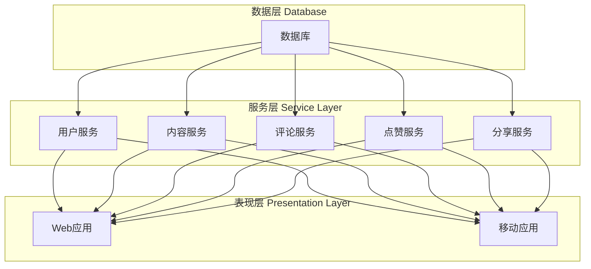
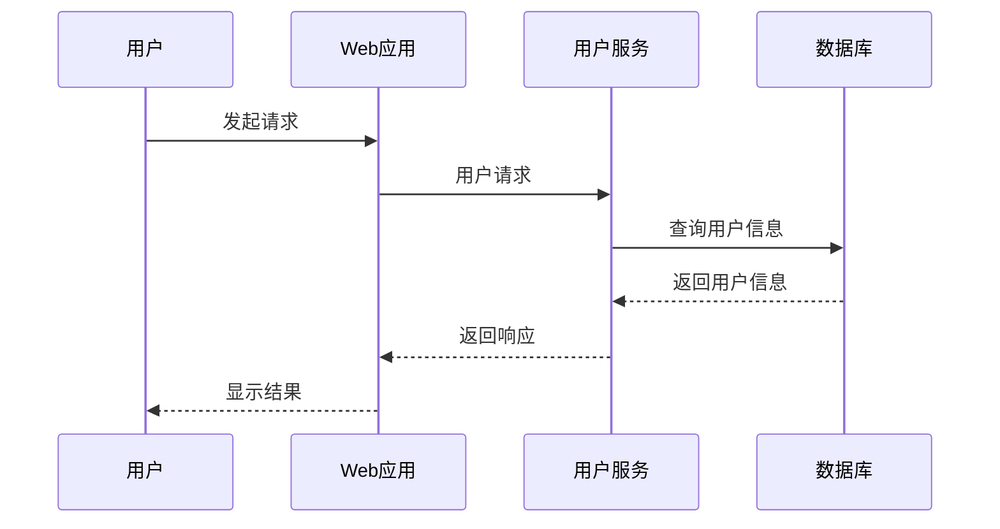

                 


### # 提示词工程在社交媒体AI中的角色

> 关键词：提示词工程、社交媒体AI、算法原理、系统架构、数学模型

> 摘要：本文将深入探讨提示词工程在社交媒体AI中的角色。随着社交媒体的迅猛发展和人工智能技术的不断进步，提示词工程作为一种关键技术，正逐渐成为提升AI性能和用户体验的重要手段。本文将从问题背景、核心概念、算法原理、数学模型、系统架构以及实战应用等方面，全面解析提示词工程在社交媒体AI中的重要作用。

----------------------------------------------------------------

## 第一部分：问题背景与核心概念

### 第1章：问题背景

### 1.1 社交媒体与人工智能的融合

#### 1.1.1 社交媒体的现状与发展趋势

##### 1.1.1.1 社交媒体的定义

社交媒体是一种通过互联网平台进行的用户生成内容和互动交流的媒介。它允许用户分享信息、观点、兴趣和经历，从而形成强大的社交网络。

##### 1.1.1.2 社交媒体的发展历程

社交媒体的发展可以追溯到20世纪90年代，随着互联网的普及，早期的社交媒体如论坛、博客逐渐兴起。21世纪初，以Facebook、Twitter、Instagram等为代表的现代社交媒体平台迅速崛起，改变了人们的沟通方式和信息获取方式。

##### 1.1.1.3 社交媒体的主要特点

社交媒体具有以下主要特点：

1. **用户生成内容**：社交媒体平台的核心是用户生成的内容，包括文本、图片、视频等。
2. **互动性**：社交媒体平台鼓励用户之间的互动，如点赞、评论、分享等。
3. **社交网络**：社交媒体平台建立了庞大的社交网络，用户可以通过好友关系形成网络。
4. **个性化推荐**：社交媒体平台利用人工智能技术，为用户提供个性化的内容推荐。

#### 1.1.2 人工智能的崛起与影响

##### 1.1.2.1 人工智能的定义

人工智能（AI）是指使计算机模拟人类智能行为的科学和技术。它包括机器学习、深度学习、自然语言处理等多种技术。

##### 1.1.2.2 人工智能的发展历程

人工智能的研究可以追溯到20世纪50年代，随着计算机性能的提升和算法的进步，人工智能技术在21世纪得到了飞速发展。近年来，深度学习等先进技术的应用，使得人工智能在各个领域取得了显著成果。

##### 1.1.2.3 人工智能的主要技术分类

人工智能主要技术分类包括：

1. **机器学习**：通过训练数据集，让计算机自动学习规律和模式。
2. **深度学习**：一种特殊的机器学习技术，通过多层神经网络进行特征提取和决策。
3. **自然语言处理**：使计算机能够理解、生成和处理自然语言。
4. **计算机视觉**：使计算机能够理解和处理图像和视频。

### 1.2 社交媒体AI的现状

#### 1.2.1 社交媒体AI的应用领域

社交媒体AI的应用领域非常广泛，主要包括以下几个方面：

1. **内容推荐**：通过分析用户行为和兴趣，为用户提供个性化的内容推荐。
2. **情感分析**：对用户生成的内容进行情感分析，了解用户的情绪和态度。
3. **安全监控**：利用AI技术进行社交媒体内容监控，防止滥用和不良行为。
4. **用户画像**：通过分析用户数据，构建详细的用户画像，为个性化服务提供支持。

#### 1.2.2 社交媒体AI的主要挑战

1. **数据隐私**：社交媒体平台需要处理大量用户数据，如何保护用户隐私是一个重要问题。
2. **算法偏见**：AI算法可能会在处理数据时产生偏见，导致不公平的结果。
3. **用户体验**：AI算法需要确保为用户提供高质量、个性化的体验。
4. **内容质量**：AI算法需要有效过滤和识别不良内容，保障社交媒体平台的健康生态。

### 1.3 提示词工程的角色与意义

#### 1.3.1 提示词工程的定义

提示词工程（Query Engineering）是一种通过优化查询语言来提高查询效率和性能的技术。在社交媒体AI中，提示词工程主要用于优化AI模型的输入和输出。

##### 1.3.1.1 提示词工程的起源

提示词工程起源于数据库查询优化领域，随着人工智能技术的发展，其在社交媒体AI中的应用逐渐受到重视。

##### 1.3.1.2 提示词工程的组成部分

提示词工程主要包括以下组成部分：

1. **查询生成**：根据用户需求生成查询语句。
2. **查询优化**：对查询语句进行优化，提高查询效率。
3. **结果评估**：对查询结果进行评估，保证查询质量。

#### 1.3.2 提示词工程在社交媒体AI中的重要性

1. **提高AI模型性能**：通过优化查询语句，可以提供更准确的输入数据，从而提高AI模型的性能。
2. **优化用户体验**：高质量的查询结果可以提供更好的用户体验。
3. **提升内容质量**：通过优化查询结果，可以筛选出高质量的内容，提升社交媒体平台的内容质量。
4. **增强数据隐私保护**：通过优化查询，可以减少对用户隐私数据的暴露。

----------------------------------------------------------------

## 第二部分：核心概念与联系

### 第2章：核心概念与联系

### 2.1 提示词的概念与类型

#### 2.1.1 提示词的定义

提示词（Query Terms）是指在社交媒体AI中用于搜索或检索信息的词语。提示词可以是单个词或短语，用于描述用户的需求或兴趣。

##### 2.1.1.1 提示词的起源

提示词最早出现在数据库查询中，用于指定查询条件。

##### 2.1.1.2 提示词的类型

根据提示词的作用，可以分为以下几种类型：

1. **关键词**：用于描述用户需求的词汇，如“科技”、“旅游”、“美食”等。
2. **过滤词**：用于排除不相关结果的词汇，如“不要”、“不包括”等。
3. **情感词**：用于描述用户情感状态的词汇，如“喜欢”、“不喜欢”、“兴奋”等。

#### 2.1.2 提示词与语义理解的关系

提示词是语义理解的基础，通过分析提示词，可以理解用户的意图和需求。

##### 2.1.2.1 提示词在语义理解中的作用

1. **明确查询意图**：提示词可以帮助明确用户的查询意图，从而提高查询的准确性。
2. **指导搜索策略**：提示词可以指导搜索算法选择合适的搜索策略。

##### 2.1.2.2 提示词与语言模型的关系

语言模型（Language Model）是一种用于预测文本序列的概率模型。提示词与语言模型的关系如下：

1. **提示词生成**：语言模型可以用于生成提示词，提高查询语句的语义准确性。
2. **提示词优化**：通过语言模型分析提示词的使用频率和语义相关性，可以优化提示词。

### 2.2 社交媒体AI中的关键概念

#### 2.2.1 语言模型

##### 2.2.1.1 语言模型的定义

语言模型是一种概率模型，用于预测自然语言文本的下一个词或词组。

##### 2.2.1.2 语言模型的类型

根据训练数据和模型结构，语言模型可以分为以下几种类型：

1. **n-gram模型**：基于前n个词的统计模型。
2. **神经网络模型**：基于神经网络的概率模型。
3. **生成对抗网络（GAN）**：基于生成对抗网络的概率模型。

##### 2.2.1.3 语言模型在社交媒体AI中的应用

1. **内容推荐**：通过分析用户的历史行为和语言特征，语言模型可以预测用户可能感兴趣的内容。
2. **情感分析**：通过分析文本的语言特征，语言模型可以判断文本的情感倾向。
3. **对话系统**：通过语言模型，对话系统可以理解用户的提问并生成合适的回答。

#### 2.2.2 机器学习算法

##### 2.2.2.1 机器学习算法的定义

机器学习算法是一种通过训练数据集，使计算机自动学习规律和模式的技术。

##### 2.2.2.2 常见的机器学习算法

常见的机器学习算法包括：

1. **线性回归**：用于预测线性关系。
2. **决策树**：用于分类和回归。
3. **支持向量机（SVM）**：用于分类。
4. **随机森林**：用于分类和回归。
5. **深度学习**：用于复杂的特征提取和模式识别。

##### 2.2.2.3 机器学习算法在社交媒体AI中的应用

1. **用户画像**：通过机器学习算法，可以构建详细的用户画像，为个性化推荐提供支持。
2. **情感分析**：通过机器学习算法，可以分析用户生成的内容，了解用户的情感和态度。
3. **内容推荐**：通过机器学习算法，可以根据用户的行为和兴趣，推荐合适的内容。

### 2.3 提示词工程与社交媒体AI的关联

#### 2.3.1 提示词工程在社交媒体AI中的实现方法

提示词工程在社交媒体AI中的实现方法主要包括以下步骤：

1. **数据收集与预处理**：收集社交媒体数据，并进行预处理，如去重、去噪、分词等。
2. **提示词生成**：利用语言模型生成提示词，提高查询语句的语义准确性。
3. **提示词优化**：通过分析提示词的使用频率和语义相关性，优化提示词。
4. **提示词评估**：对生成的提示词进行评估，确保查询质量。
5. **查询优化**：根据评估结果，优化查询语句，提高查询效率。

##### 2.3.1.1 数据收集与预处理

数据收集与预处理是提示词工程的基础，主要包括以下步骤：

1. **数据源选择**：选择合适的社交媒体数据源，如微博、抖音、Facebook等。
2. **数据收集**：利用爬虫或其他工具，收集社交媒体数据。
3. **数据预处理**：对收集到的数据进行预处理，如去重、去噪、分词等。

##### 2.3.1.2 提示词生成与优化

提示词生成与优化是提示词工程的核心，主要包括以下步骤：

1. **提示词生成**：利用语言模型生成提示词，如基于TF-IDF、词嵌入等方法。
2. **提示词优化**：根据提示词的使用频率和语义相关性，对提示词进行优化，如基于相关性度量、多样性度量等方法。

##### 2.3.1.3 提示词评估与反馈

提示词评估与反馈是确保提示词质量的关键，主要包括以下步骤：

1. **提示词评估**：对生成的提示词进行评估，如基于准确率、召回率、F1值等指标。
2. **反馈机制**：根据评估结果，对提示词进行反馈，如调整提示词权重、删除低质量提示词等。

##### 2.3.1.4 提示词工程在社交媒体AI中的应用案例

提示词工程在社交媒体AI中的应用案例包括：

1. **内容推荐**：通过提示词工程，为用户推荐感兴趣的内容。
2. **情感分析**：通过提示词工程，分析用户生成的内容，了解用户的情感和态度。
3. **安全监控**：通过提示词工程，监控社交媒体内容，防止滥用和不良行为。

----------------------------------------------------------------

## 第三部分：算法原理讲解

### 第3章：算法原理讲解

### 3.1 提示词生成算法

提示词生成算法是提示词工程的重要环节，用于生成高质量的提示词。提示词生成算法可以分为基于统计的方法和基于深度学习的方法。

#### 3.1.1 基于统计的方法

基于统计的方法主要通过分析文本的词频、TF-IDF等统计信息来生成提示词。

##### 3.1.1.1 关键词提取算法

关键词提取算法是一种常用的基于统计的方法，通过分析文本的词频和词的重要性来提取关键词。

1. **TF-IDF算法**：TF-IDF（Term Frequency-Inverse Document Frequency）是一种常用关键词提取算法，通过计算词频和逆向文档频率来评估词的重要性。

$$
\text{TF-IDF} = \text{TF} \times \text{IDF}
$$

其中，TF表示词频，IDF表示逆向文档频率。

2. **TextRank算法**：TextRank是一种基于图论的文本排名算法，通过分析文本的词频和词之间的关系来提取关键词。

##### 3.1.1.2 频率统计算法

频率统计算法通过统计文本中各个词的频率来生成提示词。

1. **词频统计**：词频统计是简单统计文本中各个词出现的次数。

2. **词频加权重统计**：词频加权重统计是在词频统计的基础上，根据词的重要程度对词频进行加权。

#### 3.1.2 基于深度学习的方法

基于深度学习的方法主要通过神经网络模型来生成提示词。

##### 3.1.2.1 语言模型生成算法

语言模型生成算法是一种基于深度学习的提示词生成方法，通过训练神经网络模型来生成提示词。

1. **循环神经网络（RNN）**：循环神经网络是一种适用于序列数据的神经网络模型，通过记忆机制来处理文本序列。

2. **长短时记忆网络（LSTM）**：长短时记忆网络是循环神经网络的一种改进，通过门控机制来避免梯度消失问题。

3. **变换器模型（Transformer）**：变换器模型是一种基于自注意力机制的神经网络模型，具有强大的序列建模能力。

##### 3.1.2.2 序列生成算法

序列生成算法是一种基于深度学习的提示词生成方法，通过生成文本序列来生成提示词。

1. **生成对抗网络（GAN）**：生成对抗网络是一种由生成器和判别器组成的神经网络模型，通过对抗训练生成高质量的文本序列。

2. **变分自编码器（VAE）**：变分自编码器是一种基于深度学习的生成模型，通过编码和解码器生成文本序列。

### 3.2 提示词优化算法

提示词优化算法用于提高提示词的质量，主要包括以下方面：

#### 3.2.1 提高提示词相关性

提高提示词相关性是通过分析提示词和查询意图之间的关系，优化提示词的质量。

##### 3.2.1.1 相似度计算方法

相似度计算方法是一种用于评估提示词和查询意图相似性的方法，常用的相似度计算方法包括：

1. **余弦相似度**：余弦相似度是一种基于向量空间模型的相似度计算方法，通过计算两个向量的余弦值来评估相似度。

$$
\text{相似度} = \frac{\text{向量A} \cdot \text{向量B}}{\|\text{向量A}\| \times \|\text{向量B}\|}
$$

2. **欧氏距离**：欧氏距离是一种基于欧几里得空间模型的相似度计算方法，通过计算两个向量之间的欧氏距离来评估相似度。

$$
\text{相似度} = \sqrt{\sum_{i=1}^{n} (\text{向量A}_i - \text{向量B}_i)^2}
$$

##### 3.2.1.2 相关性增强算法

相关性增强算法是一种用于提高提示词相关性的算法，通过分析提示词和查询意图之间的关系，优化提示词的质量。

1. **词嵌入**：词嵌入是一种将词汇映射到高维向量空间的方法，通过词嵌入模型，可以更好地捕捉词汇之间的语义关系。

2. **注意力机制**：注意力机制是一种用于优化神经网络模型的方法，通过动态调整网络中不同部分的重要性，提高模型的性能。

#### 3.2.2 提高提示词多样性

提高提示词多样性是通过增加提示词的多样性，提高查询结果的丰富度。

##### 3.2.2.1 多样性度量方法

多样性度量方法是一种用于评估提示词多样性的方法，常用的多样性度量方法包括：

1. **信息熵**：信息熵是一种用于评估系统混乱程度的指标，通过计算系统的信息熵，可以评估系统的多样性。

$$
\text{多样性} = -\sum_{i=1}^{n} p_i \log_2 p_i
$$

2. **Jaccard相似度**：Jaccard相似度是一种用于评估集合之间相似度的方法，通过计算集合之间的Jaccard系数，可以评估集合的多样性。

$$
\text{Jaccard相似度} = \frac{\text{交集大小}}{\text{并集大小}}
$$

##### 3.2.2.2 多样性增强算法

多样性增强算法是一种用于提高提示词多样性的算法，通过分析提示词和查询意图之间的关系，增加提示词的多样性。

1. **随机采样**：随机采样是一种简单有效的多样性增强方法，通过随机采样生成新的提示词。

2. **正则化**：正则化是一种通过引入约束条件，优化模型性能的方法，通过正则化，可以增加提示词的多样性。

3. **生成对抗网络（GAN）**：生成对抗网络是一种通过对抗训练生成多样化结果的模型，通过GAN，可以生成具有多样性的提示词。

----------------------------------------------------------------

## 第四部分：数学模型和数学公式

### 第4章：数学模型和数学公式

在提示词工程中，数学模型和数学公式扮演着至关重要的角色，它们不仅帮助我们在理论和实践中量化提示词的相关性、多样性等关键指标，还为我们提供了优化算法性能的量化工具。以下我们将详细讨论几个核心的数学模型和公式。

### 4.1 提示词相关性的计算

提示词相关性是评估提示词与查询意图匹配程度的重要指标。为了量化这一匹配程度，我们可以使用各种相似度计算方法，其中余弦相似度和欧氏距离是两种常用的方法。

#### 4.1.1 余弦相似度

余弦相似度是一种基于向量空间模型的方法，它通过计算两个向量的夹角余弦值来评估它们的相似度。公式如下：

$$
\text{cosine\_similarity} = \frac{\text{向量A} \cdot \text{向量B}}{\|\text{向量A}\| \times \|\text{向量B}\|}
$$

其中，$\text{向量A}$ 和 $\text{向量B}$ 分别是提示词和查询意图在特征空间中的表示，$\text{·}$ 表示点积，$\|\|$ 表示向量的欧几里得范数。

#### 4.1.2 欧氏距离

欧氏距离是一种基于欧几里得空间的方法，它通过计算两个点之间的直线距离来评估它们的相似度。公式如下：

$$
\text{Euclidean\_distance} = \sqrt{\sum_{i=1}^{n} (\text{向量A}_i - \text{向量B}_i)^2}
$$

其中，$\text{向量A}$ 和 $\text{向量B}$ 分别是提示词和查询意图在特征空间中的表示，$n$ 是特征空间的维度。

### 4.2 提示词多样性的度量

提示词多样性是评估提示词集合丰富程度的重要指标。为了量化这一丰富程度，我们可以使用信息熵和Jaccard相似度等方法。

#### 4.2.1 信息熵

信息熵是信息论中的一个基本概念，它用于评估一个系统的不确定性。在提示词多样性度量中，信息熵可以用来评估提示词集合的丰富程度。公式如下：

$$
H = -\sum_{i=1}^{N} p_i \log_2 p_i
$$

其中，$H$ 是信息熵，$p_i$ 是提示词集合中第 $i$ 个提示词的概率，$N$ 是提示词集合的大小。

#### 4.2.2 Jaccard相似度

Jaccard相似度是用于评估两个集合相似度的指标，它在提示词多样性度量中也具有重要作用。公式如下：

$$
J(A, B) = \frac{|A \cap B|}{|A \cup B|}
$$

其中，$A$ 和 $B$ 是两个提示词集合，$|A \cap B|$ 是集合 $A$ 和 $B$ 的交集大小，$|A \cup B|$ 是集合 $A$ 和 $B$ 的并集大小。

通过这些数学模型和公式，我们可以更精确地评估和优化提示词的质量，从而提升社交媒体AI系统的性能和用户体验。

----------------------------------------------------------------

## 第五部分：系统分析与架构设计方案

### 第5章：系统分析与架构设计方案

### 5.1 问题场景介绍

#### 5.1.1 社交媒体平台的运营现状

在当前社交媒体平台运营的背景下，用户规模和活跃度持续增长。以某知名社交媒体平台为例，其日活跃用户数已达到数亿级别，用户生成的内容种类繁多，包括文本、图片、视频等。平台上的用户互动频繁，包括点赞、评论、分享等行为，形成了庞大的社交网络。

#### 5.1.2 内容生产与消费模式

在社交媒体平台上，用户既是内容的生成者也是内容的消费者。用户通过发布帖子、上传图片和视频等方式生成内容，而其他用户则通过浏览、点赞、评论等方式消费这些内容。随着人工智能技术的发展，平台逐渐采用AI技术来优化内容推荐、情感分析、用户画像等功能，以提高用户体验和平台运营效率。

### 5.2 系统功能设计

#### 5.2.1 领域模型

领域模型是系统设计的核心，它定义了系统中涉及的实体及其关系。以下是社交媒体平台领域模型的简化版本，使用Mermaid类图进行表示：

```mermaid
classDiagram
    User ..|> Content
    User ..|> Comment
    User ..|> Like
    Content ..|> Comment
    Content ..|> Like
    Content ..|> Share

    User[用户]
    Content[内容]
    Comment[评论]
    Like[点赞]
    Share[分享]
```

在该领域模型中，用户（User）是核心实体，他们生成和消费内容（Content），并对内容进行评论（Comment）、点赞（Like）和分享（Share）。

#### 5.2.2 用户模型

用户模型定义了用户的属性和行为，以下是用户模型的简化版本：

```mermaid
classDiagram
    User {
        id
        name
        email
        password
        preferences
        active
    }

    User %%- 生成内容
    Content {
        id
        title
        content
        creator
        created_at
        type
    }

    User %%- 评论内容
    Comment {
        id
        content
        creator
        created_at
        parent_content
    }

    User %%- 点赞内容
    Like {
        id
        user
        content
        created_at
    }

    User %%- 分享内容
    Share {
        id
        user
        content
        shared_at
    }
```

在该用户模型中，用户（User）具有基本属性（如id、name、email等），以及生成、评论、点赞和分享内容的操作。

### 5.3 系统架构设计

#### 5.3.1 系统架构

社交媒体平台的系统架构设计包括数据层、服务层和表现层，以下是系统架构的简化版本，使用Mermaid架构图进行表示：



在该系统架构中，数据层负责数据的存储和管理，服务层负责业务逻辑的处理，表现层负责与用户的交互。

#### 5.3.2 系统接口设计

系统接口设计定义了服务层与数据层、表现层之间的交互接口，以下是系统接口的简化版本，使用Mermaid序列图进行表示：



在该接口设计中，用户通过Web应用发起请求，用户服务处理请求并与数据库进行交互，最终返回响应给用户。

通过以上系统分析与架构设计方案，我们可以构建一个高效、可扩展的社交媒体平台系统，为用户提供优质的内容推荐、情感分析、用户画像等服务。

----------------------------------------------------------------

## 第六部分：项目实战

### 第6章：项目实战

在本部分，我们将通过一个具体的社交媒体AI项目，详细讲解项目的环境安装、系统核心实现、代码应用解读与分析、实际案例分析和详细讲解剖析，以及项目小结。

#### 6.1 项目背景

本项目是一个基于Python和TensorFlow的社交媒体AI项目，旨在构建一个能够自动生成提示词的系

