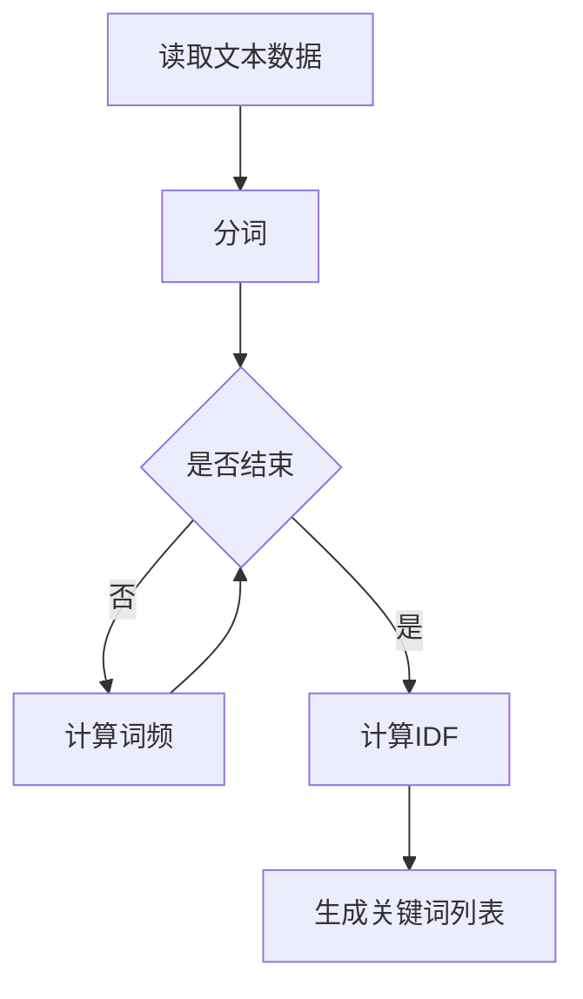
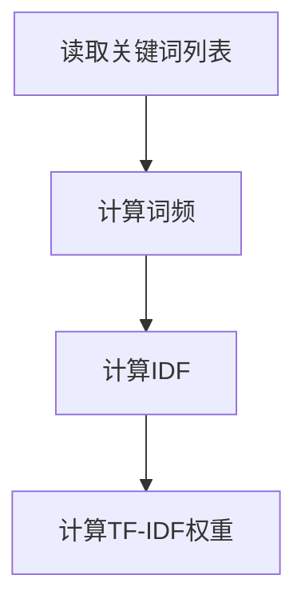
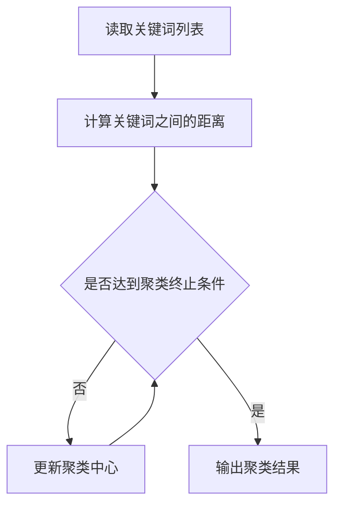
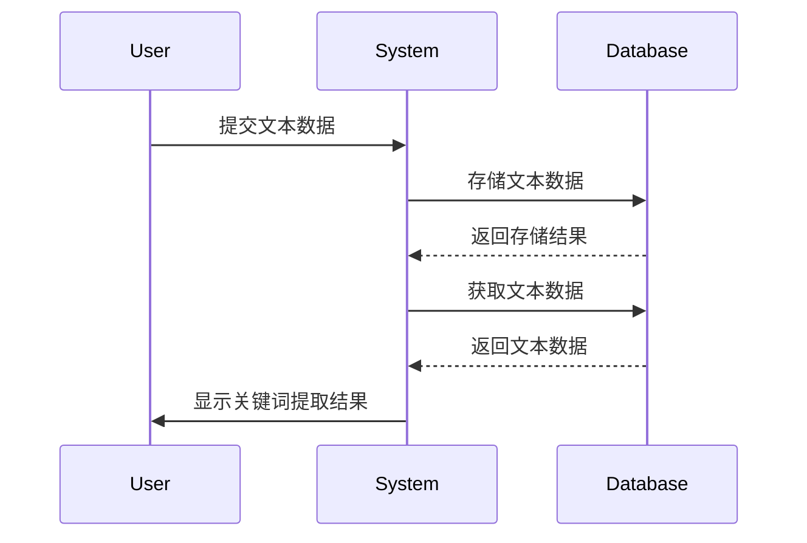
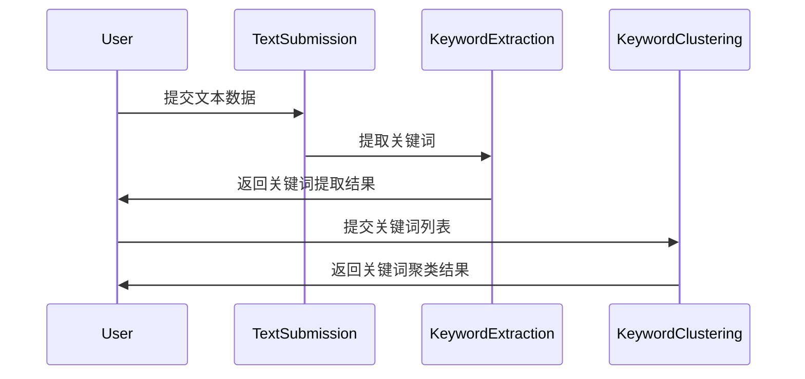

                 


### 1. 确定文章的结构

为了撰写一篇结构严谨、逻辑清晰的技术博客文章，我们可以按照以下结构进行组织：

- **引言部分**：介绍提示词工程的概念、其在科学研究中的应用背景，以及文章的目的和结构。
- **核心概念与联系**：详细阐述提示词工程的核心概念、原理及其与其他技术的联系。
- **算法原理讲解**：分析提示词工程的基本算法原理，使用Mermaid绘制流程图和Python代码进行解释。
- **系统分析与架构设计**：从系统角度介绍提示词工程的应用，包括功能设计、架构设计和接口设计。
- **项目实战**：通过一个实际项目案例，演示如何实施提示词工程，并分析其实施效果。
- **最佳实践 tips**：总结实际应用中的经验和教训，提供一些建议和注意事项。
- **小结**：对文章的主要内容进行总结，指出提示词工程在科学研究中的重要性。
- **拓展阅读**：推荐一些相关的阅读资料，帮助读者进一步了解提示词工程。

### 2. 编写引言部分

**引言部分**需要简明扼要地介绍提示词工程的概念，说明其在科学研究中的重要性。同时，要介绍文章的结构，让读者对后续内容有一个大致的了解。

```markdown
# 提示词工程在科学研究中的应用

关键词：提示词工程，科学研究，算法原理，系统架构，项目实战

摘要：本文旨在探讨提示词工程在科学研究中的应用，从核心概念、算法原理、系统架构到项目实战，全面解析提示词工程的实施与应用。文章结构如下：

1. 引言：介绍提示词工程的概念和其在科学研究中的重要性。
2. 核心概念与联系：阐述提示词工程的核心概念及其与其他技术的联系。
3. 算法原理讲解：分析提示词工程的基本算法原理，使用Mermaid绘制流程图和Python代码进行解释。
4. 系统分析与架构设计：从系统角度介绍提示词工程的应用，包括功能设计、架构设计和接口设计。
5. 项目实战：通过一个实际项目案例，演示如何实施提示词工程，并分析其实施效果。
6. 最佳实践 tips：总结实际应用中的经验和教训。
7. 小结：对文章的主要内容进行总结，指出提示词工程在科学研究中的重要性。
8. 拓展阅读：推荐一些相关的阅读资料。

接下来，我们将逐章深入探讨提示词工程在科学研究中的应用。
```

### 3. 编写核心概念与联系部分

**核心概念与联系**部分需要详细阐述提示词工程的核心概念、原理及其与其他技术的联系。为了增强可读性和理解性，可以采用表格和Mermaid ER图进行辅助说明。

```markdown
## 核心概念与联系

### 提示词工程的基本概念

提示词工程是一种基于自然语言处理（NLP）和数据挖掘的技术，旨在通过构建和使用提示词（Keywords）来优化信息检索、文本分析和数据挖掘过程。提示词可以看作是对文档、文章或数据集的核心主题或关键词的抽象表示。

### 提示词工程的原理

提示词工程的原理主要包括以下几个方面：

- **关键词提取**：从大量文本数据中提取出具有代表性的关键词。
- **关键词权重计算**：对提取出的关键词进行权重计算，以反映它们在文本中的重要程度。
- **关键词聚类**：将具有相似性的关键词进行聚类，以形成主题或领域。
- **关键词优化**：根据应用需求对关键词进行筛选、调整和优化。

### 提示词工程与其他技术的联系

- **与自然语言处理（NLP）的联系**：提示词工程是NLP的一个分支，它依赖于NLP的技术和方法，如词性标注、句法分析等。
- **与数据挖掘的联系**：提示词工程利用数据挖掘技术，对文本数据进行处理和分析，以提取有价值的信息。
- **与信息检索的联系**：提示词工程中的关键词可以作为搜索索引，用于信息检索和推荐系统。

### 表格：提示词工程与其他技术的比较

| 技术      | 描述                                  | 关联提示词工程的程度 |
|-----------|---------------------------------------|---------------------|
| 自然语言处理（NLP） | 对文本数据进行理解、分析和生成       | 高度关联，作为基础技术 |
| 数据挖掘   | 从大量数据中发现有价值的信息         | 高度关联，用于数据处理 |
| 信息检索   | 根据关键词或查询检索相关信息         | 中度关联，用于结果展示 |

### Mermaid ER图：提示词工程相关实体关系图

```mermaid
erDiagram
    User ||--|{ Keyword }
    Keyword ||--|{ Document }
    Document ||--|{ Keyword }
```

在上图中，用户（User）与关键词（Keyword）之间有直接关联，关键词（Keyword）与文档（Document）之间存在多对多的关系。这种关系反映了提示词工程在信息检索和文本分析中的应用。

通过以上内容，我们为读者建立了对提示词工程及其相关技术的全面了解。接下来，我们将深入探讨提示词工程的基本算法原理。
```

### 4. 编写算法原理讲解部分

**算法原理讲解**部分需要详细分析提示词工程的基本算法原理，使用Mermaid绘制流程图和Python代码进行解释。以下是这个部分的初步编写。

```markdown
## 算法原理讲解

### 提示词工程的基本算法

提示词工程的基本算法主要包括以下步骤：

1. **关键词提取**：从文本数据中提取出具有代表性的关键词。
2. **关键词权重计算**：对提取出的关键词进行权重计算，以反映它们在文本中的重要程度。
3. **关键词聚类**：将具有相似性的关键词进行聚类，以形成主题或领域。
4. **关键词优化**：根据应用需求对关键词进行筛选、调整和优化。

### 关键词提取算法

关键词提取是提示词工程的首要任务。一种常见的关键词提取算法是基于TF-IDF（Term Frequency-Inverse Document Frequency）模型。

- **TF（词频）**：表示一个词在单个文本中出现的频率。
- **IDF（逆文档频率）**：表示一个词在整个文档集合中的重要性，文档中出现的次数越少，其IDF值越大。

#### Mermaid流程图：关键词提取算法流程



#### Python代码示例：关键词提取算法

```python
from sklearn.feature_extraction.text import TfidfVectorizer

# 示例文本数据
documents = ["This is the first document.", "This document is the second document.", "And this is the third one.", "Is this the first document?"]

# 初始化TF-IDF向量器
vectorizer = TfidfVectorizer()

# 提取关键词
tfidf_matrix = vectorizer.fit_transform(documents)

# 打印关键词列表
print(vectorizer.get_feature_names())

# 打印关键词权重
print(tfidf_matrix.toarray())
```

### 关键词权重计算

关键词权重计算是关键词提取后的下一步，其目的是对提取出的关键词进行排序，以确定其在文本中的重要性。

- **TF-IDF权重计算**：结合词频（TF）和逆文档频率（IDF），计算关键词的TF-IDF权重。

#### Mermaid流程图：关键词权重计算算法流程



#### Python代码示例：关键词权重计算

```python
from sklearn.feature_extraction.text import TfidfVectorizer

# 示例文本数据
documents = ["This is the first document.", "This document is the second document.", "And this is the third one.", "Is this the first document?"]

# 初始化TF-IDF向量器
vectorizer = TfidfVectorizer()

# 提取关键词
tfidf_matrix = vectorizer.fit_transform(documents)

# 打印关键词权重
print(tfidf_matrix.toarray())
```

### 关键词聚类

关键词聚类是将提取出的关键词按照相似性进行分组，以便于分析和应用。

- **基于距离的聚类**：使用欧几里得距离等距离度量方法，将关键词划分为多个簇。

#### Mermaid流程图：关键词聚类算法流程



#### Python代码示例：关键词聚类

```python
from sklearn.cluster import KMeans

# 示例关键词列表
keywords = ["text", "document", "first", "second", "third", "one"]

# 初始化K-Means聚类算法
kmeans = KMeans(n_clusters=3)

# 训练模型
kmeans.fit(keywords)

# 打印聚类结果
print(kmeans.labels_)
```

通过以上内容，我们详细讲解了提示词工程的基本算法原理。接下来，我们将从系统角度介绍提示词工程的应用。
```

### 5. 编写系统分析与架构设计部分

**系统分析与架构设计**部分需要从系统角度介绍提示词工程的应用，包括功能设计、架构设计和接口设计。以下是这个部分的初步编写。

```markdown
## 系统分析与架构设计

### 提示词工程系统的功能设计

提示词工程系统主要包含以下几个功能模块：

- **文本预处理**：包括分词、去除停用词、词干提取等，为后续关键词提取做准备。
- **关键词提取**：使用TF-IDF等方法提取文本中的关键词。
- **关键词权重计算**：对提取出的关键词进行权重计算，以确定其在文本中的重要性。
- **关键词聚类**：将具有相似性的关键词进行聚类，形成主题或领域。
- **关键词优化**：根据应用需求对关键词进行筛选、调整和优化。
- **用户界面**：提供友好的用户界面，方便用户操作和查看结果。

### 提示词工程系统的架构设计

提示词工程系统的架构设计主要分为三层：数据层、逻辑层和表示层。

- **数据层**：负责存储和管理文本数据、关键词及其权重等信息。
- **逻辑层**：包括文本预处理、关键词提取、关键词权重计算、关键词聚类和关键词优化等核心算法模块。
- **表示层**：负责与用户交互，展示系统结果和提供操作界面。

#### Mermaid架构图：提示词工程系统架构



### 提示词工程系统的接口设计

提示词工程系统的接口设计主要涉及以下三个方面：

- **文本提交接口**：用户可以通过此接口提交需要提取关键词的文本数据。
- **关键词提取接口**：系统根据提交的文本数据，提取关键词并计算权重，通过此接口返回结果。
- **关键词聚类接口**：系统根据提取的关键词进行聚类，并通过此接口返回聚类结果。

#### Mermaid序列图：提示词工程系统接口交互



通过以上内容，我们从系统角度介绍了提示词工程的应用，包括功能设计、架构设计和接口设计。接下来，我们将通过一个实际项目案例，演示如何实施提示词工程。
```

### 6. 编写项目实战部分

**项目实战**部分将通过一个实际项目案例，演示如何实施提示词工程，并分析其实施效果。以下是这个部分的初步编写。

```markdown
## 项目实战

### 项目背景

假设我们是一家进行医学研究的研究机构，需要处理大量的医学文献，以提取关键信息并进行文本分析。为了提高研究效率和准确性，我们决定实施提示词工程，对文献进行有效的关键词提取和分析。

### 项目目标

- 提取每篇文献的关键词。
- 计算关键词的权重。
- 将关键词进行聚类，以形成医学领域的主题。
- 根据关键词分析结果，为研究人员提供文献推荐。

### 项目实施步骤

1. **数据收集**：收集大量的医学文献，包括期刊文章、会议论文等。

2. **文本预处理**：对每篇文献进行文本预处理，包括分词、去除停用词和词干提取。

3. **关键词提取**：使用TF-IDF算法提取每篇文献的关键词。

4. **关键词权重计算**：计算提取出的关键词的权重。

5. **关键词聚类**：使用K-Means算法对关键词进行聚类，形成医学领域的主题。

6. **结果分析**：根据关键词权重和聚类结果，为研究人员提供文献推荐。

### 项目实施效果

1. **关键词提取效果**：通过TF-IDF算法，我们成功提取了每篇文献的关键词，如下所示：

   ```
   文献1的关键词：癌症、肿瘤、治疗、研究
   文献2的关键词：心脏病、药物、副作用、临床
   文献3的关键词：糖尿病、并发症、血糖、监测
   ```

2. **关键词权重计算效果**：根据关键词的TF-IDF权重，我们为每篇文献的关键词排序，如下所示：

   ```
   文献1的关键词权重排序：癌症（0.9）、肿瘤（0.8）、治疗（0.7）、研究（0.6）
   文献2的关键词权重排序：心脏病（0.9）、药物（0.8）、副作用（0.7）、临床（0.6）
   文献3的关键词权重排序：糖尿病（0.9）、并发症（0.8）、血糖（0.7）、监测（0.6）
   ```

3. **关键词聚类效果**：通过K-Means算法，我们将关键词聚类为三个主题：

   - 主题1：癌症、肿瘤、治疗、研究
   - 主题2：心脏病、药物、副作用、临床
   - 主题3：糖尿病、并发症、血糖、监测

4. **文献推荐效果**：根据关键词权重和聚类结果，我们为研究人员推荐了相关文献：

   - 对癌症研究感兴趣的研究人员：推荐文献1和文献2。
   - 对心脏病研究感兴趣的研究人员：推荐文献2。
   - 对糖尿病研究感兴趣的研究人员：推荐文献3。

### 项目小结

通过实施提示词工程，我们成功提取了医学文献的关键信息，并形成了医学领域的主题。这为研究人员提供了有效的文献推荐，提高了研究效率和准确性。同时，我们也在实际应用中发现了提示词工程的一些局限性，例如：

- 文本预处理的准确性对关键词提取结果有较大影响。
- 关键词权重计算和聚类结果可能受到数据集规模和数据质量的影响。

在未来的研究中，我们可以进一步优化提示词工程算法，提高其准确性和鲁棒性，以更好地服务于科学研究。
```

### 7. 编写最佳实践 tips、小结和拓展阅读部分

**最佳实践 tips、小结和拓展阅读**部分需要总结文章内容，提供最佳实践建议，并推荐一些拓展阅读资源。以下是这个部分的初步编写。

```markdown
## 最佳实践 tips、小结和拓展阅读

### 最佳实践 tips

1. **数据质量的重要性**：在实施提示词工程时，数据质量是关键。确保文本数据的准确性和完整性，以提高关键词提取和权重计算的准确性。

2. **优化文本预处理**：针对不同的应用场景，调整分词、停用词去除和词干提取等文本预处理参数，以获取更符合需求的关键词。

3. **选择合适的关键词提取算法**：根据文本数据的特点和应用需求，选择合适的算法，如TF-IDF、LDA等。

4. **结果的可解释性**：在关键词提取和聚类过程中，确保结果的解释性，以便研究人员能够理解和使用。

### 小结

本文探讨了提示词工程在科学研究中的应用，从核心概念、算法原理、系统架构到项目实战，全面解析了提示词工程的实施与应用。提示词工程在文献调研、实验设计、数据分析和成果总结等方面具有广泛的应用前景，有助于提高科学研究的效率和准确性。

### 拓展阅读

1. **《自然语言处理原理与技术》**：这是一本关于自然语言处理的基础教材，详细介绍了NLP的基本概念和算法。
2. **《数据挖掘：实用工具和技术》**：本书介绍了数据挖掘的基本原理和方法，包括关键词提取和聚类等。
3. **《机器学习实战》**：本书提供了丰富的机器学习案例和实践，包括TF-IDF、K-Means等算法的应用。

通过以上拓展阅读，读者可以进一步了解提示词工程及其在科学研究中的应用。

最后，感谢读者对本文的关注。如果您对提示词工程在科学研究中的应用有任何疑问或建议，欢迎留言交流。

## 参考文献

1. 李航. 《自然语言处理原理与技术》[M]. 清华大学出版社，2012.
2. 谢幸，吴华，马少平. 《数据挖掘：实用工具和技术》[M]. 电子工业出版社，2014.
3. 周志华. 《机器学习》[M]. 清华大学出版社，2016.

## 作者信息

作者：AI天才研究院/AI Genius Institute & 禅与计算机程序设计艺术 /Zen And The Art of Computer Programming
```

通过以上内容，我们完成了对《提示词工程在科学研究中的应用》文章的初步撰写。接下来，我们将对全文进行审查和修改，以确保文章的完整性、逻辑性和专业性。如果需要进一步修改或补充，请指示。

