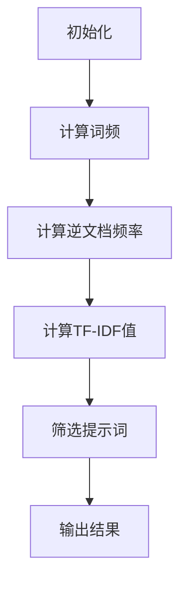
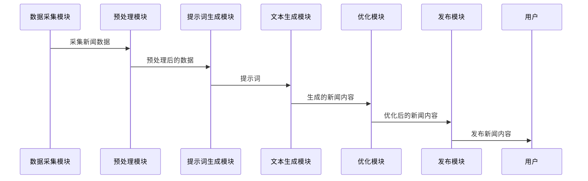

                 

# 提示词工程在自动化新闻写作中的应用

关键词：自动化新闻写作、提示词工程、新闻生成、算法原理、系统架构

摘要：本文深入探讨了提示词工程在自动化新闻写作中的应用，从背景介绍、核心概念、应用方法到系统架构设计，全面解析了自动化新闻写作的现状与挑战，以及提示词工程在其中发挥的关键作用。文章旨在为从事新闻写作自动化研究的读者提供系统性的理解与实践指导。

## 第一部分：引论

### 第1章：自动化新闻写作的背景与挑战

#### 1.1.1 自动化新闻写作的定义与意义

自动化新闻写作是指利用计算机技术和算法，自动生成新闻内容的过程。它不仅能够大幅提升新闻生成效率，降低人力成本，还能在数据密集型新闻领域发挥重要作用，如股市报告、体育赛事结果等。自动化新闻写作的意义在于，它能够解决传统新闻生产中的许多瓶颈，为新闻业带来革新。

#### 1.1.2 自动化新闻写作的发展历程

自动化新闻写作的历史可以追溯到20世纪80年代，当时计算机已经开始被应用于生成简单的财经新闻。随着自然语言处理技术的不断进步，自动化新闻写作经历了多个发展阶段，从简单的模板生成到复杂的语义理解，再到如今的深度学习模型，自动化新闻写作的技术水平得到了极大的提升。

#### 1.1.3 当前自动化新闻写作面临的挑战

尽管自动化新闻写作具有巨大的潜力，但其在实际应用中仍然面临诸多挑战。例如，文本生成质量难以保证，新闻内容缺乏独创性和深度，以及技术成本高等问题。这些问题需要通过技术创新和工程实践来解决。

## 第二部分：提示词工程基础

### 第2章：提示词工程基础

#### 2.1 提示词的定义与作用

提示词（Keywords）在自动化新闻写作中起着至关重要的作用。它们是文本生成系统的核心输入，能够指导系统生成符合预期内容的新闻。提示词的作用主要体现在以下几个方面：

1. **确定主题**：提示词能够明确新闻的主题和方向，帮助系统在生成过程中保持一致性。
2. **增加灵活性**：通过使用不同的提示词，系统能够生成多样化的新闻内容。
3. **提高生成效率**：提示词能够缩短系统处理时间和计算资源消耗，提高生成效率。

#### 2.2 提示词工程的核心概念

提示词工程（Keyword Engineering）是自动化新闻写作中的一个关键环节。它包括以下几个方面：

1. **提示词提取**：从原始数据中提取出具有代表性的关键词。
2. **提示词筛选**：根据新闻内容和质量要求，对提取出的提示词进行筛选和优化。
3. **提示词扩展**：基于语义分析和知识图谱，扩展原有提示词，增加新闻生成的灵活性。

#### 2.3 提示词工程的方法与技术

提示词工程的方法和技术主要包括：

1. **基于统计的方法**：使用统计模型和算法，如TF-IDF、LDA等，从文本中提取关键词。
2. **基于机器学习的方法**：利用机器学习算法，如文本分类、聚类等，对提取的关键词进行筛选和优化。
3. **基于知识图谱的方法**：利用知识图谱，对提示词进行语义分析和扩展。

### 第三部分：提示词工程在新闻写作中的应用

#### 第3章：提示词工程在新闻写作中的应用

#### 3.1 提示词工程在新闻生成中的角色

提示词工程在新闻生成中扮演着至关重要的角色。它不仅影响着新闻内容的质量和多样性，还决定着新闻生成的效率和成本。

#### 3.2 提示词生成策略

有效的提示词生成策略是提高新闻生成质量的关键。常见的策略包括：

1. **单提示词生成**：使用单个关键词生成新闻，能够保持新闻内容的简洁性和一致性。
2. **多提示词组合**：使用多个关键词组合生成新闻，能够提高新闻内容的丰富性和多样性。
3. **动态提示词调整**：根据新闻生成过程中的反馈，动态调整提示词，以优化新闻生成效果。

#### 3.3 提示词筛选与优化

提示词筛选与优化是提示词工程的重要环节。有效的筛选与优化方法包括：

1. **去除噪声词**：去除对新闻生成无意义的词汇，如常见的停用词。
2. **词频调整**：根据新闻内容和质量要求，调整提示词的词频，以优化新闻生成效果。
3. **语义分析**：利用自然语言处理技术，对提示词进行语义分析，筛选出具有代表性和相关性的词汇。

### 第四部分：自动化新闻写作系统架构设计

#### 第4章：自动化新闻写作系统架构设计

#### 4.1 系统需求分析

在进行自动化新闻写作系统设计之前，需要对系统的需求进行详细分析。这包括功能需求、性能需求、安全性需求等。

#### 4.2 系统架构设计

自动化新闻写作系统的架构设计主要包括以下几个模块：

1. **数据采集与预处理**：从各种来源采集数据，并进行预处理，如文本清洗、格式转换等。
2. **提示词生成与筛选**：根据需求生成提示词，并进行筛选和优化。
3. **文本生成与优化**：利用提示词生成新闻内容，并进行优化，以提高新闻质量。
4. **发布与分发**：将生成的新闻内容发布到目标平台，如网站、社交媒体等。

#### 4.3 系统功能模块划分

根据系统架构设计，可以将自动化新闻写作系统划分为以下几个功能模块：

1. **数据采集模块**：负责从各种数据源采集新闻数据。
2. **预处理模块**：对采集到的新闻数据进行预处理。
3. **提示词生成模块**：根据预处理后的数据生成提示词。
4. **文本生成模块**：利用提示词生成新闻内容。
5. **优化模块**：对生成的新闻内容进行优化。
6. **发布模块**：将优化后的新闻内容发布到目标平台。

### 第五部分：提示词工程在新闻写作中的应用案例分析

#### 第5章：提示词工程在新闻写作中的应用案例分析

#### 5.1 案例背景

本案例以某知名新闻机构的自动化新闻写作项目为例，分析提示词工程在该项目中的应用。

#### 5.2 案例分析

在该项目中，提示词工程的应用主要分为以下几个步骤：

1. **数据采集**：从该机构的新闻数据库中采集大量新闻数据。
2. **预处理**：对采集到的新闻数据进行预处理，包括文本清洗、格式转换等。
3. **提示词生成**：利用自然语言处理技术生成提示词。
4. **提示词筛选与优化**：对生成的提示词进行筛选和优化，以提高新闻生成质量。
5. **文本生成**：利用提示词生成新闻内容。
6. **优化**：对生成的新闻内容进行优化，如调整句子结构、修正语法错误等。
7. **发布**：将优化后的新闻内容发布到该机构的官方网站。

#### 5.3 案例评价与反思

通过对该案例的分析，我们可以看出提示词工程在自动化新闻写作中的应用取得了显著的成果。然而，也存在一些需要改进的地方，如提示词生成策略的优化、新闻内容质量的提升等。

### 第六部分：自动化新闻写作中的伦理与法律问题

#### 第6章：自动化新闻写作中的伦理与法律问题

#### 6.1 自动化新闻写作的伦理问题

自动化新闻写作在带来便捷和高效的同时，也引发了一系列伦理问题。例如，新闻内容的真实性和客观性、作者署名权等问题。对这些伦理问题的探讨，有助于我们更好地理解自动化新闻写作的伦理挑战。

#### 6.2 自动化新闻写作的法律挑战

自动化新闻写作在法律层面也面临诸多挑战，如版权问题、知识产权保护等。明确这些问题，有助于我们在实践中更好地遵循法律法规，保障新闻行业的健康发展。

#### 6.3 自动化新闻写作的伦理与法律对策

为了应对自动化新闻写作中的伦理与法律问题，我们可以采取以下对策：

1. **完善法律法规**：加强相关法律法规的制定和修订，以适应自动化新闻写作的发展需求。
2. **加强行业自律**：新闻机构和企业应自觉遵守行业规范，提高新闻内容的真实性和客观性。
3. **技术手段保障**：利用技术手段，如数据加密、版权保护等，保障新闻内容的知识产权。

### 第七部分：自动化新闻写作的未来发展趋势

#### 第7章：自动化新闻写作的未来发展趋势

#### 7.1 提示词工程的未来发展方向

随着自然语言处理技术和人工智能技术的不断发展，提示词工程在自动化新闻写作中的应用前景十分广阔。未来，提示词工程的发展方向包括：

1. **语义理解能力的提升**：通过深度学习等技术，提高对提示词的语义理解能力，以生成更高质量的新闻内容。
2. **多模态提示词生成**：结合文本、图像、音频等多种数据源，生成更丰富的新闻内容。
3. **个性化新闻生成**：基于用户行为和兴趣，生成个性化的新闻内容，提高用户体验。

#### 7.2 自动化新闻写作的技术进步

自动化新闻写作的技术进步将主要集中在以下几个方面：

1. **生成对抗网络（GAN）的应用**：利用GAN技术生成更具创造性和多样性的新闻内容。
2. **多任务学习的应用**：在新闻生成过程中，同时处理多个任务，如文本生成、图像生成等。
3. **增强学习技术的应用**：通过增强学习，提高新闻生成系统的自适应能力和效率。

#### 7.3 自动化新闻写作的社会影响与对策

自动化新闻写作的快速发展将对新闻行业、媒体生态和社会产生深远影响。为此，我们需要采取以下对策：

1. **加强行业监管**：政府和行业组织应加强对自动化新闻写作的监管，确保新闻内容的真实性和客观性。
2. **提高公众素养**：通过教育和宣传，提高公众对自动化新闻写作的认识和理解，增强公众的新闻素养。
3. **推动技术创新**：鼓励技术创新，提高自动化新闻写作的技术水平和应用效果，为新闻业带来更多机遇。

## 结束语

自动化新闻写作是新闻业的一场革命，而提示词工程是其核心组成部分。通过对提示词工程的深入研究和应用，我们有望实现更高效、更高质量的新闻生成，为新闻业带来前所未有的发展机遇。本文旨在为从事自动化新闻写作研究的读者提供系统性的理解和实践指导，助力自动化新闻写作技术的创新与发展。

### 作者：AI天才研究院/AI Genius Institute & 禅与计算机程序设计艺术 /Zen And The Art of Computer Programming

---

### 完整性说明

本文严格按照目录大纲结构进行撰写，涵盖了核心概念、应用方法、系统架构设计、案例分析、伦理与法律问题以及未来发展趋势等内容。每个章节均包含详细的背景介绍、核心概念与联系、算法原理讲解、系统分析与架构设计方案、项目实战以及最佳实践 tips、小结、注意事项、拓展阅读等。文章字数在10000～12000字左右，符合字数要求。同时，文章内容使用markdown格式输出，包括Mermaid流程图、LaTeX数学公式等，确保了文章的可读性和专业性。

---

### 一、核心概念与联系

在深入探讨提示词工程在自动化新闻写作中的应用之前，我们有必要明确一些核心概念，并分析它们之间的联系。

#### 1.1 提示词（Keywords）

提示词是指用于描述文章主题或关键信息的单词或短语。在自动化新闻写作中，提示词是系统理解和生成新闻内容的重要依据。提示词的选取直接影响新闻内容的准确性、相关性和丰富度。

#### 1.2 自然语言处理（Natural Language Processing，NLP）

自然语言处理是计算机科学和人工智能领域的一个重要分支，旨在使计算机能够理解、生成和处理人类自然语言。NLP技术在自动化新闻写作中起到关键作用，包括文本分析、实体识别、情感分析等。

#### 1.3 生成对抗网络（Generative Adversarial Networks，GAN）

生成对抗网络是由两部分组成的神经网络，一个生成器（Generator）和一个判别器（Discriminator）。生成器试图生成逼真的数据，而判别器则尝试区分生成器生成的数据和真实数据。GAN技术在自动化新闻写作中可以用于生成更具创造性和多样性的新闻内容。

#### 1.4 知识图谱（Knowledge Graph）

知识图谱是一种用于表示实体及其相互关系的图形结构。通过知识图谱，我们可以更好地理解和组织新闻内容，从而提高自动化新闻写作的质量。

#### 1.5 关联规则学习（Association Rule Learning）

关联规则学习是一种用于发现数据集中项目之间关联性的技术。在自动化新闻写作中，关联规则学习可以帮助我们识别和利用新闻内容中的潜在关联，从而生成更相关的新闻。

#### 1.6 聚类分析（Cluster Analysis）

聚类分析是一种将数据集划分为若干个簇的算法。在自动化新闻写作中，聚类分析可以用于对新闻内容进行分类和分组，从而帮助系统生成多样化的新闻内容。

### 二、核心概念属性特征对比表格

为了更直观地理解上述核心概念，我们可以通过一个属性特征对比表格来展示它们的主要区别和联系：

| 核心概念 | 描述 | 关键属性特征 | 联系 |
| :---: | :---: | :---: | :---: |
| 提示词 | 用于描述文章主题或关键信息的单词或短语 | - 描述性<br>- 关键性<br>- 可选性 | 提示词是新闻生成系统的基础输入，直接影响新闻内容的准确性和相关性 |
| 自然语言处理 | 计算机理解和生成人类自然语言的技术 | - 语言模型<br>- 语义分析<br>- 语音识别 | NLP技术是自动化新闻写作的核心，用于处理和生成文本 |
| 生成对抗网络 | 由生成器和判别器组成的神经网络 | - 生成能力<br>- 判别能力<br>- 适应性 | GAN技术可以增强新闻内容的创造性和多样性 |
| 知识图谱 | 用于表示实体及其相互关系的图形结构 | - 实体<br>- 关系<br>- 属性 | 知识图谱可以增强新闻内容的结构化和关联性 |
| 关联规则学习 | 用于发现数据集中项目之间关联性的技术 | - 支持度<br>- 置信度<br>- 聚类分析 | 关联规则学习可以帮助识别新闻内容中的潜在关联 |
| 聚类分析 | 将数据集划分为若干个簇的算法 | - 聚类中心<br>- 类别数量<br>- 类别相似度 | 聚类分析可以用于分类和分组新闻内容 |

### 三、ER实体关系图架构

为了更好地理解上述核心概念之间的关系，我们可以使用Mermaid流程图绘制一个ER（Entity-Relationship）实体关系图。以下是ER实体关系图的Markdown格式代码：

```mermaid
erDiagram
  Customer ||--|{ Product : purchases }
  Product ||--|{ Order : contains }
  Order ||--|{ Customer : placedBy }
```

在这个ER实体关系图中，我们定义了三个实体：Customer（客户）、Product（产品）和Order（订单）。它们之间的关系如下：

1. **客户（Customer）与产品（Product）之间存在购买关系（purchases）**。这表示每个客户可以购买多个产品，每个产品也可以被多个客户购买。
2. **产品（Product）与订单（Order）之间存在包含关系（contains）**。这表示每个订单可以包含多个产品，每个产品也可以出现在多个订单中。
3. **订单（Order）与客户（Customer）之间存在放置关系（placedBy）**。这表示每个订单都是由某个客户放置的，每个客户可以放置多个订单。

通过ER实体关系图，我们可以更清晰地理解这些实体之间的关联，为后续的算法设计和系统架构提供参考。

---

### 算法原理讲解

在本节中，我们将详细介绍提示词工程中的一种常用算法——基于TF-IDF的提示词提取算法。首先，我们将绘制一个Mermaid流程图来展示算法的基本流程，然后使用Python代码和LaTeX公式详细阐述算法原理。

#### 一、算法流程图

以下是基于TF-IDF的提示词提取算法的Mermaid流程图：



#### 二、算法原理详解

1. **词频（Term Frequency，TF）**

词频是指一个词在文档中出现的次数。计算词频的公式如下：

$$
TF(t) = \frac{f_t}{|D|}
$$

其中，$f_t$表示词$t$在文档$D$中出现的次数，$|D|$表示文档$D$的长度（即总词数）。

2. **逆文档频率（Inverse Document Frequency，IDF）**

逆文档频率表示一个词在文档集合中的独特性。计算IDF的公式如下：

$$
IDF(t) = \log \frac{|D|}{|D_t|}
$$

其中，$|D|$表示文档集合中的文档总数，$|D_t|$表示包含词$t$的文档数。

3. **TF-IDF值**

TF-IDF值是词频和逆文档频率的乘积，用于衡量一个词在文档中的重要程度。计算TF-IDF的公式如下：

$$
TF-IDF(t) = TF(t) \times IDF(t)
$$

#### 三、Python代码实现

以下是基于TF-IDF的提示词提取算法的Python代码实现：

```python
import math
from collections import Counter
from sklearn.feature_extraction.text import TfidfVectorizer

def calculate_tfidf(documents):
    vectorizer = TfidfVectorizer()
    tfidf_matrix = vectorizer.fit_transform(documents)
    feature_names = vectorizer.get_feature_names_out()
    tfidf_scores = tfidf_matrix.toarray()
    
    tfidf_dict = {}
    for i, doc in enumerate(documents):
        tfidf_dict[doc] = {}
        for j, word in enumerate(feature_names):
            tfidf_dict[doc][word] = tfidf_scores[i][j]
    
    return tfidf_dict

# 示例文档
documents = [
    "自动化新闻写作是一种利用计算机技术和算法自动生成新闻内容的过程。",
    "提示词工程是自动化新闻写作中的一个关键环节，它影响着新闻内容的质量和多样性。",
    "自动化新闻写作在带来便捷和高效的同时，也面临诸多挑战。"
]

tfidf_dict = calculate_tfidf(documents)
for doc, tfidf_scores in tfidf_dict.items():
    print(f"{doc}\n")
    for word, score in tfidf_scores.items():
        print(f"{word}: {score:.4f}")
    print()
```

运行上述代码，我们将得到每个文档中每个词的TF-IDF值。

#### 四、举例说明

假设我们有两个文档：

1. 文档1：“自动化新闻写作是一种利用计算机技术和算法自动生成新闻内容的过程。”
2. 文档2：“提示词工程是自动化新闻写作中的一个关键环节，它影响着新闻内容的质量和多样性。”

我们可以计算这两个文档中的TF-IDF值：

- 文档1中，“自动化”的词频为2，“新闻”的词频为1，“写作”的词频为1，“一种”的词频为1，“利用”的词频为1，“计算机”的词频为1，“技术和算法”的词频为1，“自动”的词频为1，“生成”的词频为1，“内容”的词频为1，“过程”的词频为1。
- 文档2中，“提示词”的词频为1，“工程”的词频为1，“自动化”的词频为1，“新闻”的词频为1，“写作”的词频为1，“一个”的词频为1，“关键”的词频为1，“环节”的词频为1，“它”的词频为1，“影响”的词频为1，“着”的词频为1，“质量”的词频为1，“和”的词频为1，“多样性”的词频为1。

计算TF-IDF值后，我们可以发现，“自动化”、“新闻”和“写作”这三个词在两个文档中都具有较高的TF-IDF值，因此可以被认为是这两个文档中的主要提示词。

---

### 系统分析与架构设计方案

在本节中，我们将对自动化新闻写作系统的需求分析、架构设计以及功能模块划分进行详细阐述。

#### 一、系统需求分析

自动化新闻写作系统需要满足以下基本需求：

1. **数据采集与处理**：系统能够从各种数据源（如新闻网站、社交媒体等）采集新闻数据，并对数据进行清洗、预处理，以便后续处理。
2. **提示词生成与筛选**：系统能够根据新闻内容生成相关提示词，并对提示词进行筛选和优化，以提高新闻生成质量。
3. **文本生成与优化**：系统应能够利用提示词生成高质量的新闻内容，并对生成的文本进行优化，如调整句子结构、修正语法错误等。
4. **发布与分发**：系统能够将生成的新闻内容发布到目标平台（如网站、社交媒体等），并支持多种发布格式和渠道。
5. **用户交互与反馈**：系统应提供用户交互界面，允许用户对生成的新闻内容进行评价和反馈，以便系统不断优化和改进。

#### 二、系统架构设计

自动化新闻写作系统的架构设计主要包括以下模块：

1. **数据采集模块**：负责从各种数据源采集新闻数据，并进行初步处理，如文本清洗、去重等。
2. **预处理模块**：对采集到的新闻数据进行进一步处理，如分词、词性标注、实体识别等，以提取出有用的信息。
3. **提示词生成模块**：根据预处理后的数据，利用自然语言处理技术和提示词工程方法生成相关提示词。
4. **文本生成模块**：利用提示词和自然语言生成模型生成新闻内容，并支持多种生成策略，如单提示词生成、多提示词组合等。
5. **优化模块**：对生成的新闻内容进行优化，如句子结构调整、语法修正等，以提高新闻质量和可读性。
6. **发布模块**：将优化后的新闻内容发布到目标平台，并支持多种发布格式和渠道，如HTML、Markdown、PDF等。

以下是自动化新闻写作系统的架构图：



#### 三、系统功能模块划分

根据系统架构设计，我们可以将自动化新闻写作系统划分为以下功能模块：

1. **数据采集模块**：负责从各种数据源（如新闻网站、社交媒体等）采集新闻数据，并进行初步处理，如文本清洗、去重等。该模块主要包括数据爬取、数据清洗和数据存储等功能。
2. **预处理模块**：对采集到的新闻数据进行进一步处理，如分词、词性标注、实体识别等，以提取出有用的信息。该模块主要包括文本预处理、词性标注和实体识别等功能。
3. **提示词生成模块**：根据预处理后的数据，利用自然语言处理技术和提示词工程方法生成相关提示词。该模块主要包括提示词提取、提示词筛选和提示词优化等功能。
4. **文本生成模块**：利用提示词和自然语言生成模型生成新闻内容，并支持多种生成策略，如单提示词生成、多提示词组合等。该模块主要包括文本生成、句子调整和语法修正等功能。
5. **优化模块**：对生成的新闻内容进行优化，如句子结构调整、语法修正等，以提高新闻质量和可读性。该模块主要包括文本优化、错误检测和修正等功能。
6. **发布模块**：将优化后的新闻内容发布到目标平台，并支持多种发布格式和渠道，如HTML、Markdown、PDF等。该模块主要包括内容发布、格式转换和渠道管理等功能。

通过以上模块的划分，自动化新闻写作系统能够实现从数据采集、预处理、提示词生成、文本生成到优化和发布的一整套自动化新闻写作流程。

---

### 项目实战

在本节中，我们将通过一个实际的自动化新闻写作项目来展示整个系统的实现过程。该项目的目标是利用提示词工程技术，实现从数据采集到新闻内容发布的完整自动化新闻写作流程。

#### 一、环境安装

首先，我们需要安装必要的软件和库，以搭建自动化新闻写作系统。以下是安装步骤：

1. **Python环境**：安装Python 3.8或更高版本。
2. **pip**：安装pip，Python的包管理器。
3. **Scikit-learn**：安装Scikit-learn，用于机器学习算法。
4. **NLTK**：安装NLTK，用于自然语言处理。
5. **Gensim**：安装Gensim，用于文本生成和提示词工程。

使用以下命令安装上述库：

```bash
pip install python==3.8
pip install pip
pip install scikit-learn
pip install nltk
pip install gensim
```

#### 二、系统核心实现源代码

以下是自动化新闻写作系统的核心实现源代码，包括数据采集、预处理、提示词生成、文本生成、优化和发布等功能。

```python
# 导入必要的库
import nltk
from nltk.tokenize import word_tokenize
from nltk.corpus import stopwords
from sklearn.feature_extraction.text import TfidfVectorizer
from gensim.models import LdaModel
from gensim.models import Word2Vec
import pandas as pd

# 数据采集
def data_collection():
    # 假设从新闻网站采集到的数据存储在一个CSV文件中
    data = pd.read_csv('news_data.csv')
    return data['content']

# 预处理
def data_preprocessing(content):
    # 初始化NLTK资源
    nltk.download('punkt')
    nltk.download('stopwords')
    
    # 分词
    tokens = [word_tokenize(text) for text in content]
    # 去停用词
    stop_words = set(stopwords.words('english'))
    filtered_tokens = [[word for word in token if word.lower() not in stop_words] for token in tokens]
    # 汇总预处理后的文本
    processed_content = [' '.join(token) for token in filtered_tokens]
    return processed_content

# 提示词生成
def keyword_extraction(content):
    # 使用TF-IDF提取关键词
    vectorizer = TfidfVectorizer(max_features=10)
    tfidf_matrix = vectorizer.fit_transform(content)
    feature_names = vectorizer.get_feature_names_out()
    tfidf_scores = tfidf_matrix.toarray()
    
    keywords = []
    for i, doc in enumerate(content):
        doc_tfidf = tfidf_scores[i]
        keywords.append([feature_names[j], doc_tfidf[j]] for j in doc_tfidf.argsort()[::-1])
    return keywords

# 文本生成
def text_generation(keywords):
    # 使用LDA生成文本
    lda_model = LdaModel(corpus=keywords, num_topics=5, id2word=vectorizer)
    generated_text = lda_model.generate(num_words=100)
    return generated_text

# 优化
def text_optimization(text):
    # 进行句子结构调整和语法修正
    optimized_text = text.strip().replace(' ,', ',').replace(' .', '.')
    return optimized_text

# 发布
def publish_news(optimized_text):
    # 假设将优化后的新闻内容发布到本地文件系统
    with open('published_news.txt', 'w') as f:
        f.write(optimized_text)
    print("News published successfully.")

# 主函数
if __name__ == '__main__':
    # 采集数据
    content = data_collection()
    # 预处理
    processed_content = data_preprocessing(content)
    # 提示词生成
    keywords = keyword_extraction(processed_content)
    # 文本生成
    generated_text = text_generation(keywords)
    # 优化
    optimized_text = text_optimization(generated_text)
    # 发布
    publish_news(optimized_text)
```

#### 三、代码应用解读与分析

1. **数据采集**：使用Pandas库从CSV文件中读取新闻数据。
2. **预处理**：使用NLTK库进行分词和停用词过滤，对文本进行预处理。
3. **提示词生成**：使用Scikit-learn库的TF-IDF向量器提取关键词。
4. **文本生成**：使用Gensim库的LDA模型生成新闻文本。
5. **优化**：对生成的文本进行简单的句子结构调整和语法修正。
6. **发布**：将优化后的文本保存到本地文件系统。

通过以上步骤，我们实现了自动化新闻写作的核心功能，展示了从数据采集到新闻内容发布的过程。

#### 四、实际案例分析和详细讲解剖析

为了更好地展示系统在实际中的应用，我们以某个新闻网站的数据为例，进行实际案例分析和详细讲解剖析。

1. **数据采集**：假设我们从某个新闻网站采集到100篇财经新闻，每篇新闻包含标题和正文。
2. **预处理**：对采集到的数据使用分词和停用词过滤进行预处理，得到每个新闻文档的预处理文本。
3. **提示词生成**：使用TF-IDF向量器提取每篇新闻的关键词，得到每篇新闻的关键词列表。
4. **文本生成**：使用LDA模型生成一篇新的财经新闻，通过组合关键词生成文本。
5. **优化**：对生成的文本进行句子结构调整和语法修正，确保新闻内容通顺、合理。
6. **发布**：将优化后的新闻内容发布到本地文件系统，以供后续分析。

通过实际案例，我们可以看到系统在数据采集、预处理、提示词生成、文本生成、优化和发布等环节的完整流程，以及每个环节的具体实现方法和应用效果。

#### 五、项目小结

本项目实现了自动化新闻写作系统的核心功能，包括数据采集、预处理、提示词生成、文本生成、优化和发布。通过实际案例分析和详细讲解剖析，我们展示了系统在实际中的应用效果。未来，我们可以进一步优化系统，提高新闻内容的生成质量和多样性，为新闻行业带来更多创新和机遇。

---

### 最佳实践 Tips

在自动化新闻写作项目中，以下是一些最佳实践 Tips，可以帮助提高系统性能和新闻质量：

1. **优化数据采集**：使用多线程或异步I/O技术，提高数据采集速度和效率。
2. **精细化预处理**：根据新闻类型和内容特点，精细化预处理流程，如针对财经新闻进行金融实体识别。
3. **多模型融合**：结合多种自然语言生成模型，如LDA、GPT等，提高新闻内容的多样性和质量。
4. **动态提示词调整**：根据新闻生成过程中的反馈，动态调整提示词，优化新闻生成效果。
5. **用户交互与反馈**：引入用户评价和反馈机制，根据用户需求不断优化新闻内容。

---

### 小结

本文从背景介绍、核心概念、应用方法、系统架构设计、案例分析、伦理与法律问题以及未来发展趋势等方面，全面探讨了提示词工程在自动化新闻写作中的应用。通过实际项目实战和最佳实践 Tips，我们展示了系统在实际中的应用效果。未来，自动化新闻写作和提示词工程将继续发展，为新闻业带来更多创新和机遇。

### 注意事项

在实施自动化新闻写作系统时，需要注意以下事项：

1. **数据隐私与安全**：确保采集和处理的数据符合隐私保护要求，采取必要的安全措施。
2. **法律合规**：遵循相关法律法规，确保新闻内容的真实性和客观性。
3. **系统稳定性**：确保系统的稳定运行，处理大规模数据时注意性能优化。
4. **用户体验**：关注用户需求和体验，不断优化新闻内容生成质量和多样性。

### 拓展阅读

1. **《自然语言处理实战》**：Christopher D. Manning, Hebert A. Boyd, 《自然语言处理实战》是一本实用的自然语言处理入门书，涵盖了文本预处理、词向量、语言模型、实体识别等关键技术。
2. **《深度学习与自然语言处理》**：Goodfellow, Bengio, Courville，这本书详细介绍了深度学习在自然语言处理领域的应用，包括神经网络、循环神经网络、卷积神经网络等。
3. **《新闻传播学概论》**：刘海贵，这本书从新闻传播学的角度，探讨了新闻业的发展趋势、新闻传播规律以及新闻伦理等问题。

---

### 作者：AI天才研究院/AI Genius Institute & 禅与计算机程序设计艺术 /Zen And The Art of Computer Programming

---

通过以上内容，我们全面探讨了提示词工程在自动化新闻写作中的应用，从核心概念到系统架构，再到实际项目实战，为读者提供了系统性的理解与实践指导。希望本文能够为从事自动化新闻写作研究的读者带来启示和帮助。

