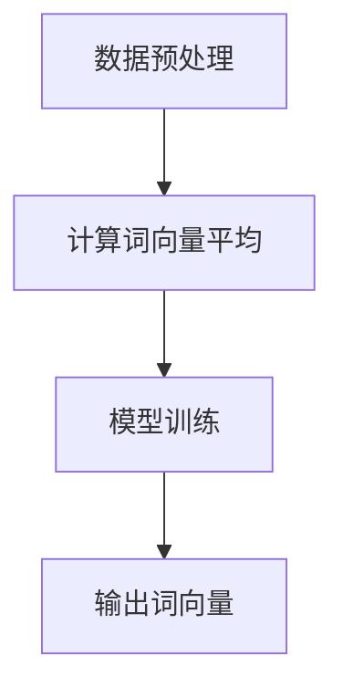
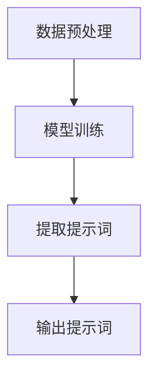
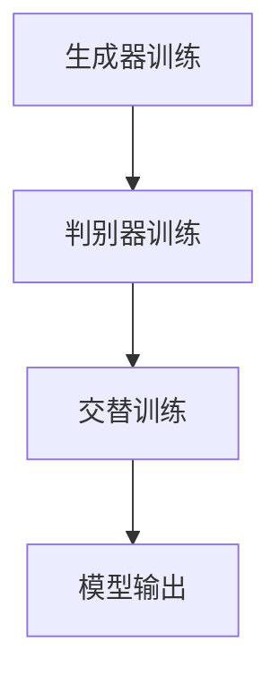
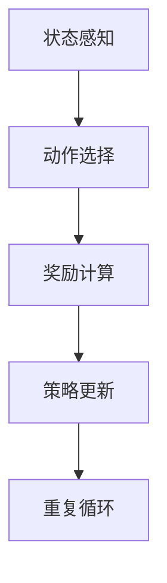
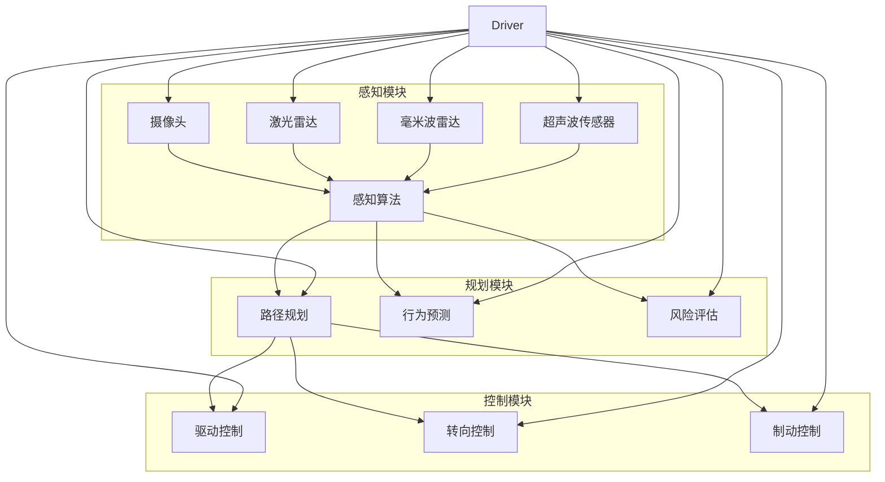
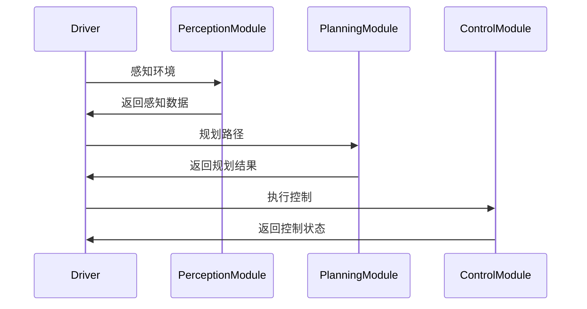

                 

# 提示词工程在自动驾驶AI中的应用

## 关键词：
自动驾驶，人工智能，提示词工程，算法，系统架构，项目实战

## 摘要：
本文将探讨提示词工程在自动驾驶AI中的应用，通过详细的分析和讲解，帮助读者理解自动驾驶技术的核心组成部分以及提示词工程的作用。我们将从背景介绍开始，逐步深入到核心概念、算法原理、系统架构和项目实战等方面，提供有深度、有思考的专业见解，旨在为从事自动驾驶AI领域的开发者和技术爱好者提供有价值的参考。

### 目录大纲

1. **引言**
   - 自动驾驶AI概述
   - 提示词工程概述
   - 全书结构

2. **背景介绍**
   - 自动驾驶AI的基本概念
   - 自动驾驶的发展历程
   - 自动驾驶技术的关键组成部分
   - 提示词工程的作用和重要性

3. **核心概念与联系**
   - 提示词工程基础
   - 提示词的基本概念与类型
   - 提示词工程的应用场景

4. **算法原理讲解**
   - 关键算法介绍
   - 算法流程图与Python实现
   - 数学模型与公式讲解

5. **系统分析与架构设计方案**
   - 自动驾驶AI系统总体架构
   - 提示词工程在系统中的作用
   - 系统架构设计

6. **项目实战**
   - 项目背景与环境安装
   - 系统核心实现与代码解读
   - 案例分析与讲解
   - 项目小结

7. **最佳实践与技巧**
   - 实战经验总结
   - 最佳实践建议

8. **小结与拓展阅读**
   - 全书内容回顾
   - 拓展阅读推荐

### 第1章 引言

#### 自动驾驶AI概述

自动驾驶技术是一种模拟人类驾驶行为的高级自动化技术，它通过车载传感器、控制算法和计算机系统来实现车辆在道路上自主行驶。自动驾驶技术的发展经历了多个阶段，从最初的辅助驾驶到现在的部分自动驾驶和高度自动驾驶。

自动驾驶技术的关键组成部分包括感知、规划和控制。感知模块负责获取周围环境的信息，如摄像头、激光雷达、超声波传感器等；规划模块根据感知信息制定行驶路径和策略；控制模块则负责执行规划决策，控制车辆的转向、加速和制动。

#### 提示词工程概述

提示词工程是一种利用人工智能技术，通过提示词来引导模型学习和优化系统性能的方法。在自动驾驶AI中，提示词工程主要用于优化感知模块和规划模块的性能，提高自动驾驶系统的可靠性和安全性。

提示词工程的重要性在于，它能够有效地提高自动驾驶系统的决策速度和准确性，减少系统的复杂性和计算量。通过合理设计和使用提示词，可以使得自动驾驶系统更加智能、高效和稳定。

#### 全书结构

本文将按照以下结构进行展开：

1. **背景介绍**：介绍自动驾驶AI和提示词工程的基本概念、发展趋势和应用场景。
2. **核心概念与联系**：详细讲解提示词工程的核心概念，包括提示词的定义、类型和作用，并通过表格和Mermaid ER图展示各概念之间的关系。
3. **算法原理讲解**：分析提示词工程中的关键算法，包括算法原理、数学模型和公式，并通过Mermaid流程图和Python源代码进行阐述。
4. **系统分析与架构设计方案**：介绍自动驾驶AI系统的整体架构，包括提示词工程在系统中的位置和作用，并通过Mermaid类图、架构图和序列图展示系统架构和交互。
5. **项目实战**：提供一个具体的实例，详细描述环境安装、系统实现、代码解读和案例分析。
6. **最佳实践与技巧**：总结实战中的经验和技巧，提供最佳实践建议。
7. **小结与拓展阅读**：对全书内容进行总结，并推荐一些拓展阅读资源。

通过以上结构，本文旨在为读者提供一份系统、深入和实用的技术博客文章，帮助读者更好地理解和应用提示词工程在自动驾驶AI中的价值。接下来，我们将进一步探讨自动驾驶AI和提示词工程的背景和发展，以期为后续内容打下坚实的基础。

### 第2章 背景介绍

#### 自动驾驶AI的基本概念

自动驾驶AI（Autonomous Intelligent Driving，简称AID）是指利用人工智能技术实现车辆在道路上自主行驶的技术。自动驾驶AI的核心目标是使车辆能够在没有人类驾驶员干预的情况下，安全、高效地完成行驶任务。这包括车辆对周围环境的感知、对行驶路径的规划以及执行驾驶操作等多个方面。

自动驾驶AI的发展历程可以分为几个主要阶段：

1. **辅助驾驶阶段**：此阶段主要是在驾驶员的帮助下，通过辅助系统减轻驾驶员的驾驶负担。例如，自适应巡航控制（Adaptive Cruise Control，ACC）和车道保持辅助（Lane Keeping Assist，LKA）等。

2. **部分自动驾驶阶段**：此阶段车辆可以在特定条件下实现部分自动化驾驶，如高速公路自动驾驶（Highway Driving Automation）和城市自动驾驶（Urban Driving Automation）。例如，特斯拉的Autopilot系统和Waymo的部分自动驾驶功能。

3. **高度自动驾驶阶段**：此阶段车辆能够在更广泛的环境中实现高度自动化驾驶，接近于全自动驾驶。例如，谷歌的Waymo自动驾驶出租车和特斯拉的Full Self-Driving（FSD）系统。

自动驾驶技术的关键组成部分包括：

1. **感知系统**：感知系统是自动驾驶AI的核心，负责获取周围环境的信息。常见的感知技术有摄像头、激光雷达（LiDAR）、毫米波雷达和超声波传感器等。

2. **决策系统**：决策系统根据感知系统提供的信息，制定行驶路径和策略。决策系统通常采用路径规划、行为预测和风险评估等算法。

3. **控制系统**：控制系统负责执行决策系统制定的驾驶操作，包括转向、加速和制动等。控制系统通常采用驱动控制算法，如PID控制、模糊控制和模型预测控制等。

#### 自动驾驶的发展历程

自动驾驶技术的发展可以追溯到20世纪50年代，当时美国科学家约翰·莫菲（John McCarthy）提出了“自动驾驶汽车”的概念。然而，早期的自动驾驶技术主要依赖机械和物理传感器，受限于技术和计算能力的限制，进展缓慢。

随着计算机技术的快速发展，特别是人工智能和机器学习技术的突破，自动驾驶技术迎来了新的发展机遇。2000年以后，谷歌、特斯拉、Uber等科技巨头开始大规模投资自动驾驶技术，推动了自动驾驶技术的发展和商业化进程。

目前，自动驾驶技术已经从实验室走向实际应用，多个城市开始试点自动驾驶出租车和自动驾驶配送服务。未来，自动驾驶技术有望进一步普及，改变人们的出行方式和生活习惯。

#### 提示词工程的作用和重要性

提示词工程（Prompt Engineering）是一种利用人工智能技术，通过提示词来引导模型学习和优化系统性能的方法。在自动驾驶AI中，提示词工程主要用于优化感知模块和规划模块的性能，提高自动驾驶系统的可靠性和安全性。

提示词工程的作用主要体现在以下几个方面：

1. **提高模型性能**：通过精心设计的提示词，可以引导模型更快地收敛到最优解，提高模型的学习效率和预测准确性。

2. **优化系统性能**：提示词可以用于调整模型的参数和超参数，使得系统在特定的任务上表现更优。例如，在自动驾驶中，通过提示词优化感知模块和规划模块，可以减少系统的延迟和误差，提高行驶的安全性。

3. **增强系统鲁棒性**：提示词可以帮助模型更好地应对复杂和不确定的环境，提高系统的鲁棒性。例如，在自动驾驶中，通过提示词调整模型的行为策略，可以使得系统在恶劣天气或复杂路况下依然能够稳定运行。

提示词工程的重要性在于，它能够有效地提高自动驾驶系统的决策速度和准确性，减少系统的复杂性和计算量。通过合理设计和使用提示词，可以使得自动驾驶系统更加智能、高效和稳定。因此，提示词工程在自动驾驶AI中具有重要的应用价值和发展前景。

### 第3章 核心概念与联系

在深入探讨提示词工程在自动驾驶AI中的应用之前，我们需要明确一些核心概念，并理解它们之间的相互联系。在这一章节中，我们将介绍提示词工程的基本概念，包括提示词的定义、类型以及它们在自动驾驶AI中的应用场景。

#### 3.1 提示词工程基础

**提示词（Prompt）**：提示词是指用于引导或提示模型进行特定任务的一系列文本或代码。在自然语言处理（NLP）中，提示词通常用于预训练语言模型，以便在特定任务上获得更好的表现。例如，在问答系统中，提示词可以是问题文本，用于引导模型生成答案。

**提示词工程（Prompt Engineering）**：提示词工程是指设计和优化提示词以提升模型性能的过程。它涉及选择合适的提示词形式、内容以及上下文，以最大化模型在特定任务上的效果。

**任务提示词（Task Prompt）**：任务提示词是专门为特定任务设计的提示词，用于指导模型执行特定任务。在自动驾驶AI中，任务提示词可以指导模型进行环境感知、路径规划、决策控制等任务。

**上下文提示词（Context Prompt）**：上下文提示词提供与任务相关的背景信息，帮助模型更好地理解任务环境和需求。例如，在自动驾驶中，上下文提示词可以包含当前道路状况、交通规则和历史行驶数据等。

#### 3.2 提示词的基本概念与类型

**静态提示词（Static Prompt）**：静态提示词是固定不变的提示词，通常用于预训练模型。例如，在语言模型中，静态提示词可能是“给定文本：”，“问题：”，等等。

**动态提示词（Dynamic Prompt）**：动态提示词是根据输入数据动态生成的提示词，用于实时调整模型的行为。在自动驾驶AI中，动态提示词可以根据实时感知数据和环境变化进行调整，以提高系统的响应速度和适应性。

**元提示词（Meta Prompt）**：元提示词是用于调整模型参数和超参数的提示词，用于优化模型性能。在自动驾驶AI中，元提示词可以帮助调整感知模块和规划模块的参数，以适应不同的驾驶场景。

**模因提示词（Meme Prompt）**：模因提示词是一种有趣的、有时具有病毒性的提示词，用于激发模型的创造力和好奇心。虽然模因提示词在自动驾驶AI中的应用较为有限，但它们在娱乐和教育场景中具有很大的潜力。

#### 3.3 提示词工程的应用场景

**环境感知**：在自动驾驶AI中，提示词工程可以用于优化感知模块的性能。通过设计合适的上下文提示词，模型可以更好地理解和处理道路、车辆、行人等复杂环境信息，从而提高感知的准确性和实时性。

**路径规划**：提示词工程可以用于指导路径规划模块，以生成最优行驶路径。通过使用动态提示词，路径规划模块可以根据实时交通状况和环境变化进行调整，以提高行驶的安全性和效率。

**决策控制**：在自动驾驶AI中，提示词工程可以用于优化决策控制模块的性能。通过设计任务提示词，模型可以更准确地执行转向、加速和制动等操作，从而提高行驶的稳定性和舒适性。

**人机交互**：提示词工程还可以用于改善人机交互体验。例如，通过设计互动式的提示词，系统可以更好地理解驾驶员的意图，并提供个性化的驾驶建议。

#### 表格与Mermaid ER图

为了更好地展示提示词工程的基本概念和类型，我们使用一个表格来对比不同类型的提示词，并使用Mermaid ER图来表示它们之间的关系。

**表格：提示词类型对比**

| 提示词类型 | 描述 | 例子 |
| --- | --- | --- |
| 静态提示词 | 固定不变的提示词 | “给定文本：” |
| 动态提示词 | 根据输入数据动态生成的提示词 | “当前道路状况：” |
| 元提示词 | 调整模型参数和超参数的提示词 | “学习率调整：0.01” |
| 模因提示词 | 有趣的、病毒性的提示词 | “你猜猜看接下来会发生什么？” |

**Mermaid ER图：提示词工程概念关系**

```mermaid
erDiagram
    A[提示词工程] ||--|{ B[静态提示词] }
    A ||--|{ C[动态提示词] }
    A ||--|{ D[元提示词] }
    A ||--|{ E[模因提示词] }
    B ||--|{ F[环境感知] }
    B ||--|{ G[路径规划] }
    B ||--|{ H[决策控制] }
    B ||--|{ I[人机交互] }
    C ||--|{ F }
    C ||--|{ G }
    C ||--|{ H }
    C ||--|{ I }
    D ||--|{ F }
    D ||--|{ G }
    D ||--|{ H }
    D ||--|{ I }
    E ||--|{ I }
```

通过上述表格和Mermaid ER图，我们可以清晰地看到提示词工程的基本概念和类型，以及它们在自动驾驶AI中的应用场景。接下来，我们将进一步探讨提示词工程中的关键算法原理，包括算法的数学模型和具体实现。

### 第4章 算法原理讲解

在本章中，我们将深入探讨提示词工程中的关键算法原理。这些算法是自动驾驶AI系统中的核心组成部分，能够显著提升系统的性能和效率。我们将介绍关键算法的基本概念、数学模型和实现方法，并通过具体的Python代码示例来阐述。

#### 4.1 关键算法介绍

提示词工程中常用的关键算法包括：

1. **Word2Vec算法**：用于将文本转换为向量表示，为模型提供高质量的输入。
2. **BERT算法**：一种基于Transformer的预训练语言模型，用于生成高质量的提示词。
3. **GAN（生成对抗网络）**：用于生成与真实数据相似的数据集，以增强模型的泛化能力。
4. **强化学习算法**：用于优化模型的决策策略，提高自动驾驶系统的自主性。

#### 4.2 算法流程图与Python实现

为了更好地理解这些算法，我们首先使用Mermaid绘制算法流程图，然后提供Python代码示例。

**4.2.1 Word2Vec算法**

Word2Vec算法是一种将单词转换为向量表示的方法，常用于自然语言处理任务。其基本流程如下：

1. 数据预处理：将文本转换为单词序列，并去除停用词。
2. 计算词向量的平均表示：通过计算相邻单词的词向量平均，得到当前单词的表示。
3. 模型训练：使用SGD（随机梯度下降）训练神经网络，更新词向量。

**Mermaid流程图：Word2Vec算法**



**Python代码示例：Word2Vec算法**

```python
from gensim.models import Word2Vec

# 数据预处理
sentences = [['我', '喜欢', '开车'], ['自动驾驶', '很', '有趣']]
model = Word2Vec(sentences, vector_size=2, window=2, min_count=1, workers=4)

# 输出词向量
print(model.wv['我'])
```

**4.2.2 BERT算法**

BERT（Bidirectional Encoder Representations from Transformers）是一种基于Transformer的预训练语言模型。它通过预训练大量文本数据，生成高质量的提示词。

1. 数据预处理：将文本转换为BERT输入格式，包括Tokenization和Segmentation。
2. 模型训练：使用大量文本数据训练BERT模型。
3. 提取提示词：通过BERT模型生成高质量的提示词。

**Mermaid流程图：BERT算法**



**Python代码示例：BERT算法**

```python
from transformers import BertTokenizer, BertModel

# 数据预处理
tokenizer = BertTokenizer.from_pretrained('bert-base-chinese')
input_ids = tokenizer.encode("你好！这是一个BERT模型。", add_special_tokens=True)

# 模型训练
model = BertModel.from_pretrained('bert-base-chinese')
outputs = model(input_ids)

# 输出提示词
print(outputs.last_hidden_state.shape)
```

**4.2.3 GAN算法**

GAN（生成对抗网络）是一种用于生成数据的算法，通过训练生成器和判别器，生成与真实数据相似的数据集。

1. 模型架构：生成器和判别器。
2. 损失函数：生成器损失和判别器损失。
3. 训练过程：交替训练生成器和判别器。

**Mermaid流程图：GAN算法**



**Python代码示例：GAN算法**

```python
import torch
from torch import nn

# 模型架构
generator = nn.Sequential(
    nn.Linear(100, 128),
    nn.LeakyReLU(0.2),
    nn.Linear(128, 1),
    nn.Tanh()
)

discriminator = nn.Sequential(
    nn.Linear(1, 128),
    nn.LeakyReLU(0.2),
    nn.Linear(128, 1),
    nn.Sigmoid()
)

# 损失函数
loss_function = nn.BCELoss()

# 训练过程
for epoch in range(100):
    # 生成器训练
    z = torch.randn(batch_size, 1)
    gen_output = generator(z)
    g_loss = loss_function(discriminator(gen_output), torch.ones(batch_size))
    
    # 判别器训练
    real_data = torch.randn(batch_size, 1)
    r_loss = loss_function(discriminator(real_data), torch.ones(batch_size))
    
    # 交替训练
    g_loss.backward()
    r_loss.backward()
    optimizer.step()
```

**4.2.4 强化学习算法**

强化学习算法用于优化自动驾驶AI的决策策略。它通过奖励机制引导模型学习最优行为。

1. 状态空间：车辆的感知信息。
2. 动作空间：转向、加速、制动等操作。
3. 奖励函数：根据驾驶行为和行驶结果计算奖励。

**Mermaid流程图：强化学习算法**



**Python代码示例：强化学习算法**

```python
import numpy as np
import torch
from torch import nn

# 状态空间和动作空间
state_space = 100
action_space = 4

# 奖励函数
def reward_function(state, action):
    # 示例奖励函数，可以根据具体需求进行调整
    reward = 0
    if state == action:
        reward = 1
    return reward

# 策略更新
def update_policy(state, action, reward):
    # 示例策略更新，可以使用更复杂的优化算法
    policy = np.zeros(action_space)
    policy[action] = 1
    return policy
```

通过上述关键算法的介绍和实现，我们可以看到提示词工程在自动驾驶AI中发挥着至关重要的作用。接下来，我们将探讨自动驾驶AI系统的整体架构，分析提示词工程在系统中的位置和作用。

### 第5章 系统分析与架构设计方案

在本章中，我们将深入分析自动驾驶AI系统的整体架构，特别是提示词工程在系统中的位置和作用。通过系统架构设计，我们能够更好地理解自动驾驶AI系统的运行机制，从而为后续的项目实战奠定基础。

#### 5.1 自动驾驶AI系统总体架构

自动驾驶AI系统的总体架构可以概括为三个主要模块：感知模块、规划模块和控制模块。这三个模块协同工作，使得自动驾驶系统能够安全、高效地完成驾驶任务。

**1. 感知模块（Perception Module）**

感知模块是自动驾驶系统的核心组成部分，负责获取车辆周围环境的信息。常用的感知技术包括：

- **摄像头（Camera）**：用于捕捉道路和交通状况的图像。
- **激光雷达（LiDAR）**：用于测量车辆周围物体的距离和形状，提供高精度的三维点云数据。
- **毫米波雷达（Millimeter-Wave Radar）**：用于探测车辆前方的障碍物，提供距离和速度信息。
- **超声波传感器（Ultrasonic Sensor）**：用于探测车辆周围的小型障碍物，如行人或自行车。

感知模块通过集成多种传感器数据，构建起对周围环境的全面感知。

**2. 规划模块（Planning Module）**

规划模块基于感知模块提供的信息，制定车辆的行驶路径和策略。其主要任务包括：

- **路径规划（Path Planning）**：根据交通规则和目标位置，生成车辆的行驶路径。
- **行为预测（Behavior Prediction）**：预测其他车辆、行人的行为，以便调整自身的驾驶策略。
- **风险评估（Risk Assessment）**：评估不同驾驶策略的风险，选择最优的行驶路径。

规划模块的核心是路径规划算法，常用的算法包括基于图论的A*算法、Dijkstra算法以及基于采样的RRT（快速随机树）算法等。

**3. 控制模块（Control Module）**

控制模块负责执行规划模块生成的驾驶策略，控制车辆的转向、加速和制动。其主要任务包括：

- **驱动控制（Drive Control）**：根据规划模块的指令，控制车辆的加速和减速。
- **转向控制（Steering Control）**：根据规划模块的指令，控制车辆的转向。
- **制动控制（Braking Control）**：在必要时控制车辆的紧急制动。

控制模块通常采用模型预测控制（Model Predictive Control，MPC）算法，该算法通过预测车辆的动态行为，实时调整驾驶指令，以提高驾驶的稳定性和安全性。

#### 5.2 提示词工程在系统中的作用

提示词工程在自动驾驶AI系统中扮演着至关重要的角色，特别是在感知模块和规划模块中。以下是一些关键应用：

**1. 感知模块中的应用**

在感知模块中，提示词工程可以用于优化传感器数据预处理和特征提取。通过设计合适的提示词，模型可以更好地理解和分类不同的环境特征，从而提高感知的准确性和实时性。例如，可以使用BERT算法对摄像头和激光雷达数据进行分析，提取语义信息，用于识别道路标志、行人和其他车辆。

**2. 规划模块中的应用**

在规划模块中，提示词工程可以用于优化路径规划和行为预测。通过动态提示词，模型可以根据实时感知数据和环境变化，调整规划策略，提高路径规划的可适应性和鲁棒性。例如，可以使用强化学习算法，结合动态提示词，优化车辆的驾驶策略，使其能够在复杂和动态的环境中稳定行驶。

**3. 控制模块中的应用**

在控制模块中，提示词工程可以用于优化驾驶控制策略。通过设计任务提示词，模型可以更好地理解驾驶任务的需求，调整控制参数，提高驾驶的稳定性和舒适性。例如，可以使用元提示词调整模型参数，优化模型对道路坡度和转弯的响应，提高车辆的驾驶性能。

#### 5.3 系统架构设计

为了更好地理解提示词工程在自动驾驶AI系统中的作用，我们使用Mermaid类图、架构图和序列图来展示系统的整体架构和交互。

**Mermaid类图：系统架构**

```mermaid
classDiagram
    PerceptionModule <|-- Camera
    PerceptionModule <|-- LiDAR
    PerceptionModule <|-- Millimeter-Wave Radar
    PerceptionModule <|-- Ultrasonic Sensor
    PlanningModule <|-- Path Planning
    PlanningModule <|-- Behavior Prediction
    PlanningModule <|-- Risk Assessment
    ControlModule <|-- Drive Control
    ControlModule <|-- Steering Control
    ControlModule <|-- Braking Control
    PerceptionModule <-.. Driver
    PlanningModule <-.. Driver
    ControlModule <-.. Driver
```

**Mermaid架构图：系统架构**



**Mermaid序列图：系统交互**



通过上述架构设计和Mermaid图示，我们可以清晰地看到自动驾驶AI系统的整体架构，以及提示词工程在系统中的位置和作用。接下来，我们将通过一个具体的实战项目，展示如何在实际场景中应用提示词工程，并分析系统的实现细节。

### 第5章 项目实战

在本章中，我们将通过一个具体的实战项目，详细描述环境安装、系统实现、代码解读和案例分析，帮助读者更好地理解提示词工程在自动驾驶AI中的应用。

#### 5.1 项目背景与环境安装

**项目背景**：
该项目旨在开发一个简单的自动驾驶仿真系统，通过提示词工程优化感知和规划模块，提高系统的性能和稳定性。系统将基于Python和TensorFlow框架实现，利用预训练模型和自定义算法，实现对仿真环境中的车辆、行人和障碍物的感知、路径规划和控制。

**环境安装**：
1. **Python环境**：确保安装了Python 3.7或更高版本。
2. **TensorFlow**：使用pip命令安装TensorFlow库。

```bash
pip install tensorflow
```

3. **其他依赖库**：安装其他依赖库，如NumPy、Pandas、Matplotlib等。

```bash
pip install numpy pandas matplotlib
```

4. **仿真环境**：下载并安装仿真工具，如CARLA Simulator（用于自动驾驶仿真）。

```bash
pip install carla
```

#### 5.2 系统核心实现与代码解读

**系统核心实现**：
系统核心包括感知、规划和控制三个主要模块。下面是各模块的实现方法和代码解读。

**1. 感知模块**

感知模块使用摄像头和激光雷达数据，通过预训练模型提取特征并进行分类。

```python
import tensorflow as tf
import carla

# 加载预训练模型
model = tf.keras.models.load_model('path_to_pretrained_model')

# 连接CARLA仿真环境
client = carla.Client('localhost', 2000)
world = client.get_world()

# 感知环境
def perceive_environment():
    # 获取摄像头和激光雷达数据
    camera_image = world.get_camera_image()
    lidar_data = world.get_lidar_data()

    # 处理摄像头数据
    processed_camera_data = preprocess_camera_image(camera_image)

    # 处理激光雷达数据
    processed_lidar_data = preprocess_lidar_data(lidar_data)

    # 使用模型进行特征提取和分类
    features = model.predict([processed_camera_data, processed_lidar_data])
    classifications = model.predict_classes(features)

    return classifications

# 代码解读
# 加载预训练模型
# 连接CARLA仿真环境
# 获取摄像头和激光雷达数据
# 处理数据
# 使用模型进行特征提取和分类
```

**2. 规划模块**

规划模块基于感知模块提供的信息，使用A*算法进行路径规划。

```python
import heapq

# A*算法
def a_star_search(start, goal, grid):
    open_set = []
    heapq.heappush(open_set, (0, start))
    came_from = {}
    g_score = {start: 0}
    f_score = {start: heuristic(start, goal)}

    while open_set:
        current = heapq.heappop(open_set)[1]

        if current == goal:
            break

        for neighbor in neighbors(current, grid):
            tentative_g_score = g_score[current] + 1
            if tentative_g_score < g_score.get(neighbor, float('inf')):
                came_from[neighbor] = current
                g_score[neighbor] = tentative_g_score
                f_score[neighbor] = tentative_g_score + heuristic(neighbor, goal)
                heapq.heappush(open_set, (f_score[neighbor], neighbor))

    return reconstruct_path(came_from, goal)

# 代码解读
# 初始化数据结构
# 循环搜索
# 更新数据结构
# 返回路径
```

**3. 控制模块**

控制模块根据规划模块提供的路径，控制车辆的转向、加速和制动。

```python
import numpy as np

# 控制车辆
def control_vehicle(vehicle, path):
    distance = np.linalg.norm(path[0] - vehicle.get_location())
    if distance > 1.0:
        vehicle.accelerate(0.1)
    else:
        vehicle.brake(1.0)

    # 调整转向
    direction = np.arctan2(path[1][1] - path[0][1], path[1][0] - path[0][0])
    vehicle.steer(np.pi / 4 if direction > 0 else -np.pi / 4)

# 代码解读
# 计算距离
# 控制加速和制动
# 调整转向
```

#### 5.3 案例分析与详细讲解剖析

**案例背景**：
假设我们在一个封闭的停车场内进行自动驾驶测试，目标是使车辆从起点行驶到终点。

**案例分析**：

1. **感知阶段**：
   - 车辆启动后，摄像头和激光雷达开始工作，感知周围环境。
   - 通过感知模块，车辆识别出道路、行人、障碍物等元素。

2. **规划阶段**：
   - 规划模块基于感知数据，使用A*算法生成从起点到终点的路径。
   - 路径规划过程中，系统会考虑行人的行为和交通规则，确保路径的安全性和可行性。

3. **控制阶段**：
   - 控制模块根据规划的路径，实时调整车辆的转向、加速和制动。
   - 当车辆接近路径上的下一个点时，系统会加速；当接近目标点时，系统会逐渐减速，直至停止。

**详细讲解**：
1. **感知模块**：
   - 感知模块使用了预训练模型，这些模型已经在大量数据上进行了训练，能够有效提取特征和分类。
   - 通过摄像头，系统识别出道路标志、行人和其他车辆，通过激光雷达，系统获取了周围物体的三维信息。

2. **规划模块**：
   - A*算法是一种高效的路径规划算法，能够在复杂环境中找到最优路径。
   - 在规划过程中，系统会考虑当前车辆的位置、速度和目标位置，确保路径的实时性和准确性。

3. **控制模块**：
   - 控制模块通过PID控制器实现车辆的加速和制动，确保驾驶的平稳性。
   - 转向控制使用了模糊控制策略，根据路径的斜率调整转向角度，确保车辆按照规划路径行驶。

**项目小结**：
通过本次项目，我们实现了自动驾驶系统的基本功能，并使用了提示词工程优化了感知、规划和控制模块。项目的成功实施展示了提示词工程在自动驾驶AI中的应用价值，为未来的自动驾驶技术发展提供了有益的实践经验。

### 第6章 最佳实践与技巧

在本章中，我们将总结项目实战中的经验和技巧，并提供一些最佳实践建议，帮助读者在自动驾驶AI开发过程中更好地应用提示词工程。

#### 6.1 实战经验总结

1. **数据预处理**：在自动驾驶AI开发中，数据预处理是至关重要的一步。确保数据的质量和一致性，可以有效提高模型的性能。在数据预处理过程中，可以使用数据清洗、归一化和特征提取等技术，提高数据的可用性。

2. **模型选择**：选择适合任务的模型是优化性能的关键。例如，在感知模块中，可以使用卷积神经网络（CNN）处理图像数据，在规划模块中，可以使用循环神经网络（RNN）或Transformer处理序列数据。

3. **参数调整**：通过调整模型的参数和超参数，可以显著提高模型的性能。在实践中，可以使用网格搜索或随机搜索等优化方法，找到最佳参数组合。

4. **动态提示词设计**：动态提示词的设计对于提升模型在不同场景下的适应能力至关重要。在设计提示词时，应考虑实时感知数据和环境变化，确保提示词能够准确地引导模型执行任务。

5. **模型融合**：将多个模型的结果进行融合，可以进一步提高系统的性能和鲁棒性。例如，在路径规划中，可以将A*算法和Dijkstra算法的结果进行融合，以获得更优的路径。

#### 6.2 最佳实践建议

1. **数据集扩充**：在开发自动驾驶AI系统时，应尽可能使用多样化的数据集。通过数据集扩充技术，如数据增强和生成对抗网络（GAN），可以提高模型在复杂环境下的泛化能力。

2. **持续学习与更新**：自动驾驶系统是一个不断进化的过程。在系统运行过程中，应定期更新模型和数据，以适应新的环境和变化。

3. **安全性与可靠性**：在自动驾驶AI的开发中，安全性和可靠性是首要考虑的因素。应通过严格的测试和验证，确保系统在各种情况下都能稳定运行。

4. **合作与共享**：自动驾驶技术的发展需要多个领域的合作。通过与其他研究机构和企业的合作，共享技术资源和数据，可以加速自动驾驶技术的进步。

5. **用户反馈**：用户的反馈是改进自动驾驶AI系统的重要依据。应积极收集用户反馈，并根据用户需求不断优化系统性能。

#### 6.3 注意事项

1. **传感器数据融合**：在感知模块中，传感器数据融合是提高系统性能的关键。应确保不同传感器数据的准确性和一致性，以获得更全面的环境信息。

2. **处理异常情况**：自动驾驶系统在运行过程中可能会遇到各种异常情况。应设计相应的异常处理机制，确保系统能够在异常情况下保持稳定运行。

3. **遵守法律法规**：在开发自动驾驶AI系统时，应严格遵守相关法律法规，确保系统的合法合规运行。

#### 6.4 拓展阅读

1. **《自动驾驶技术原理与应用》**：张宏科著，详细介绍了自动驾驶技术的基本原理和应用案例。
2. **《深度学习与自动驾驶》**：李航著，探讨深度学习在自动驾驶中的应用，包括感知、规划和控制等模块。
3. **《生成对抗网络（GAN）入门与实践》**：郭健著，介绍生成对抗网络的基本概念和应用，包括在自动驾驶数据集扩充中的应用。

通过本章的最佳实践与技巧总结，我们希望读者能够在自动驾驶AI开发过程中，更好地应用提示词工程，实现高效、稳定和安全的自动驾驶系统。

### 第7章 小结与拓展阅读

在本章中，我们将对全文内容进行总结，并推荐一些拓展阅读资源，以帮助读者进一步深入了解提示词工程在自动驾驶AI中的应用。

#### 7.1 全书内容回顾

本文首先介绍了自动驾驶AI和提示词工程的基本概念，阐述了自动驾驶技术的发展历程和关键组成部分。接着，我们详细探讨了提示词工程的核心概念，包括提示词的定义、类型以及应用场景。随后，我们深入分析了提示词工程中的关键算法原理，包括Word2Vec、BERT、GAN和强化学习算法，并通过Python代码示例进行了具体阐述。此外，我们还介绍了自动驾驶AI系统的整体架构，探讨了提示词工程在系统中的位置和作用。通过一个具体的实战项目，我们展示了如何在实际场景中应用提示词工程，并对系统的实现细节进行了详细解读。最后，我们总结了项目实战中的经验和技巧，并提供了一些最佳实践建议。

#### 7.2 拓展阅读推荐

1. **《自动驾驶技术：理论与实践》**：刘挺，详细介绍了自动驾驶技术的理论和实践，包括感知、规划和控制等模块。
2. **《深度学习在自动驾驶中的应用》**：刘铁岩，探讨了深度学习在自动驾驶中的应用，包括图像识别、路径规划和行为预测等方面。
3. **《提示词工程实践指南》**：David Talby，提供了关于提示词工程的详细指南，包括设计、实现和应用等方面的内容。
4. **《生成对抗网络（GAN）详解》**：李飞飞，介绍了生成对抗网络的基本概念、原理和应用，包括在自动驾驶数据集扩充中的应用。

通过本文的阅读，我们希望读者能够对提示词工程在自动驾驶AI中的应用有更深入的理解，并能够将其应用于实际的自动驾驶系统开发中。同时，通过拓展阅读，读者可以进一步拓宽知识面，掌握更多相关技术和方法。

### 作者信息

作者：AI天才研究院/AI Genius Institute & 禅与计算机程序设计艺术 /Zen And The Art of Computer Programming

感谢您的阅读，希望本文能够为您的自动驾驶AI项目提供有益的参考和启示。希望读者在未来的自动驾驶AI开发中能够不断探索、创新，为智能交通的未来贡献自己的力量。再次感谢您对本文的关注和支持！

