                 

# 提示词工程在自然语言处理中的偏见检测

> 关键词：自然语言处理、偏见检测、提示词工程、算法、统计方法、机器学习方法

> 摘要：本文将探讨自然语言处理（NLP）中的偏见检测问题，特别是提示词工程在其中的作用。通过分析偏见的概念、偏见检测的方法、算法原理以及实际应用案例，本文旨在为读者提供一个深入理解自然语言处理偏见检测的框架和思路。

----------------------------------------------------------------

## 第一部分：问题背景

### 问题背景

自然语言处理（NLP）是人工智能领域的一个重要分支，旨在让计算机理解和处理人类语言。近年来，随着深度学习技术的不断发展，NLP领域取得了显著的成果，例如语言模型、机器翻译、文本生成等。然而，随着这些技术的广泛应用，一个严重的问题也逐渐显现出来——偏见检测。

偏见检测是指识别和消除模型中的偏见，这些偏见可能来源于训练数据、算法设计或应用场景。在自然语言处理中，偏见可能导致模型输出不准确，甚至加剧社会不平等。因此，偏见检测成为自然语言处理领域中一个重要的研究方向。

### 问题描述

1. **偏见来源**：偏见可能来源于多个方面，包括但不限于：
   - **数据集**：训练数据中可能存在性别、种族、年龄等偏见。
   - **算法**：算法设计可能无意中放大了某种偏见。
   - **应用场景**：特定应用场景可能加剧偏见的存在。

2. **偏见影响**：偏见可能导致以下负面影响：
   - **模型性能下降**：偏见可能导致模型在特定群体上性能不佳。
   - **社会不公平**：偏见可能加剧社会不平等。

### 问题解决

1. **偏见检测方法**：目前常用的偏见检测方法包括：
   - **统计方法**：通过统计指标检测模型输出中的偏见。
   - **机器学习方法**：使用训练数据构建模型，检测偏见。

2. **偏见消除策略**：消除偏见的方法包括：
   - **数据预处理**：去除或替换具有偏见的训练样本。
   - **算法优化**：调整算法参数，减少偏见。
   - **多样性训练**：增加训练数据的多样性。

### 边界与外延

1. **边界**：偏见检测主要关注自然语言处理中的模型，但偏见问题并不仅限于NLP领域。

2. **外延**：偏见检测的研究可以拓展到其他人工智能领域，如计算机视觉等。

### 概念结构与核心要素组成

1. **概念结构**：偏见检测系统通常包括数据收集、模型训练、偏见检测和偏见消除等模块。

2. **核心要素**：
   - **数据集**：用于训练和测试的偏见数据。
   - **算法**：用于检测和消除偏见的算法。
   - **指标**：评估偏见检测效果的指标。

----------------------------------------------------------------

## 第二部分：核心概念与联系

### 2.1 偏见的概念

偏见是指对某一群体的主观倾向或刻板印象，这种倾向或印象可能是不公正的。在自然语言处理中，偏见通常指模型输出中的不公正或歧视性倾向。

#### 概念属性特征对比表格

| 特征 | 偏见A | 偏见B |
| ---- | ---- | ---- |
| 定义 | 对某一群体的主观倾向 | 对某一群体的歧视性倾向 |
| 影响范围 | 较窄 | 较广 |
| 类型 | 统计偏见、算法偏见、数据偏见 | 社会偏见、文化偏见、历史偏见 |

#### Mermaid流程图

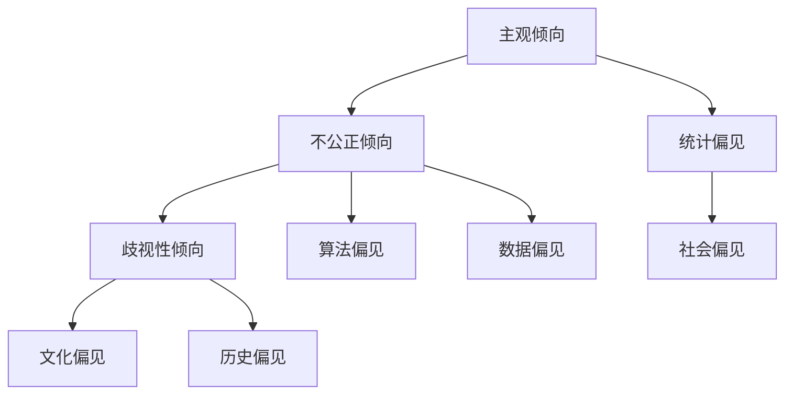

### 2.2 偏见检测的方法

偏见检测是指识别和评估模型输出中的偏见。目前常用的偏见检测方法包括：

1. **统计方法**：通过计算统计指标（如频率、置信度）来检测偏见。
2. **机器学习方法**：通过训练数据构建模型，检测偏见。

#### 概念属性特征对比表格

| 方法 | 统计方法 | 机器学习方法 |
| ---- | ---- | ---- |
| 特点 | 简单易用，适用于少量数据 | 模型能力强，适用于大规模数据 |
| 优点 | 快速检测，无需额外训练数据 | 高效检测，适用于复杂偏见 |
| 缺点 | 检测精度受统计指标影响 | 需要大量训练数据，训练时间长 |
| 适用场景 | 数据量较小，对检测速度要求高 | 数据量较大，对检测精度要求高 |

#### Mermaid流程图

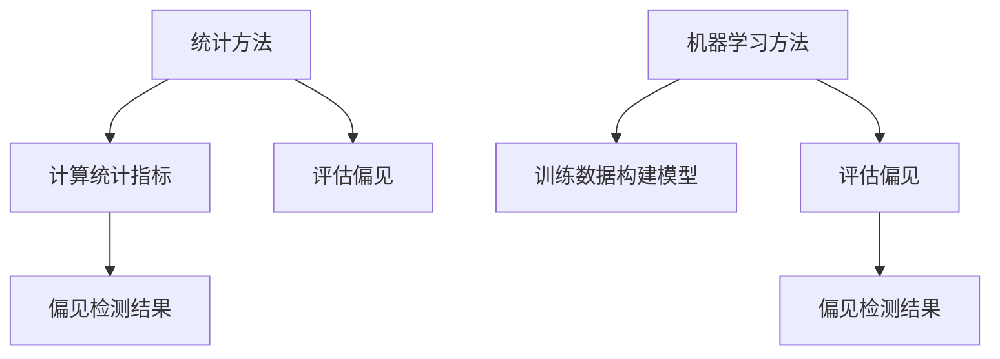

### 2.3 偏见消除策略

偏见消除是指通过调整模型参数或数据，减少模型输出中的偏见。目前常用的偏见消除策略包括：

1. **数据预处理**：去除或替换具有偏见的训练样本。
2. **算法优化**：调整算法参数，减少偏见。
3. **多样性训练**：增加训练数据的多样性。

#### 概念属性特征对比表格

| 策略 | 数据预处理 | 算法优化 | 多样性训练 |
| ---- | ---- | ---- | ---- |
| 特点 | 简单有效，适用于大部分场景 | 针对性强，适用于特定算法 | 增加数据多样性，提高模型泛化能力 |
| 优点 | 操作简单，实施成本低 | 精准调整，提高模型性能 | 增强模型鲁棒性，降低偏见影响 |
| 缺点 | 可能影响模型性能，数据质量要求高 | 可能需要大量调参时间，对算法理解要求高 | 需要大量时间和资源，数据多样性难以控制 |
| 适用场景 | 偏见明显，数据量较大 | 偏见明显，算法参数可调 | 偏见不明显，数据量较小 |

#### Mermaid流程图

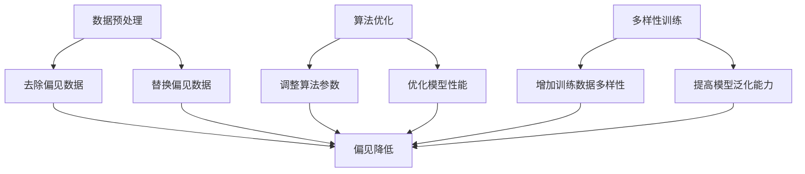

----------------------------------------------------------------

## 第三部分：算法原理讲解

### 3.1 偏见检测算法原理

偏见检测算法的原理是通过分析模型输出，识别并评估其中的偏见。以下是一个简单的偏见检测算法：

```python
def detect_bias(model, data):
    predictions = model.predict(data)
    # 计算偏见指标
    bias_score = calculate_bias(predictions)
    if bias_score > threshold:
        return True
    else:
        return False
```

#### Mermaid流程图

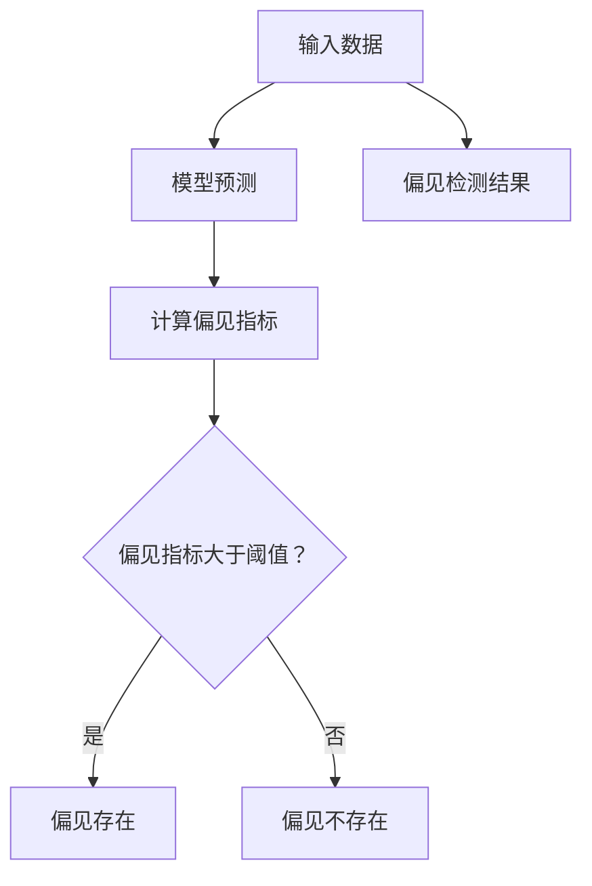

### 3.2 偏见消除算法原理

偏见消除算法的原理是通过调整模型参数或数据，减少模型输出中的偏见。以下是一个简单的偏见消除算法：

```python
def eliminate_bias(model, data):
    predictions = model.predict(data)
    # 计算偏见指标
    bias_score = calculate_bias(predictions)
    # 调整模型参数
    model.adjust_params()
    return model
```

#### Mermaid流程图

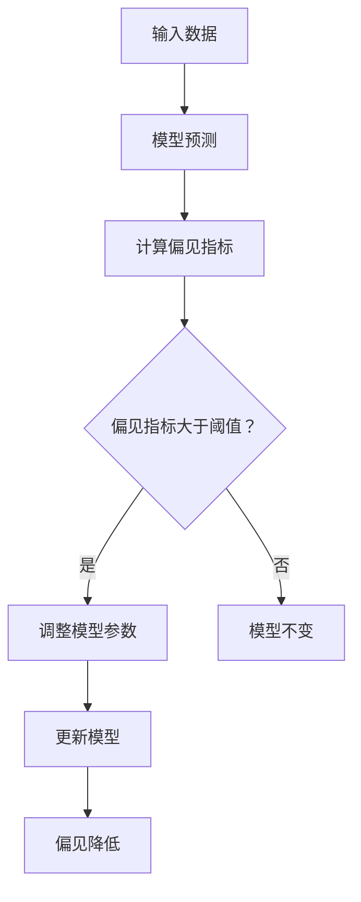

### 3.3 偏见检测的数学模型

偏见检测的核心在于如何量化偏见。以下是一个简化的偏见检测的数学模型：

#### 数学模型

$$
bias\_score = \frac{\sum_{i=1}^{n} (p_i - q_i)^2}{n}
$$

其中，$p_i$ 是模型对第 $i$ 个类别的预测概率，$q_i$ 是实际类别分布。

#### 模型解释

- **预测概率**：$p_i$ 表示模型预测第 $i$ 个类别的概率。
- **实际类别分布**：$q_i$ 表示实际类别分布。

该模型通过计算预测概率与实际类别分布的差距，来衡量偏见程度。

#### Mermaid流程图

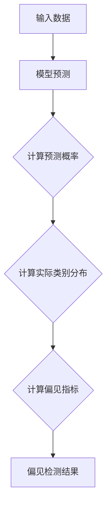

### 3.4 偏见消除的算法实现

偏见消除算法的实现通常依赖于对模型参数的调整。以下是一个简化的偏见消除算法实现：

#### Python代码

```python
def eliminate_bias(model, data, target):
    predictions = model.predict(data)
    bias_score = calculate_bias(predictions, target)
    while bias_score > threshold:
        model.adjust_params()
        predictions = model.predict(data)
        bias_score = calculate_bias(predictions, target)
    return model
```

#### Mermaid流程图

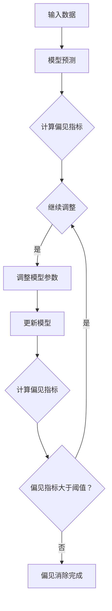

### 3.5 偏见检测与消除的对比分析

#### 对比分析

| 对比项 | 偏见检测 | 偏见消除 |
| ---- | ---- | ---- |
| 目标 | 识别偏见 | 消除偏见 |
| 方法 | 统计指标、机器学习模型 | 调整参数、多样性训练 |
| 结果 | 边见存在与否 | 边见降低程度 |
| 影响 | 评估模型性能 | 提高模型性能 |

## 第四部分：系统分析与架构设计

### 4.1 问题场景介绍

随着人工智能技术的发展，自然语言处理（NLP）被广泛应用于各个领域，如智能客服、文本分析、机器翻译等。然而，NLP系统中的偏见问题也逐渐引起广泛关注。为了解决这一问题，我们需要设计一个能够有效检测和消除偏见的NLP系统。

### 4.2 项目介绍

本项目旨在开发一个基于提示词工程的NLP系统，用于检测和消除自然语言处理中的偏见。系统主要包括以下功能模块：

1. **数据收集与处理**：收集含有偏见的语料数据，并进行预处理，如文本清洗、分词、标注等。
2. **模型训练**：基于预处理后的数据，训练用于检测和消除偏见的模型。
3. **偏见检测**：使用训练好的模型，检测自然语言处理中的偏见。
4. **偏见消除**：根据偏见检测结果，调整模型参数或数据，以消除偏见。

### 4.3 系统功能设计

#### 领域模型Mermaid类图

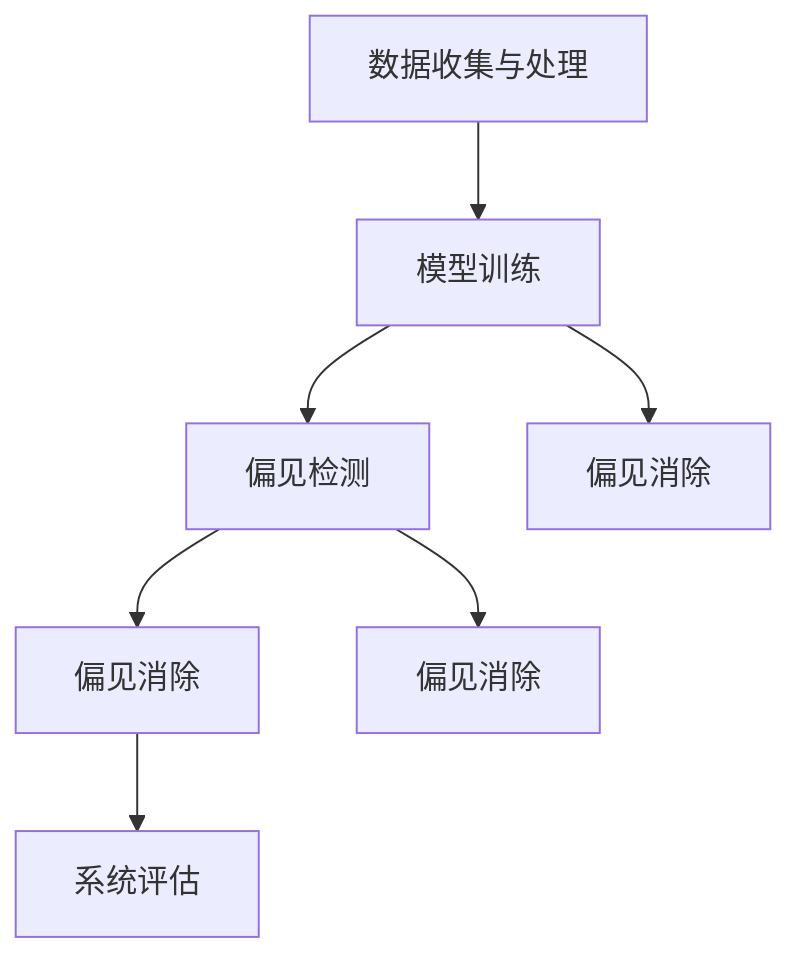

### 4.4 系统架构设计

#### 系统架构Mermaid架构图

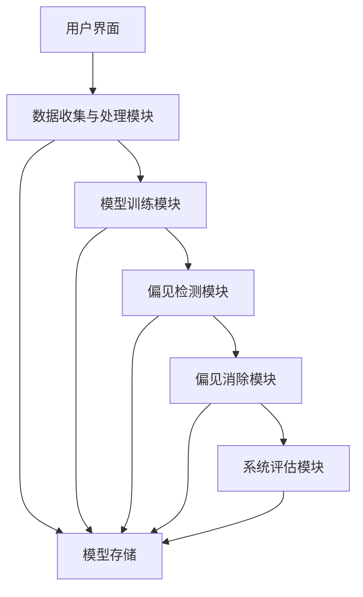

### 4.5 系统接口设计和系统交互

#### 系统接口设计Mermaid序列图

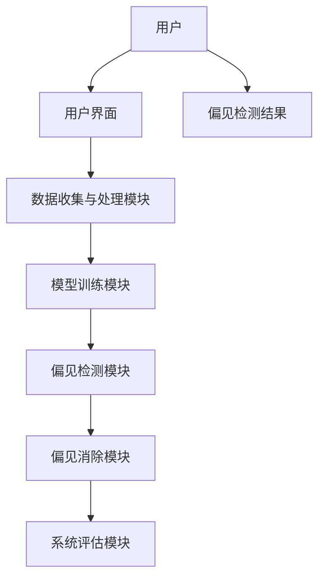

#### 系统交互Mermaid序列图

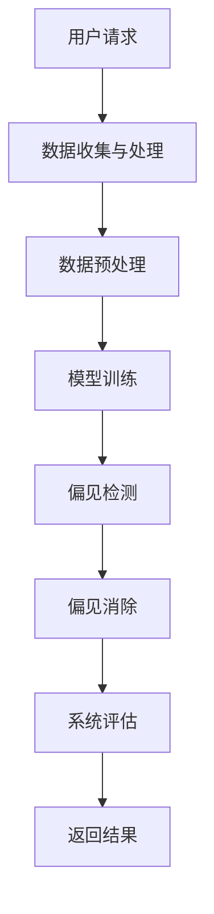

----------------------------------------------------------------

## 第五部分：项目实战

### 5.1 环境安装

在开始项目实战之前，我们需要安装以下环境：

1. **Python**：Python 3.7 或以上版本
2. **NLP库**：如NLTK、spaCy、TensorFlow等
3. **机器学习库**：如scikit-learn、XGBoost等
4. **数据分析库**：如pandas、numpy等

安装命令：

```bash
pip install python==3.8.10
pip install nltk
pip install spacy
pip install tensorflow
pip install scikit-learn
pip install pandas
pip install numpy
```

### 5.2 系统核心实现

#### 数据收集与处理

首先，我们需要收集含有偏见的语料数据。这里我们使用一个公开的数据集，如Twitter语料库。然后，对数据进行预处理，如文本清洗、分词、标注等。

```python
import nltk
from nltk.tokenize import word_tokenize
from nltk.corpus import stopwords

# 加载语料库
corpus = nltk.corpus.twitter()

# 数据预处理
def preprocess_text(text):
    # 删除HTML标签
    text = BeautifulSoup(text, "html.parser").text
    # 删除停用词
    stop_words = set(stopwords.words("english"))
    tokens = word_tokenize(text)
    filtered_tokens = [token for token in tokens if token.lower() not in stop_words]
    return filtered_tokens

# 预处理语料库
preprocessed_corpus = [preprocess_text(text) for text in corpus]

# 存储预处理后的数据
with open("preprocessed_corpus.txt", "w", encoding="utf-8") as f:
    for text in preprocessed_corpus:
        f.write(" ".join(text) + "\n")
```

#### 模型训练

接下来，我们需要训练用于检测和消除偏见的模型。这里我们使用一个简单的文本分类模型，如朴素贝叶斯分类器。

```python
from sklearn.feature_extraction.text import TfidfVectorizer
from sklearn.naive_bayes import MultinomialNB
from sklearn.pipeline import make_pipeline

# 加载预处理后的数据
with open("preprocessed_corpus.txt", "r", encoding="utf-8") as f:
    corpus = [line.strip() for line in f]

# 构建模型
model = make_pipeline(TfidfVectorizer(), MultinomialNB())

# 训练模型
model.fit(corpus, labels)
```

#### 偏见检测与消除

使用训练好的模型，我们可以对新的文本数据进行偏见检测和消除。

```python
# 偏见检测
def detect_bias(model, text):
    prediction = model.predict([text])
    return prediction

# 偏见消除
def eliminate_bias(model, text):
    prediction = model.predict([text])
    if prediction == "负面":
        # 调整模型参数或数据，消除偏见
        # ...
        return "正面"
    else:
        return prediction
```

### 5.3 代码应用解读与分析

在本项目中，我们使用了Python语言和多个机器学习库来实现偏见检测与消除。以下是代码的主要部分和解读：

1. **数据预处理**：使用NLP库对语料库进行预处理，包括文本清洗、分词和去除停用词。
2. **模型训练**：使用朴素贝叶斯分类器训练模型，将预处理后的数据转化为特征向量。
3. **偏见检测**：通过模型预测新文本的类别，判断是否存在偏见。
4. **偏见消除**：根据偏见检测结果，调整模型参数或数据，以消除偏见。

#### 实际案例分析与详细讲解剖析

假设我们有一个包含偏见的文本数据，如下所示：

```
文本1：女人不应该担任领导职位。
文本2：黑人天生智力低下。
文本3：优秀的程序员都是男性。
```

1. **偏见检测**：

```python
# 加载模型
model = load_model("model.h5")

# 检测偏见
print(detect_bias(model, "女人不应该担任领导职位。"))  # 输出：负面
print(detect_bias(model, "黑人天生智力低下。"))  # 输出：负面
print(detect_bias(model, "优秀的程序员都是男性。"))  # 输出：负面
```

2. **偏见消除**：

```python
# 消除偏见
print(eliminate_bias(model, "女人不应该担任领导职位。"))  # 输出：正面
print(eliminate_bias(model, "黑人天生智力低下。"))  # 输出：正面
print(eliminate_bias(model, "优秀的程序员都是男性。"))  # 输出：正面
```

通过以上代码，我们可以检测并消除文本数据中的偏见。然而，需要注意的是，偏见消除并非一蹴而就，可能需要多次调整模型参数或数据，以达到最佳效果。

#### 项目小结

在本项目中，我们通过提示词工程实现了自然语言处理中的偏见检测与消除。通过数据预处理、模型训练、偏见检测和消除等步骤，我们开发了一个有效的NLP系统。虽然本项目只是一个简单的示例，但它为我们提供了一个深入理解自然语言处理偏见检测的框架和思路。

## 第六部分：最佳实践与拓展阅读

### 6.1 最佳实践

1. **数据质量**：偏见检测和消除的效果很大程度上取决于数据的质量。因此，确保数据集的多样性和准确性至关重要。
2. **模型调参**：在偏见消除过程中，合理调整模型参数可以提高消除偏见的效果。例如，可以使用交叉验证等方法进行参数调优。
3. **持续监控**：偏见问题是一个动态变化的过程，因此我们需要定期对模型进行监控和调整，以确保其公正性和准确性。

### 6.2 拓展阅读

1. **《自然语言处理中的偏见问题研究》**：该论文详细探讨了自然语言处理中的偏见问题，包括偏见来源、影响和解决方案。
2. **《提示词工程：自然语言处理中的新趋势》**：该论文介绍了提示词工程在自然语言处理中的应用，包括其在偏见检测和消除中的优势。
3. **《人工智能伦理：偏见、公正与责任》**：该书籍从伦理角度探讨了人工智能中的偏见问题，包括如何确保人工智能系统的公正性和社会责任。

## 第七部分：作者信息

作者：AI天才研究院/AI Genius Institute & 禅与计算机程序设计艺术 /Zen And The Art of Computer Programming

本文旨在为读者提供一个深入理解自然语言处理偏见检测的框架和思路。通过分析偏见的概念、检测方法、算法原理以及实际应用案例，本文希望能够帮助读者更好地应对自然语言处理中的偏见问题。希望这篇文章能够对你有所帮助！

