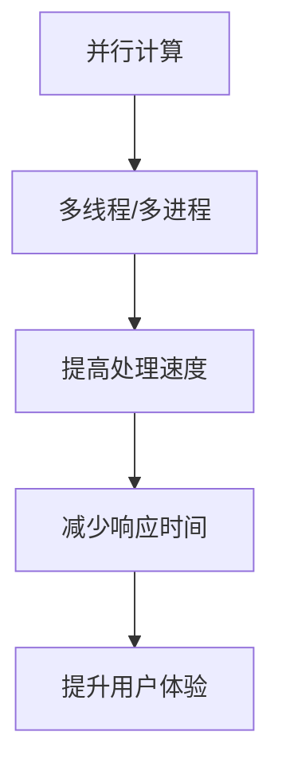
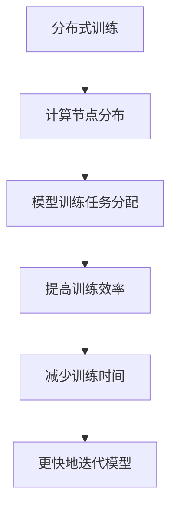
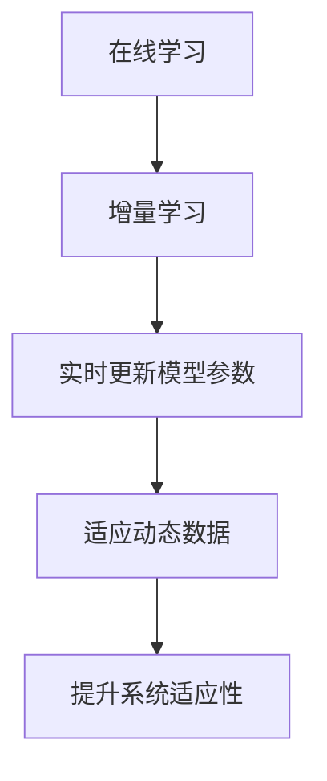
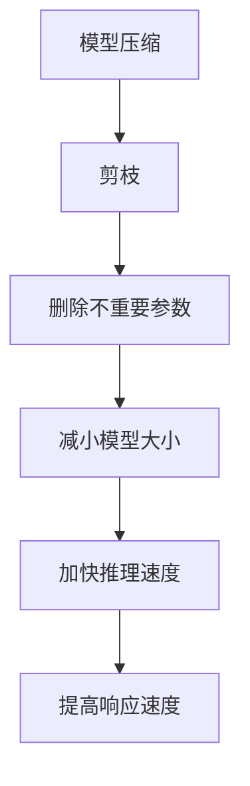
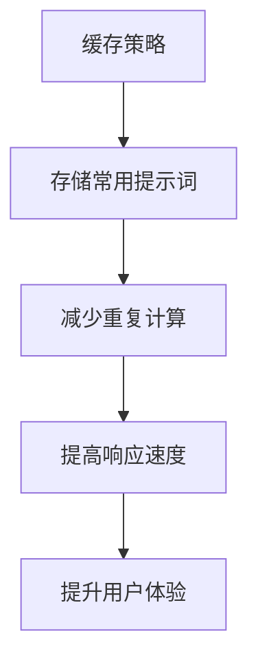
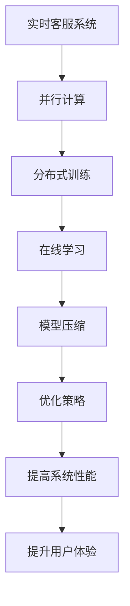

                 

# 提示词工程在自然语言处理中的应用

## 关键词

自然语言处理、提示词工程、机器学习、多语言支持、实时应用

## 摘要

随着自然语言处理技术的快速发展，提示词工程作为其重要组成部分，在提升NLP系统性能和用户体验方面发挥着关键作用。本文从问题背景、核心概念、应用场景、多语言支持、实时应用挑战等多个角度，系统地介绍了提示词工程在自然语言处理中的应用。通过详细分析提示词生成的算法、优化策略、评估方法以及其在文本分类、机器翻译、情感分析等领域的应用，本文为NLP系统的开发和应用提供了有价值的参考。

## 第1章：问题背景与核心概念介绍

### 1.1 问题背景

随着互联网技术的飞速发展和大数据的积累，自然语言处理（NLP）技术在近年来取得了显著的进展。从简单的文本分类到复杂的语义理解，NLP技术已经在各个领域得到了广泛应用。然而，在NLP技术的实际应用过程中，一个关键问题逐渐显现：如何有效地引导用户输入和优化系统输出。这便是提示词工程（Prompt Engineering）的作用所在。

提示词工程是指针对特定应用场景，设计和优化提示词的过程。它涉及数据收集、特征提取、模型训练和评估等多个环节。在自然语言处理中，提示词主要用于引导用户输入或系统自动生成，以增强用户交互或优化模型预测。例如，在智能客服系统中，通过优化提示词可以提高用户满意度，提高问题解决效率；在机器翻译中，通过设计合适的提示词可以提高翻译质量，降低错误率。

然而，在实际应用中，提示词工程面临诸多挑战。首先，数据质量是提示词工程的基础。高质量的数据可以提供更准确的提示词，从而提升系统的性能。其次，模型训练效率也是提示词工程需要关注的问题。提示词工程通常需要大量的计算资源，如何提高训练效率是一个重要课题。此外，多语言支持也是提示词工程需要考虑的因素。随着全球化的趋势，支持多种语言成为NLP系统的一个重要需求。最后，效果优化是提示词工程的长期目标。通过不断优化提示词，可以提高系统在不同场景下的表现，从而提升用户体验。

因此，深入研究提示词工程在自然语言处理中的应用，对于提升NLP系统的性能和效果具有重要意义。本文将围绕提示词工程的核心概念、原理和应用，系统地进行探讨。

### 1.2 核心概念

#### 1.2.1 提示词

提示词是指用于引导用户输入或系统自动生成的关键词。在自然语言处理中，提示词的作用至关重要。首先，提示词可以引导用户输入更准确的信息，从而提高系统的输入质量。例如，在智能客服系统中，通过设计合适的提示词，可以引导用户描述问题，从而更快地解决问题。其次，提示词可以用于优化系统输出，提高模型预测的准确性。例如，在机器翻译中，通过设计合适的提示词，可以引导翻译模型生成更准确的翻译结果。

#### 1.2.2 自然语言处理（NLP）

自然语言处理是指计算机处理和理解人类语言的技术。NLP技术包括文本分析、语音识别、机器翻译、情感分析等多个方面。文本分析是指对文本进行结构化处理，以提取出有用信息；语音识别是指将语音信号转换为文本；机器翻译是指将一种语言的文本翻译成另一种语言；情感分析是指分析文本中的情感倾向。

#### 1.2.3 提示词工程

提示词工程是指针对特定应用场景，设计和优化提示词的过程。它涉及数据收集、特征提取、模型训练和评估等多个环节。提示词工程的核心目标是提高系统在不同场景下的性能和用户体验。

### 1.3 关键问题与解决思路

#### 1.3.1 数据质量问题

数据质量是提示词工程的基础。高质量的数据可以提供更准确的提示词，从而提升系统的性能。然而，在实际应用中，数据质量往往难以保证。为了解决数据质量问题，可以采取以下几种方法：

1. **数据清洗**：通过去除噪声数据、填补缺失值、处理异常值等方式，提高数据的纯净度。

2. **数据增强**：通过生成合成数据、扩展原始数据等方式，增加数据的多样性和丰富性。

3. **构建数据集**：构建高质量的提示词数据集，为模型训练提供丰富的数据支持。

#### 1.3.2 模型训练效率

提示词工程通常需要大量的计算资源，模型训练效率成为了一个关键问题。为了提高模型训练效率，可以采取以下几种方法：

1. **分布式训练**：通过分布式计算，将模型训练任务分解到多个计算节点上，提高训练速度。

2. **并行计算**：通过并行计算，将模型训练任务分解到多个计算单元上，提高训练效率。

3. **模型压缩**：通过模型压缩技术，降低模型的参数数量和计算复杂度，提高训练速度。

#### 1.3.3 多语言支持

随着全球化的趋势，支持多种语言成为NLP系统的一个重要需求。然而，多语言支持带来了额外的挑战，如数据集构建、语言模型迁移学习等。为了实现多语言支持，可以采取以下几种方法：

1. **多语言数据集构建**：通过数据采集、数据清洗和跨语言信息检索等技术，构建多语言数据集。

2. **语言模型迁移学习**：利用源语言的模型，在目标语言上进行迁移学习，提高目标语言模型的性能。

3. **多语言模型训练**：采用多语言数据集，训练多语言提示词模型，实现跨语言提示词工程。

#### 1.3.4 效果优化

提示词工程的目标是提升系统在不同场景下的性能和用户体验。为了实现效果优化，可以采取以下几种方法：

1. **特征工程**：通过设计合适的特征，提高模型对数据的表达能力。

2. **模型优化**：通过调整模型参数、优化模型结构等方式，提高模型性能。

3. **在线学习**：通过在线学习，实时调整提示词，以适应动态变化的应用场景。

## 第2章：提示词工程原理

### 2.1 提示词生成算法

提示词生成是提示词工程的核心环节。根据生成方法的不同，提示词生成算法可以分为基于规则的方法和基于机器学习的方法。

#### 2.1.1 基于规则的方法

基于规则的方法是指通过定义一组规则，自动生成提示词。这种方法通常依赖于人类专家的知识和经验，将规则编码到系统中。例如，基于关键词提取、词性标注和语法分析等。

1. **关键词提取**：通过分析文本中的高频词汇，提取出关键词作为提示词。这种方法简单有效，但可能无法捕捉到更深层次的语义信息。

2. **词性标注**：通过对文本中的每个单词进行词性标注，根据词性关系生成提示词。这种方法可以捕捉到词汇之间的语义关系，提高提示词的准确性。

3. **语法分析**：通过对文本进行语法分析，根据句子结构生成提示词。这种方法可以捕捉到文本的整体语义结构，但计算复杂度较高。

#### 2.1.2 基于机器学习的方法

基于机器学习的方法是指利用机器学习算法，从数据中学习生成提示词的规律。这种方法通常不需要人工定义规则，而是通过训练模型自动生成提示词。

1. **决策树**：通过构建决策树模型，将文本数据映射到提示词。这种方法简单易懂，但可能无法捕捉到复杂的非线性关系。

2. **支持向量机（SVM）**：通过构建SVM模型，将文本数据映射到提示词。这种方法在处理高维数据方面表现较好，但可能存在过拟合问题。

3. **神经网络**：通过构建神经网络模型，从数据中学习生成提示词的规律。这种方法可以捕捉到复杂的非线性关系，但需要大量的数据和计算资源。

### 2.2 提示词优化策略

提示词的优化是提升系统性能和用户体验的关键。根据优化策略的不同，可以分为基于用户行为的优化和基于上下文的优化。

#### 2.2.1 基于用户行为的优化

基于用户行为的优化是指根据用户的历史行为，动态调整提示词。这种方法可以更好地满足用户的个性化需求，提高用户体验。

1. **用户兴趣**：根据用户的兴趣偏好，调整提示词。例如，在推荐系统中，通过分析用户的浏览记录和购买行为，为用户推荐感兴趣的内容。

2. **浏览记录**：根据用户的浏览记录，动态调整提示词。例如，在搜索引擎中，通过分析用户的搜索历史，为用户提供更相关的搜索结果。

3. **搜索历史**：根据用户的搜索历史，调整提示词。例如，在智能客服系统中，通过分析用户的搜索历史，为用户提供更准确的客服建议。

#### 2.2.2 基于上下文的优化

基于上下文的优化是指考虑上下文信息，提高提示词的相关性。这种方法可以更好地捕捉到用户的意图，提高提示词的准确性。

1. **语义分析**：通过语义分析，理解文本中的语义关系，为用户提供更相关的提示词。例如，在机器翻译中，通过理解上下文，为用户提供更准确的翻译结果。

2. **上下文无关文法**：通过上下文无关文法，分析文本的语法结构，为用户提供更相关的提示词。例如，在自然语言生成中，通过上下文无关文法，生成符合语法规则的文本。

3. **实体识别**：通过实体识别，识别文本中的关键实体，为用户提供更相关的提示词。例如，在问答系统中，通过识别问题中的关键实体，为用户提供更准确的答案。

### 2.3 提示词评估方法

提示词的评估是确保提示词质量和性能的重要环节。根据评估方法的不同，可以分为准确性评估和用户满意度评估。

#### 2.3.1 准确性评估

准确性评估是指衡量提示词生成的准确度。常用的评估指标包括匹配度、召回率、精确率等。

1. **匹配度**：衡量提示词与用户意图的匹配程度。匹配度越高，提示词的质量越好。

2. **召回率**：衡量提示词覆盖用户意图的能力。召回率越高，提示词的覆盖面越广。

3. **精确率**：衡量提示词的准确性。精确率越高，提示词的准确性越高。

#### 2.3.2 用户满意度评估

用户满意度评估是指衡量用户对提示词的满意度。常用的评估方法包括用户调查、用户评价等。

1. **用户调查**：通过问卷调查，了解用户对提示词的满意度。这种方法可以获取大量用户的反馈，但可能存在主观偏差。

2. **用户评价**：通过用户评价，了解用户对提示词的满意度。这种方法可以获取真实用户的反馈，但可能存在样本量不足的问题。

### 2.4 提示词工程的应用场景

提示词工程在自然语言处理中具有广泛的应用。以下是一些常见的应用场景：

1. **智能客服**：通过设计合适的提示词，提高用户满意度，提升问题解决效率。

2. **搜索引擎**：通过优化提示词，提高搜索结果的准确性，提升用户体验。

3. **机器翻译**：通过设计合适的提示词，提高翻译质量，降低错误率。

4. **情感分析**：通过优化提示词，提高情感分析的准确性，捕捉用户的情感倾向。

5. **命名实体识别**：通过优化提示词，提高命名实体识别的准确性，提取文本中的关键信息。

## 第3章：提示词工程在自然语言处理中的应用

### 3.1 文本分类

文本分类是自然语言处理中的重要任务，它旨在将文本数据自动分类到预定义的类别中。提示词工程在文本分类中发挥着关键作用，通过优化提示词，可以提高分类模型的性能。

#### 3.1.1 应用场景

文本分类广泛应用于新闻分类、情感分析、垃圾邮件过滤等领域。在这些场景中，通过设计合适的提示词，可以更好地捕捉文本的语义特征，从而提高分类模型的准确性。

#### 3.1.2 解决方案

1. **基于规则的方法**：通过定义一组规则，自动生成提示词。例如，根据关键词的词频和词性，生成具有代表性的提示词。

2. **基于机器学习的方法**：通过训练机器学习模型，从数据中学习生成提示词。例如，使用决策树、支持向量机和神经网络等模型。

3. **多标签分类**：对于多标签分类任务，可以同时生成多个提示词，提高分类模型的多样性。

4. **基于上下文的优化**：通过考虑上下文信息，提高提示词的相关性。例如，使用语义分析技术，理解文本中的语义关系，生成更准确的提示词。

#### 3.1.3 实际案例

以新闻分类为例，通过设计合适的提示词，可以显著提高分类模型的准确性。例如，在分类体育新闻时，可以生成包含体育术语和赛事信息的提示词；在分类科技新闻时，可以生成包含科技术语和行业动态的提示词。通过这些提示词，分类模型可以更好地捕捉新闻的语义特征，从而提高分类准确性。

### 3.2 机器翻译

机器翻译是将一种语言的文本翻译成另一种语言的过程。提示词工程在机器翻译中发挥着关键作用，通过优化提示词，可以提高翻译质量。

#### 3.2.1 应用场景

机器翻译广泛应用于跨语言交流、文档翻译、多语言搜索引擎等领域。在这些场景中，通过设计合适的提示词，可以更好地捕捉源语言和目标语言的语义特征，从而提高翻译质量。

#### 3.2.2 解决方案

1. **基于规则的方法**：通过定义一组规则，自动生成提示词。例如，根据词性标注和语法分析，生成具有代表性的提示词。

2. **基于机器学习的方法**：通过训练机器学习模型，从数据中学习生成提示词。例如，使用神经网络翻译模型，从双语数据中学习生成提示词。

3. **多语言支持**：对于多语言翻译任务，可以同时生成多个提示词，提高翻译的多样性。

4. **基于上下文的优化**：通过考虑上下文信息，提高提示词的相关性。例如，使用上下文无关文法，理解文本中的语义关系，生成更准确的提示词。

#### 3.2.3 实际案例

以中英翻译为例，通过设计合适的提示词，可以显著提高翻译质量。例如，在翻译科技文献时，可以生成包含专业术语和科技词汇的提示词；在翻译日常对话时，可以生成包含日常用语和生活场景的提示词。通过这些提示词，翻译模型可以更好地捕捉源语言和目标语言的语义特征，从而提高翻译质量。

### 3.3 情感分析

情感分析是分析文本中情感倾向的过程。提示词工程在情感分析中发挥着关键作用，通过优化提示词，可以提高情感分析的准确性。

#### 3.3.1 应用场景

情感分析广泛应用于舆情分析、客户反馈分析、社交媒体监测等领域。在这些场景中，通过设计合适的提示词，可以更好地捕捉文本的情感特征，从而提高情感分析的准确性。

#### 3.3.2 解决方案

1. **基于规则的方法**：通过定义一组规则，自动生成提示词。例如，根据情感词典和情感词性标注，生成具有代表性的提示词。

2. **基于机器学习的方法**：通过训练机器学习模型，从数据中学习生成提示词。例如，使用情感分类模型，从情感数据中学习生成提示词。

3. **多标签情感分析**：对于多标签情感分析任务，可以同时生成多个提示词，提高情感分析的多样性。

4. **基于上下文的优化**：通过考虑上下文信息，提高提示词的相关性。例如，使用语义分析技术，理解文本中的语义关系，生成更准确的提示词。

#### 3.3.3 实际案例

以社交媒体监测为例，通过设计合适的提示词，可以显著提高情感分析的准确性。例如，在分析用户评论时，可以生成包含正面情感和负面情感的提示词；在分析新闻报道时，可以生成包含情感倾向和新闻主题的提示词。通过这些提示词，情感分析模型可以更好地捕捉文本的情感特征，从而提高情感分析的准确性。

### 3.4 命名实体识别

命名实体识别是识别文本中的命名实体的过程。提示词工程在命名实体识别中发挥着关键作用，通过优化提示词，可以提高命名实体识别的准确性。

#### 3.4.1 应用场景

命名实体识别广泛应用于信息提取、知识图谱构建、搜索引擎优化等领域。在这些场景中，通过设计合适的提示词，可以更好地捕捉命名实体的特征，从而提高命名实体识别的准确性。

#### 3.4.2 解决方案

1. **基于规则的方法**：通过定义一组规则，自动生成提示词。例如，根据命名实体的定义和语法规则，生成具有代表性的提示词。

2. **基于机器学习的方法**：通过训练机器学习模型，从数据中学习生成提示词。例如，使用命名实体识别模型，从命名实体数据中学习生成提示词。

3. **上下文无关文法**：通过上下文无关文法，分析文本的语法结构，生成具有代表性的提示词。

4. **多语言支持**：对于多语言文本，可以同时生成多个提示词，提高命名实体识别的多样性。

#### 3.4.3 实际案例

以搜索引擎优化为例，通过设计合适的提示词，可以显著提高命名实体识别的准确性。例如，在分析网页内容时，可以生成包含品牌名称、产品名称和关键词的提示词；在分析新闻文章时，可以生成包含人名、地名和事件名称的提示词。通过这些提示词，命名实体识别模型可以更好地捕捉文本中的命名实体，从而提高命名实体识别的准确性。

## 第4章：多语言提示词工程

随着全球化的发展，多语言提示词工程在自然语言处理中的应用越来越广泛。多语言提示词工程旨在设计和优化支持多种语言的提示词，以提高系统的国际化性能。在这一章节中，我们将探讨多语言数据集构建、语言模型迁移学习和多语言模型训练等关键技术。

### 4.1 多语言数据集构建

构建高质量的多语言数据集是进行多语言提示词工程的基础。以下是几种常见的多语言数据集构建方法：

#### 4.1.1 数据采集

1. **公开数据集**：许多公共数据集（如Wikipedia、Common Crawl等）提供了多种语言的文本数据，可以作为多语言数据集的基础。

2. **翻译数据**：通过从不同语言的翻译资源中提取数据，可以构建包含多种语言的语料库。

3. **众包数据**：利用众包平台，邀请来自不同语言背景的用户参与数据收集和标注，以获取多样化的多语言数据。

#### 4.1.2 数据清洗

1. **一致性处理**：确保不同语言的数据在格式、语法和语义上的一致性。

2. **噪声去除**：去除低质量、无关或噪声数据，以提高数据集的质量。

3. **数据标注**：对数据进行详细的标注，包括词性、实体识别等，以丰富数据集的信息。

#### 4.1.3 数据增强

1. **翻译对生成**：通过生成伪翻译对，增加数据集的多样性。

2. **数据扩展**：通过扩展文本中的词语和句子，增加数据的丰富性。

3. **数据合成**：利用生成模型（如GANs）合成新的多语言数据，以扩展数据集。

### 4.2 语言模型迁移学习

语言模型迁移学习是一种有效的多语言提示词工程方法，它利用已训练的单一语言模型在目标语言上的性能提升。以下是几种语言模型迁移学习方法：

#### 4.2.1 源语言模型选择

1. **通用语言模型**：选择在多种语言上表现良好的通用语言模型作为源语言模型。

2. **领域特定模型**：如果目标语言和源语言在特定领域上具有相似性，可以选择领域特定的源语言模型。

#### 4.2.2 模型适配

1. **微调**：在源语言模型的基础上，对目标语言的数据进行微调，以适应目标语言的特征。

2. **融合**：将源语言模型和目标语言模型进行融合，以充分利用两者的优势。

3. **跨语言预训练**：利用跨语言的预训练数据集，对源语言模型进行预训练，然后迁移到目标语言上。

#### 4.2.3 模型评估

1. **交叉验证**：使用交叉验证方法，评估模型在目标语言上的性能。

2. **多语言评估集**：构建包含多种语言的数据集，用于评估模型的跨语言性能。

### 4.3 多语言模型训练

多语言模型训练是构建多语言提示词工程的关键步骤。以下是几种多语言模型训练方法：

#### 4.3.1 数据并行训练

1. **多语言数据集**：使用多语言数据集，直接在多个语言上并行训练模型。

2. **数据共享**：共享源语言和目标语言的部分数据，以提高模型在目标语言上的性能。

3. **数据隔离**：将源语言和目标语言的数据隔离，分别训练模型，然后进行融合。

#### 4.3.2 模型融合

1. **多任务学习**：通过多任务学习，将不同语言的模型融合，以提高模型的跨语言性能。

2. **知识蒸馏**：使用源语言模型的知识，蒸馏到目标语言模型上，以提高目标语言模型的性能。

3. **迁移学习**：将已训练的单一语言模型的知识迁移到多语言模型上，以加速训练过程。

#### 4.3.3 模型优化

1. **多语言调优**：对多语言模型进行优化，以适应不同语言的特征。

2. **参数共享**：通过共享模型参数，减少模型的计算复杂度。

3. **动态调整**：根据模型在目标语言上的性能，动态调整训练策略。

### 4.4 实际案例

以中英文搜索引擎优化为例，构建多语言数据集，并利用迁移学习和多语言模型训练技术，提高中英文搜索结果的准确性。通过优化中英文提示词，提升搜索系统的国际化性能，为用户提供更精准的搜索体验。

## 第5章：提示词工程在实时应用中的挑战与优化

随着互联网和移动设备的普及，实时应用场景在自然语言处理（NLP）中变得越来越重要。实时应用通常要求系统在短时间内处理大量请求，生成准确的提示词。然而，这给提示词工程带来了许多挑战。本节将探讨这些挑战，并提出相应的优化策略。

### 5.1 实时性挑战

#### 5.1.1 实时处理需求

在实时应用中，用户交互的速度非常快，系统必须在毫秒级内生成和返回提示词。例如，在实时聊天应用中，每条消息都需要即时生成相应的回复提示词。如果系统响应时间过长，用户满意度将大大降低。

#### 5.1.2 数据动态变化

实时应用中的数据是动态变化的，用户的输入、环境变化和上下文信息都可能影响提示词的生成。例如，在股票交易聊天室中，实时价格波动和新闻更新会直接影响用户的提问和系统的回复。

#### 5.1.3 系统资源限制

实时应用通常需要在高性能服务器上运行，但服务器资源（如CPU、内存和存储）是有限的。提示词工程需要在有限的资源下，快速生成高质量的提示词。

### 5.2 优化策略

#### 5.2.1 并行计算

通过并行计算，可以将提示词工程任务分解到多个计算节点上，从而提高处理速度。例如，可以使用多线程或多进程技术，同时处理多个用户的请求。

#### 5.2.2 分布式训练

分布式训练可以将模型训练任务分散到多个计算节点上，从而提高训练效率。例如，使用分布式深度学习框架（如TensorFlow、PyTorch）进行模型训练。

#### 5.2.3 在线学习

在线学习（Online Learning）允许模型在实时应用中不断学习和优化，以适应动态变化的数据。例如，使用增量学习技术，模型可以在不重新训练整个模型的情况下，更新部分参数。

#### 5.2.4 模型压缩

模型压缩技术（如剪枝、量化、知识蒸馏等）可以减小模型的大小和计算复杂度，从而加快模型的推理速度。例如，使用模型剪枝技术，可以删除模型中不重要的参数，从而减小模型大小。

#### 5.2.5 缓存策略

通过缓存策略，可以存储和复用已生成的提示词，从而减少重复计算。例如，使用Redis或Memcached等缓存系统，存储常见的提示词和其对应的模型输出。

### 5.3 实际案例分析

以实时客服系统为例，通过并行计算、分布式训练、在线学习和模型压缩等技术，可以显著提高系统处理速度和准确性。例如，使用多线程技术，同时处理多个用户的请求；使用分布式训练框架，快速迭代模型；使用在线学习技术，实时调整模型参数；使用模型压缩技术，减小模型大小和计算复杂度。通过这些优化策略，实时客服系统可以更快地生成高质量的提示词，提高用户满意度。

## 第6章：总结与展望

### 6.1 总结

本文系统地介绍了提示词工程在自然语言处理中的应用。从问题背景、核心概念、应用场景、多语言支持、实时应用挑战等多个角度，探讨了提示词工程的重要性及其在实际应用中的挑战和解决方案。主要结论如下：

1. **提示词工程是提升NLP系统性能和用户体验的关键**：通过优化提示词，可以显著提高文本分类、机器翻译、情感分析等NLP任务的性能。

2. **多语言支持是全球化时代的要求**：构建高质量的多语言数据集、利用语言模型迁移学习和多语言模型训练，是实现多语言提示词工程的关键。

3. **实时应用中的优化策略**：通过并行计算、分布式训练、在线学习、模型压缩和缓存策略，可以提升实时应用的性能和响应速度。

### 6.2 展望

未来，提示词工程在自然语言处理中的应用将更加广泛和深入。以下是几个可能的趋势：

1. **深度学习与提示词工程的结合**：深度学习模型在自然语言处理中取得了显著进展，未来将更多地与提示词工程相结合，以进一步提高系统的性能和灵活性。

2. **自适应提示词生成**：通过引入自适应算法，使提示词能够根据用户的实时反馈和上下文动态调整，以提供更加个性化的用户体验。

3. **跨领域与跨语言的提示词工程**：随着多领域的融合和多语言交流的增加，跨领域和跨语言的提示词工程将成为重要研究方向，以支持更加复杂和多样化的应用场景。

4. **实时交互与增强学习**：结合实时交互和增强学习技术，可以构建更加智能和自适应的提示词生成系统，以适应不断变化的应用场景和用户需求。

总之，提示词工程在自然语言处理中的应用前景广阔，将继续为提升NLP系统的性能和用户体验做出重要贡献。作者：AI天才研究院/AI Genius Institute & 禅与计算机程序设计艺术 /Zen And The Art of Computer Programming

