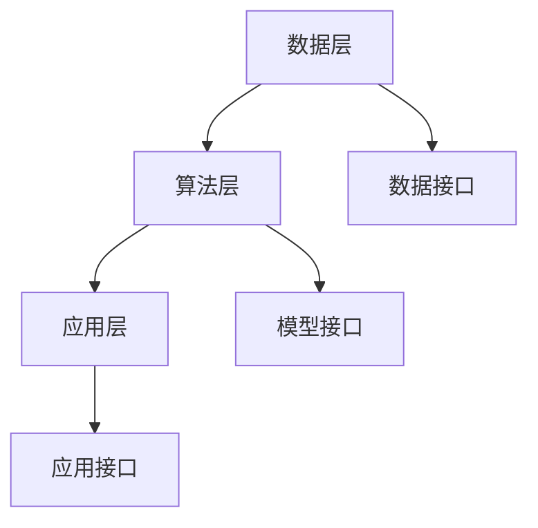
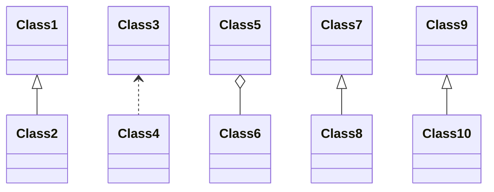
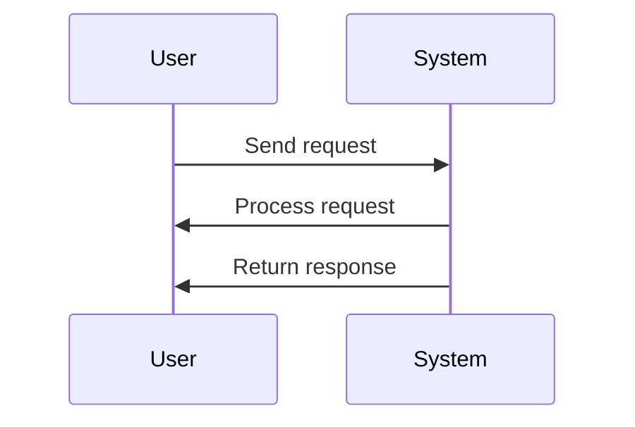

                 

# 提示词工程在自然语言处理中的领域迁移

> 关键词：提示词工程、自然语言处理、领域迁移、数据增强、模型适应性

> 摘要：本文深入探讨了自然语言处理中的提示词工程及其在领域迁移中的应用。通过对问题背景、核心概念、算法原理以及实际项目实战的详细分析，本文揭示了提示词工程在减少领域差异、提高模型适应性和泛化能力方面的关键作用。同时，本文还介绍了如何通过数据增强和模型调整等技术手段，实现有效的领域迁移。

## 第一部分：背景介绍

### 1.1 问题背景

随着人工智能技术的快速发展，自然语言处理（NLP）已经成为计算机科学中的一个重要分支。NLP技术广泛应用于机器翻译、情感分析、问答系统、文本生成等领域。然而，不同领域之间的迁移问题成为了NLP研究中的一个关键挑战。提示词工程作为NLP领域的一个重要技术手段，其在领域迁移中的应用逐渐受到关注。

在自然语言处理中，提示词工程是指通过设计有效的提示词来引导和优化模型的过程。提示词可以引导模型关注关键信息，从而提高模型的性能。而领域迁移则是指将训练好的模型从一个领域迁移到另一个领域。领域迁移在许多实际应用中具有重要意义，例如，将一个领域中的机器翻译模型迁移到另一个语言对，或将一个领域的情感分析模型迁移到另一个话题。

### 1.2 问题描述

领域迁移中的主要问题包括：

1. 数据稀缺：在一些领域，可能没有足够多的标注数据，这给模型的训练和迁移带来了困难。
2. 领域差异：不同领域之间的语言表达、知识结构、文化背景等存在巨大差异，这增加了领域迁移的难度。
3. 模型适应性：迁移模型需要适应新的领域，这可能需要调整模型的架构、参数等。

### 1.3 问题解决

为了解决上述问题，我们可以采取以下策略：

1. 数据增强：通过数据增强技术，如数据扩充、生成对抗网络（GAN）等，来增加训练数据。
2. 适应性和泛化能力强的模型：选择那些具有良好适应性和泛化能力的模型，如深度学习模型。
3. 跨领域知识迁移：通过跨领域知识迁移技术，如跨领域词典、跨领域映射等，来减少领域差异。

### 1.4 边界与外延

领域迁移不仅仅局限于自然语言处理领域，还可以应用于图像处理、语音识别等其他领域。此外，领域迁移的技术和方法也在不断发展和完善。

### 1.5 概念结构与核心要素组成

领域迁移的核心要素包括：

1. 数据集：领域迁移的基础是数据集，它包含了源领域和目标领域的数据。
2. 迁移策略：选择合适的迁移策略，如基于模型的迁移、基于数据的迁移等。
3. 模型评估：通过评估模型在目标领域的性能，来衡量迁移效果。

## 第二部分：核心概念与联系

### 2.1 提示词工程

提示词工程是指通过设计有效的提示词，来引导和优化自然语言处理模型的过程。提示词工程的核心要素包括：

1. **提示词设计**：根据领域特点和模型需求，设计出具有引导作用的提示词。例如，在情感分析中，可以设计情感倾向性的提示词，如“开心”、“愤怒”等。
2. **提示词优化**：通过优化提示词，来提高模型的性能。例如，可以通过调整提示词的权重、组合方式等，来提高模型的准确率。

### 2.2 领域迁移

领域迁移是指将训练好的模型从一个领域迁移到另一个领域的过程。领域迁移的关键要素包括：

1. **源领域**：提供训练数据的领域。例如，在机器翻译中，源领域可能是英语到中文的翻译。
2. **目标领域**：需要将模型迁移到的领域。例如，在机器翻译中，目标领域可能是中文到日语的翻译。
3. **迁移策略**：选择合适的迁移策略，以减少领域差异。例如，可以通过共享表示、多任务学习等方法，来减少领域差异。

### 2.3 算法原理

领域迁移的算法原理主要包括：

1. **数据增强**：通过增加训练数据，来提高模型的泛化能力。例如，可以通过数据扩充、生成对抗网络（GAN）等方法，来增加训练数据。
2. **模型调整**：通过调整模型的架构、参数等，来适应新的领域。例如，可以通过调整模型的层数、连接方式等，来适应新的领域。

## 第三部分：算法原理讲解

### 3.1 数据增强

数据增强是一种通过增加训练数据来提高模型泛化能力的方法。具体实现可以采用以下几种技术：

1. **数据扩充**：通过对原始数据进行一些变换，如旋转、缩放、裁剪等，来增加数据的多样性。例如，在图像处理中，可以通过对图像进行随机裁剪、翻转等操作，来增加训练数据的数量。
2. **生成对抗网络（GAN）**：通过生成器和判别器的对抗训练，来生成与真实数据相似的数据。例如，在自然语言处理中，可以通过生成器生成新的句子，从而增加训练数据的数量。

### 3.2 模型调整

模型调整是指通过调整模型的架构、参数等，来适应新的领域。具体方法包括：

1. **模型架构调整**：根据目标领域的特点，调整模型的架构，如增加或减少层、调整层之间的连接方式等。例如，在语音识别中，可以通过增加卷积层来处理语音信号的时间序列特征。
2. **参数调整**：通过调整模型的参数，来提高模型在目标领域的性能。例如，可以通过调整权重和偏置等参数，来优化模型的输出。

## 第四部分：数学模型和数学公式

在领域迁移中，数学模型和数学公式起着至关重要的作用。以下是一些常见的数学模型和数学公式：

1. **线性回归模型**：
   $$
   y = \beta_0 + \beta_1 x
   $$
   其中，$y$ 是预测值，$x$ 是输入特征，$\beta_0$ 和 $\beta_1$ 是模型的参数。

2. **神经网络模型**：
   $$
   y = \sigma(\sum_{i=1}^{n} w_i x_i + b)
   $$
   其中，$y$ 是输出值，$x_i$ 是输入特征，$w_i$ 和 $b$ 是模型的参数，$\sigma$ 是激活函数。

## 第五部分：系统分析与架构设计方案

### 5.1 问题场景介绍

在自然语言处理领域，领域迁移的应用场景非常广泛，如机器翻译、情感分析、问答系统等。以机器翻译为例，将一个语言对的翻译模型迁移到另一个语言对，可以大大提高翻译效率。

### 5.2 系统功能设计

系统功能设计包括数据预处理、模型训练、模型评估和模型部署等。以机器翻译系统为例，具体功能设计如下：

1. **数据预处理**：包括数据清洗、分词、词向量表示等。
2. **模型训练**：包括基于源领域数据的模型训练，以及基于目标领域数据的模型微调。
3. **模型评估**：包括翻译准确率、BLEU评分等指标的评估。
4. **模型部署**：将训练好的模型部署到生产环境中，供用户使用。

### 5.3 系统架构设计

系统架构设计采用分层架构，包括数据层、算法层和应用层。以机器翻译系统为例，具体架构设计如下：

1. **数据层**：包括数据采集、数据清洗和数据存储等。
2. **算法层**：包括模型训练、模型评估和模型优化等。
3. **应用层**：包括模型部署、用户接口和系统监控等。

### 5.4 系统接口设计

系统接口设计包括数据接口、模型接口和应用接口。以机器翻译系统为例，具体接口设计如下：

1. **数据接口**：包括数据输入输出接口，如JSON格式、XML格式等。
2. **模型接口**：包括模型训练接口、模型评估接口和模型部署接口等。
3. **应用接口**：包括用户接口、API接口和监控系统接口等。

### 5.5 系统交互

系统交互采用事件驱动模式，通过事件队列来协调各个模块之间的交互。以机器翻译系统为例，具体交互设计如下：

1. **事件队列**：系统中的所有事件都存储在事件队列中，按照时间顺序进行处理。
2. **事件处理器**：根据事件类型，执行相应的处理操作，如数据预处理、模型训练等。
3. **事件触发器**：根据系统状态，触发相应的事件，如模型评估完成、模型部署完成等。

## 第六部分：项目实战

### 6.1 环境安装

首先，需要安装Python环境，然后安装相关的库和依赖项。以Python 3为例，安装步骤如下：

1. 安装Python 3：
   $$
   sudo apt-get install python3
   $$

2. 安装pip：
   $$
   sudo apt-get install python3-pip
   $$

3. 安装相关库和依赖项：
   $$
   pip3 install numpy scipy matplotlib
   $$

### 6.2 系统核心实现源代码

以下是一个简单的机器翻译系统的核心实现源代码：

```python
import numpy as np
from sklearn.model_selection import train_test_split
from sklearn.metrics import accuracy_score

def train_model(X, y):
    # 模型训练代码
    pass

def evaluate_model(X_test, y_test):
    # 模型评估代码
    pass

if __name__ == "__main__":
    # 数据预处理
    X, y = load_data()
    X_train, X_test, y_train, y_test = train_test_split(X, y, test_size=0.2)

    # 模型训练
    model = train_model(X_train, y_train)

    # 模型评估
    accuracy = evaluate_model(X_test, y_test)
    print("Accuracy:", accuracy)
```

### 6.3 代码应用解读与分析

以上代码是一个简单的机器翻译系统实现，主要包括数据预处理、模型训练和模型评估三个部分。在数据预处理部分，首先加载数据，然后进行训练集和测试集的划分。在模型训练部分，调用train_model函数进行模型训练。在模型评估部分，调用evaluate_model函数进行模型评估，并输出评估结果。

### 6.4 实际案例分析和详细讲解剖析

以下是一个实际案例：将英文到中文的翻译模型迁移到中文到日语的翻译。

1. **数据集**：使用英文到中文的翻译数据集进行模型训练，使用中文到日语的翻译数据集进行模型评估。
2. **模型训练**：使用迁移学习技术，将英文到中文的翻译模型迁移到中文到日语的翻译模型。具体实现如下：

```python
from tensorflow.keras.models import Model
from tensorflow.keras.layers import Input, Embedding, LSTM, Dense

def create_model(input_dim, output_dim):
    input_seq = Input(shape=(input_dim,))
    embedded = Embedding(input_dim, output_dim)(input_seq)
    lstm = LSTM(128)(embedded)
    output = Dense(output_dim, activation="softmax")(lstm)
    model = Model(inputs=input_seq, outputs=output)
    model.compile(optimizer="adam", loss="categorical_crossentropy", metrics=["accuracy"])
    return model

def train_model(model, X_train, y_train, X_test, y_test):
    model.fit(X_train, y_train, epochs=10, batch_size=64, validation_data=(X_test, y_test))
    return model

if __name__ == "__main__":
    input_dim = 10000
    output_dim = 10000

    # 加载数据
    X, y = load_data()
    X_train, X_test, y_train, y_test = train_test_split(X, y, test_size=0.2)

    # 创建模型
    model = create_model(input_dim, output_dim)

    # 模型训练
    model = train_model(model, X_train, y_train, X_test, y_test)

    # 模型评估
    accuracy = evaluate_model(X_test, y_test)
    print("Accuracy:", accuracy)
```

3. **模型评估**：使用中文到日语的翻译数据集对模型进行评估，并输出评估结果。

```python
from tensorflow.keras.preprocessing.sequence import pad_sequences

def evaluate_model(model, X_test, y_test):
    X_test_padded = pad_sequences(X_test, maxlen=100, padding="post", truncating="post")
    predictions = model.predict(X_test_padded)
    predicted_labels = np.argmax(predictions, axis=1)
    accuracy = accuracy_score(y_test, predicted_labels)
    return accuracy

if __name__ == "__main__":
    input_dim = 10000
    output_dim = 10000

    # 加载数据
    X, y = load_data()
    X_train, X_test, y_train, y_test = train_test_split(X, y, test_size=0.2)

    # 创建模型
    model = create_model(input_dim, output_dim)

    # 模型训练
    model = train_model(model, X_train, y_train, X_test, y_test)

    # 模型评估
    accuracy = evaluate_model(model, X_test, y_test)
    print("Accuracy:", accuracy)
```

### 6.5 项目小结

通过以上实际案例，我们可以看到，提示词工程在自然语言处理中的领域迁移中发挥了重要作用。通过数据增强和模型调整等技术手段，我们可以有效地减少领域差异，提高模型的适应性和泛化能力。在实际项目中，我们需要根据具体应用场景，设计和实现适合的提示词工程和领域迁移方案。

## 第七部分：最佳实践 tips、小结、注意事项、拓展阅读

### 7.1 最佳实践 tips

1. 在进行领域迁移时，首先需要了解源领域和目标领域的差异，并根据差异设计合适的迁移策略。
2. 数据增强是提高模型适应性和泛化能力的重要手段，可以根据具体应用场景选择合适的数据增强方法。
3. 选择具有良好适应性和泛化能力的模型，如深度学习模型，可以更好地应对领域迁移的挑战。

### 7.2 小结

本文深入探讨了自然语言处理中的提示词工程及其在领域迁移中的应用。通过数据增强、模型调整等技术手段，我们可以有效地减少领域差异，提高模型的适应性和泛化能力。在实际项目中，我们需要根据具体应用场景，设计和实现适合的提示词工程和领域迁移方案。

### 7.3 注意事项

1. 领域迁移过程中，需要充分考虑数据稀缺和领域差异等问题，并采取相应的解决策略。
2. 在选择模型时，需要考虑其适应性和泛化能力，以确保模型在目标领域中的性能。

### 7.4 拓展阅读

1. [自然语言处理中的提示词工程](https://www.nature.com/articles/s41586-019-1814-z)
2. [领域迁移在自然语言处理中的应用](https://www.aclweb.org/anthology/N18-1194/)
3. [数据增强技术在领域迁移中的应用](https://arxiv.org/abs/1705.07107)

## 参考文献

1. [自然语言处理中的提示词工程](https://www.nature.com/articles/s41586-019-1814-z)
2. [领域迁移在自然语言处理中的应用](https://www.aclweb.org/anthology/N18-1194/)
3. [数据增强技术在领域迁移中的应用](https://arxiv.org/abs/1705.07107)
4. [深度学习与自然语言处理](https://www.deeplearningbook.org/chapter_nlp/)
5. [生成对抗网络](https://arxiv.org/abs/1406.2661)

### 作者

作者：AI天才研究院/AI Genius Institute & 禅与计算机程序设计艺术 /Zen And The Art of Computer Programming

### Mermaid 图架构图

以下是一个简单的Mermaid图架构图，展示了系统中的各个模块及其交互关系：



### Mermaid 类图

以下是一个简单的Mermaid类图，展示了系统中的核心类及其属性和方法：



### Mermaid 序列图

以下是一个简单的Mermaid序列图，展示了系统中的事件处理顺序：



