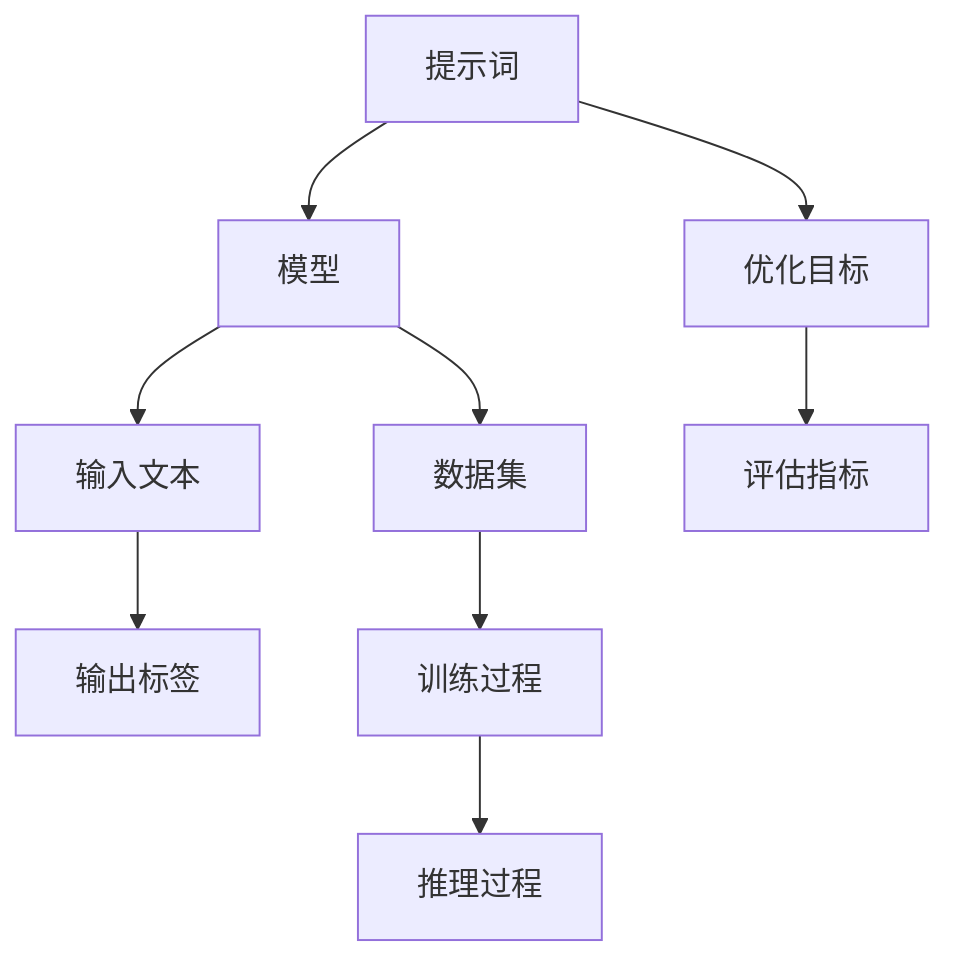

                 

### 1.6 本章小结

本章对提示词工程在自然语言处理中的重要性进行了概述，并详细介绍了问题背景、问题描述、问题解决以及边界与外延。首先，我们探讨了自然语言处理中提示词工程的关键作用，以及其在模型学习中的重要性。随后，我们深入分析了提示词的定义、设计原则、优化方法及其在各类NLP任务中的应用。

通过本章的学习，我们明确了提示词工程的边界，即设计、优化和评估提示词的过程，以及其在不同NLP任务中的适用性。此外，我们还梳理了提示词工程的核心概念和要素，包括提示词、优化目标和评估指标。

这些基础概念和内容为后续章节的深入探讨提供了必要的背景和理论支持。在接下来的章节中，我们将进一步探讨提示词工程的具体实现方法、优化策略以及实际应用案例，以帮助读者更全面地理解和掌握这一重要领域。通过这样的系统学习和实践，读者将能够更好地应用提示词工程，提升自然语言处理模型的性能和效果。因此，本章的内容不仅是对提示词工程的基本介绍，也是我们进一步研究和实践这一领域的起点。接下来，我们将逐步深入，探讨更多关于提示词工程的精彩内容。

---

## 第2章 提示词工程的核心概念与原理

### 2.1 提示词的定义与作用

#### 2.1.1 提示词的定义

提示词（Prompt）是指为引导模型学习而设计的短语或句子。这些短语或句子不仅为模型提供了明确的上下文，还帮助模型理解任务的特定需求，从而在训练和推理过程中提高其性能。

在自然语言处理中，提示词具有以下几个基本特征：

- **目标性**：提示词应当明确传达任务的目标，使模型能够聚焦于关键信息。
- **上下文关联性**：提示词应与具体的上下文紧密相关，帮助模型更好地捕捉上下文信息。
- **简洁性**：提示词应尽量简洁，避免冗余，以便模型能够迅速理解其意图。

#### 2.1.2 提示词的作用

提示词在自然语言处理中的作用主要体现在以下几个方面：

- **任务引导**：提示词能够引导模型学习，使其在特定任务上取得更好的表现。例如，在文本分类任务中，提示词可以帮助模型理解不同的分类标签。
- **上下文构建**：通过提示词，模型能够构建出更为丰富的上下文信息，从而提高对语义的理解。这在诸如问答系统和机器翻译等任务中尤为重要。
- **性能提升**：有效的提示词设计能够显著提升模型的性能，使其在各类自然语言处理任务中表现更为优异。

### 2.2 提示词的设计原则

为了设计出有效的提示词，需要遵循以下几项基本原则：

#### 2.2.1 目标明确

提示词应明确传达任务目标，避免模糊性。例如，在文本分类任务中，提示词应明确指定分类标签，使模型能够聚焦于相关特征。

#### 2.2.2 简洁性

提示词应简洁明了，避免冗余信息。简洁的提示词不仅有助于模型快速理解任务需求，还能减少模型在处理时的计算负担。

#### 2.2.3 上下文关联性

提示词应与上下文紧密关联，以帮助模型捕捉关键信息。例如，在问答系统中，提示词应包含问题的核心内容，以便模型能够准确理解并生成答案。

### 2.3 提示词的优化方法

提示词的优化是提高模型性能的重要手段。以下是几种常见的提示词优化方法：

#### 2.3.1 基于数据的优化

通过分析数据集，找出能够有效引导模型学习的提示词。这种方法通常涉及特征工程和统计分析，以便识别出与模型性能高度相关的提示词。

#### 2.3.2 基于模型的优化

利用模型自身的反馈，不断调整和优化提示词。这种方法通常涉及模型训练和评估，通过迭代优化过程，逐步提高提示词的效果。

### 2.4 提示词在NLP任务中的应用

提示词在自然语言处理的多个任务中有着广泛的应用。以下是一些具体的应用实例：

#### 2.4.1 文本分类

在文本分类任务中，提示词可以帮助模型理解不同的分类标签，从而提高分类准确性。例如，在情感分析中，提示词“正面”和“负面”可以帮助模型区分文本的情感倾向。

#### 2.4.2 机器翻译

在机器翻译任务中，提示词可以提供源语言和目标语言之间的关联信息，从而提高翻译质量。例如，提示词“中文”和“英文”可以帮助模型更好地理解语言间的转换规则。

#### 2.4.3 情感分析

在情感分析任务中，提示词可以捕捉文本的情感倾向。例如，提示词“高兴”、“愤怒”等可以帮助模型准确判断文本的情感状态。

### 2.5 概念属性特征对比表格

为了更清晰地理解提示词工程的核心概念，我们通过以下表格对比提示词与其他相关概念：

| 概念     | 定义                                                         | 属性特征                                                 | 对比分析                                     |
| -------- | ------------------------------------------------------------ | ---------------------------------------------------- | -------------------------------------------- |
| 提示词   | 引导模型学习的短语或句子                                     | - 明确任务目标 - 简洁明了 - 上下文关联           | 与其他概念如输入文本、输出标签有明确的区分和联系 |
| 输入文本 | 模型处理的原始文本数据                                       | - 结构化或非结构化 - 包含丰富信息                       | 提示词的输入之一，但本身不引导学习过程       |
| 输出标签 | 模型预测的类别或结果                                       | - 标签明确 - 用于评估模型性能                         | 与提示词的目标性有重叠，但主要作为模型输出    |
| 评估指标 | 衡量模型性能的指标，如准确性、召回率、F1值等                 | - 综合评估模型性能 - 动态调整                         | 用于评估提示词效果，但不是提示词本身的属性     |

### 2.6 ER实体关系图架构的Mermaid流程图

为了更好地理解提示词工程中的实体关系，我们使用Mermaid流程图来表示主要实体及其关系：

在上述流程图中，提示词作为引导模型学习的重要工具，与模型、输入文本、输出标签、优化目标和评估指标等实体密切相关。通过优化和评估，提示词能够有效提高模型在自然语言处理任务中的性能。

### 本章小结

本章详细探讨了提示词工程的核心概念与原理，包括提示词的定义与作用、设计原则、优化方法以及在各类NLP任务中的应用。通过对比表格和Mermaid流程图，我们更清晰地理解了提示词工程中的关键实体及其相互关系。这些核心概念和原理为后续章节的深入探讨提供了坚实的基础。在下一章中，我们将进一步探讨如何在实际应用中优化提示词，提升自然语言处理模型的性能。

---

通过本章的学习，我们全面了解了提示词工程的核心概念与原理，包括提示词的定义、设计原则、优化方法及其在自然语言处理任务中的应用。我们通过对比表格和Mermaid流程图，进一步清晰了提示词与其他相关概念之间的关系。这些基础知识和理解将为后续章节的深入研究和实践提供重要支撑。在下一章中，我们将聚焦于实际应用中如何优化提示词，探讨更多关于提示词工程的有效策略和实践技巧。敬请期待！

---

## 第3章 提示词优化方法与策略

### 3.1 基于数据的优化方法

基于数据的优化方法是通过分析数据集来寻找有效提示词的过程。这种方法的核心思想是利用数据中的特征信息，指导提示词的设计和选择，以提高模型在特定任务上的性能。以下是几种常用的基于数据的优化方法：

#### 3.1.1 特征工程

特征工程是数据预处理的关键步骤，它涉及到从原始数据中提取出对模型学习最有用的信息。在提示词优化中，特征工程可以帮助我们识别出与任务目标相关的重要特征，从而设计出更有效的提示词。

- **文本特征提取**：例如，使用TF-IDF、Word2Vec等方法从文本中提取词频和词嵌入等特征，这些特征可以用于设计提示词。
- **主题模型**：通过主题模型（如LDA）分析文本数据，提取出主要的主题分布，这些主题可以作为提示词的候选。

#### 3.1.2 统计分析

统计分析是通过对数据集进行量化分析，找出提示词与模型性能之间的关系。常见的方法包括：

- **相关性分析**：通过计算提示词与模型性能指标（如准确率、召回率、F1值）之间的相关性，识别出对模型性能有显著影响的提示词。
- **回归分析**：利用回归模型分析提示词与模型性能之间的关系，从而找出最佳提示词组合。

#### 3.1.3 嵌入式方法

嵌入式方法是将提示词作为嵌入向量，通过分析其在高维空间中的分布来优化提示词。这种方法通常涉及以下步骤：

- **词嵌入**：使用预训练的词嵌入模型（如GloVe、BERT等）将提示词转换为向量表示。
- **聚类分析**：通过聚类算法（如K-means、层次聚类等）分析提示词的分布，识别出具有相似特征的提示词。

### 3.2 基于模型的优化方法

基于模型的优化方法是通过模型自身的反馈，不断调整和优化提示词的过程。这种方法的核心在于利用模型的训练过程和预测结果来指导提示词的迭代优化。以下是几种常用的基于模型的优化方法：

#### 3.2.1 模型迭代

模型迭代是通过多次训练模型，每次都基于前一次的训练结果调整提示词。这种方法通常涉及以下步骤：

- **训练与评估**：首先使用当前提示词训练模型，然后评估模型在测试集上的性能。
- **调整提示词**：根据评估结果，调整提示词，以期望提高模型性能。
- **重复迭代**：重复训练、评估和调整过程，直到模型性能达到预期目标。

#### 3.2.2 反馈循环

反馈循环是利用模型预测结果的反馈来优化提示词。这种方法通常涉及以下步骤：

- **预测与反馈**：模型生成预测结果后，将其与实际标签进行对比，生成反馈信号。
- **优化提示词**：根据反馈信号，调整提示词，使其更符合实际任务需求。
- **再训练**：使用调整后的提示词重新训练模型，以进一步提高模型性能。

#### 3.2.3 对比学习

对比学习是一种通过对比不同提示词的效果来优化提示词的方法。这种方法通常涉及以下步骤：

- **多提示词训练**：同时训练多个模型，每个模型使用不同的提示词。
- **性能对比**：对比不同模型的性能，找出最佳提示词。
- **集成优化**：将多个最佳提示词集成起来，进一步优化模型性能。

### 3.3 提示词优化方法对比

为了更清晰地理解不同优化方法的特点和适用场景，以下是基于数据和基于模型优化方法的对比表格：

| 优化方法       | 核心思想                                               | 适用场景                                       | 优点                                                         | 缺点                                                         |
| -------------- | ------------------------------------------------------ | ---------------------------------------------- | ------------------------------------------------------------ | ------------------------------------------------------------ |
| 基于数据的优化 | 通过分析数据集来寻找有效提示词                         | 数据丰富的任务，如文本分类、情感分析等           | 基于大量数据，能够发现潜藏的特征关系                           | 对模型细节依赖较小，可能无法充分利用模型自身的特性           |
| 基于模型的优化 | 通过模型自身的反馈，不断调整和优化提示词               | 需要频繁调整提示词的任务，如问答系统、机器翻译等 | 能够充分利用模型反馈，动态调整提示词                         | 对数据依赖较小，但可能需要更多的计算资源                       |
| 对比学习       | 通过对比不同提示词的效果来优化提示词                   | 需要高精度性能的任务，如文本分类、目标检测等     | 能够找到最优提示词组合，提高模型性能                           | 可能需要大量的模型训练和对比计算资源                         |

### 3.4 优化方法的实际应用

在实际应用中，不同的优化方法可以结合使用，以达到最佳效果。以下是一些典型的应用场景和案例：

#### 3.4.1 文本分类

在文本分类任务中，基于数据的优化方法可以通过特征工程和统计分析来设计初始提示词，然后基于模型的优化方法通过模型迭代和反馈循环不断优化提示词。例如，在情感分析中，初始提示词可以包含情感标签（如“正面”、“负面”），然后通过模型迭代逐步调整，以提高分类准确性。

#### 3.4.2 机器翻译

在机器翻译任务中，基于数据的优化方法可以通过文本特征提取和聚类分析来设计初始提示词，然后基于模型的优化方法通过模型迭代和反馈循环不断优化提示词。例如，在英译中的任务中，初始提示词可以包含源语言和目标语言的对照文本，通过模型迭代逐步调整，以提高翻译质量。

#### 3.4.3 问答系统

在问答系统任务中，基于数据的优化方法可以通过主题模型和统计分析来设计初始提示词，然后基于模型的优化方法通过对比学习和反馈循环不断优化提示词。例如，在问答系统中，初始提示词可以包含问题关键词和答案关键词，通过模型迭代逐步调整，以提高问答系统的准确性。

### 3.5 本章小结

本章详细介绍了提示词优化方法的两大类别：基于数据和基于模型的方法。通过基于数据的优化方法，如特征工程、统计分析和嵌入式方法，我们可以在数据集中寻找有效的提示词；而基于模型的优化方法，如模型迭代、反馈循环和对比学习，则能够利用模型自身的反馈动态调整提示词，提高模型性能。通过对比不同优化方法的特点和适用场景，并结合实际应用案例，我们能够更好地理解和应用提示词优化策略，从而提升自然语言处理模型的性能和效果。在下一章中，我们将继续探讨提示词工程在不同NLP任务中的应用，以及如何评估和衡量提示词的效果。敬请期待！

---

通过本章的学习，我们深入了解了提示词工程的优化方法，包括基于数据的优化方法和基于模型的优化方法。通过具体的方法和实际应用案例，我们能够更好地理解这些方法如何在实际任务中发挥作用，并提升模型性能。在下一章中，我们将探讨提示词工程在自然语言处理任务中的具体应用，以及评估和衡量提示词效果的方法。敬请期待！

