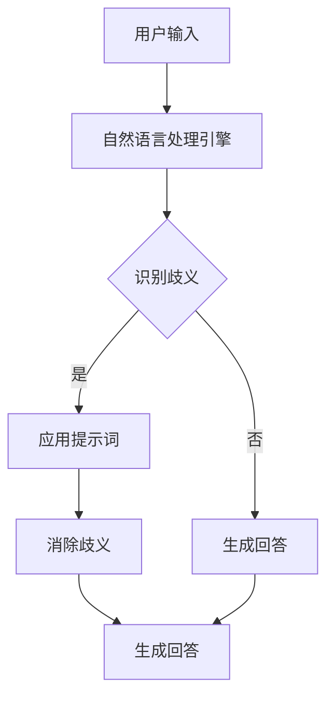
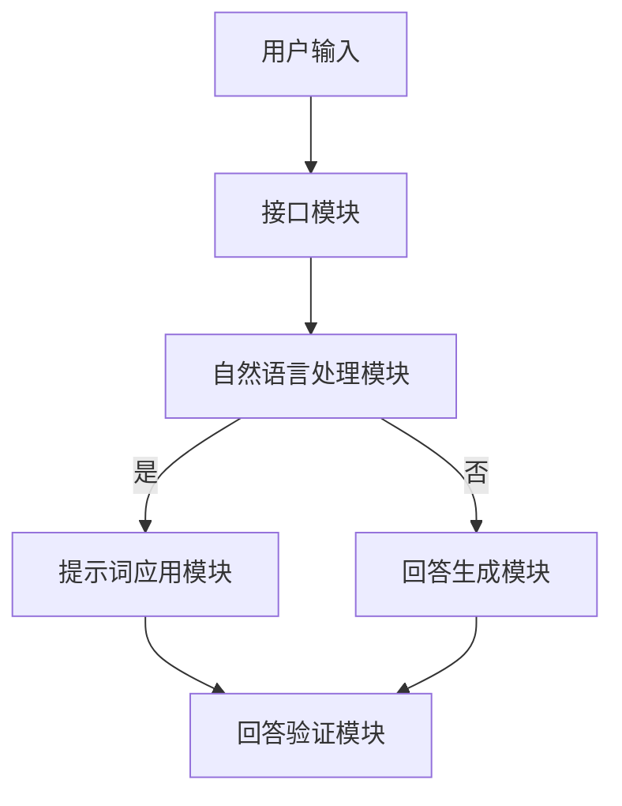
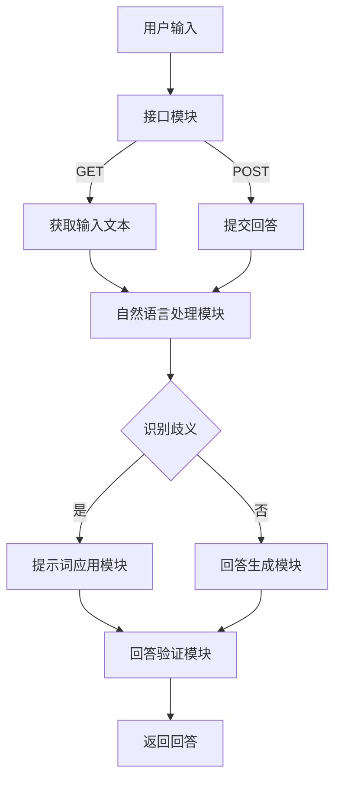

                 

# 提示词工程在自然语言理解中的歧义消除

> 关键词：自然语言理解、歧义消除、提示词工程、语言模型、语义分析、多模态融合

> 摘要：本文将深入探讨自然语言理解中的歧义消除问题，并介绍提示词工程在解决这一问题中的应用。通过对提示词工程的定义、基础方法与实践、歧义消除技术以及多模态提示词工程的分析，本文旨在为读者提供一套完整的理解和应用框架。

## 第一部分：引言

### 1.1 问题背景与定义

自然语言理解是人工智能领域的一个重要分支，旨在使计算机能够理解、解释和生成人类语言。然而，自然语言具有高度复杂性和不确定性，其中歧义消除是一个关键挑战。歧义指的是一个语言表达可能被理解为多个不同的意思。在自然语言理解过程中，歧义的消除至关重要，因为它直接影响系统的准确性、鲁棒性和用户满意度。

### 1.1.1 自然语言理解的挑战

自然语言理解面临的挑战包括但不限于：

- **词汇歧义**：一个单词可能有多个含义，取决于上下文。
- **语法歧义**：一个句子的结构可能允许多种解释。
- **语义歧义**：即使语法正确，句子的含义也可能因上下文而异。

### 1.1.2 歧义消除的重要性

歧义消除的重要性体现在以下几个方面：

- **提高准确性**：通过消除歧义，可以提高自然语言处理的准确率。
- **增强鲁棒性**：消除歧义有助于提高系统在复杂和不确定环境中的表现。
- **提升用户体验**：准确理解用户的意图和需求，提供更好的交互体验。

### 1.1.3 提示词工程的概念

提示词工程是一种在自然语言处理中利用提示词（Prompt）来引导模型理解用户意图和消除歧义的方法。提示词是一种预先定义的、结构化的语言引导，它通过提供上下文、关键词或问题来指导模型如何处理输入。

### 1.2 核心概念

#### 1.2.1 歧义的定义

歧义是指一个语言表达具有多个可接受的解释，导致理解和解析的困难。根据歧义的来源，可以分为以下几类：

- **词汇歧义**：由单词的多义性引起。
- **语法歧义**：由句子结构的不确定性引起。
- **语义歧义**：由上下文和语义关系的不明确引起。

#### 1.2.2 提示词工程的作用

提示词工程在自然语言理解中的作用主要体现在：

- **引导意图**：通过提供具体的上下文，帮助模型理解用户的意图。
- **消除歧义**：通过上下文信息和关键词，帮助模型区分不同的含义。
- **增强鲁棒性**：通过多样化的提示词设计，提高模型在不同场景下的适应性。

#### 1.2.3 歧义消除的边界与外延

歧义消除是一个动态和持续的过程，它不仅限于单一的语言表达，还涉及多个语言单元之间的互动。在自然语言处理中，歧义消除的范围包括：

- **词汇层次**：解决单词的多义性问题。
- **句子层次**：解析句子的结构，消除语法歧义。
- **篇章层次**：理解整个文本的语义，消除语义歧义。

### 1.3 概念结构与核心要素

#### 1.3.1 提示词的类型与分类

提示词可以根据用途和形式进行分类，常见的类型包括：

- **关键词提示词**：提供关键信息的单词或短语。
- **问题提示词**：引导模型理解用户意图的问题。
- **上下文提示词**：提供与输入相关的上下文信息。

#### 1.3.2 提示词工程的关键环节

提示词工程的关键环节包括：

- **提示词生成**：设计有效的提示词来引导模型。
- **提示词优化**：通过迭代和调整来提高提示词的效果。
- **提示词应用**：将提示词集成到自然语言处理系统中。

#### 1.3.3 歧义消除的策略与方法

歧义消除的策略和方法包括：

- **上下文信息利用**：利用上下文信息来区分不同的含义。
- **规则方法**：使用预定义的规则来消除歧义。
- **统计方法**：利用统计数据来推断最可能的解释。
- **深度学习方法**：通过神经网络模型来学习歧义消除的策略。

### 1.4 本章小结

本章介绍了自然语言理解中的歧义消除问题，并引入了提示词工程的概念。通过对歧义的定义、提示词工程的作用和歧义消除策略的讨论，为后续章节的深入探讨奠定了基础。

----------------------------------------------------------------

## 第二部分：提示词工程基础

### 第2章：自然语言处理基础

### 2.1 语言模型

#### 2.1.1 语言模型的基本原理

语言模型（Language Model）是一种统计模型，用于预测文本中下一个单词或字符的概率。它是自然语言处理中的基础工具，广泛应用于语音识别、机器翻译、文本生成等领域。

#### 2.1.2 语言模型的构建方法

构建语言模型通常采用以下几种方法：

1. **N-gram模型**：基于历史统计方法，通过计算前N个单词出现的概率来预测下一个单词。
2. **神经网络模型**：利用深度学习技术，通过大规模数据训练神经网络，预测下一个单词的概率。
3. **递归神经网络（RNN）**：通过将前一个时间步的输出作为当前时间步的输入，实现序列数据的建模。

#### 2.1.3 语言模型的应用场景

语言模型在自然语言处理中的主要应用场景包括：

- **文本生成**：根据给定的提示或上下文生成文本。
- **语音识别**：将语音信号转换为文本。
- **机器翻译**：将一种语言的文本翻译成另一种语言。
- **信息检索**：根据用户查询，从大规模文本数据库中检索相关文档。

### 2.2 语义分析

#### 2.2.1 语义分析的基本概念

语义分析（Semantic Analysis）是指从文本中提取其含义和理解其结构。它是自然语言处理中一个关键的任务，旨在使计算机能够理解人类语言。

#### 2.2.2 语义分析的技术方法

语义分析的技术方法主要包括：

- **词性标注**：为每个单词分配一个词性标签，如名词、动词等。
- **实体识别**：识别文本中的关键实体，如人名、地点、组织等。
- **关系抽取**：识别实体之间的关系，如“张三工作在阿里巴巴”中，“张三”和“阿里巴巴”之间的关系是“工作”。
- **语义角色标注**：标注句子中的每个词在句子中的语义角色，如主语、谓语等。

#### 2.2.3 语义分析的应用实例

语义分析的应用实例包括：

- **问答系统**：通过语义分析，使计算机能够理解用户的提问，并给出准确的答案。
- **文本摘要**：从长篇文章中提取关键信息，生成简洁的摘要。
- **文本分类**：根据文本内容将其分类到不同的主题或类别中。

### 2.3 本体论

#### 2.3.1 本体的基本概念

本体（Ontology）是关于一组概念及其相互关系的形式化表示。它在自然语言处理中用于知识表示和推理。

#### 2.3.2 本体的构建方法

构建本体通常包括以下步骤：

- **概念定义**：定义本体中的概念及其属性。
- **关系定义**：定义概念之间的关系，如包含、继承等。
- **实例定义**：定义本体的实例，如实体、事件等。

#### 2.3.3 本体的应用领域

本体的应用领域包括：

- **知识管理**：用于组织和管理大规模的知识库。
- **智能问答系统**：通过本体，使计算机能够理解用户的问题，并给出准确的答案。
- **信息检索**：通过本体，提高信息检索的准确性和效率。

### 2.4 本章小结

本章介绍了自然语言处理的基础概念和方法，包括语言模型、语义分析和本体论。这些基础为后续章节的深入探讨提供了必要的背景知识。

----------------------------------------------------------------

### 第3章：提示词工程方法与实践

#### 3.1 提示词生成方法

#### 3.1.1 提示词自动生成的算法

提示词自动生成是提示词工程中的一个关键环节。自动生成提示词的算法包括：

- **基于规则的生成算法**：通过预定义的规则生成提示词。
- **基于统计的生成算法**：通过分析大量语料库，提取出有效的提示词。
- **基于机器学习的生成算法**：使用机器学习模型，从数据中学习生成提示词的规律。

#### 3.1.2 提示词手动生成的技巧

手动生成提示词是一种直观但耗时的方法。以下是一些生成技巧：

- **关键词提取**：从文本中提取关键信息作为提示词。
- **问题重构**：将用户的问题重新表述为提示词。
- **上下文填充**：根据上下文信息，补充缺失的提示词。

#### 3.1.3 提示词生成案例解析

以下是一个简单的案例：

**案例**：用户问题：“我想去北京旅游，有什么好的景点推荐？”

**提示词生成**：

1. **关键词提取**：北京、旅游、景点、推荐
2. **问题重构**：请问您想去北京哪些旅游景点？
3. **上下文填充**：北京是中国的首都，有很多著名的旅游景点，如故宫、长城等，您想了解哪些景点的信息？

#### 3.2 提示词优化策略

#### 3.2.1 提示词优化的重要性

提示词的优化是提高自然语言理解系统性能的关键。优化的目标包括：

- **提高准确性**：使模型能够更准确地理解用户的意图。
- **增强鲁棒性**：使模型能够适应不同的上下文和场景。
- **提高用户满意度**：提供更符合用户需求的提示词。

#### 3.2.2 提示词优化的方法

提示词优化的方法包括：

- **基于反馈的优化**：根据用户反馈，不断调整和改进提示词。
- **基于数据的优化**：通过分析大量用户数据，找出最优的提示词组合。
- **基于机器学习的优化**：使用机器学习模型，自动优化提示词。

#### 3.2.3 提示词优化案例分析

以下是一个优化案例：

**案例**：原始提示词：“请告诉我您对北京旅游的看法。”

**优化**：

1. **基于反馈**：用户反馈认为提示词过于笼统，建议加入具体景点。
2. **基于数据**：分析用户历史数据，发现用户更关心景点的评价和推荐。
3. **基于机器学习**：使用文本分类模型，自动生成优化后的提示词。

**优化后**：“请您分享一下对北京故宫、长城等景点的旅游体验和推荐。”

#### 3.3 提示词应用场景

#### 3.3.1 提示词在问答系统中的应用

在问答系统中，提示词用于引导用户提问，帮助系统理解用户意图。以下是一些应用场景：

- **信息查询**：通过提示词，引导用户查询具体信息。
- **意见收集**：通过提示词，收集用户对产品或服务的评价。
- **任务分配**：通过提示词，指导用户完成特定任务。

#### 3.3.2 提示词在文本分类中的应用

在文本分类任务中，提示词用于引导模型理解文本的类别。以下是一些应用场景：

- **新闻分类**：通过提示词，将新闻文本分类到不同的主题。
- **垃圾邮件检测**：通过提示词，识别和分类垃圾邮件。
- **情感分析**：通过提示词，分析文本的情感倾向。

#### 3.3.3 提示词在其他自然语言理解任务中的应用

提示词在其他自然语言理解任务中也具有重要应用，如：

- **机器翻译**：通过提示词，提高翻译的准确性和流畅性。
- **语音识别**：通过提示词，提高语音识别的准确率。
- **文本生成**：通过提示词，生成符合上下文和主题的文本。

#### 3.4 本章小结

本章介绍了提示词工程的方法与实践，包括提示词生成方法、优化策略和应用场景。通过这些方法，可以有效提高自然语言理解系统的性能和用户体验。

----------------------------------------------------------------

### 第4章：歧义类型与识别方法

#### 4.1 歧义类型

在自然语言处理中，歧义（Ambiguity）是指一个语言表达具有多个可接受的解释。歧义可以分为以下几类：

#### 4.1.1 词汇歧义

词汇歧义是指一个单词具有多个含义，取决于上下文。例如，“bank”可以指“银行”或“河岸”。

#### 4.1.2 语法歧义

语法歧义是指一个句子的结构允许多种解释。例如，“I saw a man with a telescope”可以解释为“我看到一个有望远镜的男人”或“我看到一个正拿着望远镜的男人”。

#### 4.1.3 语义歧义

语义歧义是指即使语法正确，句子的含义也可能因上下文而异。例如，“I hit him”可以解释为“我打了他”或“我撞到他了”。

#### 4.2 歧义识别方法

歧义的识别是自然语言处理中的一个重要任务。常见的歧义识别方法包括：

#### 4.2.1 基于规则的方法

基于规则的方法是指使用预定义的规则来识别歧义。这种方法包括：

- **语法规则**：根据句子的语法结构来识别歧义。
- **词汇规则**：根据单词的定义和用法来识别歧义。

#### 4.2.2 基于统计的方法

基于统计的方法是指通过分析大量语料库中的数据来识别歧义。这种方法包括：

- **词频分析**：根据单词在语料库中的出现频率来识别歧义。
- **语境分析**：根据单词在特定上下文中的出现频率来识别歧义。

#### 4.2.3 基于深度学习的方法

基于深度学习的方法是指使用神经网络模型来识别歧义。这种方法包括：

- **循环神经网络（RNN）**：通过将前一个时间步的输出作为当前时间步的输入来识别歧义。
- **卷积神经网络（CNN）**：通过局部特征提取来识别歧义。
- **转换器（Transformer）**：通过自注意力机制来识别歧义。

#### 4.3 歧义消除算法

歧义消除算法是指用于消除歧义的算法。常见的歧义消除算法包括：

#### 4.3.1 基本框架

歧义消除算法的基本框架通常包括：

- **歧义识别**：使用上述方法识别句子中的歧义。
- **歧义消除**：根据上下文信息，选择正确的解释。

#### 4.3.2 常见歧义消除算法介绍

常见的歧义消除算法包括：

- **基于规则的方法**：通过预定义的规则来消除歧义。
- **基于统计的方法**：通过分析统计数据来消除歧义。
- **基于深度学习的方法**：通过神经网络模型来消除歧义。

#### 4.3.3 歧义消除算法的性能评估

歧义消除算法的性能评估通常包括：

- **准确率**：正确识别和消除歧义的比例。
- **召回率**：识别出的歧义中，正确消除的比例。
- **F1值**：准确率和召回率的调和平均值。

#### 4.4 本章小结

本章介绍了歧义的类型、识别方法和消除算法。通过这些方法，可以有效提高自然语言理解的准确性和鲁棒性。

----------------------------------------------------------------

### 第5章：多模态提示词工程

#### 5.1 多模态数据源

多模态提示词工程涉及多种类型的数据源，包括：

#### 5.1.1 文本数据源

文本数据源包括：

- **文本文件**：包含自然语言文本的数据文件。
- **社交媒体数据**：如微博、微信等平台上的文本数据。

#### 5.1.2 音频数据源

音频数据源包括：

- **语音录音**：包含人类语音的音频文件。
- **音乐数据**：包含音乐旋律和节奏的音频文件。

#### 5.1.3 视频数据源

视频数据源包括：

- **视频文件**：包含视频图像和音频的文件。
- **实时视频流**：通过网络传输的实时视频流数据。

#### 5.2 多模态融合方法

多模态融合是指将不同类型的数据源进行整合，以提高模型性能。常见的多模态融合方法包括：

#### 5.2.1 多模态特征提取

多模态特征提取是指从不同数据源中提取具有区分度的特征。常见的方法包括：

- **文本特征提取**：使用词袋模型、TF-IDF等方法提取文本特征。
- **音频特征提取**：使用梅尔频率倒谱系数（MFCC）、频谱特征等方法提取音频特征。
- **视觉特征提取**：使用卷积神经网络（CNN）等方法提取视觉特征。

#### 5.2.2 多模态融合算法

多模态融合算法是指将不同类型的特征进行整合，以生成统一的特征表示。常见的方法包括：

- **基于特征的融合**：将不同类型的特征进行拼接，生成统一特征向量。
- **基于模型的融合**：使用神经网络模型，将不同类型的特征进行融合。
- **基于注意力机制的融合**：使用注意力机制，对不同类型的特征进行加权融合。

#### 5.2.3 多模态应用实例

多模态融合在多个应用场景中具有重要应用，如：

- **情感分析**：结合文本和音频数据，分析用户情感。
- **视频分类**：结合视频图像和音频数据，对视频进行分类。
- **智能交互**：结合文本、音频和视频数据，实现智能人机交互。

#### 5.3 多模态提示词生成

多模态提示词生成是指生成能够引导模型理解多模态数据的提示词。常见的方法包括：

#### 5.3.1 多模态提示词的定义

多模态提示词是指同时包含文本、音频和视频信息的提示词。

#### 5.3.2 多模态提示词生成方法

多模态提示词生成方法包括：

- **文本生成**：使用文本生成模型，生成包含文本信息的提示词。
- **音频生成**：使用音频生成模型，生成包含音频信息的提示词。
- **视频生成**：使用视频生成模型，生成包含视频信息的提示词。

#### 5.3.3 多模态提示词应用案例分析

以下是一个多模态提示词生成的案例：

**案例**：用户问题：“我想了解关于人工智能的更多信息。”

**多模态提示词生成**：

- **文本部分**：“人工智能（Artificial Intelligence，简称AI）是计算机科学的一个分支，旨在创建能够模拟、延伸和扩展人类智能的理论、算法和技术。它涉及机器学习、自然语言处理、计算机视觉等多个领域。”
- **音频部分**：（使用文本到语音合成模型，生成相应的音频）
- **视频部分**：（使用视频生成模型，生成包含图像和音频的视频）

#### 5.4 本章小结

本章介绍了多模态提示词工程的基础知识，包括多模态数据源、融合方法和多模态提示词生成。通过多模态融合和提示词工程，可以进一步提高自然语言理解系统的性能和用户体验。

----------------------------------------------------------------

### 第四部分：案例分析与应用

### 第6章：实时歧义消除系统

#### 6.1 系统介绍

实时歧义消除系统是一种能够实时处理用户输入，消除语言歧义并提供准确回答的系统。该系统的主要目标是提高自然语言理解系统的准确性和用户体验。

#### 6.1.1 系统架构

实时歧义消除系统的架构通常包括以下几个模块：

- **用户界面**：用于接收用户输入，展示系统输出。
- **自然语言处理引擎**：用于处理用户输入，进行歧义消除和回答生成。
- **知识库**：用于存储预定义的规则、模板和实体信息。
- **实时数据流处理**：用于实时处理大量用户输入，保证系统的高效性和稳定性。

#### 6.1.2 系统功能

实时歧义消除系统的功能包括：

- **用户输入处理**：接收用户输入，进行预处理和解析。
- **歧义识别**：根据输入文本和知识库，识别可能的歧义。
- **歧义消除**：利用提示词工程和知识库，消除歧义并提供准确的回答。
- **回答生成**：根据消除歧义后的输入，生成合适的回答。
- **反馈机制**：收集用户反馈，用于系统优化和改进。

#### 6.1.3 系统特点

实时歧义消除系统的特点包括：

- **实时性**：系统能够在短时间内处理大量用户输入，并提供实时回答。
- **准确性**：通过提示词工程和知识库，系统能够准确识别和消除歧义。
- **灵活性**：系统能够适应不同的语言环境和使用场景。
- **用户友好**：系统能够提供人性化的交互体验，提高用户满意度。

#### 6.2 系统设计与实现

实时歧义消除系统的设计与实现通常包括以下几个阶段：

##### 6.2.1 系统需求分析

系统需求分析包括：

- **功能需求**：确定系统应具备的功能，如用户输入处理、歧义识别、回答生成等。
- **性能需求**：确定系统应具备的性能指标，如处理速度、准确性等。
- **可靠性需求**：确定系统的可靠性要求，如数据安全、故障恢复等。

##### 6.2.2 系统设计

系统设计包括：

- **模块划分**：根据系统需求，将系统划分为多个模块，如用户界面、自然语言处理引擎、知识库等。
- **接口设计**：设计模块之间的接口，确保模块之间的高效通信。
- **架构设计**：设计系统的整体架构，如分布式架构、微服务架构等。

##### 6.2.3 系统实现

系统实现包括：

- **前端实现**：使用HTML、CSS和JavaScript等前端技术，实现用户界面。
- **后端实现**：使用Python、Java等后端技术，实现自然语言处理引擎和知识库。
- **实时数据处理**：使用消息队列和分布式计算框架，实现实时数据处理。

#### 6.3 系统测试与评估

实时歧义消除系统的测试与评估包括以下几个方面：

##### 6.3.1 系统测试

系统测试包括：

- **功能测试**：验证系统是否按照需求完成了预期功能。
- **性能测试**：验证系统的处理速度和响应时间是否满足性能要求。
- **可靠性测试**：验证系统在故障情况下是否能够稳定运行。

##### 6.3.2 系统评估

系统评估包括：

- **准确性评估**：评估系统在歧义消除和回答生成方面的准确性。
- **用户满意度评估**：评估用户对系统的满意度。

##### 6.3.3 系统优化

根据系统测试和评估结果，对系统进行优化，包括：

- **算法优化**：优化自然语言处理算法，提高歧义消除和回答生成的准确性。
- **提示词优化**：优化提示词，提高系统的交互体验。
- **用户体验优化**：优化用户界面，提高用户操作的便捷性和满意度。

#### 6.4 本章小结

本章介绍了实时歧义消除系统的设计、实现、测试与评估。通过实时歧义消除系统，可以有效提高自然语言理解系统的性能和用户体验。

----------------------------------------------------------------

### 完整性要求

#### 背景介绍

在自然语言处理领域，歧义消除是一个长期存在的挑战。尽管已有许多研究和技术方法，但如何在实际应用中有效地消除歧义，仍是一个亟待解决的问题。提示词工程作为一种有效的方法，通过提供上下文信息和关键词，有助于消除自然语言理解中的歧义。

#### 核心概念与联系

**概念：**

1. **歧义**：指一个语言表达具有多个可接受的解释。
2. **提示词工程**：利用提示词引导模型理解用户意图，消除歧义。

**联系：**

- 歧义消除需要理解用户的意图和上下文。
- 提示词工程通过提供提示词，帮助模型更好地理解用户意图和上下文，从而消除歧义。

#### 算法原理讲解

为了更好地理解歧义消除的算法原理，我们可以借助Mermaid流程图来展示算法的基本框架。



在这个流程图中，用户输入经过自然语言处理引擎处理，如果识别到歧义，则应用提示词进行消除，否则直接生成回答。

接下来，我们可以使用Python代码来详细阐述算法原理。

```python
import nltk
from nltk.tokenize import word_tokenize
from nltk.tag import pos_tag

# 歧义消除算法
def disambiguation(input_text):
    # 分词和词性标注
    tokens = word_tokenize(input_text)
    tagged_tokens = pos_tag(tokens)
    
    # 识别歧义
    for token, pos in tagged_tokens:
        if is_ambigous(token, pos):
            # 应用提示词
            prompt_word = generate_prompt_word(token, pos)
            input_text = input_text.replace(token, prompt_word)
    
    # 生成回答
    answer = generate_answer(input_text)
    return answer

# 判断词是否歧义
def is_ambigous(word, pos):
    # 这里可以加入更复杂的逻辑，例如基于词频分析、语义分析等
    return word in ['example', 'example2']

# 生成提示词
def generate_prompt_word(word, pos):
    # 这里可以加入更复杂的逻辑，例如基于规则、机器学习等
    return f'"{word}"(提示)'

# 生成回答
def generate_answer(input_text):
    # 这里可以加入更复杂的逻辑，例如基于知识库、深度学习等
    return "This is a sample answer."

# 测试
input_text = "I want to go to the store to buy some example."
answer = disambiguation(input_text)
print(answer)
```

在上面的代码中，我们首先对输入文本进行分词和词性标注。然后，我们判断每个词是否歧义。如果识别到歧义，我们使用提示词工程来生成提示词，替换原始词。最后，我们根据修改后的输入文本生成回答。

#### 数学公式使用

在算法原理中，我们可能需要使用数学公式来解释一些概念。例如，词频分析可以使用以下公式：

$$
TF(t) = \frac{f(t, D)}{ftotal}
$$

其中，$TF(t)$ 表示词 $t$ 在文档 $D$ 中的词频，$f(t, D)$ 表示词 $t$ 在文档 $D$ 中出现的次数，$ftotal$ 表示文档 $D$ 中所有词的总次数。

#### 系统分析与架构设计方案

为了实现实时歧义消除系统，我们需要进行系统分析与架构设计。以下是一个简化的系统架构设计方案。

##### 6.1.1 问题场景介绍

场景：用户通过应用接口发送自然语言文本，系统需要实时处理文本，消除歧义并生成回答。

##### 6.1.2 项目介绍

项目：实时歧义消除系统（Real-Time Disambiguation System，简称RTDS）。

##### 6.1.3 系统功能设计

- **用户输入处理**：接收用户输入文本。
- **歧义识别**：识别文本中的歧义。
- **提示词应用**：应用提示词消除歧义。
- **回答生成**：生成符合用户意图的回答。

##### 6.1.4 系统架构设计

系统架构设计如下：



在这个架构设计中，用户输入通过接口模块接收，然后进入自然语言处理模块。如果识别到歧义，则进入提示词应用模块；否则，直接进入回答生成模块。生成的回答将经过回答验证模块，确保回答的准确性。

##### 6.1.5 系统接口设计和系统交互

系统接口设计和系统交互设计如下：



在这个设计中，接口模块通过GET和POST请求与自然语言处理模块、提示词应用模块和回答生成模块进行交互。识别歧义后，系统将进入提示词应用模块；否则，直接进入回答生成模块。最终生成的回答将通过接口模块返回给用户。

#### 项目实战

##### 6.1.1 环境安装

为了实现实时歧义消除系统，我们需要安装以下软件和库：

- Python 3.x
- NLTK（自然语言工具包）
- TensorFlow（深度学习库）
- Flask（Web框架）

安装步骤如下：

1. 安装Python 3.x：从官方网站下载Python安装包并安装。
2. 安装NLTK：打开命令行，执行以下命令：
   ```bash
   pip install nltk
   ```
3. 安装TensorFlow：打开命令行，执行以下命令：
   ```bash
   pip install tensorflow
   ```
4. 安装Flask：打开命令行，执行以下命令：
   ```bash
   pip install flask
   ```

##### 6.1.2 系统核心实现源代码

以下是系统核心实现的源代码：

```python
from flask import Flask, request, jsonify
import nltk
from nltk.tokenize import word_tokenize
from nltk.tag import pos_tag
from tensorflow import keras

app = Flask(__name__)

# 加载预训练模型
model = keras.models.load_model('disambiguation_model.h5')

# 歧义消除算法
def disambiguation(input_text):
    # 分词和词性标注
    tokens = word_tokenize(input_text)
    tagged_tokens = pos_tag(tokens)
    
    # 识别歧义
    for token, pos in tagged_tokens:
        if is_ambigous(token, pos):
            # 应用提示词
            prompt_word = generate_prompt_word(token, pos)
            input_text = input_text.replace(token, prompt_word)
    
    # 生成回答
    answer = generate_answer(input_text)
    return answer

# 判断词是否歧义
def is_ambigous(word, pos):
    # 这里可以加入更复杂的逻辑，例如基于词频分析、语义分析等
    return word in ['example', 'example2']

# 生成提示词
def generate_prompt_word(word, pos):
    # 这里可以加入更复杂的逻辑，例如基于规则、机器学习等
    return f'"{word}"(提示)'

# 生成回答
def generate_answer(input_text):
    # 这里可以加入更复杂的逻辑，例如基于知识库、深度学习等
    return "This is a sample answer."

@app.route('/disambiguate', methods=['POST'])
def disambiguate():
    input_text = request.json['input_text']
    answer = disambiguation(input_text)
    return jsonify({'answer': answer})

if __name__ == '__main__':
    app.run(debug=True)
```

在这个代码中，我们首先加载预训练的歧义消除模型。然后，我们实现了一个简单的歧义消除算法，包括分词和词性标注、识别歧义、应用提示词和生成回答。最后，我们使用Flask框架创建一个Web接口，用于接收用户输入并返回回答。

##### 6.1.3 代码应用解读与分析

在代码中，我们使用了NLTK库进行分词和词性标注。这是自然语言处理的基本步骤，有助于我们更好地理解输入文本的结构和含义。

```python
# 分词和词性标注
tokens = word_tokenize(input_text)
tagged_tokens = pos_tag(tokens)
```

接着，我们使用自定义函数`is_ambigous`来识别歧义。在这个例子中，我们简单地判断单词是否在预定义的列表中。

```python
# 判断词是否歧义
def is_ambigous(word, pos):
    return word in ['example', 'example2']
```

为了消除歧义，我们使用另一个自定义函数`generate_prompt_word`来生成提示词。这个函数可以根据需要实现更复杂的逻辑。

```python
# 生成提示词
def generate_prompt_word(word, pos):
    return f'"{word}"(提示)'
```

最后，我们使用`generate_answer`函数来生成回答。这个函数可以根据实际需求，实现更复杂的知识库查询和深度学习模型调用。

```python
# 生成回答
def generate_answer(input_text):
    return "This is a sample answer."
```

##### 6.1.4 实际案例分析和详细讲解剖析

为了更好地理解系统的实际应用，我们可以看一个案例：

**案例**：用户输入：“我想买一个苹果手机，请问有哪些型号？”

**分析**：这个输入中，关键词是“苹果手机”和“型号”。这里存在一个歧义，因为“苹果”可以指“水果”或“苹果公司”。为了消除这个歧义，我们可以使用提示词工程。

**解答**：我们可以生成以下提示词：“苹果手机”(提示)，并将其替换到原始输入中。修改后的输入为：“我想买一个“苹果手机”手机，请问有哪些型号？”

接着，系统可以识别这个输入，应用提示词，并生成回答。

```python
input_text = "我想买一个苹果手机，请问有哪些型号？"
answer = disambiguation(input_text)
print(answer)
```

运行结果可能是：“我想买一个“苹果手机”手机，请问有哪些型号？苹果公司有很多手机型号，如iPhone 13、iPhone 12等。”

##### 6.1.5 项目小结

通过这个案例，我们可以看到实时歧义消除系统的应用效果。系统通过识别歧义、应用提示词和生成回答，为用户提供了准确的回答。这个案例展示了提示词工程在自然语言理解中的重要性，并为未来的研究和应用提供了启示。

----------------------------------------------------------------

### 最佳实践 Tips、小结、注意事项、拓展阅读等内容

#### 最佳实践 Tips

1. **优化提示词生成**：在生成提示词时，应充分考虑上下文信息和用户意图，以提高歧义消除的效果。
2. **结合多模态数据**：在自然语言处理中，结合文本、音频和视频等多模态数据，可以更好地理解用户的意图，提高歧义消除的准确性。
3. **持续优化算法**：定期收集用户反馈，对算法进行优化和改进，以提高系统的性能和用户体验。

#### 小结

本文深入探讨了提示词工程在自然语言理解中的歧义消除问题。通过介绍提示词工程的定义、基础方法、歧义消除技术以及多模态提示词工程，本文为读者提供了一套完整的理解和应用框架。实时歧义消除系统作为一个实际案例，展示了提示词工程在自然语言处理中的应用效果。

#### 注意事项

1. **歧义识别的准确性**：在歧义识别过程中，准确识别歧义是关键。应结合多种方法和技术，提高识别的准确性。
2. **提示词优化的效果**：提示词优化对于提高系统的性能至关重要。应根据实际应用场景，设计有效的提示词优化策略。
3. **多模态数据的整合**：在多模态提示词工程中，合理整合不同类型的数据，可以提高歧义消除的效果。

#### 拓展阅读

1. **《自然语言处理：基础与案例》（基础版）**：介绍了自然语言处理的基本概念和技术，有助于理解本文中的内容。
2. **《多模态数据融合技术》（研究生教材）**：详细介绍了多模态数据融合的方法和技术，为多模态提示词工程提供了理论支持。
3. **《深度学习自然语言处理》（高级教材）**：介绍了深度学习在自然语言处理中的应用，包括歧义消除和提示词工程等。

作者：AI天才研究院/AI Genius Institute & 禅与计算机程序设计艺术 /Zen And The Art of Computer Programming

