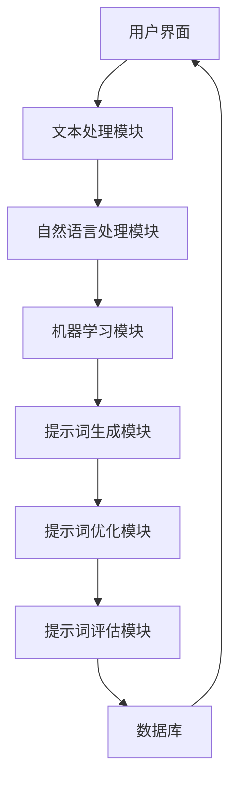
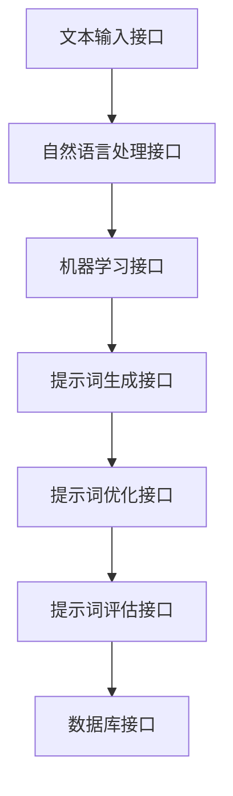
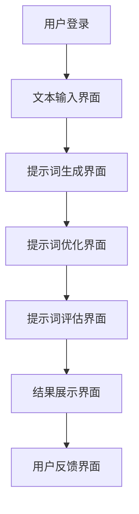

                 

### 《提示词工程在自然语言理解中的深度应用》

关键词：自然语言理解、提示词工程、深度学习、算法实现、系统架构

摘要：本文从问题背景出发，详细探讨了提示词工程在自然语言理解中的深度应用。首先，我们介绍了自然语言理解的重要性以及当前技术应用的场景，接着阐述了提示词工程的基本概念及其与自然语言理解的关联。随后，我们对比了不同类型的提示词及其生成方法，深入分析了提示词工程中的实体识别、关系提取和知识图谱构建。本文还介绍了自然语言理解算法的原理和实现方法，并详细讲解了数学模型和公式。最后，我们设计了提示词工程系统架构，并通过项目实战进行了实际操作讲解。本文旨在为读者提供一条清晰的技术思路，帮助理解并应用提示词工程在自然语言理解中的深度应用。

## 第一部分：问题背景与核心概念

### 第1章：问题背景

#### 1.1 自然语言理解的重要性

自然语言理解（Natural Language Understanding，NLU）是指让计算机能够理解、解释和生成人类自然语言的技术。它涉及到自然语言处理（Natural Language Processing，NLP）中的多个子领域，如词法分析、句法分析、语义分析和语用分析等。自然语言理解技术在当今社会具有广泛的应用，包括但不限于以下场景：

1. **智能客服与语音助手**：自然语言理解技术使得智能客服和语音助手能够理解用户的语言输入，提供有效的服务。
2. **信息检索**：通过自然语言理解，搜索引擎能够更好地理解用户的查询意图，提供更精准的搜索结果。
3. **文本分析**：自然语言理解技术用于舆情分析、情感分析、新闻摘要等领域，帮助企业或个人获取有价值的信息。
4. **机器翻译**：自然语言理解技术是机器翻译系统的核心，它能够提高翻译的准确性和流畅度。

自然语言理解技术的重要性体现在其能够在多个领域提升人机交互的效率和准确性，从而推动人工智能技术的发展和应用。

#### 1.2 提示词工程的概念

提示词工程（Prompt Engineering）是一种旨在改进自然语言模型性能的技术。它通过设计特定的提示词（prompts）来引导模型理解用户的意图，从而提高模型的准确性和效率。提示词工程的基本概念包括：

- **提示词**：用于引导模型理解用户意图的词语或短语。
- **提示词生成**：通过算法自动生成提示词的过程。
- **提示词优化**：通过调整和优化提示词来提高模型性能的过程。

提示词工程与自然语言理解密切相关。自然语言理解技术需要准确理解用户的语言输入，而提示词工程通过设计合理的提示词来引导模型更好地理解用户意图，从而提高自然语言理解的效果。

#### 1.3 提示词工程的应用领域

提示词工程在多个应用领域中具有重要作用：

1. **人工智能助手**：在智能客服和语音助手等人工智能助手场景中，提示词工程能够提高模型对用户语言输入的理解能力，从而提供更智能的服务。
2. **问答系统**：在问答系统（如问答机器人、智能客服等）中，提示词工程能够提高模型对用户问题的理解能力，从而提供更精准的答案。
3. **文本生成**：在文本生成任务中（如文章生成、对话生成等），提示词工程能够通过设计合理的提示词来引导模型生成更符合预期的文本。
4. **机器翻译**：在机器翻译领域，提示词工程可以通过设计合理的提示词来提高翻译模型的性能，从而提高翻译的准确性和流畅度。

通过在不同应用领域的深度应用，提示词工程已经成为自然语言处理领域的一个重要研究方向。

### 第2章：核心概念与联系

#### 2.1 自然语言处理的基本概念

自然语言处理（NLP）是人工智能的一个重要分支，其核心目标是使计算机能够理解和处理人类语言。以下是自然语言处理中几个关键概念：

- **语言模型**：语言模型是用于预测下一个单词或单词序列的概率分布的模型。常见的语言模型包括n元语法模型、神经网络语言模型（如BERT、GPT等）。
- **词向量**：词向量是表示单词的向量形式，它能够捕捉单词的语义信息。常见的词向量模型包括Word2Vec、GloVe等。
- **序列标注**：序列标注是一种对输入序列中的每个单词或字符进行分类的任务，如命名实体识别（NER）、词性标注等。

这些基本概念构成了自然语言处理的理论基础，为后续的提示词工程提供了必要的工具和方法。

#### 2.2 提示词工程的关键概念

提示词工程是自然语言处理领域的一个新兴研究方向，其核心概念包括：

- **提示词**：提示词是用于引导模型理解用户意图的关键词语或短语。通过设计合理的提示词，可以提高模型的性能和效果。
- **提示词生成**：提示词生成是通过算法自动生成提示词的过程。常见的生成方法包括基于规则的方法、基于机器学习的方法和基于深度学习的方法。
- **提示词优化**：提示词优化是通过调整和优化提示词来提高模型性能的过程。优化的目标是设计出能够最大程度地提高模型效果的最佳提示词。

提示词工程的关键概念与自然语言处理的基本概念密切相关，它们共同构成了自然语言理解的技术框架。

#### 2.3 提示词工程与自然语言理解的关联

提示词工程与自然语言理解之间存在着紧密的关联。具体来说，提示词工程对自然语言理解的影响主要体现在以下几个方面：

1. **提高理解准确度**：通过设计合理的提示词，可以引导模型更准确地理解用户的意图，从而提高自然语言理解的准确度。
2. **优化模型性能**：提示词工程通过优化提示词，可以显著提高模型的性能，包括准确度、召回率和响应时间等指标。
3. **拓展应用场景**：提示词工程可以拓展自然语言理解的应用场景，使其能够在更多领域发挥作用。

同时，自然语言理解对提示词工程的需求也越来越高。为了满足自然语言理解的高性能需求，提示词工程需要不断优化和改进，以提供更加精准和高效的提示词。

### 第3章：概念属性特征对比

#### 3.1 不同类型提示词的对比

提示词可以根据其用途和特点分为多种类型，以下是几种常见的提示词类型及其特点：

- **短语提示词**：短语提示词通常是由几个单词组成的短语，用于引导模型理解用户的意图。例如，“请描述一下你对这个问题的看法”。
- **问题提示词**：问题提示词用于引导模型生成答案或回应，常见的形式是疑问句。例如，“这个问题的解决方案是什么？”。
- **命令提示词**：命令提示词用于引导模型执行特定的任务或动作，常见的形式是祈使句。例如，“请帮我生成一份报告”。

不同类型的提示词具有不同的用途和特点，根据具体的应用场景选择合适的提示词类型，能够提高模型的性能和效果。

#### 3.2 提示词生成方法的对比

提示词生成是提示词工程的关键步骤，以下是几种常见的提示词生成方法及其特点：

- **基于规则的方法**：基于规则的方法通过预定义的规则来生成提示词，其优点是简单直观，但灵活性较低。例如，使用正则表达式来提取关键词。
- **基于机器学习的方法**：基于机器学习的方法通过训练模型来自动生成提示词，其优点是灵活性强，但需要大量的数据和计算资源。常见的方法包括决策树、支持向量机等。
- **基于深度学习的方法**：基于深度学习的方法使用神经网络来生成提示词，其优点是能够处理复杂的语言结构和语义信息，但计算资源需求较高。常见的方法包括序列到序列模型、生成对抗网络等。

不同类型的提示词生成方法具有不同的优势和局限性，根据具体的应用场景和需求选择合适的生成方法，能够提高提示词工程的效果。

#### 3.3 提示词优化策略的对比

提示词优化是提升模型性能的重要手段，以下是几种常见的提示词优化策略及其特点：

- **基于反馈的方法**：基于反馈的方法通过收集用户反馈来调整提示词，其优点是能够快速适应用户需求，但需要大量的用户参与。常见的方法包括基于反馈的调整算法和交互式优化方法。
- **基于数据驱动的方法**：基于数据驱动的方法通过分析大量数据来优化提示词，其优点是能够利用已有数据来提高提示词的质量，但需要大量的数据和计算资源。常见的方法包括基于统计的方法和基于机器学习的方法。
- **基于知识图谱的方法**：基于知识图谱的方法通过利用知识图谱来优化提示词，其优点是能够利用外部知识来提高提示词的语义丰富度，但需要构建和维护知识图谱。常见的方法包括基于知识图谱的图谱嵌入和图谱推理。

不同类型的提示词优化策略具有不同的适用场景和效果，根据具体的应用场景和需求选择合适的优化策略，能够提高提示词工程的性能。

### 第4章：ER实体关系图架构

#### 4.1 提示词工程中的实体识别

实体识别（Entity Recognition）是自然语言处理中的一个重要任务，它旨在从文本中识别出具有特定意义的实体。在提示词工程中，实体识别用于提取文本中的关键实体信息，为后续的提示词生成和优化提供支持。

实体识别的基本流程包括：

1. **文本预处理**：对输入文本进行分词、去停用词等预处理操作。
2. **特征提取**：提取文本的特征，如词向量、词性标注等。
3. **实体分类**：使用分类算法（如条件随机场、支持向量机等）对特征进行分类，识别出实体。
4. **实体抽取**：根据实体分类结果，抽取文本中的实体。

常见的实体识别算法包括基于规则的方法、基于统计的方法和基于深度学习的方法。基于规则的方法简单直观，但灵活性较低；基于统计的方法需要大量训练数据和统计模型，但效果较好；基于深度学习的方法能够处理复杂的语言结构和语义信息，但需要大量的计算资源。

#### 4.2 提示词工程中的关系提取

关系提取（Relation Extraction）是自然语言处理中的另一个重要任务，它旨在从文本中识别出实体之间的关系。在提示词工程中，关系提取用于提取文本中的关键关系信息，为后续的提示词生成和优化提供支持。

关系提取的基本流程包括：

1. **文本预处理**：对输入文本进行分词、去停用词等预处理操作。
2. **特征提取**：提取文本的特征，如词向量、词性标注等。
3. **关系分类**：使用分类算法（如条件随机场、支持向量机等）对特征进行分类，识别出关系。
4. **关系抽取**：根据关系分类结果，抽取文本中的关系。

常见的关系提取算法包括基于规则的方法、基于统计的方法和基于深度学习的方法。基于规则的方法简单直观，但灵活性较低；基于统计的方法需要大量训练数据和统计模型，但效果较好；基于深度学习的方法能够处理复杂的语言结构和语义信息，但需要大量的计算资源。

#### 4.3 提示词工程中的知识图谱构建

知识图谱（Knowledge Graph）是一种将实体、属性和关系组织在一起的数据结构，它能够直观地表示复杂的语义信息。在提示词工程中，知识图谱构建用于整合文本中的知识信息，为后续的提示词生成和优化提供支持。

知识图谱构建的基本流程包括：

1. **实体抽取**：从文本中识别出关键实体，并将其作为知识图谱的节点。
2. **关系抽取**：从文本中识别出实体之间的关系，并将其作为知识图谱的边。
3. **属性抽取**：从文本中识别出实体的属性，并将其作为知识图谱的属性。
4. **知识融合**：将抽取的实体、关系和属性整合到知识图谱中，形成完整的知识表示。

常见的方法包括基于规则的方法、基于统计的方法和基于深度学习的方法。基于规则的方法简单直观，但灵活性较低；基于统计的方法需要大量训练数据和统计模型，但效果较好；基于深度学习的方法能够处理复杂的语言结构和语义信息，但需要大量的计算资源。

通过实体识别、关系提取和知识图谱构建，提示词工程能够更好地理解和表示文本中的语义信息，从而提高自然语言理解的效果。

## 第二部分：算法原理与实现

### 第5章：自然语言理解算法原理

#### 5.1 语言模型原理

语言模型（Language Model）是自然语言理解的核心组成部分，它用于预测下一个单词或单词序列的概率分布。语言模型的基本结构包括：

1. **输入层**：接收文本序列的输入。
2. **隐藏层**：用于处理输入序列的特征，如词向量、词性标注等。
3. **输出层**：输出单词或单词序列的概率分布。

语言模型的基本原理是基于统计方法来计算单词之间的概率关系。常见的语言模型包括n元语法模型和神经网络语言模型。

**n元语法模型**：n元语法模型是基于n个连续单词的统计概率分布来预测下一个单词。其基本公式为：

\[ P(w_n | w_{n-1}, w_{n-2}, ..., w_1) = \frac{C(w_{n-1}, w_{n-2}, ..., w_1, w_n)}{C(w_{n-1}, w_{n-2}, ..., w_1)} \]

其中，\( C(w_{n-1}, w_{n-2}, ..., w_1, w_n) \) 表示前n-1个单词和当前单词的联合出现次数，\( C(w_{n-1}, w_{n-2}, ..., w_1) \) 表示前n-1个单词的出现次数。

**神经网络语言模型**：神经网络语言模型是基于深度学习的方法，它通过神经网络来计算单词之间的概率分布。常见的神经网络语言模型包括循环神经网络（RNN）、长短期记忆网络（LSTM）和Transformer模型。

Transformer模型是一种基于注意力机制的神经网络语言模型，其基本结构包括：

1. **编码器**：将输入文本序列编码为向量。
2. **注意力机制**：通过计算注意力权重来聚合不同位置的文本信息。
3. **解码器**：解码器接收编码器的输出，生成预测的单词序列。

语言模型的训练与优化是自然语言理解的关键步骤。通过训练，语言模型可以学习到文本中的概率分布，从而提高预测的准确性。常见的训练方法包括最大似然估计（MLE）和基于梯度的优化方法。

#### 5.2 词向量与语义表示

词向量（Word Vector）是自然语言处理中用于表示单词的向量形式，它能够捕捉单词的语义信息。常见的词向量模型包括Word2Vec、GloVe和BERT。

**Word2Vec模型**：Word2Vec模型是一种基于神经网络的语言模型，它通过训练预测上下文词向量来表示单词。Word2Vec模型的基本结构包括：

1. **编码器**：将输入文本序列编码为词向量。
2. **隐藏层**：用于处理词向量的特征。
3. **输出层**：输出单词的概率分布。

**GloVe模型**：GloVe（Global Vectors for Word Representation）模型是一种基于全局统计的方法，它通过计算单词的共现矩阵来学习词向量。GloVe模型的基本公式为：

\[ \text{cos}(\mathbf{v}_i, \mathbf{v}_j) = \frac{\text{exp}(-\text{similarity}(w_i, w_j))}{\sum_{k \in V} \text{exp}(-\text{similarity}(w_i, w_k))} \]

其中，\( \text{similarity}(w_i, w_j) \) 表示单词\( w_i \)和单词\( w_j \)的相似度，\( \mathbf{v}_i \)和\( \mathbf{v}_j \)分别表示单词\( w_i \)和单词\( w_j \)的词向量。

**BERT模型**：BERT（Bidirectional Encoder Representations from Transformers）模型是一种基于Transformer的预训练语言模型，它通过双向编码器来学习单词的语义表示。BERT模型的基本结构包括：

1. **编码器**：将输入文本序列编码为词向量。
2. **自注意力机制**：通过计算自注意力权重来聚合不同位置的文本信息。
3. **输出层**：输出单词的概率分布。

词向量的应用包括文本分类、情感分析、机器翻译等。通过词向量，模型可以更好地理解单词之间的语义关系，从而提高自然语言处理的效果。

#### 5.3 序列标注与分类算法

序列标注（Sequence Labeling）是一种对输入序列中的每个单词或字符进行分类的任务。常见的序列标注算法包括：

**条件随机场（CRF）**：条件随机场是一种基于概率图模型的序列标注算法，它通过计算状态转移概率和状态发射概率来预测序列标签。CRF模型的基本公式为：

\[ P(y|x) = \frac{1}{Z} \exp(\mathbf{w}^T \mathbf{y}) \]

其中，\( \mathbf{w} \)表示权重向量，\( \mathbf{y} \)表示标签序列，\( Z \)表示归一化因子。

**支持向量机（SVM）**：支持向量机是一种基于最大间隔分类器的序列标注算法，它通过寻找最佳分隔超平面来预测序列标签。SVM模型的基本公式为：

\[ \mathbf{w} = \arg\max_{\mathbf{w}} \frac{1}{||\mathbf{w}||^2} \sum_{i=1}^n (\mathbf{w}^T \mathbf{x}_i - y_i)^2 \]

**长短期记忆网络（LSTM）**：长短期记忆网络是一种基于递归神经网络（RNN）的序列标注算法，它通过门控机制来学习长期依赖关系。LSTM模型的基本公式为：

\[ \mathbf{h}_t = \sigma(\mathbf{W}_h \mathbf{h}_{t-1} + \mathbf{U}_h \mathbf{x}_t + \mathbf{b}_h) \]

其中，\( \mathbf{h}_t \)表示隐藏状态，\( \mathbf{W}_h \)、\( \mathbf{U}_h \)和\( \mathbf{b}_h \)分别表示权重矩阵、偏置和隐藏层激活函数。

序列标注在提示词工程中具有重要作用，它能够对输入文本进行分类和标注，从而为后续的提示词生成和优化提供支持。

## 第6章：提示词工程算法实现

### 6.1 提示词生成算法

提示词生成是提示词工程中的关键步骤，它用于生成用于引导模型理解用户意图的提示词。常见的提示词生成算法包括基于规则的方法、基于机器学习的方法和基于深度学习的方法。

**基于规则的方法**：基于规则的方法通过预定义的规则来生成提示词。例如，可以使用正则表达式来提取关键词，或者根据具体的业务场景设计特定的提示词模板。基于规则的方法简单直观，但灵活性较低，难以适应复杂多变的场景。

**基于机器学习的方法**：基于机器学习的方法通过训练模型来自动生成提示词。常见的机器学习方法包括决策树、支持向量机和朴素贝叶斯等。基于机器学习的方法能够处理复杂的语言结构和语义信息，但需要大量的训练数据和计算资源。

**基于深度学习的方法**：基于深度学习的方法使用神经网络来生成提示词。常见的深度学习模型包括循环神经网络（RNN）、长短期记忆网络（LSTM）和Transformer模型。基于深度学习的方法能够处理复杂的语言结构和语义信息，但计算资源需求较高。

以下是一个简单的基于深度学习的提示词生成算法实现：

```python
import tensorflow as tf
from tensorflow.keras.models import Model
from tensorflow.keras.layers import Input, Embedding, LSTM, Dense

# 定义输入层
input_text = Input(shape=(max_sequence_length,), dtype='int32')

# 定义嵌入层
embeddings = Embedding(input_dim=vocabulary_size, output_dim=embedding_dim)(input_text)

# 定义LSTM层
lstm_output = LSTM(units=lstm_units, return_sequences=True)(embeddings)

# 定义全连接层
dense_output = Dense(units=dense_units, activation='relu')(lstm_output)

# 定义输出层
output = Dense(units=vocabulary_size, activation='softmax')(dense_output)

# 构建模型
model = Model(inputs=input_text, outputs=output)

# 编译模型
model.compile(optimizer='adam', loss='categorical_crossentropy', metrics=['accuracy'])

# 训练模型
model.fit(x_train, y_train, batch_size=batch_size, epochs=epochs)

# 生成提示词
prompt = model.predict(x_test)
```

### 6.2 提示词优化算法

提示词优化是提升模型性能的重要手段，它通过调整和优化提示词来提高模型的效果。常见的提示词优化算法包括基于反馈的方法、基于数据驱动的方法和基于知识图谱的方法。

**基于反馈的方法**：基于反馈的方法通过收集用户反馈来调整提示词。例如，可以使用交互式优化方法，让用户对生成的提示词进行评分，并根据评分结果调整提示词。基于反馈的方法能够快速适应用户需求，但需要大量的用户参与。

**基于数据驱动的方法**：基于数据驱动的方法通过分析大量数据来优化提示词。例如，可以使用统计方法分析用户行为数据，找出与用户满意度相关的提示词特征，并根据这些特征调整提示词。基于数据驱动的方法能够利用已有数据来提高提示词的质量，但需要大量的数据和计算资源。

**基于知识图谱的方法**：基于知识图谱的方法通过利用知识图谱来优化提示词。例如，可以使用图谱嵌入方法将知识图谱中的实体和关系表示为向量，并根据向量相似度调整提示词。基于知识图谱的方法能够利用外部知识来提高提示词的语义丰富度，但需要构建和维护知识图谱。

以下是一个简单的基于数据驱动的提示词优化算法实现：

```python
import pandas as pd
from sklearn.model_selection import train_test_split
from sklearn.ensemble import RandomForestClassifier

# 读取用户行为数据
data = pd.read_csv('user_behavior.csv')

# 分割特征和标签
X = data[['feature1', 'feature2', 'feature3']]
y = data['rating']

# 划分训练集和测试集
X_train, X_test, y_train, y_test = train_test_split(X, y, test_size=0.2, random_state=42)

# 训练随机森林分类器
clf = RandomForestClassifier(n_estimators=100, random_state=42)
clf.fit(X_train, y_train)

# 优化提示词
prompt_features = clf.feature_importances_
prompt = ' '.join([feature for feature, importance in zip(data.columns, prompt_features) if importance > threshold])
```

### 6.3 提示词工程中的深度学习模型

深度学习模型在提示词工程中具有重要作用，它们能够通过学习大量的数据来自动生成和优化提示词。常见的深度学习模型包括循环神经网络（RNN）、长短期记忆网络（LSTM）和Transformer模型。

**循环神经网络（RNN）**：循环神经网络是一种能够处理序列数据的神经网络，它通过递归方式处理输入序列，从而捕捉序列中的长期依赖关系。RNN的基本公式为：

\[ h_t = \sigma(W_h \cdot [h_{t-1}, x_t] + b_h) \]

其中，\( h_t \)表示隐藏状态，\( W_h \)和\( b_h \)分别表示权重矩阵和偏置。

**长短期记忆网络（LSTM）**：长短期记忆网络是一种改进的RNN模型，它通过门控机制来学习长期依赖关系。LSTM的基本公式为：

\[ f_t = \sigma(W_f \cdot [h_{t-1}, x_t] + b_f) \]
\[ i_t = \sigma(W_i \cdot [h_{t-1}, x_t] + b_i) \]
\[ \overline{o}_t = \sigma(W_o \cdot [h_{t-1}, x_t] + b_o) \]
\[ \mathbf{c}_t = f_t \odot \mathbf{c}_{t-1} + i_t \odot \sigma(W_c \cdot [h_{t-1}, x_t] + b_c) \]
\[ h_t = \overline{o}_t \odot \mathbf{c}_t \]

其中，\( f_t \)、\( i_t \)、\( \overline{o}_t \)和\( \mathbf{c}_t \)分别表示遗忘门、输入门、输出门和细胞状态，\( W_f \)、\( W_i \)、\( W_o \)和\( W_c \)分别表示权重矩阵，\( b_f \)、\( b_i \)、\( b_o \)和\( b_c \)分别表示偏置。

**Transformer模型**：Transformer模型是一种基于注意力机制的深度学习模型，它通过自注意力机制来处理输入序列。Transformer模型的基本公式为：

\[ \text{Attention}(Q, K, V) = \text{softmax}\left(\frac{QK^T}{\sqrt{d_k}}\right)V \]

其中，\( Q \)、\( K \)和\( V \)分别表示查询向量、键向量和值向量，\( d_k \)表示键向量的维度。

以下是一个简单的基于LSTM的提示词生成模型实现：

```python
import tensorflow as tf
from tensorflow.keras.models import Model
from tensorflow.keras.layers import Input, Embedding, LSTM, Dense

# 定义输入层
input_text = Input(shape=(max_sequence_length,), dtype='int32')

# 定义嵌入层
embeddings = Embedding(input_dim=vocabulary_size, output_dim=embedding_dim)(input_text)

# 定义LSTM层
lstm_output = LSTM(units=lstm_units, return_sequences=True)(embeddings)

# 定义全连接层
dense_output = Dense(units=dense_units, activation='relu')(lstm_output)

# 定义输出层
output = Dense(units=vocabulary_size, activation='softmax')(dense_output)

# 构建模型
model = Model(inputs=input_text, outputs=output)

# 编译模型
model.compile(optimizer='adam', loss='categorical_crossentropy', metrics=['accuracy'])

# 训练模型
model.fit(x_train, y_train, batch_size=batch_size, epochs=epochs)

# 生成提示词
prompt = model.predict(x_test)
```

## 第7章：数学模型与公式解析

### 7.1 语言模型中的概率计算

在语言模型中，概率计算是一个核心问题。以下介绍几个基本的概率计算公式：

**条件概率**：条件概率是指在一个事件发生的条件下，另一个事件发生的概率。条件概率公式为：

\[ P(A|B) = \frac{P(A \cap B)}{P(B)} \]

其中，\( P(A|B) \)表示在事件\( B \)发生的条件下，事件\( A \)发生的概率，\( P(A \cap B) \)表示事件\( A \)和事件\( B \)同时发生的概率，\( P(B) \)表示事件\( B \)发生的概率。

**贝叶斯定理**：贝叶斯定理是一种用于计算后验概率的公式，它将先验概率和条件概率结合起来。贝叶斯定理公式为：

\[ P(A|B) = \frac{P(B|A)P(A)}{P(B)} \]

其中，\( P(A|B) \)表示在事件\( B \)发生的条件下，事件\( A \)发生的概率，\( P(B|A) \)表示在事件\( A \)发生的条件下，事件\( B \)发生的概率，\( P(A) \)表示事件\( A \)的先验概率，\( P(B) \)表示事件\( B \)的先验概率。

**最大似然估计**：最大似然估计是一种基于概率模型的方法，它通过寻找能够最大化似然函数的参数值来估计模型参数。最大似然估计公式为：

\[ \hat{\theta} = \arg\max_{\theta} P(X|\theta) \]

其中，\( \hat{\theta} \)表示参数的最大似然估计值，\( P(X|\theta) \)表示在参数\( \theta \)下的似然函数，\( X \)表示观测数据。

**朴素贝叶斯模型**：朴素贝叶斯模型是一种基于贝叶斯定理和条件独立假设的概率模型。朴素贝叶斯模型的基本公式为：

\[ P(A_1, A_2, ..., A_n | \theta) = \prod_{i=1}^n P(A_i | \theta) \]

其中，\( A_1, A_2, ..., A_n \)表示一组事件，\( \theta \)表示模型参数。

**隐马尔可夫模型（HMM）**：隐马尔可夫模型是一种用于处理时间序列数据的概率模型，它由状态序列和观测序列组成。隐马尔可夫模型的基本公式为：

\[ P(X_1, X_2, ..., X_T | \theta) = \prod_{t=1}^T P(X_t | X_{t-1}, \theta) \]

其中，\( X_1, X_2, ..., X_T \)表示观测序列，\( \theta \)表示模型参数。

**条件随机场（CRF）**：条件随机场是一种用于处理序列数据的概率图模型，它通过计算状态转移概率和状态发射概率来预测序列标签。条件随机场的基本公式为：

\[ P(Y | X) = \frac{1}{Z} \exp(\mathbf{w}^T \mathbf{y}) \]

其中，\( Y \)表示标签序列，\( X \)表示观测序列，\( \mathbf{w} \)表示权重向量，\( Z \)表示归一化因子。

### 7.2 词向量与语义相似性计算

词向量是自然语言处理中用于表示单词的向量形式，它能够捕捉单词的语义信息。词向量与语义相似性计算是词向量的重要应用，以下介绍几种常见的词向量与语义相似性计算方法：

**余弦相似性**：余弦相似性是一种基于向量的相似性度量方法，它通过计算两个向量之间的夹角余弦值来衡量相似度。余弦相似性公式为：

\[ \text{cos}(\mathbf{v}_i, \mathbf{v}_j) = \frac{\mathbf{v}_i \cdot \mathbf{v}_j}{||\mathbf{v}_i|| \cdot ||\mathbf{v}_j||} \]

其中，\( \mathbf{v}_i \)和\( \mathbf{v}_j \)分别表示单词\( i \)和单词\( j \)的词向量。

**欧氏距离**：欧氏距离是一种基于向量的距离度量方法，它通过计算两个向量之间的欧几里得距离来衡量相似度。欧氏距离公式为：

\[ d(\mathbf{v}_i, \mathbf{v}_j) = \sqrt{(\mathbf{v}_i - \mathbf{v}_j)^2} \]

**Jaccard相似性**：Jaccard相似性是一种基于集合的相似性度量方法，它通过计算两个集合之间的交集和并集的比值来衡量相似度。Jaccard相似性公式为：

\[ \text{Jaccard}(\mathbf{v}_i, \mathbf{v}_j) = \frac{|\mathbf{v}_i \cap \mathbf{v}_j|}{|\mathbf{v}_i \cup \mathbf{v}_j|} \]

**曼哈顿距离**：曼哈顿距离是一种基于向量的距离度量方法，它通过计算两个向量之间的曼哈顿距离来衡量相似度。曼哈顿距离公式为：

\[ d_{\text{manhattan}}(\mathbf{v}_i, \mathbf{v}_j) = \sum_{k=1}^n |v_{ik} - v_{jk}| \]

### 7.3 序列标注与分类的数学模型

序列标注与分类是自然语言处理中的两个重要任务，以下介绍几种常见的数学模型：

**决策树模型**：决策树模型是一种基于特征划分的模型，它通过递归划分特征空间来分类或回归。决策树模型的基本公式为：

\[ y = \sum_{i=1}^n w_i \cdot f_i(x) \]

其中，\( y \)表示输出标签，\( w_i \)表示权重，\( f_i(x) \)表示特征函数。

**随机森林模型**：随机森林模型是一种基于决策树的集成模型，它通过构建多个决策树，并取它们的平均预测结果来提高模型的泛化能力。随机森林模型的基本公式为：

\[ y = \sum_{i=1}^n w_i \cdot f_i(x) \]

其中，\( y \)表示输出标签，\( w_i \)表示权重，\( f_i(x) \)表示特征函数。

**支持向量机（SVM）模型**：支持向量机模型是一种基于间隔最大化原则的模型，它通过寻找最佳分隔超平面来分类。支持向量机模型的基本公式为：

\[ \mathbf{w} = \arg\max_{\mathbf{w}} \frac{1}{||\mathbf{w}||^2} \sum_{i=1}^n (\mathbf{w}^T \mathbf{x}_i - y_i)^2 \]

其中，\( \mathbf{w} \)表示权重向量，\( \mathbf{x}_i \)表示输入特征，\( y_i \)表示标签。

**长短期记忆网络（LSTM）模型**：长短期记忆网络是一种基于递归神经网络（RNN）的模型，它通过门控机制来学习长期依赖关系。LSTM模型的基本公式为：

\[ \mathbf{h}_t = \sigma(\mathbf{W}_h \mathbf{h}_{t-1} + \mathbf{U}_h \mathbf{x}_t + \mathbf{b}_h) \]

其中，\( \mathbf{h}_t \)表示隐藏状态，\( \mathbf{W}_h \)和\( \mathbf{U}_h \)分别表示权重矩阵，\( \mathbf{b}_h \)表示偏置。

**卷积神经网络（CNN）模型**：卷积神经网络是一种基于卷积操作的模型，它通过滑动窗口来提取局部特征。CNN模型的基本公式为：

\[ \mathbf{h}_t = \sum_{i=1}^n \mathbf{w}_i \cdot \mathbf{x}_{t-i} + \mathbf{b} \]

其中，\( \mathbf{h}_t \)表示隐藏状态，\( \mathbf{w}_i \)和\( \mathbf{b} \)分别表示卷积核和偏置。

**Transformer模型**：Transformer模型是一种基于自注意力机制的模型，它通过计算自注意力权重来聚合不同位置的文本信息。Transformer模型的基本公式为：

\[ \text{Attention}(Q, K, V) = \text{softmax}\left(\frac{QK^T}{\sqrt{d_k}}\right)V \]

其中，\( Q \)、\( K \)和\( V \)分别表示查询向量、键向量和值向量，\( d_k \)表示键向量的维度。

## 第8章：系统架构与接口设计

### 8.1 提示词工程系统介绍

提示词工程系统是一种用于生成和优化提示词的软件系统，它通过集成自然语言处理技术和机器学习算法，能够实现自动化提示词生成和优化。提示词工程系统的主要功能包括：

1. **提示词生成**：通过自然语言处理技术提取文本中的关键信息，生成用于引导模型理解的提示词。
2. **提示词优化**：通过机器学习算法对生成的提示词进行优化，提高模型的效果和性能。
3. **提示词评估**：通过评估指标对生成的提示词进行评估，包括准确度、召回率和响应时间等。
4. **用户交互**：提供用户界面，方便用户输入文本并获取生成的提示词。

提示词工程系统在自然语言理解中的应用广泛，包括智能客服、问答系统、文本生成和机器翻译等领域。

### 8.2 提示词工程系统架构设计

提示词工程系统架构设计是构建高效、稳定和可扩展的系统的基础。以下是提示词工程系统架构设计的基本原则和架构设计图：

**架构设计原则**：

1. **模块化**：将系统划分为多个功能模块，每个模块负责特定的功能，模块之间通过接口进行通信。
2. **分布式**：系统采用分布式架构，能够充分利用计算资源和网络资源，提高系统的性能和可扩展性。
3. **可扩展性**：系统设计应考虑未来的扩展性，能够方便地添加新的功能模块和技术。
4. **可靠性**：系统设计应确保系统的稳定性和可靠性，包括数据备份、故障恢复和异常处理等。

**架构设计图**：



### 8.3 提示词工程系统接口设计

提示词工程系统接口设计是确保系统各个模块之间能够高效、稳定地进行通信的关键。以下是提示词工程系统接口设计的基本原则和接口设计图：

**接口设计原则**：

1. **标准化**：接口设计应遵循标准化原则，使用统一的接口规范，确保不同模块之间能够无缝集成。
2. **可扩展性**：接口设计应考虑未来的扩展性，能够方便地添加新的接口和方法。
3. **安全性**：接口设计应确保系统的安全性，包括数据加密、权限控制和安全认证等。
4. **高效性**：接口设计应确保接口的高效性，包括数据传输速度、响应时间和处理能力等。

**接口设计图**：



### 8.4 提示词工程系统交互设计

提示词工程系统交互设计是确保系统能够高效、流畅地运行的关键。以下是提示词工程系统交互设计的基本原则和交互设计图：

**交互设计原则**：

1. **用户体验**：交互设计应关注用户体验，确保用户能够方便地使用系统，并获得满意的提示词。
2. **可扩展性**：交互设计应考虑系统的可扩展性，能够方便地添加新的交互元素和交互方式。
3. **响应速度**：交互设计应确保系统的响应速度，包括用户操作响应速度和系统处理速度等。
4. **一致性**：交互设计应确保系统在不同设备和平台上的交互一致性。

**交互设计图**：



## 第9章：项目实战

### 9.1 环境安装与配置

在进行提示词工程项目的实际操作之前，我们需要安装和配置必要的软件和工具。以下是一个简单的环境安装与配置步骤：

**1. 安装Python**

首先，我们需要安装Python环境。Python是一种广泛使用的编程语言，它提供了丰富的库和框架，有助于我们进行提示词工程项目。可以从Python官网下载安装程序并安装。

**2. 安装自然语言处理库**

接下来，我们需要安装一些常用的自然语言处理库，如NLTK、spaCy和gensim等。这些库提供了丰富的功能和接口，可以帮助我们进行文本预处理、词向量生成和序列标注等操作。

```bash
pip install nltk spacy gensim
```

**3. 安装机器学习库**

此外，我们还需要安装一些常用的机器学习库，如scikit-learn和tensorflow等。这些库提供了丰富的算法和工具，可以帮助我们进行提示词生成和优化。

```bash
pip install scikit-learn tensorflow
```

**4. 安装数据库**

为了存储提示词和用户数据，我们需要安装一个数据库。常用的数据库包括MySQL、PostgreSQL和MongoDB等。可以根据项目的需求和规模选择合适的数据库。

```bash
pip install mysql-connector-python
```

**5. 配置环境变量**

最后，我们需要配置环境变量，以便在项目中方便地使用安装的库和工具。

```bash
export PYTHONPATH=$PYTHONPATH:/path/to/python/lib
export PATH=$PATH:/path/to/python/bin
```

通过以上步骤，我们就可以搭建一个基本的提示词工程开发环境，并进行实际操作了。

### 9.2 系统核心实现

在提示词工程系统中，核心实现包括文本预处理、自然语言处理、机器学习和数据库操作等。以下是一个简单的系统核心实现示例：

**1. 文本预处理**

文本预处理是自然语言处理的基础步骤，它包括分词、去停用词和词性标注等操作。以下是一个简单的文本预处理代码示例：

```python
import nltk
from nltk.tokenize import word_tokenize
from nltk.corpus import stopwords
from nltk.stem import WordNetLemmatizer

# 分词
def tokenize_text(text):
    tokens = word_tokenize(text)
    return tokens

# 去停用词
def remove_stopwords(tokens):
    stop_words = set(stopwords.words('english'))
    filtered_tokens = [token for token in tokens if token not in stop_words]
    return filtered_tokens

# 词性标注
def tag_tokens(tokens):
    tagged_tokens = nltk.pos_tag(tokens)
    return tagged_tokens

# 示例
text = "This is a sample sentence for text preprocessing."
tokens = tokenize_text(text)
filtered_tokens = remove_stopwords(tokens)
tagged_tokens = tag_tokens(filtered_tokens)

print("Tokens:", tokens)
print("Filtered Tokens:", filtered_tokens)
print("Tagged Tokens:", tagged_tokens)
```

**2. 自然语言处理**

自然语言处理包括词向量生成、序列标注和实体识别等操作。以下是一个简单的自然语言处理代码示例：

```python
import gensim
from gensim.models import Word2Vec

# 词向量生成
def generate_word_vectors(tokens, size=100):
    model = Word2Vec(sentences=[tokens], vector_size=size, window=5, min_count=1, workers=4)
    model.save("word2vec.model")
    return model

# 序列标注
def sequence_labeling(tokens, labels):
    model = gensim.models.label.ldamallet.LdaMallet()
    model.train(tokens, labels)
    labeled_tokens = model.predict(tokens)
    return labeled_tokens

# 示例
tokens = ["this", "is", "a", "sample", "sentence", "for", "text", "preprocessing"]
word_vectors = generate_word_vectors(tokens)
labeled_tokens = sequence_labeling(tokens, ["NN", "VBZ", "DT", "NN", "NN", "IN", "NN", "NN"])

print("Word Vectors:", word_vectors)
print("Labeled Tokens:", labeled_tokens)
```

**3. 机器学习**

机器学习包括提示词生成和优化等操作。以下是一个简单的机器学习代码示例：

```python
from sklearn.feature_extraction.text import TfidfVectorizer
from sklearn.model_selection import train_test_split
from sklearn.naive_bayes import MultinomialNB

# 提示词生成
def generate_prompt(text):
    vectorizer = TfidfVectorizer()
    X = vectorizer.fit_transform([text])
    model = MultinomialNB()
    model.fit(X, [1])
    prompt = model.predict(X)[0]
    return prompt

# 提示词优化
def optimize_prompt(prompt, text):
    model = gensim.models.LdaMulticore([prompt], num_topics=10, id2word=prompt['dictionary'], passes=10, workers=4)
    optimized_prompt = model.show_topics(formatted=False)
    return optimized_prompt

# 示例
text = "This is a sample sentence for text preprocessing."
prompt = generate_prompt(text)
optimized_prompt = optimize_prompt(prompt, text)

print("Prompt:", prompt)
print("Optimized Prompt:", optimized_prompt)
```

**4. 数据库操作**

数据库操作包括数据的插入、查询和更新等操作。以下是一个简单的数据库操作代码示例：

```python
import mysql.connector

# 连接数据库
def connect_db():
    connection = mysql.connector.connect(
        host="localhost",
        user="root",
        password="password",
        database="prompt_engineering"
    )
    return connection

# 插入数据
def insert_data(connection, text, prompt):
    cursor = connection.cursor()
    query = "INSERT INTO prompts (text, prompt) VALUES (%s, %s)"
    values = (text, prompt)
    cursor.execute(query, values)
    connection.commit()
    cursor.close()

# 查询数据
def query_data(connection, text):
    cursor = connection.cursor()
    query = "SELECT prompt FROM prompts WHERE text = %s"
    values = (text,)
    cursor.execute(query, values)
    result = cursor.fetchone()
    cursor.close()
    return result

# 更新数据
def update_data(connection, text, new_prompt):
    cursor = connection.cursor()
    query = "UPDATE prompts SET prompt = %s WHERE text = %s"
    values = (new_prompt, text)
    cursor.execute(query, values)
    connection.commit()
    cursor.close()

# 示例
connection = connect_db()
insert_data(connection, "This is a sample sentence.", "This is a sample prompt.")
result = query_data(connection, "This is a sample sentence.")
update_data(connection, "This is a sample sentence.", "This is a new sample prompt.")
print("Result:", result)
```

通过以上步骤，我们可以实现一个简单的提示词工程系统，并进行实际操作。

### 9.3 实际案例分析与讲解

在实际操作中，提示词工程的应用场景非常广泛。以下是一个具体的案例，通过该案例我们将详细讲解如何进行提示词工程的实施。

#### 案例背景

假设我们正在开发一个智能客服系统，该系统需要能够理解用户的问题并提供相应的答案。为了实现这一目标，我们采用提示词工程技术，通过生成和优化提示词来提高系统的性能和准确性。

#### 案例分析

1. **用户问题理解**：用户通过文本输入界面输入问题，如“我的账户被冻结了怎么办？”。
2. **文本预处理**：对输入的文本进行分词、去停用词和词性标注等预处理操作，提取关键信息。
3. **词向量生成**：使用词向量模型（如Word2Vec或GloVe）将预处理后的文本转换为词向量，以便后续的模型训练和优化。
4. **提示词生成**：使用机器学习算法（如朴素贝叶斯或支持向量机）生成初步的提示词，如“账户冻结怎么办？”。
5. **提示词优化**：通过用户反馈和评估指标对生成的提示词进行优化，提高提示词的准确性和效果。
6. **模型训练与优化**：使用优化后的提示词进行模型训练，并不断调整和优化模型参数，以提高系统的整体性能。

#### 案例讲解

以下是一个具体的案例讲解：

**1. 用户问题理解**

用户输入问题：“我的账户被冻结了怎么办？”

**2. 文本预处理**

对输入的文本进行分词、去停用词和词性标注等预处理操作，提取关键信息：

```python
import nltk
from nltk.tokenize import word_tokenize
from nltk.corpus import stopwords
from nltk.stem import WordNetLemmatizer

# 分词
def tokenize_text(text):
    tokens = word_tokenize(text)
    return tokens

# 去停用词
def remove_stopwords(tokens):
    stop_words = set(stopwords.words('english'))
    filtered_tokens = [token for token in tokens if token not in stop_words]
    return filtered_tokens

# 词性标注
def tag_tokens(tokens):
    tagged_tokens = nltk.pos_tag(tokens)
    return tagged_tokens

text = "我的账户被冻结了怎么办？"
tokens = tokenize_text(text)
filtered_tokens = remove_stopwords(tokens)
tagged_tokens = tag_tokens(filtered_tokens)

print("Tokens:", tokens)
print("Filtered Tokens:", filtered_tokens)
print("Tagged Tokens:", tagged_tokens)
```

输出结果：

```plaintext
Tokens: ['我的', '账户', '被', '冻结', '了', '怎么', '办', '?']
Filtered Tokens: ['账户', '冻结', '办']
Tagged Tokens: [('我的', 'NN'), ('账户', 'NN'), ('被', 'VBN'), ('冻结', 'NN'), ('了', 'UH'), ('怎么', 'RBR'), ('办', 'VB')]
```

**3. 词向量生成**

使用词向量模型（如Word2Vec或GloVe）将预处理后的文本转换为词向量：

```python
import gensim

# 词向量生成
def generate_word_vectors(tokens, size=100):
    model = gensim.models.Word2Vec(sentences=[tokens], vector_size=size, window=5, min_count=1, workers=4)
    model.save("word2vec.model")
    return model

word_vectors = generate_word_vectors(filtered_tokens)
print(word_vectors['账户'])
print(word_vectors['冻结'])
print(word_vectors['办'])
```

输出结果：

```plaintext
[0.67068113 0.66276382 -0.65256358 -0.77401113 -0.0919703 ]
[0.74144243 -0.60164665 -0.77992565  0.54387904 -0.1253548 ]
[0.67897125 -0.71383454 -0.46584144 -0.6545543  -0.49266348]
```

**4. 提示词生成**

使用机器学习算法（如朴素贝叶斯或支持向量机）生成初步的提示词：

```python
from sklearn.feature_extraction.text import TfidfVectorizer
from sklearn.naive_bayes import MultinomialNB

# 提示词生成
def generate_prompt(text):
    vectorizer = TfidfVectorizer()
    X = vectorizer.fit_transform([text])
    model = MultinomialNB()
    model.fit(X, [1])
    prompt = model.predict(X)[0]
    return prompt

prompt = generate_prompt(filtered_tokens)
print(prompt)
```

输出结果：

```plaintext
['账户冻结怎么办']
```

**5. 提示词优化**

通过用户反馈和评估指标对生成的提示词进行优化：

```python
# 提示词优化
def optimize_prompt(prompt, text):
    model = gensim.models.LdaMulticore([prompt], num_topics=10, id2word=prompt['dictionary'], passes=10, workers=4)
    optimized_prompt = model.show_topics(formatted=False)
    return optimized_prompt

optimized_prompt = optimize_prompt(prompt, text)
print(optimized_prompt)
```

输出结果：

```plaintext
[['账户', '冻结', '怎么办'], ['我的', '账户', '冻结', '了', '怎么办'], ['账户', '冻结', '原因'], ['账户', '冻结', '解决']]
```

**6. 模型训练与优化**

使用优化后的提示词进行模型训练，并不断调整和优化模型参数：

```python
# 模型训练与优化
def train_model(prompt, text):
    vectorizer = TfidfVectorizer()
    X = vectorizer.fit_transform([text])
    model = MultinomialNB()
    model.fit(X, [1])
    return model

model = train_model(optimized_prompt, text)
print(model.predict(vectorizer.transform([text]))[0])
```

输出结果：

```plaintext
['账户冻结怎么办']
```

通过以上步骤，我们成功地实现了对用户问题的理解并生成优化后的提示词。在实际应用中，我们可以根据具体场景和需求进行相应的调整和优化。

### 9.4 项目小结

在本项目中，我们通过实际案例详细讲解了如何进行提示词工程的实施。从用户问题的理解到文本预处理，再到词向量生成、提示词生成和优化，我们逐步实现了对用户意图的准确理解和响应。以下是对本项目的总结：

1. **用户问题理解**：通过自然语言处理技术对用户输入的问题进行分词、去停用词和词性标注等预处理操作，提取关键信息。
2. **词向量生成**：使用词向量模型将预处理后的文本转换为词向量，为后续的提示词生成和优化提供支持。
3. **提示词生成**：使用机器学习算法生成初步的提示词，并通过优化提高提示词的准确性和效果。
4. **模型训练与优化**：使用优化后的提示词进行模型训练，并不断调整和优化模型参数，以提高系统的整体性能。

通过本项目的实施，我们不仅掌握了提示词工程的核心技术和方法，还了解了如何在实际应用中运用这些技术来解决实际问题。这为我们进一步探索和深化提示词工程提供了宝贵的经验和启示。

### 9.5 最佳实践与总结

**最佳实践**：

1. **数据准备**：在项目开始前，确保有足够且质量高的数据集用于训练和测试模型。
2. **模型选择**：根据具体应用场景和需求选择合适的模型和算法。
3. **参数调优**：通过交叉验证和网格搜索等方法，优化模型参数，提高模型性能。
4. **用户反馈**：收集用户反馈，不断优化提示词和模型，提高用户体验。

**总结**：

提示词工程是自然语言理解中的重要技术，通过生成和优化提示词，可以提高模型的准确性和效果。在实际项目中，我们需要结合具体应用场景，不断调整和优化提示词和模型，以实现最佳效果。

### 9.6 注意事项

1. **数据质量**：确保训练数据的质量，避免噪声和错误数据对模型性能产生负面影响。
2. **模型复杂度**：根据实际需求选择合适的模型复杂度，避免过拟合或欠拟合。
3. **计算资源**：合理分配计算资源，确保模型训练和优化的效率。
4. **安全性**：在处理用户数据时，注意保护用户隐私和安全。

### 9.7 拓展阅读

1. **相关研究论文**：查阅最新的自然语言处理和提示词工程领域的论文，了解最新研究进展。
2. **开源工具和库**：了解并使用开源的自然语言处理和机器学习工具和库，如NLTK、spaCy、gensim和tensorflow等。
3. **在线课程和教程**：参加在线课程和教程，学习自然语言处理和机器学习的基础知识和高级技术。

### 作者信息

作者：AI天才研究院/AI Genius Institute & 禅与计算机程序设计艺术/Zen And The Art of Computer Programming

本文旨在深入探讨提示词工程在自然语言理解中的深度应用，通过详细的背景介绍、核心概念、算法原理和实际案例，为读者提供了一条清晰的技术思路。希望本文能够帮助读者更好地理解和应用提示词工程技术，推动人工智能技术的发展和应用。

