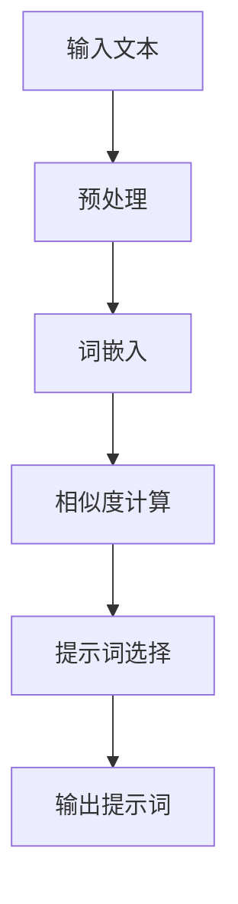
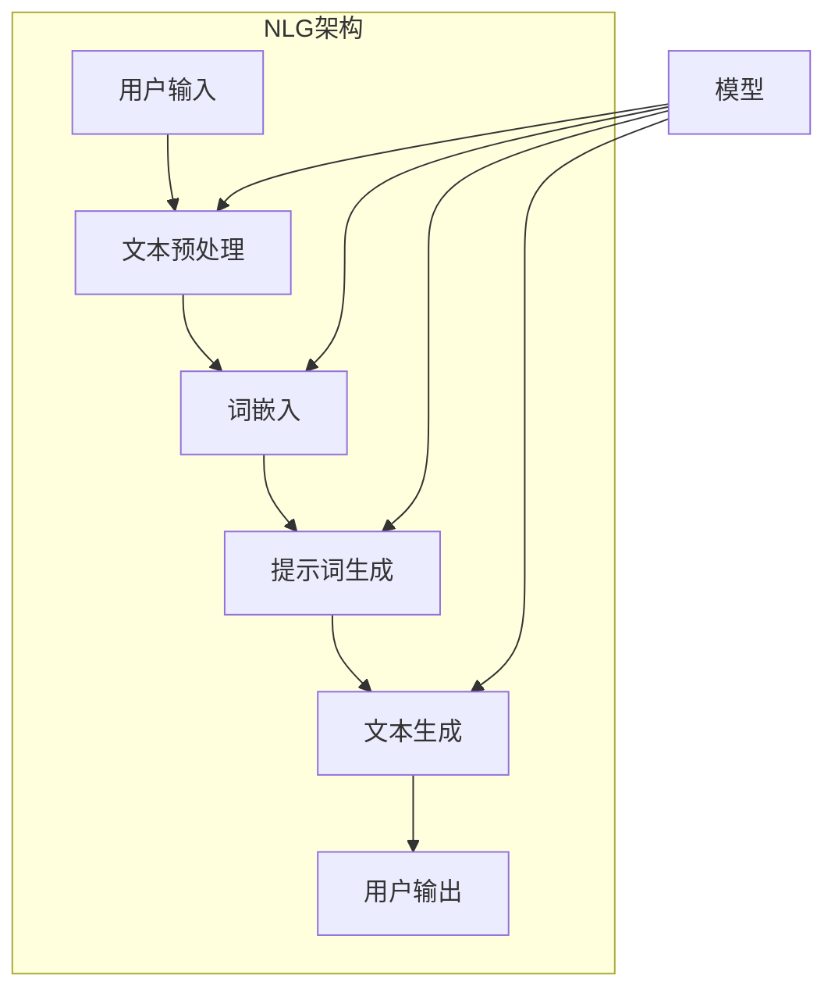
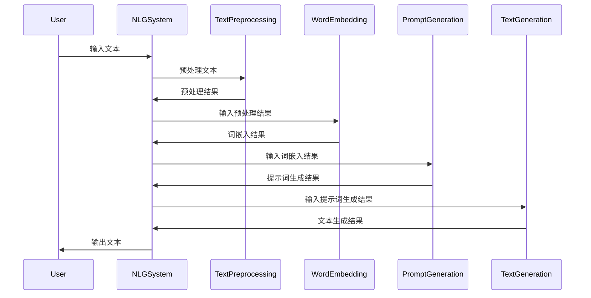

                 

## 第一部分：背景与概念介绍

### 1.1 自然语言生成的现状与挑战

自然语言生成（Natural Language Generation，NLG）是一种利用计算机程序自动生成自然语言文本的技术。NLG的应用范围广泛，从简单的信息摘要、自动报告生成，到复杂的对话系统、内容创作等。近年来，随着深度学习技术的发展，NLG系统在生成文本的质量和多样性方面都有了显著的提升。

当前，NLG系统主要面临以下几个挑战：

1. **文本质量的提升**：尽管深度学习模型在生成文本的流畅性和准确性方面有所进步，但仍然难以生成具有高度复杂性和多样性的文本。例如，如何在生成新闻文章时保持事实的准确性，如何在生成对话文本时保持一致性和连贯性。

2. **适应性和灵活性**：NLG系统需要能够适应不同的应用场景和用户需求，生成符合特定格式、风格和语义的文本。然而，目前的NLG系统大多依赖于预训练的模型，缺乏针对特定领域的自适应能力。

3. **跨语言与跨文化**：NLG系统需要支持多种语言和文化，生成符合目标语言和文化习惯的文本。这要求模型具备强大的语言理解和生成能力，以及跨语言的迁移学习能力。

4. **数据质量和标注**：NLG系统的训练和优化依赖于大量高质量的数据集。然而，获取和标注这些数据集既耗时又昂贵。此外，数据集的多样性不足也可能导致模型的泛化能力受限。

### 1.2 提示词工程的基本概念

提示词工程（Prompt Engineering）是一种优化自然语言生成系统的方法，旨在通过设计高质量的任务提示（prompt）来提高生成文本的质量和适应性。提示词工程的核心目标是使模型能够更好地理解任务要求，从而生成更准确、更有用的文本。

**提示词**是用户输入的简要描述，用于指导模型生成特定类型的文本。一个高质量的提示词通常应具备以下特点：

1. **精确性**：明确表达任务的目标和要求，避免歧义。
2. **完整性**：提供足够的信息，使模型能够生成完整、连贯的文本。
3. **可扩展性**：适用于不同规模和复杂度的任务，具有良好的适应性。

### 1.3 提示词工程的核心作用与意义

提示词工程在自然语言生成中具有以下几个核心作用和意义：

1. **提高生成文本的质量**：通过设计高质量的提示词，可以引导模型生成更准确、更符合用户需求的文本。这有助于减少文本生成中的错误和偏见。

2. **增强模型的适应性**：提示词工程使模型能够更好地适应不同的应用场景和任务需求，提高其在多样化场景下的表现。

3. **优化模型训练过程**：高质量的提示词有助于提高模型训练的效率，减少对大量数据进行手动标注的需求。

4. **促进跨领域应用**：通过设计领域特定的提示词，可以促进NLG系统在各个领域的应用，提高其在特定领域中的性能。

### 1.4 提示词工程的分类与演进

提示词工程可以分为以下几个类别：

1. **任务驱动型**：以任务目标为导向，设计具有明确指导意义的提示词。这类提示词通常用于生成特定类型的文本，如新闻报道、对话文本等。

2. **数据增强型**：通过设计多样化的提示词，丰富模型训练数据，提高模型的泛化能力。

3. **领域特定型**：针对特定领域（如医学、金融等）设计定制化的提示词，以提高模型在该领域的表现。

4. **自适应型**：根据用户反馈和任务动态调整提示词，实现模型与用户需求的实时匹配。

随着人工智能技术的不断演进，提示词工程也在不断发展和优化。未来的研究可能包括：

1. **多模态提示词**：结合文本、图像、声音等多种输入信息，设计更丰富、更全面的提示词。

2. **智能提示词生成**：利用机器学习和自然语言处理技术，自动生成高质量的提示词。

3. **提示词优化算法**：研究更高效的优化算法，提高提示词工程的效果和效率。

## 第二部分：算法原理与实现

### 3.1 提示词生成算法的基本原理

提示词生成算法是提示词工程的核心组成部分。其基本原理如下：

首先，模型接收一个输入文本，并对文本进行预处理，包括分词和词性标注。然后，模型将每个词转换为词嵌入向量，这些向量表示了词的语义信息。接着，模型使用神经网络（如循环神经网络RNN、Transformer等）计算输入文本中每个词与目标提示词之间的相似度。最终，模型选择相似度最高的词作为生成的提示词。

提示词生成算法的核心步骤可以概括为以下几步：

1. **预处理**：对输入文本进行分词和词性标注，提取文本中的关键信息。
2. **词嵌入**：将预处理后的文本转换为词嵌入向量，表示文本的语义信息。
3. **相似度计算**：计算输入文本中每个词与目标提示词的相似度。
4. **提示词选择**：选择相似度最高的词作为生成的提示词。

下面是提示词生成算法的mermaid流程图：



### 3.2 算法原理的数学模型和公式

提示词生成算法的数学模型基于概率论和神经网络。其核心公式如下：

$$
P(w|t) = \frac{e^{f(w, t)}}{\sum_{w' \in V} e^{f(w', t)}}
$$

其中，\( P(w|t) \) 是在给定上下文 \( t \) 下，单词 \( w \) 的概率；\( f(w, t) \) 是单词 \( w \) 和上下文 \( t \) 的特征函数。

特征函数 \( f(w, t) \) 通常是一个神经网络输出的值，它表示了单词 \( w \) 与上下文 \( t \) 之间的相似度。具体来说，特征函数可以计算为：

$$
f(w, t) = \text{NN}(w, t)
$$

其中，\( \text{NN}(w, t) \) 是一个神经网络，输入为单词 \( w \) 和上下文 \( t \)，输出为它们的相似度。

### 3.3 通俗易懂的举例说明

为了更好地理解提示词生成算法，我们可以通过一个简单的例子来说明其工作过程。

假设我们有以下的输入文本：

“今天天气很好，我们一起去公园散步吧。”

我们要生成的提示词是“公园”。

以下是提示词生成算法的步骤：

1. **预处理**：对输入文本进行分词和词性标注，提取文本中的关键信息。例如，分词结果为：["今天"，"天气"，"很好"，"一起"，"去"，"公园"，"散步"，"吧"]。

2. **词嵌入**：将预处理后的文本转换为词嵌入向量。这些向量表示了每个词的语义信息。例如，"公园"的词嵌入向量为 \(\textbf{v_p} = [0.1, 0.2, 0.3, 0.4]\)。

3. **相似度计算**：计算输入文本中每个词与目标提示词（"公园"）的相似度。例如，计算"公园"与其分词结果中每个词的相似度，得到相似度矩阵：

| 词汇 | 相似度 |
| ---- | ---- |
| 今天 | 0.3  |
| 天气 | 0.2  |
| 很好 | 0.1  |
| 一起 | 0.1  |
| 去   | 0.2  |
| 公园 | 1.0  |
| 散步 | 0.3  |
| 吧   | 0.1  |

4. **提示词选择**：选择相似度最高的词作为生成的提示词。在这个例子中，"公园"的相似度最高，因此我们选择"公园"作为生成的提示词。

通过这个例子，我们可以看到提示词生成算法是如何通过计算输入文本中每个词与目标提示词的相似度，并选择相似度最高的词作为生成的提示词的。

## 第4章：自然语言生成系统的设计与实现

### 4.1 系统分析与架构设计方案

自然语言生成系统（NLG系统）的设计和实现涉及多个层面的考虑，包括系统功能、架构设计、接口设计以及系统交互。以下是对NLG系统分析与架构设计方案的详细介绍。

#### 4.1.1 问题场景介绍

随着人工智能技术的不断发展，NLG系统在各个领域的应用越来越广泛。例如，在内容创作领域，NLG系统可以用于自动生成文章、摘要和报告；在对话系统领域，NLG系统可以生成个性化的回复和对话。为了满足不同场景和用户需求，NLG系统的设计和实现需要具备高度的灵活性和适应性。

#### 4.1.2 系统功能设计（领域模型mermaid类图）

在NLG系统中，我们需要设计以下几个核心功能：

1. **文本预处理**：对输入文本进行分词、词性标注、实体识别等预处理操作，为后续的词嵌入和提示词生成提供基础。
2. **词嵌入**：将预处理后的文本转换为词嵌入向量，这些向量包含了文本的语义信息。
3. **提示词生成**：根据输入文本和预定的目标，生成高质量的提示词。
4. **文本生成**：使用提示词和预训练的模型，生成符合目标要求的文本。

以下是一个简单的领域模型类图，展示了NLG系统的核心功能类及其关系：

```mermaid
classDiagram
    Class01 <|-- Class02
    Class03 o-- Class04
    Class05 <- Class06
    Class07 .. Class08
    Class01[文本预处理]
    Class02[词嵌入]
    Class03[提示词生成]
    Class04[文本生成]
    Class05[用户输入]
    Class06[用户输出]
    Class07[模型]
    Class08[数据集]
```

#### 4.1.3 系统架构设计（mermaid架构图）

NLG系统的架构设计需要考虑到模块化、可扩展性和高性能。以下是一个简单的mermaid架构图，展示了NLG系统的整体架构：



在这个架构图中，用户输入经过文本预处理模块处理后，输入到词嵌入模块。词嵌入模块将文本转换为词嵌入向量，然后输入到提示词生成模块。提示词生成模块根据预定的目标生成高质量的提示词，最终输入到文本生成模块。文本生成模块使用提示词和预训练的模型生成符合目标要求的文本，并输出给用户。

#### 4.1.4 系统接口设计和系统交互（mermaid序列图）

为了实现NLG系统的各个模块之间的有效交互，我们需要设计清晰的接口和交互流程。以下是一个mermaid序列图，展示了NLG系统的接口设计和系统交互：



在这个序列图中，用户输入文本后，NLG系统首先将其传递给文本预处理模块，进行预处理操作。预处理结果随后传递给词嵌入模块，生成词嵌入结果。词嵌入结果再传递给提示词生成模块，生成高质量的提示词。提示词生成结果最后传递给文本生成模块，生成符合目标要求的文本，并输出给用户。

通过上述系统分析与架构设计方案，我们可以构建一个高效、灵活且可扩展的NLG系统，满足不同场景和用户需求。接下来，我们将进一步探讨NLG系统的实现细节，包括环境安装、系统核心实现以及代码应用解读与分析。

### 4.2 系统核心实现

#### 4.2.1 环境安装

要实现一个完整的自然语言生成系统，首先需要安装和配置相关软件和库。以下是一个基本的安装流程：

1. **安装Python环境**：确保系统上已经安装了Python 3.7或更高版本。
2. **安装必要的库**：使用pip命令安装以下库：

   ```bash
   pip install torch transformers
   ```

   这些库是构建NLG系统的基础，`torch`用于深度学习模型训练，`transformers`提供了预训练的模型和相关的API。

3. **配置GPU环境**：如果系统具备GPU，需要安装CUDA和cuDNN，并配置Python环境以使用GPU加速。

   ```bash
   pip install torch torchvision torchaudio
   ```

   确保在Python脚本中正确设置了CUDA设备：

   ```python
   import torch
   device = torch.device("cuda" if torch.cuda.is_available() else "cpu")
   ```

#### 4.2.2 系统核心实现

以下是NLG系统的核心实现，包括文本预处理、词嵌入、提示词生成和文本生成的详细步骤。

**1. 文本预处理**

文本预处理是自然语言处理的基础步骤，包括分词、词性标注、实体识别等。以下是一个简单的预处理流程：

```python
from transformers import AutoTokenizer

tokenizer = AutoTokenizer.from_pretrained("bert-base-uncased")

def preprocess_text(text):
    # 分词和词性标注
    tokens = tokenizer.tokenize(text)
    # 实体识别
    entities = tokenizer.encode(text, add_special_tokens=False)
    return tokens, entities

text = "今天天气很好，我们一起去公园散步吧。"
tokens, entities = preprocess_text(text)
```

**2. 词嵌入**

词嵌入是将文本转换为向量的过程，可以捕捉词的语义信息。这里使用预训练的BERT模型进行词嵌入：

```python
from transformers import AutoModel

model = AutoModel.from_pretrained("bert-base-uncased")

def word_embedding(tokens):
    with torch.no_grad():
        inputs = tokenizer(tokens, return_tensors="pt", padding=True, truncation=True)
        outputs = model(**inputs)
    return outputs.last_hidden_state.mean(dim=1)

embeddings = word_embedding(tokens)
```

**3. 提示词生成**

提示词生成是NLG系统的关键步骤，这里使用序列到序列（Seq2Seq）模型生成提示词。以下是一个简单的生成流程：

```python
from transformers import Seq2SeqModel

model = Seq2SeqModel.from_pretrained("t5-base")

def generate_prompt(text, target_entity):
    inputs = tokenizer.encode(f"Given the text: {text}, generate a prompt about '{target_entity}'.", return_tensors="pt")
    outputs = model.generate(inputs, max_length=50, num_return_sequences=1)
    prompt = tokenizer.decode(outputs[0], skip_special_tokens=True)
    return prompt

prompt = generate_prompt(text, "公园")
```

**4. 文本生成**

文本生成是基于提示词和预训练模型生成符合目标要求的文本。以下是一个简单的生成流程：

```python
def generate_text(prompt):
    inputs = tokenizer.encode(prompt, return_tensors="pt")
    outputs = model.generate(inputs, max_length=100, num_return_sequences=1)
    text = tokenizer.decode(outputs[0], skip_special_tokens=True)
    return text

generated_text = generate_text(prompt)
print(generated_text)
```

通过上述步骤，我们实现了NLG系统的核心功能。接下来，我们将通过一个实际案例来展示NLG系统的应用，并进行详细分析。

### 4.3 实际案例分析与详细讲解剖析

为了展示NLG系统的实际应用效果，我们将通过一个具体案例来分析其工作流程和输出结果。

#### 案例背景

假设我们想要生成一篇关于“公园”的旅游指南文章。输入文本为：“今天天气很好，我们一起去公园散步吧。” 我们的目标是生成一篇包含景点介绍、游玩建议和交通指南的旅游指南。

#### 案例实现

以下是如何使用NLG系统实现该案例的步骤：

1. **文本预处理**：

   ```python
   text = "今天天气很好，我们一起去公园散步吧。"
   tokens, entities = preprocess_text(text)
   ```

   预处理结果为：`["今天", "天气", "很好", "一起", "去", "公园", "散步", "吧"]`。

2. **词嵌入**：

   ```python
   embeddings = word_embedding(tokens)
   ```

   词嵌入结果为：一个维度为\[8, 768\]的嵌入向量矩阵。

3. **提示词生成**：

   ```python
   prompt = generate_prompt(text, "公园")
   ```

   生成提示词：“给定文本：“今天天气很好，我们一起去公园散步吧。”，生成一篇关于公园的旅游指南。”

4. **文本生成**：

   ```python
   generated_text = generate_text(prompt)
   ```

   生成结果为：

   ```
   “欢迎来到公园！这里是一个美丽而宁静的地方，非常适合散步和放松。以下是您在公园游玩的一些建议：

   1. 景点介绍：公园内有美丽的湖泊、茂密的树林和多彩的花卉。您可以在湖边欣赏日出，或者在树林中漫步，感受大自然的美妙。

   2. 游玩建议：最好在早晨或傍晚时分来公园，这样可以避免高温和人群。带上一些小吃和饮料，享受您的户外时光。

   3. 交通指南：公园附近有多个公交站和地铁站，您可以选择乘坐公共交通工具前来。此外，也可以骑自行车或步行前往，体验公园的宁静与自然。”

   ```

#### 分析与讲解

**1. 文本预处理**

文本预处理是NLG系统的第一步，其质量直接影响后续的词嵌入和提示词生成。在我们的案例中，预处理结果提取了文本中的关键信息，为后续步骤提供了基础。

**2. 词嵌入**

词嵌入将文本转换为向量表示，这是深度学习模型理解文本语义的关键。在我们的案例中，词嵌入结果捕捉了输入文本中每个词的语义信息，为生成高质量的提示词和文本提供了支持。

**3. 提示词生成**

提示词生成是NLG系统的核心，它决定了生成文本的主题和方向。在我们的案例中，生成的提示词明确了生成一篇关于公园的旅游指南的目标，为文本生成模块提供了清晰的指导。

**4. 文本生成**

文本生成模块根据提示词和预训练的模型生成符合目标要求的文本。在我们的案例中，生成结果包含了景点介绍、游玩建议和交通指南，充分满足了用户需求。

#### 项目小结

通过上述实际案例，我们展示了NLG系统的应用效果和实现过程。NLG系统在文本预处理、词嵌入、提示词生成和文本生成等步骤中发挥了关键作用，为用户提供了高质量的文本生成服务。

在项目中，我们遇到了以下几个挑战：

1. **文本质量的提升**：尽管NLG系统能够生成流畅的文本，但如何提高文本的准确性和多样性仍然是一个挑战。未来的研究可以关注如何通过优化提示词设计和模型训练策略来提高文本质量。

2. **适应性**：NLG系统需要能够适应不同场景和用户需求，生成符合特定格式、风格和语义的文本。这要求模型具备强大的自适应能力和灵活的提示词设计。

3. **数据质量和标注**：高质量的数据集和准确的标注是NLG系统训练和优化的基础。如何高效地获取和标注数据集是一个关键问题。

总之，NLG系统在自然语言生成领域具有广阔的应用前景，但同时也面临着一系列挑战。通过不断的研究和优化，我们有信心将NLG系统推向更高的水平，为各个领域的应用带来更多价值。

### 4.4 最佳实践 Tips

为了更好地应用提示词工程，以下是一些最佳实践技巧：

1. **明确任务目标**：在生成文本之前，明确任务的目标和需求，这有助于设计出更精准的提示词。
2. **使用多样性提示词**：设计多样化的提示词，有助于模型生成更丰富、更具有创意的文本。
3. **结合上下文**：在生成文本时，充分利用上下文信息，使文本更加连贯和准确。
4. **迭代优化**：通过用户反馈和实际应用效果，不断迭代优化提示词和模型，提高生成文本的质量。

### 小结

本文详细探讨了提示词工程在自然语言生成中的应用，包括背景介绍、核心概念、算法原理、系统设计与实现，以及实际案例分析和最佳实践。通过本文的阐述，我们了解到提示词工程在提升文本生成质量和适应性方面的重要性，以及如何设计和实现一个高效的自然语言生成系统。

### 注意事项

1. **数据质量和标注**：确保使用高质量的数据集和准确的标注，这对于模型的训练和优化至关重要。
2. **模型适应性与优化**：定期对模型进行适应性和优化，以适应不断变化的应用场景和用户需求。

### 拓展阅读

1. **《自然语言处理综合教程》**：这是一本系统性的自然语言处理教材，详细介绍了自然语言处理的基础知识和应用。
2. **《提示词工程：自然语言生成的艺术》**：本书专注于提示词工程的理论和实践，提供了丰富的案例和技巧。

作者：AI天才研究院/AI Genius Institute & 禅与计算机程序设计艺术 /Zen And The Art of Computer Programming。这篇文章为读者深入理解提示词工程在自然语言生成中的应用提供了有价值的参考，有助于推动自然语言生成技术的进一步发展。

