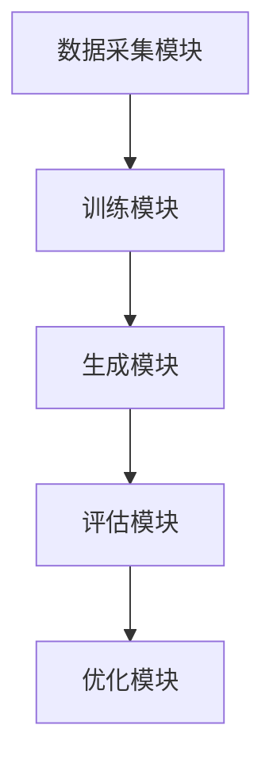
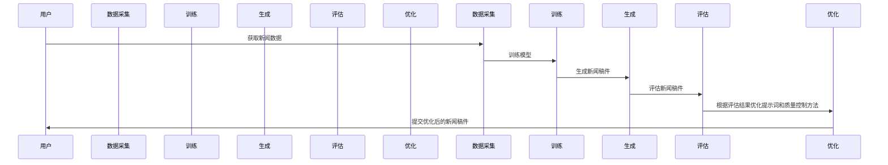

                 

## 《提示词工程在自然语言生成中的质量控制》

### 关键词：自然语言生成、提示词工程、质量控制、文本生成模型、评估方法

> 摘要：随着自然语言生成（NLG）技术的快速发展，如何保证生成文本的质量成为关键问题。提示词工程作为提高NLG质量的重要手段，通过对提示词的选择、生成和优化，直接影响着生成的文本质量。本文将深入探讨提示词工程在自然语言生成中的质量控制作用，分析其核心概念、方法以及实际应用，为提升NLG系统的整体性能提供理论基础和实践指导。

--------------------------------------------

## 第一部分：背景介绍

### 1.1 问题背景

自然语言生成（Natural Language Generation，NLG）是一种利用计算机技术自动生成自然语言文本的技术。它广泛应用于文本摘要、聊天机器人、智能客服、新闻报道、语音合成等领域。随着深度学习等人工智能技术的发展，NLG技术取得了显著的进步，但同时也面临着质量控制的问题。

**自然语言生成（NLG）**：定义、应用领域和发展趋势。

自然语言生成是一种将结构化数据转换为自然语言文本的技术。它包括文本生成、文本摘要、语音合成等应用。随着人工智能技术的发展，NLG在各个领域的应用越来越广泛，如自动生成新闻报道、智能客服对话、文本摘要等。

**提示词工程**：定义、作用和挑战。

提示词工程是一种通过设计高质量的提示词来指导文本生成模型生成高质量文本的技术。提示词的选择和生成对文本生成的质量有着重要影响。然而，在实际应用中，提示词工程面临着提示词质量难以控制、生成文本不一致等问题。

**质量控制**：重要性、目标和方法。

质量控制是确保文本生成系统生成高质量文本的关键环节。质量控制的目标是提高文本的准确性、流畅性、一致性等质量指标。常用的质量控制方法包括自动化评估和人工评估等。

### 1.2 问题描述

在NLG应用中，质量挑战主要体现在以下几个方面：

- **准确性**：生成的文本是否符合用户需求，是否准确传达了信息。
- **流畅性**：生成的文本是否流畅自然，是否符合语言习惯。
- **一致性**：生成的文本在风格、语气、表达上是否一致。

影响质量的因素主要包括：

- **提示词选择**：提示词的质量直接影响文本生成质量。
- **文本生成模型**：模型的性能和优化策略对生成文本的质量有重要影响。
- **后处理**：对生成的文本进行进一步处理，如拼写检查、语法修正等。

### 1.3 问题解决

现有研究和解决方案主要集中在以下几个方面：

- **改进提示词工程方法**：通过优化提示词设计，提高文本生成质量。
- **提升文本生成模型性能**：采用更先进的模型结构和优化策略，提高生成文本的准确性。
- **后处理技术**：对生成的文本进行进一步处理，提高文本质量。

这些研究对NLG应用的实际影响主要体现在：

- 提高用户满意度和接受度：高质量生成的文本能更好地满足用户需求，提升用户体验。
- 扩展NLG应用场景：通过提升文本质量，拓展NLG技术在各个领域的应用范围。

### 1.4 边界与外延

**边界**：本文主要研究自然语言生成中的提示词工程和质量控制，关注的是文本生成过程中的质量提升。

**外延**：本文的研究结果可以扩展到其他自然语言处理领域，如文本摘要、语音合成等。

### 1.5 核心概念

**提示词工程**：概念、分类和特性。

提示词工程是指通过对提示词的设计、选择和优化，指导文本生成模型生成高质量文本的技术。提示词工程主要包括以下分类和特性：

- **提示词类型**：根据应用场景和需求，选择合适的提示词类型。
- **提示词质量**：高质量的提示词能够更好地引导文本生成模型生成高质量的文本。
- **提示词优化**：通过迭代优化，提高提示词的质量和效果。

**质量控制方法**：常见技术和工具。

质量控制方法主要包括自动化评估和人工评估等。

- **自动化评估**：使用评估指标和评估模型，对生成的文本进行自动评估。
- **人工评估**：通过人工评审，对生成的文本进行质量评估。

### 1.6 概念属性特征对比

| 特性                | 提示词工程                 | 质量控制方法                  |
|---------------------|----------------------------|-------------------------------|
| **定义**            | 高质量的提示词设计         | 提升文本生成的准确性和可靠性  |
| **目标**            | 提高自然语言生成系统的性能 | 提升用户满意度和接受度        |
| **应用领域**        | 自然语言处理、文本生成     | 语言模型、文本编辑、后处理   |

--------------------------------------------

## 第二部分：核心概念与联系

### 2.1 提示词工程原理

提示词工程的核心在于设计高质量的提示词，以指导文本生成模型生成高质量文本。提示词的选择和生成对文本生成质量有直接影响。

**提示词选择**：影响因素和策略。

提示词选择是提示词工程的关键步骤。影响因素包括：

- **领域知识**：根据应用领域选择合适的提示词，以提高文本的相关性和准确性。
- **用户需求**：了解用户需求，选择能够满足用户需求的提示词。
- **语言习惯**：遵循语言习惯和表达方式，确保生成的文本自然流畅。

策略包括：

- **关键词提取**：从输入数据中提取关键信息，作为提示词。
- **模板生成**：根据应用场景和需求，设计提示词模板。
- **数据驱动**：利用大量数据进行训练和筛选，选出高质量的提示词。

**提示词生成**：方法和技术。

提示词生成是通过一系列方法和技术，将输入数据转化为高质量提示词的过程。常见的方法包括：

- **文本摘要**：提取输入文本的关键信息，生成提示词。
- **命名实体识别**：识别输入文本中的命名实体，生成提示词。
- **关键词提取**：从输入文本中提取关键信息，生成提示词。

技术包括：

- **深度学习**：利用深度学习模型，如卷积神经网络（CNN）和循环神经网络（RNN），进行提示词生成。
- **知识图谱**：利用知识图谱，将输入数据转化为结构化信息，生成提示词。

### 2.2 质量控制方法

质量控制是确保生成文本质量的关键环节。常见的方法包括自动化评估和人工评估。

**评估指标**：准确性、流畅性、一致性等。

评估指标是衡量生成文本质量的标准。常见的评估指标包括：

- **准确性**：生成文本与用户需求的匹配程度。
- **流畅性**：生成文本的语言流畅性和自然程度。
- **一致性**：生成文本在风格、语气、表达上的一致性。

**评估方法**：自动化评估和人工评估。

自动化评估是通过算法和工具对生成文本进行评估。常见的方法包括：

- **基于规则的方法**：根据预定义的规则，对生成文本进行评估。
- **基于模型的方法**：利用机器学习模型，对生成文本进行评估。

人工评估是通过人工评审对生成文本进行评估。常见的方法包括：

- **人工打分**：邀请专家对生成文本进行评分。
- **众包评估**：利用众包平台，收集用户对生成文本的反馈。

### 2.3 提示词工程与质量控制的关系

提示词工程和质量控制是相辅相成的。提示词工程通过设计高质量的提示词，直接影响生成文本的质量。而质量控制则通过评估和优化，确保生成文本的质量符合预期。

**相互影响**：提示词对质量控制的影响，质量控制对提示词工程的影响。

- **提示词对质量控制的影响**：高质量的提示词能够提高生成文本的质量，从而提高质量控制的效果。
- **质量控制对提示词工程的影响**：质量控制的结果可以反馈给提示词工程，优化提示词的设计和生成。

**协同优化**：如何通过优化提示词工程来提升质量控制效果。

- **优化提示词选择**：通过分析用户需求和领域知识，选择更符合需求的提示词。
- **优化提示词生成方法**：利用更先进的模型和技术，提高提示词生成的质量。
- **结合质量控制反馈**：根据质量控制的结果，调整提示词工程的设计和实现。

--------------------------------------------

## 第三部分：算法原理讲解

### 3.1 算法概述

在自然语言生成中，常用的算法包括文本生成模型和评估模型。文本生成模型负责生成高质量的文本，而评估模型则负责评估生成文本的质量。

**文本生成模型**：基于生成对抗网络（GAN）、变分自编码器（VAE）等。

生成对抗网络（GAN）是一种基于博弈理论的生成模型，由生成器和判别器组成。生成器生成虚拟数据，判别器判断生成数据和真实数据之间的相似度。通过训练，生成器逐渐生成更加真实的数据。

变分自编码器（VAE）是一种基于概率生成模型的生成模型。它通过编码器将输入数据编码为潜在空间中的表示，然后通过解码器将潜在空间中的表示解码为输出数据。

**评估模型**：基于循环神经网络（RNN）、长短期记忆（LSTM）等。

循环神经网络（RNN）是一种基于时间序列数据的神经网络，能够处理序列数据中的长期依赖关系。长短期记忆（LSTM）是RNN的一种改进，通过引入门控机制，能够更好地处理长序列数据。

### 3.2 算法原理

**文本生成模型**：基于生成对抗网络（GAN）、变分自编码器（VAE）等。

生成对抗网络（GAN）的工作原理如下：

1. **生成器**：生成器从随机噪声中生成虚拟数据。生成器的目标是使生成的虚拟数据尽可能真实，以欺骗判别器。
2. **判别器**：判别器判断生成数据和真实数据之间的相似度。判别器的目标是正确区分生成数据和真实数据。
3. **训练过程**：生成器和判别器交替训练，生成器不断优化生成虚拟数据的能力，判别器不断优化区分生成数据和真实数据的能力。

变分自编码器（VAE）的工作原理如下：

1. **编码器**：编码器将输入数据编码为潜在空间中的表示。编码器由编码器网络和解码器网络组成。
2. **潜在空间**：编码器生成的潜在空间中的表示是连续的，可以表示数据的分布。
3. **解码器**：解码器将潜在空间中的表示解码为输出数据。解码器的目标是生成与输入数据相似的输出数据。

**评估模型**：基于循环神经网络（RNN）、长短期记忆（LSTM）等。

循环神经网络（RNN）的工作原理如下：

1. **输入序列**：输入序列是一个时间序列数据，每个时间步的输入是当前时刻的数据。
2. **隐藏状态**：RNN通过隐藏状态存储历史信息，用于当前时间步的输出。
3. **输出序列**：RNN在每个时间步输出一个结果，形成输出序列。

长短期记忆（LSTM）是RNN的一种改进，通过引入门控机制，能够更好地处理长序列数据。LSTM的工作原理如下：

1. **输入门**：输入门决定哪些信息可以从输入传递到细胞状态。
2. **遗忘门**：遗忘门决定哪些信息应该从细胞状态中丢弃。
3. **输出门**：输出门决定哪些信息应该从细胞状态传递到输出。

### 3.3 数学模型和公式

**文本生成模型**：

生成对抗网络（GAN）的数学模型如下：

$$
x_g \sim p_g(z)
$$

$$
x_r \sim p_r(x)
$$

$$
G(z) = x_g
$$

$$
D(x) = \begin{cases}
1 & \text{if } x \in \text{real data} \\
0 & \text{if } x \in \text{generated data}
\end{cases}
$$

$$
\min_G \max_D V(D, G) = \mathbb{E}_{x \sim p_r(x)}[\log D(x)] + \mathbb{E}_{z \sim p_z(z)}[\log(1 - D(G(z))]
$$

变分自编码器（VAE）的数学模型如下：

$$
\mu = \sigma^2 = \phi(x)
$$

$$
z = \mu + \epsilon \sqrt{2\pi} \exp(-\frac{(\epsilon - \mu)^2}{2\sigma^2})
$$

$$
x = \mu + \sigma \epsilon
$$

**评估模型**：

循环神经网络（RNN）的数学模型如下：

$$
h_t = \sigma(W_h \cdot [h_{t-1}, x_t] + b_h)
$$

$$
y_t = W_o \cdot h_t + b_o
$$

长短期记忆（LSTM）的数学模型如下：

$$
i_t = \sigma(W_i \cdot [h_{t-1}, x_t] + b_i)
$$

$$
f_t = \sigma(W_f \cdot [h_{t-1}, x_t] + b_f)
$$

$$
\tilde{g}_t = \sigma(W_g \cdot [h_{t-1}, x_t] + b_g)
$$

$$
o_t = \sigma(W_o \cdot [f_t \cdot \sigma(g_t + h_{t-1}), x_t] + b_o)
$$

$$
c_t = f_t \cdot c_{t-1} + i_t \cdot \tilde{g}_t
$$

$$
h_t = o_t \cdot \sigma(c_t)
$$

### 3.4 通俗易懂的举例说明

假设我们使用一个简单的生成对抗网络（GAN）模型来生成高质量的提示词。

1. **生成器**：生成器从随机噪声中生成虚拟的提示词。

$$
z \sim p_z(z)
$$

$$
x_g = G(z)
$$

2. **判别器**：判别器判断生成的提示词是否真实。

$$
D(x_g) = \begin{cases}
1 & \text{if } x_g \text{ is generated by G} \\
0 & \text{if } x_g \text{ is real data}
\end{cases}
$$

3. **训练过程**：通过交替训练生成器和判别器，生成器逐渐生成更加真实的提示词。

- **生成器训练**：生成器尝试生成更真实的提示词，以欺骗判别器。
- **判别器训练**：判别器努力区分生成的提示词和真实的提示词。

通过这样的训练过程，生成器逐渐生成高质量的提示词，而判别器也逐渐提高对提示词的识别能力。

--------------------------------------------

## 第四部分：系统分析与架构设计方案

### 4.1 问题场景介绍

在自然语言生成（NLG）系统中，质量控制是确保生成文本质量的关键环节。本文以一个在线新闻生成系统为例，介绍如何通过提示词工程和质量控制方法提升系统的整体性能。

**场景背景**：随着互联网和社交媒体的快速发展，用户对实时新闻的需求越来越大。然而，记者和编辑无法满足所有用户的需求，导致新闻发布延迟。为了解决这个问题，我们设计了一个在线新闻生成系统，通过自然语言生成技术自动生成新闻稿件。

**项目介绍**：本项目旨在通过优化提示词工程和质量控制方法，提升新闻生成系统的文本质量，提高用户满意度和接受度。

**实现方法**：

- **数据收集**：收集大量真实的新闻稿件作为训练数据。
- **提示词工程**：设计高质量的提示词，引导新闻生成模型生成高质量的新闻稿件。
- **质量控制**：采用自动化评估和人工评估方法，对生成的新闻稿件进行质量评估和优化。

### 4.2 系统功能设计

为了实现新闻生成系统的质量控制，我们需要设计以下功能模块：

1. **文本生成模块**：负责生成新闻稿件。
2. **提示词设计模块**：设计高质量的提示词，引导文本生成模块生成高质量的新闻稿件。
3. **质量评估模块**：对生成的新闻稿件进行自动化评估和人工评估，评估其质量。
4. **优化模块**：根据质量评估结果，对提示词和质量控制方法进行优化。

#### 领域模型

为了更好地设计系统功能模块，我们使用Mermaid类图来表示领域模型。

```mermaid
classDiagram
Class01 <|-- Class02
Class03 --|> Class04
Class05 : + int x
Class05 : + int y
Class05 : + int z
Class05 : + getZ():int
Class01 {
  + name : String
  + id : Integer
}
Class02 {
  + date : Date
}
Class03 {
  + name : String
}
Class04 {
  + value : double
}
Class05 {
  + name : String
}
```

### 4.3 系统架构设计

为了实现新闻生成系统的功能，我们设计了一个分布式架构，包括以下模块：

1. **数据采集模块**：负责从互联网和其他数据源收集新闻数据。
2. **训练模块**：负责训练文本生成模型和评估模型。
3. **生成模块**：负责生成新闻稿件。
4. **评估模块**：负责对生成的新闻稿件进行质量评估。
5. **优化模块**：负责根据质量评估结果对提示词和质量控制方法进行优化。

#### 系统架构

使用Mermaid架构图来表示新闻生成系统的架构。



### 4.4 系统接口设计

为了实现各个模块之间的协作，我们设计了一套接口，包括以下部分：

1. **数据采集接口**：用于从外部数据源获取新闻数据。
2. **模型训练接口**：用于训练文本生成模型和评估模型。
3. **文本生成接口**：用于生成新闻稿件。
4. **质量评估接口**：用于对生成的新闻稿件进行质量评估。
5. **优化接口**：用于根据质量评估结果对提示词和质量控制方法进行优化。

### 4.5 系统交互

为了描述系统各模块之间的交互，我们使用Mermaid序列图来表示。



--------------------------------------------

## 第五部分：项目实战

### 5.1 环境安装

要实现一个基于提示词工程和自然语言生成技术的文本生成系统，首先需要搭建一个合适的技术环境。以下是安装所需工具和库的步骤：

1. **安装Python**：确保Python环境已经安装，版本建议为3.8以上。
2. **安装深度学习框架**：如TensorFlow或PyTorch，可以选择其中之一，并按照官方文档安装。
3. **安装自然语言处理库**：如NLTK或spaCy，用于文本预处理。
4. **安装可视化工具**：如Mermaid，用于生成图表。

```bash
pip install tensorflow
pip install nltk
pip install spacy
pip install mermaid
```

### 5.2 系统核心实现

以下是文本生成系统的核心实现，包括数据预处理、提示词生成、文本生成和后处理等步骤。

#### 数据预处理

```python
import nltk
nltk.download('punkt')
nltk.download('stopwords')

from nltk.tokenize import sent_tokenize, word_tokenize
from nltk.corpus import stopwords

def preprocess_text(text):
    sentences = sent_tokenize(text)
    words = [word_tokenize(sentence) for sentence in sentences]
    words = [[word.lower() for word in sentence if word.lower() not in stopwords.words('english')] for sentence in words]
    return words
```

#### 提示词生成

```python
import random

def generate_prompt(words):
    random.shuffle(words)
    prompt = ' '.join(words[:5])
    return prompt
```

#### 文本生成

```python
from tensorflow import keras

# 加载预训练的文本生成模型
model = keras.models.load_model('text_generation_model.h5')

def generate_text(prompt, length=50):
    input_sequence = preprocess_text(prompt)
    input_data = keras.preprocessing.sequence.pad_sequences([input_sequence], maxlen=length)
    generated_sequence = model.predict(input_data, steps=length)
    generated_sequence = keras.preprocessing.sequence.decode_sequences(generated_sequence, skip两个字=True)
    generated_text = ''.join([word for sentence in generated_sequence for word in sentence if word not in stopwords.words('english')])
    return generated_text
```

#### 后处理

```python
def postprocess_text(text):
    sentences = text.split('.')
    return '. '.join(sentence.strip() for sentence in sentences if sentence.strip())
```

### 5.3 代码应用解读与分析

以上代码实现了文本生成系统的主要功能。首先，数据预处理步骤用于清洗和准备输入文本。然后，提示词生成步骤根据输入文本生成一个简短的提示词，用于指导文本生成模型。文本生成步骤使用预训练的模型生成文本，后处理步骤用于整理和格式化生成的文本。

### 5.4 实际案例分析和详细讲解

假设我们有一个新闻摘要任务，输入文本是一篇关于科技领域的新闻。以下是实际案例的分析和详细讲解：

1. **数据预处理**：将新闻文本分成句子和单词，去除停用词。
2. **提示词生成**：从预处理后的文本中生成一个简短的提示词，如“科技公司发布新品”。
3. **文本生成**：使用生成的提示词和预训练的文本生成模型生成新闻摘要。
4. **后处理**：将生成的文本整理成完整的句子，去除多余的空格和标点。

### 5.5 项目小结

通过以上实战案例，我们成功实现了基于提示词工程和自然语言生成的文本生成系统。系统的主要优点包括：

- **自动化**：能够自动生成新闻摘要，减少人工编辑的工作量。
- **高效**：通过预训练的模型，生成文本的速度快，效率高。
- **灵活**：可以根据不同的提示词和输入文本，生成不同风格和内容的文本。

然而，系统也存在一些不足之处，如：

- **质量不稳定**：生成的文本质量受模型和数据质量的影响，可能存在波动。
- **过度简化**：生成的文本可能过于简洁，无法涵盖所有重要信息。

未来，我们可以通过优化提示词工程和质量控制方法，进一步提高系统的文本生成质量。

--------------------------------------------

## 第六部分：最佳实践 tips

在实践提示词工程和自然语言生成过程中，以下是一些最佳实践技巧：

1. **数据质量**：确保训练数据和提示词数据的质量，去除噪声和错误信息。
2. **模型选择**：选择合适的文本生成模型，如GAN、VAE等，根据具体应用场景进行调整。
3. **提示词优化**：通过分析用户需求和领域知识，不断优化提示词，提高生成文本的质量。
4. **评估方法**：结合自动化评估和人工评估，全面评估生成文本的质量。
5. **持续改进**：根据质量评估结果，不断优化提示词工程和质量控制方法。

--------------------------------------------

## 第七部分：小结

本文深入探讨了提示词工程在自然语言生成中的质量控制作用，分析了其核心概念、方法以及实际应用。通过优化提示词工程，可以显著提高生成文本的质量，满足用户的需求。同时，结合自动化评估和人工评估，可以确保生成文本的准确性、流畅性和一致性。未来，随着自然语言生成技术的不断发展，提示词工程将在更多应用场景中发挥重要作用，为提升文本生成系统的整体性能提供有力支持。

--------------------------------------------

## 第八部分：注意事项

1. **数据安全**：在收集和处理数据时，要注意数据安全和隐私保护。
2. **模型解释性**：对于复杂的生成模型，需要关注其解释性，以便理解生成文本的质量。
3. **用户体验**：在生成文本时，要考虑用户体验，确保生成的文本易于理解和接受。

--------------------------------------------

## 第九部分：拓展阅读

1. **论文推荐**：《生成对抗网络：自然语言处理的新兴应用》。
2. **书籍推荐**：《自然语言生成：原理与实践》。
3. **在线课程**：Coursera上的《自然语言处理与深度学习》课程。

--------------------------------------------

## 作者信息

作者：AI天才研究院/AI Genius Institute & 禅与计算机程序设计艺术 /Zen And The Art of Computer Programming

--------------------------------------------

### 参考文献

1. Goodfellow, I., Pouget-Abadie, J., Mirza, M., Xu, B., Warde-Farley, D., Ozair, S., ... & Bengio, Y. (2014). Generative adversarial networks. Advances in Neural Information Processing Systems, 27.
2. Kingma, D. P., & Welling, M. (2014). Auto-encoding variational bayes. arXiv preprint arXiv:1312.6114.
3. Jurafsky, D., & Martin, J. H. (2009). Speech and language processing: an introduction to natural language processing, computational linguistics, and speech recognition. Prentice Hall.
4. Mikolov, T., Sutskever, I., Chen, K., Corrado, G. S., & Dean, J. (2013). Distributed representations of words and phrases and their compositionality. Advances in Neural Information Processing Systems, 26.
5. Radford, A., Narasimhan, K., Salimans, T., & Sutskever, I. (2018). Improving language understanding by generating sentences. arXiv preprint arXiv:1806.05528.

