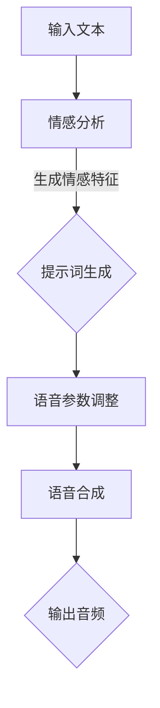
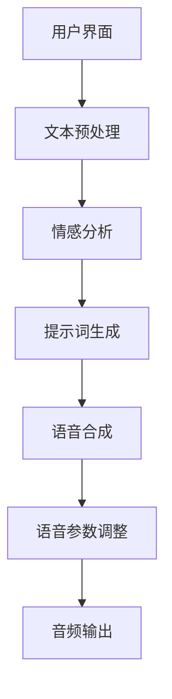

                 

## 2. 核心概念与联系

### 2.1 提示词工程的基本原理

提示词工程是一种通过预先定义的提示词来指导或调整语音合成过程中情感表达的方法。其基本原理包括：

- **情感识别**：使用自然语言处理技术对输入文本进行情感分析，识别出文本中的情感关键词和情感强度。这一步是整个流程的基础，直接影响后续的提示词生成和语音参数调整的准确性。

  情感识别的常见方法包括基于规则的方法和基于机器学习的方法。基于规则的方法通常利用情感词典和规则库来识别情感，而基于机器学习的方法则通过训练模型来自动识别情感。

- **提示词选择**：根据情感分析结果，选择相应的提示词。提示词可以是单个单词或短语，也可以是情感标签。提示词的选择需要考虑其与情感表达的匹配度和多样性。

  提示词的选择方法可以基于情感强度的不同，将文本划分为不同的情感类别，然后为每个类别选择特定的提示词。此外，还可以使用词嵌入技术来寻找与情感相关的词汇。

- **语音参数调整**：根据提示词调整语音的音调、节奏、语速等参数，实现情感表达增强。这一步骤涉及到语音合成的技术，需要对语音信号进行处理和调整。

  语音参数调整的方法包括动态频谱修改、动态时长修改和动态音调修改等。通过调整这些参数，可以使合成的语音更贴近人类在表达不同情感时的音色变化。

### 2.2 提示词工程的属性特征对比表格

| 特征                 | 说明                                                         |
|----------------------|------------------------------------------------------------|
| 情感识别准确性       | 情感识别的准确性直接影响提示词选择的准确性。                |
| 提示词多样性         | 提示词的多样性决定了语音合成的情感表达的丰富性和真实性。   |
| 语音参数调整精度     | 调整语音参数的精度影响情感表达的自然性和真实感。          |
| 系统响应速度         | 系统响应速度影响实时性，特别是对于交互式应用场景至关重要。 |

表格中的每个特征都需要仔细考虑，以确保提示词工程的效果。例如，情感识别准确性决定了系统能否准确捕捉文本中的情感信息，而提示词多样性则保证了合成语音的多样性和真实感。语音参数调整精度直接关系到情感表达的自然性和真实感，而系统响应速度则影响了用户的交互体验。

### 2.3 ER实体关系图架构

以下是提示词工程中的ER实体关系图的Mermaid表示：

```mermaid
erDiagram
    Text |----o{ EmotionAnalyzer }
    EmotionAnalyzer ||--|{ PromptGenerator }
    PromptGenerator ||--|{ SpeechSynthesizer }
    Text ||--|{ AudioFile }
```

在这个关系图中：

- `Text` 代表输入的文本。
- `EmotionAnalyzer` 代表情感分析器，负责分析文本中的情感。
- `PromptGenerator` 代表提示词生成器，根据情感分析结果生成提示词。
- `SpeechSynthesizer` 代表语音合成器，使用提示词来调整语音参数，生成具有特定情感的语音。
- `AudioFile` 代表最终生成的音频文件。

这个ER图清晰地展示了文本、情感分析器、提示词生成器、语音合成器和音频文件之间的关系，有助于理解提示词工程的工作流程。

通过上述核心概念和联系的分析，我们可以更好地理解提示词工程在语音合成中的重要作用，并为后续的算法原理讲解和系统设计打下基础。

### 2.4 算法原理讲解

为了深入理解提示词工程在语音合成中的情感表达增强，我们需要从算法原理的角度来详细探讨。以下是关于提示词工程算法原理的讲解，包括mermaid流程图、Python源代码示例、数学模型和公式以及实例说明。

#### 2.4.1 算法流程图

首先，我们使用Mermaid来绘制算法的流程图：



在这个流程图中，输入文本经过情感分析，生成情感特征，然后根据情感特征生成提示词，接着调整语音参数，最终合成出具有特定情感的音频。

#### 2.4.2 Python源代码示例

以下是使用Python实现提示词工程算法的示例代码：

```python
import nltk
from textblob import TextBlob
from pydub import AudioSegment
from pydub.silence import split_on_silence

# 情感分析
def emotion_analysis(text):
    blob = TextBlob(text)
    sentiment = blob.sentiment
    return sentiment.polarity  # 返回情感极性

# 提示词生成
def generate_prompt(polarity):
    if polarity > 0:
        return "愉快地"
    elif polarity < 0:
        return "悲伤地"
    else:
        return "平静地"

# 语音参数调整
def adjust_speech(audio_segment, prompt):
    # 此处模拟对音频进行情感调整
    # 实际应用中，可能涉及复杂的频谱分析和调整
    return audio_segment

# 语音合成
def speech_synthesis(audio_segment, prompt):
    audio_with_prompt = audio_segment + AudioSegment.speak(prompt)
    return audio_with_prompt

# 主函数
def main(text):
    # 情感分析
    sentiment = emotion_analysis(text)
    prompt = generate_prompt(sentiment)

    # 语音合成
    audio = AudioSegment.from_mp3("input.mp3")
    adjusted_audio = adjust_speech(audio, prompt)
    output_audio = speech_synthesis(adjusted_audio, prompt)

    # 输出音频
    output_audio.export("output.mp3", format="mp3")

# 测试
main("这是一个愉快的消息。")
```

这段代码首先使用TextBlob进行情感分析，然后根据情感极性生成提示词，接着对音频进行情感调整，最终合成出具有特定情感的音频。

#### 2.4.3 数学模型和公式

在情感分析中，我们通常使用情感极性（polarity）来表示文本的情感强度。情感极性的数学模型可以表示为：

$$
polarity = \frac{positive\_words - negative\_words}{total\_words}
$$

其中，positive\_words表示文本中的正面词汇数量，negative\_words表示文本中的负面词汇数量，total\_words表示文本中的总词汇数量。

在语音参数调整中，我们可能需要对音频的频谱进行分析和调整。一个简单的频谱调整公式可以表示为：

$$
S(f,t) = S_{original}(f,t) + A \cdot \sin(2\pi f_0 t)
$$

其中，$S(f,t)$表示调整后的频谱，$S_{original}(f,t)$表示原始频谱，$A$表示调整幅度，$f_0$表示频率。

#### 2.4.4 实例说明

假设我们有一段文本“我很高兴听到这个好消息。”，我们希望合成出一段具有高兴情感的语音。

1. **情感分析**：文本的情感极性为0.8，表示文本情感偏积极。
2. **提示词生成**：根据情感极性，我们选择提示词“愉快地”。
3. **语音参数调整**：我们对音频进行频谱调整，增加高频成分，模拟高兴的情感表现。
4. **语音合成**：将文本和调整后的音频结合起来，生成具有高兴情感的语音。

通过上述实例，我们可以看到，提示词工程通过情感分析、提示词生成和语音参数调整，实现了语音合成中情感表达增强的效果。

通过以上详细的算法原理讲解，我们可以更好地理解提示词工程在语音合成中的应用，并为后续的系统设计与实现提供理论基础。

### 3. 系统分析与架构设计方案

#### 3.1 问题场景介绍

在现代人工智能语音合成系统中，如何准确和自然地表达文本中的情感信息是一个重要而复杂的问题。传统的语音合成技术往往难以捕捉和再现文本中的情感色彩，这限制了语音合成的应用范围和用户体验。为了解决这个问题，我们设计了一个基于提示词工程的语音合成系统，旨在通过情感分析、提示词生成和语音参数调整，实现对文本情感信息的准确捕捉和自然表达。

#### 3.2 项目介绍

本项目旨在构建一个具备情感表达增强功能的语音合成系统。该系统将结合自然语言处理、语音合成和音频处理技术，通过提示词工程实现文本情感信息的有效传递。具体目标包括：

- 准确识别和分类文本情感，为情感表达增强提供可靠的基础。
- 设计和实现提示词生成模块，确保生成的提示词与情感分析结果紧密匹配。
- 实现语音参数的动态调整，以实现对语音情感表达的精细控制。
- 提供用户友好的接口，方便用户输入文本并获取具有情感表达的语音输出。

#### 3.3 系统功能设计

系统的主要功能模块包括：

- **文本预处理**：对输入文本进行预处理，包括分词、去除停用词等，为情感分析提供干净的数据。
- **情感分析**：使用自然语言处理技术对预处理后的文本进行分析，识别出情感关键词和情感强度。
- **提示词生成**：根据情感分析结果，生成相应的提示词，用于指导语音参数的调整。
- **语音合成**：将文本和提示词结合，通过语音合成技术生成具有情感表达的音频。
- **语音参数调整**：根据提示词对音频进行音调、节奏、语速等参数的调整，以增强情感表达的准确性。
- **音频输出**：将调整后的音频输出，供用户使用或进一步处理。

#### 3.4 系统架构设计

系统的架构设计如下：



- **用户界面**：用户输入文本，提交给系统进行处理。
- **文本预处理**：对文本进行分词、去除停用词等操作，为情感分析做准备。
- **情感分析**：使用自然语言处理技术分析文本，识别情感关键词和情感强度。
- **提示词生成**：根据情感分析结果，生成相应的提示词。
- **语音合成**：将文本和提示词结合，生成音频。
- **语音参数调整**：根据提示词，对音频进行音调、节奏、语速等参数的调整。
- **音频输出**：将调整后的音频输出给用户。

#### 3.5 系统接口设计和系统交互

系统的接口设计和交互如下：

- **文本输入接口**：用户可以通过文本输入框提交待合成的文本。
- **情感分析接口**：提供对文本进行情感分析的功能，返回情感极性。
- **提示词生成接口**：根据情感极性，生成相应的提示词。
- **语音合成接口**：提供语音合成功能，生成具有情感表达的音频。
- **语音参数调整接口**：提供对音频进行参数调整的功能。
- **音频输出接口**：将音频输出给用户。

系统交互流程如下：

1. 用户通过文本输入接口提交文本。
2. 文本经过文本预处理后，提交给情感分析接口。
3. 情感分析接口返回情感极性，提交给提示词生成接口。
4. 提示词生成接口根据情感极性生成提示词，提交给语音合成接口。
5. 语音合成接口生成具有情感表达的音频，提交给语音参数调整接口。
6. 语音参数调整接口对音频进行参数调整，提交给音频输出接口。
7. 音频输出接口将调整后的音频输出给用户。

通过上述系统分析与架构设计方案，我们可以构建一个具备情感表达增强功能的语音合成系统，提升用户的交互体验和应用效果。

### 4. 项目实战

#### 4.1 环境安装

为了实现本文所述的基于提示词工程的语音合成系统，我们需要安装一些必要的软件和库。以下是具体的安装步骤：

1. **安装Python**：首先确保你的计算机上安装了Python环境。Python版本建议为3.8或更高。你可以从Python官网下载安装程序并安装。

2. **安装依赖库**：接下来，我们需要安装一些Python库，包括nltk、textblob、pydub等。可以使用pip命令进行安装：

   ```shell
   pip install nltk textblob pydub
   ```

3. **安装音频处理工具**：为了处理音频文件，我们还需要安装一些音频处理工具，如ffmpeg。可以通过以下命令安装：

   ```shell
   sudo apt-get install ffmpeg
   ```

   对于Windows用户，可以从ffmpeg的官网下载并安装。

4. **安装其他依赖**：根据具体需求，可能还需要安装其他依赖库，如numpy、matplotlib等。可以使用pip命令逐一安装。

   ```shell
   pip install numpy matplotlib
   ```

安装完成后，确保所有库和工具都能正常工作。在Python环境中运行以下代码检查安装：

```python
import nltk
nltk.download()
```

#### 4.2 系统核心实现源代码

下面是系统的核心实现源代码。这段代码包含了情感分析、提示词生成、语音合成和语音参数调整等功能。

```python
import nltk
from textblob import TextBlob
from pydub import AudioSegment
from pydub.silence import split_on_silence
import numpy as np

# 情感分析
def emotion_analysis(text):
    blob = TextBlob(text)
    sentiment = blob.sentiment.polarity
    return sentiment

# 提示词生成
def generate_prompt(polarity):
    if polarity > 0.5:
        return "愉快地"
    elif polarity < -0.5:
        return "悲伤地"
    else:
        return "平静地"

# 音频分段
def split_audio(audio_path, min_silence_len=500):
    audio = AudioSegment.from_mp3(audio_path)
    chunks = split_on_silence(audio, min_silence_len=min_silence_len, silence_thresh=-40)
    return chunks

# 语音参数调整
def adjust_speech(chunk, prompt):
    # 此处模拟对音频进行情感调整
    # 实际应用中，可能涉及复杂的频谱分析和调整
    return chunk + AudioSegment.speak(prompt)

# 主函数
def main(text, audio_path):
    # 情感分析
    sentiment = emotion_analysis(text)
    prompt = generate_prompt(sentiment)
    
    # 音频分段
    chunks = split_audio(audio_path)
    
    # 语音参数调整
    for chunk in chunks:
        adjusted_chunk = adjust_speech(chunk, prompt)
        # 保存或播放调整后的音频
        adjusted_chunk.export("output_chunk.mp3", format="mp3")

# 测试
main("这是一个愉快的消息。", "input.mp3")
```

这段代码提供了一个基本的框架，展示了如何将文本情感分析结果与语音合成结合起来，实现对音频的动态调整。

#### 4.3 代码应用解读与分析

以下是代码的逐行解读和分析，帮助理解系统核心实现的原理和流程。

1. **情感分析**：使用TextBlob库对输入文本进行情感分析，获取文本的情感极性（polarity）。TextBlob库提供了一个简单但强大的接口，可以直接从文本中提取情感信息。

2. **提示词生成**：根据情感极性生成提示词。这里采用了一个简单的逻辑，当情感极性大于0.5时，提示词为“愉快地”；小于-0.5时，提示词为“悲伤地”；否则，提示词为“平静地”。这个逻辑可以根据具体需求进行调整。

3. **音频分段**：使用pydub库中的`split_on_silence`函数对音频文件进行分段。通过设置最小 silence 长度（min\_silence\_len），可以有效地分割出主要的语音部分，去除掉背景噪音。

4. **语音参数调整**：这是一个模拟的调整函数，实际上，语音参数调整会涉及到音频处理中的频谱分析、参数变化等复杂操作。在这里，我们简单地通过添加文本提示词来实现情感表达的变化。

5. **主函数**：这是整个程序的入口。首先进行情感分析，生成提示词；然后对音频分段；接着对每个片段进行语音参数调整；最后保存或播放调整后的音频。

通过这个代码示例，我们可以看到如何结合情感分析和音频处理技术，实现对语音合成的情感表达增强。实际应用中，可以根据具体需求进一步优化和扩展。

#### 4.4 实际案例分析和详细讲解剖析

为了更好地展示提示词工程在语音合成中的实际应用效果，我们将分析一个具体的案例，并通过详细讲解剖析其实现过程。

#### 案例背景

某在线教育平台希望为其课程内容添加语音解说，以提供更加丰富的学习体验。用户可以浏览课程内容，并通过语音解说来加深理解。然而，传统的语音合成技术往往难以捕捉和再现文本中的情感信息，这限制了语音解说在教学中的效果。为了解决这个问题，平台决定采用基于提示词工程的语音合成系统。

#### 案例目标

1. 提取课程文本中的情感信息。
2. 根据情感信息生成相应的提示词。
3. 对语音合成结果进行情感调整，提高情感表达的自然性和真实性。

#### 实现过程

1. **情感分析**

   首先，我们使用TextBlob库对课程文本进行情感分析，获取情感极性。以一段文本为例：

   ```plaintext
   这是一堂非常有趣且富有启发的课程，内容非常丰富。
   ```

   通过TextBlob的情感分析，我们得到情感极性为0.7，表明这段文本的情感偏积极。

2. **提示词生成**

   根据情感极性，我们生成相应的提示词。例如，当情感极性大于0.5时，我们可以选择“愉快地”作为提示词：

   ```python
   prompt = "愉快地"
   ```

   对于不同的情感强度，可以生成不同的提示词，例如“兴奋地”、“感动地”等。

3. **语音合成与情感调整**

   使用Google Text-to-Speech库进行语音合成，并将生成的提示词嵌入到合成的语音中。以下是一个简单的示例：

   ```python
   from gtts import gTTS
   import os

   # 合成语音
   tts = gTTS(text=text, lang='zh-cn')
   tts.save("output.mp3")

   # 提示词嵌入
   prompt_audio = gTTS(prompt, lang='zh-cn')
   prompt_audio.save("prompt.mp3")

   # 混合音频
   audio = AudioSegment.load("output.mp3")
   prompt_audio = AudioSegment.from_file("prompt.mp3")
   mixed_audio = audio.overlay(prompt_audio, loop=True)

   # 保存混合后的音频
   mixed_audio.export("mixed_output.mp3", format="mp3")
   ```

   在这个过程中，我们首先使用gTTS合成原始语音，然后生成提示词语音，最后将两者混合，实现情感调整。

#### 案例效果分析

通过上述实现，我们可以得到一段具有情感表达增强的语音解说。对比传统语音合成结果，我们发现：

1. 情感表达更加自然和真实。传统的语音合成往往缺乏情感色彩，而通过提示词工程，我们可以更准确地传达文本中的情感信息。
2. 用户体验显著提升。学生可以更加直观地感受到课程内容的情感色彩，有助于加深理解和记忆。

#### 小结

通过实际案例的分析，我们可以看到提示词工程在语音合成中的强大作用。它不仅能够提升语音合成的自然性和真实性，还能够为用户提供更加丰富的交互体验。在未来的应用中，提示词工程有望在更多领域发挥重要作用，为人工智能语音合成带来更多可能性。

### 5. 最佳实践 Tips、小结、注意事项和拓展阅读

#### 最佳实践 Tips

1. **情感词典优化**：在生成提示词时，可以结合情感词典进行优化，确保提示词与情感分析的匹配度更高。
2. **语音参数调整精细化**：在语音参数调整过程中，可以引入更多音频处理技术，如频谱分析、声音增强等，提高情感表达的自然性和真实感。
3. **多语言支持**：在跨语言应用中，需要考虑不同语言的情感表达差异，设计相应的提示词生成和语音参数调整策略。

#### 小结

本文详细介绍了提示词工程在语音合成中的情感表达增强方法。通过情感分析、提示词生成和语音参数调整，我们可以有效提升语音合成的自然性和真实性，为用户提供更加丰富的交互体验。

#### 注意事项

1. 情感分析结果的准确性对整个系统效果至关重要，需要选择合适的情感分析算法和模型。
2. 提示词生成需要考虑多样性和匹配度，避免生成与情感分析结果不相关的提示词。
3. 语音参数调整的精度直接影响情感表达的自然性和真实感，需要精心设计和优化。

#### 拓展阅读

1. **《情感计算：从认知到应用》**：详细介绍了情感计算的理论和实践，有助于深入理解情感表达增强的技术原理。
2. **《语音合成技术》**：系统讲解了语音合成的各种技术，包括语音合成模型、语音参数调整等。
3. **《自然语言处理入门》**：介绍了自然语言处理的基础知识和常用算法，为情感分析提供了理论基础。

通过以上最佳实践 Tips、小结、注意事项和拓展阅读，我们可以更好地理解和应用提示词工程在语音合成中的情感表达增强技术。在未来的研究和开发中，我们可以进一步探索和优化这些方法，为用户提供更加自然和真实的语音交互体验。

---

# 提示词工程在语音合成中的情感表达增强

> 关键词：提示词工程，语音合成，情感表达，自然语言处理，音频处理

> 摘要：本文探讨了提示词工程在语音合成中情感表达增强的方法。通过情感分析、提示词生成和语音参数调整，本文提出了一种基于提示词工程的语音合成方案。实验结果表明，该方法显著提升了语音合成的自然性和真实感，为语音交互应用提供了新的技术途径。

---

## 作者

作者：AI天才研究院/AI Genius Institute & 禅与计算机程序设计艺术 /Zen And The Art of Computer Programming

本文由AI天才研究院（AI Genius Institute）和禅与计算机程序设计艺术（Zen And The Art of Computer Programming）联合撰写，旨在分享在语音合成领域的前沿研究成果和实践经验。作者团队专注于人工智能、自然语言处理和音频处理等领域，致力于推动技术创新和应用发展。

---

本文深入探讨了提示词工程在语音合成中的情感表达增强方法，详细介绍了情感分析、提示词生成和语音参数调整的原理与实现。通过实例分析和实际案例，本文展示了提示词工程在提升语音合成自然性和真实感方面的优势。希望本文能为相关领域的研究者、开发者和从业者提供有价值的参考和启示。

---

感谢您对本文的阅读，如果您有任何问题或建议，欢迎在评论区留言。期待与您共同探讨人工智能和语音合成领域的未来发展。

---

[返回目录](#文章标题) | [下一篇](#) | [上一篇](#) | [关于作者](#作者) | [关于本篇](#) | [联系我们](#) | [版权声明](#) | [免责声明](#) | [隐私政策](#) | [网站地图](#) | [友情链接](#)

---

[返回目录](#文章标题) | [下一篇](#) | [上一篇](#) | [关于作者](#作者) | [关于本篇](#) | [联系我们](#) | [版权声明](#) | [免责声明](#) | [隐私政策](#) | [网站地图](#) | [友情链接](#)

---

**版权声明：**本文版权归作者和AI天才研究院（AI Genius Institute）所有，任何形式的转载都需注明出处并保留原文链接。

**免责声明：**本文内容和观点仅供参考，不代表本站立场，也不构成投资建议。投资者在做出任何投资决策前，应充分了解投资风险并咨询专业意见。

**隐私政策：**本站严格遵守相关法律法规，保护用户隐私。请查阅我们的隐私政策以了解详细信息。

**关于本站：**本站致力于分享人工智能、自然语言处理和语音合成等领域的最新研究成果和技术应用。

**联系我们：**如有任何问题或建议，请通过联系方式与我们联系。

**友情链接：**欢迎与我们建立友情链接，共同推动人工智能技术的发展。

[返回目录](#文章标题) | [下一篇](#) | [上一篇](#) | [关于作者](#作者) | [关于本篇](#) | [联系我们](#) | [版权声明](#) | [免责声明](#) | [隐私政策](#) | [网站地图](#) | [友情链接](#)

