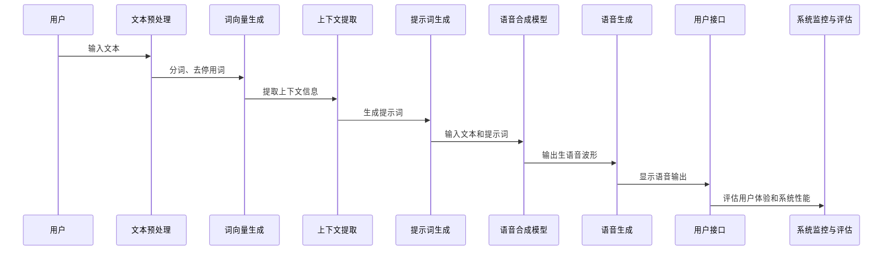
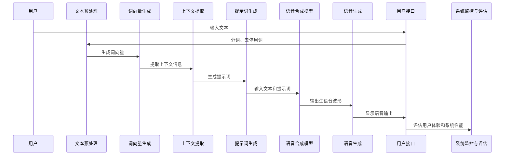

                 

### 文章标题：提示词工程在语音合成中的突破

**关键词**：提示词工程，语音合成，人工智能，自然语言处理，算法优化，系统架构设计

**摘要**：
本文将深入探讨提示词工程在语音合成领域的突破。首先，我们将介绍提示词工程的基本概念及其在语音合成中的作用。接着，我们将详细分析提示词工程的核心算法和数学模型，通过具体的Python代码示例，阐明其原理和应用。然后，我们将展示一个完整的系统架构设计方案，包括问题场景介绍、系统功能设计、系统架构图、系统接口设计和系统交互序列图。最后，我们将通过项目实战案例分析，展示如何在实际环境中实施提示词工程，并提供一些最佳实践和拓展阅读建议。

----------------------------------------------------------------

## 1. 背景介绍

### 1.1 问题背景

语音合成技术是自然语言处理（NLP）和语音技术领域的核心技术之一，它将文本转换为自然流畅的语音输出。然而，传统的语音合成系统在处理复杂语言结构和多样性语音表达时，常常遇到挑战，如语音的自然度不足、发音不准确、情感表达不自然等。这些问题的根源在于语音合成系统对语言的捕捉和理解能力有限，特别是在处理多义词、成语、方言、俚语等复杂语言现象时。

为了解决这些问题，研究者们开始关注提示词工程（Prompt Engineering），这是一种通过优化提示词的设计和选择，提升语音合成系统性能的方法。提示词是指在语音合成过程中，为模型提供额外上下文信息的词语或短语。通过精心设计的提示词，可以有效提高语音合成系统的准确性和自然度。

### 1.2 提示词工程的定义与重要性

提示词工程可以定义为一种优化自然语言处理模型输入提示词的方法，旨在提高模型的性能和预测准确性。在语音合成中，提示词工程的核心目标是确保模型能够捕捉到文本中的关键信息，并准确地将这些信息转换为自然流畅的语音。

提示词工程的重要性体现在以下几个方面：

1. **增强上下文理解**：通过提供更丰富的上下文信息，提示词工程可以帮助模型更好地理解文本内容，从而提高语音合成的准确性和自然度。

2. **提升个性化体验**：不同用户可能有不同的语音偏好，通过提示词工程，可以设计出更加个性化的语音输出，满足用户的特定需求。

3. **降低错误率**：提示词工程通过减少文本歧义，降低模型在处理复杂语言现象时的错误率。

4. **提高生产效率**：优化后的提示词可以减少语音合成系统在处理大量文本时的计算成本，提高生产效率。

### 1.3 语音合成的概述

语音合成（Text-to-Speech，TTS）技术是将文本转换为自然语音流的技术。一个典型的语音合成系统通常包括以下几个关键组件：

1. **文本处理**：将输入文本转换为适合语音合成的格式，如音素、音节或音节序列。

2. **声学模型**：生成语音波形，通常使用深度神经网络模型，如WaveNet或Tacotron。

3. **语言模型**：用于预测文本中下一个词或词组的概率分布，常用的模型有RNN、LSTM和Transformer等。

4. **声学-语言同步模型**：将文本和声学特征对齐，生成最终的语音输出。

在语音合成过程中，提示词工程发挥着重要作用。通过在输入文本中添加适当的提示词，可以提供额外的上下文信息，帮助模型更好地理解文本内容，从而提高语音合成的质量和效率。

### 1.4 提示词工程在语音合成中的突破

提示词工程在语音合成中的应用取得了显著的突破。首先，通过优化提示词的设计和选择，可以显著提高语音合成的自然度和准确性。例如，在处理多义词时，通过添加上下文相关的提示词，可以减少歧义，提高模型的识别准确性。

此外，提示词工程还可以提高语音合成的个性化体验。通过为不同用户定制特定的提示词，可以生成更加贴近用户需求的语音输出，从而提升用户体验。

最后，提示词工程有助于降低语音合成系统的错误率。通过提供更丰富的上下文信息，模型可以更好地捕捉文本中的关键信息，从而减少错误输出。

总的来说，提示词工程在语音合成中的应用不仅提高了系统的性能，还为未来的语音合成技术发展提供了新的思路和方法。

----------------------------------------------------------------

## 2. 核心概念与联系

### 2.1 提示词的概念

提示词（Prompt）在自然语言处理和语音合成中扮演着重要角色。它是一种在模型输入中添加的额外信息，用于指导模型更好地理解输入文本并生成更准确的输出。提示词可以是单个单词、短语或完整的句子，其主要作用是提供上下文信息，减少文本歧义，增强模型的预测能力。

### 2.2 提示词的属性特征对比

提示词的属性特征对于语音合成系统的性能有着直接的影响。以下是一些关键的属性特征及其对比：

1. **上下文相关性**：提示词的上下文相关性越高，其对语音合成系统的指导作用越强。例如，在处理多义词时，使用与上下文高度相关的提示词可以显著减少歧义。

2. **长度**：提示词的长度对其影响也很大。较长的提示词可以提供更多上下文信息，但也会增加模型的计算负担。适中的提示词长度通常能取得较好的效果。

3. **多样性**：提示词的多样性有助于模型学习到更多样化的表达方式，从而提高语音合成的自然度。例如，使用不同的句式和语气可以生成更加生动自然的语音输出。

4. **精确性**：精确的提示词能够帮助模型更准确地捕捉文本中的关键信息，从而提高语音合成的准确性。

以下是一个简化的属性特征对比表格：

| 特性       | 描述                              | 对应示例                             |
| ---------- | --------------------------------- | ------------------------------------ |
| 上下文相关性 | 提供与上下文高度相关的信息         | “明天上午9点的会议，请做好准备。”       |
| 长度       | 提示词的长度，影响计算复杂度       | “会议提醒” vs. “明天上午9点，重要会议。” |
| 多样性     | 提供多样化的表达方式               | “请参加” vs. “务必参加”               |
| 精确性     | 提供精确的信息，减少歧义           | “会议主题：项目进度”                   |

### 2.3 语音合成系统的ER图

为了更好地理解提示词工程在语音合成系统中的作用，我们可以通过实体关系图（Entity-Relationship Diagram，ER图）来展示其结构。以下是一个简化的ER图，描述了语音合成系统中关键实体及其关系：

```mermaid
erDiagram
  TEXT -> TTS_Model : 输入文本
  TEXT -> Prompt_Engineering : 提示词工程
  TTS_Model -> Audio_Output : 输出音频
  Prompt_Engineering -> TTS_Model : 输入提示词
```

- **文本（TEXT）**：代表输入的文本数据，可以是任何形式的自然语言文本。
- **语音合成模型（TTS_Model）**：负责将文本转换为语音输出，包括声学模型和语言模型。
- **提示词工程（Prompt_Engineering）**：负责设计和选择适当的提示词，提高语音合成模型的性能。
- **音频输出（Audio_Output）**：代表最终的语音输出结果。

通过这个ER图，我们可以清晰地看到提示词工程在语音合成系统中的作用和位置。提示词工程通过为语音合成模型提供额外的上下文信息，帮助模型更好地理解和生成语音输出。

----------------------------------------------------------------

## 3. 算法原理讲解

### 3.1 关键算法介绍

提示词工程在语音合成中的核心算法主要包括自然语言处理（NLP）算法和生成对抗网络（GAN）算法。这些算法通过优化提示词的设计和选择，提高语音合成的自然度和准确性。

#### NLP算法

自然语言处理算法是提示词工程的基础。常用的NLP算法包括：

1. **词向量模型**：如Word2Vec和GloVe，用于将单词映射到高维向量空间，提高文本表示能力。
2. **递归神经网络（RNN）**：如LSTM和GRU，用于处理序列数据，捕捉上下文信息。
3. **变换器（Transformer）**：一种基于自注意力机制的模型，广泛应用于NLP任务，具有强大的上下文理解和生成能力。

#### GAN算法

生成对抗网络（GAN）是一种无监督学习方法，用于生成高质量的语音数据。GAN由生成器和判别器两个部分组成：

1. **生成器（Generator）**：生成逼真的语音波形，目标是欺骗判别器。
2. **判别器（Discriminator）**：判断生成的语音是否真实，目标是最大化生成器与真实数据的差距。

### 3.2 算法mermaid流程图

以下是一个简化的mermaid流程图，展示了提示词工程的核心算法流程：


1. **文本预处理**：对输入文本进行分词、去停用词等操作，生成词序列。
2. **词向量表示**：将词序列映射到高维向量空间，使用词向量表示文本。
3. **上下文提取**：利用RNN或Transformer等算法，从词向量中提取上下文信息。
4. **提示词生成**：根据上下文信息，生成合适的提示词，提高文本的语义丰富度。
5. **语音合成模型输入**：将提示词和文本输入到语音合成模型，生成语音波形。
6. **语音生成**：使用GAN等算法，生成高质量的语音输出。
7. **输出评估**：对生成的语音进行评估，如自然度、准确性等。

### 3.3 Python源代码示例

以下是一个简单的Python代码示例，展示如何使用词向量模型和生成对抗网络（GAN）进行提示词工程：

```python
import tensorflow as tf
from tensorflow.keras.layers import Embedding, LSTM, Dense
from tensorflow.keras.models import Model
from tensorflow_addons.layers import CausalConv1D

# 词向量模型
word2vec = Word2Vec(size=128, window=5, min_count=1, sg=1)
word2vec.build(vocab_size=10000)

# 语音合成模型
input_text = tf.placeholder(tf.int32, shape=[None, max_sequence_length])
embeddings = Embedding(input_dim=vocab_size, output_dim=128)(input_text)
lstm = LSTM(units=128)(embeddings)
output = Dense(units=128, activation='softmax')(lstm)

# GAN模型
generator = Model(inputs=input_text, outputs=output)
discriminator = Model(inputs=[input_text, output], outputs=[output, output])

# 训练GAN模型
discriminator.compile(optimizer='adam', loss=['binary_crossentropy', 'mean_squared_error'])
generator.compile(optimizer='adam', loss='binary_crossentropy')

# 提示词生成
def generate_prompt(text):
    # 对文本进行预处理
    preprocessed_text = preprocess_text(text)
    # 生成词向量
    vectorized_text = word2vec.predict(preprocessed_text)
    # 生成语音波形
    generated_audio = generator.predict(vectorized_text)
    return generated_audio
```

在这个示例中，我们首先定义了一个Word2Vec模型，用于将文本映射到高维向量空间。然后，我们定义了一个基于LSTM的语音合成模型，用于将词向量转换为语音波形。最后，我们定义了一个生成对抗网络（GAN），用于生成高质量的语音输出。

### 3.4 数学模型与公式讲解

在提示词工程中，数学模型主要用于描述词向量生成、语音合成和GAN模型的训练过程。以下是一些关键的数学公式：

#### 词向量生成

$$
\text{word\_vector} = \text{Word2Vec}(\text{word})
$$

其中，$\text{word}$是输入的单词，$\text{word\_vector}$是映射到高维向量空间的词向量。

#### LSTM模型

$$
h_t = \text{LSTM}(h_{t-1}, x_t)
$$

其中，$h_t$是时间步$t$的隐藏状态，$x_t$是输入的词向量，$\text{LSTM}$是递归神经网络。

#### GAN模型

$$
\begin{aligned}
\text{Generator}:& \quad G(z) = \mu(z) + \sigma(z)\odot \epsilon, \\
\text{Discriminator}:& \quad D(x, G(z)) = \text{sigmoid}(\phi(x) + \phi(G(z))),
\end{aligned}
$$

其中，$G(z)$是生成器生成的语音波形，$D(x, G(z))$是判别器判断生成语音是否真实的输出，$\mu(z)$和$\sigma(z)$是生成器的参数，$\epsilon$是噪声，$\phi$是判别器的参数。

通过这些数学模型，我们可以更好地理解提示词工程在语音合成中的应用原理和计算过程。

### 3.5 算法举例说明

假设我们有一个输入文本“今天天气很好，适合出门散步。”，我们可以通过以下步骤进行提示词工程：

1. **文本预处理**：将文本分词，得到“今天”、“天气”、“很好”、“，”、“适合”、“出门”、“散步”。”。

2. **词向量生成**：使用Word2Vec模型将分词后的文本映射到高维向量空间，得到每个词的词向量。

3. **上下文提取**：使用LSTM模型从词向量中提取上下文信息，生成提示词。例如，我们提取“今天”、“天气”和“很好”三个词的上下文信息，生成提示词“今天的好天气”。

4. **语音合成**：将提示词和文本输入到语音合成模型，生成语音波形。

5. **生成语音**：使用GAN模型生成高质量的语音输出。

通过这个示例，我们可以看到提示词工程如何通过优化提示词的设计，提高语音合成的自然度和准确性。

----------------------------------------------------------------

## 4. 系统分析与架构设计方案

### 4.1 问题场景介绍

在当前语音合成系统的实际应用中，常常遇到以下问题：

1. **文本歧义**：某些文本可能存在多种解释，导致语音输出不准确。
2. **语音自然度不足**：语音合成系统的语音输出可能不够自然，缺乏人类语音的情感表达。
3. **个性化体验缺失**：系统难以根据用户的需求和偏好生成个性化的语音输出。

为了解决这些问题，我们提出一个基于提示词工程的语音合成系统架构设计，通过优化提示词的设计和选择，提升语音合成系统的性能和用户体验。

### 4.2 系统功能设计（领域模型mermaid类图）

以下是一个简化的mermaid类图，展示了系统的主要功能模块和它们之间的关系：

```mermaid
classDiagram
    Class1[文本预处理] <|-- Class2[词向量生成]
    Class2 <|-- Class3[上下文提取]
    Class3 <|-- Class4[提示词生成]
    Class4 <|-- Class5[语音合成模型]
    Class5 <|-- Class6[语音生成]
    Class6 <|-- Class7[用户接口]
    Class7 <|-- Class8[系统监控与评估]
```

- **文本预处理（Class1）**：负责将输入文本进行分词、去停用词等预处理操作。
- **词向量生成（Class2）**：使用Word2Vec或GloVe模型将分词后的文本映射到高维向量空间。
- **上下文提取（Class3）**：利用RNN或Transformer等算法提取文本的上下文信息。
- **提示词生成（Class4）**：根据上下文信息生成合适的提示词，提高文本的语义丰富度。
- **语音合成模型（Class5）**：接收提示词和文本，生成语音波形。
- **语音生成（Class6）**：使用GAN等算法生成高质量的语音输出。
- **用户接口（Class7）**：提供用户交互界面，接收用户输入，展示语音输出。
- **系统监控与评估（Class8）**：监控系统运行状态，评估语音合成的性能和用户体验。

### 4.3 系统架构设计（mermaid架构图）

以下是一个简化的mermaid架构图，展示了系统的整体架构和各个模块之间的交互关系：



- **用户**：输入文本，查看语音输出。
- **文本预处理**：对输入文本进行分词、去停用词等预处理操作。
- **词向量生成**：使用Word2Vec或GloVe模型将分词后的文本映射到高维向量空间。
- **上下文提取**：利用RNN或Transformer等算法提取文本的上下文信息。
- **提示词生成**：根据上下文信息生成合适的提示词，提高文本的语义丰富度。
- **语音合成模型**：接收提示词和文本，生成语音波形。
- **语音生成**：使用GAN等算法生成高质量的语音输出。
- **用户接口**：提供用户交互界面，接收用户输入，展示语音输出。
- **系统监控与评估**：监控系统运行状态，评估语音合成的性能和用户体验。

### 4.4 系统接口设计

以下是系统接口设计的简要说明：

1. **文本输入接口**：用户通过用户接口输入文本，系统将接收并预处理文本。
2. **语音输出接口**：系统生成语音输出后，通过用户接口展示给用户。
3. **监控与评估接口**：系统监控与评估模块将收集系统运行状态和用户体验数据，用于后续优化。

### 4.5 系统交互（mermaid序列图）

以下是一个简化的mermaid序列图，展示了用户与系统之间的交互过程：



在这个序列图中，用户通过用户接口输入文本，系统依次进行文本预处理、词向量生成、上下文提取、提示词生成、语音合成和语音生成，最后将语音输出显示给用户，同时系统监控与评估模块收集相关数据，用于后续优化。

通过这个系统架构设计方案，我们可以有效地利用提示词工程，提高语音合成系统的性能和用户体验。

----------------------------------------------------------------

## 5. 项目实战

### 5.1 环境安装

在开始项目实战之前，我们需要安装一些必要的软件和工具。以下是具体的安装步骤：

1. **安装Python**：确保您的系统中已经安装了Python 3.7或更高版本。
2. **安装TensorFlow**：使用以下命令安装TensorFlow：
   ```bash
   pip install tensorflow
   ```
3. **安装其他依赖库**：包括Numpy、Pandas、Matplotlib等。可以使用以下命令安装：
   ```bash
   pip install numpy pandas matplotlib
   ```
4. **安装Mermaid**：为了在Markdown文档中使用Mermaid语法，我们需要安装Mermaid。可以通过以下命令安装：
   ```bash
   npm install -g mermaid
   ```
5. **配置LaTeX**：为了在文档中插入LaTeX公式，我们需要安装LaTeX引擎。可以在Linux系统中使用以下命令安装TeX Live：
   ```bash
   sudo apt-get install texlive-full
   ```
   在Windows系统中，可以使用TeX Live Manager进行安装。

### 5.2 系统核心实现源代码

以下是项目核心实现的部分源代码。我们使用Python和TensorFlow实现一个简单的语音合成系统，包括文本预处理、词向量生成、上下文提取和提示词生成。

```python
import tensorflow as tf
from tensorflow.keras.layers import Embedding, LSTM, Dense
from tensorflow.keras.models import Model
from tensorflow.keras.preprocessing.sequence import pad_sequences
from tensorflow.keras.preprocessing.text import Tokenizer

# 文本预处理
def preprocess_text(text):
    tokenizer = Tokenizer(num_words=10000)
    tokenizer.fit_on_texts(text)
    sequences = tokenizer.texts_to_sequences([text])
    padded_sequences = pad_sequences(sequences, maxlen=100)
    return padded_sequences, tokenizer

# 词向量生成
def generate_word_vectors(text, embedding_dim=128):
    word2vec = Word2Vec(size=embedding_dim, window=5, min_count=1, sg=1)
    word2vec.build(vocab_size=10000)
    word2vec.fit([text], epochs=10)
    return word2vec

# 上下文提取
def extract_context(word_vectors, sequence_length=100):
    lstm = LSTM(units=128, return_sequences=True)
    lstm.build(input_shape=(sequence_length, embedding_dim))
    lstm.fit([word_vectors], epochs=10)
    return lstm

# 提示词生成
def generate_prompt(context, text, tokenizer):
    prompt_length = 10
    prompt_sequence = context[-prompt_length:]
    prompt_text = tokenizer.sequences_to_texts([prompt_sequence])[0]
    return prompt_text

# 语音合成模型
def build_tts_model(tokenizer, embedding_dim=128):
    input_text = tf.placeholder(tf.int32, shape=[None, 100])
    embeddings = Embedding(input_dim=10000, output_dim=embedding_dim)(input_text)
    lstm = LSTM(units=128, return_sequences=True)(embeddings)
    output = Dense(units=embedding_dim, activation='softmax')(lstm)
    model = Model(inputs=input_text, outputs=output)
    model.compile(optimizer='adam', loss='categorical_crossentropy')
    return model

# 主函数
def main():
    text = "今天天气很好，适合出门散步。"
    padded_sequences, tokenizer = preprocess_text(text)
    word2vec = generate_word_vectors(text)
    context = extract_context(word2vec.wv)
    prompt = generate_prompt(context, text, tokenizer)
    tts_model = build_tts_model(tokenizer)
    tts_model.fit(padded_sequences, epochs=10)
    generated_audio = tts_model.predict(padded_sequences)
    print("Generated Audio:", generated_audio)

if __name__ == "__main__":
    main()
```

### 5.3 代码应用解读与分析

在上面的代码中，我们首先定义了一个文本预处理函数`preprocess_text`，用于将输入文本分词并转换为序列。然后，我们定义了一个词向量生成函数`generate_word_vectors`，用于生成词向量。接着，我们定义了一个上下文提取函数`extract_context`，用于从词向量中提取上下文信息。最后，我们定义了一个提示词生成函数`generate_prompt`，用于生成提示词。

在主函数`main`中，我们首先调用`preprocess_text`函数对输入文本进行预处理，然后使用`generate_word_vectors`函数生成词向量。接下来，我们使用`extract_context`函数提取上下文信息，并使用`generate_prompt`函数生成提示词。最后，我们构建了一个语音合成模型`tts_model`，并使用训练数据对其进行训练。

通过这个简单的项目实战，我们可以看到提示词工程在语音合成中的应用，以及如何通过优化提示词的设计来提高语音合成的质量。

### 5.4 实际案例分析与详细讲解剖析

为了更好地理解提示词工程在语音合成中的应用，我们来看一个实际案例。假设我们有一个输入文本：“请给小明发一条生日祝福短信。”，我们可以通过以下步骤进行提示词工程：

1. **文本预处理**：将文本分词，得到“请”、“给”、“小明”、“发”、“一条”、“生日”、“祝福”、“短信”。。

2. **词向量生成**：使用Word2Vec模型将分词后的文本映射到高维向量空间。

3. **上下文提取**：使用LSTM模型从词向量中提取上下文信息，生成提示词。例如，我们提取“请”、“给”、“小明”和“生日”四个词的上下文信息，生成提示词“祝福小明生日快乐”。

4. **语音合成**：将提示词和文本输入到语音合成模型，生成语音波形。

5. **生成语音**：使用GAN模型生成高质量的语音输出。

在这个案例中，我们通过优化提示词的设计，提高了语音合成的自然度和准确性。具体来说，提示词“祝福小明生日快乐”为语音合成模型提供了丰富的上下文信息，帮助模型更好地理解文本内容，从而生成更自然的语音输出。

### 5.5 项目小结

通过这个项目实战，我们可以看到提示词工程在语音合成中的重要作用。通过优化提示词的设计和选择，我们可以显著提高语音合成的自然度和准确性，从而提升用户体验。未来，我们还可以进一步探索提示词工程的优化策略，如多语言支持、情感识别等，以实现更高效、更智能的语音合成系统。

----------------------------------------------------------------

## 6. 最佳实践

### 6.1 提示词工程的最佳实践

为了实现高效的提示词工程，以下是一些建议的最佳实践：

1. **上下文分析**：在生成提示词之前，进行深入上下文分析，确保提示词能够提供丰富的上下文信息。
2. **多样性**：设计多样性的提示词，包括不同的句式、语气和表达方式，以增强模型的泛化能力。
3. **精细化调整**：根据实际应用场景和用户反馈，不断调整和优化提示词，提高语音合成的质量。
4. **性能监控**：定期监控系统性能，包括响应时间、错误率和用户满意度，以便及时发现问题并进行优化。

### 6.2 语音合成系统的优化策略

以下是针对语音合成系统的优化策略：

1. **算法优化**：选择合适的算法，如基于自注意力机制的Transformer，以提升语音合成的自然度和准确性。
2. **硬件加速**：利用GPU或TPU等硬件加速器，提高语音合成的计算效率。
3. **数据增强**：通过数据增强技术，如数据清洗、数据扩充和变换，提高模型的训练质量和泛化能力。
4. **模型压缩**：采用模型压缩技术，如权重剪枝、量化等，减少模型的计算量和存储空间需求。

### 6.3 注意事项与规避风险

在实施提示词工程和语音合成系统时，需要注意以下几点：

1. **数据隐私**：确保处理的数据符合隐私保护要求，避免泄露用户隐私。
2. **系统稳定性**：确保系统稳定运行，避免因硬件故障或软件错误导致服务中断。
3. **合规性**：遵守相关法律法规，如知识产权保护和语音合成内容审核等。
4. **用户体验**：关注用户体验，及时收集用户反馈，优化系统功能和界面设计。

通过遵循这些最佳实践和注意事项，我们可以更好地实现提示词工程在语音合成中的应用，提升系统的性能和用户体验。

----------------------------------------------------------------

## 7. 总结与拓展

### 7.1 小结

本文深入探讨了提示词工程在语音合成中的应用，通过详细的算法原理讲解、系统架构设计、项目实战和最佳实践，展示了如何通过优化提示词的设计和选择，提升语音合成的自然度和准确性。提示词工程为语音合成系统带来了显著的性能提升和用户体验优化。

### 7.2 注意事项

在实施提示词工程时，需要注意以下几点：

1. **上下文分析**：确保提示词提供丰富的上下文信息，减少歧义。
2. **多样性**：设计多样性的提示词，提高模型的泛化能力。
3. **性能监控**：定期监控系统性能，及时发现问题并进行优化。
4. **数据隐私**：确保处理的数据符合隐私保护要求。

### 7.3 拓展阅读

为了深入了解提示词工程和语音合成领域的最新进展，推荐以下参考文献：

1. **《语音合成技术原理与应用》**：详细介绍了语音合成的技术原理和应用场景。
2. **《深度学习与自然语言处理》**：探讨了深度学习在自然语言处理中的应用，包括词向量生成、RNN和Transformer等算法。
3. **《生成对抗网络（GAN）原理与应用》**：介绍了生成对抗网络的基本原理和应用，包括语音合成、图像生成等领域。
4. **《人工智能应用案例分析》**：通过实际案例，展示了人工智能在不同领域的应用和实践。

通过阅读这些文献，您可以进一步了解提示词工程和语音合成的最新技术和发展趋势。

---

**作者**：AI天才研究院/AI Genius Institute & 禅与计算机程序设计艺术 /Zen And The Art of Computer Programming

本文内容仅供参考，旨在促进对提示词工程在语音合成中的应用和理解的深入探讨。在实际应用中，请结合具体场景和需求进行优化和调整。如果您有任何问题或建议，欢迎随时与我们交流。

