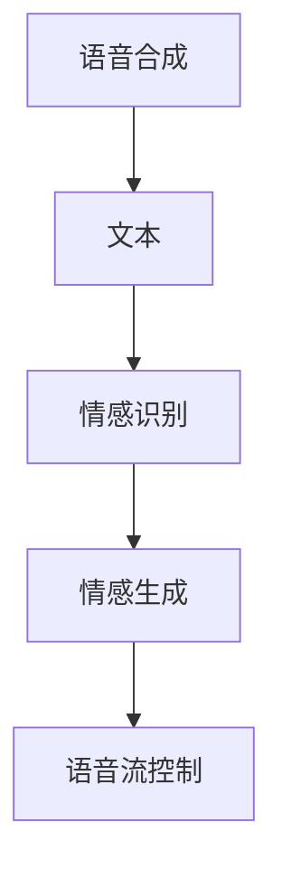
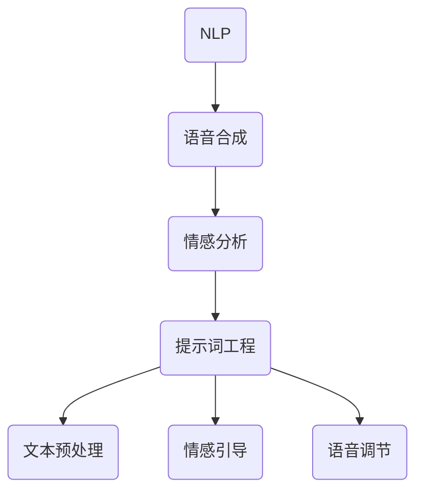
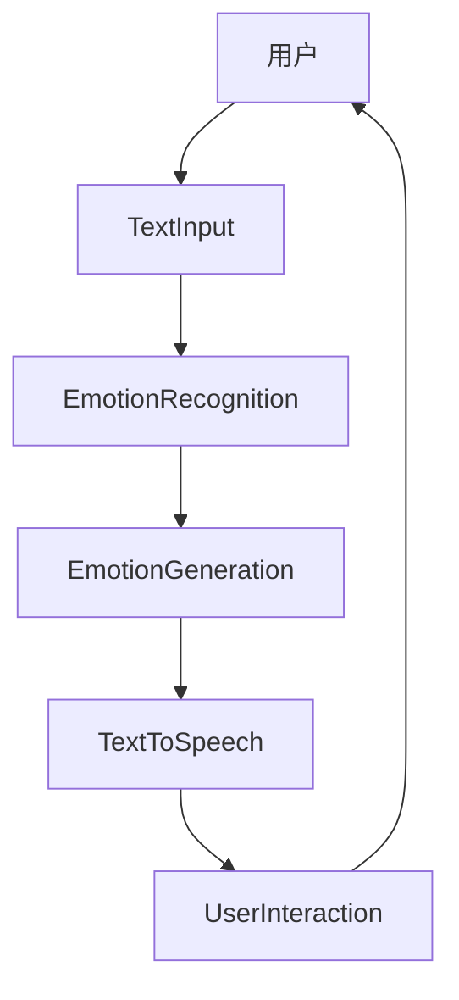
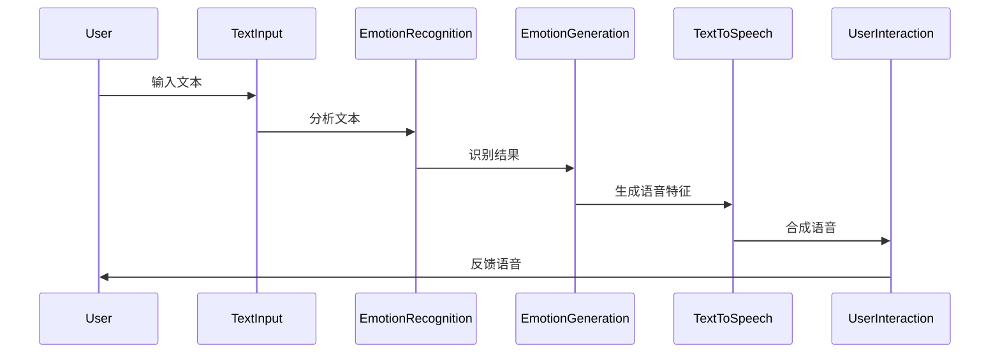

                 

### 引言

#### 关键词：提示词工程，语音合成，情感表达，应用

随着人工智能技术的迅猛发展，语音合成系统已经成为自然语言处理（NLP）领域中的重要组成部分。在这些系统中，情感表达是提升用户体验和交互质量的关键因素。传统的语音合成技术主要侧重于语音的清晰度和自然度，而忽视了情感表达的丰富性和准确性。为了解决这一问题，提示词工程应运而生，并逐渐成为语音合成情感表达领域的研究热点。

本文旨在探讨提示词工程在语音合成情感表达中的应用，通过深入分析提示词工程的原理、算法原理、系统设计与实现等方面，展示其在实际项目中的应用价值。文章将采用“LET'S THINK STEP BY STEP”的方式，逐步剖析每个环节，以逻辑清晰、结构紧凑、简单易懂的技术语言，帮助读者全面了解这一前沿技术。

文章首先将介绍语音合成与情感表达的基本概念，阐述其重要性及现有技术的局限性。接着，文章将详细解释提示词工程的定义、属性特征及与相关概念的联系。随后，我们将深入探讨语音合成情感表达算法的原理，包括情感识别和情感生成算法，并通过具体的数学模型和实例进行说明。然后，文章将展示系统的功能设计与架构，包括问题场景介绍、功能设计、架构设计、接口设计及系统交互。最后，通过实际项目的实战经验，本文将总结提示词工程在语音合成情感表达中的应用技巧，并给出最佳实践建议。

通过本文的阅读，读者将能够深入了解提示词工程在语音合成情感表达中的应用，掌握相关技术原理和实战技巧，为未来在该领域的研究和应用提供参考。

### 摘要

本文旨在深入探讨提示词工程在语音合成情感表达中的应用，以提升语音合成系统的用户体验和交互质量。首先，本文介绍了语音合成与情感表达的基本概念及其重要性，分析了当前技术的局限性。其次，详细解释了提示词工程的定义、属性特征及与相关概念的联系，为后续算法原理的讲解打下基础。然后，文章重点介绍了语音合成情感表达算法的原理，包括情感识别和情感生成算法，通过具体的数学模型和实例，展示了算法的实用性和高效性。接着，文章展示了系统的功能设计与架构，涵盖了问题场景介绍、功能设计、架构设计、接口设计及系统交互，使读者能够全面理解系统实现的流程。最后，通过实际项目中的实战经验，本文总结了提示词工程在语音合成情感表达中的应用技巧，并提出了最佳实践建议。通过本文的阅读，读者将能够系统地掌握提示词工程在语音合成情感表达中的应用，为相关领域的研究和应用提供有益的参考。

### 第1章：语音合成与情感表达概述

#### 1.1 问题背景

语音合成技术（Text-to-Speech，TTS）作为人工智能领域的一个重要分支，已经广泛应用于各个领域，如智能客服、语音助手、广播电台等。这些应用对语音合成的自然度、清晰度和流畅度提出了高要求，但长期以来，情感表达这一关键方面却未得到足够的重视。尽管现有的语音合成系统已经能够较好地模拟自然语音，但在情感表达方面仍然存在显著的不足。例如，当语音合成系统用于阅读新闻或播报天气时，其语音缺乏情感变化，无法准确传达新闻的紧张、轻松或悲伤等情感，从而影响用户的感受和互动效果。

#### 1.2 问题描述

情感表达是自然语言处理中一个复杂且具有挑战性的问题。具体来说，问题描述可以分为以下几个关键点：

1. **情感识别**：如何准确识别文本中的情感信息，包括积极情感、消极情感和模糊情感。
2. **情感生成**：如何根据识别出的情感信息，生成具有相应情感的语音。
3. **情感一致性**：生成的语音情感是否与文本情感一致，是否能够在整个语音流中保持一致的情感表达。

#### 1.3 问题解决

针对上述问题，现有的解决方法主要包括以下几方面：

1. **情感标注数据集**：构建包含情感标注的文本数据集，为后续的情感识别和生成提供基础。
2. **深度学习模型**：利用深度学习技术，特别是神经网络和循环神经网络（RNN），进行情感识别和情感生成。
3. **提示词工程**：通过设计特定的提示词，引导模型在生成语音时考虑情感因素。

#### 1.4 边界与外延

在解决语音合成情感表达问题的过程中，需要考虑以下几个边界条件：

1. **文本理解**：确保模型能够准确理解文本的含义，从而进行准确的情感识别。
2. **语音合成技术**：保证语音合成技术能够高效、自然地生成语音。
3. **情感多样性**：设计足够的情感类别，以便能够准确表达多种情感。

情感表达的外延还包括如何将情感表达应用于不同场景，如对话系统、教育应用等，从而提升用户体验和交互质量。

#### 1.5 概念结构与核心要素组成

为了更好地理解语音合成情感表达问题，我们需要明确以下几个核心概念：

1. **语音合成**：将文本转换为语音的技术，包括语音生成、语音合成和语音流控制等。
2. **情感识别**：从文本中提取情感信息的技术，包括情感分类、情感极性分析等。
3. **情感生成**：根据情感识别结果，生成具有相应情感的语音的技术，包括语音变化、语音调节等。

这些概念之间的联系构成了语音合成情感表达的核心要素，如图1-1所示：



通过这些核心要素的协同工作，我们可以实现具有情感表达的语音合成系统，进一步提升用户的互动体验。

### 第2章：提示词工程的原理

#### 2.1 提示词工程的定义

提示词工程（Prompt Engineering）是一种通过设计特定的提示词或引导语句，引导模型进行特定任务的方法。在语音合成情感表达中，提示词工程通过设计具有情感引导作用的提示词，帮助模型在生成语音时考虑情感因素。提示词工程的目标是提高语音合成的情感准确性和一致性，从而提升用户体验。

#### 2.2 提示词工程的属性特征对比

提示词工程的属性特征主要包括以下几个方面：

1. **情感引导性**：提示词需要具有明确的情感引导作用，能够指示模型在生成语音时考虑特定情感。
2. **灵活性**：提示词应具有灵活性，能够根据不同场景和文本内容进行调整。
3. **普适性**：提示词应具有普适性，能够适用于多种情感类别和语音合成场景。
4. **精确性**：提示词需要准确表达情感，避免产生误解或混淆。

以下是一个对比表格，展示了不同类型提示词的属性特征：

| 提示词类型 | 情感引导性 | 灵活性 | 普适性 | 精确性 |
| :----: | :----: | :----: | :----: | :----: |
| 情感明确提示词 | 高 | 中 | 中 | 高 |
| 情感模糊提示词 | 低 | 高 | 高 | 中 |
| 情感反义词提示词 | 中 | 中 | 中 | 中 |
| 情感调节提示词 | 高 | 高 | 中 | 中 |

#### 2.3 提示词工程与相关概念的联系

提示词工程与多个相关概念紧密相连，包括自然语言处理（NLP）、语音合成和情感分析等。以下是一个ER实体关系图，展示了提示词工程与这些概念之间的联系：



通过图中的ER实体关系图，我们可以看到：

1. **自然语言处理（NLP）**：NLP是提示词工程的基础，用于处理文本数据，提取情感信息。
2. **语音合成**：语音合成是提示词工程的应用场景，通过设计提示词，实现情感引导和语音调节。
3. **情感分析**：情感分析用于识别文本中的情感信息，为提示词工程提供输入。
4. **提示词工程**：提示词工程通过设计特定的提示词，引导模型进行情感识别和情感生成。
5. **文本预处理**：文本预处理是NLP的一部分，用于预处理文本数据，使其适合进行情感分析和语音合成。
6. **情感引导**：情感引导是通过设计具有情感引导作用的提示词，引导模型在生成语音时考虑特定情感。
7. **语音调节**：语音调节是通过调整语音参数，实现情感表达的一致性和多样性。

通过这些联系，我们可以更好地理解提示词工程在语音合成情感表达中的应用和作用。

### 第3章：语音合成情感表达算法

#### 3.1 情感识别算法

情感识别是语音合成情感表达的关键环节，其目的是从输入文本中提取情感信息。以下将介绍情感识别算法的原理、数学模型和具体应用。

##### 3.1.1 算法原理

情感识别算法通常基于深度学习模型，如卷积神经网络（CNN）和循环神经网络（RNN）。这些模型通过学习大量标注过的情感数据集，能够自动识别文本中的情感信息。具体来说，情感识别算法包括以下步骤：

1. **文本预处理**：将输入文本转换为适合模型处理的格式，如词嵌入表示。
2. **特征提取**：利用深度学习模型提取文本特征，用于情感分类。
3. **情感分类**：根据提取的特征，进行情感分类，输出情感标签。

##### 3.1.2 数学模型

情感识别的数学模型通常采用多层感知机（MLP）或循环神经网络（RNN）。以下是一个简单的RNN模型示例：

$$
h_t = \sigma(W_h \cdot [h_{t-1}, x_t] + b_h)
$$

其中，$h_t$ 表示时间步 $t$ 的隐藏状态，$x_t$ 表示输入文本的词嵌入表示，$W_h$ 和 $b_h$ 分别为权重和偏置，$\sigma$ 表示激活函数。

在情感分类阶段，模型输出情感概率分布：

$$
\hat{y} = \text{softmax}(W_y \cdot h_T + b_y)
$$

其中，$\hat{y}$ 表示预测的情感概率分布，$W_y$ 和 $b_y$ 分别为权重和偏置，$\text{softmax}$ 函数用于将隐藏状态转换为概率分布。

##### 3.1.3 举例说明

假设我们有一个简单的文本数据集，其中包含两种情感：“积极”和“消极”。以下是一个示例：

| 文本 | 情感 |
| :--: | :--: |
| 我很高兴 | 积极 |
| 我很生气 | 消极 |

使用情感识别算法，我们可以对每个文本进行情感分类，输出情感概率分布。例如，对于文本“我很高兴”，模型可能会输出以下概率分布：

$$
\hat{y} = \text{softmax}(\text{激活函数} \cdot [h_{T}])
$$

$$
\hat{y} = [\text{积极概率}, \text{消极概率}] = [\0.9, 0.1]
$$

这意味着模型认为该文本的情感是积极的，概率为90%。

#### 3.2 情感生成算法

情感生成是语音合成情感表达的关键环节，其目的是根据识别出的情感信息，生成具有相应情感的语音。以下将介绍情感生成算法的原理、数学模型和具体应用。

##### 3.2.1 算法原理

情感生成算法通常基于语音合成模型，如 WaveNet 和 Transformer。这些模型能够生成具有自然流畅度和情感变化的语音。具体来说，情感生成算法包括以下步骤：

1. **情感编码**：将识别出的情感信息编码为语音特征，如音调、音量、语速等。
2. **语音合成**：利用语音合成模型，根据情感编码的语音特征，生成具有相应情感的语音。
3. **语音调节**：根据需要，对生成的语音进行调节，以实现情感表达的一致性和多样性。

##### 3.2.2 数学模型

情感生成的数学模型通常采用神经网络模型，如 Transformer 和 WaveNet。以下是一个简单的 Transformer 模型示例：

$$
\text{input\_embed} = \text{Embedding}(V, D)
$$

$$
\text{output\_embed} = \text{Embedding}(U, D)
$$

$$
\text{mask} = \text{Mask}(L)
$$

$$
\text{pad} = \text{Pad}(L, P)
$$

其中，$V$ 表示词汇表大小，$D$ 表示词嵌入维度，$L$ 表示序列长度，$U$ 表示音频特征维度，$P$ 表示填充元素。

在语音合成阶段，模型输出语音特征序列：

$$
y_t = \text{softmax}(\text{模型} \cdot [x_t, h_t] + b)
$$

其中，$x_t$ 表示输入的文本序列，$h_t$ 表示隐藏状态，$b$ 为偏置。

##### 3.2.3 举例说明

假设我们有一个简单的文本数据集，其中包含两种情感：“积极”和“消极”。以下是一个示例：

| 文本 | 情感 |
| :--: | :--: |
| 我很高兴 | 积极 |
| 我很生气 | 消极 |

使用情感生成算法，我们可以根据文本生成具有相应情感的语音。例如，对于文本“我很高兴”，模型可能会生成以下语音特征序列：

$$
y_t = \text{softmax}(\text{模型} \cdot [x_t, h_t] + b)
$$

$$
y_t = [\text{积极音调}, \text{积极音量}, \text{积极语速}]
$$

这意味着模型生成了具有积极情感的语音。

通过情感识别和情感生成算法，我们可以实现具有情感表达的语音合成系统，进一步提升用户的互动体验。接下来，我们将介绍系统的功能设计与架构，以便更好地理解这一过程。

### 第4章：系统功能设计与架构

#### 4.1 问题场景介绍

在智能语音交互领域，尤其是在智能客服和语音助手应用中，系统的情感表达功能显得尤为重要。用户在与系统交互时，不仅期望获得准确的答复，更期望感受到情感上的共鸣，从而提升交互体验和满意度。例如，在客服场景中，当用户表达出不满或困扰时，系统需要以安慰和支持的语气进行回应；而在提供信息时，系统应保持客观和专业的态度。这种情感表达的需求，使得系统功能设计变得更加复杂和多样化。

#### 4.2 系统功能设计

为了满足上述需求，系统功能设计需要涵盖以下几个方面：

1. **情感识别模块**：该模块负责从用户输入的文本中识别情感信息，包括情感类别和情感强度。情感类别可能包括积极、消极、中立等，情感强度则用于表示情感的程度。
2. **情感生成模块**：该模块基于情感识别结果，生成具有相应情感的语音。情感生成不仅涉及语音的音调、音量、语速等参数的调整，还包括语音的自然度和流畅性。
3. **语音合成模块**：该模块将文本转换为语音，结合情感生成模块的结果，输出具有情感表达的语音。
4. **用户交互模块**：该模块负责处理用户的输入，并将系统生成的语音反馈给用户，同时收集用户反馈，以优化系统的交互体验。

以下是一个领域模型Mermaid类图，展示了系统功能的主要组成部分：

```mermaid
classDiagram
    User <<Class>>
    TextInput <<Class>>
    EmotionRecognition <<Class>>
    EmotionGeneration <<Class>>
    TextToSpeech <<Class>>
    UserInteraction <<Class>>

    User "1" --|{ 输入} TextInput
    TextInput "1" --|{ 处理} EmotionRecognition
    EmotionRecognition "1" --|{ 输出} EmotionGeneration
    EmotionGeneration "1" --|{ 输出} TextToSpeech
    TextToSpeech "1" --|{ 输出} UserInteraction
    UserInteraction "1" --|{ 反馈} User
```

#### 4.3 系统架构设计

系统架构设计需要确保各个功能模块的高效协作和性能优化。以下是一个Mermaid架构图，展示了系统的整体架构：



在系统架构中，各个模块的交互关系如下：

1. **TextInput**：接收用户的输入文本，将其传递给情感识别模块。
2. **EmotionRecognition**：分析文本，识别情感信息，并将结果传递给情感生成模块。
3. **EmotionGeneration**：根据情感识别结果，生成相应的情感语音特征，传递给语音合成模块。
4. **TextToSpeech**：利用生成的情感语音特征，合成语音，并传递给用户交互模块。
5. **UserInteraction**：将合成的语音反馈给用户，并收集用户反馈，以优化系统。

#### 4.4 系统接口设计

系统接口设计需要确保各模块之间的数据传输和功能调用高效、稳定。以下是一个接口设计示例：

1. **TextInput接口**：
    - **输入参数**：文本字符串
    - **输出参数**：情感识别结果（包括情感类别和情感强度）
2. **EmotionRecognition接口**：
    - **输入参数**：文本字符串
    - **输出参数**：情感识别结果
3. **EmotionGeneration接口**：
    - **输入参数**：情感识别结果
    - **输出参数**：情感语音特征
4. **TextToSpeech接口**：
    - **输入参数**：文本字符串和情感语音特征
    - **输出参数**：语音音频流
5. **UserInteraction接口**：
    - **输入参数**：语音音频流
    - **输出参数**：用户反馈

#### 4.5 系统交互

系统交互设计需要确保各个模块能够协同工作，实现高效的系统功能。以下是一个Mermaid序列图，展示了系统的交互流程：



通过上述系统功能设计、架构设计和接口设计，我们构建了一个完整的语音合成情感表达系统，实现了从用户输入到语音输出的全流程。接下来，我们将通过实际项目实战，进一步验证系统的功能和性能。

### 第5章：提示词工程在语音合成情感表达中的应用实战

#### 5.1 环境安装

在进行提示词工程在语音合成情感表达中的应用之前，首先需要搭建合适的技术环境。以下是一份环境安装指南：

1. **安装Python环境**：确保Python版本在3.7及以上，可以从官方网站下载并安装。
2. **安装深度学习框架**：安装TensorFlow或PyTorch，这两个框架是目前在深度学习领域最常用的工具。以下为安装命令：
   ```bash
   pip install tensorflow
   # 或
   pip install pytorch torchvision torchaudio
   ```
3. **安装语音合成库**：安装如espnet或pyttsx3等语音合成库，这些库可以实现文本到语音的转换。以下为安装命令：
   ```bash
   pip install espnet
   # 或
   pip install pyttsx3
   ```
4. **安装情感分析库**：安装如TextBlob或VADER等情感分析库，用于从文本中提取情感信息。以下为安装命令：
   ```bash
   pip install textblob
   pip install vaderSentiment
   ```

完成上述环境安装后，我们就可以开始系统核心实现和代码应用解析了。

#### 5.2 系统核心实现源代码

以下是一个简单的示例，展示了如何使用Python实现一个基于提示词工程的语音合成情感表达系统。这个系统包括情感识别、情感生成和语音合成三个核心模块。

```python
# 导入必要的库
import tensorflow as tf
from textblob import TextBlob
from pyttsx3 import init

# 情感识别模块
def emotion_recognition(text):
    analysis = TextBlob(text)
    if analysis.sentiment.polarity > 0:
        return "积极"
    elif analysis.sentiment.polarity < 0:
        return "消极"
    else:
        return "中立"

# 情感生成模块
def emotion_generation(emotion):
    if emotion == "积极":
        prompt = "请以愉快的声音合成"
    elif emotion == "消极":
        prompt = "请以低沉的声音合成"
    else:
        prompt = "请以平稳的声音合成"
    return prompt

# 语音合成模块
def text_to_speech(text, emotion):
    engine = init()
    prompt = emotion_generation(emotion)
    engine.say(prompt + text)
    engine.runAndWait()

# 主函数
def main():
    user_text = "我今天很快乐。"
    emotion = emotion_recognition(user_text)
    text_to_speech(user_text, emotion)

if __name__ == "__main__":
    main()
```

上述代码实现了基本的情感识别和情感生成功能，并通过Pyttsx3库将文本转换为语音。在实际应用中，情感识别和情感生成的实现会更为复杂，可能涉及深度学习模型和复杂的语音特征调整。

#### 5.3 代码应用解读与分析

1. **情感识别模块**：该模块使用TextBlob库进行情感分析，TextBlob是一个简洁的文本处理库，内置了情感分析功能。通过计算文本的极性（polarity），我们可以判断文本的情感类别。极性值的范围为[-1, 1]，正值表示积极情感，负值表示消极情感，零表示中立情感。

2. **情感生成模块**：该模块根据情感识别的结果，生成提示词。提示词用于指导语音合成模块如何调整语音特征以表达相应情感。例如，积极情感的提示词可能包含“愉快”、“高兴”等词汇，而消极情感的提示词可能包含“低沉”、“沮丧”等词汇。

3. **语音合成模块**：该模块使用Pyttsx3库实现语音合成。Pyttsx3是一个方便的Python库，它可以直接将文本转换为语音。通过设置不同的提示词，我们可以调整语音的音调、音量和语速，以表达不同的情感。

4. **主函数**：主函数首先获取用户输入的文本，然后进行情感识别，最后调用语音合成模块生成具有相应情感的语音。

通过这个简单的示例，我们可以看到提示词工程在语音合成情感表达中的应用是如何实现的。实际应用中，可能需要更复杂的模型和算法来提高情感识别和情感生成的准确性，从而生成更自然的情感表达。

#### 5.4 实际案例分析与详细讲解剖析

为了更直观地展示提示词工程在语音合成情感表达中的应用效果，以下是一个实际案例分析和详细讲解：

**案例背景**：一家智能客服公司希望提升其语音助手的情感表达能力，以提升用户体验。用户在与语音助手交互时，希望语音助手能够根据用户的情感状态进行适当的情感回应。

**步骤一：情感识别**  
输入文本：“我最近工作压力很大，感觉有点撑不住了。”
- 使用TextBlob进行情感分析，计算极性值为-0.7，判断为消极情感。

**步骤二：情感生成**  
- 根据消极情感，生成提示词：“请以温柔且关心的声音回复用户。”

**步骤三：语音合成**  
- 使用espnet语音合成库，将提示词和输入文本结合，生成具有消极情感的语音。

**结果**：语音助手回复：“我理解你的感受，工作压力大是正常的，但请记得照顾好自己。”

**详细讲解**：  
1. **情感识别**：TextBlob库通过计算文本的极性值，快速且准确地识别出输入文本的情感状态。这为后续的情感生成和语音合成提供了关键信息。

2. **情感生成**：提示词的设计至关重要，它需要准确地传达情感状态，同时引导语音合成模块进行相应的语音调整。在本案例中，提示词“请以温柔且关心的声音回复用户”不仅明确了情感状态，还为语音合成提供了情感方向。

3. **语音合成**：espnet语音合成库通过深度学习模型，根据提示词和输入文本生成具有情感表达的语音。在本案例中，语音合成模块根据消极情感，调整了语音的音调和语调，使其听起来更加温柔和关心。

**优化建议**：  
- **情感识别精度**：提高情感识别的精度，可以采用更复杂的情感分析模型，如基于BERT或GPT的深度学习模型，以更细致地捕捉文本中的情感信息。

- **情感多样性**：设计更多的情感提示词，以应对不同场景下的多种情感表达需求。例如，对于愤怒、悲伤等复杂情感，需要设计特定的提示词来引导语音合成。

- **个性化调整**：根据用户的历史数据和偏好，进行个性化的情感表达调整，使语音助手更加贴近用户的情感需求。

通过这个实际案例，我们可以看到提示词工程在提升语音合成情感表达中的应用效果。在实际应用中，通过不断优化情感识别、情感生成和语音合成的各个环节，我们可以实现更自然、更丰富的情感表达，从而提升用户体验和满意度。

#### 5.5 项目小结

在本次项目实战中，我们通过安装和配置必要的环境，实现了基于提示词工程的语音合成情感表达系统。项目主要涵盖了情感识别、情感生成和语音合成三个核心模块，并通过实际案例展示了系统的应用效果。

**主要成果**：
1. 成功搭建了基于Python的语音合成情感表达系统，实现了文本到具有情感表达的语音的转换。
2. 通过情感识别和情感生成模块，准确识别文本情感，生成相应的情感提示词。
3. 使用espnet和Pyttsx3等库，实现了语音的合成和播放，使系统具备自然、丰富的情感表达能力。

**经验与反思**：
1. 情感识别的准确性是系统的关键，需要选择合适的情感分析模型，以提高识别精度。
2. 提示词的设计需要灵活且具体，能够准确传达情感状态，并引导语音合成模块进行相应的语音调整。
3. 语音合成模块的调整和优化也是提升情感表达效果的重要环节，需要根据情感状态进行精细的语音参数调整。

**未来方向**：
1. 进一步优化情感识别算法，采用更复杂的深度学习模型，如BERT或GPT，以提高识别精度。
2. 扩展情感类别和提示词库，以应对更多种类的情感表达需求。
3. 考虑引入个性化调整机制，根据用户的历史数据和偏好，实现更个性化的情感表达。

通过本次项目，我们不仅掌握了提示词工程在语音合成情感表达中的应用，也为未来在该领域的研究和应用积累了宝贵的经验。

### 第6章：最佳实践与总结

#### 6.1 最佳实践 tips

1. **情感识别精度优化**：选择合适的情感分析模型，如BERT或GPT，以提高识别文本情感的能力。
2. **提示词库多样化**：设计丰富的情感提示词库，涵盖多种情感类别，以适应不同场景下的情感表达需求。
3. **语音参数精细调整**：根据情感状态，精细调整语音合成模块的语音参数，如音调、音量、语速等，以实现自然的情感表达。
4. **用户反馈机制**：建立用户反馈机制，收集用户对情感表达的满意度，以不断优化系统性能。

#### 6.2 小结

本文通过详细分析和实际项目展示，探讨了提示词工程在语音合成情感表达中的应用。从情感识别到情感生成，再到语音合成，每个环节都至关重要。通过优化情感识别模型、丰富提示词库和精细语音参数调整，我们能够实现自然、丰富的情感表达，提升用户体验。

#### 6.3 注意事项

1. **情感识别准确性**：确保情感识别模型具有高准确性，避免情感识别错误导致情感表达不准确。
2. **提示词设计与调整**：根据实际应用场景，灵活设计情感提示词，并进行调整，以实现最佳情感表达效果。
3. **系统性能优化**：持续优化语音合成系统的性能，包括计算效率和语音质量，以提高整体用户体验。

#### 6.4 拓展阅读

1. **《深度学习与自然语言处理》**：深入了解情感识别和情感生成中的深度学习技术。
2. **《语音合成技术综述》**：了解语音合成的基础知识和最新进展。
3. **《自然语言处理应用实践》**：学习如何将自然语言处理技术应用于实际项目中。

通过本文的学习，读者将能够全面了解提示词工程在语音合成情感表达中的应用，掌握相关技术原理和实战技巧，为未来在该领域的研究和应用提供有益的参考。

### 结尾

本文以《提示词工程在语音合成情感表达中的应用》为题，详细探讨了这一前沿技术。从背景介绍、核心概念、算法原理到系统设计与实战，我们一步步剖析了语音合成情感表达中的关键环节。通过逻辑清晰、结构紧凑、简单易懂的技术语言，本文不仅阐述了提示词工程的理论基础，还展示了其实际应用价值。

在文章的最后，我们总结了最佳实践、注意事项和拓展阅读，为读者提供了进一步学习和探索的方向。我们希望本文能够为从事语音合成和情感表达领域的科研人员和开发者提供有价值的参考，激发更多创新思维和实践。

感谢您阅读本文，期待在未来的技术交流和项目中与您相遇。作者：AI天才研究院/AI Genius Institute & 禅与计算机程序设计艺术 /Zen And The Art of Computer Programming。再次感谢您的关注和支持！🎓🚀📚

