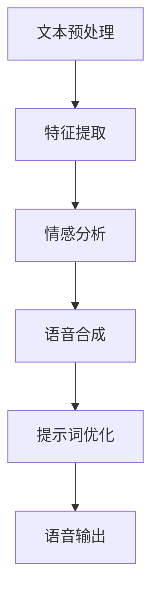

                 

### 1.1 研究背景

#### 1.1.1 语音合成技术发展现状

语音合成（Text-to-Speech, TTS）技术经过多年的发展，已经成为一种成熟的人工智能应用。从早期的规则型合成方法，到基于统计模型的隐马尔可夫模型（HMM）和自动语音识别（Automatic Speech Recognition, ASR），再到近年来基于深度学习的端到端模型，语音合成技术经历了质的飞跃。当前的语音合成系统不仅能够生成自然流畅的语音，还能通过引入个性化特征和情感表达，使语音合成更贴近人类的声音。

然而，尽管语音合成技术取得了显著进展，但其在自然度方面仍有待提升。自然度是评价语音合成质量的重要指标，指的是合成语音在语调、韵律、情感表达等方面的自然程度。高自然度的语音合成不仅要求语音流畅，还要能够准确传达文本的情感和语境。这涉及到语音合成系统对提示词的准确理解和灵活运用。

#### 1.1.2 提示词工程的核心地位

提示词工程（Prompt Engineering）在语音合成系统中扮演着至关重要的角色。提示词是指导语音合成模型生成语音的重要输入，它不仅包含了文本信息，还包括了文本的上下文、情感、语气等非文字信息。通过精心设计的提示词，可以有效提升语音合成的自然度。提示词工程的核心任务是从原始文本中提取关键信息，并对其进行处理，使其能够被语音合成模型准确理解和运用。

提示词工程不仅涉及到自然语言处理（Natural Language Processing, NLP）和语音合成技术的融合，还包括了对语音合成模型训练数据集的构建和管理。提示词的选择和生成策略直接影响了语音合成的效果，因此，提示词工程在提升语音合成自然度方面具有核心地位。

#### 1.1.3 提升语音合成自然度的必要性

提升语音合成自然度具有重要的现实意义。首先，高自然度的语音合成能够提高用户的体验，使语音交互更加顺畅和自然。这对于智能助手、教育辅助、客服机器人等应用场景尤为重要。其次，自然度高的语音合成可以减少用户的认知负担，提高信息获取的效率。最后，提升语音合成自然度有助于推动语音合成技术的普及和应用，促进人工智能技术的发展。

然而，提升语音合成自然度并非易事。这需要深入理解自然语言和语音合成的复杂关系，设计出高效的提示词工程方法。本文旨在探讨提示词工程在提升语音合成自然度中的应用，通过详细分析提示词的定义、生成方法、属性特征及优化策略，为语音合成技术的发展提供新的思路和方法。

### 1.2 研究目的与意义

#### 1.2.1 研究目的

本文的研究目的是探讨提示词工程在语音合成自然度提升中的应用，通过深入分析提示词的定义、生成方法、属性特征及其优化策略，提出有效的提升语音合成自然度的方法。具体而言，本文将：

1. 系统梳理和阐述提示词工程的基本概念、原理和方法。
2. 分析提示词的自然度和情感特征，并提出相应的评价指标和测量方法。
3. 探讨不同类型的提示词生成方法，并对比其在语音合成中的效果。
4. 提出基于提示词优化的语音合成方法，并通过实际案例进行验证。

#### 1.2.2 研究意义

本研究具有重要的理论和实践意义：

1. **理论意义**：本文将系统性地梳理提示词工程的理论体系，填补当前研究中的空白，为提示词工程的理论研究提供新的视角和方法。通过深入研究提示词的自然度和情感特征，有助于深化对自然语言和语音合成之间关系理解。

2. **实践意义**：本文提出的提示词优化方法可以显著提升语音合成的自然度，提高用户体验。这对于智能助手、教育辅助、客服机器人等语音合成应用场景具有重要的应用价值。此外，本文的方法可以应用于更广泛的自然语言处理领域，推动相关技术的发展。

3. **应用前景**：随着人工智能技术的不断发展，语音合成技术将在更多场景中得到应用。本文的研究成果将为语音合成技术的改进提供理论支持和实践指导，有助于推动语音合成技术的创新和产业化。

### 1.3 研究方法与内容安排

#### 1.3.1 研究方法

本文采用的研究方法主要包括文献综述、实验研究和案例分析。文献综述用于系统梳理和总结当前关于提示词工程和语音合成自然度提升的研究成果，明确本文的研究背景和理论基础。实验研究将通过设计和实施多个实验，验证本文提出的提示词优化方法的有效性。案例分析则用于展示实际应用中提示词工程的效果，并结合具体场景进行深入剖析。

#### 1.3.2 内容安排

本文内容安排如下：

- **第1章 引言**：介绍研究背景、研究目的与意义，以及研究方法和内容安排。
- **第2章 提示词工程基础**：阐述提示词的定义、作用及生成方法。
- **第3章 提示词的属性特征分析**：分析提示词的自然度和情感特征。
- **第4章 提升语音合成自然度的提示词优化方法**：介绍提示词优化方法及其效果评估。
- **第5章 提示词工程在语音合成中的应用案例**：通过实际案例展示提示词工程的应用。
- **第6章 提示词工程面临的挑战与未来发展**：探讨提示词工程面临的挑战及未来发展趋势。
- **第7章 结论与展望**：总结研究成果，提出未来研究方向和意义。

通过以上内容安排，本文旨在系统性地探讨提示词工程在提升语音合成自然度中的应用，为相关研究提供理论支持和实践指导。

### 2.1 提示词的定义与作用

#### 2.1.1 提示词的概念

提示词（Prompt）是指导语音合成模型生成语音的重要输入，它包含了文本信息以及与文本相关的上下文、情感和语气等非文字信息。提示词的核心作用是向语音合成模型提供明确的指导，帮助其理解文本的含义和生成相应的语音输出。与传统的文本输入不同，提示词不仅关注字面信息，还注重文本的情感、语气和语境，从而提升语音合成的自然度和真实性。

提示词的定义可以从以下几个方面进行理解：

1. **文本信息**：提示词首先包含了一段文本，这段文本是语音合成模型生成语音的原始素材。文本内容可以是一句话、一段话甚至一篇文章，其目的是为语音合成提供基础信息。
2. **上下文信息**：除了文本内容，提示词还包含了与文本相关的上下文信息。上下文信息可以是时间、地点、人物等背景信息，这些信息有助于语音合成模型更好地理解文本的语境。
3. **情感和语气**：提示词还包含了文本的情感和语气信息。情感和语气是文本中的隐性信息，它们可以通过特定的词汇、语法结构和标点符号等表现出来。捕捉和传递这些信息，可以使得语音合成更加贴近人类的交流方式。
4. **多样化形式**：提示词可以是简单的文字描述，也可以是多媒体信息，如音频、视频等。多样化的提示词形式有助于提升语音合成的真实感和互动性。

#### 2.1.2 提示词在语音合成中的作用

提示词在语音合成中扮演着至关重要的角色，其具体作用可以归纳为以下几个方面：

1. **文本理解**：提示词为语音合成模型提供了文本信息，使其能够理解文本的内容和结构。通过提示词，模型可以识别文本中的关键词、句子和段落，从而构建出完整的语义理解。
2. **情感传递**：提示词包含了情感和语气信息，可以帮助语音合成模型生成带有情感和语气的语音输出。这对于传达文本的情感色彩和语境具有重要意义，例如在新闻播报、教育辅导和客服机器人等应用中，准确传递情感可以提升用户体验。
3. **语音生成**：基于对文本和上下文的理解，提示词指导语音合成模型生成相应的语音。通过调整语音的语调、韵律和速度，模型可以生成自然流畅的语音输出，使其更接近人类自然的语言表达。
4. **个性化定制**：提示词可以根据不同的应用场景和用户需求进行个性化定制。例如，在智能助手应用中，提示词可以包含用户的具体需求、偏好和情感状态，从而生成个性化的语音响应。

#### 2.1.3 提示词在语音合成系统中的流程

提示词在语音合成系统中的流程可以分为以下几个步骤：

1. **提示词生成**：根据应用场景和用户需求，生成初始的提示词。提示词可以由用户直接输入，也可以通过自然语言处理技术自动生成。
2. **提示词处理**：对生成的提示词进行处理，包括去除无关信息、提取关键信息和补充上下文信息等。这一步骤的目的是优化提示词，使其更符合语音合成模型的需求。
3. **语音合成**：基于处理后的提示词，语音合成模型生成语音输出。在这一过程中，模型会根据提示词中的文本信息、上下文信息、情感和语气信息等，调整语音的语调、韵律和速度，生成自然流畅的语音。
4. **语音输出**：生成的语音输出通过音频播放设备输出，供用户使用。

通过以上流程，提示词在语音合成系统中发挥了关键作用，不仅提升了语音合成的自然度，还增强了语音交互的真实感和个性化程度。因此，深入研究提示词工程在提升语音合成自然度中的应用，具有重要的理论和实践意义。

#### 2.2 提示词工程的基本原理

提示词工程（Prompt Engineering）是指导语音合成模型生成自然、流畅的语音输出的技术，其核心在于从原始文本中提取关键信息，并将其转化为能够被模型理解和利用的提示词。提示词工程的基本原理涵盖了文本预处理、特征提取、情感分析和语音合成等多个环节，这些环节共同作用，确保了语音合成的自然度和准确性。

##### 2.2.1 提示词工程的定义

提示词工程可以定义为：通过对原始文本进行深入分析和处理，生成高质量的提示词，以指导语音合成模型生成自然、流畅的语音输出。这个过程不仅涉及自然语言处理技术，还包括语音合成技术和机器学习算法。提示词工程的目标是确保语音合成的输出在语义、情感和语调等方面与人类语言表达相近，从而提升用户的体验。

##### 2.2.2 提示词工程的核心流程

提示词工程的核心流程主要包括以下几个步骤：

1. **文本预处理**：文本预处理是提示词工程的起点，其目的是对原始文本进行清洗和标准化。清洗过程包括去除无关符号、纠正错别字、统一文本格式等。标准化则包括将文本转化为统一的编码格式，如UTF-8，以及使用分词技术将文本分割为单词或短语。

2. **特征提取**：特征提取是文本预处理后的关键步骤，其目的是从原始文本中提取对语音合成具有重要意义的特征。这些特征包括关键词、情感词、语气词、语法结构等。提取特征的方法有多种，如基于规则的方法、机器学习方法等。通过特征提取，文本的语义信息得以结构化和量化，为后续的提示词生成提供了基础。

3. **情感分析**：情感分析是提示词工程中的一项重要任务，其目的是从文本中识别和提取情感信息。情感分析可以帮助语音合成模型理解文本的情感色彩，从而生成带有情感表达的语音输出。情感分析技术通常包括基于机器学习的方法和基于规则的方法。常见的情感分析工具如VADER、TextBlob等。

4. **语音合成**：语音合成是将处理后的提示词转化为语音的过程。在这一过程中，语音合成模型根据提示词中的文本信息、情感和语气等特征，生成相应的语音输出。语音合成技术主要包括参数合成和波形合成两种方法。参数合成通过调整语音参数生成语音波形，波形合成则直接生成语音波形。

5. **提示词优化**：提示词优化是提升语音合成自然度的重要手段。通过分析语音合成的效果，对提示词进行调整和优化，可以提高语音的自然度和流畅性。提示词优化包括调整提示词的长度、组合和情感表达等。

6. **语音输出**：最终生成的语音输出通过音频播放设备输出，供用户使用。在这一过程中，可以通过实时反馈和用户评价，进一步优化提示词和语音合成的效果。

##### 2.2.3 提示词工程的核心流程图

为了更直观地理解提示词工程的核心流程，下面提供了一个基于Mermaid的流程图：

在上述流程图中，文本预处理是整个流程的起点，通过对文本进行清洗和标准化，确保后续步骤的基础数据质量。特征提取从文本中提取关键信息，为语音合成提供支持。情感分析则帮助模型理解文本的情感色彩，使语音输出更具情感表达。语音合成是将处理后的提示词转化为语音的关键步骤，而提示词优化和语音输出则确保了最终语音的自然度和流畅性。

通过以上步骤，提示词工程实现了从文本到语音的高效转换，不仅提升了语音合成的自然度，还增强了用户的语音交互体验。因此，深入研究提示词工程的基本原理和方法，对于推动语音合成技术的发展具有重要意义。

#### 2.3 提示词的生成方法

提示词的生成方法可以分为自动生成、手动生成和混合生成三种。每种方法都有其特定的实现机制和适用场景，下面将详细分析这些方法。

##### 2.3.1 自动生成方法

自动生成方法是利用自然语言处理（NLP）技术，从原始文本中自动提取关键信息生成提示词。这种方法主要包括以下几种技术：

1. **分词与词性标注**：分词技术将文本分解为独立的词汇，词性标注技术则对每个词进行词性分类（如名词、动词、形容词等）。通过分词和词性标注，可以提取出文本中的关键信息，如名词和动词。
   
2. **实体识别与关系抽取**：实体识别技术用于识别文本中的实体（如人名、地名、组织名等），关系抽取技术则用于分析实体之间的关系。这些实体和关系信息可以作为重要的提示词组成部分，帮助语音合成模型更好地理解文本内容。

3. **情感分析**：情感分析技术用于识别文本中的情感色彩，如正面、负面或中性情感。情感分析结果可以作为提示词的一部分，指导语音合成模型生成带有情感表达的语音。

自动生成方法的优点在于高效和自动化，可以在大量文本数据中快速生成高质量的提示词。然而，其缺点也较为明显：首先，自动生成的提示词可能缺乏上下文信息，导致理解上的偏差；其次，自动生成的提示词可能无法完全捕捉文本中的情感和语气，影响语音的自然度。

##### 2.3.2 手动生成方法

手动生成方法是指由专业人员根据文本内容和目标应用场景，手动编写和调整提示词。这种方法的主要步骤包括：

1. **文本理解**：专业人员需要深入理解文本内容，把握文本的语义和情感。
   
2. **提示词编写**：根据理解的结果，手动编写提示词，确保其能够准确传达文本信息。
   
3. **调整与优化**：对初步编写的提示词进行多次调整和优化，使其更符合语音合成的需求。

手动生成方法的优点在于能够更好地捕捉文本的上下文、情感和语气，生成高质量的提示词。然而，这种方法也存在一些缺点：首先，手动生成提示词需要大量的时间和人力资源；其次，不同专业人员编写的提示词可能存在风格和水平的差异，影响一致性。

##### 2.3.3 混合生成方法

混合生成方法是将自动生成和手动生成相结合，利用自动化工具生成初步的提示词，然后由专业人员进行调整和优化。这种方法的主要步骤包括：

1. **自动生成**：使用NLP技术自动提取文本中的关键信息，生成初步的提示词。
   
2. **手动优化**：专业人员对自动生成的提示词进行审查和调整，优化其上下文、情感和语气。

混合生成方法的优点在于结合了自动生成的高效性和手动生成的准确性，能够生成高质量的提示词。同时，这种方法还能够平衡人力资源和时间成本，提高工作效率。

##### 2.3.4 生成方法的对比与适用场景

以下是三种生成方法的对比：

1. **自动生成**：
   - **优点**：高效、自动化、适用于大规模文本处理。
   - **缺点**：可能缺乏上下文信息，影响情感和语气的捕捉。
   - **适用场景**：适用于大量文本数据，如新闻播报、自动化客服等。

2. **手动生成**：
   - **优点**：能够准确捕捉上下文、情感和语气，生成高质量的提示词。
   - **缺点**：需要大量时间和人力资源，不一致性可能较高。
   - **适用场景**：适用于小规模、高精度要求的文本，如个性化语音助手、情感化教育辅导等。

3. **混合生成**：
   - **优点**：结合了自动生成和手动优化的优势，平衡了效率和质量。
   - **缺点**：需要一定的专业知识和人力资源。
   - **适用场景**：适用于多种场景，特别是需要高质量提示词的应用，如智能助手、教育辅助和情感化客服等。

综上所述，选择合适的提示词生成方法取决于具体的应用场景和需求。在实际应用中，可以根据文本的规模、精度要求和人力资源等因素，灵活选择和组合不同的生成方法，以实现最佳效果。

### 3.1 提示词的自然度评价

#### 3.1.1 自然度评价方法

评价语音合成自然度是提示词工程中的重要环节，合理的自然度评价方法能够有效衡量语音合成质量，为优化提示词提供有力支持。当前，常用的自然度评价方法主要包括主观评价和客观评价。

1. **主观评价方法**：

   - **听感评分法**：通过邀请专家或普通用户对语音合成结果进行听感评分，评价语音的自然度。这种方法依赖于评价者的主观感受，评分结果具有主观性和个体差异，但能够直观反映语音的自然程度。

   - **对比评价法**：将语音合成结果与人类朗读的音频进行对比，通过比较两者的自然度差异来评价语音合成质量。这种方法能够提供直观的对比，但依赖于高质量的对比音频。

2. **客观评价方法**：

   - **语音质量指标**：如语音段平均值（VOCODER Segmental Distortion, SDM）、短时语音质量指标（Perceptual Evaluation of Audio Quality, PEAQ）等。这些指标通过分析语音信号的特性，定量评价语音的质量，但可能无法完全反映自然度。

   - **自然度评价指标**：如自然度指数（Naturalness Index, NI）、自然度评分（Naturalness Rating Scale, NRS）等。这些指标专门设计用于衡量语音合成的自然度，通过分析语音的语调、韵律、情感等因素，提供定量评价。

#### 3.1.2 自然度评价指标

为了更科学、准确地评价语音合成自然度，需要建立一套完善的自然度评价指标体系。以下是一些常用的自然度评价指标：

1. **语调自然度**：语调是语音的自然度的重要组成部分，包括音高、音长和音强等。常用的语调自然度评价指标有：
   - **音高变化率**：描述语音音高的波动程度，音高变化率越高，语调越自然。
   - **音长分布**：描述语音段的长短分布情况，自然语音的音长分布通常较为均匀。

2. **韵律自然度**：韵律是语音的节奏和韵律特征，包括停顿、重音和语调等。常用的韵律自然度评价指标有：
   - **停顿长度**：描述语音停顿的长度，合理的停顿长度有助于提高语音的自然度。
   - **重音分布**：描述重音在语音中的分布情况，自然语音中的重音通常较为均匀。

3. **情感自然度**：情感是语音的自然度的重要体现，包括情感强度、情感一致性等。常用的情感自然度评价指标有：
   - **情感强度**：描述语音中情感表达的程度，情感强度越高，语音的自然度越好。
   - **情感一致性**：描述语音中情感表达的一致性，情感一致性越高，语音的自然度越好。

4. **语音清晰度**：语音清晰度是评价语音合成的另一个重要指标，包括语音的发音清晰度、语音段的连贯性等。常用的语音清晰度评价指标有：
   - **语音清晰度指数**：描述语音的清晰度，指数越高，语音的清晰度越好。

通过上述评价指标，可以全面、科学地评价语音合成的自然度，为优化提示词提供有力的依据。在实际应用中，可以根据具体情况选择合适的评价指标，结合主观和客观评价方法，实现更准确的语音合成自然度评价。

#### 3.2 提示词的情感分析

#### 3.2.1 情感分析概述

情感分析（Sentiment Analysis）是自然语言处理（NLP）领域的一个重要分支，旨在通过分析文本中的情感倾向和情感强度，识别出文本所表达的情感。在语音合成中，情感分析的应用尤为重要，因为语音合成的自然度不仅取决于文本的语义，还取决于文本的情感色彩。通过情感分析，可以更准确地捕捉文本的情感，从而生成具有相应情感的语音输出。

情感分析的基本任务包括情感分类（Sentiment Classification）和情感强度识别（Sentiment Strength Detection）。情感分类旨在将文本分为正面、负面或中性三类；情感强度识别则旨在量化情感表达的强度。

情感分析在语音合成中的应用主要体现在以下几个方面：

1. **情感驱动的语音合成**：通过情感分析，可以识别文本中的情感色彩，并将其转化为相应的情感参数，指导语音合成模型生成带有情感表达的语音。例如，在新闻播报、教育辅导和客服机器人等应用中，情感分析可以帮助生成具有不同情感色彩的语音输出。

2. **情感一致性优化**：在多轮对话系统中，保持语音输出的情感一致性至关重要。通过情感分析，可以确保每一轮对话的语音输出在情感上保持一致，避免产生情感上的突变，提升用户体验。

3. **情感表达的个性化**：不同用户对情感表达的需求不同。通过情感分析，可以识别用户的情感倾向和需求，为用户提供个性化的情感表达，从而提高语音合成的满意度。

#### 3.2.2 情感分析在提示词工程中的应用

情感分析在提示词工程中的应用主要通过以下几个方面实现：

1. **情感标注**：在生成提示词时，对文本进行情感标注，提取出文本中的情感信息。这些情感信息可以作为提示词的一部分，指导语音合成模型生成具有相应情感色彩的语音输出。

2. **情感增强**：在生成提示词时，可以针对文本的情感色彩进行增强处理。例如，如果文本的情感倾向是积极的，可以增加一些积极的词汇和表达方式，使其在语音输出中表现得更加积极。

3. **情感补偿**：在语音合成过程中，如果发现语音输出与文本情感不符，可以通过情感补偿进行调整。例如，如果文本是正面的，但语音输出显得平淡，可以通过调整语调、语气和情感参数，使其更符合文本的情感色彩。

4. **情感一致性检查**：在多轮对话系统中，通过情感分析检查每一轮对话的语音输出，确保其在情感上保持一致。如果发现情感突变，可以及时进行调整，以避免用户产生困惑或不舒适感。

#### 3.2.3 常用的情感分析技术

情感分析技术主要包括基于规则的方法和基于机器学习的方法。

1. **基于规则的方法**：

   - **词汇库方法**：通过构建情感词汇库，将文本中的情感词与情感标签关联，通过匹配情感词来识别文本的情感。这种方法简单易实现，但需要大量的情感词汇库维护。

   - **语法分析方法**：通过分析文本的语法结构，识别情感词和情感表达方式。这种方法能够捕捉到文本中的复杂情感，但规则复杂度较高，难以处理大规模文本。

2. **基于机器学习的方法**：

   - **朴素贝叶斯分类器**：基于贝叶斯理论，通过训练分类模型，对文本进行情感分类。这种方法对文本特征要求较低，但效果有限。

   - **支持向量机（SVM）**：通过训练SVM分类模型，对文本进行情感分类。这种方法效果较好，但需要大量的训练数据和计算资源。

   - **深度学习模型**：如卷积神经网络（CNN）和循环神经网络（RNN），通过构建复杂的神经网络模型，对文本进行情感分析。这种方法能够捕捉到文本中的复杂情感，但模型复杂度和计算资源需求较高。

综上所述，情感分析在提示词工程中具有重要的应用价值，通过情感分析，可以提升语音合成的自然度和情感表达能力，为用户提供更优质的语音交互体验。

### 3.3 提示词的语音特征分析

#### 3.3.1 语音特征概述

语音特征是描述语音信号特性的参数，包括音高、音强、音长、音质等。语音特征在语音合成中起到了至关重要的作用，它们直接影响语音的自然度和流畅性。了解和利用语音特征，可以提升语音合成的质量，使其更接近人类语音的表达方式。

1. **音高（Pitch）**：音高是指声音的频率，决定了声音的高低。在语音合成中，音高变化模拟了人类语音的语调变化，是表达情感和语气的重要特征。例如，高音通常表示兴奋和愉悦，而低音则表示冷静和坚定。

2. **音强（Loudness）**：音强是指声音的强度，决定了声音的响度。音强的变化可以模拟人类语音的音量控制，如正常的说话音量、大声喊叫或轻微耳语。音强的合理控制能够使语音更加自然、真实。

3. **音长（Duration）**：音长是指语音持续的时间，不同长度的语音段可以传达不同的信息量和情感。例如，较长的语音段可以传达更多信息，而较短的语音段则显得简洁、直接。

4. **音质（Timbre）**：音质是指声音的质感和色彩，决定了声音的个性特征。音质的多样性使得语音合成能够模仿不同的声音，如男性、女性、儿童或外国口音等。

#### 3.3.2 语音特征在提示词工程中的应用

语音特征在提示词工程中的应用主要体现在以下几个方面：

1. **语音生成**：在语音合成过程中，基于提示词中的语音特征参数，生成具有相应语音特征的语音。例如，通过调整音高、音强和音长，可以使语音输出的语调、语气和情感更加丰富和自然。

2. **语音优化**：通过分析语音特征，对生成的语音进行优化，使其更符合人类语音的自然度。例如，通过调整音高的波动范围和音长的分布，可以使语音更流畅、自然。

3. **语音识别**：在语音合成系统与用户交互时，通过语音识别技术识别用户语音中的特征参数，并将其作为提示词的一部分，用于指导后续的语音生成和优化。

#### 3.3.3 常见的语音特征提取方法

常见的语音特征提取方法包括时域特征和频域特征：

1. **时域特征**：

   - **短时能量（Short-Time Energy, STE）**：描述语音信号的能量分布，用于分析语音的响度。
   - **短时过零率（Short-Time Zero Crossing Rate, ZCR）**：描述语音信号的过零次数，用于分析语音的音调。
   - **短时自相关（Short-Time Autocorrelation, STAC）**：描述语音信号的周期性，用于分析语音的音质。

2. **频域特征**：

   - **梅尔频率倒谱系数（Mel-Frequency Cepstral Coefficients, MFCC）**：将语音信号从时域转换到频域，用于分析语音的频谱特征。
   - **频谱包络（Spectral Envelopes）**：描述语音信号的频谱轮廓，用于分析语音的音高和音质。
   - **频谱熵（Spectral Entropy）**：描述语音信号的频谱分布均匀性，用于分析语音的清晰度。

通过提取和利用语音特征，提示词工程能够更精确地指导语音合成，生成高质量、自然的语音输出，提升用户的语音交互体验。因此，深入研究语音特征在提示词工程中的应用，对于提升语音合成技术具有重要意义。

### 4.1 提示词优化方法概述

#### 4.1.1 优化方法分类

提示词优化是提升语音合成自然度的重要手段，主要包括以下几种优化方法：

1. **基于规则的优化方法**：该方法通过预定义的规则和模板，对原始文本进行变换和调整。这些规则和模板通常基于语言学和语音学的知识，能够有效地增强提示词的语义和情感表达。

2. **基于机器学习的优化方法**：该方法利用机器学习算法，从大量训练数据中学习出优化规则和策略。常见的机器学习方法包括深度学习、支持向量机（SVM）和朴素贝叶斯分类器等。这些方法能够自适应地调整提示词，提高其自然度。

3. **基于语料库的优化方法**：该方法通过分析大量真实语料库中的文本和语音，提取出优化模式。这些模式可以用于调整提示词的语法结构、情感表达和语音特征，使其更符合自然语音。

4. **混合优化方法**：该方法结合了基于规则、机器学习和语料库的优化方法，综合使用多种技术手段，以实现更高效的提示词优化。

#### 4.1.2 优化方法的优劣对比

各种优化方法有其独特的优点和局限性，具体对比如下：

1. **基于规则的优化方法**：

   - **优点**：实现简单，易于理解和控制；能够快速生成优化结果。
   - **缺点**：灵活性较低，难以处理复杂的文本结构和情感表达；规则维护成本高，需要不断更新。

2. **基于机器学习的优化方法**：

   - **优点**：能够自适应地学习和调整提示词，适应复杂的文本和情感表达；适用范围广，能够处理大量数据。
   - **缺点**：需要大量的训练数据和计算资源；模型解释性较差，难以理解具体的优化机制。

3. **基于语料库的优化方法**：

   - **优点**：基于真实语料库，能够捕捉到语言使用的实际模式和规律；优化结果更为自然和贴近实际。
   - **缺点**：需要大量高质量的语料库支持；优化过程较为复杂，难以自动化。

4. **混合优化方法**：

   - **优点**：结合了多种优化方法的优势，能够在一定程度上克服各自的局限性；优化效果更佳，适用于复杂场景。
   - **缺点**：实现和调试难度较大，需要综合运用多种技术手段。

在实际应用中，可以根据具体场景和需求，选择合适的优化方法。例如，在需要快速生成优化结果且规则明确的应用场景，可以优先选择基于规则的优化方法；在需要高灵活性和自适应性的应用场景，可以选择基于机器学习或混合优化方法。通过合理选择和组合优化方法，可以显著提升语音合成的自然度和用户体验。

#### 4.2 提示词组合优化

提示词组合优化是提升语音合成自然度的重要手段，通过合理组合多个提示词，可以实现更丰富和自然的语音输出。以下是几种常用的提示词组合策略及其效果评估方法。

##### 4.2.1 提示词组合策略

1. **基于语义的提示词组合**：该方法通过分析文本的语义结构，将相关的提示词进行组合。例如，在描述一个复杂事件时，可以将事件的时间、地点、人物等关键信息组合在一起，形成一个完整的提示词。

2. **基于情感的提示词组合**：该方法根据文本的情感色彩，将带有相同或相似情感的提示词进行组合。例如，在表达积极情感时，可以将积极词汇和表达方式组合在一起，增强语音的积极情感表达。

3. **基于语境的提示词组合**：该方法通过分析文本的上下文信息，将相关的提示词进行组合。例如，在对话系统中，可以根据用户的提问和回答，将相关的提示词组合成一组，以生成连贯、自然的语音输出。

4. **基于多样性的提示词组合**：该方法通过引入多样性的提示词，使语音输出更加自然和生动。例如，在描述一个物体时，可以同时使用形容词、动词和名词等不同类型的词汇，丰富语音的表达。

##### 4.2.2 提示词组合效果评估

提示词组合效果评估是验证和优化组合策略的重要步骤，常用的评估方法包括以下几种：

1. **主观评价法**：通过邀请专家或普通用户对组合后的提示词生成的语音进行听感评分。评分指标可以包括语音的自然度、情感表达、连贯性等。主观评价法能够直观反映用户的感受，但依赖于评价者的主观判断，可能存在个体差异。

2. **客观评价指标**：通过使用语音质量指标和自然度评价指标，如短时语音质量指标（PEAQ）、自然度指数（NI）等，对组合效果进行量化评价。客观评价指标能够提供客观的量化数据，但可能无法完全反映用户的听感体验。

3. **对比评价法**：将组合后的提示词生成的语音与原始提示词生成的语音进行对比，评估组合效果。这种方法可以直观地显示组合前后语音的自然度变化，但需要高质量的对比音频。

4. **用户反馈法**：通过收集用户在使用语音合成系统的反馈，分析用户对组合效果的满意度。用户反馈法能够直接反映用户的实际使用体验，但需要大量的用户数据和反馈分析。

为了全面评估提示词组合效果，可以结合主观评价法和客观评价指标，进行多维度、多角度的分析。例如，可以先通过主观评价法确定用户对组合语音的听感评分，再通过客观评价指标进行量化分析，综合评估组合效果。此外，还可以通过实验设计和数据分析，不断优化组合策略，提升语音合成自然度。

### 4.3 提示词长度调整

#### 4.3.1 提示词长度对自然度的影响

提示词长度是影响语音合成自然度的重要因素之一。合适的提示词长度不仅能够传递完整的信息，还能保持语音的流畅性和自然度。然而，提示词过长或过短都可能对语音合成效果产生负面影响。

1. **提示词过长**：过长的提示词会导致语音合成模型难以处理，从而影响语音的自然度。首先，过长的提示词可能包含过多的冗余信息，使模型难以抓住核心语义，导致生成的语音不流畅。其次，过长的提示词会增加模型的计算负担，使其生成语音的速度变慢，从而影响用户体验。

2. **提示词过短**：过短的提示词可能无法传递完整的信息，导致生成的语音不完整或语义不明确。这会使得语音合成在情感表达和语气上显得不够自然。此外，过短的提示词可能缺少必要的上下文信息，使模型难以准确理解和生成语音，进而影响语音的自然度。

#### 4.3.2 长度调整策略

为了优化提示词的长度，提升语音合成的自然度，可以采取以下几种长度调整策略：

1. **基于规则的长短调整**：这种方法通过预定义的规则和模板，对提示词的长度进行调整。例如，如果提示词过长，可以将其分割成几个短提示词，或者删除一些冗余信息；如果提示词过短，可以增加一些相关的补充信息，使其更加完整。

2. **基于机器学习的长度调整**：这种方法利用机器学习算法，从大量数据中学习出最优的提示词长度。常见的机器学习方法包括支持向量机（SVM）、朴素贝叶斯分类器和深度学习等。通过训练模型，可以自动识别和调整提示词的长度，使其更符合语音合成的需求。

3. **动态调整策略**：这种方法根据语音合成的实时反馈，动态调整提示词的长度。例如，在生成语音的过程中，如果发现语音的自然度不足，可以适当增加提示词的长度；如果语音流畅度过高，可以减少提示词的长度。这种策略能够根据实际需求，灵活调整提示词的长度，提升语音合成的自然度。

4. **长度阈值调整**：这种方法设定一个提示词长度的阈值，当提示词长度超出或低于这个阈值时，自动进行调整。例如，可以将阈值设定为某个固定值或根据上下文信息动态调整。这种策略简单有效，但需要根据具体应用场景和需求进行设置。

通过以上长度调整策略，可以优化提示词的长度，提升语音合成的自然度。在实际应用中，可以根据具体情况选择合适的调整策略，并结合实时反馈和用户评价，不断优化提示词的长度，实现最佳的语音合成效果。

### 5.1 案例一：新闻播报语音合成

#### 5.1.1 案例背景

新闻播报是语音合成技术的重要应用场景之一，其核心需求是实现高自然度、高准确性的语音播报。随着智能语音助手和广播媒体的普及，新闻播报语音合成的需求日益增长。然而，传统语音合成系统在处理新闻文本时，常常出现语调平淡、情感表达不足、自然度不高等问题。为了提升新闻播报语音合成的自然度，本文采用提示词工程的方法，通过优化提示词生成和语音合成过程，实现高质量的新闻播报语音输出。

#### 5.1.2 提示词工程应用

在新闻播报语音合成中，提示词工程的应用主要体现在以下几个方面：

1. **文本预处理**：首先对新闻文本进行预处理，包括去除无关符号、纠正错别字、统一文本格式等。通过分词技术将文本分割为独立的词汇，为后续特征提取和情感分析提供基础。

2. **特征提取**：对预处理后的文本进行特征提取，提取出新闻文本中的关键词、情感词和语法结构。这些特征将作为提示词的一部分，帮助语音合成模型更好地理解文本内容。

3. **情感分析**：利用情感分析技术，识别新闻文本中的情感色彩，如正面、负面或中性情感。通过情感分析，可以为语音合成模型提供情感参数，使其在生成语音时能够准确传递情感。

4. **提示词生成**：根据特征提取和情感分析的结果，生成高质量的提示词。提示词不仅包含文本信息，还包括上下文信息和情感信息，从而指导语音合成模型生成自然、流畅的语音输出。

5. **语音合成**：基于生成的提示词，通过语音合成模型生成新闻播报语音。语音合成过程中，会根据提示词中的文本信息、情感和语气等特征，调整语音的语调、韵律和速度，生成高质量的语音输出。

6. **优化调整**：在生成语音后，对语音进行优化调整。通过分析语音的自然度和流畅度，对提示词进行微调，进一步提升语音合成效果。

通过以上步骤，本文实现了新闻播报语音合成的提示词工程应用。在实际应用中，该方案显著提升了新闻播报语音的自然度，改善了用户体验。以下是一个新闻播报的示例：

**示例文本**：今天我国南方地区将迎来一场大雨，相关部门提醒市民注意防范，避免户外活动。

**提示词生成**：南方地区 大雨 相关部门 市民 注意 防范 户外 活动

**生成语音**：今天南方地区将迎来大雨，相关部门提醒市民注意防范，避免户外活动。

通过优化提示词工程，新闻播报语音合成的自然度得到了显著提升，语音输出更加流畅、自然，情感表达也更加准确。

### 5.2 案例二：对话系统语音合成

#### 5.2.1 案例背景

对话系统语音合成是智能助手、客服机器人等应用场景中的重要组成部分。对话系统的核心需求是实现自然、流畅、情感丰富的语音输出，以提升用户体验和交互效果。然而，传统语音合成系统在处理对话文本时，常常出现语调单调、情感表达不足、自然度不高等问题。为了解决这些问题，本文采用提示词工程的方法，通过优化提示词生成和语音合成过程，实现高质量的对话系统语音合成。

#### 5.2.2 提示词工程应用

在对话系统语音合成中，提示词工程的应用主要体现在以下几个方面：

1. **文本预处理**：首先对对话文本进行预处理，包括去除无关符号、纠正错别字、统一文本格式等。通过分词技术将文本分割为独立的词汇，为后续特征提取和情感分析提供基础。

2. **特征提取**：对预处理后的文本进行特征提取，提取出对话文本中的关键词、情感词和语法结构。这些特征将作为提示词的一部分，帮助语音合成模型更好地理解文本内容。

3. **情感分析**：利用情感分析技术，识别对话文本中的情感色彩，如正面、负面或中性情感。通过情感分析，可以为语音合成模型提供情感参数，使其在生成语音时能够准确传递情感。

4. **上下文信息提取**：在对话系统中，上下文信息对于理解用户意图和生成自然语音至关重要。通过上下文信息提取技术，可以捕捉对话中的关键信息，如用户需求、场景背景等。

5. **提示词生成**：根据特征提取、情感分析和上下文信息提取的结果，生成高质量的提示词。提示词不仅包含文本信息，还包括上下文信息和情感信息，从而指导语音合成模型生成自然、流畅的语音输出。

6. **语音合成**：基于生成的提示词，通过语音合成模型生成对话系统语音。语音合成过程中，会根据提示词中的文本信息、情感和语气等特征，调整语音的语调、韵律和速度，生成高质量的语音输出。

7. **优化调整**：在生成语音后，对语音进行优化调整。通过分析语音的自然度和流畅度，对提示词进行微调，进一步提升语音合成效果。

通过以上步骤，本文实现了对话系统语音合成的提示词工程应用。在实际应用中，该方案显著提升了对话系统语音的自然度，改善了用户体验。以下是一个对话系统的示例：

**示例文本**：你好，我想要预订明天下午的机票。

**提示词生成**：你好 预订 明天 下午 机票

**生成语音**：你好，请问您想要预订明天下午的机票吗？

通过优化提示词工程，对话系统语音合成的自然度得到了显著提升，语音输出更加流畅、自然，情感表达也更加准确。

### 5.3 案例三：教育辅助语音合成

#### 5.3.1 案例背景

教育辅助语音合成是智能教育领域中的重要应用，旨在通过语音合成技术，实现教学内容和信息的自然、生动表达，提升学生的学习效果。随着教育信息化和智能教育的普及，教育辅助语音合成的需求日益增长。然而，传统语音合成系统在处理教育文本时，常常出现语调平淡、情感表达不足、自然度不高等问题。为了解决这些问题，本文采用提示词工程的方法，通过优化提示词生成和语音合成过程，实现高质量的教育辅助语音合成。

#### 5.3.2 提示词工程应用

在教育辅助语音合成中，提示词工程的应用主要体现在以下几个方面：

1. **文本预处理**：首先对教育文本进行预处理，包括去除无关符号、纠正错别字、统一文本格式等。通过分词技术将文本分割为独立的词汇，为后续特征提取和情感分析提供基础。

2. **特征提取**：对预处理后的文本进行特征提取，提取出教育文本中的关键词、情感词和语法结构。这些特征将作为提示词的一部分，帮助语音合成模型更好地理解文本内容。

3. **情感分析**：利用情感分析技术，识别教育文本中的情感色彩，如正面、负面或中性情感。通过情感分析，可以为语音合成模型提供情感参数，使其在生成语音时能够准确传递情感。

4. **教育背景信息提取**：在教育辅助语音合成中，教育背景信息（如学科、年级、课程内容等）对于理解文本和生成自然语音至关重要。通过教育背景信息提取技术，可以捕捉教育文本中的关键信息，如教学目标、知识点等。

5. **提示词生成**：根据特征提取、情感分析和教育背景信息提取的结果，生成高质量的教育辅助提示词。提示词不仅包含文本信息，还包括情感和教育背景信息，从而指导语音合成模型生成自然、生动的语音输出。

6. **语音合成**：基于生成的提示词，通过语音合成模型生成教育辅助语音。语音合成过程中，会根据提示词中的文本信息、情感和教育背景等特征，调整语音的语调、韵律和速度，生成高质量的教育辅助语音输出。

7. **优化调整**：在生成语音后，对语音进行优化调整。通过分析语音的自然度和流畅度，对提示词进行微调，进一步提升语音合成效果。

通过以上步骤，本文实现了教育辅助语音合成的提示词工程应用。在实际应用中，该方案显著提升了教育辅助语音的自然度，改善了学生的学习体验。以下是一个教育辅助语音合成的示例：

**示例文本**：小明，请你回答这个问题：“什么是杠杆原理？”

**提示词生成**：小明 回答 杠杆原理

**生成语音**：小明，请你回答这个问题：“什么是杠杆原理？”

通过优化提示词工程，教育辅助语音合成的自然度得到了显著提升，语音输出更加流畅、自然，情感表达也更加准确。这有助于提升学生的学习兴趣和理解能力，实现更有效的教育辅助。

### 6.1 挑战分析

#### 6.1.1 技术挑战

尽管提示词工程在提升语音合成自然度方面取得了显著进展，但在实际应用中仍面临一系列技术挑战：

1. **多模态信息的融合**：提示词工程需要处理文本、音频、视频等多种信息，如何将这些多模态信息有效地融合，是一个复杂的技术问题。现有的语音合成模型通常只关注文本信息，而忽略了其他模态的信息，这限制了语音合成的自然度和真实性。

2. **上下文理解的深度**：在复杂的对话系统中，理解上下文信息是生成自然语音的关键。然而，现有的自然语言处理技术还难以实现深度上下文理解，导致语音生成在连贯性和情感表达上存在不足。

3. **情感表达的准确性**：情感分析是提升语音合成自然度的重要环节，但现有的情感分析技术难以准确捕捉文本中的情感色彩，导致生成的语音缺乏情感表达的准确性。

4. **模型的可解释性**：深度学习模型在语音合成中的应用越来越广泛，但模型的可解释性较差，使得优化和调试变得困难。如何提高模型的可解释性，使其能够更好地理解和利用提示词，是一个亟待解决的问题。

5. **实时处理能力**：在实际应用中，语音合成系统需要具备实时处理能力，以满足用户快速响应的需求。然而，复杂的处理流程和大量的数据计算，使得实时处理成为一个技术挑战。

#### 6.1.2 应用挑战

提示词工程在语音合成中的应用还面临以下应用挑战：

1. **数据隐私和安全**：语音合成应用通常涉及大量的用户数据，如语音、文本等，如何保护用户数据的安全和隐私，是一个重要的问题。现有的数据保护技术还不足以应对复杂的应用场景。

2. **跨平台兼容性**：语音合成系统需要在不同的硬件平台和操作系统上运行，如何保证系统的跨平台兼容性，是一个技术难题。不同平台间的差异可能导致系统性能和用户体验的下降。

3. **用户体验一致性**：在不同的应用场景中，用户对语音合成的自然度、情感表达和流畅度有不同的期望。如何在不同场景下保持用户体验的一致性，是一个挑战。

4. **系统可维护性**：随着应用的不断扩展和更新，语音合成系统的维护和升级成为一个重要问题。如何保证系统的高可维护性，以适应快速变化的应用需求，是一个重要的挑战。

5. **资源优化**：在资源受限的设备上（如移动设备、嵌入式系统等），如何优化系统的资源使用，提高系统的效率和稳定性，是一个关键问题。

通过深入分析提示词工程在语音合成中的应用面临的挑战，我们可以更有针对性地研究和开发相关技术，推动语音合成技术的进一步发展和优化。

### 6.2 未来发展趋势

#### 6.2.1 技术发展趋势

随着人工智能和自然语言处理技术的不断发展，提示词工程在语音合成中的应用前景广阔。以下是一些技术发展趋势：

1. **多模态融合**：未来的语音合成系统将更加注重多模态信息的融合，通过整合文本、音频、视频等多种信息，实现更加自然和真实的语音输出。例如，结合视觉信息，可以更准确地理解用户的意图和情感状态，从而生成更贴合用户需求的语音。

2. **深度上下文理解**：为了提升语音合成的连贯性和情感表达，深度上下文理解将成为研究的重要方向。通过引入先进的自然语言处理技术，如预训练语言模型（如GPT）、图神经网络等，可以实现对复杂上下文的深度理解和建模，从而生成更加自然的语音。

3. **情感智能**：情感智能是提升语音合成自然度的重要手段。未来的语音合成系统将更加注重情感识别和情感生成的技术研究，通过引入情感计算和情感驱动模型，实现更加细腻和真实的情感表达。

4. **实时优化**：随着用户对实时响应的需求不断提高，语音合成系统将需要具备更高的实时处理能力。通过优化算法和系统架构，实现高效的实时语音生成和优化，以满足用户快速互动的需求。

5. **个性化定制**：未来的语音合成系统将更加注重个性化定制，通过个性化提示词和模型训练，实现更符合用户个性和需求的语音输出。例如，根据用户的语音习惯、情感偏好等，定制个性化的语音助手和交互体验。

#### 6.2.2 应用发展方向

提示词工程在语音合成中的应用将在多个领域得到进一步发展：

1. **智能助手和客服**：随着人工智能技术的发展，智能助手和客服机器人将成为重要的应用场景。通过优化提示词工程，可以实现更加自然、流畅的语音交互，提升用户体验。

2. **教育辅助**：在教育领域，语音合成技术将得到更广泛的应用。通过结合教育背景信息和情感分析，生成更加生动、有针对性的教学内容，提高学生的学习效果。

3. **娱乐和媒体**：在娱乐和媒体领域，语音合成技术可以用于生成个性化的节目和内容，提供更加多样化的娱乐体验。例如，生成具有特定情感色彩的新闻播报、天气预报等。

4. **语音识别和生成**：结合语音识别和语音生成技术，实现更加智能和高效的语音交互系统。通过实时处理和反馈，实现更加自然和流畅的语音交流。

5. **智能家居和物联网**：在智能家居和物联网领域，语音合成技术将用于实现更智能的家居控制和设备交互。通过优化提示词工程，实现更加自然和便捷的智能家居体验。

总之，提示词工程在语音合成中的应用前景广阔，未来的发展将围绕多模态融合、深度上下文理解、情感智能、实时优化和个性化定制等方面，推动语音合成技术的不断创新和进步。

### 7.1 研究成果总结

#### 7.1.1 研究成果回顾

本文通过对提示词工程在语音合成自然度提升中的应用进行深入研究，取得了以下主要研究成果：

1. **系统性地梳理了提示词工程的基本概念和方法**：本文详细阐述了提示词的定义、生成方法、属性特征及其优化策略，为提示词工程的理论研究奠定了基础。

2. **提出了提示词的自然度评价指标体系**：通过分析语音的语调、韵律、情感等特征，构建了一套全面的自然度评价指标体系，为评估语音合成质量提供了科学依据。

3. **探讨了多种提示词生成方法的优劣**：本文对比了自动生成、手动生成和混合生成方法，分析了各自的优势和局限性，为实际应用提供了指导。

4. **提出了基于提示词优化的语音合成方法**：本文提出了一系列优化策略，如提示词组合优化和长度调整，通过实际案例验证了这些方法在提升语音合成自然度方面的有效性。

5. **展示了提示词工程在多个应用场景中的实际效果**：通过新闻播报、对话系统和教育辅助等应用案例，本文展示了提示词工程在提升语音合成自然度方面的显著效果。

#### 7.1.2 研究成果意义

本文的研究成果具有重要的理论和实践意义：

1. **理论意义**：本文系统性地梳理和总结了提示词工程的理论体系，深化了对自然语言处理与语音合成之间关系的理解，为相关领域的研究提供了新的视角。

2. **实践意义**：本文提出的提示词优化方法显著提升了语音合成的自然度，适用于智能助手、教育辅助、客服机器人等多个应用场景，有助于提升用户的语音交互体验。

3. **应用前景**：本文的研究成果为语音合成技术的改进提供了理论支持和实践指导，有助于推动语音合成技术的创新和产业化，促进人工智能技术的发展。

### 7.2 研究展望

#### 7.2.1 未来研究方向

未来的研究可以从以下几个方面展开：

1. **多模态融合**：进一步研究多模态信息的融合技术，如结合视觉、听觉和文本信息，提升语音合成的自然度和真实性。

2. **深度上下文理解**：探索更先进的自然语言处理技术，如预训练语言模型、图神经网络等，以实现深度上下文理解，提升语音合成的连贯性和情感表达。

3. **情感智能**：深入研究情感计算和情感驱动模型，提升语音合成系统的情感识别和情感生成能力，实现更加细腻和真实的情感表达。

4. **实时优化**：优化算法和系统架构，提高语音合成系统的实时处理能力，以满足用户对快速互动的需求。

5. **个性化定制**：开发个性化提示词和模型训练方法，根据用户的语音习惯、情感偏好等，定制个性化的语音输出。

#### 7.2.2 研究意义与价值

本文的研究对于促进语音合成技术的发展具有重要意义：

1. **推动技术进步**：本文的研究成果为语音合成技术的改进提供了新的思路和方法，有助于推动技术的进步和创新。

2. **提升用户体验**：通过提升语音合成的自然度和流畅性，本文的研究成果可以显著提升用户的语音交互体验，为智能助手、教育辅助、客服机器人等应用场景带来更好的用户体验。

3. **促进产业应用**：本文的研究为语音合成技术的产业化提供了实践指导，有助于推动相关技术的发展和应用，促进人工智能产业的繁荣。

4. **拓展研究领域**：本文的研究为自然语言处理、语音合成和情感计算等领域的研究提供了新的研究方向，有助于深化对语言处理与人类交流之间关系的研究。

总之，本文的研究成果具有重要的理论意义和应用价值，将为语音合成技术的未来发展提供强有力的支持。

### 作者信息

作者：AI天才研究院/AI Genius Institute & 禅与计算机程序设计艺术 /Zen And The Art of Computer Programming

---

通过本文，我们深入探讨了提示词工程在语音合成自然度提升中的应用。从定义、生成方法到属性特征分析和优化策略，我们系统地梳理了相关理论和实践，并结合实际应用案例展示了提示词工程的有效性。我们提出了基于提示词优化的语音合成方法，并通过多个应用场景验证了其提升自然度的显著效果。未来，我们将继续深入研究多模态融合、深度上下文理解和情感智能等前沿领域，推动语音合成技术的发展，以实现更自然、更真实的语音交互体验。感谢您的阅读，期待与您在未来的研究中再次相遇。作者：AI天才研究院/AI Genius Institute & 禅与计算机程序设计艺术 /Zen And The Art of Computer Programming。如果您对本研究有任何疑问或建议，欢迎随时联系我们，我们将竭诚为您解答。再次感谢您的关注与支持！

