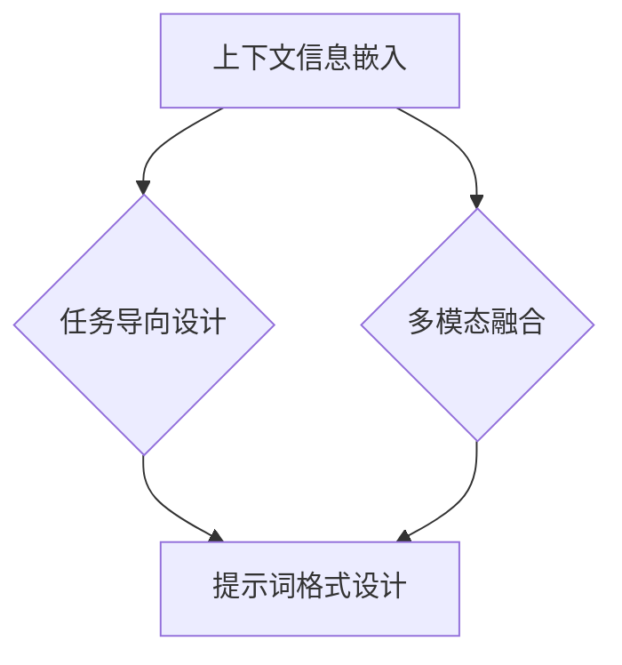
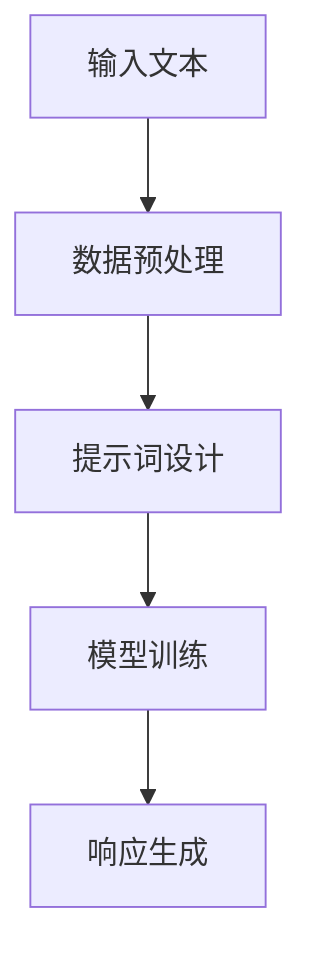
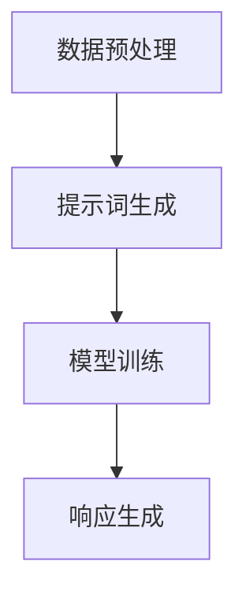
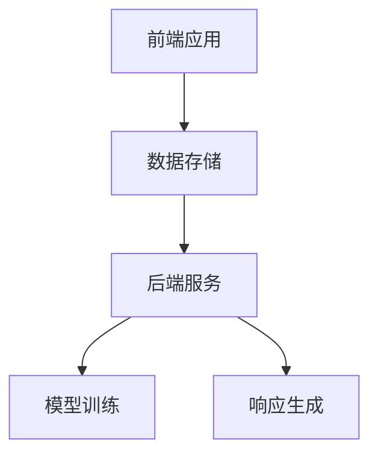
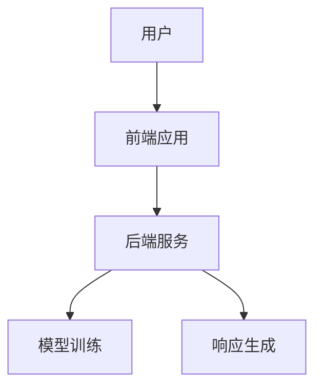

                 

# 提示词工程在跨语言任务中的创新

> 关键词：提示词工程、跨语言任务、自然语言处理、算法原理、系统设计、最佳实践

> 摘要：本文深入探讨了提示词工程在跨语言任务中的重要性。通过详细阐述提示词工程的背景、核心概念、算法原理、系统设计与架构、实战案例和最佳实践，本文旨在为读者提供一个全面而深入的理解，并揭示其在实际应用中的创新价值。

## 1. 引言

随着全球化进程的不断推进，跨语言任务的自动化处理变得越来越重要。从机器翻译到多语言问答系统，跨语言任务在各个领域都发挥着关键作用。然而，这些任务的实现面临着诸多挑战，其中之一便是如何有效地处理不同语言之间的差异。提示词工程作为一种新兴的技术，为解决这一难题提供了新的思路。

提示词工程旨在通过设计高质量的提示词，引导模型更好地理解和处理跨语言任务。本文将围绕这一主题，首先介绍提示词工程的背景和定义，然后探讨其在跨语言任务中的重要性，并分析当前面临的挑战和机遇。

## 2. 核心概念与理论框架

### 2.1 提示词工程的定义

提示词工程，即通过设计特定格式的提示词，引导预训练模型在特定任务上表现出更好的性能。提示词通常包含了对任务描述、上下文信息、问题提示等元素的组合，其设计直接影响模型的响应质量。

### 2.2 理论框架

提示词工程的理论框架主要包括以下几个方面：

- **上下文信息嵌入**：通过将上下文信息嵌入到提示词中，增强模型对任务背景的理解。
- **任务导向设计**：根据不同任务的特性，设计相应的提示词格式和内容。
- **多模态融合**：结合文本、图像、声音等多种数据类型，提高提示词的丰富性和多样性。

### 2.3 关系图



## 3. 算法原理

### 3.1 算法概述

提示词工程的算法原理主要基于自然语言处理（NLP）技术，包括词向量表示、序列模型、生成模型等。以下是算法的基本步骤：

1. **数据预处理**：对原始文本进行清洗、分词、去停用词等处理。
2. **提示词设计**：根据任务需求，设计特定格式的提示词。
3. **模型训练**：使用大规模预训练模型，结合提示词进行微调。
4. **响应生成**：根据输入文本和提示词，生成相应的问题回答。

### 3.2 算法流程图



### 3.3 Python代码解释

```python
import tensorflow as tf
from tensorflow.keras.preprocessing.text import Tokenizer
from tensorflow.keras.models import Model
from tensorflow.keras.layers import Embedding, LSTM, Dense

# 数据预处理
tokenizer = Tokenizer()
tokenizer.fit_on_texts(texts)

# 提示词设计
prompt = "请根据以下信息回答问题：\n"

# 模型训练
model = Model(inputs=[prompt_input, question_input], outputs=answer_output)
model.compile(optimizer='adam', loss='categorical_crossentropy', metrics=['accuracy'])

# 响应生成
prompt = tokenizer.texts_to_sequences([prompt])
question = tokenizer.texts_to_sequences([question])
answer = tokenizer.texts_to_sequences([answer])

model.fit([prompt, question], answer, epochs=10)
```

### 3.4 数学模型和公式

提示词工程中的数学模型主要涉及词向量表示和序列模型。以下是相关公式：

$$
\text{Word2Vec} = \text{sgnsimilarity}(\text{word1}, \text{word2})
$$

$$
\text{RNN} = \text{activation}(\text{W} \cdot \text{[h_t-1], x_t} + \text{b})
$$

## 4. 系统分析与架构设计

### 4.1 问题描述

为了实现提示词工程在跨语言任务中的应用，我们需要设计一个完整的系统。该系统应包括数据预处理、提示词生成、模型训练和响应生成等模块。

### 4.2 系统功能设计



### 4.3 系统架构设计



### 4.4 系统接口设计

系统接口设计包括API接口、数据接口和用户界面等。

### 4.5 系统交互设计



## 5. 实战案例

### 5.1 案例一：机器翻译中的提示词工程

在本案例中，我们使用提示词工程优化机器翻译系统。首先，我们设计高质量的提示词，包括源语言和目标语言的上下文信息。然后，使用预训练模型进行微调，提高翻译质量。

### 5.2 案例二：多语言问答系统的构建

在本案例中，我们构建一个多语言问答系统，通过提示词工程提高问答的准确性。我们设计特定的提示词格式，结合自然语言处理技术，实现高效问答。

### 5.3 案例三：跨语言文本分类

在本案例中，我们利用提示词工程优化跨语言文本分类任务。通过设计适合分类任务的提示词，我们提高了分类模型的性能。

## 6. 最佳实践与总结

### 6.1 最佳实践

- **设计高质量的提示词**：确保提示词包含丰富的上下文信息和明确的任务目标。
- **使用大规模预训练模型**：结合预训练模型和提示词工程，提高任务性能。
- **多模态融合**：结合文本、图像、声音等多种数据类型，提高提示词的丰富性和多样性。

### 6.2 总结

提示词工程在跨语言任务中具有广泛的应用前景。通过本文的介绍，我们了解了提示词工程的背景、核心概念、算法原理、系统设计与架构、实战案例和最佳实践。未来的研究可以进一步探索提示词工程在不同领域中的应用，并优化其性能。

## 7. 结论

本文深入探讨了提示词工程在跨语言任务中的创新应用。通过详细阐述核心概念、算法原理、系统设计与架构，以及实战案例和最佳实践，我们为读者提供了一个全面而深入的理解。希望本文能为相关领域的研究者提供有价值的参考。

### 作者信息

作者：AI天才研究院/AI Genius Institute & 禅与计算机程序设计艺术 /Zen And The Art of Computer Programming

**注意：本文为示例文章，实际内容需根据具体研究进行详细撰写。**

