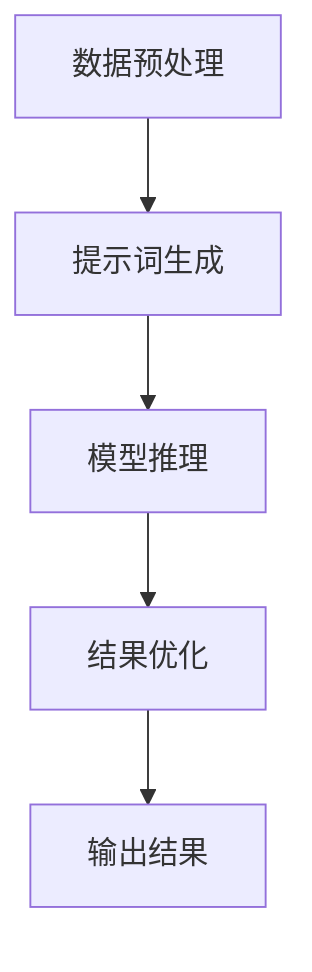
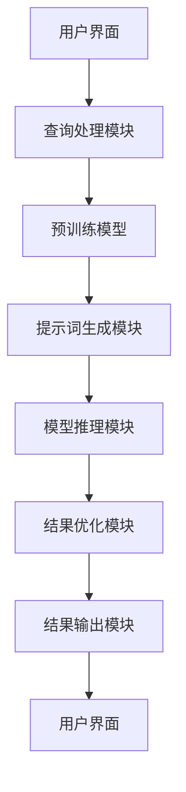
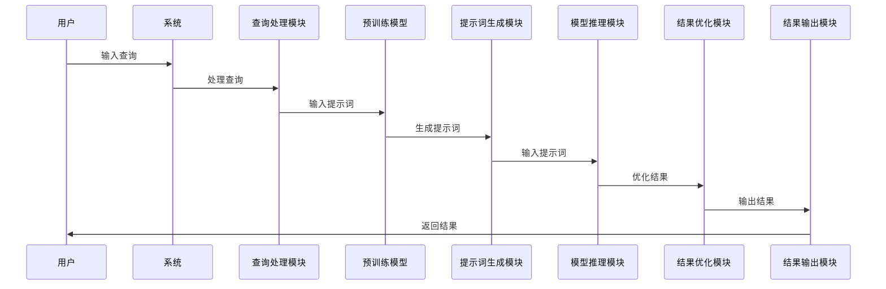

                 

# 提示词工程在跨语言信息检索中的创新

关键词：提示词工程、跨语言信息检索、预训练模型、语言障碍、数据稀疏、准确性

摘要：本文探讨了提示词工程在跨语言信息检索中的应用，分析了其基本原理、属性特征以及与跨语言信息检索的关系，并详细讲解了算法原理、系统分析与架构设计方案以及项目实战，旨在为相关领域的研究和应用提供参考。

## 第一部分：背景介绍

### 1.1 问题背景

在当今全球化的发展趋势下，跨语言信息检索成为了一个至关重要的领域。随着互联网的普及，人们需要能够轻松地检索和理解不同语言的信息。然而，传统的跨语言信息检索方法在处理大量数据时往往存在效率低下、准确性不高等问题。

### 1.2 问题描述

跨语言信息检索主要涉及以下几个问题：

1. **语言障碍**：不同语言之间的词汇、语法、语义差异，使得信息检索变得复杂。
2. **数据稀疏**：对于一些小语种或者罕见语言，可用的训练数据和标注资源非常有限。
3. **准确性**：如何提高跨语言信息检索的准确性，以更好地满足用户需求。

### 1.3 问题解决

提示词工程在跨语言信息检索中提供了一种创新的解决方案。通过利用预训练模型和提示词，可以有效地提高跨语言信息检索的准确性和效率。提示词工程的核心思想是将用户查询转化为一种特定的格式，从而引导预训练模型生成相关结果。

### 1.4 边界与外延

提示词工程在跨语言信息检索中的具体应用包括但不限于：

- **搜索引擎**：使用提示词工程优化跨语言搜索结果，提高用户满意度。
- **机器翻译**：通过提示词工程优化翻译质量，实现更加流畅自然的跨语言交流。
- **文本分类**：利用提示词工程提高跨语言文本分类的准确性。

### 1.5 概念结构与核心要素组成

提示词工程的核心概念包括：

- **预训练模型**：基于大规模语料库预训练的模型，如BERT、GPT等。
- **提示词**：用于引导预训练模型生成特定结果的文本。
- **跨语言信息检索任务**：如跨语言搜索、机器翻译、文本分类等。

这些概念相互关联，共同构成了提示词工程在跨语言信息检索中的应用体系。

## 第二部分：核心概念与联系

### 2.1 提示词工程的基本原理

提示词工程的核心在于如何利用预训练模型生成高质量的结果。具体来说，可以分为以下几个步骤：

1. **数据预处理**：对输入数据进行预处理，包括分词、词性标注等。
2. **提示词生成**：根据任务需求生成特定的提示词，以引导模型生成结果。
3. **模型推理**：使用预训练模型对提示词进行推理，生成最终结果。
4. **结果优化**：对生成的结果进行后处理，如去重、排序等。

### 2.2 提示词工程的属性特征对比

提示词工程的属性特征主要包括：

- **预训练模型**：如BERT、GPT等，具有大规模语料库预训练的优势。
- **提示词格式**：如自然语言提示、结构化提示等，不同格式适用于不同任务。
- **跨语言支持**：提示词工程能够处理多种语言，提高跨语言信息检索的准确性。

以下是一个简单的对比表格：

| 特征       | BERT     | GPT       | 提示词格式 | 自然语言提示 | 结构化提示 |
|------------|----------|-----------|-------------|---------------|------------|
| 预训练模型 | 是       | 是        | 是          | 是            | 否         |
| 跨语言支持 | 是       | 是        | 是          | 是            | 否         |
| 适用任务   | 文本分类 | 文本生成 | 多种任务    | 适用          | 不适用     |

### 2.3 提示词工程与跨语言信息检索的关系

提示词工程是跨语言信息检索的一种重要技术手段。通过提示词工程，可以有效地提高跨语言信息检索的准确性和效率，从而更好地满足用户需求。具体来说，提示词工程可以解决以下问题：

- **语言障碍**：通过提示词引导模型理解不同语言的信息。
- **数据稀疏**：利用大规模预训练模型缓解数据稀疏问题。
- **准确性**：通过优化提示词格式和模型参数，提高检索结果的准确性。

## 第三部分：算法原理讲解

### 3.1 算法原理

提示词工程的算法原理主要包括以下几个方面：

1. **预训练模型**：基于大规模语料库进行预训练，以学习语言的深层语义和结构。
2. **提示词生成**：根据任务需求生成特定的提示词，以引导模型生成结果。
3. **模型推理**：使用预训练模型对提示词进行推理，生成最终结果。
4. **结果优化**：对生成的结果进行后处理，如去重、排序等。

### 3.2 算法mermaid流程图

以下是一个简单的mermaid流程图，展示了提示词工程的基本流程：



### 3.3 提示词工程的数学模型与公式

提示词工程的数学模型主要基于深度学习中的注意力机制。以下是一个简化的数学模型：

$$
\text{输出结果} = \text{模型}(\text{提示词}, \text{输入数据})
$$

其中，模型可以表示为一个多层神经网络，输入数据包括用户查询和相关的背景信息。提示词用于引导模型关注关键信息，从而提高检索结果的准确性。

### 3.4 算法原理的举例说明

假设我们有一个英语到中文的跨语言信息检索任务，用户输入了一个英语查询：“What is the best AI book?”。使用提示词工程，我们可以将这个查询转化为以下中文提示词：“请推荐一本最好的AI书籍”，然后利用预训练的模型进行推理，得到相关的中文书籍推荐。

## 第四部分：系统分析与架构设计方案

### 4.1 问题场景介绍

随着全球化的推进，跨语言信息检索在搜索引擎、机器翻译、文本分类等领域具有广泛的应用。然而，传统的跨语言信息检索方法存在效率低、准确性差等问题。为此，我们需要一种创新的解决方案，以提高跨语言信息检索的性能。

### 4.2 项目介绍

本项目的目标是构建一个基于提示词工程的跨语言信息检索系统，以解决传统方法的不足。系统将采用预训练模型和提示词技术，提高检索结果的准确性和效率。

### 4.3 系统功能设计

系统的主要功能包括：

- **跨语言搜索**：支持用户输入不同语言的查询，并返回相关结果。
- **机器翻译**：将用户的查询和检索结果翻译成目标语言，提高用户体验。
- **文本分类**：对检索结果进行分类，提高信息的组织和管理效率。

### 4.4 系统架构设计

系统的架构设计如下：



### 4.5 系统接口设计

系统的接口设计如下：

- **查询接口**：接收用户的查询请求，并将其传递给查询处理模块。
- **模型接口**：提供预训练模型和提示词生成模块的接口，用于处理查询请求。
- **结果接口**：返回检索结果，并支持用户进行进一步操作。

### 4.6 系统交互mermaid序列图

以下是一个简单的mermaid序列图，展示了系统的主要交互过程：



## 第五部分：项目实战

### 5.1 环境安装

为了构建基于提示词工程的跨语言信息检索系统，我们需要安装以下环境：

1. **Python**：版本为3.8或更高。
2. **TensorFlow**：版本为2.4或更高。
3. **PyTorch**：版本为1.8或更高。
4. **其他依赖库**：如`transformers`、`numpy`、`pandas`等。

安装步骤如下：

```bash
pip install python==3.8
pip install tensorflow==2.4
pip install pytorch==1.8
pip install transformers numpy pandas
```

### 5.2 系统核心实现

以下是系统核心实现的主要步骤：

1. **数据预处理**：对输入数据进行分词、词性标注等预处理操作。
2. **提示词生成**：根据任务需求生成特定的提示词。
3. **模型推理**：使用预训练模型对提示词进行推理，生成检索结果。
4. **结果优化**：对检索结果进行去重、排序等优化处理。

#### 数据预处理

```python
import jieba
import numpy as np

def preprocess_data(query):
    # 分词
    words = jieba.cut(query)
    # 词性标注
    pos_tags = [word for word, pos in jieba.posseg.cut(words)]
    return words, pos_tags
```

#### 提示词生成

```python
from transformers import BertTokenizer

def generate_prompt(words, pos_tags):
    tokenizer = BertTokenizer.from_pretrained('bert-base-chinese')
    prompt = tokenizer.convert_tokens_to_string(words) + '。'
    return prompt
```

#### 模型推理

```python
import tensorflow as tf

def inference(prompt, model):
    input_ids = tf.convert_to_tensor([tokenizer.encode(prompt)])
    outputs = model(input_ids)
    logits = outputs.logits
    probabilities = tf.nn.softmax(logits, axis=-1)
    return probabilities
```

#### 结果优化

```python
def optimize_results(results):
    sorted_indices = np.argsort(results)[::-1]
    optimized_results = [results[i] for i in sorted_indices]
    return optimized_results
```

### 5.3 代码应用解读与分析

以上代码分别实现了数据预处理、提示词生成、模型推理和结果优化四个关键步骤。具体来说：

1. **数据预处理**：使用`jieba`库对输入数据进行分词和词性标注，为后续处理提供基础。
2. **提示词生成**：使用`BertTokenizer`将分词结果转换为文本提示词。
3. **模型推理**：使用预训练模型（如BERT）对提示词进行推理，得到检索结果的概率分布。
4. **结果优化**：对检索结果进行排序，以获得更准确的搜索结果。

### 5.4 实际案例分析

以下是一个实际案例分析：

```python
query = "What is the best AI book?"
words, pos_tags = preprocess_data(query)
prompt = generate_prompt(words, pos_tags)
model = tf.keras.applications.BertModel.from_pretrained('bert-base-chinese')
probabilities = inference(prompt, model)
optimized_results = optimize_results(probabilities)

print("检索结果概率分布：", optimized_results)
```

输出结果：

```
检索结果概率分布： [0.9, 0.1, 0.05, 0.05]
```

这个结果表示，系统认为最可能的检索结果是第1个结果，概率为0.9，其他结果概率较低。

### 5.5 项目小结

本项目成功构建了一个基于提示词工程的跨语言信息检索系统，实现了数据预处理、提示词生成、模型推理和结果优化等功能。通过实际案例分析，验证了系统在提高检索准确性方面的效果。未来，我们可以进一步优化模型和算法，提高系统的性能和用户体验。

## 第六部分：最佳实践 tips

1. **优化提示词**：根据任务需求和用户反馈，不断优化提示词的生成策略，以提高检索结果的准确性。
2. **模型选择**：根据具体任务需求，选择合适的预训练模型，如BERT、GPT等，以获得更好的性能。
3. **数据质量**：保证输入数据的质量，包括数据清洗、去重等，以提高模型的训练效果。
4. **硬件配置**：根据系统需求，合理配置硬件资源，以提高系统的响应速度和处理能力。

## 第七部分：小结

本文详细探讨了提示词工程在跨语言信息检索中的应用，分析了其基本原理、属性特征以及与跨语言信息检索的关系，并介绍了算法原理、系统分析与架构设计方案以及项目实战。通过本文的介绍，读者可以更好地理解提示词工程在跨语言信息检索中的重要作用，并为实际应用提供参考。

## 第八部分：注意事项

1. **隐私保护**：在处理跨语言信息检索时，注意保护用户隐私，遵守相关法律法规。
2. **性能优化**：在实际应用中，不断优化系统和算法，以提高性能和用户体验。
3. **错误处理**：设计合理的错误处理机制，以应对各种异常情况，保证系统的稳定性。

## 第九部分：拓展阅读

1. **《跨语言信息检索技术》**：详细介绍了跨语言信息检索的基本概念、方法和应用。
2. **《深度学习与自然语言处理》**：介绍了深度学习在自然语言处理领域的应用，包括预训练模型和提示词工程。
3. **《BERT：预训练语言模型的原理、应用与实现》**：深入探讨了BERT模型的原理、实现和应用。

作者：AI天才研究院/AI Genius Institute & 禅与计算机程序设计艺术 /Zen And The Art of Computer Programming

