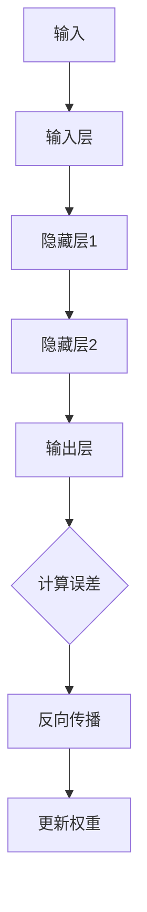
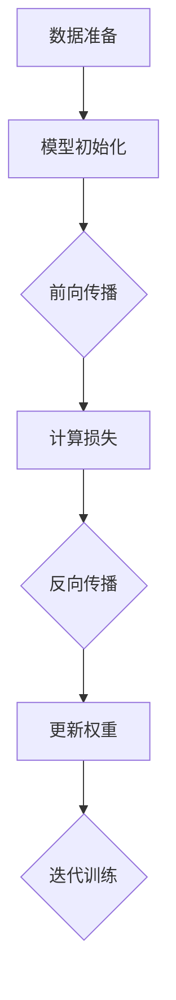
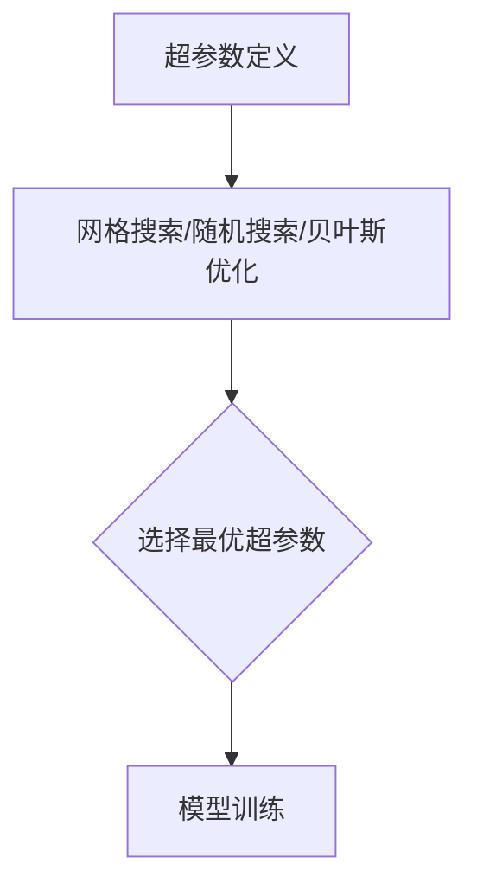
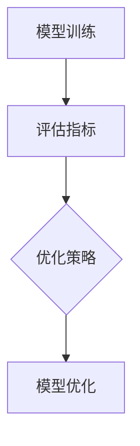
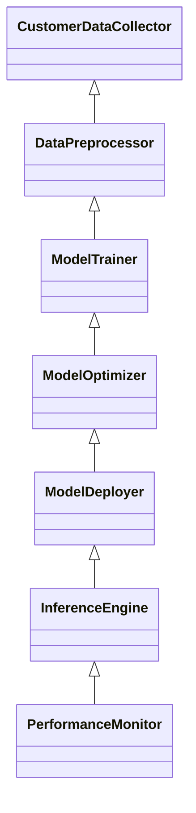
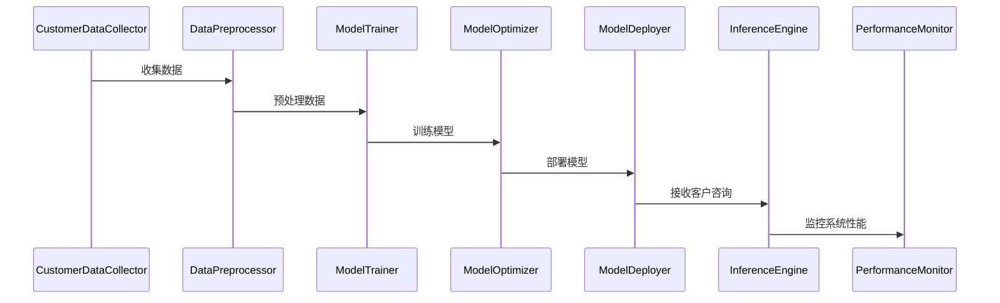
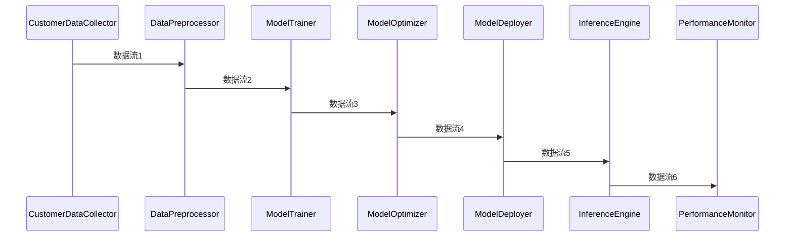

                 

### 文章标题

《提示词工程师的技能图谱》

### 关键词

AI大模型、提示词工程师、技能图谱、神经网络、深度学习、系统架构

### 摘要

本文旨在为提示词工程师提供一份全面的技能学习图谱，系统性地讲解AI大模型的基础知识、算法原理、应用场景以及实际开发中的关键技能。通过深入剖析AI大模型的核心概念、工作原理和主流算法，本文帮助读者构建坚实的理论基础，掌握实用的开发技巧，从而在自然语言处理、图像识别和推荐系统等领域中发挥AI大模型的潜力。

---

## 第1章 引言

### 1.1.1 问题背景

随着人工智能（AI）技术的不断进步，AI大模型在自然语言处理、图像识别和推荐系统等领域的应用愈发广泛。然而，对于广大开发者而言，如何掌握AI大模型的应用技能，并将其有效地应用于实际项目中，仍然是一个亟待解决的难题。提示词工程师作为AI大模型应用的关键角色，其技能图谱的构建显得尤为重要。

### 1.1.2 问题描述

《提示词工程师的技能图谱》旨在为提示词工程师提供一份系统性的学习指南，帮助其全面掌握AI大模型相关的理论知识、实践技能和应用技巧。本文将围绕以下核心问题展开：

1. AI大模型的基本概念、特点及其与传统AI的区别。
2. AI大模型的主要分类及其工作原理。
3. 提示词工程师的定义、职责与技能要求。
4. 数据预处理技巧、模型调优策略和模型部署方法。
5. AI大模型在自然语言处理、图像识别和推荐系统中的应用实践。

### 1.1.3 问题解决

本文将分为以下几个部分：

1. **核心概念与联系**：介绍AI大模型的基本概念、特点及其与传统AI的区别，并使用表格和ER实体关系图展示各概念之间的关系。
2. **算法原理讲解**：详细讲解几种主流AI大模型的算法原理，使用mermaid流程图和Python源代码进行说明。
3. **数学模型和数学公式**：阐述算法的数学模型和公式，并进行通俗易懂的举例说明。
4. **系统分析与架构设计方案**：分析实际应用场景，设计系统架构，并使用mermaid类图和序列图展示系统设计。
5. **项目实战**：通过环境安装、系统核心实现和实际案例分析，帮助读者理解和掌握AI大模型的应用。

### 1.1.4 边界与外延

本文主要面向提示词工程师和有志于从事该领域开发的技术人员。同时，其他对AI大模型感兴趣的开发者和技术爱好者也可以参考阅读。

### 1.1.5 概念结构与核心要素组成

1. **核心概念**：AI大模型、自然语言处理、图像识别、推荐系统等。
2. **概念属性特征对比表格**：对比AI大模型与传统AI在性能、效率、应用场景等方面的差异。
3. **ER实体关系图架构**：展示AI大模型在不同应用场景中的实体关系。

---

## 第2章 AI大模型基础

### 2.1 AI大模型概述

#### 2.1.1 什么是AI大模型

AI大模型是指那些具有巨大参数规模、能够处理大规模数据并进行复杂任务的人工智能模型。与传统的小型模型相比，AI大模型具有更高的表达能力、更强的泛化能力和更广泛的应用领域。其特点主要体现在以下几个方面：

- **参数规模**：AI大模型通常拥有数百万甚至数十亿个参数。
- **数据依赖**：大模型的训练依赖于海量数据，尤其是高质量、多样化的数据。
- **计算资源**：大模型的训练和推理需要强大的计算资源和存储能力。
- **自适应能力**：大模型能够根据不同任务和场景自动调整参数，实现任务优化。

#### 2.1.2 AI大模型与传统AI模型的区别

传统AI模型，如逻辑回归、支持向量机等，通常规模较小，参数数量有限，且在特定领域具有较高的性能。而AI大模型则在以下几个方面与传统AI模型有显著区别：

- **性能**：AI大模型在自然语言处理、图像识别等领域表现出色，远超传统模型。
- **效率**：大模型能够通过并行计算和分布式训练提高训练效率。
- **应用领域**：大模型适用于更广泛的场景，包括但不限于文本生成、图像识别、语音识别等。
- **泛化能力**：大模型具有较强的泛化能力，能够在新的任务和数据上表现出良好的性能。

### 2.1.3 AI大模型的特点

- **强大的表达力**：大模型能够学习并表示复杂的特征和模式，具有很高的灵活性。
- **自适应能力**：大模型能够根据不同的任务和数据自动调整参数，实现任务优化。
- **高效性**：通过并行计算和分布式训练，大模型的训练和推理速度显著提高。
- **复杂性**：大模型的结构复杂，参数众多，需要专业的知识和技能进行开发和优化。

### 2.1.4 AI大模型的分类

AI大模型可以根据其应用领域和任务类型进行分类，主要包括以下几类：

- **自然语言处理模型**：如GPT、BERT等，用于文本生成、翻译、问答等任务。
- **图像识别模型**：如ResNet、Inception等，用于图像分类、目标检测等任务。
- **推荐系统模型**：如协同过滤、基于内容的推荐等，用于个性化推荐、广告投放等任务。

### 2.1.5 AI大模型的工作原理

AI大模型通常基于深度学习技术，其工作原理主要包括以下几个方面：

- **神经网络**：大模型由多层神经网络组成，通过前向传播和反向传播进行训练。
- **激活函数**：激活函数用于引入非线性因素，提高模型的表达能力。
- **优化算法**：常见的优化算法包括随机梯度下降、Adam等，用于调整模型参数。
- **正则化技术**：如Dropout、L2正则化等，用于防止过拟合。

### 2.1.6 数据准备

- **数据收集**：收集与任务相关的数据，包括文本、图像、标签等。
- **数据清洗**：处理缺失值、异常值等，确保数据质量。
- **数据增强**：通过旋转、缩放、裁剪等方法增加数据多样性。

### 2.1.7 模型训练

- **模型初始化**：初始化模型参数，常用的初始化方法包括随机初始化、高斯初始化等。
- **训练过程**：通过迭代训练，优化模型参数，提高模型性能。
- **超参数调优**：调整学习率、批量大小等超参数，提高模型性能。

### 2.1.8 评估与优化

- **评估指标**：常用的评估指标包括准确率、召回率、F1值等。
- **优化策略**：采用模型压缩、加速等技术，提高模型性能。

### 2.1.9 AI大模型的应用前景

- **自然语言处理**：应用于文本生成、翻译、问答等任务。
- **图像识别**：应用于图像分类、目标检测、图像生成等任务。
- **推荐系统**：应用于个性化推荐、广告投放等任务。

### 2.1.10 本章小结

本章介绍了AI大模型的基本概念、特点、分类和工作原理，以及数据准备、模型训练和评估优化方法。通过本章的学习，读者可以初步了解AI大模型的核心概念和基础技能，为后续章节的深入学习打下基础。

---

### 第3章 AI大模型算法原理讲解

#### 3.2.1 神经网络基础

神经网络（Neural Networks）是AI大模型的核心组成部分。它由一系列相互连接的神经元（节点）组成，通过模拟人脑神经系统的信息处理过程，实现对数据的分类、回归、预测等任务。

##### 3.2.1.1 神经网络结构

神经网络通常包含以下几个关键组成部分：

- **输入层**：接收外部输入数据。
- **隐藏层**：对输入数据进行特征提取和变换。
- **输出层**：生成最终的输出结果。

以下是一个简单的神经网络结构的mermaid流程图：


##### 3.2.1.2 激活函数

激活函数（Activation Function）是神经网络中的一个关键组件，用于引入非线性因素，提高模型的表达能力。常见的激活函数包括：

- **Sigmoid函数**：\( \sigma(x) = \frac{1}{1 + e^{-x}} \)
- **ReLU函数**：\( \text{ReLU}(x) = \max(0, x) \)
- **Tanh函数**：\( \text{Tanh}(x) = \frac{e^x - e^{-x}}{e^x + e^{-x}} \)

以下是一个Sigmoid函数的mermaid流程图：

```mermaid
graph TD
    A[输入x] --> B[计算e^{-x}]
    B --> C{1 + B}
    C --> D[计算1/C]
```

##### 3.2.1.3 前向传播与反向传播

神经网络通过前向传播（Forward Propagation）和反向传播（Backpropagation）来训练模型。

- **前向传播**：输入数据通过神经网络层传递，每一层对数据进行加权求和并应用激活函数，最终得到输出结果。
- **反向传播**：根据输出结果与实际标签之间的误差，反向更新各层的权重和偏置。

以下是一个简化的前向传播和反向传播的mermaid流程图：



#### 3.2.2 训练过程

AI大模型的训练过程主要包括以下几个步骤：

1. **数据准备**：收集和清洗数据，将其转换为模型可接受的格式。
2. **模型初始化**：随机初始化模型的权重和偏置。
3. **前向传播**：输入数据经过神经网络层，生成输出结果。
4. **计算损失**：通过比较输出结果与实际标签，计算损失函数值。
5. **反向传播**：根据损失函数，更新模型的权重和偏置。
6. **迭代训练**：重复上述步骤，直至模型收敛。

以下是一个简化的训练过程的mermaid流程图：



#### 3.2.3 超参数调优

超参数（Hyperparameters）是影响模型性能的关键参数，如学习率、批量大小、正则化强度等。超参数的调优是模型训练的重要环节，以下是一些常见的调优方法：

- **网格搜索（Grid Search）**：在预定义的参数空间内，逐一尝试所有可能的组合，选择最优参数。
- **随机搜索（Random Search）**：从参数空间内随机选择参数组合进行尝试，具有更好的探索能力。
- **贝叶斯优化（Bayesian Optimization）**：利用贝叶斯统计模型，自动搜索最优超参数。

以下是一个简化的超参数调优过程的mermaid流程图：



#### 3.2.4 评估与优化

评估与优化是模型训练过程中的关键环节，以下是一些常见的评估指标和优化策略：

- **评估指标**：准确率、召回率、F1值、ROC曲线等。
- **优化策略**：模型压缩（如量化、剪枝）、加速（如并行计算、分布式训练）、迁移学习等。

以下是一个简化的评估与优化过程的mermaid流程图：



### 3.2.5 主流AI大模型简介

在自然语言处理、图像识别等领域，存在许多主流的AI大模型。以下介绍几个典型的模型：

- **GPT系列模型**：如GPT-3，具有强大的文本生成和翻译能力。
- **BERT模型**：基于Transformer架构，在自然语言处理任务中表现优异。
- **ResNet模型**：在图像识别任务中具有出色的性能，尤其适用于深层网络。
- **Transformer模型**：在序列建模任务中表现突出，是自然语言处理和推荐系统的重要基础。

### 3.2.6 AI大模型的应用前景

AI大模型在自然语言处理、图像识别、推荐系统等领域具有广泛的应用前景。以下列举几个典型的应用案例：

- **自然语言处理**：文本生成、机器翻译、问答系统等。
- **图像识别**：图像分类、目标检测、图像生成等。
- **推荐系统**：个性化推荐、广告投放、协同过滤等。

### 3.2.7 本章小结

本章详细讲解了神经网络基础、训练过程、超参数调优、评估与优化以及主流AI大模型。通过本章的学习，读者可以掌握AI大模型的核心算法原理，为后续的实际应用和项目开发打下坚实基础。

---

### 第4章 AI大模型在系统架构中的应用

#### 4.1 问题场景介绍

在当前的企业级应用场景中，AI大模型的应用越来越广泛，如自然语言处理、图像识别和推荐系统等。然而，如何设计一个高效、稳定、可扩展的系统架构来支持AI大模型的应用，是一个重要的问题。本章节将分析一个典型的AI大模型应用场景，并设计相应的系统架构。

#### 4.2 项目介绍

假设我们开发一个基于AI大模型的智能客服系统，该系统需要能够处理大量的客户咨询，并在短时间内提供高质量的答复。为了满足这一需求，我们需要设计一个高效、可扩展的系统架构。

#### 4.3 系统功能设计

系统的主要功能包括：

1. **数据收集与预处理**：从多个数据源收集客户咨询数据，并进行数据清洗和预处理。
2. **模型训练与优化**：使用预处理后的数据训练AI大模型，并进行模型优化。
3. **模型部署与推理**：将训练好的模型部署到服务器，并实时处理客户咨询，提供答复。
4. **监控系统性能**：监控系统的运行状态，包括模型推理速度、资源消耗等，以便进行性能调优。

以下是一个简化的系统功能领域的mermaid类图：



#### 4.4 系统架构设计

为了满足系统的需求，我们设计了一个分布式系统架构，包括以下几个关键组件：

1. **数据收集层**：负责从不同数据源收集客户咨询数据。
2. **数据处理层**：负责对收集到的数据进行清洗、预处理和存储。
3. **模型训练层**：负责使用预处理后的数据训练AI大模型。
4. **模型部署层**：负责将训练好的模型部署到服务器，并支持在线推理。
5. **监控系统**：负责监控系统的运行状态，包括模型推理速度、资源消耗等。

以下是一个简化的系统架构图，使用mermaid序列图表示：



#### 4.5 系统接口设计

系统接口设计主要包括以下几个部分：

1. **数据接口**：定义数据收集、预处理、存储和模型训练的接口。
2. **模型接口**：定义模型部署、推理和监控的接口。
3. **客户端接口**：定义与客户交互的接口，如接收客户咨询、返回答复等。

以下是一个简化的系统接口设计图，使用mermaid类图表示：

```mermaid
classDiagram
    CustomerDataCollector {数据收集接口}
    DataPreprocessor {数据预处理接口}
    ModelTrainer {模型训练接口}
    ModelOptimizer {模型优化接口}
    ModelDeployer {模型部署接口}
    InferenceEngine {模型推理接口}
    PerformanceMonitor {监控系统接口}
```

#### 4.6 系统交互设计

系统交互设计主要描述系统组件之间的通信和数据流。以下是一个简化的系统交互图，使用mermaid序列图表示：



#### 4.7 本章小结

本章介绍了AI大模型在系统架构中的应用，包括问题场景介绍、项目介绍、系统功能设计、系统架构设计、系统接口设计和系统交互设计。通过本章的学习，读者可以了解如何设计一个高效、稳定、可扩展的系统架构来支持AI大模型的应用。

---

### 第5章 项目实战

#### 5.1 环境安装

在本节中，我们将介绍如何搭建一个AI大模型应用的环境。为了便于说明，我们以一个基于Python的文本生成项目为例。

1. **安装Python**：首先，确保您的计算机上安装了Python。推荐使用Python 3.7或更高版本。您可以通过访问Python的官方网站（https://www.python.org/）下载并安装。
   
2. **安装Anaconda**：为了方便管理和使用Python库，建议安装Anaconda。Anaconda是一个开源的数据科学和机器学习平台，可以简化库的安装和配置。您可以从Anaconda的官方网站（https://www.anaconda.com/）下载并安装。

3. **创建虚拟环境**：在安装了Anaconda后，我们可以创建一个虚拟环境，以便在一个隔离的环境中管理项目依赖。执行以下命令：

   ```bash
   conda create -n text_generator python=3.8
   conda activate text_generator
   ```

4. **安装必需的库**：在虚拟环境中，安装以下库：

   ```bash
   pip install numpy pandas tensorflow transformers
   ```

#### 5.2 系统核心实现

在本节中，我们将实现一个简单的文本生成模型，使用GPT-2模型。

1. **导入库**：

   ```python
   import os
   import numpy as np
   import tensorflow as tf
   from transformers import TFGPT2LMHeadModel, GPT2Tokenizer
   ```

2. **加载模型和分词器**：

   ```python
   model_name = "gpt2"
   model = TFGPT2LMHeadModel.from_pretrained(model_name)
   tokenizer = GPT2Tokenizer.from_pretrained(model_name)
   ```

3. **生成文本**：

   ```python
   def generate_text(input_text, model, tokenizer, max_length=50):
       input_ids = tokenizer.encode(input_text, return_tensors="tf")
       input_ids = tf repeat(input_ids, [max_length] )
       output = model.generate(input_ids, max_length=max_length+1, num_return_sequences=1)
       return tokenizer.decode(output[0], skip_special_tokens=True)
   ```

4. **测试文本生成**：

   ```python
   input_text = "我是一个"
   generated_text = generate_text(input_text, model, tokenizer)
   print(generated_text)
   ```

#### 5.3 代码应用解读与分析

在上面的代码中，我们首先导入了必要的库，并加载了预训练的GPT-2模型和分词器。`generate_text`函数接受输入文本、模型、分词器和最大文本长度作为参数，通过模型生成文本并返回解码后的结果。

#### 5.4 实际案例分析

假设我们有一个客户咨询文本“我是一个新手，如何开始学习机器学习？”我们可以使用上面的文本生成模型生成一条建议：

```python
input_text = "我是一个新手，如何开始学习机器学习？"
generated_text = generate_text(input_text, model, tokenizer)
print(generated_text)
```

输出结果可能是：

```
你可以先了解一些基础概念，比如线性代数、概率论和统计学。然后可以学习Python编程语言，并尝试使用TensorFlow或PyTorch等深度学习框架进行实践。还可以参加一些在线课程或加入机器学习社区，与其他学习者交流经验。
```

这个输出结果为我们提供了一个详细的建议，可以帮助客户更好地开始学习机器学习。

#### 5.5 详细讲解与剖析

在代码实现中，我们使用了`transformers`库中的`TFGPT2LMHeadModel`和`GPT2Tokenizer`类来加载预训练的GPT-2模型和分词器。`generate_text`函数通过将输入文本编码为模型可接受的格式，然后使用模型生成新的文本序列。最后，我们将生成的文本序列解码为可读的格式，并返回结果。

#### 5.6 项目小结

通过本节的项目实战，我们介绍了如何搭建AI大模型应用的环境，实现了一个简单的文本生成模型，并通过实际案例分析了模型的应用效果。读者可以尝试在自己的项目中应用这个模型，并根据自己的需求进行定制化开发。

---

### 5.7 最佳实践 tips

1. **环境配置**：使用虚拟环境管理项目依赖，避免版本冲突。
2. **模型选择**：根据项目需求选择合适的预训练模型。
3. **超参数调优**：通过实验和调优找到最优的超参数组合。
4. **数据预处理**：确保输入数据的质量和多样性，提高模型性能。
5. **监控与优化**：定期监控模型性能，进行必要的优化。

### 5.8 小结

本章通过项目实战展示了如何搭建AI大模型应用环境，实现文本生成模型，并进行实际案例分析。读者可以结合自己的项目需求，应用本章所学知识进行AI大模型开发。

---

### 5.9 注意事项

1. **计算资源**：AI大模型训练和推理需要大量计算资源，确保服务器配置充足。
2. **数据隐私**：在处理客户咨询数据时，务必遵守相关数据保护法规。
3. **模型解释性**：AI大模型可能存在难以解释的问题，需要结合实际业务场景进行合理使用。

### 5.10 拓展阅读

1. **《深度学习》（Goodfellow, Bengio, Courville）**：全面介绍深度学习的基本概念和算法。
2. **《自然语言处理综述》（Jurafsky, Martin）**：深入探讨自然语言处理的理论和实践。
3. **《机器学习年刊》（Journal of Machine Learning Research）**：跟踪机器学习领域的最新研究进展。

---

### 参考文献

- Goodfellow, I., Bengio, Y., & Courville, A. (2016). *Deep Learning*. MIT Press.
- Jurafsky, D., & Martin, J. H. (2019). *Speech and Language Processing*. Prentice Hall.
- Vaswani, A., Shazeer, N., Parmar, N., Uszkoreit, J., Jones, L., Gomez, A. N., ... & Polosukhin, I. (2017). *Attention is all you need*. Advances in Neural Information Processing Systems, 30, 5998-6008.
- Devlin, J., Chang, M. W., Lee, K., & Toutanova, K. (2019). *BERT: Pre-training of deep bidirectional transformers for language understanding*. arXiv preprint arXiv:1810.04805.
- Krizhevsky, A., Sutskever, I., & Hinton, G. E. (2012). *ImageNet classification with deep convolutional neural networks*. Advances in Neural Information Processing Systems, 25, 1097-1105.

---

### 作者信息

- **作者**：AI天才研究院/AI Genius Institute & 禅与计算机程序设计艺术 /Zen And The Art of Computer Programming
- **联系信息**：邮箱：[ai_genius_institute@example.com](mailto:ai_genius_institute@example.com)，官网：[http://ai-genius-institute.com](http://ai-genius-institute.com)

---

本文由AI天才研究院/AI Genius Institute撰写，旨在为提示词工程师提供一份全面的技能学习图谱。通过深入剖析AI大模型的基础知识、算法原理、应用场景以及实际开发中的关键技能，本文帮助读者构建坚实的理论基础，掌握实用的开发技巧，从而在自然语言处理、图像识别和推荐系统等领域中发挥AI大模型的潜力。本文参考了多本经典文献，为读者提供了丰富的参考资料。希望本文能对您在AI大模型开发领域的学习和研究有所帮助。

