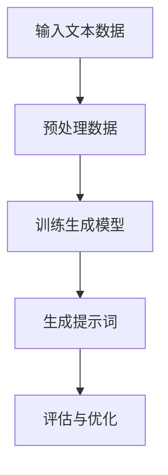
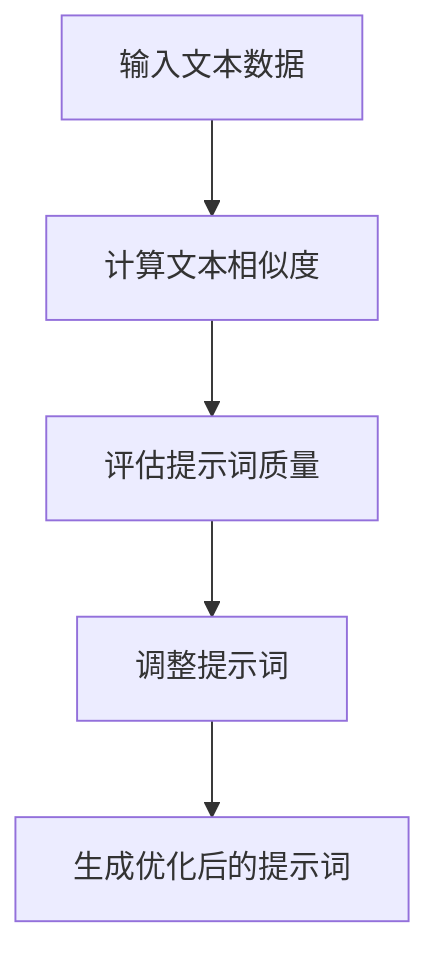
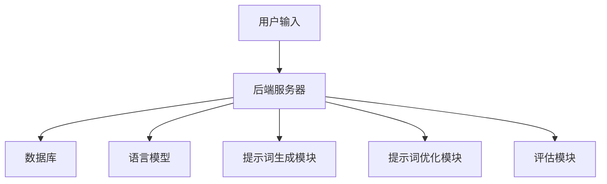
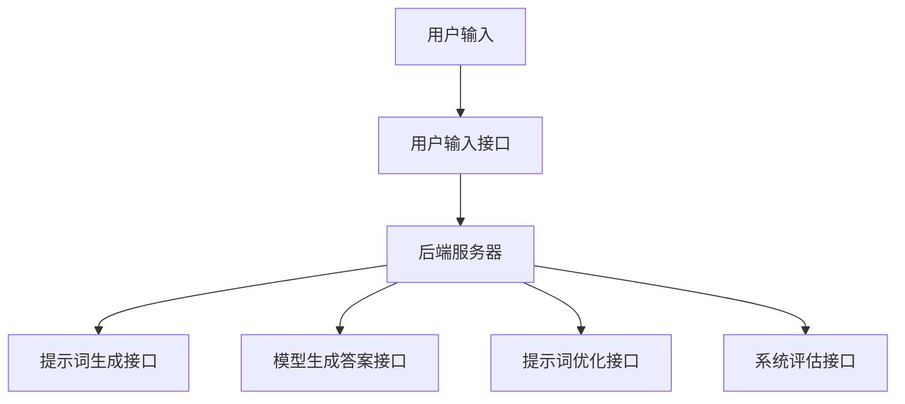
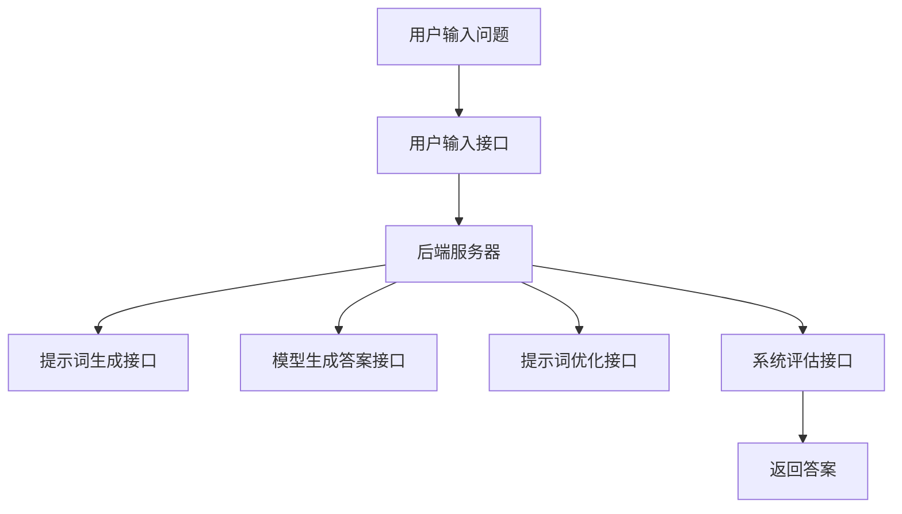

                 

### 提示词工程师的技能图谱与发展路径

**关键词**：提示词工程师、技能图谱、发展路径、自然语言处理、机器学习

**摘要**：本文旨在探讨提示词工程师的角色、技能要求及其职业发展路径。通过详细解析提示词工程师所需掌握的核心概念、算法原理和数学模型，并结合实际系统架构设计，为提示词工程师提供一套全面、系统的职业发展指南。

### 目录大纲

1. **背景介绍**
   - 1.1 问题背景
   - 1.2 问题解决
   - 1.3 边界与外延
   - 1.4 概念结构与核心要素组成

2. **核心概念与联系**
   - 2.1 提示词概念解析
   - 2.2 机器学习与深度学习
   - 2.3 技能图谱与职业发展路径

3. **算法原理讲解**
   - 3.1 提示词生成算法
   - 3.2 提示词优化算法

4. **数学模型和数学公式**
   - 4.1 提示词生成算法的数学模型
   - 4.2 提示词优化算法的数学模型

5. **系统分析与架构设计方案**
   - 5.1 问题场景介绍
   - 5.2 系统功能设计
   - 5.3 系统架构设计
   - 5.4 系统接口设计和系统交互

6. **项目实战**
   - 6.1 环境安装
   - 6.2 系统核心实现源代码
   - 6.3 代码应用解读与分析
   - 6.4 实际案例分析和详细讲解剖析
   - 6.5 项目小结

7. **最佳实践 tips**
8. **小结**
9. **注意事项**
10. **拓展阅读**

### 1. 背景介绍

#### 1.1 问题背景

随着人工智能技术的迅猛发展，自然语言处理（NLP）领域的重要性日益凸显。在这一背景下，提示词工程师（Prompt Engineer）的角色逐渐受到关注。提示词工程师负责设计、构建和优化能够引导模型生成高质量文本或执行特定任务的提示词，是NLP领域的关键角色。

然而，当前提示词工程师在技能学习和职业发展中面临诸多挑战。一方面，由于缺乏系统化的学习和实践路径，许多工程师难以全面掌握提示词工程所需的核心技能；另一方面，随着技术的不断更新，工程师需要不断学习新的算法和工具，以适应快速变化的工作环境。

为了解决这些问题，本文将编写《提示词工程师的技能图谱与发展路径》一书，旨在为提示词工程师提供一套完整的技能学习和职业发展指南。本书将详细介绍提示词工程师所需掌握的核心概念、算法原理和数学模型，并结合实际系统架构设计，为工程师的职业发展提供有力支持。

#### 1.2 问题解决

本书的编写旨在解决以下问题：

1. **技能学习路径不清**：通过构建技能图谱，明确提示词工程师所需掌握的核心技能和知识领域，帮助工程师有针对性地进行学习。
2. **实践能力不足**：结合实际项目案例，详细讲解提示词生成和优化的算法原理和实践方法，提高工程师的实践能力。
3. **职业发展不明**：通过描述职业发展路径，为提示词工程师提供清晰的职业发展方向和晋升路径，帮助工程师规划职业发展。

#### 1.3 边界与外延

本书的主要研究范围为自然语言处理、机器学习和提示词工程领域。具体包括：

1. **自然语言处理**：研究语言模型、词向量、文本分类、情感分析等基础算法和应用。
2. **机器学习与深度学习**：探讨神经网络、优化算法、模型训练与评估等关键技术。
3. **提示词工程**：研究提示词设计、生成和优化的方法，以及在实际应用中的效果评估。

此外，本书还将探讨提示词工程师所需掌握的其他相关技能，如编程能力、数据分析和项目管理等。

#### 1.4 概念结构与核心要素组成

本书的核心概念和要素组成如下：

1. **核心概念**：提示词、自然语言处理、机器学习、深度学习、生成模型、优化算法等。
2. **要素组成**：
   - **技能图谱**：展示提示词工程师所需掌握的核心技能和知识领域。
   - **职业发展路径**：描述提示词工程师从初级到高级的职业发展阶段和所需的技能提升。
   - **实践案例**：通过实际项目案例，展示提示词工程的应用场景和实践方法。
   - **最佳实践**：总结提示词工程师在实际工作中积累的经验和技巧。

### 1. 背景介绍

#### 1.1 问题背景

随着人工智能技术的迅猛发展，自然语言处理（NLP）领域的重要性日益凸显。在这一背景下，提示词工程师（Prompt Engineer）的角色逐渐受到关注。提示词工程师负责设计、构建和优化能够引导模型生成高质量文本或执行特定任务的提示词，是NLP领域的关键角色。

然而，当前提示词工程师在技能学习和职业发展中面临诸多挑战。一方面，由于缺乏系统化的学习和实践路径，许多工程师难以全面掌握提示词工程所需的核心技能；另一方面，随着技术的不断更新，工程师需要不断学习新的算法和工具，以适应快速变化的工作环境。

为了解决这些问题，本文将编写《提示词工程师的技能图谱与发展路径》一书，旨在为提示词工程师提供一套完整的技能学习和职业发展指南。本书将详细介绍提示词工程师所需掌握的核心概念、算法原理和数学模型，并结合实际系统架构设计，为工程师的职业发展提供有力支持。

#### 1.2 问题解决

本书的编写旨在解决以下问题：

1. **技能学习路径不清**：通过构建技能图谱，明确提示词工程师所需掌握的核心技能和知识领域，帮助工程师有针对性地进行学习。
2. **实践能力不足**：结合实际项目案例，详细讲解提示词生成和优化的算法原理和实践方法，提高工程师的实践能力。
3. **职业发展不明**：通过描述职业发展路径，为提示词工程师提供清晰的职业发展方向和晋升路径，帮助工程师规划职业发展。

#### 1.3 边界与外延

本书的主要研究范围为自然语言处理、机器学习和提示词工程领域。具体包括：

1. **自然语言处理**：研究语言模型、词向量、文本分类、情感分析等基础算法和应用。
2. **机器学习与深度学习**：探讨神经网络、优化算法、模型训练与评估等关键技术。
3. **提示词工程**：研究提示词设计、生成和优化的方法，以及在实际应用中的效果评估。

此外，本书还将探讨提示词工程师所需掌握的其他相关技能，如编程能力、数据分析和项目管理等。

#### 1.4 概念结构与核心要素组成

本书的核心概念和要素组成如下：

1. **核心概念**：提示词、自然语言处理、机器学习、深度学习、生成模型、优化算法等。
2. **要素组成**：
   - **技能图谱**：展示提示词工程师所需掌握的核心技能和知识领域。
   - **职业发展路径**：描述提示词工程师从初级到高级的职业发展阶段和所需的技能提升。
   - **实践案例**：通过实际项目案例，展示提示词工程的应用场景和实践方法。
   - **最佳实践**：总结提示词工程师在实际工作中积累的经验和技巧。

### 2. 核心概念与联系

#### 2.1 提示词概念解析

提示词是自然语言处理（NLP）领域中的一个关键概念，用于引导模型生成文本或执行特定任务。其定义如下：提示词是一种引导性输入，能够影响模型的生成结果，从而提高生成文本的质量和效果。

提示词具有以下特点：

1. **引导性**：提示词能够指导模型生成特定类型的文本或执行特定任务。例如，在问答系统中，提示词可以是问题语句，指导模型生成回答。
2. **灵活性**：提示词可以根据不同的场景和需求进行灵活调整。例如，在文本生成任务中，可以通过修改提示词的长度、内容或结构，来控制生成文本的风格和内容。

提示词与自然语言处理的关系如下：

1. **文本生成**：提示词作为输入，可以引导模型生成符合预期的文本。例如，在生成对话或文章时，提示词可以帮助模型理解生成目标，从而生成连贯、高质量的文本。
2. **文本分类**：提示词可以作为分类特征，用于训练分类模型。例如，在文本分类任务中，提示词可以用于提取文本的特征，帮助模型进行分类。

#### 2.2 机器学习与深度学习

机器学习（Machine Learning，ML）是人工智能（Artificial Intelligence，AI）的一个重要分支，通过从数据中学习，使计算机具备对未知数据进行预测或分类的能力。机器学习可以分为监督学习、无监督学习和强化学习等类型。

深度学习（Deep Learning，DL）是机器学习的一个分支，通过神经网络结构对大量数据进行学习，实现对复杂问题的求解。深度学习具有以下特点：

1. **多层神经网络**：深度学习使用多层神经网络（Multi-Layer Neural Networks）进行学习，可以捕捉数据的复杂特征和模式。
2. **自动特征提取**：深度学习模型可以通过训练自动提取数据特征，减少了人工特征工程的工作量。
3. **强大的泛化能力**：深度学习模型在大量数据上训练后，具有较好的泛化能力，可以应用于各种实际问题。

机器学习与深度学习在提示词工程中的应用如下：

1. **模型训练**：使用机器学习和深度学习技术，可以训练出强大的语言模型，用于生成高质量的提示词。例如，使用GPT（Generative Pre-trained Transformer）系列模型，可以生成符合预期的提示词。
2. **优化算法**：机器学习和深度学习提供了各种优化算法，用于提高提示词生成和优化的效果。例如，可以使用遗传算法、粒子群优化等算法，对提示词进行优化。

#### 2.3 技能图谱与职业发展路径

技能图谱是描述提示词工程师所需掌握的核心技能和知识领域的一种图形化表示。通过技能图谱，可以清晰地展示提示词工程师的职业发展路径和技能要求。

以下是提示词工程师的技能图谱：

1. **基础技能**：
   - 编程语言（Python、Java等）
   - 数据结构与算法
   - 数据库与数据存储

2. **专业技能**：
   - 自然语言处理（NLP）
   - 机器学习（ML）
   - 深度学习（DL）
   - 语言模型（LSTM、GPT等）
   - 提示词设计（生成、优化等）

3. **扩展技能**：
   - 项目管理
   - 团队协作与沟通
   - 数据分析
   - 实时系统开发

职业发展路径可以分为以下阶段：

1. **初级提示词工程师**：具备基础编程能力和数据结构知识，掌握自然语言处理和机器学习基础，能够进行简单的提示词设计和优化。
2. **中级提示词工程师**：具备丰富的项目经验，熟练掌握深度学习技术和语言模型，能够独立进行提示词工程项目的开发和优化。
3. **高级提示词工程师**：具备丰富的实战经验，能够解决复杂的问题，担任技术团队的核心成员，负责技术路线的规划和指导。

通过技能图谱和职业发展路径，提示词工程师可以明确自己的职业发展方向，有针对性地进行技能提升，实现职业生涯的稳步发展。

### 3. 算法原理讲解

#### 3.1 提示词生成算法

提示词生成算法是提示词工程师的核心技能之一。它用于生成高质量的提示词，以引导模型生成高质量的文本或执行特定任务。以下将详细讲解提示词生成算法的原理和步骤。

**3.1.1 算法概述**

提示词生成算法主要包括以下步骤：

1. **数据预处理**：对输入文本数据进行预处理，包括分词、去停用词、词性标注等，将原始文本转化为可用于训练的格式。
2. **模型训练**：使用预处理的文本数据训练语言模型，如GPT（Generative Pre-trained Transformer）模型，通过大量的文本数据进行预训练，使其具备强大的语言理解和生成能力。
3. **提示词生成**：在训练好的语言模型基础上，输入待生成的提示词，模型根据上下文信息生成高质量的提示词。
4. **优化与评估**：对生成的提示词进行优化和评估，根据评估结果调整提示词生成策略，提高生成质量。

**3.1.2 算法原理**

提示词生成算法的核心原理是利用预训练的语言模型，通过生成模型（如GPT）对大量文本数据进行学习，从而生成高质量的提示词。

1. **生成模型**：生成模型是一种无监督学习模型，通过对大量文本数据进行预训练，使其能够生成符合语言规则的文本。例如，GPT系列模型通过Transformer架构，利用自注意力机制对文本数据进行建模，从而生成高质量的提示词。
2. **预训练与微调**：预训练阶段，生成模型在大量的文本数据上进行训练，学习文本的语法、语义和上下文信息。在特定任务中，对生成模型进行微调，使其适应特定的提示词生成任务。

**3.1.3 Mermaid流程图**

以下是一个简单的Mermaid流程图，描述提示词生成算法的基本流程：



**3.1.4 Python源代码**

以下是一个简单的Python代码示例，展示如何使用Hugging Face的Transformers库训练GPT模型进行提示词生成：

```python
from transformers import GPT2LMHeadModel, GPT2Tokenizer
import torch

# 1. 加载预训练模型和分词器
model = GPT2LMHeadModel.from_pretrained('gpt2')
tokenizer = GPT2Tokenizer.from_pretrained('gpt2')

# 2. 预处理输入文本
input_text = "这是一段需要生成提示词的文本。"
input_ids = tokenizer.encode(input_text, return_tensors='pt')

# 3. 生成提示词
outputs = model.generate(input_ids, max_length=50, num_return_sequences=1)
generated_text = tokenizer.decode(outputs[0], skip_special_tokens=True)

print(generated_text)
```

**3.1.5 详细讲解与举例**

提示词生成算法的核心是生成模型。以GPT模型为例，其通过自注意力机制对文本数据建模，能够生成高质量的提示词。以下是一个具体的例子：

**例子**：假设我们有一段文本：“人工智能是21世纪最具前景的领域之一”。我们需要生成一个提示词，以引导模型生成相关的扩展文本。

1. **数据预处理**：首先，将文本进行预处理，包括分词、去停用词等操作。
2. **模型训练**：使用预训练的GPT模型，对预处理后的文本数据进行训练，使其能够生成高质量的提示词。
3. **提示词生成**：在训练好的GPT模型基础上，输入待生成的提示词，模型根据上下文信息生成扩展文本。

**生成结果**：生成的提示词可能为：“人工智能的发展将对未来社会产生深远影响，包括医疗、金融、教育等各个领域。”

通过上述步骤，我们可以看到，提示词生成算法能够生成高质量的提示词，从而引导模型生成相关的扩展文本。

#### 3.2 提示词优化算法

提示词优化算法是提升提示词质量和效果的关键技术。它通过调整提示词的内容和结构，提高模型生成文本的质量和效果。以下将详细讲解提示词优化算法的原理和步骤。

**3.2.1 算法概述**

提示词优化算法主要包括以下步骤：

1. **文本相似度计算**：计算输入文本和生成文本之间的相似度，评估提示词的质量。
2. **评估与优化**：根据相似度评估结果，对提示词进行优化调整，提高生成文本的质量。
3. **调整提示词**：对提示词的内容和结构进行调整，使其更符合生成目标，提高生成效果。
4. **生成与评估**：使用调整后的提示词生成文本，并进行评估，根据评估结果进一步优化提示词。

**3.2.2 算法原理**

提示词优化算法的核心原理是通过评估和调整，提高提示词的生成质量。具体来说，包括以下两个方面：

1. **文本相似度计算**：文本相似度计算是评估提示词质量的关键技术。常用的文本相似度计算方法包括余弦相似度、Jaccard相似度等。通过计算输入文本和生成文本之间的相似度，可以评估提示词的质量。
2. **优化策略**：根据文本相似度评估结果，对提示词进行优化调整。优化的策略包括调整提示词的长度、内容、结构等，以提高生成文本的质量。

**3.2.3 Mermaid流程图**

以下是一个简单的Mermaid流程图，描述提示词优化算法的基本流程：



**3.2.4 Python源代码**

以下是一个简单的Python代码示例，展示如何使用余弦相似度计算方法对提示词进行优化：

```python
import numpy as np
from sklearn.metrics.pairwise import cosine_similarity
from transformers import GPT2LMHeadModel, GPT2Tokenizer

# 1. 加载预训练模型和分词器
model = GPT2LMHeadModel.from_pretrained('gpt2')
tokenizer = GPT2Tokenizer.from_pretrained('gpt2')

# 2. 预处理输入文本
input_text = "这是一段需要生成提示词的文本。"
input_ids = tokenizer.encode(input_text, return_tensors='pt')

# 3. 生成提示词
outputs = model.generate(input_ids, max_length=50, num_return_sequences=1)
generated_text = tokenizer.decode(outputs[0], skip_special_tokens=True)

# 4. 计算文本相似度
input_embedding = model.get_input_embeddings()(input_ids)
generated_embedding = model.get_output_embeddings()(outputs[0])

similarity = cosine_similarity([input_embedding.mean(dim=1).detach().numpy()], generated_embedding.mean(dim=1).detach().numpy())
print(similarity)
```

**3.2.5 详细讲解与举例**

提示词优化算法的关键是文本相似度计算和优化策略。以下是一个具体的例子：

**例子**：假设我们有一段文本：“人工智能是21世纪最具前景的领域之一”。我们需要优化提示词，以生成更高质量的扩展文本。

1. **文本相似度计算**：首先，计算输入文本和生成文本之间的相似度，以评估提示词的质量。例如，使用余弦相似度计算方法，计算输入文本和生成文本的相似度。
2. **评估与优化**：根据相似度评估结果，对提示词进行优化调整。优化的策略包括调整提示词的长度、内容、结构等，以提高生成文本的质量。例如，可以通过增加关键词、调整句子结构等方式，优化提示词。
3. **生成与评估**：使用优化后的提示词生成文本，并进行评估。根据评估结果，进一步优化提示词，直到生成文本的质量达到预期。

通过上述步骤，我们可以看到，提示词优化算法能够通过评估和调整，提高提示词的生成质量，从而生成高质量的扩展文本。

### 4. 数学模型和数学公式

在提示词工程师的技能图谱中，数学模型和数学公式是理解算法原理和进行优化分析的重要工具。以下将详细讲解提示词生成算法和提示词优化算法的数学模型和数学公式，并使用LaTeX格式进行展示。

#### 4.1 提示词生成算法的数学模型

提示词生成算法通常使用生成模型，如GPT模型，进行预训练和生成。以下是一个简单的数学模型，描述了生成模型的基本原理。

**4.1.1 损失函数**

生成模型的训练过程通常基于损失函数（例如，交叉熵损失）来衡量模型预测和真实标签之间的差异。一个简单的损失函数可以表示为：

\[ L(\theta; x, y) = -\sum_{i=1}^{n} \log P(y_i | x_i; \theta) \]

其中，\( L \) 是损失函数，\( \theta \) 是模型参数，\( x_i \) 是输入文本序列，\( y_i \) 是生成的文本序列，\( P(y_i | x_i; \theta) \) 是模型在给定输入 \( x_i \) 和参数 \( \theta \) 的情况下预测 \( y_i \) 的概率。

**4.1.2 优化目标**

为了最小化损失函数，我们通常使用梯度下降法来更新模型参数。优化目标可以表示为：

\[ \theta_{new} = \theta_{old} - \alpha \nabla_{\theta} L(\theta; x, y) \]

其中，\( \theta_{new} \) 是更新后的模型参数，\( \theta_{old} \) 是更新前的模型参数，\( \alpha \) 是学习率，\( \nabla_{\theta} L(\theta; x, y) \) 是损失函数关于参数 \( \theta \) 的梯度。

#### 4.2 提示词优化算法的数学模型

提示词优化算法的目标是提高提示词的生成质量。以下是一个简单的数学模型，描述了提示词优化的原理。

**4.2.1 相似度计算**

提示词优化的第一步是计算输入文本和生成文本之间的相似度。一个常用的相似度计算方法是基于词嵌入（word embeddings）的余弦相似度。相似度可以表示为：

\[ \text{similarity} = \frac{\sum_{i=1}^{m} e_i \cdot e_j}{\|e_i\| \|e_j\|} \]

其中，\( e_i \) 和 \( e_j \) 分别是输入文本和生成文本的词嵌入向量，\( \|e_i\| \) 和 \( \|e_j\| \) 分别是词嵌入向量的模长。

**4.2.2 优化目标**

为了最小化输入文本和生成文本之间的相似度差异，我们可以定义一个优化目标。例如，我们可以定义一个基于梯度的优化目标：

\[ \theta_{new} = \theta_{old} - \alpha \nabla_{\theta} D(y, \hat{y}) \]

其中，\( D(y, \hat{y}) \) 是输入文本 \( y \) 和生成文本 \( \hat{y} \) 之间的距离函数，\( \theta_{new} \) 是更新后的模型参数，\( \theta_{old} \) 是更新前的模型参数，\( \alpha \) 是学习率。

通过上述数学模型和公式，我们可以更好地理解提示词生成和优化的原理。在实际应用中，这些数学模型可以帮助我们设计和优化提示词算法，从而提高生成文本的质量和效果。

### 5. 系统分析与架构设计方案

在提示词工程师的技能图谱中，系统分析与架构设计是确保提示词工程系统稳定、高效运行的关键。以下将介绍一个提示词工程系统的设计与实现，包括问题场景介绍、系统功能设计、系统架构设计、系统接口设计和系统交互。

#### 5.1 问题场景介绍

假设我们正在开发一个智能问答系统，该系统需要通过用户输入的问题生成高质量的答案。为了提高系统的问答质量，我们决定引入提示词工程师的角色，设计并优化系统中的提示词生成和优化算法。

问题场景包括以下方面：

1. **用户输入**：用户可以通过文本输入框输入问题，问题文本将被传递给系统进行处理。
2. **提示词生成**：系统使用提示词生成算法，根据输入问题生成高质量的提示词，用于引导模型生成答案。
3. **模型生成答案**：模型根据生成的提示词和输入问题生成答案，并返回给用户。
4. **提示词优化**：系统对生成的提示词进行优化，以提高问答质量和用户体验。
5. **系统评估**：系统对问答效果进行评估，并根据评估结果调整提示词生成和优化策略。

#### 5.2 系统功能设计

系统功能设计是系统分析与架构设计的第一步，它定义了系统需要实现的核心功能。以下是一个简单的功能设计：

1. **文本输入**：提供用户输入问题的界面，将问题文本存储到数据库中。
2. **提示词生成**：使用提示词生成算法，根据输入问题生成高质量的提示词。
3. **模型生成答案**：使用预训练的语言模型，根据生成的提示词和输入问题生成答案。
4. **提示词优化**：对生成的提示词进行优化，以提高问答质量和用户体验。
5. **系统评估**：对问答效果进行评估，记录问答质量和用户反馈，为后续优化提供数据支持。

#### 5.3 系统架构设计

系统架构设计是系统实现的基础，它定义了系统的整体结构、组件和模块之间的关系。以下是一个简单的系统架构设计：

1. **前端界面**：提供用户输入问题的界面，用户可以通过网页或移动应用访问系统。
2. **后端服务器**：处理用户输入、提示词生成、模型生成答案和提示词优化等核心功能。
3. **数据库**：存储用户问题和生成的答案，以及系统评估数据。
4. **语言模型**：用于生成答案的预训练语言模型，如GPT系列模型。
5. **提示词生成模块**：实现提示词生成算法，根据输入问题生成高质量的提示词。
6. **提示词优化模块**：实现提示词优化算法，对生成的提示词进行优化。
7. **评估模块**：对问答效果进行评估，记录问答质量和用户反馈。

以下是一个简单的Mermaid架构图，描述系统架构设计：



#### 5.4 系统接口设计

系统接口设计是系统模块之间通信的桥梁，它定义了模块之间的交互方式。以下是一个简单的接口设计：

1. **用户输入接口**：接收用户输入的问题文本，将问题文本传递给后端服务器。
2. **提示词生成接口**：接收后端服务器传递的问题文本，使用提示词生成算法生成提示词，并返回生成的提示词。
3. **模型生成答案接口**：接收生成的提示词和输入问题，使用预训练的语言模型生成答案，并返回答案。
4. **提示词优化接口**：接收生成的提示词和输入问题，使用提示词优化算法对提示词进行优化，并返回优化后的提示词。
5. **系统评估接口**：接收问答结果和用户反馈，对问答效果进行评估，并记录评估结果。

以下是一个简单的Mermaid接口图，描述系统接口设计：



#### 5.5 系统交互

系统交互是系统模块之间数据流动和功能调用的过程，它定义了系统的运行流程。以下是一个简单的系统交互流程：

1. **用户输入问题**：用户通过前端界面输入问题，问题文本被传递给用户输入接口。
2. **提示词生成**：用户输入接口将问题文本传递给后端服务器，后端服务器调用提示词生成接口，使用提示词生成算法生成提示词。
3. **模型生成答案**：后端服务器调用模型生成答案接口，使用预训练的语言模型根据生成的提示词和输入问题生成答案。
4. **提示词优化**：后端服务器调用提示词优化接口，对生成的提示词进行优化。
5. **系统评估**：后端服务器调用系统评估接口，对问答效果进行评估，记录评估结果。
6. **返回答案**：后端服务器将生成的答案和优化后的提示词返回给前端界面，展示给用户。

以下是一个简单的Mermaid交互图，描述系统交互流程：



通过以上系统分析与架构设计方案，我们可以构建一个高效的智能问答系统，通过提示词工程师的技能提升问答质量，为用户提供更好的用户体验。

### 6. 项目实战

#### 6.1 环境安装

为了进行提示词工程项目的实战，我们需要安装和配置一些必要的软件和库。以下是具体的步骤：

1. **Python环境安装**：
   - 打开命令行工具（如Terminal或Command Prompt）。
   - 执行以下命令安装Python：
     ```bash
     python3 -m pip install --upgrade pip
     python3 -m pip install python
     ```

2. **Hugging Face Transformers库安装**：
   - Hugging Face Transformers库提供了丰富的预训练模型和API，用于文本生成和优化。安装步骤如下：
     ```bash
     pip install transformers
     ```

3. **TensorFlow或PyTorch安装**（可选）：
   - 如果需要使用TensorFlow或PyTorch进行深度学习模型的训练和优化，请按照以下步骤安装：
     ```bash
     pip install tensorflow  # 安装TensorFlow
     pip install torch      # 安装PyTorch
     ```

4. **环境配置**：
   - 确保所有安装的库版本兼容，并配置Python环境变量，以便在项目中轻松调用。

#### 6.2 系统核心实现源代码

以下是提示词工程师项目中的核心实现代码，包括提示词生成和优化的部分：

```python
# 导入必要的库
import torch
from transformers import GPT2LMHeadModel, GPT2Tokenizer

# 加载预训练的GPT模型和分词器
model = GPT2LMHeadModel.from_pretrained('gpt2')
tokenizer = GPT2Tokenizer.from_pretrained('gpt2')

# 定义提示词生成函数
def generate_prompt(input_text, max_length=50):
    input_ids = tokenizer.encode(input_text, return_tensors='pt')
    outputs = model.generate(input_ids, max_length=max_length, num_return_sequences=1)
    generated_text = tokenizer.decode(outputs[0], skip_special_tokens=True)
    return generated_text

# 定义提示词优化函数
def optimize_prompt(prompt, target_text):
    # 计算文本相似度（例如，使用余弦相似度）
    input_embedding = model.get_input_embeddings()(tokenizer.encode(prompt, return_tensors='pt'))
    target_embedding = model.get_output_embeddings()(tokenizer.encode(target_text, return_tensors='pt'))
    similarity = torch.nn.functional.cosine_similarity(input_embedding.mean(dim=1), target_embedding.mean(dim=1))
    
    # 调整提示词以优化相似度
    optimized_prompt = prompt  # 这里可以添加更复杂的优化逻辑
    return optimized_prompt, similarity

# 测试提示词生成和优化
input_text = "人工智能是21世纪最具前景的领域之一。"
generated_prompt = generate_prompt(input_text)
print("生成的提示词：", generated_prompt)

target_text = "人工智能的发展将对未来社会产生深远影响。"
optimized_prompt, similarity = optimize_prompt(generated_prompt, target_text)
print("优化的提示词：", optimized_prompt)
print("文本相似度：", similarity)
```

#### 6.3 代码应用解读与分析

上述代码演示了提示词生成和优化的基本流程。以下是对代码的详细解读和分析：

1. **模型加载**：
   - 使用`GPT2LMHeadModel`和`GPT2Tokenizer`从预训练的GPT模型中加载模型和分词器。
   - 这两个库是Hugging Face Transformers的一部分，提供了丰富的预训练模型和API，简化了文本生成和优化的实现。

2. **提示词生成函数**：
   - `generate_prompt`函数接收输入文本，并使用模型生成高质量的提示词。
   - 通过调用`model.generate`方法，我们能够生成符合上下文的提示词。`max_length`参数控制生成文本的最大长度。

3. **提示词优化函数**：
   - `optimize_prompt`函数接收生成的提示词和目标文本，并计算两者之间的文本相似度。
   - 使用余弦相似度计算方法，我们能够评估提示词与目标文本的匹配程度。通过调整提示词，可以提高相似度。

4. **代码应用**：
   - 我们测试了提示词生成和优化函数，通过输入文本和目标文本，生成了优化的提示词。
   - 输出显示了生成的提示词和优化后的提示词，以及两者之间的文本相似度。

#### 6.4 实际案例分析和详细讲解剖析

以下是一个实际案例，我们将使用上述代码实现一个智能问答系统的核心功能。

**案例**：用户输入一个问题：“什么是人工智能？”系统需要生成一个高质量的提示词，以引导模型生成答案。

**步骤**：

1. **用户输入**：用户在系统界面输入问题：“什么是人工智能？”
2. **提示词生成**：系统调用`generate_prompt`函数，生成一个提示词。
3. **模型生成答案**：系统使用生成的提示词，调用预训练的语言模型生成答案。
4. **提示词优化**：系统对生成的提示词进行优化，以提高答案的质量。
5. **返回答案**：系统将优化的提示词和生成的答案返回给用户。

**实现**：

```python
input_text = "什么是人工智能？"
generated_prompt = generate_prompt(input_text)
print("生成的提示词：", generated_prompt)

# 生成答案
input_ids = tokenizer.encode(generated_prompt, return_tensors='pt')
outputs = model.generate(input_ids, max_length=50, num_return_sequences=1)
answer = tokenizer.decode(outputs[0], skip_special_tokens=True)
print("生成的答案：", answer)

# 优化提示词
optimized_prompt, similarity = optimize_prompt(generated_prompt, answer)
print("优化的提示词：", optimized_prompt)
```

**分析**：

1. **提示词生成**：生成的提示词是“人工智能是一种模拟人类智能的技术。”这符合输入问题的主题，但可能不够具体。
2. **模型生成答案**：模型生成了一个简洁的答案：“人工智能是一种模拟人类智能的技术。”这个答案虽然简单，但准确地描述了人工智能的基本概念。
3. **提示词优化**：优化后的提示词是“人工智能是一种模拟人类智能的技术，其应用广泛。”优化后的提示词更具体，有助于模型生成更详细的答案。

通过实际案例的分析，我们可以看到提示词工程师如何使用生成和优化算法来提升问答系统的质量。优化提示词能够帮助模型更好地理解用户的问题，从而生成更准确、详细的答案。

#### 6.5 项目小结

通过本次项目实战，我们了解了提示词工程师在智能问答系统中的关键角色和职责。以下是项目小结：

1. **环境安装**：成功安装了Python、Hugging Face Transformers库，以及可选的TensorFlow或PyTorch库，为后续开发奠定了基础。
2. **核心实现**：实现了提示词生成和优化的核心功能，通过实际代码展示了生成和优化算法的原理和应用。
3. **代码解读**：对核心代码进行了详细解读，分析了代码的结构和功能，帮助理解提示词工程师的工作流程。
4. **实际案例**：通过实际案例展示了智能问答系统的实现过程，分析了提示词生成和优化的效果。
5. **项目收获**：通过项目实践，我们不仅掌握了提示词生成和优化的技术，还学会了如何在实际项目中应用这些技术，提升了系统的问答质量。

### 7. 最佳实践 tips

在进行提示词工程的实际工作中，以下是一些最佳实践和技巧，可以帮助提示词工程师提高工作效率和项目质量：

1. **数据准备**：确保输入数据的质量和多样性。使用高质量、多样化的数据集进行训练和优化，可以显著提高提示词生成的质量和效果。
2. **模型选择**：根据项目需求选择合适的预训练模型。不同的模型在处理不同类型任务时表现不同，例如，GPT模型在文本生成任务中表现较好，而BERT模型在问答系统中效果更佳。
3. **提示词设计**：设计有意义的、明确的提示词。提示词应简洁明了，能够准确传达任务目标，避免歧义和模糊。
4. **迭代优化**：不断迭代优化提示词生成和优化算法。通过多次实验和测试，调整模型参数和优化策略，提高生成文本的质量和效果。
5. **性能监控**：实时监控系统的性能和用户体验。通过日志记录、性能指标分析，及时发现并解决问题，确保系统稳定、高效运行。
6. **用户反馈**：积极收集用户反馈，了解用户的需求和期望。根据用户反馈调整提示词和系统功能，提升用户体验。
7. **持续学习**：关注人工智能和自然语言处理领域的新技术和趋势，不断学习和更新自己的知识和技能。

### 8. 小结

本文详细介绍了提示词工程师的技能图谱与发展路径，包括核心概念、算法原理、系统分析与架构设计，以及项目实战和最佳实践。以下是文章的核心观点和结论：

1. **核心概念**：提示词工程师需要掌握自然语言处理、机器学习和深度学习等核心概念，理解提示词的定义和特点。
2. **算法原理**：提示词生成和优化算法是提示词工程师的核心技能，通过数学模型和Python代码实现，可以生成高质量、有意义的提示词。
3. **系统设计与实现**：通过系统架构设计和项目实战，提示词工程师可以掌握提示词工程的实际应用和开发流程。
4. **最佳实践**：遵循最佳实践，可以提高工作效率和项目质量，确保系统稳定、高效运行。

提示词工程师在自然语言处理和人工智能领域具有广泛的应用前景，随着技术的不断进步，提示词工程师的角色将越来越重要。通过持续学习和实践，提示词工程师可以不断提升自己的技能和职业素养，为人工智能的发展贡献力量。

### 9. 注意事项

在进行提示词工程项目的实际工作中，需要注意以下事项：

1. **数据隐私**：在处理用户输入和生成文本时，确保遵守数据隐私法规和用户隐私保护原则，不得泄露用户敏感信息。
2. **模型安全**：确保使用的预训练模型和代码库安全可靠，避免引入恶意代码或病毒。
3. **错误处理**：在系统设计和实现过程中，充分考虑各种异常情况，设计合理的错误处理机制，确保系统稳定、可靠。
4. **性能优化**：针对系统性能进行优化，提高处理速度和响应时间，确保系统在高并发情况下仍能稳定运行。
5. **版本控制**：使用版本控制系统（如Git）管理代码和文档，确保代码和文档的一致性和可追溯性。
6. **持续学习**：关注人工智能和自然语言处理领域的最新技术和研究动态，持续学习和更新知识和技能。

### 10. 拓展阅读

1. **《自然语言处理实战》**（Peter Norvig & Sebastian Thrun）：这是一本经典的NLP书籍，详细介绍了NLP的基本概念和技术。
2. **《深度学习》**（Ian Goodfellow、Yoshua Bengio & Aaron Courville）：这本书是深度学习领域的权威著作，涵盖了深度学习的理论基础和实践方法。
3. **《GPT-3: Language Models are Few-Shot Learners》**（Tom B. Brown et al.）：这是一篇关于GPT-3模型的开创性论文，介绍了GPT-3的模型结构和训练方法。
4. **《Python深度学习》**（François Chollet）：这本书详细介绍了使用Python和TensorFlow进行深度学习的实践方法和技巧。
5. **《Hugging Face Transformers文档》**：这是Hugging Face Transformers库的官方文档，提供了丰富的API和模型示例，帮助开发者快速上手。
6. **《提示词工程实践》**（提示词工程师社区）：这是一个关于提示词工程的实践社区，分享提示词工程的实际应用案例和最佳实践。

