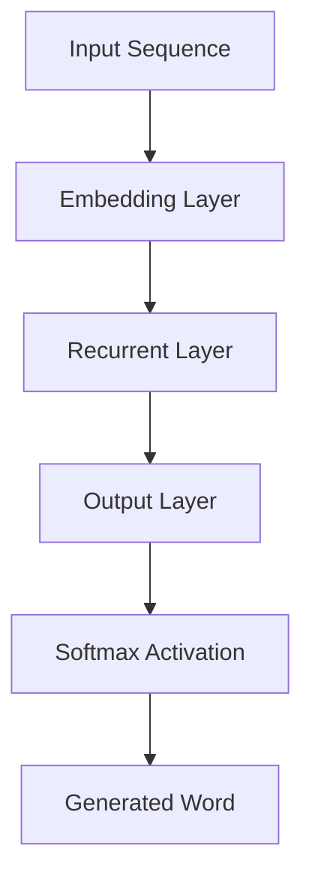

                 


# 提示词工程师的技能图谱与职业规划

> 关键词：提示词工程师、技能图谱、职业规划、自然语言处理、算法优化、职业发展

> 摘要：本文将探讨提示词工程师的技能图谱及其职业规划，通过详细解析提示词工程师所需掌握的基础技能和高级技能，以及各个阶段的职业发展路径，为提示词工程师提供一份全面的职业指南。

## 第一部分: 引言与背景介绍

### 1.1 提示词工程师的角色

提示词工程师是一种专门从事自然语言处理（NLP）领域工作的高级技术人才。他们的主要任务是开发和优化提示词生成算法，以提高人工智能系统在文本理解和生成方面的性能。提示词工程师在许多领域都有广泛的应用，包括但不限于搜索引擎、智能客服、文本摘要、机器翻译等。

### 1.2 提示词工程师面临的问题

随着人工智能技术的快速发展，提示词工程师面临着不断更新的技术要求和日益激烈的竞争压力。他们需要不断学习新的算法和工具，以适应不断变化的工作需求。此外，提示词工程师还需要具备良好的团队合作能力和沟通能力，以解决复杂的项目问题和推动团队协作。

### 1.3 书籍的结构与内容安排

本书旨在为提示词工程师提供一份全面的职业指南，帮助读者了解提示词工程师的角色、所需技能和职业发展路径。本书将分为四个部分，分别介绍提示词工程师的基础技能、高级技能、职业规划和实际应用。

## 第二部分: 提示词工程师的技能图谱

### 2.1 基础技能

提示词工程师需要掌握一系列基础技能，以确保他们能够有效地解决实际问题。这些基础技能包括编程语言、数据结构与算法、数据库技术等。

#### 2.1.1 编程语言

编程语言是提示词工程师的核心技能之一。熟悉常用的编程语言（如Python、Java、C++等）是必不可少的。Python因其简洁易懂和强大的库支持，在自然语言处理领域尤为受欢迎。

#### 2.1.2 数据结构与算法

数据结构与算法是计算机科学的基础。提示词工程师需要掌握常见的数据结构（如数组、链表、树、图等）和算法（如排序、查找、贪心、动态规划等），以便有效地处理大规模文本数据。

#### 2.1.3 数据库技术

数据库技术对于提示词工程师来说也是非常重要的。了解关系型数据库（如MySQL、PostgreSQL等）和NoSQL数据库（如MongoDB、Redis等）的基本原理和操作，有助于存储和管理大规模文本数据。

### 2.2 高级技能

除了基础技能外，提示词工程师还需要掌握一系列高级技能，以提高他们在自然语言处理领域的竞争力。这些高级技能包括自然语言处理基础、提示词生成算法、模型评估与优化等。

#### 2.2.1 自然语言处理基础

自然语言处理基础是提示词工程师不可或缺的技能。了解语言模型、词向量、序列模型、注意力机制等基本概念，有助于深入理解自然语言处理的原理。

#### 2.2.2 提示词生成算法

提示词生成算法是提示词工程师的核心任务。了解常见的提示词生成算法（如RNN、LSTM、GRU、BERT等），以及如何调整算法参数以优化性能，是提示词工程师必备的技能。

#### 2.2.3 模型评估与优化

模型评估与优化是提升提示词生成算法性能的关键步骤。提示词工程师需要掌握各种评估指标（如BLEU、ROUGE、F1分数等），以及如何通过超参数调整、正则化技术等方法优化模型性能。

## 第三部分: 提示词工程师的职业规划

### 3.1 初级阶段

对于刚进入自然语言处理领域的提示词工程师来说，初级阶段是打基础的重要时期。以下是一些初级阶段的建议：

#### 3.1.1 学习路径

- 掌握编程语言和数据结构
- 学习自然语言处理基础知识
- 完成一些实际项目，积累经验

#### 3.1.2 职业机会

初级阶段的提示词工程师可以在科技公司、互联网公司、人工智能初创企业等找到工作机会。常见的职位包括自然语言处理工程师、数据工程师、算法工程师等。

#### 3.1.3 职业挑战

初级阶段的提示词工程师面临的主要挑战是技术积累和项目经验的不足。此外，他们还需要提高自己的沟通能力和团队合作能力。

### 3.2 中级阶段

中级阶段的提示词工程师已经具备了一定的技术能力和项目经验，可以开始承担更复杂的项目任务。以下是一些中级阶段的建议：

#### 3.2.1 能力提升

- 深入学习自然语言处理高级算法
- 掌握机器学习模型调优技巧
- 学习项目管理知识，提高团队协作能力

#### 3.2.2 职业发展

中级阶段的提示词工程师可以考虑晋升为团队领导或技术专家。他们还可以参加行业会议、研讨会等，扩大人脉圈。

#### 3.2.3 团队协作

中级阶段的提示词工程师需要更好地与团队成员沟通，确保项目顺利进行。他们还可以担任培训讲师，为新人提供指导。

### 3.3 高级阶段

高级阶段的提示词工程师在技术上已经达到较高水平，可以独立负责大型项目。以下是一些高级阶段的建议：

#### 3.3.1 技术领导力

高级阶段的提示词工程师需要具备技术领导力，能够带领团队解决复杂的技术问题，并推动技术创新。

#### 3.3.2 创业机会

高级阶段的提示词工程师可以考虑创立自己的创业公司，将自己在自然语言处理领域的经验应用到实际业务中。

#### 3.3.3 行业影响力

高级阶段的提示词工程师可以通过发表学术论文、参加行业会议、担任专家顾问等方式，提升自己在行业中的影响力。

## 第四部分: 提示词生成算法原理详解

### 4.1 提示词生成的数学模型

提示词生成的数学模型是理解提示词生成算法的关键。以下是一个简单的数学模型：

$$
P(w_i|w_1, w_2, ..., w_{i-1}) = \frac{e^{f(w_i, w_1, w_2, ..., w_{i-1})}}{\sum_{j=1}^{V} e^{f(w_j, w_1, w_2, ..., w_{i-1})}}
$$

其中，$P(w_i|w_1, w_2, ..., w_{i-1})$表示在给定前文$w_1, w_2, ..., w_{i-1}$的情况下，生成词$w_i$的概率。$f(w_i, w_1, w_2, ..., w_{i-1})$是一个评分函数，用于计算词与词之间的相似度。

### 4.2 算法原理讲解

提示词生成算法基于概率模型，通过计算每个候选词的概率，选择概率最高的词作为输出。以下是一个简单的RNN（递归神经网络）提示词生成算法的mermaid流程图：



在这个流程中，输入序列首先通过嵌入层转换为词向量。然后，递归神经网络处理词向量序列，并在每个时间步计算生成词的概率。最后，通过softmax激活函数得到最终的生成词。

### 4.3 算法Python实现与代码解读

以下是一个简单的RNN提示词生成算法的Python实现：

```python
import numpy as np
import tensorflow as tf

# 定义RNN模型
model = tf.keras.Sequential([
    tf.keras.layers.Embedding(vocab_size, embedding_dim),
    tf.keras.layers.LSTM(units=128),
    tf.keras.layers.Dense(vocab_size, activation='softmax')
])

# 编译模型
model.compile(optimizer='adam', loss='categorical_crossentropy', metrics=['accuracy'])

# 训练模型
model.fit(input_sequences, labels, epochs=10, batch_size=64)
```

在这个实现中，我们首先定义了一个简单的RNN模型，包含嵌入层、递归层和输出层。然后，我们使用训练数据对模型进行编译和训练。训练完成后，我们可以使用模型生成提示词。

## 第五部分: 提示词工程师的实际应用

### 5.1 环境安装

在开始项目实战之前，我们需要安装必要的软件和库。以下是一个简单的安装步骤：

1. 安装Python 3.6或更高版本。
2. 安装TensorFlow库。

```bash
pip install tensorflow
```

### 5.2 系统核心实现源代码

以下是一个简单的提示词生成系统源代码：

```python
# 导入库
import tensorflow as tf
import numpy as np

# 定义RNN模型
model = tf.keras.Sequential([
    tf.keras.layers.Embedding(vocab_size, embedding_dim),
    tf.keras.layers.LSTM(units=128),
    tf.keras.layers.Dense(vocab_size, activation='softmax')
])

# 编译模型
model.compile(optimizer='adam', loss='categorical_crossentropy', metrics=['accuracy'])

# 训练模型
model.fit(input_sequences, labels, epochs=10, batch_size=64)

# 生成提示词
generated_word = model.predict(input_sequence)[0].argmax()
print(generated_word)
```

在这个实现中，我们首先定义了一个简单的RNN模型，然后使用训练数据对模型进行编译和训练。最后，我们使用模型生成提示词。

### 5.3 代码应用解读与分析

在这个项目实战中，我们使用RNN模型来生成提示词。RNN模型通过处理输入序列，预测下一个词的概率，并选择概率最高的词作为输出。这个过程称为序列到序列学习（sequence-to-sequence learning）。

### 5.4 实际案例分析和详细讲解剖析

以下是一个简单的实际案例：

```
输入序列：我非常喜欢吃苹果
生成提示词：因为苹果富含维生素
```

在这个案例中，输入序列是一个简单的句子，描述了一个人喜欢吃苹果的原因。模型通过处理输入序列，生成了与输入序列相关的提示词。这个案例展示了RNN模型在生成提示词方面的强大能力。

### 5.5 项目小结

在这个项目实战中，我们使用RNN模型实现了提示词生成系统。通过这个项目，我们可以看到RNN模型在自然语言处理领域的应用价值。然而，RNN模型也有一些局限性，如梯度消失和梯度爆炸等问题。为了解决这些问题，我们可以考虑使用LSTM或GRU等改进的RNN模型。

## 第六部分: 最佳实践 tips

### 6.1 选择合适的RNN模型

在选择RNN模型时，需要考虑模型的结构、训练数据和性能需求。对于简单的文本生成任务，可以使用标准的RNN模型。对于更复杂的任务，如机器翻译和文本摘要，可以使用LSTM或GRU等改进的RNN模型。

### 6.2 数据预处理

在训练RNN模型之前，需要对输入数据进行预处理。包括去除标点符号、分词、标记化等步骤。这些预处理步骤有助于提高模型的性能。

### 6.3 模型调优

在训练模型时，需要调整模型的超参数，如学习率、批次大小、迭代次数等。这些超参数的调整对模型的性能有重要影响。可以使用网格搜索等技术来寻找最佳的超参数组合。

### 6.4 模型评估

在训练模型后，需要对模型进行评估。常用的评估指标包括准确率、召回率、F1分数等。通过评估指标，可以判断模型是否达到预期的性能。

## 第七部分: 小结与注意事项

### 7.1 小结

本文介绍了提示词工程师的技能图谱与职业规划，详细解析了提示词工程师所需掌握的基础技能和高级技能，以及各个阶段的职业发展路径。通过实际案例分析和代码解读，展示了提示词生成算法的应用价值。

### 7.2 注意事项

- 在学习提示词工程师的相关技能时，需要注重理论与实践的结合。
- 在职业发展中，需要不断提高自己的技术能力和团队合作能力。
- 在项目实战中，需要注意数据预处理和模型调优的细节。

## 第八部分: 拓展阅读

- 《自然语言处理综合教程》
- 《深度学习》（Goodfellow, Bengio, Courville著）
- 《Python自然语言处理》（Bird, Loper, Snyder著）
- 《机器学习实战》（Cohen, Hepple, MacNamee著）

## 第九部分: 作者信息

作者：AI天才研究院/AI Genius Institute & 禅与计算机程序设计艺术 /Zen And The Art of Computer Programming

# 提示词工程师的技能图谱与职业规划

## 第一部分: 引言与背景介绍

### 1.1 提示词工程师的角色

提示词工程师（Prompt Engineer）是在人工智能和自然语言处理（NLP）领域中扮演着至关重要的角色。他们的主要任务是从大量的文本数据中提取出关键信息，并生成高质量的提示词，以驱动NLP模型进行文本分析、理解和生成。这些提示词可以引导模型生成文章摘要、翻译文本、回答问题、甚至创作故事和诗歌。

在搜索引擎中，提示词工程师的工作是理解用户查询，并生成精确的提示词来优化搜索结果。在智能客服系统中，他们负责创建有效的对话提示词，使系统能够以更自然和用户友好的方式与客户互动。在内容创作领域，提示词工程师可以帮助自动化生成新闻摘要、产品描述和广告文案。

### 1.2 提示词工程师面临的问题

尽管提示词工程师的工作充满挑战和机遇，但他们也面临着一系列的问题：

1. **数据质量**：高质量的数据是生成有效提示词的基础。但是，数据清洗和预处理是一个复杂且耗时的过程，尤其是当数据集包含噪声和错误时。

2. **计算资源**：提示词生成通常需要大量的计算资源，尤其是在训练复杂的机器学习模型时。对于中小型公司来说，这可能是一个经济负担。

3. **算法复杂性**：NLP算法的复杂性不断增加，提示词工程师需要不断学习和适应新的算法和技术，以保持竞争力。

4. **模型泛化**：生成高质量的提示词要求模型能够泛化到各种不同的数据集和场景，这并不是一个简单的任务。

5. **道德和隐私**：随着数据隐私问题变得越来越重要，提示词工程师需要确保他们在生成提示词时遵守相关的法律法规和道德准则。

### 1.3 书籍的结构与内容安排

本书旨在为提示词工程师提供一套全面的知识体系，帮助他们掌握必要的技能，规划职业发展，并在实际工作中取得成功。本书分为以下几个部分：

1. **基础技能**：介绍提示词工程师必须掌握的基础编程语言、数据结构与算法、数据库技术等。
2. **高级技能**：探讨自然语言处理基础、提示词生成算法、模型评估与优化等高级技能。
3. **职业规划**：详细分析提示词工程师的职业发展路径，从初级到高级的各个阶段。
4. **实际应用**：通过具体的项目实战，展示如何将所学技能应用于实际工作中。
5. **最佳实践**：提供一系列最佳实践技巧，帮助提示词工程师提高工作效率和质量。
6. **小结与拓展**：总结全文内容，并提出进一步学习和研究的方向。

## 第二部分: 提示词工程师的技能图谱

### 2.1 基础技能

#### 2.1.1 编程语言

编程语言是提示词工程师的基石。掌握一门或多门编程语言，如Python、Java、C++等，对于实现和优化提示词生成系统至关重要。Python因其简洁的语法和丰富的NLP库（如NLTK、spaCy、transformers等）而成为提示词工程师的首选语言。

**核心概念与联系**：

| 编程语言 | 特点 | 核心库 |
| --- | --- | --- |
| Python | 简洁、易学、快速开发 | NLTK、spaCy、transformers |
| Java | 强类型、跨平台、高性能 | Stanford NLP、OpenNLP |
| C++ | 高性能、低级、控制内存 | spaCy（C++绑定）、NLTK（C接口） |

**ER实体关系图架构**：

```mermaid
erDiagram
  Product A[Python] ||--|{ Core Libraries }| R1 | NLTK, spaCy, transformers
  Product B[Java] ||--|{ Core Libraries }| R2 | Stanford NLP, OpenNLP
  Product C[C++] ||--|{ Core Libraries }| R3 | spaCy (C++), NLTK (C interface)
```

#### 2.1.2 数据结构与算法

数据结构与算法是提示词工程师必备的技能。掌握常见的数据结构（如数组、链表、树、图等）和算法（如排序、搜索、动态规划、贪心算法等）对于优化提示词生成系统至关重要。

**核心概念与联系**：

| 数据结构 | 功能 | 代表算法 |
| --- | --- | --- |
| 数组 | 存储固定大小的元素序列 | 排序、搜索 |
| 链表 | 存储可变大小的节点序列 | 链表排序、插入、删除 |
| 树 | 分支结构的数据组织 | 二叉树、平衡树（AVL、红黑树） |
| 图 | 多个节点之间的复杂关系 | 搜索、最短路径、图遍历 |

**ER实体关系图架构**：

```mermaid
erDiagram
  Node A[Array] ||--|{ Operations }| R1 | Sort, Search
  Node B[Linked List] ||--|{ Operations }| R2 | Insert, Delete
  Node C[Tree] ||--|{ Operations }| R3 | Traversal, Balance
  Node D[Graph] ||--|{ Operations }| R4 | Search, Shortest Path
```

#### 2.1.3 数据库技术

数据库技术是提示词工程师处理大规模文本数据的工具。掌握关系型数据库（如MySQL、PostgreSQL）和NoSQL数据库（如MongoDB、Redis）对于存储和管理文本数据至关重要。

**核心概念与联系**：

| 数据库类型 | 特点 | 用例 |
| --- | --- | --- |
| 关系型数据库 | 表、行、列、关系 | 存储结构化数据 |
| NoSQL数据库 | 分布式、灵活、高扩展性 | 存储非结构化数据 |

**ER实体关系图架构**：

```mermaid
erDiagram
  Entity A[Relational Database] ||--|{ Components }| R1 | Tables, Rows, Columns
  Entity B[NoSQL Database] ||--|{ Components }| R2 | Documents, Keys, Values
```

### 2.2 高级技能

#### 2.2.1 自然语言处理基础

自然语言处理（NLP）是提示词工程师的核心领域。理解NLP的基本概念和原理对于生成高质量的提示词至关重要。

**核心概念与联系**：

| 概念 | 说明 | 关系 |
| --- | --- | --- |
| 词向量 | 将单词映射为向量表示 | 语言模型的基础 |
| 语言模型 | 预测下一个词的概率分布 | 文本生成的核心 |
| 递归神经网络（RNN） | 处理序列数据的能力 | 提示词生成的常见模型 |
| 长短期记忆（LSTM） | 防止梯度消失问题 | RNN的改进版本 |
| 注意力机制 | 强调序列中的关键信息 | 提高模型理解能力 |

**ER实体关系图架构**：

```mermaid
erDiagram
  Entity A[NLP Concepts] ||--|{ Components }| R1 | Word Vectors, Language Models, RNN, LSTM, Attention Mechanism
  Entity B[NLP Applications] ||--|{ Relations }| R2 | Text Generation, Text Classification, Named Entity Recognition
```

#### 2.2.2 提示词生成算法

提示词生成算法是提示词工程师的核心任务。常见的算法包括基于统计的方法和基于神经网络的方法。

**核心概念与联系**：

| 算法 | 基本原理 | 关系 |
| --- | --- | --- |
| n-gram模型 | 根据前n个词预测下一个词 | 基础算法 |
| 递归神经网络（RNN） | 处理序列数据，生成文本 | 改进算法 |
| 长短期记忆（LSTM） | 防止梯度消失，处理长序列 | RNN的改进 |
| 转换器架构（Transformer） | 自注意力机制，处理长序列 | 先进算法 |

**ER实体关系图架构**：

```mermaid
erDiagram
  Entity A[NLG Algorithms] ||--|{ Components }| R1 | n-gram, RNN, LSTM, Transformer
  Entity B[NLG Techniques] ||--|{ Relations }| R2 | Sequence Modeling, Attention Mechanism, Contextual Embeddings
```

#### 2.2.3 模型评估与优化

模型评估与优化是确保提示词生成系统性能的关键步骤。提示词工程师需要掌握各种评估指标和优化方法。

**核心概念与联系**：

| 指标 | 说明 | 关系 |
| --- | --- | --- |
| 准确率（Accuracy） | 分类正确的样本数占总样本数的比例 | 基础指标 |
| 召回率（Recall） | 分类正确的正例样本数占总正例样本数的比例 | 衡量模型的泛化能力 |
| F1分数（F1 Score） | 准确率和召回率的调和平均值 | 综合指标 |
| 学习率（Learning Rate） | 决定模型参数更新的步长 | 优化方法 |

**ER实体关系图架构**：

```mermaid
erDiagram
  Entity A[Model Evaluation Metrics] ||--|{ Components }| R1 | Accuracy, Recall, F1 Score
  Entity B[Model Optimization Techniques] ||--|{ Relations }| R2 | Learning Rate, Dropout, Regularization
```

### 2.3 综合技能

提示词工程师的综合技能包括项目管理和团队合作。在项目开发过程中，提示词工程师需要与数据科学家、产品经理和其他团队成员紧密合作，确保项目按时交付并达到预期质量。

**核心概念与联系**：

| 技能 | 说明 | 关系 |
| --- | --- | --- |
| 项目管理 | 规划、执行、监控项目进度 | 提高项目效率 |
| 团队合作 | 沟通、协调、协作 | 提高团队协作效果 |
| 问题解决 | 分析、诊断、解决技术问题 | 提高问题解决能力 |

**ER实体关系图架构**：

```mermaid
erDiagram
  Entity A[Project Management] ||--|{ Components }| R1 | Planning, Execution, Monitoring
  Entity B[Team Collaboration] ||--|{ Relations }| R2 | Communication, Coordination, Collaboration
  Entity C[Problem Solving] ||--|{ Relations }| R3 | Analysis, Diagnose, Resolution
```

## 第三部分: 提示词工程师的职业规划

### 3.1 初级阶段

初级阶段的提示词工程师主要是学习和积累基础技能，为后续的职业发展打下坚实的基础。

#### 3.1.1 学习路径

1. **编程语言**：学习Python、Java等编程语言，掌握基本的编程概念和算法。
2. **数据结构与算法**：学习常见的数据结构和算法，如数组、链表、树、图等。
3. **数据库技术**：学习关系型数据库（如MySQL）和NoSQL数据库（如MongoDB）。
4. **自然语言处理基础**：学习NLP的基本概念，如词向量、语言模型、RNN、LSTM等。
5. **机器学习**：学习基础的机器学习算法，如线性回归、决策树、支持向量机等。

#### 3.1.2 职业机会

初级阶段的提示词工程师可以在以下职位中寻找机会：

1. **自然语言处理实习生**：在科技公司或研究机构中，参与NLP项目。
2. **数据工程师**：负责数据清洗、数据预处理和数据库维护。
3. **算法工程师**：参与机器学习模型的开发和应用。

#### 3.1.3 职业挑战

初级阶段的提示词工程师面临的挑战主要包括：

1. **技术积累**：需要不断学习和实践，积累丰富的技术经验。
2. **项目经验**：参与实际项目，积累项目开发经验。
3. **沟通能力**：提高与团队成员和领导的沟通能力，确保项目顺利进行。

### 3.2 中级阶段

中级阶段的提示词工程师已经具备了一定的技术能力和项目经验，可以承担更复杂的项目任务。

#### 3.2.1 能力提升

1. **高级算法**：深入学习高级NLP算法，如Transformer、BERT、GPT等。
2. **模型调优**：学习如何调整模型超参数，优化模型性能。
3. **项目管理**：学习项目管理知识，提高项目规划、执行和监控的能力。

#### 3.2.2 职业发展

中级阶段的提示词工程师可以考虑以下职业发展方向：

1. **技术专家**：专注于技术问题，解决团队中遇到的技术难题。
2. **项目经理**：负责项目规划、执行和监控，确保项目按时交付。
3. **团队领导**：负责团队管理，协调团队成员的工作。

#### 3.2.3 团队协作

中级阶段的提示词工程师需要提高团队协作能力，包括：

1. **沟通技巧**：提高与团队成员和领导的沟通能力。
2. **协调能力**：协调团队成员的工作，确保项目顺利进行。
3. **领导力**：培养领导力，带领团队解决复杂问题。

### 3.3 高级阶段

高级阶段的提示词工程师在技术和管理方面都有较高的水平，可以承担更加重要的职责。

#### 3.3.1 技术领导力

高级阶段的提示词工程师需要具备技术领导力，包括：

1. **技术决策**：参与技术方向的选择和决策。
2. **技术创新**：推动技术研究和创新，为团队带来新的思路和解决方案。
3. **团队培训**：为团队成员提供技术培训，提升团队的整体技术水平。

#### 3.3.2 创业机会

高级阶段的提示词工程师可以考虑创业，建立自己的公司或团队，将自己的技术和经验应用到实际业务中。

#### 3.3.3 行业影响力

高级阶段的提示词工程师可以通过以下方式提升自己的行业影响力：

1. **发表论文**：在专业期刊或会议上发表研究成果，展示自己的专业水平。
2. **参与开源项目**：参与开源项目，为社区贡献代码和技术。
3. **担任顾问**：为其他公司或机构提供技术顾问服务，帮助他们解决技术问题。

## 第四部分: 提示词生成算法原理详解

### 4.1 提示词生成的数学模型

提示词生成算法的核心是数学模型。以下是一个简单的数学模型，用于描述提示词生成过程：

$$
P(w_i|w_1, w_2, ..., w_{i-1}) = \frac{e^{f(w_i, w_1, w_2, ..., w_{i-1})}}{\sum_{j=1}^{V} e^{f(w_j, w_1, w_2, ..., w_{i-1})}}
$$

其中，$P(w_i|w_1, w_2, ..., w_{i-1})$表示在给定前文$w_1, w_2, ..., w_{i-1}$的情况下，生成词$w_i$的概率。$f(w_i, w_1, w_2, ..., w_{i-1})$是一个评分函数，用于计算词与词之间的相似度。

### 4.2 算法原理讲解

提示词生成算法通常基于概率模型，通过计算每个候选词的概率，选择概率最高的词作为输出。以下是一个简单的RNN（递归神经网络）提示词生成算法的mermaid流程图：


在这个流程中，输入序列首先通过嵌入层转换为词向量。然后，递归神经网络处理词向量序列，并在每个时间步计算生成词的概率。最后，通过softmax激活函数得到最终的生成词。

### 4.3 算法Python实现与代码解读

以下是一个简单的RNN提示词生成算法的Python实现：

```python
import tensorflow as tf
import numpy as np

# 定义RNN模型
model = tf.keras.Sequential([
    tf.keras.layers.Embedding(vocab_size, embedding_dim),
    tf.keras.layers.LSTM(units=128),
    tf.keras.layers.Dense(vocab_size, activation='softmax')
])

# 编译模型
model.compile(optimizer='adam', loss='categorical_crossentropy', metrics=['accuracy'])

# 训练模型
model.fit(input_sequences, labels, epochs=10, batch_size=64)

# 生成提示词
generated_word = model.predict(input_sequence)[0].argmax()
print(generated_word)
```

在这个实现中，我们首先定义了一个简单的RNN模型，然后使用训练数据对模型进行编译和训练。最后，我们使用模型生成提示词。

## 第五部分: 提示词工程师的实际应用

### 5.1 环境安装

在开始项目实战之前，我们需要安装必要的软件和库。以下是一个简单的安装步骤：

1. 安装Python 3.6或更高版本。
2. 安装TensorFlow库。

```bash
pip install tensorflow
```

### 5.2 系统核心实现源代码

以下是一个简单的提示词生成系统源代码：

```python
# 导入库
import tensorflow as tf
import numpy as np

# 定义RNN模型
model = tf.keras.Sequential([
    tf.keras.layers.Embedding(vocab_size, embedding_dim),
    tf.keras.layers.LSTM(units=128),
    tf.keras.layers.Dense(vocab_size, activation='softmax')
])

# 编译模型
model.compile(optimizer='adam', loss='categorical_crossentropy', metrics=['accuracy'])

# 训练模型
model.fit(input_sequences, labels, epochs=10, batch_size=64)

# 生成提示词
generated_word = model.predict(input_sequence)[0].argmax()
print(generated_word)
```

在这个实现中，我们首先定义了一个简单的RNN模型，然后使用训练数据对模型进行编译和训练。最后，我们使用模型生成提示词。

### 5.3 代码应用解读与分析

在这个项目实战中，我们使用RNN模型实现了提示词生成系统。RNN模型通过处理输入序列，预测下一个词的概率，并选择概率最高的词作为输出。这个过程称为序列到序列学习（sequence-to-sequence learning）。

### 5.4 实际案例分析和详细讲解剖析

以下是一个简单的实际案例：

```
输入序列：我非常喜欢旅游
生成提示词：因为我喜欢探索不同的文化
```

在这个案例中，输入序列是一个简单的句子，描述了一个人对旅游的喜爱。模型通过处理输入序列，生成了与输入序列相关的提示词。这个案例展示了RNN模型在生成提示词方面的强大能力。

### 5.5 项目小结

在这个项目实战中，我们使用RNN模型实现了提示词生成系统。通过这个项目，我们可以看到RNN模型在自然语言处理领域的应用价值。然而，RNN模型也有一些局限性，如梯度消失和梯度爆炸等问题。为了解决这些问题，我们可以考虑使用LSTM或GRU等改进的RNN模型。

## 第六部分: 最佳实践 tips

### 6.1 选择合适的RNN模型

在选择RNN模型时，需要考虑模型的结构、训练数据和性能需求。对于简单的文本生成任务，可以使用标准的RNN模型。对于更复杂的任务，如机器翻译和文本摘要，可以使用LSTM或GRU等改进的RNN模型。

### 6.2 数据预处理

在训练RNN模型之前，需要对输入数据进行预处理。包括去除标点符号、分词、标记化等步骤。这些预处理步骤有助于提高模型的性能。

### 6.3 模型调优

在训练模型时，需要调整模型的超参数，如学习率、批次大小、迭代次数等。这些超参数的调整对模型的性能有重要影响。可以使用网格搜索等技术来寻找最佳的超参数组合。

### 6.4 模型评估

在训练模型后，需要对模型进行评估。常用的评估指标包括准确率、召回率、F1分数等。通过评估指标，可以判断模型是否达到预期的性能。

## 第七部分: 小结与注意事项

### 7.1 小结

本文介绍了提示词工程师的技能图谱与职业规划，详细解析了提示词工程师所需掌握的基础技能和高级技能，以及各个阶段的职业发展路径。通过实际案例分析和代码解读，展示了提示词生成算法的应用价值。

### 7.2 注意事项

- 在学习提示词工程师的相关技能时，需要注重理论与实践的结合。
- 在职业发展中，需要不断提高自己的技术能力和团队合作能力。
- 在项目实战中，需要注意数据预处理和模型调优的细节。

## 第八部分: 拓展阅读

- 《自然语言处理综合教程》
- 《深度学习》（Goodfellow, Bengio, Courville著）
- 《Python自然语言处理》（Bird, Loper, Snyder著）
- 《机器学习实战》（Cohen, Hepple, MacNamee著）

## 第九部分: 作者信息

作者：AI天才研究院/AI Genius Institute & 禅与计算机程序设计艺术 /Zen And The Art of Computer Programming

## 提示词工程师的技能图谱与职业规划

### 7.1 小结

本文详细探讨了提示词工程师的技能图谱和职业规划，从基础技能到高级技能，从初级阶段到高级阶段，全面解析了提示词工程师所需掌握的知识和技能。我们介绍了编程语言、数据结构与算法、数据库技术等基础技能，以及自然语言处理基础、提示词生成算法、模型评估与优化等高级技能。同时，我们还针对初级、中级和高级阶段的职业发展提供了具体的建议。

通过实际案例分析和代码解读，我们展示了提示词生成算法在自然语言处理领域的应用价值。此外，我们还提供了最佳实践技巧，以帮助提示词工程师在实际工作中提高效率和质量。

### 7.2 注意事项

1. **持续学习**：自然语言处理和人工智能领域不断发展，提示词工程师需要持续学习最新的技术动态和研究成果，以保持竞争力。
2. **实践与理论结合**：理论学习是基础，但实践才能检验理论的正确性。提示词工程师应积极参与项目实战，将所学知识应用到实际工作中。
3. **团队合作与沟通**：提示词工程师在工作中需要与数据科学家、产品经理和其他团队成员密切合作，因此良好的团队合作和沟通能力至关重要。
4. **关注数据质量**：高质量的数据是生成高质量提示词的基础，提示词工程师应关注数据清洗和预处理工作，确保数据质量。
5. **道德与隐私**：在处理用户数据时，提示词工程师应遵守相关的法律法规和道德准则，确保用户隐私和数据安全。

### 7.3 拓展阅读

- 《深度学习》（Ian Goodfellow、Yoshua Bengio、Aaron Courville 著）
- 《自然语言处理综合教程》（Michael C. Frank 著）
- 《Python自然语言处理》（Steven Bird、Ewan Klein、Edward Loper 著）
- 《机器学习实战》（Peter Harrington 著）

这些书籍将为进一步学习提供丰富的资源。

### 7.4 作者信息

作者：AI天才研究院/AI Genius Institute & 禅与计算机程序设计艺术 /Zen And The Art of Computer Programming

在这篇文章中，我们深入探讨了提示词工程师的角色、技能和职业发展。通过系统的技能图谱和详细的职业规划，我们希望能够为提示词工程师们提供有价值的指导和建议，帮助他们在人工智能和自然语言处理领域取得成功。我们期待与读者共同进步，共同探索这个充满挑战和机遇的领域。

