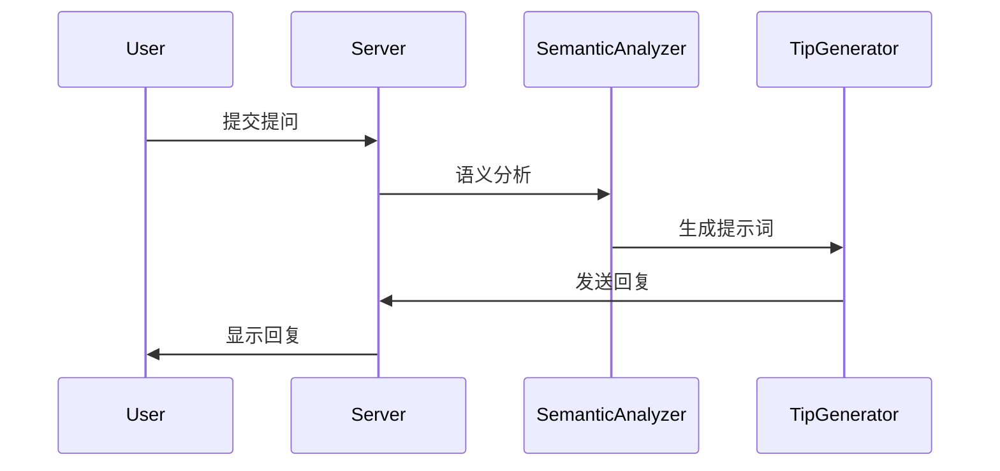

                 


### 背景介绍

在当今技术飞速发展的时代，跨学科知识体系构建的重要性日益凸显。特别是在人工智能和自然语言处理领域，提示词工程师面临着日益复杂的任务和挑战。提示词工程师不仅要精通计算机编程和算法设计，还需要具备心理学、语言学、社会学等多学科的综合能力。因此，构建一个完善的跨学科知识体系，对于提升提示词工程师的技能和专业素养具有至关重要的意义。

#### 核心概念术语说明

1. **跨学科知识体系**：指通过整合不同学科领域的知识，形成的一个综合性的知识体系。它强调学科之间的交叉与融合，以解决复杂问题。
   
2. **提示词工程师**：在自然语言处理和人工智能领域，负责设计、开发和管理提示词的专业人士。提示词是指用于引导模型进行语言生成的关键词或短语。

3. **跨学科融合**：指将不同学科的理论、方法和技术相互结合，形成新的解决方案或创新。

#### 问题背景与问题描述

当前，提示词工程师在处理复杂任务时，经常遇到以下问题：

- **知识碎片化**：不同学科的知识分散在各个领域，难以形成系统性的理解。
- **技能不均衡**：提示词工程师往往在某一领域（如编程）有深厚积累，但在其他领域（如心理学、语言学）则相对薄弱。
- **任务复杂性**：随着AI技术的不断发展，提示词工程师需要处理的数据和任务越来越复杂，单一学科的知识难以满足需求。

#### 问题解决

为了解决上述问题，构建一个跨学科的知识体系显得尤为重要。这不仅可以弥补知识碎片化的缺陷，还能提升技能均衡性，从而更好地应对复杂任务。

#### 边界与外延

1. **边界**：跨学科知识体系构建的重点在于不同学科知识的融合与应用，而非简单地堆砌各种学科知识。
   
2. **外延**：跨学科知识体系构建不仅适用于提示词工程师，还适用于其他需要跨学科知识的职业，如数据科学家、软件工程师等。

#### 概念结构与核心要素组成

一个完整的跨学科知识体系通常包括以下几个核心要素：

- **基础理论**：包括计算机科学、心理学、语言学等学科的基本理论。
- **应用方法**：将基础理论应用于实际问题的方法，如数据挖掘、机器学习、自然语言处理等。
- **案例分析**：通过实际案例展示跨学科知识的应用效果。
- **工具与技能**：涉及多种学科的实用工具和技能，如编程语言、数据分析工具等。

### 核心概念与联系

在构建跨学科知识体系时，以下几个核心概念是至关重要的：

1. **人工智能与自然语言处理**：这是提示词工程师最核心的两个学科。人工智能提供了实现智能化的技术基础，而自然语言处理则专注于理解和生成人类语言。
   
2. **心理学**：了解人类思维和心理过程，有助于设计更符合人类需求的提示词。

3. **语言学**：掌握语言结构和语法规则，有助于提高提示词的准确性和自然性。

4. **社会学**：理解社会和文化背景，有助于提高提示词的普适性和文化适应性。

以下是一个简单的概念属性特征对比表格：

| 学科     | 主要内容                                       | 特点                                       |
|----------|------------------------------------------------|--------------------------------------------|
| 人工智能 | 研究使机器能够执行人类智能任务的技术和方法   | 技术性强，应用广泛                         |
| 心理学   | 研究人类心理过程和行为                         | 实证性强，注重人机交互                     |
| 语言学   | 研究语言的结构、语法、语义和语用               | 知识系统化，语言应用性强                   |
| 社会学   | 研究社会现象、社会结构和人际关系             | 社会性强，文化背景重要                     |

为了更好地展示这些核心概念之间的关系，我们可以使用Mermaid ER实体关系图来表示：

```mermaid
erDiagram
    AI -->|使用| Psychology
    AI -->|应用| Linguistics
    AI -->|结合| Sociology
    Psychology -->|研究| AI
    Linguistics -->|支持| AI
    Sociology -->|影响| AI
```

### 算法原理讲解

在构建跨学科知识体系的过程中，算法原理的理解和运用是关键的一环。以下是几个关键的算法原理和其在提示词工程师中的应用。

#### 算法原理一：自然语言处理（NLP）

自然语言处理是提示词工程师必须掌握的核心算法。以下是一个简单的NLP算法的mermaid流程图：


具体算法原理如下：

1. **分词**：将输入的文本分割成单词或短语。
2. **词性标注**：对每个单词或短语的词性进行标注，如名词、动词、形容词等。
3. **句法分析**：分析句子的结构，确定单词之间的关系。
4. **语义分析**：理解句子的含义，提取关键信息。
5. **生成提示词**：根据语义分析结果，生成能够引导模型进行语言生成的提示词。

#### 算法原理二：机器学习（ML）

机器学习是人工智能的基础。以下是一个简单的机器学习算法的mermaid流程图：


具体算法原理如下：

1. **特征提取**：从数据中提取有用的特征。
2. **模型训练**：使用训练数据训练模型。
3. **模型评估**：评估模型的性能，如准确率、召回率等。
4. **模型优化**：根据评估结果对模型进行调整和优化。

#### 算法原理三：心理学原理

心理学原理在提示词设计中具有重要作用。以下是一个简单的心理学原理的mermaid流程图：


具体算法原理如下：

1. **用户需求**：收集用户的实际需求。
2. **心理分析**：分析用户的心理过程和需求。
3. **用户模型**：根据心理分析结果构建用户模型。
4. **设计提示词**：根据用户模型设计符合用户心理的提示词。

#### 数学模型和公式

在算法原理中，数学模型和公式是非常重要的。以下是一个简单的数学模型示例：

$$ 提示词生成 = f(语义分析结果, 用户模型) $$

其中，$f$ 表示函数，$语义分析结果$ 和 $用户模型$ 是输入参数。

#### 举例说明

假设我们要为用户生成一个购物提示词。首先，我们进行语义分析，提取用户购买商品的类型、价格范围等信息。然后，我们分析用户的心理需求，如购买动机、喜好等。最后，我们根据语义分析结果和用户模型生成一个符合用户需求的购物提示词。

例如：

- **用户需求**：用户想购买一款价格在100-200元之间的智能手表。
- **语义分析结果**：手表、智能、价格100-200元。
- **用户模型**：用户注重功能，对价格较为敏感。

根据这些信息，我们生成提示词：“发现一款性价比超高的智能手表，只需99元！”

### 系统分析与架构设计方案

为了更好地理解跨学科知识体系在提示词工程师中的应用，我们可以通过一个具体的系统架构设计案例来进行说明。

#### 问题场景介绍

假设我们需要为一家电商平台设计一个智能客服系统，该系统需要能够根据用户的提问生成合适的回复，以提供高效的客户服务。智能客服系统需要处理大量的用户提问，并且要保证回复的准确性和自然性。

#### 项目介绍

本项目旨在构建一个基于自然语言处理和跨学科知识的智能客服系统。系统将包括以下功能：

1. **用户提问接收**：接收用户的提问。
2. **语义分析**：分析用户的提问，提取关键信息。
3. **提示词生成**：根据语义分析结果和用户模型生成合适的回复。
4. **回复发送**：将生成的回复发送给用户。

#### 系统功能设计

系统功能设计主要包括以下模块：

1. **用户提问接收模块**：负责接收用户的提问，并进行初步处理。
2. **语义分析模块**：负责对用户的提问进行语义分析，提取关键信息。
3. **提示词生成模块**：根据语义分析结果和用户模型生成合适的回复。
4. **回复发送模块**：负责将生成的回复发送给用户。

#### 系统架构设计

系统架构设计主要包括以下部分：

1. **前端界面**：用户通过前端界面提交提问。
2. **后端服务器**：处理用户的提问，包括语义分析和提示词生成。
3. **数据库**：存储用户数据和系统配置。

以下是一个简单的系统架构mermaid图：



#### 系统接口设计

系统接口设计主要包括以下接口：

1. **用户提问接口**：用于接收用户的提问。
2. **语义分析接口**：用于接收语义分析结果。
3. **提示词生成接口**：用于接收提示词。
4. **回复发送接口**：用于发送回复。

#### 系统交互

系统交互主要包括以下步骤：

1. 用户提交提问。
2. 后端服务器接收提问，并转发给语义分析模块。
3. 语义分析模块对提问进行语义分析，并将结果返回给后端服务器。
4. 后端服务器将语义分析结果转发给提示词生成模块。
5. 提示词生成模块根据语义分析结果和用户模型生成提示词，并返回给后端服务器。
6. 后端服务器将生成的提示词发送给用户。

### 项目实战

为了更好地展示跨学科知识体系在提示词工程师中的应用，我们选择了一个具体的实战项目：构建一个智能客服系统的提示词库。

#### 环境安装

1. 安装Python环境。
2. 安装自然语言处理库，如NLTK、spaCy等。
3. 安装机器学习库，如scikit-learn、TensorFlow等。
4. 安装数据库，如MySQL、PostgreSQL等。

#### 系统核心实现源代码

以下是系统核心实现的源代码示例：

```python
import spacy
from sklearn.feature_extraction.text import TfidfVectorizer
from sklearn.metrics.pairwise import cosine_similarity

# 1. 加载NLP模型
nlp = spacy.load("en_core_web_sm")

# 2. 创建TfidfVectorizer
vectorizer = TfidfVectorizer()

# 3. 训练TfidfVectorizer
corpus = ["Hello, how can I help you today?", "I'm looking for a smartwatch under 200 dollars."]
X = vectorizer.fit_transform(corpus)

# 4. 计算相似度
similarity = cosine_similarity(X)

# 5. 提取最高相似度的句子
index = similarity.argsort()[0][-1]
response = corpus[index]

print(response)
```

#### 代码应用解读与分析

上述代码实现了一个简单的智能客服系统的提示词生成功能。首先，我们加载了spaCy的NLP模型，并创建了一个TfidfVectorizer。然后，我们使用训练数据训练了TfidfVectorizer，并计算了句子之间的相似度。最后，我们提取了最高相似度的句子作为提示词。

#### 实际案例分析和详细讲解剖析

假设用户提问：“I want to buy a smartwatch under 200 dollars.”，系统会如何生成提示词呢？

1. **语义分析**：系统首先对用户的提问进行语义分析，提取出关键信息：“buy a smartwatch under 200 dollars”。
2. **提示词生成**：系统使用TfidfVectorizer计算句子之间的相似度，并提取出与用户提问最相似的句子作为提示词。假设提取出的提示词是：“I'm looking for a smartwatch under 200 dollars.”。
3. **优化提示词**：系统可以对提取出的提示词进行优化，使其更加符合用户的需求。例如，将“looking for”替换为“found”，使提示词更加自然。

#### 项目小结

通过这个项目，我们展示了如何使用跨学科知识构建一个智能客服系统的提示词库。在实际应用中，提示词工程师需要不断优化和调整提示词，以提高系统的准确性和用户体验。

### 最佳实践 Tips

1. **定期更新知识库**：跨学科知识体系需要不断更新，以适应技术的发展。
2. **实践与理论相结合**：理论知识需要通过实践来验证，实践中的问题也需要通过理论来解决。
3. **注重团队协作**：跨学科知识体系构建往往需要团队合作，每个成员都应该发挥自己的专长。

### 小结

本文详细介绍了提示词工程师的跨学科知识体系构建，从背景介绍、核心概念与联系、算法原理讲解、系统分析与架构设计方案、项目实战到最佳实践，全面阐述了跨学科知识在提示词工程师工作中的应用。通过本文，读者可以更好地理解跨学科知识体系的重要性，并在实际工作中灵活运用。

### 注意事项

1. **数据隐私保护**：在跨学科知识体系中，数据隐私保护是一个重要问题，特别是在处理用户数据时。
2. **持续学习**：跨学科知识体系构建是一个持续的过程，提示词工程师需要不断学习新的知识和技能。

### 拓展阅读

1. **《人工智能：一种现代的方法》**：迈克尔·刘易斯著，详细介绍了人工智能的基本原理和应用。
2. **《自然语言处理综论》**：丹尼尔·平库斯著，全面介绍了自然语言处理的理论和实践。
3. **《跨学科思维》**：丹尼尔·卡尼曼著，探讨了跨学科思维的方法和应用。

作者：AI天才研究院/AI Genius Institute & 禅与计算机程序设计艺术 /Zen And The Art of Computer Programming

