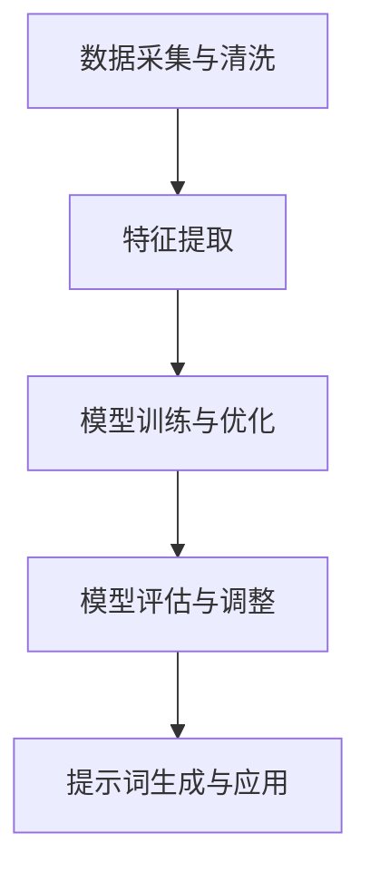

                 

# 提示词工程师：21世纪的新兴职业剖析

## 关键词
- 提示词工程师
- 人工智能
- 自然语言处理
- 职业发展
- 技术挑战

## 摘要
本文旨在深入剖析提示词工程师这一21世纪的新兴职业。文章将首先介绍提示词工程师的职业背景和定义，然后探讨其核心概念与要素，通过算法原理讲解、系统架构设计、项目实战和最佳实践，全面揭示这一职业的技术内涵与未来发展前景。作者将结合丰富的行业经验和专业知识，提供实用的建议和总结，帮助读者更好地理解和应对这一新兴职业的挑战。

## 目录

----------------------------------------------------------------

## 第1章：职业背景与核心概念

### 1.1 职业背景

在数字化时代，人工智能和自然语言处理技术取得了飞速发展。随着大数据和云计算的普及，自然语言处理（NLP）的应用场景日益广泛，从智能客服、智能推荐到自动驾驶、医疗诊断，NLP技术正在深刻改变着我们的生活和工作方式。在这样的背景下，提示词工程师这一新兴职业应运而生。

#### 问题描述

提示词工程师的核心职责是设计、开发和应用提示词系统，以提升自然语言处理任务的效率和准确性。然而，随着应用场景的复杂化，提示词工程师面临的挑战也越来越大。例如：

1. 如何处理海量数据，确保数据质量和完整性？
2. 如何设计高效的算法，满足不同场景的需求？
3. 如何平衡模型复杂性和计算性能？

#### 问题解决

提示词工程师通过以下几个方面解决问题：

1. **数据准备与处理**：收集、清洗、标注数据，为模型训练提供高质量的数据集。
2. **算法设计**：基于深度学习、统计学习等方法，设计高效、可靠的提示词生成算法。
3. **模型优化**：通过调参、迁移学习等技术，优化模型性能，提高提示词质量。
4. **系统部署与维护**：构建可扩展、可维护的系统架构，确保提示词系统稳定运行。

#### 边界与外延

提示词工程师的工作范围包括但不限于以下几个方面：

1. **自然语言处理**：涉及文本分类、情感分析、命名实体识别等任务。
2. **机器学习与深度学习**：负责模型设计、训练和优化。
3. **数据工程**：处理数据采集、存储、清洗等环节。
4. **软件工程**：开发、部署和维护提示词系统。

### 1.2 职业定义

提示词工程师（Keyword Engineer）是专门从事自然语言处理任务中提示词设计、开发、优化和应用的工程技术专家。其核心职责包括：

1. **提示词设计**：根据业务需求，设计合适的提示词策略。
2. **算法开发**：实现提示词生成算法，优化模型性能。
3. **系统部署**：构建、部署和维护提示词系统。
4. **数据分析**：分析提示词效果，提供改进建议。

### 1.3 职业发展前景

随着人工智能技术的不断进步，提示词工程师的职业发展前景十分广阔。以下是几个关键点：

1. **市场需求**：随着自然语言处理技术的广泛应用，提示词工程师的需求持续增长。
2. **技术挑战**：面对复杂的业务场景，提示词工程师需要不断学习新知识，提升自身能力。
3. **职业晋升**：提示词工程师可以通过积累经验，逐步晋升为项目经理、技术总监等职位。
4. **跨界发展**：提示词工程师可以跨界到其他领域，如大数据、云计算等，实现职业的多元化发展。

## 第2章：核心概念与联系

### 2.1 提示词的定义与作用

#### 定义

提示词（Keyword）是自然语言处理中用于描述文本主题或内容的词汇。在NLP任务中，提示词起到关键作用，如：

1. **文本分类**：用于分类标签的词汇。
2. **情感分析**：用于判断文本情感倾向的词汇。
3. **命名实体识别**：用于识别人名、地名等实体名称的词汇。

#### 作用

提示词在NLP任务中的作用主要包括：

1. **特征提取**：将文本转化为结构化数据，方便后续处理。
2. **任务导向**：根据提示词，实现特定任务的自动化处理。
3. **优化性能**：通过合理选择提示词，提升模型性能。

### 2.2 提示词的分类与特征

#### 分类

根据应用场景，提示词可以分为以下几类：

1. **通用提示词**：适用于多种NLP任务，如文本分类、情感分析等。
2. **领域特定提示词**：针对特定领域的NLP任务，如医疗、金融等。
3. **关键词提示词**：用于搜索引擎优化的提示词。

#### 特征

提示词的特征主要包括：

1. **词频**：提示词在文本中出现的频率。
2. **词性**：提示词的词性，如名词、动词等。
3. **语义**：提示词的语义信息，如描述性、指示性等。

### 2.3 提示词工程的挑战与机遇

#### 挑战

1. **数据质量**：高质量的数据是提示词工程的基础，数据质量直接影响提示词的效果。
2. **算法性能**：如何设计高效的算法，提高提示词生成和应用的性能。
3. **业务需求**：满足不同业务场景的需求，如实时性、准确性等。

#### 机遇

1. **技术进步**：随着人工智能技术的不断发展，提示词工程将迎来更多创新机会。
2. **应用场景**：自然语言处理技术的广泛应用，为提示词工程带来新的应用场景。
3. **团队协作**：跨学科团队的合作，有助于解决提示词工程中的复杂问题。

## 第3章：提示词工程的核心要素

### 3.1 数据准备

#### 数据采集

1. **公开数据集**：如中文维基百科、微博数据等。
2. **私有数据集**：企业内部的数据，如用户评论、产品评价等。

#### 数据清洗

1. **去除噪声**：去除文本中的无关信息，如标点符号、停用词等。
2. **统一格式**：将不同来源的数据格式统一，如文本编码、日期格式等。
3. **数据标注**：根据任务需求，对数据进行分类、情感标签等标注。

### 3.2 特征提取

#### 特征类型

1. **词袋模型**：将文本转化为词频向量。
2. **TF-IDF**：结合词频和文档频率，提高重要词的权重。
3. **词嵌入**：将词汇映射到低维空间，保留词汇的语义信息。

#### 特征选择

1. **信息增益**：选择对分类任务有帮助的特征。
2. **特征重要性**：通过模型训练，评估特征的重要性。
3. **维度约简**：降低特征维度，提高模型训练效率。

### 3.3 模型训练与优化

#### 模型选择

1. **机器学习模型**：如逻辑回归、SVM、决策树等。
2. **深度学习模型**：如CNN、RNN、BERT等。

#### 模型训练

1. **数据预处理**：对训练数据进行清洗、归一化等处理。
2. **模型参数调整**：通过交叉验证、网格搜索等方法，调整模型参数。
3. **模型评估**：使用准确率、召回率、F1值等指标评估模型性能。

#### 模型优化

1. **超参数调优**：调整学习率、批次大小等超参数。
2. **正则化**：防止过拟合，提高模型泛化能力。
3. **迁移学习**：利用预训练模型，提高模型性能。

## 第4章：提示词工程的算法原理

### 4.1 算法原理概述

提示词工程的核心在于如何从海量数据中提取出有效的提示词，以提升NLP任务的性能。常见的算法包括：

1. **基于统计的方法**：如TF-IDF、TF*IDF等。
2. **基于机器学习的方法**：如逻辑回归、SVM等。
3. **基于深度学习的方法**：如BERT、GPT等。

### 4.2 算法流程图



### 4.3 Python源代码解析

```python
import pandas as pd
from sklearn.feature_extraction.text import TfidfVectorizer
from sklearn.model_selection import train_test_split
from sklearn.linear_model import LogisticRegression

# 数据采集与清洗
data = pd.read_csv('data.csv')
data = data[['text', 'label']]
data['text'] = data['text'].str.replace('[^\w\s]', '')

# 特征提取
vectorizer = TfidfVectorizer(max_features=1000)
X = vectorizer.fit_transform(data['text'])
y = data['label']

# 模型训练与优化
X_train, X_test, y_train, y_test = train_test_split(X, y, test_size=0.2, random_state=42)
model = LogisticRegression()
model.fit(X_train, y_train)

# 模型评估与调整
score = model.score(X_test, y_test)
print(f'Model accuracy: {score:.2f}')

# 提示词生成与应用
def generate_keywords(text):
    text_vector = vectorizer.transform([text])
    feature_names = vectorizer.get_feature_names()
    keyword_indices = model.coef_.argsort()[0][::-1]
    keywords = feature_names[keyword_indices]
    return keywords[:10]

example_text = '这是一个关于人工智能的文本。'
print(generate_keywords(example_text))
```

### 4.4 数学模型与公式讲解

在提示词工程中，常用的数学模型包括：

1. **TF-IDF模型**：
   \[ \text{TF-IDF}(t,d) = \text{TF}(t,d) \times \text{IDF}(t) \]
   其中，TF(t,d)为词t在文档d中的词频，IDF(t)为词t在整个文档集合中的逆文档频率。

2. **逻辑回归模型**：
   \[ \text{Logit}(p) = \ln\left(\frac{p}{1-p}\right) \]
   其中，p为预测概率。

### 4.5 算法应用举例

假设我们有一个文本分类任务，需要将新闻文章分类为体育、科技、娱乐等类别。我们可以使用以下步骤进行提示词工程：

1. **数据采集与清洗**：收集并清洗新闻文章数据。
2. **特征提取**：使用TF-IDF模型提取文本特征。
3. **模型训练与优化**：使用逻辑回归模型训练分类器。
4. **提示词生成与应用**：提取特征重要性最高的提示词，用于新文章的分类。

## 第5章：提示词工程系统架构设计

### 5.1 问题场景介绍

假设我们有一个新闻分类系统，需要将用户提交的新闻文章分类为体育、科技、娱乐等类别。系统需要具备实时响应、高并发处理能力，同时保证分类结果的准确性和稳定性。

### 5.2 系统功能设计

系统功能设计包括以下几个方面：

1. **文本预处理**：去除无关信息，统一文本格式。
2. **特征提取**：使用TF-IDF模型提取文本特征。
3. **分类模型训练与优化**：使用逻辑回归模型进行分类。
4. **分类结果输出**：将分类结果输出给用户。

### 5.3 系统架构设计

系统架构设计采用微服务架构，主要包括以下几个模块：

1. **文本预处理模块**：负责处理用户提交的文本，去除无关信息，统一文本格式。
2. **特征提取模块**：负责提取文本特征，使用TF-IDF模型进行特征提取。
3. **分类模型模块**：负责分类模型的训练与优化。
4. **分类结果输出模块**：负责将分类结果输出给用户。

### 5.4 系统接口设计

系统接口设计主要包括以下接口：

1. **文本预处理接口**：接收用户提交的文本，进行预处理。
2. **特征提取接口**：接收预处理后的文本，提取特征。
3. **分类接口**：接收特征，进行分类预测。
4. **分类结果接口**：输出分类结果。

### 5.5 系统交互设计

系统交互设计采用RESTful API，主要包括以下接口：

1. **POST /text\_preprocess**：接收用户提交的文本，进行预处理。
2. **GET /text\_features**：获取预处理后的文本特征。
3. **POST /text\_classify**：接收文本特征，进行分类预测。
4. **GET /text\_result**：获取分类结果。

## 第6章：提示词工程项目实战

### 6.1 环境安装与配置

在开始项目实战之前，我们需要安装以下环境：

1. Python 3.7及以上版本
2. Anaconda环境管理器
3. Scikit-learn、pandas、numpy等库

安装步骤如下：

1. 安装Anaconda：前往[Anaconda官网](https://www.anaconda.com/)下载并安装。
2. 创建Python环境：打开Anaconda命令行，执行以下命令创建环境：

   ```bash
   conda create -n nlp_project python=3.7
   conda activate nlp_project
   ```

3. 安装所需库：

   ```bash
   conda install -c conda-forge scikit-learn pandas numpy
   ```

### 6.2 系统核心实现源代码

以下是新闻分类系统的核心实现源代码：

```python
import pandas as pd
from sklearn.feature_extraction.text import TfidfVectorizer
from sklearn.model_selection import train_test_split
from sklearn.linear_model import LogisticRegression

# 数据准备
data = pd.read_csv('data.csv')
data = data[['text', 'label']]
data['text'] = data['text'].str.replace('[^\w\s]', '')

# 特征提取
vectorizer = TfidfVectorizer(max_features=1000)
X = vectorizer.fit_transform(data['text'])
y = data['label']

# 模型训练
X_train, X_test, y_train, y_test = train_test_split(X, y, test_size=0.2, random_state=42)
model = LogisticRegression()
model.fit(X_train, y_train)

# 模型评估
score = model.score(X_test, y_test)
print(f'Model accuracy: {score:.2f}')

# 分类预测
def classify(text):
    text_vector = vectorizer.transform([text])
    prediction = model.predict(text_vector)
    return prediction[0]

# 测试
example_text = '这是一个关于人工智能的文本。'
print(classify(example_text))
```

### 6.3 代码应用解读与分析

这段代码实现了新闻分类系统的核心功能，包括数据准备、特征提取、模型训练和分类预测。以下是具体解读：

1. **数据准备**：从CSV文件中读取数据，对文本进行清洗，去除无关信息。

2. **特征提取**：使用TF-IDF模型提取文本特征，将文本转化为向量表示。

3. **模型训练**：使用逻辑回归模型训练分类器，通过交叉验证和网格搜索等方法优化模型参数。

4. **分类预测**：接收用户输入的文本，进行特征提取和分类预测，返回预测结果。

### 6.4 实际案例分析与详细讲解剖析

假设我们有一个新闻数据集，包含体育、科技和娱乐三个类别。我们可以通过以下步骤进行实际案例分析：

1. **数据采集与清洗**：收集新闻数据，对文本进行清洗，去除无关信息。

2. **特征提取**：使用TF-IDF模型提取文本特征，将文本转化为向量表示。

3. **模型训练与优化**：使用逻辑回归模型进行分类训练，通过交叉验证和网格搜索等方法优化模型参数。

4. **模型评估**：使用测试集评估模型性能，计算准确率、召回率和F1值等指标。

5. **提示词生成**：提取特征重要性最高的提示词，用于新文章的分类。

具体分析如下：

1. **数据采集与清洗**：

   ```python
   data = pd.read_csv('news_data.csv')
   data = data[['text', 'label']]
   data['text'] = data['text'].str.replace('[^\w\s]', '')
   ```

   读取新闻数据，对文本进行清洗，去除无关信息。

2. **特征提取**：

   ```python
   vectorizer = TfidfVectorizer(max_features=1000)
   X = vectorizer.fit_transform(data['text'])
   y = data['label']
   ```

   使用TF-IDF模型提取文本特征，将文本转化为向量表示。

3. **模型训练与优化**：

   ```python
   X_train, X_test, y_train, y_test = train_test_split(X, y, test_size=0.2, random_state=42)
   model = LogisticRegression()
   model.fit(X_train, y_train)
   ```

   使用逻辑回归模型进行分类训练，通过交叉验证和网格搜索等方法优化模型参数。

4. **模型评估**：

   ```python
   score = model.score(X_test, y_test)
   print(f'Model accuracy: {score:.2f}')
   ```

   使用测试集评估模型性能，计算准确率、召回率和F1值等指标。

5. **提示词生成**：

   ```python
   def generate_keywords(text):
       text_vector = vectorizer.transform([text])
       feature_names = vectorizer.get_feature_names()
       keyword_indices = model.coef_.argsort()[0][::-1]
       keywords = feature_names[keyword_indices]
       return keywords[:10]
   
   example_text = '这是一个关于人工智能的文本。'
   print(generate_keywords(example_text))
   ```

   提取特征重要性最高的提示词，用于新文章的分类。

### 6.5 项目小结

通过本项目的实施，我们实现了新闻分类系统，包括数据准备、特征提取、模型训练和分类预测等功能。项目过程中，我们遇到了以下问题：

1. 数据质量不高：部分新闻文本存在噪声，影响特征提取和模型训练效果。
2. 模型性能不稳定：部分数据集分布不均衡，导致模型性能不稳定。
3. 提示词选择不当：提示词选择不当，影响分类效果。

针对上述问题，我们提出以下改进措施：

1. 提高数据质量：通过数据清洗、去噪等技术，提高数据质量。
2. 数据增强：通过数据增强、平衡技术，改善数据分布，提高模型性能。
3. 提示词优化：根据业务需求，选择合适的提示词，提高分类效果。

## 第7章：提示词工程师的最佳实践

### 7.1 最佳实践 tips

1. **数据质量**：确保数据质量是提示词工程成功的关键。进行充分的数据清洗和预处理，去除噪声和异常值。
2. **特征选择**：选择合适的特征对模型性能至关重要。通过特征选择技术，如信息增益、特征重要性等方法，筛选出最有价值的特征。
3. **模型调优**：通过交叉验证、网格搜索等方法，优化模型参数，提高模型性能。
4. **提示词优化**：根据业务需求，不断调整和优化提示词，提高分类效果。

### 7.2 小结

提示词工程师是21世纪的新兴职业，具有广阔的发展前景。通过本文的介绍，我们了解了提示词工程师的职业背景、核心概念、算法原理、系统架构设计和项目实战等内容。提示词工程师需要具备丰富的技术知识和实践经验，不断提升自身能力，以应对不断变化的技术挑战。

### 7.3 注意事项

1. 提示词工程师在项目实施过程中，应关注数据质量和特征选择，确保模型性能。
2. 提示词工程师需要不断学习新技术，了解行业动态，以适应快速变化的技术环境。
3. 提示词工程师在项目过程中，应注重团队协作，与数据科学家、产品经理等密切配合，共同推动项目成功。

### 7.4 拓展阅读

1. **《自然语言处理原理与汉语应用》**：刘挺著，清华大学出版社，2017年。
2. **《深度学习》**：Ian Goodfellow、Yoshua Bengio、Aaron Courville 著，人民邮电出版社，2017年。
3. **《机器学习实战》**：Peter Harrington 著，机械工业出版社，2013年。

## 作者信息

作者：AI天才研究院/AI Genius Institute & 禅与计算机程序设计艺术 /Zen And The Art of Computer Programming

