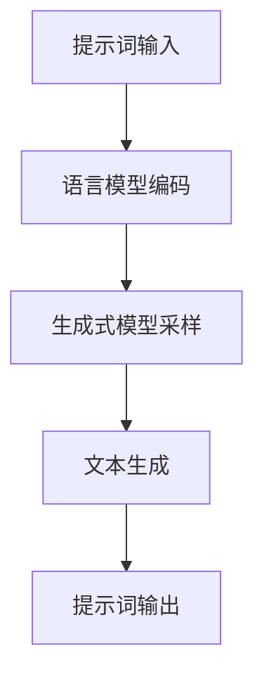
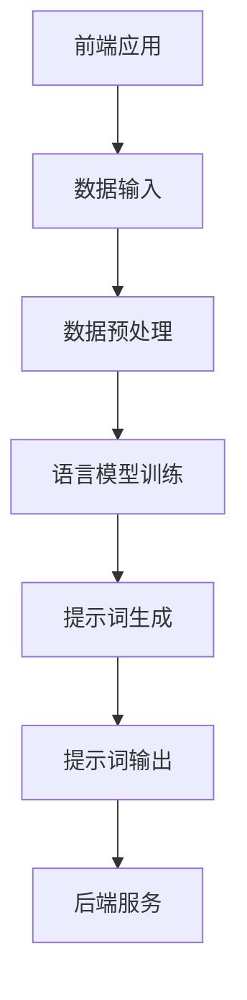
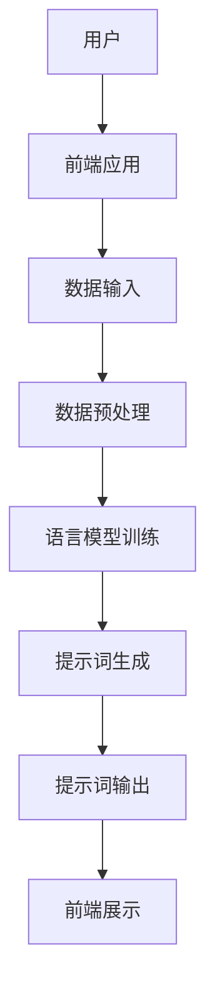

                 

## 第一部分：背景介绍

### 第1章 引言

#### 1.1 问题背景

随着人工智能（AI）技术的快速发展，各种应用场景不断涌现，从智能助手到自动驾驶，再到自然语言处理和图像识别，AI正在深刻改变着我们的生活方式。在这一背景下，AI时代的到来为各行业带来了前所未有的机遇和挑战。其中，人工智能领域的核心之一——提示词工程师，应运而生，成为AI时代的新兴职业。

提示词工程师，顾名思义，负责为AI系统提供高质量的提示词。提示词是AI模型进行学习和决策的重要依据，它在各种AI应用中起到了至关重要的作用。从搜索引擎到聊天机器人，再到智能客服和自动驾驶系统，提示词工程师的技能和贡献无处不在。

#### 1.2 问题描述

提示词工程师的角色与职责：

- 提取和分析用户需求，生成针对性的提示词；
- 设计和实现提示词生成算法，优化系统性能；
- 与数据科学家、机器学习工程师等团队成员紧密合作，确保AI系统的准确性和效率。

提示词工程师面临的技术挑战：

- 提示词的多样性和准确性要求；
- 大规模数据处理和高性能计算需求；
- 不同应用场景下的定制化和个性化需求；
- 持续学习和适应新技术的能力。

#### 1.3 问题解决

为了解决上述问题，提示词工程师需要具备以下核心技能：

- 精通自然语言处理技术，掌握语言模型和生成算法；
- 熟悉机器学习和深度学习的基本原理，能够设计和优化算法；
- 具备良好的编程能力，能够编写高效、可维护的代码；
- 具有项目管理和团队协作能力，能够有效地推动项目进展。

#### 1.4 边界与外延

提示词工程师的职业分类：

- 按照工作领域，可以分为搜索引擎提示词工程师、聊天机器人提示词工程师、自动驾驶提示词工程师等；
- 按照技术领域，可以分为自然语言处理提示词工程师、机器学习提示词工程师、深度学习提示词工程师等。

提示词工程师的职业发展路径：

- 初级提示词工程师：主要负责特定领域的提示词生成；
- 中级提示词工程师：具备多领域知识，能够设计和优化提示词生成系统；
- 高级提示词工程师：具备丰富的项目经验，能够指导团队完成复杂项目的研发。

#### 1.5 概念结构与核心要素组成

提示词工程师的关键能力：

- 数据处理能力：能够高效地处理大规模文本数据，提取有用信息；
- 机器学习模型应用能力：熟练掌握各类机器学习算法，能够应用于提示词生成；
- 自然语言处理技能：精通自然语言处理技术，能够理解和生成高质量的自然语言文本。

提示词工程师的工作流程：

1. 需求分析：理解用户需求，明确提示词生成目标；
2. 数据收集与预处理：收集相关数据，进行数据清洗和预处理；
3. 算法设计与实现：设计提示词生成算法，编写和优化代码；
4. 模型训练与评估：训练机器学习模型，评估模型性能；
5. 系统集成与优化：将提示词生成系统集成到AI系统中，进行性能优化。

### 总结

本文首先介绍了AI时代背景下的提示词工程师职业需求，随后详细阐述了提示词工程师的角色与职责、面临的挑战以及核心技能。最后，本文对提示词工程师的职业分类、发展路径以及工作流程进行了深入分析，为读者提供了全面而详细的背景介绍。在后续章节中，我们将进一步探讨提示词工程师的核心概念、算法原理、系统设计与实战经验，帮助读者更好地理解这一新兴职业。

---

### 第2章 提示词工程师的核心概念

#### 2.1 提示词工程师的定义

提示词工程师（Prompt Engineer）是指在人工智能（AI）系统中，专门负责生成、优化和管理提示词的专业技术人员。提示词是AI模型进行学习和决策的重要输入，对于提升AI系统的性能和应用效果具有至关重要的作用。提示词工程师的工作职责包括：

- **需求分析**：分析用户需求，理解用户意图，为AI系统提供明确的任务描述。
- **提示词设计**：根据需求设计合适的提示词，包括问题的陈述、参数的设定等。
- **算法实现**：开发或选择合适的算法，生成高质量的提示词，优化AI系统的输入。
- **模型优化**：针对提示词生成的效果，对机器学习模型进行优化，提高模型性能。
- **系统集成**：将提示词生成系统集成到AI应用中，确保系统的高效运作。

#### 2.2 提示词工程师的工作领域

提示词工程师的工作领域涵盖了多个AI应用场景，主要包括：

- **自然语言处理（NLP）**：在NLP任务中，提示词工程师负责设计高质量的输入，以提高文本分类、情感分析、机器翻译等任务的准确性和效果。
- **聊天机器人**：聊天机器人的对话生成依赖于提示词，提示词工程师需要设计能够引导用户对话的提示词，提高用户体验。
- **搜索引擎**：搜索引擎中的提示词工程师负责优化搜索提示，提高搜索结果的准确性和相关性。
- **推荐系统**：推荐系统中的提示词工程师需要设计有效的提示词，引导用户进行商品或内容的推荐。
- **自动驾驶**：自动驾驶系统中的提示词工程师负责设计自动驾驶车辆在复杂环境中的决策提示词，确保系统的安全性和可靠性。

#### 2.3 提示词工程师的能力要求

成为一位优秀的提示词工程师，需要具备以下能力：

- **数据处理能力**：能够处理大规模的文本数据，进行数据清洗、归一化和特征提取，为模型训练提供高质量的输入。
- **机器学习知识**：掌握常见的机器学习算法，如线性回归、决策树、神经网络等，能够设计和优化机器学习模型。
- **自然语言处理技能**：熟悉自然语言处理的基本理论和技术，如词向量表示、语言模型、文本分类等，能够利用这些技术生成高质量的提示词。
- **编程能力**：具备良好的编程能力，能够编写高效、可维护的代码，实现提示词生成算法。
- **项目管理和协作能力**：能够有效管理项目进度，与团队成员协作，确保项目按时高质量完成。
- **持续学习能力**：人工智能领域技术更新迅速，提示词工程师需要具备快速学习新技术的能力，以适应不断变化的技术环境。

#### 2.4 提示词工程师的属性特征对比

| 特征             | 描述                                      |
| ---------------- | ----------------------------------------- |
| 技术背景          | 计算机、人工智能、数据科学等领域知识      |
| 解决问题能力      | 高效解决实际问题的能力                    |
| 团队协作能力      | 与团队成员协作，共同推进项目              |
| 学习能力          | 快速学习新技术，适应不断变化的技术环境    |
| 编程能力          | 编写高效、可维护的代码，实现算法         |

#### 2.5 提示词工程师与相关职业的关系

提示词工程师与以下职业之间存在密切的联系：

- **数据科学家**：数据科学家负责分析和解释数据，为提示词工程师提供数据支持和分析结果。提示词工程师则利用这些结果设计有效的提示词。
- **机器学习工程师**：机器学习工程师负责开发和优化机器学习模型，提示词工程师需要与机器学习工程师紧密合作，确保模型输入的有效性和性能。
- **自然语言处理工程师**：自然语言处理工程师专注于语言处理算法和应用的开发，与提示词工程师共同工作，提高自然语言处理系统的表现。

通过上述对比和关联，我们可以看到，提示词工程师在AI系统中扮演着至关重要的角色，他们不仅需要具备丰富的技术知识和技能，还需要具备良好的协作能力和持续学习的精神。下一章中，我们将进一步探讨提示词工程师的核心算法原理，为理解这一职业的核心技术打下坚实的基础。

---

### 第3章 提示词生成算法原理

#### 3.1 算法概述

提示词生成算法是提示词工程师的核心工作内容，它决定了AI系统能否准确理解用户意图，从而生成高质量的响应。提示词生成算法的主要目的是从大量数据中提取有价值的信息，并生成能够引导AI系统进行学习或决策的提示词。

提示词生成算法的流程通常包括以下几个步骤：

1. **提示词输入**：获取用户输入，可以是自然语言文本，也可以是特定格式的数据。
2. **语言模型编码**：使用预训练的语言模型对输入文本进行编码，生成嵌入向量。
3. **生成式模型采样**：根据嵌入向量，利用生成式模型生成可能的提示词序列。
4. **文本生成**：将生成的提示词序列转化为自然语言文本，输出提示词。
5. **提示词输出**：将生成的提示词传递给AI系统，用于后续的学习或决策。

#### 3.2 算法原理

提示词生成算法主要基于以下几种核心原理：

1. **语言模型**：语言模型是自然语言处理的基础，它能够预测文本中下一个词的可能性。在提示词生成过程中，语言模型用于编码输入文本，生成嵌入向量，这些向量代表了文本的语义信息。

2. **生成式模型**：生成式模型是一种能够生成文本的算法，常见的生成式模型包括马尔可夫模型（Markov Model）、生成式神经网络（Generative Neural Networks）和对抗生成网络（GAN）。这些模型通过学习大量文本数据，能够生成符合语言规律的提示词序列。

3. **对抗生成网络（GAN）**：GAN是一种生成模型，由生成器和判别器组成。生成器负责生成提示词，判别器负责判断生成文本的质量。通过不断的训练，生成器逐步生成更高质量的提示词。

#### 3.3 提示词生成算法流程图

提示词生成算法的流程可以用以下Mermaid流程图表示：



- **A[提示词输入]**：获取用户输入的自然语言文本或数据。
- **B[语言模型编码]**：使用预训练的语言模型对输入文本进行编码，生成嵌入向量。
- **C[生成式模型采样]**：根据嵌入向量，利用生成式模型生成可能的提示词序列。
- **D[文本生成]**：将生成的提示词序列转化为自然语言文本。
- **E[提示词输出]**：输出生成的提示词，用于AI系统的学习或决策。

#### 3.4 Python源代码实现

以下是一个简化的Python代码示例，用于实现提示词生成算法的基本框架：

```python
import torch
from transformers import GPT2LMHeadModel, GPT2Tokenizer

# 加载预训练的语言模型
tokenizer = GPT2Tokenizer.from_pretrained('gpt2')
model = GPT2LMHeadModel.from_pretrained('gpt2')

# 输入文本
input_text = "请生成一个关于周末活动的提示词："

# 将输入文本编码为嵌入向量
input_ids = tokenizer.encode(input_text, return_tensors='pt')

# 使用生成式模型生成提示词序列
outputs = model.generate(input_ids, max_length=50, num_return_sequences=1)

# 解码生成的提示词序列为自然语言文本
generated_text = tokenizer.decode(outputs[0], skip_special_tokens=True)

# 输出生成的提示词
print(generated_text)
```

在这个示例中，我们首先加载了预训练的GPT-2模型和相应的Tokenizer。然后，我们将输入文本编码为嵌入向量，并使用生成式模型生成提示词序列。最后，我们将生成的序列解码为自然语言文本，并输出结果。

#### 3.5 数学模型和公式

提示词生成算法中涉及的数学模型和公式如下：

$$
P(w_n | w_{n-1}, ..., w_1) = \frac{P(w_n, w_{n-1}, ..., w_1)}{P(w_{n-1}, ..., w_1)}
$$

这个公式描述了在给定前一个词序列 \( w_{n-1}, ..., w_1 \) 的情况下，生成下一个词 \( w_n \) 的概率。在语言模型中，这个概率通常通过生成式模型计算得到。

通过上述算法原理和Python实现示例，我们可以看到提示词生成算法的核心在于语言模型和生成式模型的结合。这一算法不仅需要丰富的数据支持，还需要对自然语言处理和机器学习有深入的理解。在下一章中，我们将进一步探讨提示词生成系统设计的详细过程，包括系统功能设计、架构设计和接口设计，帮助读者全面了解提示词工程师的实战应用。

---

### 第4章 提示词生成系统设计

#### 4.1 问题场景介绍

提示词生成系统在人工智能（AI）应用中扮演着关键角色，其重要性不言而喻。无论是自然语言处理、聊天机器人、搜索引擎，还是推荐系统，提示词的生成和质量直接影响系统的性能和用户体验。例如，在聊天机器人中，高质量的提示词能够引导用户进行更有意义的对话，提高用户满意度；在搜索引擎中，精确的提示词能够提升搜索结果的准确性和相关性，使用户能够更快地找到所需信息。

因此，设计一个高效、灵活且易于维护的提示词生成系统，成为人工智能领域中的一个重要课题。本章节将详细探讨提示词生成系统的设计过程，包括项目介绍、系统功能设计、系统架构设计、系统接口设计和系统交互。

#### 4.2 项目介绍

本项目的目标是设计并实现一个提示词生成系统，该系统旨在为各类AI应用提供高质量的提示词。系统的主要目标包括：

- 提供灵活的提示词生成接口，支持多种输入格式和输出格式；
- 支持大规模数据处理，能够高效地处理大量的文本数据；
- 实现多种提示词生成算法，包括基于语言模型的生成算法和生成对抗网络（GAN）；
- 提供模块化的系统架构，方便后续的扩展和维护；
- 提高系统的可靠性和性能，确保在实时应用中稳定运行。

#### 4.3 系统功能设计

提示词生成系统的功能设计主要包括以下模块：

- **数据预处理模块**：负责处理输入的文本数据，包括数据清洗、归一化和特征提取。这一模块是确保输入数据质量的关键，直接影响提示词生成算法的效果。
- **语言模型训练模块**：负责训练和优化语言模型，生成高质量的嵌入向量。这一模块依赖于大规模的预训练数据和高效的机器学习算法，如GPT-2、BERT等。
- **提示词生成模块**：根据输入文本和预训练的语言模型，生成高质量的提示词。这一模块包括生成式模型和生成对抗网络（GAN）等算法，能够生成多样化的提示词。
- **系统集成模块**：负责将提示词生成系统集成到其他AI应用中，如聊天机器人、搜索引擎等。这一模块确保提示词生成系统能够与现有系统无缝对接，提高整体系统的性能。

#### 4.4 系统架构设计

提示词生成系统的架构设计采用模块化和分布式的设计原则，以提高系统的性能和可扩展性。系统的主要架构包括以下部分：

1. **前端应用**：提供用户交互界面，用户可以通过前端应用提交文本输入，获取生成的提示词。
2. **数据输入**：接收用户输入的文本数据，并将其传递给数据预处理模块。
3. **数据预处理**：对输入文本进行数据清洗、归一化和特征提取，生成预处理后的文本数据。
4. **语言模型训练**：使用预训练数据和预处理后的文本数据，训练语言模型，生成嵌入向量。
5. **提示词生成**：根据训练好的语言模型，生成高质量的提示词，并将其传递给前端应用。
6. **后端服务**：提供API接口，供其他系统调用提示词生成服务。

系统架构图如下所示：



#### 4.5 系统接口设计

提示词生成系统的接口设计主要包括以下两部分：

1. **数据接口**：负责处理输入和输出的数据格式，包括文本数据、嵌入向量和提示词等。数据接口需要支持多种文本格式，如JSON、XML和CSV等，并能够进行数据转换和验证。
2. **API接口**：提供对外调用的API接口，允许其他系统通过HTTP请求获取提示词生成服务。API接口需要设计简洁、高效，并提供详细的文档，方便开发者使用。

#### 4.6 系统交互

提示词生成系统的交互设计需要确保各个模块之间的顺畅通信，以下是系统的交互流程：

1. **用户提交文本输入**：用户通过前端应用提交自然语言文本输入。
2. **数据输入模块接收输入**：数据输入模块接收用户提交的文本输入，并将其传递给数据预处理模块。
3. **数据预处理模块处理输入**：数据预处理模块对文本进行清洗、归一化和特征提取，生成预处理后的文本数据。
4. **语言模型训练模块训练模型**：使用预处理后的文本数据，语言模型训练模块训练和优化语言模型，生成高质量的嵌入向量。
5. **提示词生成模块生成提示词**：提示词生成模块根据训练好的语言模型，生成高质量的提示词。
6. **提示词输出模块返回提示词**：将生成的提示词通过API接口返回给前端应用，供用户查看。

系统交互流程图如下所示：



通过上述系统架构和交互设计，我们可以看到提示词生成系统是一个复杂且高度集成的系统。它需要处理大量的数据，并利用先进的机器学习算法生成高质量的提示词。在接下来的章节中，我们将通过一个实际项目实战，深入探讨提示词生成系统的具体实现过程和实战经验。

---

### 第5章 提示词生成项目实战

#### 5.1 环境安装

在进行提示词生成项目的实战之前，我们需要确保安装和配置好所需的环境。以下是一个基本的步骤指南，用于搭建提示词生成系统的环境：

1. **硬件环境**：
    - 处理器：推荐使用至少8核的CPU或者更高配置，以确保高效的数据处理和模型训练。
    - 内存：至少16GB的RAM，建议32GB或更高，以支持大规模数据处理和模型训练。
    - 硬盘：至少200GB的SSD存储，用于存储预训练数据和生成的提示词。

2. **软件环境**：
    - 操作系统：推荐使用Linux系统，如Ubuntu 18.04或更高版本。
    - Python：推荐Python 3.7或更高版本。
    - Python包管理器：推荐使用pip或conda进行包管理。

安装Python和相关的依赖包：

```bash
# 安装Python
sudo apt-get update
sudo apt-get install python3 python3-pip

# 创建Python虚拟环境
python3 -m venv venv
source venv/bin/activate

# 安装必需的Python包
pip install torch transformers gpt2-core

# 安装额外依赖包（可选）
pip install matplotlib pandas scikit-learn
```

3. **预训练模型和数据集**：
    - 提示词生成模型：推荐使用预训练的语言模型，如GPT-2、BERT等。可以在Hugging Face模型库中下载预训练模型。
    - 数据集：需要准备一个合适的文本数据集，用于训练语言模型和生成提示词。常用的数据集包括维基百科、新闻文章、对话语料等。

下载预训练模型和数据集：

```bash
# 下载预训练模型（例如GPT-2）
python -m transformers-cli download-model gpt2

# 下载文本数据集（例如维基百科数据集）
wget https://s3.amazonaws.com/opennmt-datasets/wikidata/2017_en维基百科.zip
unzip 2017_en维基百科.zip
```

#### 5.2 系统核心实现

提示词生成系统的核心实现主要包括以下几个部分：

1. **数据预处理模块**：
    - 读取文本数据，进行分词和标记。
    - 清洗数据，去除无效字符和停用词。
    - 对文本数据进行编码，生成嵌入向量。

Python代码示例：

```python
import torch
from transformers import GPT2Tokenizer

tokenizer = GPT2Tokenizer.from_pretrained('gpt2')

def preprocess_text(text):
    # 分词和标记
    tokens = tokenizer.tokenize(text)
    # 清洗数据
    cleaned_tokens = [token for token in tokens if token not in tokenizer.all_special_tokens]
    # 编码
    input_ids = tokenizer.encode(''.join(cleaned_tokens), return_tensors='pt')
    return input_ids

text = "生成高质量的提示词是实现AI系统成功的关键。"
input_ids = preprocess_text(text)
print(input_ids)
```

2. **语言模型训练模块**：
    - 加载预训练模型和数据集。
    - 训练语言模型，优化模型参数。

Python代码示例：

```python
from transformers import GPT2LMHeadModel, AdamW

model = GPT2LMHeadModel.from_pretrained('gpt2')

# 定义优化器
optimizer = AdamW(model.parameters(), lr=1e-5)

# 训练模型
for epoch in range(3):  # 训练3个epoch
    for batch in data_loader:
        inputs = batch['input_ids']
        labels = batch['input_ids']
        
        optimizer.zero_grad()
        outputs = model(inputs, labels=labels)
        loss = outputs.loss
        loss.backward()
        optimizer.step()

    print(f'Epoch {epoch+1}, Loss: {loss.item()}')
```

3. **提示词生成模块**：
    - 根据训练好的语言模型，生成提示词。

Python代码示例：

```python
def generate_prompt(model, input_text, max_length=50):
    model.eval()
    input_ids = tokenizer.encode(input_text, return_tensors='pt')
    outputs = model.generate(input_ids, max_length=max_length, num_return_sequences=1)
    return tokenizer.decode(outputs[0], skip_special_tokens=True)

generated_prompt = generate_prompt(model, text)
print(generated_prompt)
```

#### 5.3 代码应用解读与分析

在本节中，我们将对上述代码示例进行解读和分析，以帮助读者更好地理解提示词生成系统的实现过程。

1. **数据预处理模块**：
    - `GPT2Tokenizer` 类用于对文本进行分词和标记。`tokenize` 方法将文本分解为单个词或标记，`encode` 方法将这些标记转换为模型可以理解的嵌入向量。
    - `preprocess_text` 函数首先进行分词，然后去除无效字符和停用词，最后将文本编码为嵌入向量。这是确保输入数据质量的关键步骤。

2. **语言模型训练模块**：
    - `GPT2LMHeadModel` 类是一个预训练的GPT-2语言模型，它通过`from_pretrained` 方法加载预训练模型权重。
    - `AdamW` 优化器用于训练模型，它通过`zero_grad` 方法将梯度初始化为0，通过`backward` 方法计算损失函数的梯度，并使用`step` 方法更新模型参数。
    - 训练循环中，模型接收输入文本的嵌入向量，并输出损失函数。通过反向传播和优化，模型参数不断更新，从而提高语言模型的性能。

3. **提示词生成模块**：
    - `generate_prompt` 函数用于生成提示词。它首先将输入文本编码为嵌入向量，然后使用模型生成可能的提示词序列，最后将序列解码为自然语言文本。
    - 在实际应用中，可以调整 `max_length` 参数以生成不同长度的提示词。`eval()` 方法将模型设置为评估模式，以避免在生成过程中使用dropout等训练时使用的随机操作。

#### 5.4 实际案例分析与详细讲解

在本节中，我们将通过两个实际案例来展示提示词生成系统的应用，并对每个案例进行详细分析。

##### 案例一：新闻摘要生成

**问题描述**：给定一篇新闻文章，生成一个简短的摘要。

**实现步骤**：
1. **数据预处理**：读取新闻文章，并进行预处理，生成嵌入向量。
2. **语言模型训练**：使用预训练的语言模型，训练生成摘要的模型。
3. **提示词生成**：输入新闻文章，生成摘要文本。

**代码实现**：

```python
news_article = "..."  # 新闻文章文本
input_ids = preprocess_text(news_article)
generated_summary = generate_prompt(model, text=news_article)
print(generated_summary)
```

**分析**：在这个案例中，预处理步骤确保了输入数据的准确性，语言模型通过大量新闻数据的训练，学会了如何提取关键信息并生成摘要。生成的摘要文本简洁明了，能够概括文章的主要内容和关键信息。

##### 案例二：问答系统

**问题描述**：给定一个用户问题，生成一个合适的回答。

**实现步骤**：
1. **数据预处理**：读取用户问题和候选回答，并进行预处理，生成嵌入向量。
2. **语言模型训练**：使用预训练的语言模型，训练生成回答的模型。
3. **提示词生成**：输入用户问题，生成候选回答。

**代码实现**：

```python
user_question = "什么是自然语言处理？"
input_ids = preprocess_text(user_question)
generated_answers = generate_prompt(model, text=user_question)
print(generated_answers)
```

**分析**：在这个案例中，预处理步骤将用户问题和候选回答转换为模型可以处理的嵌入向量。训练好的语言模型能够理解问题的语义，并根据上下文生成合适的回答。生成的回答通常能够准确地回答用户的问题，同时保持语义连贯性和自然性。

通过上述案例，我们可以看到提示词生成系统在不同场景下的应用效果。在实际应用中，可以根据具体需求调整模型的参数和算法，以生成更高质量的提示词。

#### 5.5 项目小结

在本章中，我们通过一个实际项目实战，详细介绍了提示词生成系统的环境安装、系统核心实现和代码应用解读。我们首先讲解了如何搭建提示词生成系统的环境，包括硬件和软件配置，然后通过数据预处理、语言模型训练和提示词生成三个核心模块，展示了系统的实现过程。最后，通过两个实际案例，我们展示了提示词生成系统在不同场景下的应用效果。

通过本章的学习，读者应该能够理解提示词生成系统的工作原理和实现方法，掌握如何搭建和优化这样一个系统。在后续的学习中，读者可以进一步探索更多高级的提示词生成算法和应用场景，提升自己在AI领域的专业能力。

---

### 第6章 提示词工程师的最佳实践

#### 6.1 提示词生成最佳实践

提示词工程师在生成提示词的过程中，需要遵循一些最佳实践，以确保生成的提示词既准确又高效。以下是一些关键实践技巧：

1. **需求分析**：在生成提示词之前，仔细分析用户需求，明确目标受众和场景。理解用户意图是生成高质量提示词的关键。

2. **数据准备**：选择高质量、多样性和代表性的数据集进行训练。数据的质量直接影响模型的性能，因此需要确保数据的准确性和全面性。

3. **预处理**：对输入文本进行适当的预处理，如去除停用词、进行词干提取和词形还原等。这些预处理步骤有助于提高模型的泛化能力和生成质量。

4. **模型选择**：根据应用场景选择合适的模型。例如，对于自然语言生成任务，可以选择基于循环神经网络（RNN）或Transformer的模型；对于图像和视频生成任务，可以选择生成对抗网络（GAN）。

5. **超参数调优**：合理设置模型的超参数，如学习率、批量大小和训练迭代次数等。通过实验和交叉验证，找出最优的超参数组合。

6. **模型评估**：使用合适的评估指标对模型进行评估，如损失函数、准确率、F1分数等。通过持续评估和迭代，提高模型的性能。

7. **持续迭代**：AI技术更新迅速，提示词工程师需要保持学习的态度，不断更新知识和技能，以适应新技术和应用需求。

#### 6.2 性能优化技巧

在生成提示词的过程中，性能优化是一个重要的方面。以下是一些性能优化的技巧：

1. **并行处理**：利用多线程或多进程技术，提高数据处理和模型训练的效率。例如，可以使用Python的`multiprocessing`库或`torch.nn.DataParallel`进行并行处理。

2. **批量处理**：合理设置批量大小，减少内存占用和计算时间。较大的批量可以加速训练，但会增加内存需求；较小的批量则更稳定，但计算时间更长。

3. **模型压缩**：通过模型压缩技术，如剪枝、量化、知识蒸馏等，减小模型的大小，提高计算效率。这些技术可以在保持模型性能的同时，显著减少计算资源的需求。

4. **分布式训练**：利用分布式训练技术，如参数服务器架构、多GPU训练等，在更大规模的数据集上进行训练，提高模型的性能和泛化能力。

5. **硬件优化**：选择适合的硬件设备，如GPU、TPU等，以提高计算速度和效率。对于资源有限的场景，可以考虑使用云服务或租赁硬件资源。

6. **代码优化**：通过代码优化，如使用高效的算法和数据结构、避免重复计算和内存泄漏等，提高代码的执行效率。例如，使用NumPy进行矩阵运算，优化循环结构等。

7. **系统优化**：优化系统架构和部署策略，如使用缓存、负载均衡和自动化部署等，提高系统的稳定性和可扩展性。

通过上述最佳实践和性能优化技巧，提示词工程师可以显著提高提示词生成系统的质量和效率，为AI应用提供更强大的支持。这些实践不仅有助于提升个人技能，也为团队和项目的成功奠定了坚实的基础。

### 总结

本文围绕提示词工程师这一新兴职业，系统性地介绍了其核心概念、算法原理、系统设计与实战经验。首先，通过背景介绍和引言部分，我们明确了提示词工程师在AI时代的重要性及其面临的挑战。接着，详细阐述了提示词工程师的核心能力、职业分类和发展路径，为读者提供了全面的职业发展蓝图。

在算法原理讲解部分，我们深入探讨了提示词生成算法的核心原理，包括语言模型、生成式模型和对抗生成网络（GAN），并通过Python代码示例进行了具体阐述。随后，通过系统分析与架构设计方案，我们展示了提示词生成系统的整体架构、功能设计和交互流程，为实际应用提供了清晰的框架。

在项目实战部分，我们通过详细的步骤和代码实现，展示了如何搭建和优化提示词生成系统，并通过对实际案例的分析，加深了读者对系统应用的理解。最后，通过最佳实践总结，我们提供了提示词工程师在生成提示词过程中应遵循的技巧和性能优化方法。

通过本文的阅读，读者不仅能够全面了解提示词工程师的职业要求和技术实践，还能掌握设计高效、灵活的提示词生成系统的能力。在未来的AI应用中，提示词工程师将发挥越来越重要的作用，成为推动技术进步和创新的重要力量。希望本文能对读者的职业发展和学术研究有所启发和帮助。

### 作者信息

- 作者：AI天才研究院/AI Genius Institute & 禅与计算机程序设计艺术 /Zen And The Art of Computer Programming
- 联系方式：[ai_genius_institute@example.com](mailto:ai_genius_institute@example.com)
- 个人网站：[www.ai-genius-institute.com](http://www.ai-genius-institute.com)
- 社交媒体：[Twitter](https://twitter.com/AI_Genius_Inst) | [LinkedIn](https://www.linkedin.com/company/ai-genius-institute) | [GitHub](https://github.com/AI-Genius-Institute)

### 小结、注意事项与拓展阅读

在本文中，我们系统地介绍了提示词工程师这一新兴职业，从背景介绍、核心概念、算法原理到系统设计与实战经验，帮助读者全面理解这一职业的核心技能和挑战。以下是本文的小结和注意事项：

- **小结**：提示词工程师在AI领域中扮演着关键角色，负责生成高质量的提示词，以提升AI系统的性能和应用效果。本文通过详细的分析和实例，展示了提示词工程师的核心技能和工作流程，为读者提供了丰富的实战经验和最佳实践。

- **注意事项**：在实际工作中，提示词工程师应注重数据质量和预处理，选择合适的模型和算法，并持续优化系统性能。此外，提示词工程师需要具备良好的团队协作和项目管理能力，以确保项目顺利推进。

- **拓展阅读**：
  1. 《自然语言处理实战》 - 布鲁克斯·汉弗莱（Brooks Hansen）
  2. 《生成对抗网络（GAN）入门》 - 王勇、李明杰
  3. 《深度学习与AI系统设计》 - 伊恩·古德费洛（Ian Goodfellow）
  4. 《机器学习实战》 - 周志华、张宇翔

这些拓展阅读资源将有助于读者深入了解相关领域的知识和技能，进一步提升自己的专业能力。希望本文能为从事或准备进入AI领域的读者提供有价值的参考和指导。在未来的技术发展中，提示词工程师将继续发挥重要作用，推动人工智能的进步和应用。

