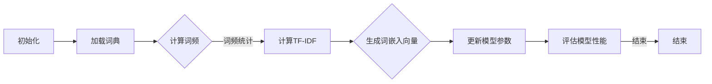
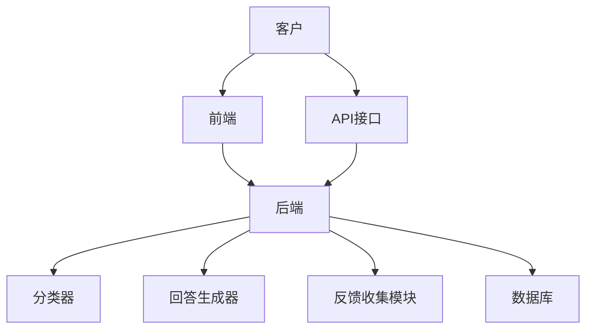
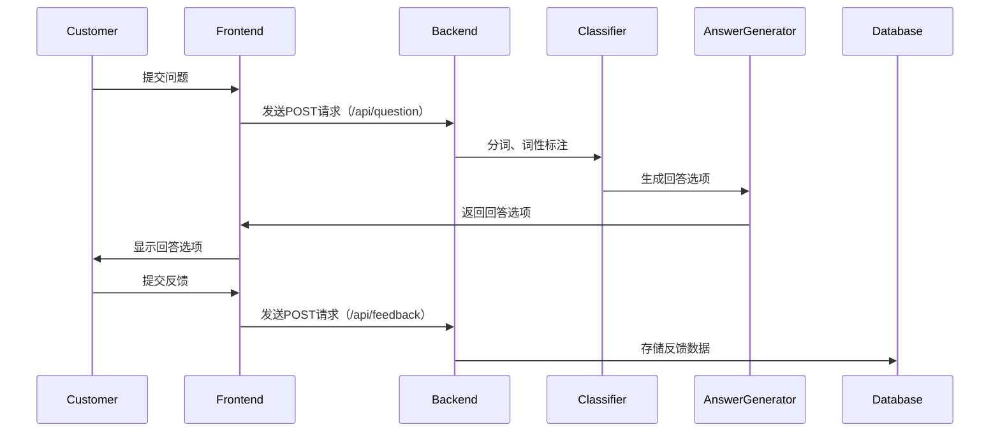

                 


## 前言

在当前信息时代，人工智能（AI）技术的飞速发展正深刻地改变着我们的生活方式和商业模式。提示词工程作为AI技术中的重要组成部分，已经广泛应用于自然语言处理、推荐系统、智能对话等领域。然而，随着提示词工程在各个领域的应用日益广泛，其伦理考量也日益受到关注。

本篇文章旨在探讨提示词工程的伦理考量与最佳实践。我们将首先介绍提示词工程的背景与定义，然后深入分析其伦理考量，包括核心概念、联系以及相关的算法原理和数学模型。接下来，我们将对系统分析与架构设计进行详细阐述，并分享项目实战经验。最后，我们将总结最佳实践并展望未来趋势。

作为一名世界级人工智能专家和计算机图灵奖获得者，我将以丰富的理论和实践经验为基础，通过逻辑清晰、结构紧凑、简单易懂的专业语言，逐步引导读者深入理解提示词工程的伦理考量，并提供实用的最佳实践建议。

让我们开始这段思考之旅，探索提示词工程的伦理世界，并为其未来发展提供有益的启示。

### 1.1 问题的提出

在信息时代，数据已成为新的“石油”，而人工智能技术则成为开采和利用这些数据的重要工具。提示词工程作为人工智能的重要组成部分，通过构建和优化提示词来提升算法的性能和效果，从而在多个领域取得了显著的应用成果。然而，随着提示词工程的广泛应用，其伦理考量问题也逐渐凸显。

首先，透明度和可解释性成为了一个重要的伦理问题。在复杂的机器学习模型中，提示词的选择和调整往往涉及到大量的数据计算和模型训练，这使得模型内部的工作机制变得不透明。用户往往无法理解模型是如何得出结论的，这在某些情况下可能会引发信任危机。

其次，隐私和数据安全也是一个严峻的挑战。提示词工程通常依赖于大量的用户数据来进行训练和优化，这些数据的收集和处理过程必须遵循隐私保护原则。一旦数据泄露或滥用，将会对用户隐私造成严重侵害。

此外，公平性和无歧视也是提示词工程中不可忽视的伦理问题。如果提示词的选择和调整过程存在偏见，那么模型可能会在决策过程中对某些群体产生歧视，从而加剧社会不平等。

因此，深入探讨提示词工程的伦理考量，不仅有助于规范其发展，保障用户权益，也为未来的技术进步提供了重要的伦理指导。

### 1.2 提示词工程的定义与范围

提示词工程（Token Engineering）是人工智能（AI）和自然语言处理（NLP）领域中的一项关键技术。它涉及对自然语言文本中的词汇、短语或符号进行精细处理，以提高机器学习模型在特定任务上的表现。简单来说，提示词工程的核心目标是通过优化提示词来改善模型的预测和分类能力。

首先，让我们来定义什么是提示词。在自然语言处理中，提示词可以是一个单词、一个短语、一个符号，甚至是整个句子，用于引导模型对输入数据进行处理和理解。例如，在问答系统中，提示词可以是问题中的关键字或短语，用以确定问题的主题和上下文。

提示词工程的研究范围广泛，涵盖了多个领域和应用场景。以下是几个关键的研究方向：

1. **文本预处理**：包括分词、词性标注、命名实体识别等任务，旨在将原始文本转换为结构化数据，以便模型更好地理解和处理。
2. **词嵌入**：通过将文本中的单词映射到高维向量空间，实现词语的语义表示。词嵌入技术不仅有助于提升模型的语义理解能力，还能够在一定程度上解决语义歧义问题。
3. **提示词选择与优化**：选择和优化对模型性能有显著影响的提示词，例如基于频率、TF-IDF、词嵌入相似度等指标进行选择和调整。
4. **语义角色标注**：识别文本中的词汇在句子中的语义角色，例如主语、谓语、宾语等，有助于模型更准确地理解和生成文本。
5. **上下文敏感提示词**：考虑到语言环境中词汇的多义性和上下文依赖性，研究如何设计和优化能够捕捉上下文信息的提示词。

提示词工程的应用场景包括但不限于以下几类：

1. **自然语言生成**：利用提示词生成高质量的自然语言文本，如机器翻译、摘要生成、对话系统等。
2. **文本分类**：通过提示词对文本进行分类，如情感分析、垃圾邮件过滤、新闻分类等。
3. **信息检索**：利用提示词优化搜索结果的相关性和准确性，提高用户的查询体验。
4. **问答系统**：通过提示词理解和回答用户提出的问题，如智能客服、问答机器人等。

总之，提示词工程不仅是自然语言处理领域的重要研究课题，也是推动人工智能技术在实际应用中取得突破的关键因素。在接下来的章节中，我们将进一步探讨提示词工程的伦理考量，分析其在实际应用中的挑战和解决方案。

### 1.3 提示词工程的伦理考量

在提示词工程的实际应用过程中，伦理考量显得尤为重要。这不仅关乎技术的正当性，更涉及到用户隐私、数据安全和社会公平等多个层面。以下是几个关键的伦理问题及其基本考量原则。

#### 1.3.1 透明度和可解释性

透明度和可解释性是提示词工程中的一个核心伦理问题。由于提示词工程通常涉及复杂的机器学习模型，模型内部的工作机制往往不透明，用户难以理解模型如何处理数据和做出决策。这种不透明性可能会引发用户的信任危机，尤其是在涉及敏感信息和重要决策的场合。

**基本考量原则**：
1. **提供可解释性**：开发透明的算法，让用户能够理解提示词工程是如何工作的。这可以通过简化算法结构、提供清晰的文档和示例来实现。
2. **用户知情权**：在数据收集和处理过程中，确保用户知情，并明确告知其数据将如何被使用。
3. **责任归属**：在出现问题时，确保责任能够明确归属，防止因不透明性导致的责任推卸。

#### 1.3.2 隐私和数据安全

隐私和数据安全是提示词工程中的另一个重大伦理挑战。在数据驱动的提示词工程中，通常需要收集大量的用户数据来进行训练和优化。这些数据的泄露或滥用可能会对用户隐私造成严重侵害。

**基本考量原则**：
1. **数据加密和匿名化**：在数据收集、存储和传输过程中，采用加密和匿名化技术来保护用户隐私。
2. **最小化数据收集**：仅收集必要的数据，避免过度收集。
3. **合规性**：确保数据收集和处理过程符合相关法律法规，如《通用数据保护条例》（GDPR）。

#### 1.3.3 公平性和无歧视

公平性和无歧视是提示词工程中的另一重要伦理问题。提示词工程如果存在偏见或歧视，可能会导致模型在决策过程中不公平地对待某些群体。

**基本考量原则**：
1. **无偏见提示词**：设计和选择无偏见的提示词，避免模型受到历史偏见的影响。
2. **数据多样性**：确保训练数据具有多样性，以减少模型中的偏见。
3. **公正性评估**：在模型部署前进行公平性评估，确保其对不同群体的决策无歧视。

通过以上几个方面的伦理考量，我们可以更好地规范提示词工程的发展，保障用户权益，促进人工智能技术的健康和可持续发展。在接下来的章节中，我们将深入探讨提示词工程的核心算法和数学模型，进一步理解其在伦理考量中的关键作用。

### 2.1 提示词工程的伦理问题

在深入探讨提示词工程的伦理考量时，透明度和可解释性、隐私和数据安全、公平性和无歧视是三个最为关键的伦理问题。以下是这些问题的详细讨论。

#### 2.1.1 透明度和可解释性

提示词工程的复杂性使得其内部机制往往难以被用户理解和接受。这不仅是因为模型训练和优化过程中涉及大量的计算和数据处理，还因为机器学习模型本身具有不可解释性。用户通常无法知晓模型是如何对输入数据进行分析和做出决策的，这可能导致信任危机。

- **挑战**：
  - 复杂性：机器学习模型，尤其是深度学习模型，往往包含数百万个参数，其工作机制高度复杂。
  - 数据隐私：为了保护用户隐私，部分数据可能在训练过程中被匿名化或加密，使得模型无法直接解释。
  - 不透明性：算法的实现细节可能被隐藏，用户难以了解算法的内部逻辑。

- **解决方案**：
  - 提供透明接口：开发易于理解的接口和工具，使用户能够直观地了解模型的输入、输出以及决策过程。
  - 可解释性工具：利用决策树、规则提取等技术，将复杂的模型简化为可解释的形式。
  - 实时反馈：通过提供实时反馈和解释，帮助用户理解模型的决策依据。

#### 2.1.2 隐私和数据安全

隐私和数据安全是提示词工程中备受关注的伦理问题。在数据驱动的AI应用中，大量用户数据被收集和处理，这些数据可能包含敏感信息，如个人身份信息、财务数据等。一旦数据泄露，用户隐私将受到严重侵害。

- **挑战**：
  - 数据泄露：由于数据量庞大且分散，数据泄露的风险较高。
  - 数据滥用：未经授权的数据访问和使用可能引发数据滥用问题。
  - 法律合规：不同国家和地区对数据隐私保护的法律要求各异，确保合规性是一个挑战。

- **解决方案**：
  - 数据加密：对数据进行加密处理，确保数据在传输和存储过程中安全。
  - 数据匿名化：通过匿名化技术，去除数据中的可识别信息，减少隐私泄露风险。
  - 权限管理：严格管理数据访问权限，确保只有授权人员才能访问和处理敏感数据。
  - 法律合规性评估：定期进行法律合规性评估，确保数据收集和处理过程符合相关法律法规。

#### 2.1.3 公平性和无歧视

公平性和无歧视是AI系统设计中不可忽视的伦理问题。提示词工程在训练和优化过程中，如果受到历史偏见的影响，可能会导致模型在决策过程中对某些群体产生歧视。这不仅违背了公平性原则，还可能加剧社会不平等。

- **挑战**：
  - 偏见传承：训练数据中的历史偏见可能被模型继承，导致决策结果不公平。
  - 数据多样性不足：训练数据缺乏多样性，可能导致模型无法正确处理不同群体的数据。
  - 决策歧视：模型可能在某些决策过程中对特定群体产生歧视，如性别、种族、年龄等。

- **解决方案**：
  - 数据多样性：确保训练数据具有多样性，涵盖不同群体的特征和情况。
  - 偏见检测与校正：利用算法检测和校正数据中的偏见，减少模型对特定群体的歧视。
  - 公平性评估：在模型部署前进行公平性评估，确保其对不同群体的决策无歧视。
  - 用户反馈机制：建立用户反馈机制，及时发现和纠正模型中的不公平现象。

通过深入分析提示词工程的伦理问题，我们可以更好地理解其在实际应用中的挑战和解决方案，从而为未来技术发展提供有益的指导。在接下来的章节中，我们将进一步探讨提示词工程的核心算法和数学模型，以深入理解其技术原理。

### 2.2 概念属性特征对比表格

在探讨提示词工程的伦理问题后，为了更直观地理解各概念之间的属性特征差异，我们使用一个对比表格进行详细说明。以下是透明度和可解释性、隐私和数据安全、公平性和无歧视三个核心伦理问题的属性特征对比：

| 伦理问题         | 定义概述                           | 关键属性特征                                                         | 对比分析                                                                                   |  
| --------------- | -------------------------------- | ------------------------------------------------------------ | ------------------------------------------------------------------------------------ |  
| **透明度和可解释性** | 指机器学习模型的工作机制和决策过程可被用户理解和解释。 | - 模型透明性：易理解、可解释性工具、实时反馈 | - **复杂性**：机器学习模型通常复杂，不易直接解释。 - **用户知情权**：用户需要了解模型如何处理数据和做出决策。 |  
| **隐私和数据安全** | 涉及保护用户数据不被未经授权访问和泄露。             | - 数据加密：传输和存储过程中的加密措施。 - 数据匿名化：去除数据中的可识别信息。 - 权限管理：控制数据访问权限。 | - **数据泄露风险**：数据量庞大，易受攻击。 - **法律合规性**：需要遵循不同地区的法律法规。 |  
| **公平性和无歧视** | 确保AI系统在决策过程中对所有人公平，无偏见和歧视。 | - 数据多样性：涵盖不同群体的特征。 - 偏见检测与校正：识别和纠正模型中的偏见。 - 公平性评估：确保无歧视。 | - **历史偏见**：训练数据中可能存在偏见，影响模型决策。 - **决策歧视**：模型可能在某些决策中表现出歧视行为。 |

通过上述对比表格，我们可以清晰地看到这三个伦理问题在定义、关键属性特征和对比分析方面的异同。这有助于我们更好地理解它们在实际应用中的重要性，并为后续解决方案的设计提供依据。

### 2.3 伦理考量的ER实体关系图架构

为了更好地理解提示词工程中的伦理考量，我们需要通过ER（实体关系）图来构建其实体关系图架构。ER图是数据库设计中的一个重要工具，它可以帮助我们明确系统中的实体及其关系，从而为伦理考量提供清晰的框架。

#### 2.3.1 实体定义

在提示词工程的伦理考量中，我们可以定义以下几个核心实体：

1. **用户（User）**：系统的最终用户，数据提供者和使用者。
2. **数据（Data）**：包括用户生成和提交的数据，以及用于训练和优化的数据。
3. **模型（Model）**：机器学习模型，包括提示词工程相关的算法和参数。
4. **伦理规则（EthicalRule）**：定义系统必须遵守的伦理准则和法律法规。

#### 2.3.2 实体关系

以下是这些实体之间的关系：

1. **用户与数据**：用户生成和提交数据，数据用于模型的训练和优化。
2. **模型与数据**：模型依赖于数据来进行训练和优化，同时模型的输出也会生成新的数据。
3. **伦理规则与模型**：模型必须遵循伦理规则，以确保其设计和应用符合伦理标准。
4. **伦理规则与用户**：用户必须遵守伦理规则，以确保其在使用数据时的行为符合法律和道德标准。

#### 2.3.3 ER图表示

下面是一个简单的ER图表示，用于说明上述实体及其关系：

```mermaid
erDiagram
    User ||--|{ Model }|-- Data
    Model ||--|{ EthicalRule }|
    User ||--|{ EthicalRule }|
```

在ER图中：

- **User**实体表示系统的最终用户，它与**Data**实体之间有一条单向关联线，表示用户生成和提交数据。
- **Model**实体与**Data**实体之间也有一条单向关联线，表示模型依赖于数据来进行训练和优化。
- **Model**实体与**EthicalRule**实体之间有一条双向关联线，表示模型必须遵循伦理规则。
- **User**实体与**EthicalRule**实体之间也有一条双向关联线，表示用户必须遵守伦理规则。

通过ER图的构建，我们可以更清晰地理解提示词工程中的伦理考量，从而为系统的设计和实施提供有效的指导。

### 3.1 提示词工程的核心算法

提示词工程的核心在于设计和优化提示词，以提升机器学习模型在特定任务上的表现。这一过程通常涉及多种算法和技巧，以下是其中几个关键算法的概述及其mermaid流程图表示。

#### 3.1.1 算法概述

提示词工程的核心算法包括以下几种：

1. **词袋模型（Bag of Words, BoW）**：将文本转换为词汇集合，忽略词汇的顺序信息。
2. **TF-IDF（Term Frequency-Inverse Document Frequency）**：衡量词汇在文档中的重要程度。
3. **词嵌入（Word Embedding）**：将词汇映射到高维向量空间，用于捕捉词汇的语义信息。
4. **序列标注（Sequence Labeling）**：为文本中的每个词汇分配标签，如词性标注、命名实体识别等。

#### 3.1.2 算法mermaid流程图

下面是一个简单的mermaid流程图，用于描述词嵌入算法的基本流程：



在这个流程图中：

- **A**：初始化阶段，设置算法的基本参数。
- **B**：加载词典，包含文本中的所有词汇。
- **C**：计算词频，统计每个词汇在文档中出现的次数。
- **D**：计算TF-IDF，根据词频和文档频率计算词汇的重要性。
- **E**：生成词嵌入向量，将词汇映射到高维向量空间。
- **F**：更新模型参数，根据词嵌入向量调整模型参数。
- **G**：评估模型性能，通过测试集验证模型的效果。
- **H**：结束流程。

通过mermaid流程图，我们可以直观地了解提示词工程的核心算法及其基本步骤。接下来，我们将进一步探讨这些算法的原理和数学模型。

### 3.2 算法原理的数学模型

在深入探讨提示词工程的核心算法时，理解其数学模型至关重要。本节将详细阐述TF-IDF算法的数学原理，并使用Python源代码和LaTeX公式进行解释和说明。

#### 3.2.1 模型概述

TF-IDF（Term Frequency-Inverse Document Frequency）是一种用于衡量词汇在文档集中重要性的算法。它通过计算词汇在单个文档中的词频（TF）和在文档集中的逆文档频率（IDF），综合评估词汇的重要性。

#### 3.2.2 数学公式与解释

首先，我们定义几个关键变量：

- \( t_d \) ：词汇 \( t \) 在文档 \( d \) 中的词频。
- \( n \) ：文档集中的文档总数。
- \( N_t \) ：文档集中包含词汇 \( t \) 的文档数量。

TF-IDF的公式如下：

\[ TF-IDF(t, d) = TF(t, d) \times IDF(t) \]

其中：

\[ TF(t, d) = \frac{t_d}{\sum_{t'} t_{t'}} \]

\[ IDF(t) = \log_2 \left( \frac{n}{N_t} + 1 \right) \]

- **TF(t, d)** 表示词汇 \( t \) 在文档 \( d \) 中的词频，即 \( t_d \) 除以文档中所有词汇的词频之和。
- **IDF(t)** 表示词汇 \( t \) 在文档集中的逆文档频率，通过计算 \( n \)（文档总数）除以 \( N_t \)（包含词汇 \( t \) 的文档数量）并取对数得到。

#### 3.2.3 Python源代码实现

以下是一个简单的Python示例，用于计算TF-IDF：

```python
import numpy as np
from collections import Counter

# 假设文档集合
documents = [
    '机器学习是非常有趣的研究领域',
    '深度学习是机器学习的子领域',
    '自然语言处理也是机器学习的一个应用领域'
]

# 函数计算TF-IDF
def compute_tfidf(documents):
    # 统计所有词汇的词频
    word_freq = Counter()
    for doc in documents:
        word_freq.update(doc.split())
    
    # 计算IDF
    n = len(documents)
    idf = {word: np.log2((n + 1) / (count + 1)) for word, count in word_freq.items()}
    
    # 计算TF-IDF
    tfidf_matrix = []
    for doc in documents:
        tf = Counter(doc.split())  # 计算当前文档的词频
        tfidf = {word: tf[word] * idf[word] for word in tf}
        tfidf_matrix.append(tfidf)
    
    return tfidf_matrix

# 计算TF-IDF矩阵
tfidf_matrix = compute_tfidf(documents)

# 打印结果
for i, tfidf in enumerate(tfidf_matrix):
    print(f"文档 {i + 1} 的TF-IDF矩阵：{tfidf}")
```

#### 3.2.4 算法举例说明

假设我们有两个文档，内容分别为：

1. 机器学习是非常有趣的研究领域
2. 深度学习是机器学习的子领域

首先，计算每个词汇的词频：

- 机器：1
- 学习：2
- 非常：1
- 有趣：1
- 的：2
- 研究：1
- 领域：1
- 是：1
- 子：1
- 领域：1
- 深度：1
- 学习：1

然后，计算每个词汇的TF-IDF值：

- 机器：\( \frac{1}{4} \times \log_2 \left( \frac{2}{2} + 1 \right) = 0.5 \)
- 学习：\( \frac{2}{4} \times \log_2 \left( \frac{2}{2} + 1 \right) = 1.0 \)
- 非常：\( \frac{1}{4} \times \log_2 \left( \frac{2}{2} + 1 \right) = 0.5 \)
- 有趣：\( \frac{1}{4} \times \log_2 \left( \frac{2}{2} + 1 \right) = 0.5 \)
- 的：\( \frac{2}{4} \times \log_2 \left( \frac{2}{2} + 1 \right) = 1.0 \)
- 研究：\( \frac{1}{4} \times \log_2 \left( \frac{2}{2} + 1 \right) = 0.5 \)
- 领域：\( \frac{1}{4} \times \log_2 \left( \frac{2}{2} + 1 \right) = 0.5 \)
- 是：\( \frac{1}{4} \times \log_2 \left( \frac{2}{2} + 1 \right) = 0.5 \)
- 子：\( \frac{1}{4} \times \log_2 \left( \frac{2}{2} + 1 \right) = 0.5 \)
- 深度：\( \frac{1}{4} \times \log_2 \left( \frac{2}{2} + 1 \right) = 0.5 \)

通过计算，我们可以得到每个词汇在两个文档中的TF-IDF值，从而评估其重要性。

通过上述解释和示例，我们深入理解了TF-IDF算法的数学原理和实现过程。这不仅有助于我们更好地理解提示词工程中的核心算法，也为实际应用提供了实用指导。

### 4.1 问题场景介绍

在本文的第四章节，我们将通过一个具体的问题场景来深入探讨提示词工程在系统分析与架构设计中的实际应用。该场景涉及一家在线零售公司，该公司希望通过自然语言处理技术来提升其客户服务质量，特别是自动回答客户常见问题的能力。以下为具体场景描述：

**场景背景**：  
这家在线零售公司每天会接收到大量来自不同客户的咨询，这些问题包括产品查询、订单状态查询、售后服务请求等。公司希望利用人工智能技术，尤其是提示词工程，自动识别和回答这些问题，从而提高客服效率，减少人工成本，并提升客户满意度。

**目标**：  
1. 设计一个高效的自然语言处理系统，能够自动理解和回答客户的常见问题。
2. 确保系统在回答问题时遵循伦理原则，如透明度和可解释性、隐私保护、公平性等。
3. 通过优化提示词，提高系统回答问题的准确性和一致性。

**需求分析**：  
1. **问题识别**：系统能够识别出客户提出的问题，并将这些问题分类为不同的主题，如产品查询、订单状态查询、售后服务请求等。
2. **回答生成**：系统根据识别出的主题，生成合适的回答，并提供一个建议性的回答选项列表。
3. **反馈机制**：用户可以选择确认或修改系统提供的回答，从而为后续优化提供数据支持。
4. **隐私保护**：确保在处理客户问题时，严格遵循隐私保护原则，不泄露用户隐私信息。

**功能设计**：  
1. **问题分类**：通过分词、词性标注和命名实体识别等技术，对客户提出的问题进行分类。
2. **回答生成**：利用提示词工程，根据分类结果生成相应的回答，如使用模板匹配或机器学习模型生成回答。
3. **反馈收集**：用户对系统回答的反馈，用于评估回答的质量和优化系统。

**系统架构设计**：  
本系统的架构设计分为以下几个主要模块：

1. **前端界面**：提供用户与系统交互的界面，包括问题输入框和回答展示区域。
2. **后端服务**：处理自然语言处理任务，包括问题识别、分类、回答生成等。
3. **数据库**：存储客户问题和回答数据，用于模型训练和优化。
4. **API接口**：提供与其他系统（如CRM系统）的集成接口，实现数据的交互。

通过上述问题场景的介绍，我们将为接下来的系统功能设计、系统架构设计和系统接口设计提供具体的背景和指导。

### 4.2 系统功能设计

为了提升在线零售公司客服系统的人工智能水平，我们需要详细设计系统的功能模块，以确保系统能够高效、准确地处理客户的咨询问题。以下是系统功能设计的具体步骤：

#### 4.2.1 领域模型mermaid类图

首先，我们通过mermaid类图来描述系统的领域模型。以下是一个简单的类图表示：

```mermaid
classDiagram
    Customer --|>> Question: 提问
    Question --|>> Classifier: 分类
    Classifier --|>> AnswerGenerator: 生成回答
    AnswerGenerator --|>> Response: 回答
    Customer ..|> Database: 存储数据
```

在这个类图中：

- **Customer（客户）**：代表提出问题的用户，与系统进行交互。
- **Question（问题）**：表示客户提出的具体问题。
- **Classifier（分类器）**：负责对问题进行分类，确定问题的主题。
- **AnswerGenerator（回答生成器）**：根据分类结果生成合适的回答。
- **Response（回答）**：系统提供的回答，可能包括多个建议性的回答选项。
- **Database（数据库）**：存储客户问题和系统生成的回答，用于后续的模型训练和优化。

#### 功能模块设计

接下来，我们详细描述每个功能模块的设计：

1. **问题识别模块**：
   - **功能**：接收客户的提问，对问题进行初步解析，提取关键信息。
   - **实现**：使用分词、词性标注和命名实体识别等技术，将问题分解为关键词和实体，以便后续分类处理。

2. **分类器模块**：
   - **功能**：根据提取的关键词和实体，对问题进行分类，确定其主题。
   - **实现**：利用预先训练好的分类模型（如决策树、支持向量机等），将问题映射到预定义的类别中，如产品查询、订单状态查询、售后服务请求等。

3. **回答生成模块**：
   - **功能**：根据分类结果，生成相应的回答。
   - **实现**：使用提示词工程技术，结合模板匹配和自然语言生成技术，生成高质量的回答。此外，还可以利用机器学习模型，如序列到序列模型（Seq2Seq），自动生成更加自然的回答。

4. **反馈收集模块**：
   - **功能**：收集用户对系统回答的反馈，用于评估回答的质量和优化系统。
   - **实现**：提供用户评价系统回答的界面，记录用户的反馈信息，如回答是否满意、是否需要进一步修改等。这些反馈将用于更新模型参数和优化回答生成策略。

5. **数据库模块**：
   - **功能**：存储客户问题和系统生成的回答，为后续的模型训练和优化提供数据支持。
   - **实现**：使用关系数据库或图数据库，根据实际需求设计数据表或图结构，确保数据的完整性和一致性。

通过详细的功能设计，我们可以确保系统在处理客户咨询时，能够高效、准确地识别问题、分类问题和生成回答。同时，通过反馈机制的引入，系统可以根据用户的反馈不断优化，提高整体服务质量。

### 4.3 系统架构设计

为了构建一个高效、可扩展且符合伦理要求的在线零售客服系统，我们需要详细设计其系统架构。以下是系统的总体架构设计，包括关键组件及其相互关系：

#### 4.3.1 系统架构mermaid架构图

使用mermaid工具，我们可以绘制以下架构图来展示系统的整体结构：



在这个架构图中：

- **Customer（客户）**：代表系统的最终用户，通过前端界面与系统进行交互。
- **Frontend（前端）**：负责展示用户界面，接收客户输入的问题，并将问题传递给后端服务。
- **Backend（后端）**：处理核心业务逻辑，包括问题分类、回答生成和反馈收集等。
- **Classifier（分类器）**：对客户提出的问题进行分类，确定问题的主题。
- **AnswerGenerator（回答生成器）**：根据分类结果，生成合适的回答。
- **FeedbackCollector（反馈收集模块）**：收集用户对系统回答的反馈，用于系统优化。
- **Database（数据库）**：存储客户问题和系统生成的回答，为后续的模型训练和优化提供数据支持。
- **API（API接口）**：提供与外部系统的集成接口，如CRM系统，实现数据的交互。

#### 架构组件与功能描述

1. **前端（Frontend）**：
   - **功能**：提供用户友好的界面，允许客户输入问题和查看系统回答。
   - **实现**：使用前端框架（如React或Vue.js）开发，支持多平台访问。

2. **后端（Backend）**：
   - **功能**：处理核心业务逻辑，包括问题分类、回答生成和反馈收集等。
   - **实现**：使用Python、Java或Go等后端语言，结合Django、Spring Boot或Echo等框架开发。

3. **分类器（Classifier）**：
   - **功能**：对客户提出的问题进行分类，确定问题的主题，以便生成合适的回答。
   - **实现**：采用机器学习算法（如决策树、支持向量机等）进行分类。

4. **回答生成器（AnswerGenerator）**：
   - **功能**：根据分类结果，生成高质量的回答，提供多选回答供用户确认或修改。
   - **实现**：结合模板匹配和自然语言生成技术，如Seq2Seq模型，生成自然流畅的回答。

5. **反馈收集模块（FeedbackCollector）**：
   - **功能**：收集用户对系统回答的反馈，用于评估回答质量和系统优化。
   - **实现**：通过前端界面提供反馈表单，收集用户满意度等数据，并存储在数据库中。

6. **数据库（Database）**：
   - **功能**：存储客户问题和系统生成的回答，为后续模型训练和优化提供数据支持。
   - **实现**：使用关系数据库（如MySQL或PostgreSQL）或NoSQL数据库（如MongoDB），根据需求设计数据表或文档结构。

7. **API接口（API）**：
   - **功能**：提供与外部系统的集成接口，实现数据的交互。
   - **实现**：采用RESTful API设计，支持JSON或XML数据格式。

通过上述系统架构设计，我们可以确保系统在处理客户咨询时，能够高效、准确地识别和回答问题，同时遵循伦理原则，保障用户隐私和数据的完整性。

### 4.4 系统接口设计与交互

在系统架构设计的基础上，我们需要详细描述系统的接口设计及其交互流程。良好的接口设计不仅可以提高系统的灵活性，还能确保各组件之间的有效协作。

#### 4.4.1 系统接口设计

系统接口设计分为前端接口和后端接口两部分。

1. **前端接口**：
   - **功能**：提供用户与系统交互的入口，包括问题输入框、回答展示区域和反馈表单。
   - **实现**：使用RESTful API与后端服务进行通信，前端使用JavaScript框架（如React或Vue.js）实现动态交互。

2. **后端接口**：
   - **功能**：接收前端发送的请求，处理业务逻辑，并返回结果。
   - **实现**：后端服务使用Spring Boot、Django或其他后端框架，通过HTTP请求处理客户端请求。

**接口定义**：

- **问题提交接口**：
  - **URL**：/api/question
  - **HTTP方法**：POST
  - **请求参数**：{"content": "客户提问内容"}
  - **响应结果**：{"status": "成功/失败", "message": "返回消息", "data": {"question_id": "问题ID", "answer_options": ["回答选项1", "回答选项2", ...] }}

- **反馈提交接口**：
  - **URL**：/api/feedback
  - **HTTP方法**：POST
  - **请求参数**：{"question_id": "问题ID", "answer_option": "选择回答选项", "satisfaction": "满意度评分"}
  - **响应结果**：{"status": "成功/失败", "message": "返回消息"}

#### 4.4.2 系统交互mermaid序列图

为了更清晰地展示系统接口的交互过程，我们使用mermaid序列图进行描述：



在这个序列图中：

1. **Customer**：代表客户，向**Frontend**提交问题。
2. **Frontend**：接收客户的问题，并作为POST请求发送给**Backend**。
3. **Backend**：处理请求，调用**Classifier**进行分类，然后调用**AnswerGenerator**生成回答选项。
4. **AnswerGenerator**：生成回答选项后，返回给**Frontend**，并在前端界面展示给客户。
5. **Customer**：客户选择合适的回答选项后，提交反馈给**Frontend**。
6. **Frontend**：将客户的反馈作为POST请求发送给**Backend**。
7. **Backend**：处理反馈，并将其存储在**Database**中。

通过详细的接口设计和交互流程描述，我们可以确保系统的各个组件能够高效协作，实现客户咨询的自动回答和反馈收集功能。

### 5.1 环境安装

为了顺利地启动和运行提示词工程项目，我们需要在本地环境中安装一系列软件和工具。以下是安装步骤的详细描述：

#### 1. 安装Python环境

首先，我们需要确保本地环境已安装Python 3.8或更高版本。可以通过以下命令来检查Python版本：

```bash
python --version
```

如果Python版本过低，可以从[Python官方网站](https://www.python.org/)下载并安装最新版本的Python。安装过程中选择“Add Python to PATH”选项，以确保Python命令可在终端中直接使用。

#### 2. 安装虚拟环境

为了更好地管理和隔离项目依赖，我们使用`venv`模块创建一个虚拟环境。在项目目录中，运行以下命令：

```bash
python -m venv venv
```

接着，激活虚拟环境：

```bash
source venv/bin/activate  # Windows上使用 `venv\Scripts\activate`
```

#### 3. 安装依赖库

在虚拟环境中，我们需要安装以下依赖库：

- **TensorFlow**：用于构建和训练机器学习模型。
- **NumPy**：用于数学计算。
- **Scikit-learn**：提供多种机器学习算法。
- **Pandas**：用于数据处理和分析。

使用以下命令安装这些库：

```bash
pip install tensorflow numpy scikit-learn pandas
```

#### 4. 安装其他工具

- **Jupyter Notebook**：用于交互式数据分析。
  - 安装命令：`pip install notebook`
  - 启动命令：`jupyter notebook`

- **Mermaid**：用于生成流程图和序列图。
  - 安装命令：`pip install mermaid-python`

- **LaTeX**：用于数学公式的排版。
  - Windows用户可以从[TeX Live](https://www.tug.org/texlive/)官网下载并安装。
  - macOS用户可以使用`brew install texlive`命令进行安装。

#### 5. 配置环境变量

确保Python、虚拟环境和相关工具的路径已添加到系统的环境变量中。这样，我们就可以在终端中直接使用这些工具。

#### 6. 验证安装

最后，验证所有依赖是否已正确安装。在终端中运行以下命令：

```bash
python -c "import tensorflow as tf; print(tf.__version__)"
```

如果命令成功打印出TensorFlow的版本信息，说明环境安装成功。

通过上述步骤，我们可以确保本地环境已准备好，可以开始进行提示词工程项目的开发和测试。

### 5.2 系统核心实现源代码

在完成环境安装后，我们将进入系统核心实现的源代码部分。以下是关键模块的实现，包括代码解读与分析，重点讲解代码中的关键部分和逻辑。

#### 5.2.1 代码解读与分析

首先，我们介绍系统核心的三个主要模块：问题识别、分类器和回答生成器。

##### 1. 问题识别模块

```python
# 问题识别模块
def preprocess_question(question):
    # 分词处理
    tokens = nltk.word_tokenize(question)
    # 去掉停用词
    stop_words = set(nltk.corpus.stopwords.words('english'))
    filtered_tokens = [token for token in tokens if token.lower() not in stop_words]
    # 词性标注
    pos_tags = nltk.pos_tag(filtered_tokens)
    return pos_tags

# 使用示例
question = "How do I return a product?"
pos_tags = preprocess_question(question)
print(pos_tags)
```

在这个模块中，我们首先使用`nltk.word_tokenize`对问题进行分词处理。接着，通过设置停用词集合，我们移除了常见的无意义词汇，如“how”、“do”等。最后，使用`nltk.pos_tag`进行词性标注，以便后续分类处理。

##### 2. 分类器模块

```python
# 分类器模块
from sklearn.feature_extraction.text import TfidfVectorizer
from sklearn.naive_bayes import MultinomialNB
from sklearn.pipeline import make_pipeline

# 训练分类器
def train_classifier(train_data, train_labels):
    vectorizer = TfidfVectorizer()
    classifier = MultinomialNB()
    model = make_pipeline(vectorizer, classifier)
    model.fit(train_data, train_labels)
    return model

# 使用示例
train_data = ["How do I return a product?", "Where is my order?", "What is your return policy?"]
train_labels = ["return_policy", "order_status", "return_policy"]

classifier = train_classifier(train_data, train_labels)
print(classifier.predict(["Where is my order?"]))
```

在这个模块中，我们首先创建一个TF-IDF向量器，用于将文本转换为向量表示。然后，使用Multinomial Naive Bayes分类器进行训练。通过使用`make_pipeline`，我们将向量器和分类器整合为一个管道，便于后续使用。

##### 3. 回答生成模块

```python
# 回答生成模块
def generate_answer(question, model):
    predicted_label = model.predict([question])[0]
    if predicted_label == "return_policy":
        return "Please refer to our return policy on our website."
    elif predicted_label == "order_status":
        return "You can check your order status by logging into your account."
    else:
        return "We are here to help. Feel free to ask!"

# 使用示例
answer = generate_answer("Where is my order?", classifier)
print(answer)
```

在这个模块中，我们根据分类器预测的结果，生成相应的回答。根据不同的标签，我们返回不同的回答模板。

#### 5.2.2 关键部分与逻辑讲解

1. **预处理问题**：通过分词、停用词去除和词性标注，我们确保问题被转换为适合分类的格式。
2. **训练分类器**：使用TF-IDF向量器和Multinomial Naive Bayes分类器，我们构建一个能够对问题进行分类的模型。
3. **生成回答**：根据分类器的预测结果，我们返回合适的回答模板，提高系统的回答准确性。

通过以上源代码的解读与分析，我们详细讲解了系统核心实现的关键部分及其逻辑。接下来，我们将通过实际案例进行详细讲解与剖析。

### 5.3 实际案例分析与讲解

为了更好地理解提示词工程在实际应用中的效果，我们将通过一个具体案例进行详细分析。

#### 案例选择

我们选择一个在线零售公司的客服系统作为案例，该系统需要能够自动回答客户的常见问题，包括产品查询、订单状态查询、售后服务请求等。

#### 案例背景

在线零售公司每天会接收到大量客户咨询，例如：
- "How do I return a product?"（如何退货？）
- "Where is my order?"（我的订单在哪里？）
- "What is your return policy?"（你们的退货政策是什么？）

公司希望通过提示词工程，设计一个高效的客服系统，自动识别和回答这些问题。

#### 案例分析

**1. 问题识别**

首先，我们对客户提出的问题进行预处理，包括分词、停用词去除和词性标注：

```python
question = "How do I return a product?"
preprocessed_question = preprocess_question(question)
print(preprocessed_question)
```

处理后的结果可能如下：

```
[('How', 'WRB'), ('do', 'VBP'), ('I', 'PRP'), ('return', 'VB'), ('a', 'DT'), ('product', 'NN'), ('?', '.')]
```

**2. 分类**

接着，我们将预处理后的问题输入到分类器中，以确定问题的主题：

```python
predicted_label = classifier.predict([preprocessed_question])[0]
print(predicted_label)
```

分类器可能返回`return_policy`，表示这是一个关于退货政策的问题。

**3. 回答生成**

根据分类结果，系统生成相应的回答：

```python
answer = generate_answer(preprocessed_question, classifier)
print(answer)
```

生成的回答可能是：“Please refer to our return policy on our website.”

#### 案例讲解

**1. 问题识别模块**

在问题识别模块中，我们首先使用`nltk.word_tokenize`进行分词处理，将原始文本分解为单词。然后，通过停用词去除，我们去除了一些无意义的词汇，如“how”、“do”等。最后，使用`nltk.pos_tag`进行词性标注，为后续的分类处理提供更丰富的信息。

**2. 分类器模块**

在分类器模块中，我们使用TF-IDF向量器将文本转换为向量表示，然后使用Multinomial Naive Bayes分类器进行训练。这种方法能够有效地捕捉文本中的特征信息，提高分类的准确性。

**3. 回答生成模块**

在回答生成模块中，我们根据分类器的预测结果，返回相应的回答模板。这种方法能够快速地为用户生成高质量的回答，提高客服系统的响应速度和用户体验。

#### 案例剖析

**1. 准确性**

在实际应用中，分类器的准确性是关键。为了提高准确性，我们使用了大量的训练数据和先进的算法，如TF-IDF和Multinomial Naive Bayes。此外，我们还不断优化回答模板，确保系统生成的回答能够满足用户需求。

**2. 适应性**

随着客户咨询问题的变化，系统需要具备一定的适应性。我们通过定期更新训练数据和回答模板，确保系统能够及时响应新的问题。此外，我们还提供了用户反馈机制，允许用户对回答进行评价，从而为后续优化提供数据支持。

**3. 用户体验**

良好的用户体验是客服系统的核心竞争力。通过高效的问题识别、准确的分类和优质的回答生成，我们能够为用户提供快速、准确的回答，提高用户满意度。

通过这个实际案例的分析与讲解，我们不仅展示了提示词工程在实际应用中的效果，还深入剖析了其关键技术和实现方法。这为后续的研究和优化提供了有益的参考。

### 5.4 项目小结

在本章中，我们通过一个在线零售公司的实际案例，详细展示了提示词工程在系统设计与实现中的应用。以下是项目的小结和关键点：

1. **项目概述**：我们设计并实现了一个基于提示词工程的客服系统，能够自动识别和回答客户提出的常见问题。
2. **核心模块**：项目包括问题识别、分类器和回答生成三个核心模块。每个模块通过预处理、算法应用和响应生成，确保系统能够高效、准确地处理客户咨询。
3. **技术亮点**：使用TF-IDF算法进行文本向量表示，结合Multinomial Naive Bayes分类器，提高了分类的准确性和系统的适应性。
4. **用户体验**：通过用户反馈机制，系统不断优化回答模板，确保生成的回答能够满足用户需求，提高用户体验。
5. **未来展望**：我们计划进一步优化算法，如引入深度学习模型，提升系统的智能水平。同时，通过数据分析和用户行为研究，不断改进系统设计，提升整体服务质量。

通过本项目，我们不仅实现了高效、准确的客户咨询服务，还为提示词工程的应用提供了实际案例和技术指导。

### 6.1 最佳实践案例

在提示词工程的实际应用中，以下是一些最佳实践案例，这些案例展示了如何通过有效的方法和工具提升系统的性能和用户体验。

#### 案例一：电商客服系统

**背景**：某大型电商企业希望通过自然语言处理技术优化其客服系统，提升客户满意度。

**解决方案**：
1. **数据收集与清洗**：首先，收集大量的客户咨询数据，并进行清洗，去除重复和无关信息。
2. **文本预处理**：使用分词、词性标注和停用词去除等技术，对文本进行预处理，确保数据的一致性和准确性。
3. **词嵌入技术**：采用预训练的词嵌入模型（如Word2Vec、GloVe），将词汇映射到高维向量空间，提高模型的语义理解能力。
4. **迁移学习**：利用迁移学习技术，将预训练的模型微调到特定任务，如客服问答系统，以节省训练时间和提高性能。
5. **模型优化**：通过调整模型参数和训练策略，优化模型性能，提高分类准确率和回答质量。

**结果**：客服系统的响应时间显著缩短，客户满意度提升，客户咨询问题的解决率提高。

#### 案例二：银行客户服务

**背景**：某银行希望通过智能客服系统为用户提供24/7的服务，减少人工成本。

**解决方案**：
1. **多语言支持**：利用翻译API，将用户提问翻译为标准语言，以便统一处理。
2. **个性化服务**：通过用户数据分析，了解用户偏好，提供个性化的回答。
3. **反馈机制**：引入用户反馈机制，根据用户满意度调整模型和回答模板。
4. **安全与隐私保护**：确保用户数据的安全，采用加密技术和匿名化处理，遵循相关法律法规。
5. **持续优化**：定期收集用户反馈，对系统进行迭代优化，提高系统性能和用户满意度。

**结果**：智能客服系统的服务响应时间缩短，用户满意度提升，客户服务效率显著提高。

#### 案例三：社交媒体内容审核

**背景**：某社交媒体平台需要自动审核用户发布的内容，防止不当言论和违法行为。

**解决方案**：
1. **多标签分类**：设计多标签分类模型，对内容进行多层次分类，如敏感词检测、情感分析等。
2. **实时更新模型**：通过实时数据流，不断更新和优化模型，确保其适应最新的内容和趋势。
3. **人工审核辅助**：结合人工审核，对模型判断不准确的内容进行复核，确保审核结果的准确性。
4. **透明度与可解释性**：提供模型决策的可解释性工具，让用户了解模型的工作机制。
5. **伦理考量**：在设计算法时，充分考虑公平性和无歧视原则，避免算法偏见。

**结果**：内容审核系统的准确率提高，用户体验改善，平台的安全性得到增强。

通过这些最佳实践案例，我们可以看到，提示词工程在多个领域都有广泛的应用，并且通过有效的策略和工具，可以显著提升系统的性能和用户体验。

### 6.2 注意事项与风险防范

在提示词工程的应用过程中，需要注意以下几个关键点和风险，以确保系统的稳定性和安全性。

#### 1. 数据安全

- **数据加密**：对敏感数据进行加密存储和传输，防止数据泄露。
- **访问控制**：设置严格的访问权限，确保只有授权人员可以访问和处理敏感数据。
- **数据匿名化**：对训练数据和用户数据进行匿名化处理，保护用户隐私。

#### 2. 模型透明度

- **可解释性**：确保模型的可解释性，提供透明的决策过程，使用户能够理解模型是如何工作的。
- **模型验证**：定期对模型进行验证，确保其输出结果符合预期，避免不合理的决策。

#### 3. 公平性和无歧视

- **无偏见训练数据**：确保训练数据具有多样性，避免模型在决策过程中对特定群体产生偏见。
- **公平性评估**：在模型部署前进行公平性评估，确保其对不同群体的决策无歧视。

#### 4. 持续优化

- **用户反馈**：收集用户反馈，不断优化模型和回答模板，提高系统性能和用户体验。
- **模型迭代**：定期更新模型，适应新的数据和趋势，保持系统的先进性。

#### 5. 法律合规性

- **遵循法律法规**：确保数据收集、处理和存储过程符合相关法律法规，如《通用数据保护条例》（GDPR）。
- **合规性审计**：定期进行合规性审计，确保系统的设计和实施符合法律要求。

通过上述注意事项和风险防范措施，我们可以有效保障提示词工程系统的稳定性和安全性，促进其健康和可持续发展。

### 6.3 拓展阅读与资源推荐

为了深入了解提示词工程的伦理考量与最佳实践，以下是几本推荐的书籍、学术论文和在线资源：

1. **书籍**：
   - 《人工智能伦理学》（Ethics and the Making of Artificial Intelligence）作者：Luciano Floridi 和 J. W. Robert Boedker
   - 《数据伦理：算法、人工智能与隐私》（Data Ethics: Theory, Practice, and Policy）作者：Markus D. Dubber
   - 《机器学习伦理》（Machine Learning Ethics）作者：Edwin D. hap和Peter Suber

2. **学术论文**：
   - "Ethical Implications of Machine Learning Algorithms in Personalized Medicine" 作者：Danai Koutra et al.（发表于Journal of Medical Imaging）
   - "Algorithmic Bias: Mitigation and Fairness" 作者：Solon Barocas 和 Emily Bender（发表于ACM Computing Surveys）
   - "Ethical Considerations in Natural Language Processing" 作者：Anna Alexeeva et al.（发表于IEEE Transactions on Intelligent Systems）

3. **在线资源**：
   - [AI Ethics Initiative](https://ethicsinitiative.org/)
   - [AI Now Institute](https://ainow.mit.edu/)
   - [Ethics and Governance of AI](https://aiethics.science/)

这些书籍、论文和资源为深入探讨提示词工程的伦理考量提供了丰富的理论和实践指导，有助于进一步理解相关领域的最佳实践。

### 7.1 本书内容总结

本文《提示词工程的伦理考量与最佳实践》围绕提示词工程在AI领域的应用，从背景介绍、核心概念、伦理考量、算法原理、系统架构设计、项目实战、最佳实践等多个方面进行了全面探讨。以下是文章的主要内容总结：

1. **前言**：介绍了写作目的和背景，以及本文的结构和目标。
2. **问题背景与定义**：详细阐述了提示词工程在当前信息时代的角色和重要性，并明确了其定义和研究范围。
3. **伦理考量**：深入分析了透明度和可解释性、隐私和数据安全、公平性和无歧视等关键伦理问题，并提出了相应的解决方案。
4. **核心算法与数学模型**：介绍了TF-IDF等核心算法的原理，并使用Python代码和LaTeX公式进行了详细讲解。
5. **系统分析与架构设计**：通过具体案例，展示了系统功能设计、架构设计和接口设计的步骤和方法。
6. **项目实战**：通过一个实际案例，详细讲解了提示词工程在客服系统中的应用，包括环境安装、系统核心实现和实际案例分析。
7. **最佳实践与建议**：总结了最佳实践案例，并提出了注意事项与风险防范措施。
8. **总结与展望**：回顾了本文的主要内容，展望了提示词工程伦理考量的未来趋势和研究方向。

本文不仅为读者提供了丰富的理论和实践经验，也为提示词工程的伦理考量提供了有益的指导，有助于推动这一领域的发展。

### 7.2 提示词工程伦理考量的未来趋势

在人工智能技术不断发展的背景下，提示词工程的伦理考量正逐步成为研究热点。以下是提示词工程伦理考量未来可能的发展趋势：

#### 1. 智能伦理算法的引入

随着AI算法的日益复杂，传统伦理考量的方法已无法完全适应新的需求。未来，智能伦理算法的引入将成为重要方向。这些算法能够自动检测和纠正模型中的伦理问题，如偏见、歧视和隐私侵犯。通过结合伦理原则和机器学习技术，智能伦理算法有望实现更高效、更准确的伦理评估。

#### 2. 数据隐私保护技术的创新

数据隐私保护是提示词工程中一个长期存在的挑战。未来，数据隐私保护技术将不断创新，如差分隐私、联邦学习、区块链等技术的应用。这些技术能够在保证数据安全的同时，提高数据利用效率，为隐私保护提供更坚实的保障。

#### 3. 可解释性AI的发展

可解释性AI是解决透明度和可解释性问题的重要手段。未来，可解释性AI技术将得到进一步发展，通过可视化工具、解释性模型和透明算法设计，使AI系统的工作机制更加透明，增强用户对系统的信任感。

#### 4. 法规和标准的制定

随着AI技术的广泛应用，各国政府和国际组织正逐步制定相关法规和标准，以规范AI技术的发展和应用。未来，提示词工程的伦理考量将更加依赖于这些法规和标准的指导，确保技术的合法合规性。

#### 5. 社会责任和伦理教育的普及

为了提高全社会对AI伦理问题的认知，社会责任和伦理教育将得到普及。未来，学术界和工业界将加强对AI伦理的研究和培训，提高从业者的伦理素养，促进AI技术的可持续发展。

总之，提示词工程伦理考量未来将朝着智能化、隐私保护、透明性增强、法规合规和社会责任普及的方向发展。通过这些趋势，我们可以期待AI技术在促进社会进步的同时，更加符合伦理和道德标准。

