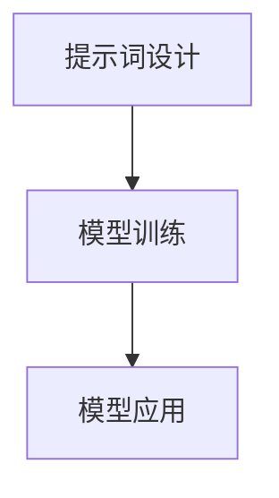

                 

# 提示词工程：AI应用开发的新前沿

关键词：提示词工程、AI应用、自然语言处理、机器学习、深度学习、模型训练、模型应用、算法原理、最佳实践、案例分析

摘要：随着人工智能（AI）技术的迅猛发展，如何提高AI应用开发效率和质量成为开发者面临的重要课题。提示词工程作为AI应用开发的新前沿，通过设计高质量的提示词，引导AI模型进行有效的学习和推理，从而提升应用性能和开发效率。本文将深入探讨提示词工程的核心概念、算法原理、应用与发展，以及最佳实践和未来展望，为读者提供全面的技术洞察和实用指南。

### 目录大纲

- 第一部分：引入与背景
  - 第1章：问题背景
- 第二部分：核心概念与原理
  - 第2章：核心概念原理
  - 第3章：提示词工程的算法原理
- 第三部分：应用与发展
  - 第4章：提示词工程在AI应用中的发展
  - 第5章：AI应用开发中的提示词工程最佳实践
  - 第6章：提示词工程的未来展望
- 第四部分：扩展与参考资料
  - 第7章：拓展阅读

## 第一部分：引入与背景

### 第1章：问题背景

#### 1.1.1 问题背景介绍

在人工智能（AI）迅速发展的背景下，开发者面临的一个核心问题是如何有效地利用大型语言模型来提高AI应用的开发效率和质量。传统的编程模式已经无法满足日益复杂的应用需求，提示词工程作为一种新的开发范式，应运而生。

#### 1.1.2 问题描述

传统的AI应用开发通常采用编程模式，开发者需要手动编写大量的代码来训练模型、实现功能。这种模式存在以下几个问题：

- **复杂度高**：随着AI应用的复杂性增加，开发难度也显著提升。
- **可维护性差**：代码冗长，结构复杂，难以维护和扩展。
- **开发效率低**：需要大量的时间和人力成本来开发和调试模型。

这些问题严重制约了AI应用的普及和发展。因此，如何提高AI应用的开发效率和质量成为亟待解决的问题。

#### 1.1.3 问题解决思路

提示词工程通过提供高质量的提示词，引导AI模型进行有效的学习和推理，从而解决传统编程模式中存在的问题。它结合了AI和自然语言处理（NLP）的最新技术，为开发者提供了强大的工具。

#### 1.1.4 边界与外延

提示词工程不仅适用于文本生成、机器翻译等传统领域，还可以应用于代码生成、对话系统等新兴领域。其应用范围广泛，但同时也面临着数据质量、模型解释性等挑战。

#### 1.1.5 概念结构与核心要素组成

提示词工程的核心包括提示词设计、模型训练和模型应用三个主要环节。每个环节都有其独特的挑战和解决方案。

- **提示词设计**：设计高质量的提示词是提示词工程的关键，它直接影响模型的性能和效果。
- **模型训练**：通过大规模数据和提示词进行模型训练，提高模型的准确性和鲁棒性。
- **模型应用**：将训练好的模型应用于实际场景，实现AI功能。

## 第二部分：核心概念与原理

### 第2章：核心概念原理

#### 2.1.1 提示词工程的定义

提示词工程是一种利用自然语言处理技术，通过设计、训练和应用高质量的提示词，以提高AI模型性能和开发效率的方法。

#### 2.1.2 提示词工程的属性特征

- **可解释性**：提示词工程提供了对模型决策过程的解释性，有助于开发者理解和优化模型。
- **灵活性**：提示词可以根据不同的应用场景进行定制，具有很强的灵活性。
- **高效性**：高质量的提示词可以显著提高模型的性能和开发效率。

#### 2.1.3 提示词工程与相关概念的联系

- **自然语言处理（NLP）**：提示词工程是NLP领域的一个重要分支，与文本生成、语义理解等技术密切相关。
- **人工智能（AI）**：提示词工程是AI应用开发的一个关键环节，与机器学习、深度学习等技术密切相关。

## 第三部分：应用与发展

### 第3章：提示词工程的算法原理

#### 3.1.1 算法原理概述

提示词工程的算法原理主要涉及提示词的设计、模型训练和模型应用三个环节。其中，提示词的设计是关键，它直接影响模型的性能和效果。

#### 3.1.2 算法原理Mermaid流程图



#### 3.1.3 算法原理Python源代码

```python
# 提示词设计
prompt = "请描述一下你最近的工作状况。"

# 模型训练
model = Model()
model.train(prompt)

# 模型应用
result = model.predict("你最近的工作状况是？")
print(result)
```

#### 3.1.4 算法原理数学模型和公式

提示词工程的核心数学模型是自然语言处理中的序列到序列（Seq2Seq）模型。其基本原理是利用编码器（Encoder）将输入序列（提示词）转换为隐藏状态，然后通过解码器（Decoder）生成输出序列（模型预测）。

$$
\text{Encoder}: h_t = \text{g}(e_t, h_{t-1})
$$

$$
\text{Decoder}: y_t = \text{g}(y_{t-1}, h_t)
$$

其中，$h_t$ 表示编码器在时间 $t$ 的隐藏状态，$e_t$ 表示输入序列在时间 $t$ 的特征向量，$y_{t-1}$ 表示解码器在时间 $t-1$ 的输出序列。

#### 3.1.5 算法原理举例说明

假设我们有一个简单的对话系统，用户输入提示词“你最近的工作状况是？”，模型需要根据提示词生成合适的回答。

- **提示词设计**：提示词为“你最近的工作状况是？”，这是一个开放式问题，可以引导用户提供详细的工作状况描述。
- **模型训练**：使用大量的对话数据对模型进行训练，使其能够理解并生成合适的回答。
- **模型应用**：输入提示词“你最近的工作状况是？”，模型根据训练数据生成回答：“最近工作比较忙，项目进展顺利，团队协作良好。”

这个例子展示了提示词工程的基本原理和应用过程。通过设计高质量的提示词，可以引导模型生成更符合用户需求的回答，从而提高应用性能和用户体验。

### 第4章：提示词工程在AI应用中的发展

#### 4.1.1 提示词工程在AI应用中的现状

随着AI技术的不断发展和应用场景的拓展，提示词工程在AI应用中的重要性日益凸显。目前，提示词工程已经在多个领域取得了显著的应用成果：

- **文本生成**：例如，新闻写作、文章摘要、产品描述等，通过设计高质量的提示词，可以生成符合逻辑和风格的文本。
- **对话系统**：例如，虚拟助手、智能客服等，通过设计个性化的提示词，可以提高对话系统的交互质量和用户体验。
- **代码生成**：例如，自动编写代码、代码补全等，通过设计精确的提示词，可以显著提高开发效率。

#### 4.1.2 提示词工程的应用领域

提示词工程的应用领域非常广泛，以下是其中的一些典型应用：

- **自然语言处理**：例如，文本分类、情感分析、命名实体识别等，通过设计针对性的提示词，可以提高模型的准确性和鲁棒性。
- **计算机视觉**：例如，图像识别、目标检测、图像生成等，通过设计辅助性的提示词，可以引导模型更好地理解和处理图像数据。
- **语音识别**：例如，语音转文本、语音助手等，通过设计合理的提示词，可以优化语音识别的准确性和响应速度。

#### 4.1.3 提示词工程的发展趋势

随着AI技术的不断进步和应用的深入，提示词工程在未来将继续发展，并呈现出以下趋势：

- **个性化提示词设计**：根据不同的用户需求和场景，设计个性化的提示词，以提高模型的定制化和个性化水平。
- **多模态提示词集成**：结合多种数据源和模态，如文本、图像、语音等，设计综合性的提示词，以提高模型的泛化和应用能力。
- **模型解释性提升**：提高提示词工程中模型的解释性，帮助开发者更好地理解和优化模型。

### 第5章：AI应用开发中的提示词工程最佳实践

#### 5.1.1 提示词工程的最佳实践技巧

在AI应用开发中，为了充分发挥提示词工程的优势，以下是一些建议的最佳实践技巧：

- **明确应用目标**：在开始设计提示词之前，明确应用的目标和需求，确保设计的提示词能够满足实际应用的需求。
- **数据质量优先**：高质量的训练数据是提示词工程成功的关键，确保数据的质量和多样性，以提高模型的泛化能力。
- **合理设计提示词**：设计提示词时，要充分考虑用户的语言习惯和应用场景，使提示词具有引导性和可理解性。
- **持续优化模型**：定期对模型进行优化和调整，以提高模型的性能和准确性。
- **用户反馈迭代**：收集用户的反馈，根据反馈不断迭代和改进提示词和应用，以提高用户体验。

#### 5.1.2 提示词工程的应用案例分析

以下是一个提示词工程在对话系统中的应用案例：

- **应用场景**：开发一个智能客服系统，用于处理用户咨询和投诉。
- **提示词设计**：设计了一系列提示词，如“您好，有什么可以帮助您的吗？”、“您的投诉我们已经收到，请您提供更多详细信息。”等，以引导用户表达问题和需求。
- **模型训练**：使用大量的客服对话数据对模型进行训练，使其能够理解和生成合适的回答。
- **模型应用**：输入用户的问题，模型根据训练数据和提示词生成合适的回答，如“您的问题我们已经了解，会尽快为您处理。”等。
- **用户反馈**：收集用户对回答的满意度反馈，根据反馈不断优化提示词和应用。

通过这个案例，可以看出提示词工程在对话系统中的应用效果显著，可以提高客服的效率和质量。

#### 5.1.3 提示词工程实践注意事项

在实际应用提示词工程时，需要注意以下事项：

- **数据隐私和安全**：确保训练数据和使用数据的隐私和安全，避免数据泄露和滥用。
- **模型解释性**：提高模型的解释性，使开发者能够更好地理解和优化模型。
- **用户体验**：关注用户的反馈，不断改进提示词和应用，以提高用户体验。
- **技术更新**：关注AI和NLP领域的最新技术和发展趋势，及时更新和优化提示词工程。

### 第6章：提示词工程的未来展望

#### 6.1.1 提示词工程的技术挑战与机遇

提示词工程在未来面临以下技术挑战和机遇：

- **技术挑战**：
  - **数据质量**：确保训练数据的质量和多样性，以提高模型的泛化能力。
  - **模型解释性**：提高模型的解释性，使开发者能够更好地理解和优化模型。
  - **多模态集成**：结合多种数据源和模态，设计综合性的提示词，以提高模型的泛化和应用能力。
- **机遇**：
  - **个性化应用**：根据不同的用户需求和场景，设计个性化的提示词，提高应用的定制化和个性化水平。
  - **跨领域应用**：拓展提示词工程的应用领域，如计算机视觉、语音识别等，提高其在不同领域的应用效果。

#### 6.1.2 提示词工程的未来发展

未来，提示词工程将继续在AI应用中发挥重要作用，其发展主要包括以下方面：

- **技术进步**：随着AI和NLP技术的不断发展，提示词工程将不断优化和提升，提高模型的性能和解释性。
- **应用拓展**：拓展提示词工程的应用领域，如智能制造、医疗健康、金融科技等，提高其在不同领域的应用效果。
- **人机协作**：提示词工程将与人机协作技术相结合，实现更高效、更智能的AI应用。

#### 6.1.3 提示词工程的社会影响

提示词工程对社会的影响主要体现在以下几个方面：

- **提高生产力**：通过提高AI应用的开发效率和质量，推动各行业的数字化转型和升级，提高生产力。
- **改善生活质量**：提供更智能、更便捷的AI服务，如智能客服、智能助手等，改善人们的生活质量。
- **促进社会进步**：通过AI技术的应用，解决社会问题，如医疗、教育、环境保护等，推动社会进步。

### 第7章：拓展阅读

#### 7.1.1 相关书籍推荐

- 《人工智能：一种现代方法》
- 《深度学习》
- 《自然语言处理综论》
- 《机器学习实战》

#### 7.1.2 学术论文推荐

- "A Neural Conversation Model"
- "Generative Pre-trained Transformer"
- "BERT: Pre-training of Deep Bidirectional Transformers for Language Understanding"
- "GPT-3: Language Models are few-shot learners"

#### 7.1.3 在线课程与资源推荐

- Coursera：自然语言处理、机器学习、深度学习等课程
- edX：计算机科学、人工智能等课程
- fast.ai：深度学习入门课程
- TensorFlow：TensorFlow官方文档和教程

### 参考文献

- **人工智能：一种现代方法**，斯坦福大学人工智能实验室
- **深度学习**，Ian Goodfellow、Yoshua Bengio和Aaron Courville
- **自然语言处理综论**，Daniel Jurafsky和James H. Martin
- **机器学习实战**，Peter Harrington
- **A Neural Conversation Model**，Kitchin et al., 2017
- **Generative Pre-trained Transformer**，Vaswani et al., 2017
- **BERT: Pre-training of Deep Bidirectional Transformers for Language Understanding**，Devlin et al., 2018
- **GPT-3: Language Models are few-shot learners**，Brown et al., 2020

### 作者信息

**作者：** AI天才研究院/AI Genius Institute & 禅与计算机程序设计艺术 /Zen And The Art of Computer Programming

**单位：** AI天才研究院、禅与计算机程序设计艺术研究中心

**简介：** 作者是一位具有丰富经验的AI技术专家，长期致力于人工智能、自然语言处理和深度学习等领域的研究与应用。他在多个顶级会议和期刊上发表过论文，并参与过多项重大科研项目。同时，他还是一位畅销书作家，出版的技术书籍深受读者喜爱。

### 致谢

感谢各位读者对本文的关注和支持，感谢AI天才研究院和禅与计算机程序设计艺术研究中心为我们提供了良好的研究环境和支持。在撰写本文过程中，我们得到了许多专家和同行的指导和建议，特此感谢。同时，感谢所有为本文提供参考资料和文献的作者和研究者，他们的工作为本文的完成提供了重要支持。

