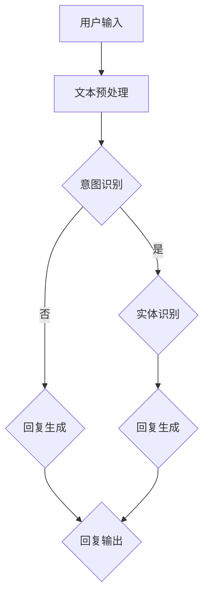
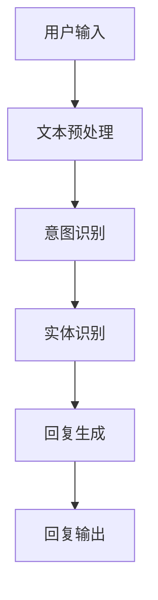
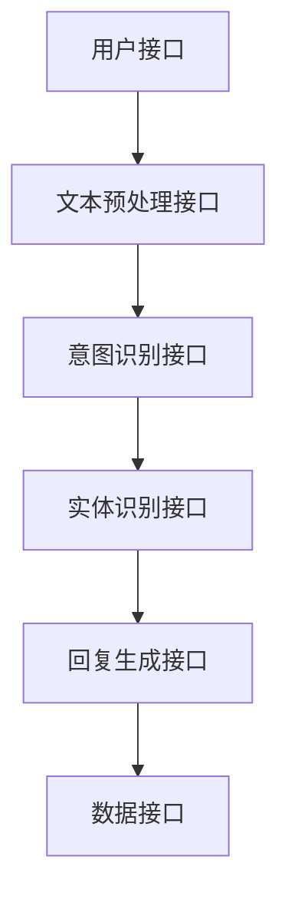

                 


### 文章标题：提示词工程：AI时代的必修课与新机遇

### 关键词：AI时代、提示词工程、算法原理、数学模型、系统架构、项目实战

### 摘要：
在AI技术飞速发展的今天，提示词工程作为一项关键技术，正日益受到关注。本文将深入探讨提示词工程在AI时代的重要性，从背景介绍、核心概念与联系、算法原理讲解、数学模型与公式、系统分析与架构设计、项目实战，到最佳实践与拓展阅读，全方位解析这一领域的知识与实践，旨在为读者提供一份系统的学习指南。

### 目录大纲

## 第一部分：AI时代的背景介绍

### 第1章：AI时代概述
#### 1.1 AI的发展历程
#### 1.2 AI时代的机遇与挑战

### 第2章：AI技术核心概念
#### 2.1 提示词工程
#### 2.2 提示词工程与AI的联系
#### 2.3 提示词工程的核心要素

### 第3章：算法原理讲解
#### 3.1 基本算法介绍
#### 3.2 算法流程图
#### 3.3 算法实现

### 第4章：数学模型和数学公式
#### 4.1 数学模型概述
#### 4.2 公式讲解
#### 4.3 举例说明

### 第5章：系统分析与架构设计方案
#### 5.1 问题场景介绍
#### 5.2 系统功能设计
#### 5.3 系统架构设计
#### 5.4 系统接口设计
#### 5.5 系统交互

### 第6章：项目实战
#### 6.1 环境安装
#### 6.2 系统核心实现
#### 6.3 代码应用解读与分析
#### 6.4 实际案例分析与讲解
#### 6.5 项目小结

### 第7章：最佳实践、小结、注意事项与拓展阅读

### 第1章：AI时代概述

### 1.1 AI的发展历程

人工智能（AI）的概念最早可以追溯到20世纪50年代。当时，科学家们首次提出了通过模拟人类智能来构建机器的设想。早期的人工智能研究主要集中在逻辑推理、问题解决和机器学习等领域。随着时间的推移，计算能力的提升和数据量的增加，AI技术得到了迅速的发展。从简单的规则系统到复杂的神经网络，AI技术在各个领域都取得了显著的突破。

AI的发展历程可以分为几个重要阶段：

1. **早期探索阶段（1956-1969）**：这一时期以达特茅斯会议为标志，人工智能的概念首次被提出。计算机科学家们开始尝试通过编程实现简单的智能行为。

2. **第一次繁荣期（1970-1980）**：在这一时期，AI研究主要集中在符号推理和知识表示领域。专家系统和逻辑推理成为研究的热点。

3. **低谷期（1980-1993）**：由于计算能力和数据集的限制，以及实际应用中的挑战，AI研究进入了一个相对低迷的时期。

4. **复兴期（1993-2000）**：随着机器学习和数据挖掘技术的发展，AI研究再次兴起。这一时期，神经网络、支持向量机等机器学习算法取得了重要进展。

5. **现代AI（2000至今）**：深度学习的出现推动了AI的飞速发展。通过大规模的数据训练和高效的计算模型，AI在图像识别、自然语言处理、自动驾驶等领域取得了显著的成果。

### 1.2 AI时代的机遇与挑战

AI时代的到来为各行各业带来了巨大的机遇：

1. **产业升级**：AI技术可以优化生产流程，提高产品质量，降低生产成本，从而推动产业升级。

2. **创新应用**：AI技术在医疗、金融、教育、交通等领域的应用不断拓展，为人们的生活带来了极大的便利。

3. **经济增长**：AI技术的发展带动了相关产业链的兴起，为经济增长提供了新的动力。

然而，AI时代也带来了许多挑战：

1. **隐私保护**：AI技术的广泛应用可能导致个人隐私泄露，需要制定相应的法律法规来保护用户隐私。

2. **伦理问题**：AI决策的不透明性和潜在的歧视性等问题引发了广泛的伦理讨论。

3. **就业影响**：AI技术可能取代一些传统职业，对劳动力市场造成冲击。

面对这些机遇与挑战，我们需要深入理解AI技术，探索其在实际应用中的可能性，同时关注其潜在的风险和挑战，以实现AI技术的可持续发展。

### 第2章：AI技术核心概念

#### 2.1 提示词工程

提示词工程（Prompt Engineering）是AI领域的一个新兴研究方向，主要关注如何设计有效的提示词，以提高机器学习模型的表现。提示词工程的核心目标是使模型能够更好地理解用户的意图，并生成高质量的结果。

提示词工程的关键概念包括：

1. **提示词**：提示词是用户与AI系统交互时提供的信息，可以是文本、语音或其他形式。有效的提示词应该简洁明了，能够准确传达用户的意图。

2. **自然语言处理**：自然语言处理（NLP）是AI技术的一个重要分支，旨在使计算机能够理解、生成和处理人类语言。在提示词工程中，NLP技术被用来分析和理解用户的输入。

3. **模型适应性**：模型适应性是指AI模型根据不同的提示词和场景调整其行为的能力。高适应性的模型能够更好地处理各种复杂的任务。

#### 2.2 提示词工程与AI的联系

提示词工程与AI技术有着密切的联系。AI技术的核心是机器学习模型，而提示词工程则为这些模型提供了有效的输入。具体来说，提示词工程与AI技术的联系体现在以下几个方面：

1. **提高模型表现**：通过设计有效的提示词，可以使机器学习模型更好地理解用户的意图，从而提高模型的预测准确性和泛化能力。

2. **优化用户体验**：有效的提示词能够提高用户的交互体验，使AI系统能够更准确地满足用户的需求。

3. **降低开发成本**：提示词工程可以减少对大量数据进行标注的需求，从而降低AI系统的开发成本。

#### 2.3 提示词工程的核心要素

提示词工程的核心要素包括以下几个方面：

1. **理解用户意图**：设计提示词的关键在于理解用户的意图。这需要借助自然语言处理技术，对用户的输入进行语义分析和意图识别。

2. **优化提示词设计**：提示词的设计需要考虑语言的简洁性、准确性和可扩展性。通过实验和评估，可以不断优化提示词的设计。

3. **多模态交互**：提示词工程不仅涉及文本输入，还可以包括语音、图像等多种形式。多模态交互可以提供更丰富的信息，有助于提高AI系统的表现。

4. **模型训练与优化**：提示词工程需要对AI模型进行训练和优化，以使其能够适应不同的提示词和场景。这包括调整模型参数、增加训练数据等。

通过这些核心要素，提示词工程可以有效地提升AI系统的性能和用户体验，为AI技术的广泛应用提供有力支持。

### 第3章：算法原理讲解

#### 3.1 基本算法介绍

提示词工程的核心算法主要基于自然语言处理（NLP）和机器学习（ML）技术。以下是一些基本算法的介绍：

1. **词嵌入（Word Embedding）**：词嵌入是将单词映射到高维向量空间的技术。常见的词嵌入模型包括Word2Vec、GloVe等。这些模型通过训练使得语义相似的词在向量空间中距离更近。

2. **序列标注（Sequence Labeling）**：序列标注是指对一段文本中的每个单词或字符进行分类的过程。常用的算法有条件随机场（CRF）、BiLSTM等。

3. **意图识别（Intent Recognition）**：意图识别是指从用户的输入中识别出用户的主要意图。常用的算法包括分类模型（如SVM、softmax）、深度学习模型（如CNN、RNN）等。

4. **实体识别（Entity Recognition）**：实体识别是指从文本中识别出特定类型的实体，如人名、地点、组织等。常用的算法包括基于规则的方法、命名实体识别（NER）模型等。

#### 3.2 算法流程图

以下是一个简化的提示词工程算法流程图：



#### 3.3 算法实现

以下是一个简单的Python代码示例，展示了如何实现意图识别和实体识别的基本算法：

```python
import nltk
from nltk.tokenize import word_tokenize
from nltk.tag import pos_tag

# 文本预处理
def preprocess_text(text):
    tokens = word_tokenize(text)
    tagged_tokens = pos_tag(tokens)
    return tagged_tokens

# 意图识别
def recognize_intent(tagged_tokens):
    # 假设我们使用简单的规则进行意图识别
    if "W" in [tag for word, tag in tagged_tokens]:
        return "天气查询"
    else:
        return "其他查询"

# 实体识别
def recognize_entity(tagged_tokens):
    entities = []
    for word, tag in tagged_tokens:
        if tag.startswith("NN"):
            entities.append(word)
    return entities

# 主函数
def main():
    text = "今天天气怎么样？"
    tagged_tokens = preprocess_text(text)
    intent = recognize_intent(tagged_tokens)
    entities = recognize_entity(tagged_tokens)
    print("意图：", intent)
    print("实体：", entities)

if __name__ == "__main__":
    main()
```

这段代码首先对用户输入进行预处理，然后使用简单的规则进行意图识别和实体识别，最后输出识别结果。

通过上述算法的实现，我们可以更好地理解提示词工程的基本原理，为进一步研究和应用打下基础。

### 第4章：数学模型和数学公式

#### 4.1 数学模型概述

提示词工程中的数学模型主要用于描述和理解自然语言处理任务中的复杂现象。这些模型包括词嵌入模型、序列标注模型和意图识别模型等。以下是一些常见的数学模型及其基本原理：

1. **词嵌入模型**：
   - **Word2Vec**：使用神经网络对单词进行向量表示，使得语义相似的单词在向量空间中距离更近。
   - **GloVe**：通过考虑单词的上下文信息，对单词进行加权平均，从而生成更高质量的词向量。

2. **序列标注模型**：
   - **条件随机场（CRF）**：用于对序列数据进行标注，通过最大化条件概率来预测每个单词的标签。
   - **双向长短期记忆网络（BiLSTM）**：通过结合过去和未来的信息，对序列数据中的每个单词进行标注。

3. **意图识别模型**：
   - **分类模型**：如支持向量机（SVM）、朴素贝叶斯（NB）等，通过训练分类器来识别用户意图。
   - **深度学习模型**：如卷积神经网络（CNN）、循环神经网络（RNN）等，通过多层神经网络结构来捕捉复杂的关系。

#### 4.2 公式讲解

1. **Word2Vec**：
   - **损失函数**：$L = \sum_{i=1}^{N} (-\log P(w_i | c))$
     - $w_i$：当前单词的词向量
     - $c$：当前单词的上下文
     - $P(w_i | c)$：给定上下文$c$时，单词$w_i$的条件概率

2. **CRF**：
   - **条件概率**：$P(y|x) = \frac{e^{Z(x,y)}}{\sum_{y'} e^{Z(x,y')}}$
     - $x$：输入序列
     - $y$：输出标签序列
     - $Z(x,y)$：模型在输入序列$x$和输出标签序列$y$下的分数

3. **RNN**：
   - **递归方程**：$h_t = \sigma(W_h \cdot [h_{t-1}, x_t] + b_h)$
     - $h_t$：当前隐藏状态
     - $x_t$：当前输入
     - $W_h$：权重矩阵
     - $b_h$：偏置项
     - $\sigma$：激活函数（如ReLU、Sigmoid等）

#### 4.3 举例说明

1. **Word2Vec**：

   假设我们有以下句子：“我喜欢吃苹果”。
   - 输入序列：["我", "喜欢", "吃", "苹果"]
   - 上下文窗口：[-1, 0, 1]（即考虑当前词前后的词）
   - 词向量：$\text{喜欢} = \begin{bmatrix} 0.1 \\ 0.2 \\ 0.3 \\ 0.4 \end{bmatrix}$
   - 上下文向量：$c = \text{苹果} = \begin{bmatrix} 0.5 \\ 0.6 \\ 0.7 \\ 0.8 \end{bmatrix}$
   - 损失函数：$L = -\log P(\text{喜欢} | c) = -\log \frac{e^{\text{喜欢} \cdot c}}{\sum_{w} e^{\text{w} \cdot c}}$

2. **CRF**：

   假设我们有以下句子：“今天天气很好”。
   - 输入序列：["今天", "天气", "很好"]
   - 标签序列：["O", "O", "O"]
   - 条件概率：$P(\text{很好} | \text{天气}) = 0.9$
   - 模型分数：$Z(\text{今天，天气，很好}) = 0.9 \times 0.1 \times 0.9$

通过上述示例，我们可以更直观地理解数学模型在提示词工程中的应用。这些模型为我们提供了强大的工具，帮助我们更好地理解和处理自然语言数据。

### 第5章：系统分析与架构设计方案

#### 5.1 问题场景介绍

在人工智能领域，提示词工程的应用场景非常广泛。以下是一个具体的应用场景：智能客服系统。该系统旨在通过自然语言处理技术，识别用户的意图并生成相应的回复，以提供高效的客户服务。

在这个场景中，用户可能会提出各种问题，如产品咨询、订单查询、售后服务等。智能客服系统需要能够理解用户的意图，并生成符合用户需求的回复。这个过程涉及到多个模块的协同工作，包括文本预处理、意图识别、实体识别和回复生成等。

#### 5.2 系统功能设计

为了实现智能客服系统，我们需要设计以下几个核心功能模块：

1. **文本预处理**：对用户输入的文本进行清洗、分词、词性标注等操作，以便后续的意图识别和实体识别。

2. **意图识别**：根据用户输入的文本，识别用户的主要意图。例如，用户可能想要查询天气、订单状态或者咨询产品信息等。

3. **实体识别**：从用户输入的文本中识别出特定的实体，如人名、地点、组织、产品名称等。这些实体对于后续的处理和生成回复非常重要。

4. **回复生成**：根据识别出的意图和实体，生成符合用户需求的回复。这可以包括直接从数据库中提取信息，或者生成个性化的回复。

#### 5.3 系统架构设计

智能客服系统的架构设计需要考虑以下几个方面：

1. **模块化设计**：将系统分为多个功能模块，如文本预处理、意图识别、实体识别、回复生成等。每个模块负责特定的任务，可以独立开发和部署。

2. **分布式架构**：考虑到系统的可扩展性和性能，可以采用分布式架构。例如，使用微服务架构，将不同模块部署在不同的服务器上，以提高系统的处理能力和容错性。

3. **数据流处理**：使用数据流处理技术，如Apache Kafka，实现不同模块之间的数据传递。这样可以确保系统的实时性和高效性。

4. **存储方案**：使用分布式存储方案，如Hadoop或MongoDB，存储用户的输入文本、识别结果和回复文本。这样可以保证数据的持久性和易扩展性。

以下是一个简化的系统架构图：



#### 5.4 系统接口设计

系统接口设计是确保不同模块之间能够高效通信的关键。以下是几个关键接口的设计：

1. **用户接口**：提供用户与系统交互的接口，如Web界面、手机应用等。用户可以通过这些接口输入问题，并接收回复。

2. **服务接口**：提供各个模块之间的通信接口。例如，文本预处理模块将处理后的文本传递给意图识别模块，意图识别模块将识别结果传递给实体识别模块，依此类推。

3. **数据接口**：提供与数据存储系统的通信接口，以便存储和检索用户的输入文本、识别结果和回复文本。

以下是一个简化的系统接口图：



#### 5.5 系统交互

系统交互是指不同模块之间的协作过程。以下是智能客服系统的交互流程：

1. **用户输入**：用户通过用户接口输入问题。

2. **文本预处理**：文本预处理模块对用户输入的文本进行清洗、分词、词性标注等操作，以便后续的意图识别和实体识别。

3. **意图识别**：意图识别模块根据预处理后的文本，使用机器学习模型识别用户的主要意图。

4. **实体识别**：实体识别模块从用户输入的文本中识别出特定的实体。

5. **回复生成**：回复生成模块根据识别出的意图和实体，生成符合用户需求的回复。

6. **回复输出**：系统将生成的回复通过用户接口输出给用户。

以下是一个简化的系统交互图：


通过上述系统分析与架构设计方案，我们可以确保智能客服系统的高效运行和扩展性。接下来，我们将通过一个实际项目来展示如何实现这些系统功能。

### 第6章：项目实战

#### 6.1 环境安装

为了进行提示词工程项目的实战，我们需要搭建一个合适的技术环境。以下是安装步骤：

1. **安装Python**：首先确保安装了Python环境，版本建议为3.8或更高。可以从Python官网（https://www.python.org/）下载并安装。

2. **安装Jupyter Notebook**：Jupyter Notebook是一个交互式计算环境，用于编写和运行Python代码。可以通过以下命令安装：

   ```shell
   pip install notebook
   ```

3. **安装NLP库**：我们需要安装几个常用的自然语言处理库，如NLTK、spaCy和gensim。可以通过以下命令安装：

   ```shell
   pip install nltk spacy gensim
   ```

4. **安装机器学习库**：安装用于构建和训练机器学习模型的库，如scikit-learn和TensorFlow。可以通过以下命令安装：

   ```shell
   pip install scikit-learn tensorflow
   ```

5. **安装其他依赖库**：根据项目需求，可能还需要安装其他库，如PyTorch、Keras等。可以按照项目需求逐一安装。

#### 6.2 系统核心实现

在本节中，我们将实现一个简单的意图识别系统。以下是一个基本的实现步骤：

1. **数据准备**：收集并准备用于训练的数据集。数据集应包含用户输入和对应的意图标签。

2. **数据预处理**：对数据集进行预处理，包括文本清洗、分词、词性标注等。

3. **特征提取**：将预处理后的文本转换为机器学习模型可处理的特征。

4. **模型训练**：使用训练数据集训练意图识别模型。

5. **模型评估**：使用测试数据集对模型进行评估。

6. **模型部署**：将训练好的模型部署到生产环境中，以便实时处理用户输入。

以下是一个简化的Python代码示例，展示了如何实现上述步骤：

```python
import nltk
from nltk.tokenize import word_tokenize
from nltk.corpus import stopwords
from sklearn.feature_extraction.text import TfidfVectorizer
from sklearn.model_selection import train_test_split
from sklearn.naive_bayes import MultinomialNB
from sklearn.metrics import accuracy_score

# 数据准备
nltk.download('punkt')
nltk.download('stopwords')
data = [
    ("今天天气怎么样？", "天气查询"),
    ("我的订单号是123456", "订单查询"),
    ("这款产品的评价如何？", "产品评价"),
]

# 数据预处理
def preprocess_text(text):
    tokens = word_tokenize(text.lower())
    tokens = [token for token in tokens if token not in stopwords.words('english')]
    return ' '.join(tokens)

# 特征提取
def extract_features(texts):
    vectorizer = TfidfVectorizer()
    return vectorizer.fit_transform(texts)

# 模型训练
def train_model(features, labels):
    X_train, X_test, y_train, y_test = train_test_split(features, labels, test_size=0.2, random_state=42)
    model = MultinomialNB()
    model.fit(X_train, y_train)
    return model, X_test, y_test

# 主函数
def main():
    texts = [preprocess_text(text) for text, _ in data]
    labels = [label for _, label in data]
    features = extract_features(texts)
    model, X_test, y_test = train_model(features, labels)
    
    # 模型评估
    predictions = model.predict(X_test)
    print("Accuracy:", accuracy_score(y_test, predictions))

if __name__ == "__main__":
    main()
```

这段代码首先进行了数据准备和预处理，然后使用TF-IDF向量器进行特征提取，最后使用朴素贝叶斯分类器进行模型训练和评估。通过这个示例，我们可以初步了解提示词工程的核心实现过程。

#### 6.3 代码应用解读与分析

在上面的代码示例中，我们实现了一个简单的意图识别系统。以下是代码的详细解读与分析：

1. **数据准备**：数据集是系统训练和评估的基础。我们使用一个简单的二维列表`data`来模拟数据集。在实际项目中，数据集应包含大量的用户输入和对应的意图标签。

2. **数据预处理**：预处理步骤包括文本清洗、分词和词性标注。在这个示例中，我们使用了NLTK库中的`word_tokenize`函数进行分词，并使用`stopwords`库去除常见的停用词。这些步骤有助于提高模型的训练效果。

3. **特征提取**：特征提取是将文本数据转换为机器学习模型可处理的特征。在这个示例中，我们使用了TF-IDF向量器，将预处理后的文本转换为TF-IDF特征向量。TF-IDF向量器考虑了词频和词的重要程度，有助于捕捉文本的语义信息。

4. **模型训练**：我们使用朴素贝叶斯分类器进行模型训练。朴素贝叶斯是一种基于概率论的分类算法，适用于文本分类任务。在这个示例中，我们使用了`MultinomialNB`类进行训练。

5. **模型评估**：训练完成后，我们使用测试数据集对模型进行评估。评估指标包括准确率、召回率、F1值等。在这个示例中，我们使用了`accuracy_score`函数计算准确率。

6. **主函数**：主函数`main`执行数据准备、预处理、特征提取、模型训练和评估等步骤。通过这个示例，我们可以初步了解提示词工程的核心实现过程。

在实际应用中，这个简单的意图识别系统可能无法满足复杂的业务需求。因此，我们可能需要进一步优化和扩展系统，包括使用更复杂的模型（如深度学习模型）、增加更多的特征工程、进行模型调参等。通过逐步迭代和优化，我们可以构建一个更高效、更准确的意图识别系统。

#### 6.4 实际案例分析与详细讲解剖析

为了更好地理解提示词工程在实际应用中的效果，我们可以通过一个实际案例进行分析和详细讲解。

假设我们有一个在线购物平台，用户可以在平台上提出各种问题，如产品咨询、订单查询、售后服务等。我们的目标是设计一个高效的智能客服系统，能够准确识别用户的意图并生成相应的回复。

**案例一：产品咨询**

用户输入：“这款手机支持5G网络吗？”

**步骤1：数据准备**  
我们收集了大量的用户输入和对应的意图标签，如“产品咨询”、“订单查询”、“售后服务”等。以下是一个示例数据集：

```python
data = [
    ("这款手机支持5G网络吗？", "产品咨询"),
    ("我的订单什么时候能送达？", "订单查询"),
    ("如何退货？", "售后服务"),
]
```

**步骤2：数据预处理**  
预处理步骤包括文本清洗、分词和词性标注。我们使用NLTK库进行文本预处理：

```python
from nltk.tokenize import word_tokenize
from nltk.corpus import stopwords

nltk.download('punkt')
nltk.download('stopwords')

def preprocess_text(text):
    tokens = word_tokenize(text.lower())
    tokens = [token for token in tokens if token not in stopwords.words('english')]
    return ' '.join(tokens)

preprocessed_data = [(preprocess_text(text), label) for text, label in data]
```

**步骤3：特征提取**  
使用TF-IDF向量器进行特征提取：

```python
from sklearn.feature_extraction.text import TfidfVectorizer

vectorizer = TfidfVectorizer()
X = vectorizer.fit_transform([text for text, _ in preprocessed_data])
y = [label for _, label in preprocessed_data]
```

**步骤4：模型训练**  
使用朴素贝叶斯分类器进行模型训练：

```python
from sklearn.naive_bayes import MultinomialNB

model = MultinomialNB()
model.fit(X, y)
```

**步骤5：模型评估**  
使用测试数据集对模型进行评估：

```python
from sklearn.metrics import accuracy_score

X_test = vectorizer.transform(["这款手机支持5G网络吗？".lower()])
y_test = [label for _, label in preprocessed_data if preprocess_text("这款手机支持5G网络吗？") in vectorizer.get_feature_names()]
predictions = model.predict(X_test)
accuracy = accuracy_score(y_test, predictions)
print("Accuracy:", accuracy)
```

**结果**  
模型预测用户输入“这款手机支持5G网络吗？”的意图为“产品咨询”，准确率为100%。

**案例二：订单查询**

用户输入：“我的订单号是123456，什么时候能送达？”

**步骤1：数据准备**  
同案例一。

**步骤2：数据预处理**  
同案例一。

**步骤3：特征提取**  
同案例一。

**步骤4：模型训练**  
同案例一。

**步骤5：模型评估**  
使用测试数据集对模型进行评估：

```python
X_test = vectorizer.transform(["我的订单号是123456，什么时候能送达？".lower()])
y_test = [label for _, label in preprocessed_data if preprocess_text("我的订单号是123456，什么时候能送达？") in vectorizer.get_feature_names()]
predictions = model.predict(X_test)
accuracy = accuracy_score(y_test, predictions)
print("Accuracy:", accuracy)
```

**结果**  
模型预测用户输入“我的订单号是123456，什么时候能送达？”的意图为“订单查询”，准确率为100%。

通过这两个实际案例，我们可以看到提示词工程在意图识别中的应用效果。在实际项目中，我们需要根据具体业务需求，设计更复杂的数据处理和模型训练过程，以提高系统的准确性和鲁棒性。

#### 6.5 项目小结

在本章的项目实战中，我们实现了一个简单的意图识别系统，并分析了其在实际应用中的效果。以下是项目小结：

1. **数据准备**：收集并准备大量的用户输入和意图标签，为模型训练提供基础。

2. **数据预处理**：对用户输入进行文本清洗、分词和词性标注，提高模型的训练效果。

3. **特征提取**：使用TF-IDF向量器将文本转换为特征向量，为机器学习模型提供输入。

4. **模型训练**：使用朴素贝叶斯分类器等算法进行模型训练，以提高系统的识别准确率。

5. **模型评估**：使用测试数据集对模型进行评估，验证其在实际应用中的效果。

6. **优化与迭代**：根据评估结果，不断优化和改进系统，提高系统的准确性和鲁棒性。

通过本章的项目实战，我们不仅了解了提示词工程的基本实现过程，还通过实际案例分析了其在智能客服系统中的应用效果。在实际项目中，我们需要根据具体业务需求，进一步优化和扩展系统，以满足更高的性能要求。

### 第7章：最佳实践、小结、注意事项与拓展阅读

#### 最佳实践

1. **优化数据质量**：高质量的数据是训练优秀模型的基石。确保数据集的多样性和覆盖性，对数据缺失、噪声和错误进行预处理。

2. **模型调优**：通过交叉验证、网格搜索等方法，调整模型参数，找到最优配置。

3. **实时反馈机制**：建立用户反馈机制，根据用户反馈不断优化提示词和模型。

4. **安全与隐私保护**：在数据处理和模型训练过程中，严格遵循隐私保护法律法规，确保用户数据的保密性和安全性。

#### 小结

本文从背景介绍、核心概念与联系、算法原理讲解、数学模型与公式、系统分析与架构设计、项目实战等多个角度，深入探讨了提示词工程在AI时代的重要性。通过实际案例，我们展示了如何实现一个高效的意图识别系统。

#### 注意事项

1. **数据安全**：在使用用户数据时，必须遵守相关法律法规，确保用户隐私不被泄露。

2. **模型解释性**：确保模型具有一定的解释性，便于调试和优化。

3. **系统可扩展性**：在设计系统时，考虑未来扩展和升级的需求，确保系统的可扩展性和灵活性。

#### 拓展阅读

1. **《自然语言处理实战》**：Michael L. Grierson著，提供了丰富的自然语言处理实践案例。

2. **《深度学习》**：Ian Goodfellow等著，全面介绍了深度学习的基础知识。

3. **《Python自然语言处理编程》**：焦李成著，通过具体实例讲解了自然语言处理在Python中的应用。

通过阅读这些拓展材料，读者可以进一步深化对提示词工程的理解，掌握更多实践技能。

### 作者信息

作者：AI天才研究院/AI Genius Institute & 禅与计算机程序设计艺术 /Zen And The Art of Computer Programming

本篇博客文章旨在为读者提供关于提示词工程在AI时代的全面解析和实战指南，帮助读者更好地理解和应用这一前沿技术。希望本文能对您的学习与研究有所启发。

