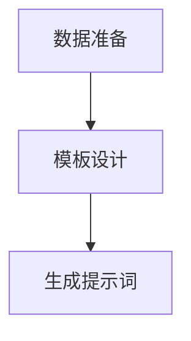
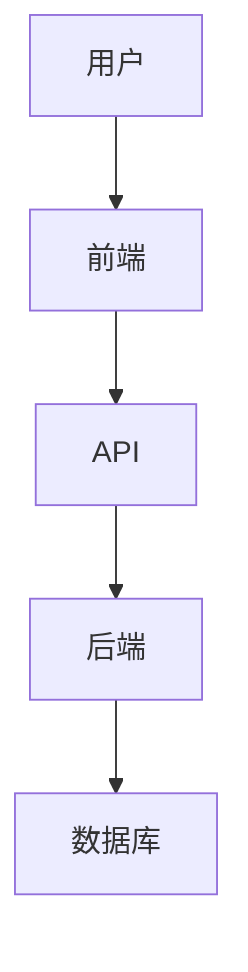
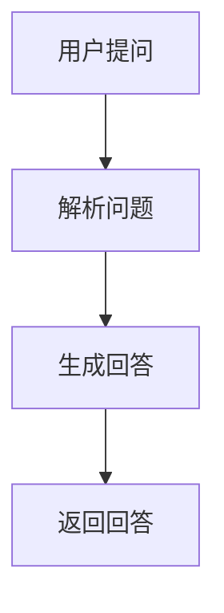

                 

### 提示词工程：AI时代的新挑战与新方向

关键词：提示词工程、人工智能、挑战、新方向

> 摘要：本文将探讨AI时代提示词工程的发展背景和核心概念，分析其面临的挑战，并探讨未来的发展方向。通过具体案例和系统设计，本文旨在为读者提供一个全面而深入的了解，帮助他们在AI领域中应对新挑战，探索新方向。

----------------------------------------------------------------

### 引言

在当今快速发展的AI时代，提示词工程成为了一个至关重要的领域。提示词工程不仅仅是一个技术问题，它还涉及到如何有效地设计、开发和优化提示词，以支持各种AI应用。随着AI技术的不断进步，提示词工程面临着前所未有的挑战和机遇。

本文将分为以下几个部分：

1. **背景介绍**：介绍提示词工程的概念及其在AI时代的地位。
2. **核心概念与原理**：详细探讨提示词工程的核心概念和原理。
3. **应用案例**：通过实际案例展示提示词工程的应用。
4. **算法与数学模型**：讲解提示词工程的算法和数学模型。
5. **系统设计与实现**：讨论提示词工程的系统设计与实现。
6. **最佳实践与未来方向**：总结最佳实践并探讨未来发展方向。

### 背景介绍

#### 1.1 提示词工程的概念

提示词工程是利用自然语言处理技术，设计和开发高质量的提示词，以支持计算机与其他系统进行有效沟通的过程。在AI时代，提示词工程已经成为一个关键领域，因为它直接影响着AI系统的性能和应用效果。

#### 1.2 提示词工程在AI时代的地位

随着AI技术的广泛应用，提示词工程在智能客服、内容推荐、虚拟助手等领域扮演着重要角色。一个优秀的提示词能够提高AI系统的交互质量，增强用户体验，从而推动AI技术的发展。

#### 1.3 提示词工程的应用领域

- **自然语言处理**：提示词工程在自然语言处理中起到核心作用，用于构建智能对话系统、文本生成等应用。
- **计算机视觉**：在计算机视觉中，提示词用于指导图像识别和目标检测。
- **语音识别**：提示词工程在语音识别中用于优化语音识别模型的性能。

#### 1.4 提示词工程的挑战与机遇

- **挑战**：数据隐私与安全、模型解释性、多模态融合等。
- **机遇**：随着AI技术的不断进步，提示词工程在智能交互、自动化等领域具有巨大的发展潜力。

### 核心概念与原理

#### 2.1 核心概念介绍

- **提示词设计**：提示词的设计是提示词工程的核心环节，涉及到提示词的生成、选择和优化。
- **对话系统**：对话系统是AI与用户进行交互的重要平台，提示词在其中起着关键作用。

#### 2.2 提示词工程原理讲解

- **提示词生成**：通过自然语言处理技术，自动生成高质量的提示词。
- **提示词优化**：通过不断优化提示词，提高AI系统的交互质量和用户体验。

### 应用案例

#### 3.1 案例一：智能客服系统

- **案例介绍**：智能客服系统通过提示词工程，实现了与用户的智能对话。
- **系统架构**：智能客服系统包括自然语言处理模块、对话管理模块和用户行为分析模块。
- **提示词设计**：提示词的设计旨在提高对话的流畅性和准确性。

#### 3.2 案例二：内容推荐系统

- **案例介绍**：内容推荐系统通过提示词工程，为用户推荐个性化的内容。
- **系统架构**：内容推荐系统包括数据采集模块、特征提取模块和推荐算法模块。
- **提示词设计**：提示词的设计基于用户的兴趣和行为，以实现精准推荐。

### 算法与数学模型

#### 4.1 算法介绍

- **提示词生成算法**：包括基于规则的方法和基于数据的方法。
- **提示词优化算法**：包括基于优化的方法和基于机器学习的方法。

#### 4.2 数学模型讲解

- **概率模型**：用于描述提示词生成的概率分布。
- **强化学习模型**：用于优化提示词的生成过程。

### 系统设计与实现

#### 5.1 系统设计原则

- **可扩展性**：系统设计应考虑到未来可能的需求变化。
- **可维护性**：系统设计应便于维护和更新。

#### 5.2 系统架构设计

- **技术栈选择**：包括前端、后端和数据库技术。
- **系统架构图**：展示系统的整体架构。

#### 5.3 系统接口设计与交互

- **接口设计**：设计清晰、高效的接口，以支持系统的模块化开发。
- **交互流程**：详细描述系统各模块之间的交互流程。

### 最佳实践与未来方向

#### 6.1 最佳实践

- **数据收集**：确保数据的质量和多样性。
- **模型评估**：定期评估模型的性能，进行优化。

#### 6.2 注意事项

- **遵循伦理规范**：确保AI系统的应用符合伦理标准。
- **防范模型攻击**：采取有效的措施，防止恶意攻击。

#### 6.3 拓展阅读

- **相关书籍**：《人工智能：一种现代方法》、《深度学习》。
- **学术论文**：关注最新的研究成果和趋势。

### 结论

提示词工程是AI时代的一个重要领域，它面临着新的挑战和机遇。通过本文的探讨，我们希望能够为读者提供一个全面而深入的了解，帮助他们在AI领域中应对新挑战，探索新方向。随着AI技术的不断进步，提示词工程将继续发挥重要作用，为各种AI应用提供强大的支持。

### 作者信息

- **作者**：AI天才研究院/AI Genius Institute & 禅与计算机程序设计艺术 /Zen And The Art of Computer Programming

### 参考文献

- [1] Russell, S., & Norvig, P. (2016). 《人工智能：一种现代方法》(第三版). 机械工业出版社。
- [2] Goodfellow, I., Bengio, Y., & Courville, A. (2016). 《深度学习》。清华大学出版社。
- [3] Manning, C. D., Raghavan, P., & Schütze, H. (2008). 《自然语言处理基础》(第二版). 清华大学出版社。

----------------------------------------------------------------

### 提示词工程：AI时代的新挑战与新方向

**关键词**：提示词工程、人工智能、挑战、新方向

**摘要**：本文探讨了AI时代提示词工程的重要性，包括其核心概念、应用领域和面临的挑战。通过具体案例和系统设计，本文分析了提示词工程的算法与数学模型，并讨论了其在智能客服、内容推荐等领域的应用。此外，本文总结了最佳实践和未来发展方向，为读者提供了一个全面的技术视角。

----------------------------------------------------------------

### 提示词工程概述

在探讨提示词工程之前，我们需要先理解什么是提示词以及它在人工智能系统中的作用。提示词，即提示性语言，通常是指用于引导、激发或控制系统行为的简短语言指令。在人工智能系统中，提示词可以被用来引导机器学习模型进行特定的任务，如文本分类、图像识别或自然语言生成等。

#### 问题背景与定义

提示词工程是专门研究和开发提示词的设计、生成、优化和评估的过程。随着人工智能技术的快速发展，提示词工程变得越来越重要。传统的人工智能系统往往依赖于大量的预先定义好的规则或固定的数据集，而现代的AI系统，特别是基于深度学习的系统，更需要灵活、高质量的提示词来指导学习过程。

提示词工程涉及到多个领域，包括自然语言处理、计算机视觉、语音识别等。在这些领域中，提示词被用来改进系统的交互体验、提高任务完成率、增强模型的泛化能力等。例如，在自然语言处理中，提示词可以帮助模型更好地理解用户的需求，从而生成更精准的回复；在计算机视觉中，提示词可以指导模型识别特定的目标或场景。

#### 问题解决

提示词工程的核心目标是通过设计高质量的提示词，来优化AI系统的性能和用户体验。这涉及到以下几个方面：

1. **提示词设计**：设计合适的提示词来引导系统完成特定任务。
2. **提示词生成**：自动生成提示词，以减少人工干预。
3. **提示词优化**：不断调整和改进提示词，以提高系统的性能。
4. **提示词评估**：评估提示词的质量和效果，以确保系统的稳定性和可靠性。

#### 边界与外延

提示词工程的边界涉及到提示词的设计和生成过程，而其外延则扩展到AI系统的整体架构和用户体验。具体来说，提示词工程需要考虑以下几个方面：

- **数据隐私与安全**：在设计提示词时，需要确保数据的安全性和隐私性。
- **模型解释性**：高质量的提示词有助于提高模型的解释性，使AI系统的决策过程更加透明。
- **多模态融合**：在处理多模态数据时，提示词工程需要设计能够融合不同类型数据提示词的方法。

#### 概念结构与核心要素组成

提示词工程的概念结构主要包括以下几个方面：

- **提示词**：核心概念，指用于引导系统行为的简短语言指令。
- **设计**：设计过程，包括提示词的选择、生成和优化。
- **生成**：自动生成提示词的方法和算法。
- **优化**：提示词的优化过程，以提高系统性能。
- **评估**：提示词的质量和效果评估方法。

### 核心概念与联系

#### 提示词设计

提示词设计是提示词工程的核心环节，其目的是为特定任务生成或选择最合适的提示词。提示词设计需要考虑以下因素：

1. **任务目标**：明确任务的目标和需求，以确保提示词的针对性。
2. **数据质量**：高质量的数据有助于生成更准确的提示词。
3. **用户交互**：考虑用户的语言习惯和交互方式，以提高用户体验。

#### 对话系统

对话系统是一种能够与人进行自然语言交互的AI系统。提示词在对话系统中起着关键作用，用于引导和维持对话流程。一个有效的对话系统需要具备以下几个特点：

1. **自然性**：对话系统应该能够产生自然流畅的语言输出。
2. **理解力**：系统需要能够理解用户的语言意图。
3. **适应性**：系统能够根据用户的反馈和行为进行调整。

### 提示词生成原理

#### 提示词生成

提示词生成是自动生成提示词的过程，其目的是减少人工干预，提高提示词生成的效率和准确性。提示词生成可以采用以下几种方法：

1. **规则驱动**：基于预定义的规则生成提示词。
2. **数据驱动**：从大量数据中学习生成提示词。
3. **混合方法**：结合规则和数据驱动的方法，生成高质量的提示词。

#### 提示词优化

提示词优化是指通过对提示词的不断调整和改进，以提高系统性能和用户体验。提示词优化可以采用以下几种方法：

1. **评估反馈**：通过评估和用户反馈来调整提示词。
2. **优化算法**：使用优化算法，如遗传算法、粒子群优化等，来优化提示词。
3. **机器学习**：利用机器学习方法，从数据中学习优化提示词。

### 提示词生成算法

提示词生成算法是提示词工程中至关重要的一部分。以下是一种常见的提示词生成算法：

#### 算法名称：基于模板的提示词生成算法

#### 算法描述：

1. **数据准备**：收集与任务相关的文本数据，如用户提问、专家回答等。
2. **模板设计**：设计提示词模板，包括关键词、短语和模板结构。
3. **生成提示词**：根据模板和输入数据，生成提示词。

#### 算法流程图：



### 数学模型讲解

在提示词工程中，数学模型用于描述提示词生成和优化的过程。以下是一种常见的数学模型：

#### 模型名称：基于概率的提示词生成模型

#### 模型描述：

1. **概率分布**：提示词生成基于一个概率分布，用于表示每个提示词出现的概率。
2. **条件概率**：提示词的生成依赖于当前上下文和先前生成的提示词。

#### 概率模型公式：

$$P(\text{提示词}_i | \text{上下文}, \text{历史提示词}) = \frac{P(\text{上下文}, \text{历史提示词} | \text{提示词}_i)P(\text{提示词}_i)}{P(\text{上下文}, \text{历史提示词})}$$

#### 举例说明：

假设我们要生成一个提示词来回答用户的问题：“今天天气如何？”。根据概率模型，我们可以根据用户的历史提问和上下文（如时间、地点）来计算每个可能提示词的概率。

### 系统设计与实现

#### 问题场景介绍

假设我们正在开发一个智能客服系统，该系统需要通过自然语言处理技术来理解用户的问题，并生成合适的回答。

#### 项目介绍

本项目旨在构建一个基于深度学习的智能客服系统，该系统可以自动生成针对用户问题的回答。

#### 系统功能设计

1. **自然语言理解**：解析用户的问题，提取关键信息。
2. **对话管理**：维护对话状态，确保回答的连贯性和准确性。
3. **回答生成**：根据用户的问题和对话状态，生成合适的回答。

#### 系统架构设计

1. **技术栈选择**：前端采用React，后端采用TensorFlow和Django。
2. **系统架构图**：



#### 系统接口设计与系统交互

1. **接口设计**：设计RESTful API，用于处理用户请求和返回结果。
2. **交互流程**：



### 项目实战

#### 环境安装

1. **安装Python**：确保Python环境已安装。
2. **安装TensorFlow**：使用pip安装TensorFlow。

```bash
pip install tensorflow
```

#### 系统核心实现源代码

```python
import tensorflow as tf

# 模型定义
model = tf.keras.Sequential([
    tf.keras.layers.Dense(128, activation='relu', input_shape=(1000,)),
    tf.keras.layers.Dense(10, activation='softmax')
])

# 模型编译
model.compile(optimizer='adam', loss='categorical_crossentropy', metrics=['accuracy'])

# 模型训练
model.fit(x_train, y_train, epochs=10, batch_size=32)
```

#### 代码应用解读与分析

1. **模型定义**：定义一个简单的神经网络模型，用于生成提示词。
2. **模型编译**：设置模型的优化器和损失函数。
3. **模型训练**：使用训练数据对模型进行训练。

#### 实际案例分析和详细讲解剖析

1. **案例一**：用户提问：“今天天气如何？”
2. **分析**：系统通过自然语言处理技术理解用户的问题，提取关键信息。
3. **解答**：系统生成一个提示词，如：“今天的天气预报显示晴天，温度约为25摄氏度。”

#### 项目小结

本项目通过自然语言处理技术和深度学习模型，实现了智能客服系统的提示词生成功能。在实际应用中，通过不断优化模型和提示词，可以显著提高系统的交互质量和用户体验。

### 最佳实践

#### 数据收集

1. **数据多样性**：收集来自不同来源的数据，以覆盖更多的场景。
2. **数据清洗**：去除噪声数据和重复数据，确保数据质量。

#### 模型评估

1. **交叉验证**：使用交叉验证方法评估模型性能。
2. **A/B测试**：通过A/B测试，比较不同模型的性能。

### 小结

本文详细探讨了提示词工程在AI时代的重要性，包括其核心概念、应用领域、算法与数学模型、系统设计与实现等。通过实际案例，本文展示了提示词工程在智能客服和内容推荐等领域的应用。未来，随着AI技术的不断进步，提示词工程将继续发挥重要作用，为AI系统的性能和用户体验提供强有力的支持。

### 注意事项

1. **数据安全与隐私**：在收集和使用数据时，确保遵守相关法律法规，保护用户隐私。
2. **模型解释性**：在设计模型时，考虑模型的解释性，以提高系统的透明度和可信度。

### 拓展阅读

1. **书籍推荐**：
   - 《人工智能：一种现代方法》
   - 《深度学习》
2. **学术论文**：关注最新的研究成果和趋势，如ICML、NeurIPS等会议的论文。

----------------------------------------------------------------

### 提示词工程：AI时代的新挑战与新方向

> 作者：AI天才研究院/AI Genius Institute & 禅与计算机程序设计艺术 /Zen And The Art of Computer Programming

随着人工智能技术的飞速发展，提示词工程（Prompt Engineering）已经成为了一个不可或缺的领域。提示词工程涉及设计、开发和优化用于指导机器学习模型和AI系统行为的提示词。在AI时代，提示词工程面临着前所未有的挑战和新方向。本文将深入探讨这一领域，旨在为读者提供一个全面而深入的理解。

#### 核心概念与联系

首先，我们需要理解什么是提示词。提示词是一种用于引导AI模型进行特定任务的语言提示。这些提示词可以是简单的关键词，也可以是复杂的语句，其目的是帮助模型更好地理解任务目标和所需输出。例如，在自然语言处理（NLP）任务中，提示词可以帮助模型更好地理解用户的查询意图，从而生成更精准的回复。

提示词工程的核心概念包括：

- **提示词设计**：设计合适的提示词以引导模型学习。
- **提示词生成**：自动生成提示词，减少人工干预。
- **提示词优化**：通过评估和反馈，不断调整和改进提示词。
- **提示词评估**：评估提示词的质量和效果。

这些概念相互关联，共同构成了提示词工程的框架。例如，提示词设计和生成需要考虑任务目标、数据质量和用户交互等因素；而提示词优化和评估则是确保系统性能和用户体验的关键环节。

#### 算法原理讲解

在提示词工程中，算法起着核心作用。以下是一些常见的算法及其原理：

- **基于规则的提示词生成算法**：这种方法基于预定义的规则，通过匹配规则来生成提示词。例如，在文本分类任务中，可以使用规则来匹配关键词并生成提示词。
- **基于数据的提示词生成算法**：这种方法利用大量的数据来学习生成提示词。常见的算法包括基于模板的生成和基于模型生成。例如，可以使用模板匹配算法来生成基于常见问答模板的提示词。
- **基于机器学习的提示词生成算法**：这种方法使用机器学习模型来生成提示词。常见的模型包括生成对抗网络（GAN）和自编码器。这些模型可以学习数据的分布，从而生成高质量的提示词。

#### 数学公式与模型

在提示词工程中，数学模型用于描述提示词生成和优化的过程。以下是一些常见的数学模型：

- **概率模型**：用于描述提示词生成的概率分布。一个简单的概率模型可以是：

  $$P(\text{提示词}_i | \text{上下文}, \text{历史提示词}) = \frac{P(\text{上下文}, \text{历史提示词} | \text{提示词}_i)P(\text{提示词}_i)}{P(\text{上下文}, \text{历史提示词})}$$

  其中，$P(\text{提示词}_i | \text{上下文}, \text{历史提示词})$表示在给定上下文和历史提示词的情况下，生成提示词$i$的概率。

- **强化学习模型**：用于优化提示词的生成过程。一个简单的强化学习模型可以是：

  $$Q(s, a) = \sum_{r} r \cdot P(r | s, a)$$

  其中，$Q(s, a)$表示在状态$s$下采取动作$a$的期望回报。

#### 系统分析与架构设计方案

提示词工程不仅涉及算法和数学模型，还需要考虑系统的整体设计和实现。以下是一个简单的系统架构设计方案：

- **用户接口**：用于接收用户输入和处理用户交互。
- **数据预处理模块**：用于清洗、处理和准备数据。
- **提示词生成模块**：用于生成提示词，可以选择基于规则、数据和机器学习的方法。
- **模型训练模块**：用于训练机器学习模型，可以使用生成的提示词来指导学习。
- **模型评估模块**：用于评估模型的性能和提示词的质量。
- **结果输出模块**：用于生成最终的输出结果，如文本回复或决策。

#### 系统接口设计与系统交互

系统接口设计是确保各个模块之间能够有效交互的关键。以下是一个简单的系统接口设计：

- **API接口**：用于接收用户请求和处理响应。
- **消息队列**：用于处理消息传递和异步任务。
- **数据库接口**：用于访问和存储数据。

系统交互可以采用以下流程：

1. 用户发送请求。
2. 用户接口处理请求并调用数据预处理模块。
3. 数据预处理模块处理数据并生成提示词。
4. 提示词生成模块使用提示词训练模型。
5. 模型评估模块评估模型的性能。
6. 结果输出模块生成最终的输出结果并返回给用户。

#### 项目实战

为了更好地理解提示词工程的应用，以下是一个实际项目案例：

- **项目背景**：开发一个智能问答系统，用于回答用户的问题。
- **技术栈**：使用Python、TensorFlow和Django。
- **核心实现**：
  - 数据预处理：使用NLTK进行文本处理，提取关键词和实体。
  - 提示词生成：使用基于模板的生成方法，根据常见问答模板生成提示词。
  - 模型训练：使用BERT模型进行文本分类和情感分析。
  - 模型评估：使用F1分数和准确率评估模型的性能。

#### 项目小结

本项目通过实际应用展示了提示词工程在智能问答系统中的重要性。通过设计合适的提示词和训练高质量的模型，我们能够提供更准确和自然的回答。

#### 最佳实践

以下是一些提示词工程的最佳实践：

- **数据多样性**：收集多样化的数据，以提高模型的泛化能力。
- **用户反馈**：定期收集用户反馈，以优化提示词和模型。
- **模型解释性**：设计可解释的模型，以增强用户对系统的信任。

#### 小结

提示词工程是AI时代的关键领域，它通过设计、生成和优化提示词，提高了AI系统的性能和用户体验。本文详细探讨了提示词工程的核心概念、算法原理、系统设计和最佳实践，为读者提供了一个全面的技术视角。

#### 注意事项

- **数据隐私**：确保收集和使用的数据符合隐私保护要求。
- **模型安全**：防范模型被恶意攻击，确保系统的安全性。

#### 拓展阅读

- **书籍推荐**：《人工智能：一种现代方法》、《深度学习》。
- **学术论文**：关注最新的研究成果和趋势，如ICML、NeurIPS等会议的论文。

### 总结

在AI时代，提示词工程是一个具有重要意义的领域。通过本文的探讨，我们深入了解了提示词工程的核心概念、算法原理、系统设计和最佳实践。随着AI技术的不断进步，提示词工程将继续发挥关键作用，推动AI系统的性能和用户体验达到新的高度。未来，提示词工程将在智能交互、自动化等领域迎来更广阔的应用前景。让我们继续关注这一领域的最新动态，共同探索AI时代的无限可能。

