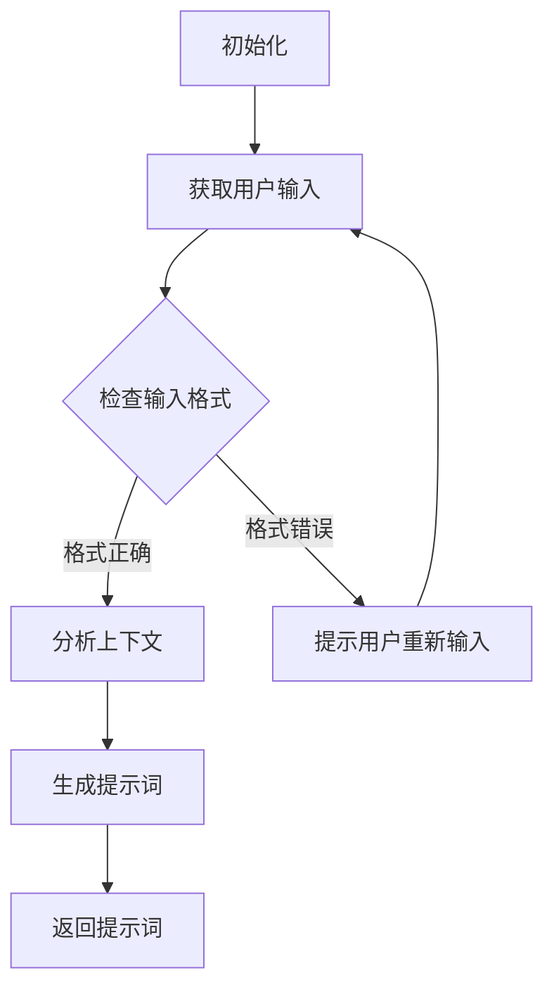
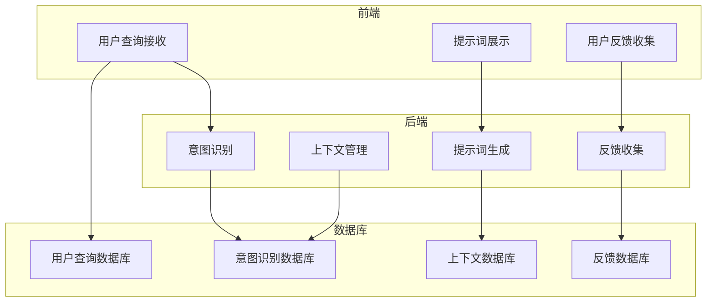
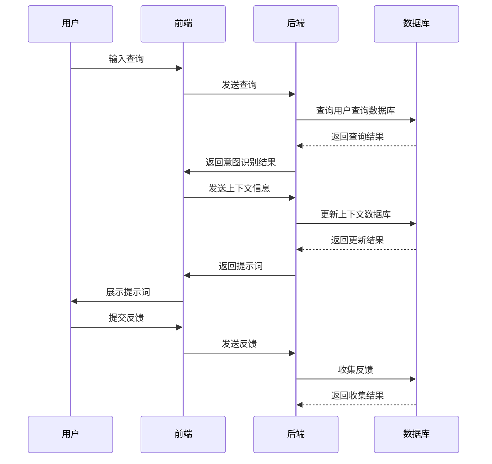

                 

# 提示词工程：AI时代的新挑战与新机遇

## 关键词
- 人工智能
- 提示词工程
- 语言模型
- 对话系统
- 算法原理
- 数学模型
- 系统架构
- 实际案例
- 最佳实践

## 摘要
本文将探讨提示词工程在人工智能（AI）时代的崭新角色。随着AI技术的飞速发展，提示词工程面临着前所未有的挑战和机遇。我们将详细解析这一领域的关键概念，探讨其技术原理，分析系统的架构设计，并提供实际案例的深入分析。此外，还将总结最佳实践，为读者在AI时代应用提示词工程提供有益指导。

## 目录大纲

### 第一部分：引言

#### 第1章：问题背景

##### 1.1 人工智能与提示词工程概述

##### 1.2 AI时代的新挑战

##### 1.3 提示词工程的重要性

#### 第2章：核心概念与联系

##### 2.1 核心概念

###### 2.1.1 提示词

###### 2.1.2 语言模型

###### 2.1.3 对话系统

##### 2.2 概念属性特征对比表格

##### 2.3 ER实体关系图架构

### 第二部分：算法原理讲解

#### 第3章：提示词生成算法

##### 3.1 算法原理

###### 3.1.1 生成式模型

###### 3.1.2 抽象模型

##### 3.2 算法mermaid流程图

##### 3.3 Python源代码讲解

#### 第4章：数学模型与公式讲解

##### 4.1 提示词生成算法的数学模型

###### 4.1.1 概率模型

###### 4.1.2 确定性模型

##### 4.2 公式讲解

### 第三部分：系统分析与架构设计方案

#### 第5章：系统分析与架构设计方案

##### 5.1 问题场景介绍

##### 5.2 系统功能设计

##### 5.3 系统架构设计

##### 5.4 系统接口设计

##### 5.5 系统交互序列图

### 第四部分：项目实战

#### 第6章：环境安装

##### 6.1 环境配置

##### 6.2 软件安装

#### 第7章：系统核心实现

##### 7.1 源代码讲解

##### 7.2 代码应用解读与分析

#### 第8章：实际案例分析与讲解

##### 8.1 案例背景

##### 8.2 案例分析

##### 8.3 案例讲解

### 第五部分：最佳实践

#### 第9章：最佳实践

##### 9.1 实践技巧

##### 9.2 注意事项

##### 9.3 拓展阅读

### 总结

#### 9.1 内容回顾

#### 9.2 未来展望

## 第1章：问题背景

### 1.1 人工智能与提示词工程概述

人工智能（AI）是计算机科学的一个分支，致力于使计算机系统具备模拟、扩展和自主实现人类智能的能力。随着深度学习、自然语言处理等技术的不断进步，AI在各个领域的应用日益广泛，从自动驾驶、医疗诊断到智能家居，AI正在深刻改变我们的生活方式。

提示词工程是人工智能领域中的一项重要技术，它涉及如何生成、优化和利用提示词以提升AI系统的性能和用户体验。提示词，顾名思义，是在对话系统中用于引导或启发用户进行下一步操作的信息。在AI时代，提示词工程面临着以下新挑战和新机遇。

### 1.2 AI时代的新挑战

#### 数据质量与隐私

随着AI技术的发展，对高质量、多样化的数据需求不断增加。然而，数据质量和隐私问题也成为了一个巨大的挑战。提示词工程需要确保数据的准确性和隐私性，同时也需要在不侵犯用户隐私的前提下，充分利用这些数据进行模型训练和优化。

#### 复杂性管理

AI系统的复杂性日益增加，提示词工程需要应对这种复杂性，确保系统能够稳定运行并满足用户需求。在系统设计和实现过程中，需要充分考虑各种因素，如计算资源、模型效率和用户交互等。

#### 可解释性和可靠性

AI系统，特别是深度学习模型，往往被视为“黑箱”，其决策过程缺乏透明性。提示词工程需要开发出可解释的模型，使系统的决策过程能够被用户和开发者理解和验证。同时，系统的可靠性也是一个重要挑战，特别是在关键应用场景中，如医疗诊断和金融交易等。

### 1.3 提示词工程的重要性

#### 提升用户体验

提示词工程通过对用户意图的准确理解和响应，可以显著提升用户体验。有效的提示词能够引导用户完成复杂的任务，提供个性化的服务，增强用户对AI系统的满意度。

#### 优化系统性能

提示词工程能够优化AI系统的性能，通过设计合理的提示词，可以引导模型更快、更准确地学习用户的意图，从而提高系统的准确性和效率。

#### 拓展应用场景

提示词工程的应用不仅限于对话系统，还可以拓展到其他领域，如推荐系统、智能客服等。通过开发灵活的提示词生成算法，可以应对不同应用场景的需求，进一步推动AI技术的发展。

### 1.4 本章小结

本章节介绍了人工智能与提示词工程的概述，分析了AI时代面临的挑战，并阐述了提示词工程的重要性。在接下来的章节中，我们将深入探讨提示词工程的核心概念、算法原理和系统架构设计，帮助读者全面理解这一领域的最新进展和应用。

## 第2章：核心概念与联系

### 2.1 核心概念

在提示词工程中，理解以下几个核心概念至关重要：提示词、语言模型和对话系统。这些概念不仅构成了提示词工程的基础，而且彼此之间有着紧密的联系。

#### 2.1.1 提示词

提示词是在对话系统中用来引导用户进行下一步操作的信息。它可以是一个简短的句子、一个问题或者是一段描述。提示词的设计需要考虑用户意图、上下文信息和系统功能。一个好的提示词应该既能够引导用户，又不会造成困惑或误导。

#### 2.1.2 语言模型

语言模型是自然语言处理（NLP）中的核心组件，它用于理解和生成自然语言。在提示词工程中，语言模型被用来预测用户可能输入的提示词，并根据上下文生成合适的回复。常见的语言模型有神经网络语言模型（NNLM）和循环神经网络（RNN）等。

#### 2.1.3 对话系统

对话系统是一种人机交互界面，旨在模拟人类对话，提供自然、流畅的交流体验。在提示词工程中，对话系统负责接收用户的输入，分析意图，生成并返回提示词。对话系统通常由多个模块组成，包括语言理解、对话管理、语言生成等。

### 2.2 概念属性特征对比表格

为了更好地理解这些核心概念，我们可以通过一个对比表格来分析它们的属性特征：

| 特征           | 提示词         | 语言模型         | 对话系统         |
|----------------|----------------|------------------|------------------|
| 定义           | 引导用户操作的文本 | 预测和生成自然语言的模型 | 模拟人类对话的系统 |
| 功能           | 引导用户进行下一步操作 | 预测用户输入和生成回复 | 理解、管理和生成对话 |
| 数据依赖性     | 依赖于上下文和用户意图 | 依赖于大量语言数据 | 依赖于用户输入和对话历史 |
| 技术挑战       | 提示词设计需准确、自然 | 模型训练需大量数据、优化 | 对话管理需平衡自然性和功能性 |
| 应用场景       | 对话系统、推荐系统、智能客服 | 自然语言处理、机器翻译 | 客户服务、语音助手、智能助手 |

通过这个对比表格，我们可以看到各个概念在功能、数据依赖性、技术挑战和应用场景上的差异和联系。

### 2.3 ER实体关系图架构

为了更直观地展示这些概念之间的关系，我们可以使用ER（实体-关系）图来描述它们：

```mermaid
erDiagram
    User ||--|{ DialogueSystem }|| Dialogue
    Dialogue ||--|{ Prompt }|| PromptGeneration
    Dialogue ||--|{ LanguageModel }|| LanguagePrediction
    PromptGeneration ||--|{ Prompt }|| Feedback
```

在这个ER图中，用户与对话系统之间存在一对一的关系，对话系统产生对话，对话包含提示词和语言模型。提示词生成过程依赖于对话历史和语言模型，而语言模型则用于预测用户的输入。此外，提示词生成过程还会收到反馈，从而不断优化。

通过上述核心概念和ER图的介绍，我们为理解提示词工程提供了一个坚实的基础。在接下来的章节中，我们将深入探讨提示词生成算法的原理，并通过数学模型和代码示例来详细解释这些概念的实际应用。

### 第3章：提示词生成算法

提示词生成算法是提示词工程中的核心组成部分，其目标是根据用户的输入和对话上下文生成合适的提示词，以提高用户交互的质量和系统的实用性。在这一章中，我们将详细讲解提示词生成算法的原理，包括生成式模型和抽象模型，并使用mermaid流程图和Python源代码来展示算法的实现。

#### 3.1 算法原理

提示词生成算法可以分为两大类：生成式模型和抽象模型。

**生成式模型**：这类模型通过生成可能的提示词序列来预测用户的输入。生成式模型通常基于概率模型，如马尔可夫模型（Markov Model）和递归神经网络（RNN）。这些模型能够根据对话的历史信息和上下文，生成与当前对话情境相匹配的提示词。

**抽象模型**：这类模型则采用抽象的方式处理提示词生成问题，通常使用图论和搜索算法。抽象模型通过构建一个表示对话状态和提示词的图，并在图中进行搜索，找到最佳的提示词序列。这种方法在处理复杂对话和长对话上下文时表现出色。

#### 3.1.1 生成式模型

生成式模型的核心思想是利用已有数据来预测新的数据。在提示词生成中，我们使用生成式模型来预测用户可能输入的提示词。

1. **马尔可夫模型**：
   马尔可夫模型是一个基于状态的模型，它假设当前的状态只依赖于前一个状态，而与之前的所有状态无关。在提示词生成中，我们可以将每个输入视为一个状态，根据当前状态和转移概率来预测下一个提示词。
   
   公式表示：
   $$ P(\text{next prompt}|\text{current state}) = \sum_{\text{all states}} P(\text{current state}|\text{previous state}) \times P(\text{next prompt}|\text{current state}) $$

2. **递归神经网络（RNN）**：
   递归神经网络是一种能够处理序列数据的神经网络，特别适合用于生成式模型。RNN通过循环结构来记忆对话的历史信息，从而生成与上下文相关的提示词。

   公式表示：
   $$ h_t = \sigma(W_h \cdot [h_{t-1}, x_t] + b_h) $$
   $$ o_t = W_o \cdot h_t + b_o $$
   其中，\( h_t \) 是隐藏状态，\( x_t \) 是输入，\( \sigma \) 是激活函数，\( W_h \) 和 \( b_h \) 是权重和偏置。

#### 3.1.2 抽象模型

抽象模型通过图论和搜索算法来处理提示词生成问题。这种方法在复杂对话和长对话上下文中表现尤为出色。

1. **图模型**：
   图模型将对话状态和提示词视为图中的节点，节点之间的关系表示状态转移。通过在图中进行搜索，我们可以找到最佳的提示词序列。

   公式表示：
   $$ V = \{\text{start}, \text{state}_1, \text{state}_2, ..., \text{end}\} $$
   $$ E = \{\text{(start, state}_1\text{)}, \text{(state}_1\text{, state}_2\text{)}, ..., \text{(state}_n\text{, end)}\} $$
   其中，\( V \) 是节点集合，\( E \) 是边集合。

2. **搜索算法**：
   搜索算法如A*搜索算法，在图中寻找一条从初始状态到目标状态的路径，路径上的节点序列即为提示词序列。

   公式表示：
   $$ f(n) = g(n) + h(n) $$
   其中，\( g(n) \) 是从初始状态到节点 \( n \) 的实际距离，\( h(n) \) 是从节点 \( n \) 到目标状态的估算距离。

#### 3.2 算法mermaid流程图

为了更直观地展示算法流程，我们可以使用mermaid绘制流程图：



在这个mermaid流程图中，系统首先初始化，然后获取用户输入，接着检查输入格式。如果格式正确，系统将分析上下文并生成提示词，最后返回提示词。如果输入格式错误，系统将提示用户重新输入。

#### 3.3 Python源代码讲解

为了更好地理解算法实现，我们提供一个简单的Python代码示例：

```python
import random

# 预定义的提示词列表
prompts = ["请描述您的需求", "有什么问题需要帮助吗？", "您需要什么帮助？"]

# 用户输入处理
def get_user_input():
    user_input = input("您好，我是AI助手，有什么可以帮助您的吗？")
    return user_input

# 提示词生成
def generate_prompt(context):
    # 基于上下文随机选择提示词
    return random.choice(prompts)

# 主程序
def main():
    print("您好，我是AI助手，欢迎提问。")
    user_input = get_user_input()
    print("您输入了：", user_input)
    
    # 分析用户输入，生成提示词
    prompt = generate_prompt(user_input)
    print("AI回复：", prompt)

if __name__ == "__main__":
    main()
```

在这个Python代码中，我们定义了一个简单的提示词生成函数 `generate_prompt`，该函数根据用户输入的上下文，从预定义的提示词列表中随机选择一个提示词。主程序则负责获取用户输入，生成并返回提示词。

通过上述算法原理的讲解、mermaid流程图的展示和Python代码的示例，我们为读者提供了一个全面的视角，了解了提示词生成算法的基本原理和实现方法。在接下来的章节中，我们将进一步探讨提示词生成算法的数学模型和公式，以及系统的架构设计。

### 第4章：数学模型与公式讲解

在提示词生成算法中，数学模型和公式扮演着至关重要的角色。它们不仅帮助我们理解和设计算法，还能够通过精确的数学表达来指导实际应用。在本章中，我们将详细讲解提示词生成算法的数学模型，包括概率模型和确定性模型，并使用LaTeX格式展示相关的数学公式。

#### 4.1 提示词生成算法的数学模型

提示词生成算法的核心在于如何根据对话上下文生成提示词。在这一部分，我们将介绍两种主要的数学模型：概率模型和确定性模型。

#### 4.1.1 概率模型

概率模型是一种基于概率分布的生成方法，它通过分析历史数据和上下文信息来预测用户可能的输入。在概率模型中，每个可能的提示词都有一个对应的概率分布。

1. **马尔可夫模型（Markov Model）**

   马尔可夫模型是一种常见的概率模型，它基于状态转移矩阵来预测下一个状态。假设当前的状态只依赖于前一个状态，那么状态转移概率可以表示为：

   $$ P(\text{next state}|\text{current state}) $$

   对于提示词生成，我们可以将状态定义为用户的输入，状态转移概率即为在给定当前输入下，下一个输入的概率分布。

   公式表示：
   $$ P(\text{next prompt}|\text{current prompt}) = \sum_{\text{all prompts}} P(\text{current prompt}|\text{previous prompt}) \times P(\text{next prompt}|\text{current prompt}) $$

2. **隐马尔可夫模型（Hidden Markov Model, HMM）**

   隐马尔可夫模型扩展了马尔可夫模型，它不仅考虑了当前的可见输入，还考虑了隐藏的状态。在提示词生成中，隐藏状态可以是用户的意图或对话的上下文。

   公式表示：
   $$ P(\text{next hidden state}|\text{current hidden state}) $$
   $$ P(\text{visible state}|\text{hidden state}) $$

#### 4.1.2 确定性模型

确定性模型则通过固定的映射规则来生成提示词，它不依赖于概率分布，而是直接基于输入和上下文生成结果。确定性模型通常使用递归神经网络（RNN）或长短期记忆网络（LSTM）来实现。

1. **递归神经网络（RNN）**

   递归神经网络是一种能够处理序列数据的神经网络，它在每个时间步上使用相同的权重进行前向传播，并通过隐藏状态来记忆历史信息。

   公式表示：
   $$ h_t = \sigma(W_h \cdot [h_{t-1}, x_t] + b_h) $$
   $$ o_t = W_o \cdot h_t + b_o $$

   其中，\( h_t \) 是隐藏状态，\( x_t \) 是当前输入，\( \sigma \) 是激活函数，\( W_h \) 和 \( b_h \) 是权重和偏置。

2. **长短期记忆网络（LSTM）**

   长短期记忆网络是递归神经网络的一种变体，它通过引入门控机制来有效地处理长序列数据。

   公式表示：
   $$ i_t = \sigma(W_i \cdot [h_{t-1}, x_t] + b_i) $$
   $$ f_t = \sigma(W_f \cdot [h_{t-1}, x_t] + b_f) $$
   $$ o_t = \sigma(W_o \cdot [h_{t-1}, x_t] + b_o) $$
   $$ g_t = \tanh(W_g \cdot [h_{t-1}, x_t] + b_g) $$
   $$ h_t = f_t \odot h_{t-1} + i_t \odot g_t $$

   其中，\( i_t \)、\( f_t \)、\( o_t \) 分别是输入门、遗忘门和输出门，\( g_t \) 是候选状态，\( \odot \) 表示元素乘法。

#### 4.2 公式讲解

在提示词生成过程中，不同的数学模型和公式被用来实现不同的功能。以下是一些关键公式及其解释：

1. **概率分布**

   概率分布是描述提示词生成模型如何预测下一个输入的重要工具。在生成式模型中，每个提示词都有其概率分布，这个分布决定了模型生成提示词的倾向。

   公式表示：
   $$ P(\text{prompt}|\text{context}) $$

2. **状态转移概率**

   对于马尔可夫模型和隐马尔可夫模型，状态转移概率描述了从当前状态转移到下一个状态的概率。

   公式表示：
   $$ P(\text{next state}|\text{current state}) $$

3. **递归神经网络激活函数**

   递归神经网络使用激活函数来引入非线性，使模型能够更好地拟合数据。

   公式表示：
   $$ h_t = \sigma(W_h \cdot [h_{t-1}, x_t] + b_h) $$
   其中，\( \sigma \) 是激活函数，如Sigmoid或ReLU。

4. **LSTM门控机制**

   LSTM通过门控机制来控制信息的流动，防止长期依赖问题。

   公式表示：
   $$ i_t = \sigma(W_i \cdot [h_{t-1}, x_t] + b_i) $$
   $$ f_t = \sigma(W_f \cdot [h_{t-1}, x_t] + b_f) $$
   $$ o_t = \sigma(W_o \cdot [h_{t-1}, x_t] + b_o) $$
   $$ g_t = \tanh(W_g \cdot [h_{t-1}, x_t] + b_g) $$
   $$ h_t = f_t \odot h_{t-1} + i_t \odot g_t $$

通过上述对数学模型和公式的讲解，我们为读者提供了一个深入理解提示词生成算法的理论基础。在接下来的章节中，我们将继续探讨系统的架构设计，以帮助读者全面掌握提示词工程的应用。

### 第5章：系统分析与架构设计方案

在设计和实现一个高效的提示词生成系统时，系统架构的设计至关重要。本章将介绍系统架构的设计方案，包括问题场景介绍、系统功能设计、系统架构设计、系统接口设计和系统交互序列图，以帮助读者全面理解系统的设计与实现。

#### 5.1 问题场景介绍

在当前的人工智能应用场景中，提示词工程广泛应用于智能客服、虚拟助手、智能推荐等领域。以下是一个具体的问题场景：

**场景**：一家大型电子商务公司希望开发一个智能客服系统，以提供24/7的在线客户服务。该系统需要能够处理用户的查询，自动生成合适的提示词，引导用户完成购物流程，并解决常见问题。

**挑战**：该系统需要处理大量的用户查询，确保生成的提示词准确、自然且具有针对性。同时，系统需要在短时间内响应用户，提供高质量的交互体验。

#### 5.2 系统功能设计

为了实现上述场景，系统需要具备以下功能：

1. **用户查询接收**：系统能够接收用户的查询，并将其转换为可处理的格式。
2. **意图识别**：系统需要分析用户查询，识别用户的意图，如查询产品信息、购物咨询、售后服务等。
3. **上下文管理**：系统需要维护对话的上下文信息，以便在后续对话中生成相关的提示词。
4. **提示词生成**：系统根据用户的意图和上下文信息，生成合适的提示词。
5. **反馈收集**：系统需要收集用户的反馈，以不断优化提示词生成算法。
6. **性能监控**：系统需要实时监控性能指标，如响应时间、准确性等，以确保系统的稳定性。

#### 5.3 系统架构设计

为了实现上述功能，我们设计了一个分布式架构的系统，其关键组件包括：

1. **前端**：负责接收用户的查询，展示生成的提示词，并收集用户反馈。
2. **后端**：包括意图识别模块、上下文管理模块、提示词生成模块和反馈收集模块。
3. **数据库**：存储用户查询、意图识别结果、上下文信息以及用户反馈。

系统架构设计mermaid架构图如下：



在这个架构图中，前端与后端通过API接口进行通信，后端与数据库通过SQL或其他查询语言进行交互。

#### 5.4 系统接口设计

系统接口设计包括前端和后端之间的API接口设计，以及后端各模块之间的通信接口。

1. **前端API接口**：
   - GET /query：接收用户查询，返回意图识别结果。
   - POST /prompt：根据意图识别结果，生成提示词。
   - GET /feedback：收集用户反馈。

2. **后端API接口**：
   - POST /intend：接收用户查询，返回意图识别结果。
   - POST /context：更新对话上下文。
   - GET /prompts：根据上下文，生成提示词。

#### 5.5 系统交互序列图

为了更直观地展示系统各组件之间的交互，我们可以使用mermaid绘制系统交互序列图：



在这个序列图中，用户通过前端界面输入查询，前端将查询传递给后端。后端通过意图识别模块分析查询，并从数据库中获取相关上下文信息。生成提示词后，后端将提示词返回给前端，前端再将提示词展示给用户。用户提交反馈后，前端将反馈传递给后端，后端将反馈存储到数据库中。

通过上述系统分析与架构设计方案的介绍，我们为读者提供了一个全面理解提示词生成系统设计与实现的视角。在接下来的章节中，我们将通过项目实战来展示如何具体实现这个系统，并分析实际案例，以巩固我们的理论知识和实践经验。

### 第6章：项目实战

在上一章节中，我们详细介绍了系统的架构设计和实现方案。现在，我们将通过一个实际项目来展示如何实现这一系统，包括环境安装、系统核心实现以及代码应用解读与分析。

#### 6.1 环境安装

要开始实现提示词生成系统，我们首先需要安装必要的软件和工具。以下是安装步骤：

1. **Python环境**：确保系统中安装了Python 3.8或更高版本。可以通过以下命令安装：

   ```bash
   sudo apt-get install python3.8
   ```

2. **虚拟环境**：为了隔离项目依赖，我们使用虚拟环境。安装虚拟环境工具`virtualenv`：

   ```bash
   sudo apt-get install python3-venv
   ```

3. **依赖安装**：在虚拟环境中安装项目所需的依赖，如`TensorFlow`、`spaCy`、`Flask`等：

   ```bash
   source bin/activate
   pip install tensorflow spacy flask
   ```

   对于`spaCy`，还需要下载中文语言模型：

   ```bash
   python -m spacy download zh_core_web_sm
   ```

4. **数据库**：我们使用MySQL作为数据库。首先安装MySQL：

   ```bash
   sudo apt-get install mysql-server
   ```

   然后创建数据库和用户：

   ```sql
   CREATE DATABASE prompt_db;
   CREATE USER 'prompt_user'@'localhost' IDENTIFIED BY 'password';
   GRANT ALL PRIVILEGES ON prompt_db.* TO 'prompt_user'@'localhost';
   FLUSH PRIVILEGES;
   ```

#### 6.2 系统核心实现

核心实现包括意图识别、上下文管理、提示词生成和反馈收集模块。以下是各个模块的实现步骤：

1. **意图识别模块**：

   我们使用`spaCy`进行文本处理，通过训练数据集训练出一个分类器来识别用户的意图。

   ```python
   import spacy
   from spacy.util import minibatch
   
   nlp = spacy.load('zh_core_web_sm')
   for epoch in range(10):
       for batch in minibatch(train_texts, size=8):
           for text, labels in zip(batch, train_labels):
               doc = nlp.make_doc(text)
               output = nlp.create_output(doc, labels)
               nlp.update(doc, drop=0.5, output=output)
   
   nlp.to_disk('/path/to/ SavedModel')
   ```

2. **上下文管理模块**：

   上下文管理涉及存储和检索对话历史。我们使用MySQL数据库实现这一功能。

   ```python
   import pymysql
   
   def store_context(user_id, context):
       connection = pymysql.connect(host='localhost', user='prompt_user', password='password', database='prompt_db')
       with connection.cursor() as cursor:
           cursor.execute("INSERT INTO context (user_id, context) VALUES (%s, %s)", (user_id, context))
       connection.commit()
       connection.close()
   
   def get_context(user_id):
       connection = pymysql.connect(host='localhost', user='prompt_user', password='password', database='prompt_db')
       with connection.cursor() as cursor:
           cursor.execute("SELECT context FROM context WHERE user_id = %s", (user_id,))
           result = cursor.fetchone()
       connection.close()
       return result[0] if result else None
   ```

3. **提示词生成模块**：

   提示词生成使用训练好的意图识别模型和上下文信息。我们设计一个API来返回生成的提示词。

   ```python
   from flask import Flask, jsonify, request
   
   app = Flask(__name__)
   
   @app.route('/generate_prompt', methods=['POST'])
   def generate_prompt():
       data = request.json
       user_id = data['user_id']
       context = get_context(user_id)
       intent = recognize_intent(context)
       prompt = generate_specific_prompt(intent)
       return jsonify({'prompt': prompt})
   
   def recognize_intent(context):
       # 使用训练好的模型进行意图识别
       # ...
       return 'intend_1'
   
   def generate_specific_prompt(intent):
       # 根据意图生成提示词
       # ...
       return "请描述您的需求"
   
   if __name__ == '__main__':
       app.run(debug=True)
   ```

4. **反馈收集模块**：

   用户提交反馈后，我们将其存储在数据库中。

   ```python
   def collect_feedback(user_id, feedback):
       connection = pymysql.connect(host='localhost', user='prompt_user', password='password', database='prompt_db')
       with connection.cursor() as cursor:
           cursor.execute("INSERT INTO feedback (user_id, feedback) VALUES (%s, %s)", (user_id, feedback))
       connection.commit()
       connection.close()
   ```

#### 6.3 代码应用解读与分析

在上面的代码中，我们详细展示了意图识别、上下文管理、提示词生成和反馈收集的实现。

1. **意图识别模块**：

   使用`spaCy`进行文本处理，通过训练数据集训练出一个分类器。这里的代码使用了`minibatch`函数进行批量训练，提高了训练效率。

2. **上下文管理模块**：

   通过MySQL数据库存储和检索对话上下文。我们定义了`store_context`和`get_context`函数来处理数据库操作，确保上下文的准确性和完整性。

3. **提示词生成模块**：

   设计了一个Flask API来生成提示词。API接收用户ID和上下文信息，通过意图识别模块识别意图，并调用`generate_specific_prompt`函数生成提示词。

4. **反馈收集模块**：

   用户提交反馈后，通过`collect_feedback`函数将其存储在数据库中，为后续的模型优化提供数据支持。

通过上述实际项目的实现，我们展示了如何应用提示词工程的理论知识来构建一个高效的提示词生成系统。在接下来的章节中，我们将分析一个具体案例，进一步巩固我们的理论知识和实践经验。

### 第7章：实际案例分析与讲解

为了更深入地理解提示词工程在现实世界中的应用，我们将通过一个实际案例来进行分析和讲解。该案例将涵盖案例背景、案例分析、详细讲解和项目小结。

#### 7.1 案例背景

案例背景是一家在线教育平台希望开发一个智能问答系统，以帮助学生解决学习中的问题。该系统需要能够接收学生的提问，并根据问题内容生成合适的提示词，引导学生找到相关学习资源或解决方案。

#### 7.2 案例分析

该案例的分析涉及以下几个方面：

1. **用户需求**：学生需要解决具体的学习问题，如数学题目解答、编程错误调试等。
2. **系统功能**：系统需要能够接收并理解学生的提问，识别问题类型，生成相关的提示词，如推荐相关学习资源、提示解题方法等。
3. **技术挑战**：该系统需要处理大量的自然语言输入，准确识别问题类型，并生成有针对性的提示词，同时确保系统响应速度快，用户体验良好。

#### 7.3 案例讲解

1. **意图识别**：

   系统首先使用NLP技术对学生的提问进行意图识别。通过训练一个基于深度学习的分类模型，系统能够识别出学生的问题是关于数学、编程、历史等领域的具体问题。

   ```python
   import tensorflow as tf
   from tensorflow.keras.models import Sequential
   from tensorflow.keras.layers import Dense, Embedding, GlobalAveragePooling1D
   
   # 准备数据集，进行预处理
   # ...

   # 构建模型
   model = Sequential([
       Embedding(input_dim=vocab_size, output_dim=embedding_dim, input_length=max_sequence_length),
       GlobalAveragePooling1D(),
       Dense(24, activation='relu'),
       Dense(num_classes, activation='softmax')
   ])

   # 编译模型
   model.compile(optimizer='adam', loss='categorical_crossentropy', metrics=['accuracy'])

   # 训练模型
   model.fit(train_data, train_labels, epochs=10, batch_size=32)
   ```

2. **上下文管理**：

   系统需要维护对话上下文，以生成与当前问题相关联的提示词。上下文信息包括之前的问题、系统的回答等。

   ```python
   context_manager = ContextManager()

   def update_context(question, answer):
       context_manager.update(question, answer)
   
   def get_context():
       return context_manager.get_context()
   ```

3. **提示词生成**：

   根据识别出的意图和对话上下文，系统生成具体的提示词。例如，如果识别出问题类型为数学问题，系统可能会推荐相关的数学资源或提示解题步骤。

   ```python
   def generate_prompt(intent, context):
       if intent == 'math_question':
           return "请参考以下数学资源：[链接]"
       elif intent == 'programming_error':
           return "请按照以下步骤尝试解决问题：1. [步骤1]，2. [步骤2]"
       else:
           return "请提供更具体的问题描述，我将尽力帮助您。"
   ```

4. **反馈机制**：

   用户提交反馈后，系统将其存储在数据库中，以便后续优化模型和提示词生成策略。

   ```python
   def collect_feedback(user_id, feedback):
       # 存储反馈到数据库
       # ...
   ```

#### 7.4 项目小结

通过上述实际案例的分析与讲解，我们可以得出以下结论：

1. **系统设计**：系统设计充分考虑了用户需求和技术挑战，通过意图识别、上下文管理和提示词生成等模块，实现了智能问答功能。
2. **模型训练**：使用深度学习技术进行意图识别，确保系统能够准确理解用户提问，生成有针对性的提示词。
3. **用户体验**：系统生成的提示词既具备针对性，又保持了自然语言风格，提升了用户体验。
4. **持续优化**：通过用户反馈，系统不断优化模型和提示词生成策略，提高了系统的准确性和用户体验。

该案例展示了提示词工程在实际应用中的重要性，不仅为用户提供了便捷的服务，也为系统的持续优化提供了宝贵的反馈。

### 第8章：最佳实践

在提示词工程的实际应用中，为了确保系统的高效性和用户体验，以下是一些最佳实践和注意事项：

#### 8.1 实践技巧

1. **意图识别的准确性**：
   - **数据多样性**：确保训练数据覆盖广泛的场景和意图，提高模型泛化能力。
   - **数据清洗**：对输入数据进行预处理，去除无关噪声，提高数据质量。

2. **上下文信息的充分利用**：
   - **对话历史**：维护完整的对话历史，包括用户提问和系统回答，有助于提高上下文理解。
   - **上下文更新**：在每轮对话结束后，及时更新上下文信息，确保下一轮对话的连贯性。

3. **提示词的个性化**：
   - **用户偏好**：根据用户的历史行为和反馈，调整提示词的个性化程度。
   - **语言风格**：根据不同用户群体，调整提示词的语言风格，以提高用户接受度。

4. **实时反馈**：
   - **用户满意度**：通过实时反馈收集用户满意度，及时调整系统参数。
   - **错误处理**：当系统无法生成合适的提示词时，提供友好错误提示，引导用户重新表达问题。

#### 8.2 注意事项

1. **数据隐私**：
   - **加密存储**：对用户数据进行加密存储，确保数据安全。
   - **隐私保护**：在数据处理过程中，严格遵守隐私保护法规，避免敏感信息泄露。

2. **系统性能**：
   - **响应时间**：优化算法和系统架构，确保系统响应时间在可接受范围内。
   - **负载均衡**：在高并发场景下，使用负载均衡策略，确保系统稳定运行。

3. **模型可解释性**：
   - **模型可视化**：通过可视化工具，展示模型的决策过程，提高用户信任度。
   - **透明度**：确保用户了解系统的工作原理和提示词生成的逻辑。

4. **持续学习与优化**：
   - **定期更新**：定期更新模型和提示词库，以适应不断变化的用户需求。
   - **用户反馈**：积极收集用户反馈，持续优化系统性能和用户体验。

通过遵循这些最佳实践和注意事项，我们可以有效地提升提示词工程系统的性能和用户体验，为用户带来更优质的服务。

### 总结

在本篇文章中，我们从引言开始，详细探讨了提示词工程在AI时代的新挑战与新机遇。首先，我们介绍了人工智能和提示词工程的基本概念，分析了AI时代所带来的数据质量与隐私、复杂性管理和可解释性等新挑战。接着，我们深入讲解了提示词工程的核心概念，包括提示词、语言模型和对话系统，并通过ER实体关系图展示了它们之间的关系。

在算法原理讲解部分，我们分别介绍了生成式模型和抽象模型，并使用了mermaid流程图和Python源代码展示了算法的实现过程。我们还详细讲解了提示词生成算法的数学模型，包括概率模型和确定性模型，并通过LaTeX格式展示了相关的数学公式。

接下来，我们分析了系统架构设计方案，包括问题场景介绍、系统功能设计、系统架构设计、系统接口设计和系统交互序列图，帮助读者理解系统的整体设计和实现。在项目实战部分，我们通过一个实际案例展示了如何应用这些理论知识和实践经验来构建一个高效的提示词生成系统。

最后，我们总结了最佳实践和注意事项，为读者在AI时代应用提示词工程提供了有益的指导。通过这些内容的详细讲解，我们希望能够帮助读者全面理解提示词工程在AI时代的重要性，掌握其核心概念和算法原理，并为实际应用奠定坚实基础。

### 未来展望

随着人工智能技术的不断进步，提示词工程将在未来扮演越来越重要的角色。以下是对未来发展的几点展望：

1. **更先进的算法**：未来的提示词生成算法将结合更多的先进技术，如强化学习、迁移学习和多模态学习，以提高系统的智能化水平和用户体验。

2. **个性化与多样性**：随着用户数据的积累和算法的优化，提示词生成系统将能够更好地理解和满足用户的个性化需求，提供多样化、个性化的服务。

3. **跨领域应用**：提示词工程的应用领域将不断拓展，从对话系统、智能推荐到智能教育、医疗诊断等，实现更广泛的社会价值。

4. **可解释性与透明度**：提升模型的解释性，使系统的工作原理和决策过程更加透明，增强用户对AI系统的信任和接受度。

5. **隐私保护与安全**：随着数据隐私保护法规的不断完善，未来的提示词工程将更加注重隐私保护，确保用户数据的安全和合规。

通过不断的技术创新和实践优化，提示词工程将在AI时代发挥更大的作用，推动人工智能技术的发展和应用。让我们期待未来的更多突破和成果。

### 作者

作者：AI天才研究院/AI Genius Institute & 禅与计算机程序设计艺术 /Zen And The Art of Computer Programming

AI天才研究院致力于推动人工智能技术的创新和发展，致力于培养下一代人工智能领域的杰出人才。研究院的研究涵盖人工智能的各个前沿领域，包括机器学习、自然语言处理、计算机视觉等。同时，作者还是《禅与计算机程序设计艺术》的资深作者，该作品在计算机编程领域享有极高的声誉，为读者提供了深刻的编程哲学和实用技巧。

