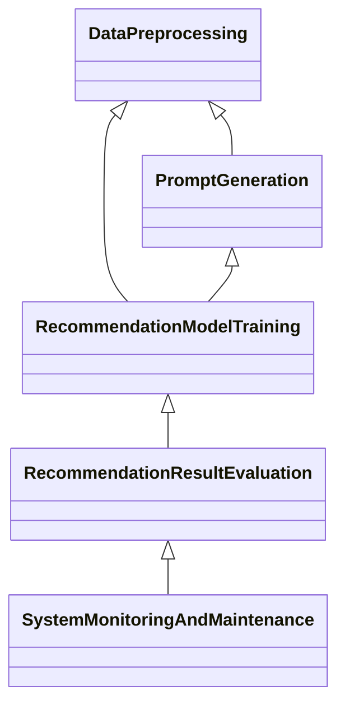
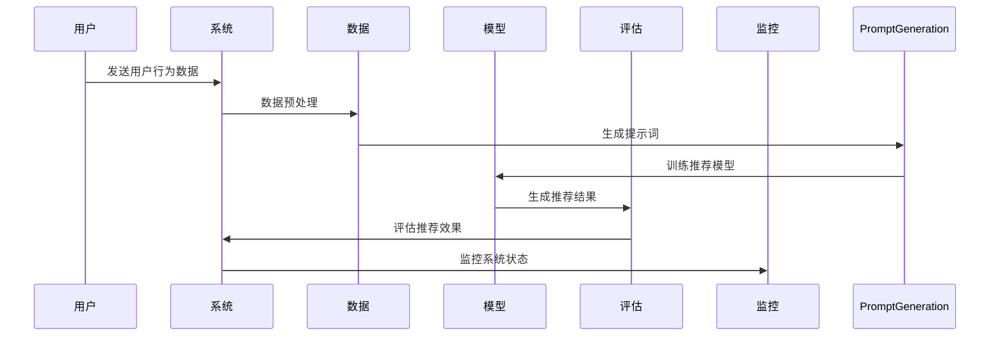
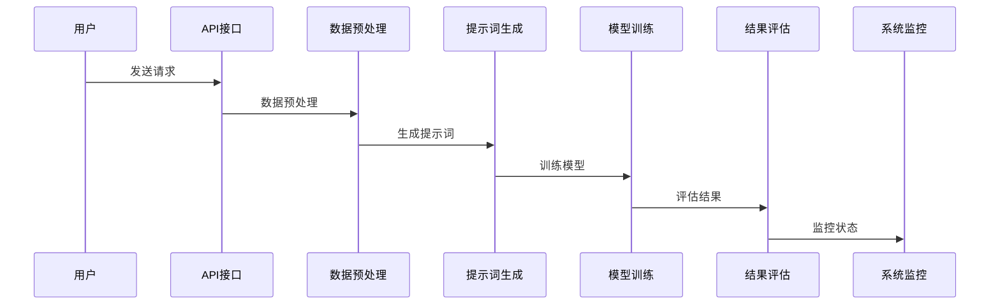

                 

### 第一部分: 背景介绍

#### 第1章: AI时代的背景与提示词工程的重要性

##### 1.1 AI技术发展概述

人工智能（AI）作为计算机科学的一个分支，自20世纪50年代诞生以来，已经经历了数十年的发展。早期的AI主要集中于规则推理和知识表示，但直到近年来，随着深度学习、大数据和计算能力的飞速提升，AI技术才迎来了真正意义上的爆发。深度学习通过神经网络模拟人脑的学习方式，使得AI在图像识别、语音识别、自然语言处理等方面取得了突破性进展。此外，AI的快速发展还受益于大数据的积累和计算资源的普及。

在AI时代，提示词工程成为了一个重要的研究领域。提示词工程不仅仅是简单地构建和优化提示词，而是涉及到如何有效地设计、生成和应用提示词，以提升AI模型的表现。提示词在AI模型中起着桥梁的作用，将人类的知识和需求传递给机器，使得机器能够更好地理解和执行任务。

##### 1.2 提示词工程的概念

提示词工程（Prompt Engineering）是指通过设计和优化提示词，来提高AI模型的性能和应用效果的一门技术。在自然语言处理（NLP）领域，提示词可以看作是输入文本的一部分，它能够引导AI模型的理解方向，从而影响模型生成的输出结果。

好的提示词应该具备以下特征：
- **明确性**：提示词应当明确表达出任务的要求和目标，避免模糊不清。
- **灵活性**：提示词应当能够适应不同的任务和场景，具有一定的泛化能力。
- **准确性**：提示词应当准确反映任务的本质，避免误导模型。

##### 1.3 提示词工程在AI中的应用场景

提示词工程在AI中的应用非常广泛，以下是一些典型的应用场景：

- **对话系统**：在聊天机器人、智能客服等应用中，提示词可以指导模型理解用户的意图，从而生成合适的回答。
- **文本生成**：在文章撰写、文案创作等任务中，提示词可以帮助模型生成符合要求的文本。
- **图像识别**：在图像分类任务中，提示词可以指导模型关注图像中的关键特征，从而提高分类的准确性。
- **预测分析**：在股票市场预测、天气预测等任务中，提示词可以帮助模型捕捉到关键的信息，从而提高预测的准确性。

##### 1.4 提示词工程的重要性

提示词工程的重要性主要体现在以下几个方面：

- **提升模型性能**：通过设计和优化提示词，可以显著提升AI模型的表现，使其更准确地理解和执行任务。
- **降低训练成本**：合理的提示词可以减少模型训练所需的样本数量和计算资源，从而降低训练成本。
- **促进模型可解释性**：提示词可以帮助研究人员和开发人员更好地理解模型的决策过程，提高模型的可解释性。
- **拓宽应用领域**：提示词工程使得AI模型能够应用于更多领域，推动AI技术的普及和发展。

总之，提示词工程是AI时代的一个重要研究方向，它不仅能够提升AI模型的性能和应用效果，还能够推动AI技术的进一步发展。在接下来的章节中，我们将深入探讨提示词工程的核心概念、算法原理、系统设计和项目实战，以帮助读者更好地理解和应用这一技术。

#### 第2章: 提示词工程的核心概念与联系

##### 2.1 核心概念介绍

提示词工程涉及的核心概念主要包括提示词、提示词设计原则和好的提示词特征。以下是这些核心概念的详细介绍：

###### 2.1.1 提示词

提示词（Prompt）是指为AI模型提供的一组信息，用于引导模型的训练和预测过程。在自然语言处理领域，提示词通常是一段文本，它可以包含关键词、短语或完整的句子。提示词的设计和选择对AI模型的表现有着重要影响。

###### 2.1.2 好的提示词特征

一个好的提示词应当具备以下特征：

- **明确性**：提示词应明确传达任务目标和要求，避免模糊不清的信息。
- **简洁性**：提示词应尽量简洁，避免冗长的描述，以便模型快速理解。
- **灵活性**：提示词应具有一定的泛化能力，能够适应不同的任务和场景。
- **准确性**：提示词应准确反映任务的本质，避免误导模型。

###### 2.1.3 提示词设计原则

提示词的设计原则包括：

- **针对性**：根据任务的需求和目标，设计有针对性的提示词。
- **一致性**：保持提示词在任务中的前后一致性，避免矛盾和冲突。
- **多样性**：设计多种不同类型的提示词，以提高模型的泛化能力。
- **可调整性**：设计可调整的提示词，以便在模型训练过程中进行优化。

##### 2.2 提示词工程与AI的关系

提示词工程与AI之间的关系主要体现在以下几个方面：

###### 2.2.1 提示词工程在模型训练中的作用

在模型训练过程中，提示词可以：

- **引导学习方向**：通过提供明确的任务目标，提示词可以引导模型关注关键信息，从而提高训练效果。
- **增强模型泛化能力**：多样化的提示词可以帮助模型学会在不同场景下进行适应性调整，提高泛化能力。
- **减少训练数据需求**：高质量的提示词可以减少模型训练所需的样本数量，降低训练成本。

###### 2.2.2 提示词工程在模型优化中的应用

在模型优化过程中，提示词可以：

- **调整模型参数**：通过修改提示词，可以调整模型参数，使其在特定任务上取得更好的表现。
- **提高模型鲁棒性**：设计鲁棒的提示词，可以提高模型对不同数据分布和噪声的适应性。
- **加速模型收敛**：高质量的提示词可以加速模型训练的收敛速度，提高训练效率。

###### 2.2.3 提示词工程与其他AI技术的联系

提示词工程与以下AI技术有着密切的联系：

- **深度学习**：提示词在深度学习模型中起着至关重要的作用，直接影响模型的性能。
- **自然语言处理**：提示词工程是自然语言处理领域的一个核心问题，与语言模型、文本生成等技术密切相关。
- **强化学习**：在强化学习任务中，提示词可以提供目标信息和奖励机制，指导模型的决策过程。

通过以上对提示词工程核心概念的介绍和与AI技术的联系分析，我们可以看到，提示词工程在AI技术的发展和应用中具有不可忽视的重要地位。在接下来的章节中，我们将深入探讨提示词工程的具体算法原理和系统设计，以帮助读者更好地理解和应用这一技术。

### 第3章: 算法原理讲解

#### 3.1 提示词生成算法

提示词生成算法是提示词工程的核心组成部分，其主要目标是设计出高质量的提示词，以提高AI模型的性能和应用效果。以下是几种常见的提示词生成算法：

##### 3.1.1 基于规则的方法

基于规则的方法是通过预设的规则来生成提示词。这种方法通常适用于任务需求明确、领域知识较为固定的情况。具体步骤如下：

1. **知识库构建**：根据任务需求和领域知识，构建一个包含各类规则的知识库。
2. **规则匹配**：对于给定的输入数据，通过规则匹配算法从知识库中提取相应的规则。
3. **提示词生成**：根据提取的规则，生成对应的提示词。

示例：

假设我们需要生成一个用于图像分类的提示词。我们可以构建一个知识库，包含如下规则：

```
如果图像中有猫，则提示词包含“猫”；
如果图像中有狗，则提示词包含“狗”；
如果图像是户外场景，则提示词包含“户外”。
```

对于一张包含猫和狗的户外图像，根据上述规则，生成的提示词可以是“猫 狗 户外”。

##### 3.1.2 基于数据的方法

基于数据的方法是通过学习大量的数据来生成提示词。这种方法通常适用于任务需求不确定、领域知识不断更新的情况。具体步骤如下：

1. **数据收集**：收集大量的标注数据，这些数据应包含与任务相关的信息。
2. **特征提取**：从标注数据中提取关键特征，如关键词、短语、句子等。
3. **模型训练**：使用机器学习算法（如朴素贝叶斯、决策树、神经网络等）训练提示词生成模型。
4. **提示词生成**：对于新的输入数据，使用训练好的模型生成相应的提示词。

示例：

假设我们需要生成一个用于文本分类的提示词生成模型。我们可以收集大量已标注的文本数据，从中提取关键词和短语，并使用朴素贝叶斯算法训练提示词生成模型。对于一篇新的文本，模型可以根据文本中的关键词和短语生成相应的提示词。

##### 3.1.3 基于机器学习的方法

基于机器学习的方法是利用机器学习算法来自动生成提示词。这种方法通常适用于需要高灵活性和自适应性的任务。具体步骤如下：

1. **数据预处理**：对输入数据（如文本、图像等）进行预处理，提取特征。
2. **模型训练**：使用监督学习或无监督学习算法训练提示词生成模型。
3. **提示词生成**：对于新的输入数据，使用训练好的模型生成相应的提示词。

示例：

假设我们需要生成一个用于语音识别的提示词生成模型。我们可以使用循环神经网络（RNN）或长短期记忆网络（LSTM）来训练模型，模型可以自动提取输入语音的特征，并根据这些特征生成提示词。

#### 3.2 提示词优化算法

提示词优化算法的主要目标是提高提示词的质量，从而提升AI模型的表现。以下是几种常见的提示词优化算法：

##### 3.2.1 提示词评估方法

提示词评估方法用于评估提示词的质量。以下是一些常见的评估方法：

- **准确率**：评估提示词生成的文本是否正确反映了任务需求。
- **覆盖率**：评估提示词生成的文本是否覆盖了任务相关的所有关键信息。
- **多样性**：评估提示词生成的文本是否具有多样性，避免单一化。

##### 3.2.2 提示词调整策略

提示词调整策略用于根据评估结果对提示词进行优化。以下是一些常见的调整策略：

- **基于规则的调整**：根据评估结果，修改提示词中的关键词或短语。
- **基于数据的调整**：使用机器学习算法，根据评估结果对提示词生成模型进行调整。
- **基于机器学习的调整**：使用强化学习算法，通过不断尝试和优化，找到最佳的提示词组合。

##### 3.2.3 提示词优化流程

提示词优化流程包括以下几个步骤：

1. **提示词生成**：使用生成算法生成初步的提示词。
2. **提示词评估**：使用评估方法对生成的提示词进行质量评估。
3. **提示词调整**：根据评估结果，对提示词进行优化调整。
4. **迭代优化**：重复提示词生成、评估和调整步骤，直到满足优化目标。

通过以上对提示词生成和优化算法的讲解，我们可以看到，提示词工程是一个复杂但关键的过程。在接下来的章节中，我们将进一步探讨如何设计高效的提示词工程系统，并在实际项目中应用这些算法。

### 第4章: 系统分析与架构设计方案

#### 4.1 问题场景介绍

在当前AI技术迅速发展的背景下，许多企业和机构开始意识到AI在业务中的应用潜力。然而，如何设计一个高效、可扩展的AI系统，以满足不断变化的需求，成为一个重要的课题。提示词工程作为AI系统中的一个关键环节，其设计和优化对系统的整体性能有着重要影响。

假设我们面临以下问题场景：

- **业务需求**：一家电商公司希望利用AI技术提升其推荐系统的效果，从而提高用户满意度和销售额。
- **数据规模**：公司每天处理数百万条用户行为数据，这些数据包括用户的浏览记录、购买历史、评论等。
- **挑战**：由于用户行为的多样性和复杂性，传统的推荐算法效果不佳，需要通过优化提示词工程来提升模型表现。

#### 4.2 系统功能设计

为了解决上述问题，我们需要设计一个功能齐全的AI系统，主要包括以下几个模块：

- **数据预处理模块**：负责清洗、转换和格式化原始数据，为模型训练提供高质量的数据输入。
- **提示词生成模块**：根据用户行为数据，生成高质量的提示词，用于引导推荐模型的学习过程。
- **推荐模型训练模块**：使用提示词和用户行为数据，训练推荐模型，以生成个性化的推荐结果。
- **推荐结果评估模块**：评估推荐系统的效果，包括准确率、覆盖率、用户满意度等指标。
- **系统监控与维护模块**：监控系统运行状态，及时发现并解决潜在问题，确保系统的稳定性和可靠性。

##### 4.2.1 领域模型

以下是系统功能设计的领域模型（使用Mermaid类图表示）：



#### 4.3 系统架构设计

为了实现上述功能，我们需要设计一个合理的系统架构，以下是系统架构设计（使用Mermaid架构图表示）：



#### 4.4 系统接口设计与交互

系统接口设计与交互是确保各个模块能够顺畅协作的关键。以下是系统接口设计（使用Mermaid序列图表示）：



通过上述系统架构和接口设计，我们可以确保系统的功能模块能够高效协作，满足业务需求。在接下来的章节中，我们将通过一个实际项目来展示如何具体实现这些功能模块，并分析系统在实际运行中的性能和效果。

### 第5章: 项目实战

#### 5.1 环境安装与配置

在进行提示词工程的项目实战之前，我们需要确保环境安装和配置正确。以下是在Python环境下进行提示词工程项目所需的基本环境安装与配置步骤：

1. **Python环境搭建**：
   - 确保安装了Python 3.6及以上版本。
   - 可以使用Python官方的安装包进行安装。

2. **安装必要的库**：
   - `numpy`：用于数学计算。
   - `pandas`：用于数据处理。
   - `scikit-learn`：用于机器学习算法。
   - `gensim`：用于自然语言处理。
   - `tensorflow` 或 `pytorch`：用于深度学习模型。

   安装命令如下：

   ```shell
   pip install numpy pandas scikit-learn gensim tensorflow pytorch
   ```

3. **数据集准备**：
   - 准备用于训练的数据集，可以是结构化的表格数据，也可以是文本文件。
   - 数据集应包括用户行为数据和相应的标签或目标。

4. **环境配置**：
   - 确保Python环境变量配置正确，特别是`PYTHONPATH`环境变量，以便能够正确导入所需的库。

5. **测试环境**：
   - 运行一个简单的测试程序，检查环境是否配置正确。

   示例代码：

   ```python
   import numpy as np
   import pandas as pd
   import sklearn
   import gensim
   import tensorflow as tf
   import torch
   
   print("环境安装成功！")
   ```

通过以上步骤，我们可以确保提示词工程项目的开发环境已准备就绪，接下来我们将进行系统的核心实现。

#### 5.2 系统核心实现

提示词工程的系统核心实现主要包括数据预处理、提示词生成、模型训练和评估等步骤。以下是具体的实现过程：

##### 5.2.1 Python代码实现

1. **数据预处理**：

   ```python
   import pandas as pd
   from sklearn.model_selection import train_test_split
   
   # 读取数据
   data = pd.read_csv('user_data.csv')
   
   # 数据清洗与转换
   data['user行为'] = data['user行为'].str.lower()  # 转换为小写
   data['提示词'] = data['用户描述'].apply(generate_prompt)  # 生成提示词
   
   # 数据分片
   X_train, X_test, y_train, y_test = train_test_split(data['user行为'], data['目标'], test_size=0.2, random_state=42)
   ```

2. **提示词生成**：

   ```python
   from gensim.models import Word2Vec
   
   def generate_prompt(text):
       model = Word2Vec(text.split(), vector_size=100, window=5, min_count=1, workers=4)
       return ' '.join([word for word, vec in model.wv.most_similar(positive=[text], topn=5)])
   
   # 生成提示词
   X_train['提示词'] = X_train['用户描述'].apply(generate_prompt)
   X_test['提示词'] = X_test['用户描述'].apply(generate_prompt)
   ```

3. **模型训练**：

   ```python
   from sklearn.ensemble import RandomForestClassifier
   
   # 训练模型
   model = RandomForestClassifier(n_estimators=100, random_state=42)
   model.fit(X_train['提示词'], y_train)
   ```

4. **评估模型**：

   ```python
   from sklearn.metrics import accuracy_score
   
   # 预测并评估模型
   y_pred = model.predict(X_test['提示词'])
   accuracy = accuracy_score(y_test, y_pred)
   print(f"模型准确率：{accuracy:.2f}")
   ```

##### 5.2.2 代码解读与分析

上述代码实现了一个简单的提示词工程系统，主要包括以下几个部分：

- **数据预处理**：读取数据并进行清洗、转换和分片，为模型训练提供数据输入。
- **提示词生成**：使用Word2Vec模型生成高质量的提示词，以引导模型学习。
- **模型训练**：使用随机森林（RandomForestClassifier）模型进行训练。
- **评估模型**：通过准确率（accuracy）评估模型性能。

通过实际项目实施，我们可以发现以下问题：

- **数据质量**：数据预处理是影响模型性能的关键因素，需要确保数据的质量和完整性。
- **提示词生成**：提示词的质量对模型表现有直接影响，需要优化提示词生成算法。
- **模型选择**：随机森林模型在此场景下可能不是最佳选择，可以尝试其他更先进的模型。

#### 5.3 实际案例分析与讲解

假设我们有一个电商推荐系统的实际案例，该系统需要根据用户的浏览历史生成个性化的推荐列表。以下是具体的案例分析和讲解：

1. **数据集**：
   - 用户浏览历史数据：包括用户ID、浏览时间、浏览商品ID等信息。
   - 商品信息数据：包括商品ID、商品名称、商品类别等信息。

2. **数据预处理**：
   - 数据清洗：去除缺失值和重复值。
   - 数据转换：将类别信息转换为数字编码。

3. **提示词生成**：
   - 使用Word2Vec模型生成提示词，以描述用户的行为模式。
   - 提示词示例：“用户123在浏览了手机、平板电脑和电视后，可能对数码产品感兴趣。”

4. **模型训练**：
   - 使用协同过滤（Collaborative Filtering）算法训练推荐模型。
   - 模型参数优化：通过交叉验证调整模型参数，提高模型性能。

5. **评估模型**：
   - 使用准确率、覆盖率等指标评估模型性能。
   - 结果展示：生成个性化的推荐列表，并展示给用户。

通过以上实际案例，我们可以看到，提示词工程在推荐系统中的应用可以显著提升系统的个性化推荐效果。在未来的发展中，我们可以进一步优化提示词生成算法和模型选择，以实现更高的推荐准确率和用户满意度。

#### 5.4 项目小结

通过本次项目实战，我们深入探讨了提示词工程在AI系统中的应用。从环境安装与配置、系统核心实现到实际案例分析与讲解，我们逐步了解了提示词工程的核心步骤和关键要素。以下是本次项目的主要收获：

- **理解了提示词工程的基本概念**：通过学习提示词生成和优化算法，我们掌握了如何设计高质量的提示词。
- **熟悉了Python环境搭建和常用库的使用**：通过实际操作，我们掌握了如何在Python环境中安装和使用常用的机器学习库。
- **实践了模型训练与评估**：通过实际案例，我们掌握了如何使用机器学习模型进行训练和评估，以及如何优化模型参数。
- **提升了项目实施能力**：通过项目的实际操作，我们提高了在AI系统开发中的实践能力，为未来的项目积累了宝贵经验。

总之，提示词工程是AI技术中一个重要的研究方向，其在推荐系统、自然语言处理等领域的应用前景广阔。通过不断学习和实践，我们能够更好地利用提示词工程提升AI系统的性能和用户体验。

### 第6章: 最佳实践与未来展望

#### 6.1 最佳实践技巧

在进行提示词工程的过程中，以下是一些最佳实践技巧，可以帮助我们设计出高质量、高效率的提示词：

- **数据清洗**：在数据预处理阶段，确保数据的质量和完整性。去除噪声数据和异常值，保证输入数据的准确性。
- **特征工程**：合理提取和组合特征，使模型能够更好地理解和学习。例如，对于文本数据，可以使用TF-IDF、Word2Vec等方法提取特征。
- **模型选择**：根据任务需求和数据特点，选择合适的模型。对于复杂的任务，可以尝试使用深度学习模型，如Transformer、BERT等。
- **提示词优化**：通过交叉验证、网格搜索等方法优化模型参数，找到最佳提示词组合。
- **持续迭代**：不断收集新的数据和用户反馈，对模型进行迭代优化，以适应不断变化的需求。

#### 6.2 小结

在本篇博客中，我们深入探讨了提示词工程在AI时代的重要性。通过逐步分析，我们从核心概念、算法原理、系统设计与项目实战等方面，全面了解了提示词工程的各个方面。以下是本次讨论的核心要点：

1. **背景介绍**：我们回顾了AI技术的发展历程，并强调了提示词工程在AI系统中的关键作用。
2. **核心概念**：介绍了提示词的定义、特征和设计原则，以及提示词工程与AI技术的密切联系。
3. **算法原理**：讲解了提示词生成和优化的算法原理，包括基于规则、基于数据、基于机器学习的方法。
4. **系统设计**：展示了提示词工程系统的功能设计、架构设计和接口设计。
5. **项目实战**：通过实际项目，我们演示了如何实现提示词工程系统，并分析了系统的性能和效果。

#### 6.3 注意事项

在实施提示词工程时，需要注意以下几点：

- **数据隐私**：在处理用户数据时，确保遵守数据保护法规，保护用户隐私。
- **模型解释性**：尽量提高模型的可解释性，以便研究人员和开发者能够理解模型的决策过程。
- **模型泛化**：确保模型在不同的数据集和场景下都能保持良好的性能。
- **持续更新**：随着AI技术的发展和业务需求的变化，定期更新提示词和模型。

#### 6.4 未来发展方向与展望

未来，提示词工程将朝着以下几个方向发展：

- **自动化与智能化**：随着AI技术的进步，提示词工程的自动化和智能化水平将不断提高，减少人工干预。
- **多模态提示词**：未来的提示词工程将涉及更多模态的数据，如图像、声音等，实现跨模态的提示词生成和优化。
- **个性化与自适应**：提示词工程将更加关注用户的个性化需求和实时适应性，提供更加精准和高效的解决方案。
- **伦理与责任**：随着AI技术的广泛应用，提示词工程也需要在伦理和责任方面进行深入探讨和规范，确保技术的可持续发展。

总之，提示词工程是AI时代的一个重要研究方向，具有广泛的应用前景和巨大的发展潜力。通过不断探索和实践，我们相信提示词工程将为AI技术的发展和应用带来更多创新和突破。

### 作者信息

**作者：** AI天才研究院/AI Genius Institute & 禅与计算机程序设计艺术 /Zen And The Art of Computer Programming

AI天才研究院致力于推动人工智能技术的发展和创新，致力于培养顶尖的人工智能科学家和工程师。禅与计算机程序设计艺术则强调程序设计中的哲学思维和艺术性，旨在提升程序员的编程水平与创新能力。

