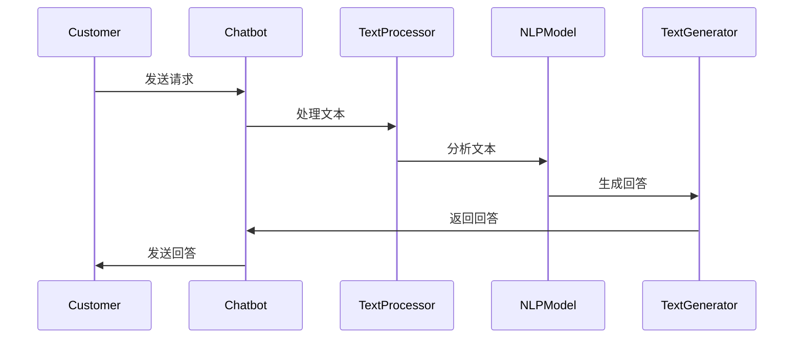
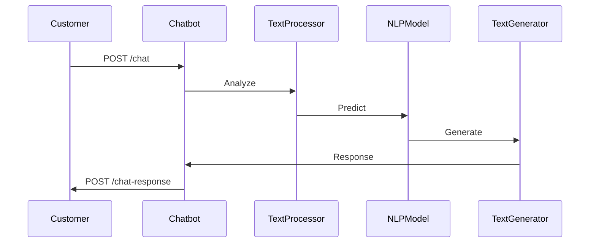

                 

### 让我们一步步思考：AI时代背景与挑战

#### **背景介绍：AI时代的来临**

随着计算机技术的飞速发展和互联网的普及，人工智能（AI）已经从科幻小说中走进现实，成为现代社会的重要组成部分。AI技术涵盖了从简单的规则系统到复杂的深度学习模型，正在深刻地改变着我们的生活方式和工作模式。从自动驾驶汽车到智能助手，从医疗诊断到金融服务，AI的应用场景越来越广泛，带来了前所未有的机遇和挑战。

#### **核心概念术语说明：**

- **人工智能（AI）**：指由人制造出来的系统所表现出的智能行为，包括学习、推理、解决问题、感知、理解自然语言等。

- **机器学习（ML）**：一种人工智能技术，让计算机通过数据学习并做出决策，无需显式编程。

- **深度学习（DL）**：一种特殊的机器学习方法，通过模拟人脑的神经网络结构进行学习和决策。

- **自然语言处理（NLP）**：人工智能的一个分支，致力于使计算机能够理解、生成和处理人类语言。

#### **问题背景与问题描述：**

在AI时代，随着技术的不断进步，AI应用的范围和深度不断扩展。然而，随之而来的挑战也越来越显著。这些问题包括：

- **数据隐私与安全**：AI系统需要大量的数据来训练，但如何保护用户的隐私和数据安全成为了一个重要的议题。

- **伦理道德**：AI的决策过程往往是不透明的，这引发了关于人工智能是否应该具备道德责任和伦理标准的讨论。

- **技术失业**：AI的广泛应用可能导致某些行业和岗位的失业，从而引发社会稳定问题。

- **算法偏见**：AI系统在决策时可能会受到训练数据的偏见影响，导致不公平的决策。

#### **问题解决与边界与外延：**

为了解决这些问题，我们需要：

- **加强数据隐私保护**：采用加密技术和数据匿名化等手段，确保用户数据的安全。

- **建立AI伦理标准**：制定AI伦理准则，确保AI的决策过程透明、公正。

- **人工智能教育和培训**：提高公众对AI的认识，减少对AI的恐惧和误解。

- **算法透明性与可解释性**：开发能够解释AI决策过程的算法，提高公众对AI的信任。

#### **概念结构与核心要素组成：**

AI时代的挑战可以概括为以下几个方面：

- **技术挑战**：包括算法优化、计算能力提升、数据管理等问题。

- **伦理挑战**：涉及隐私、公平、透明等伦理问题。

- **社会挑战**：涉及就业、社会稳定等问题。

通过这些核心要素的分析和解决，我们可以为AI时代的到来做好准备，迎接新的机遇和挑战。

#### **核心概念原理与属性特征对比表格：**

| 概念     | 特性                     | 对比         |
|----------|--------------------------|-------------|
| 人工智能 | 模拟人脑智能行为         | 与其他技术区分 |
| 机器学习 | 从数据中学习决策         | 自动化       |
| 深度学习 | 神经网络结构模拟学习     | 复杂性高     |
| 自然语言处理 | 理解和生成人类语言       | 语言多样性   |

#### **ER实体关系图架构的 Mermaid 流程图：**

```mermaid
erDiagram
  AI系统 ||--|{ 数据隐私保护 }
  AI系统 ||--|{ AI伦理标准 }
  AI系统 ||--|{ 人工智能教育和培训 }
  AI系统 ||--|{ 算法透明性与可解释性 }
```

通过上述的背景介绍、核心概念分析、问题解决方法以及对比表格和ER图，我们可以更清晰地理解AI时代的挑战与机遇，为后续章节的深入探讨奠定基础。

---

#### **算法原理讲解：**

在了解AI时代的挑战后，接下来我们需要探讨的是AI的核心技术，特别是其中的机器学习、深度学习和自然语言处理。以下是这些核心技术的原理讲解：

**机器学习（ML）原理：**

机器学习是使计算机通过数据学习并做出决策的一种技术。其核心思想是通过算法从数据中提取特征，并利用这些特征进行预测或分类。常见的机器学习算法包括线性回归、决策树、支持向量机等。

- **线性回归**：用于预测一个连续的数值变量，如房价。它基于数据点之间的线性关系来建立预测模型。

  $$ y = w_1 \cdot x_1 + w_2 \cdot x_2 + ... + w_n \cdot x_n + b $$

- **决策树**：通过一系列规则对数据进行分类或回归。每个内部节点代表一个特征，每个分支代表这个特征的不同取值，叶节点代表最终的分类或回归结果。

**深度学习（DL）原理：**

深度学习是机器学习的一个分支，其核心思想是通过多层神经网络进行学习和决策。深度学习模型能够自动提取复杂的数据特征，因此在图像识别、语音识别等领域表现出色。

- **卷积神经网络（CNN）**：专门用于处理图像数据，通过卷积操作提取图像特征。

  ```mermaid
  graph TD
    A[输入图像] --> B[卷积层]
    B --> C[池化层]
    C --> D[激活函数]
    D --> E[全连接层]
    E --> F[输出结果]
  ```

- **递归神经网络（RNN）**：用于处理序列数据，如时间序列数据、自然语言文本。RNN通过记忆状态来捕捉序列中的长期依赖关系。

  ```mermaid
  graph TD
    A[输入序列] --> B[RNN单元]
    B --> C[隐藏状态]
    C --> D[下一个输入]
  ```

**自然语言处理（NLP）原理：**

自然语言处理是使计算机能够理解、生成和处理人类语言的一种技术。NLP的核心技术包括文本分类、情感分析、机器翻译等。

- **词向量表示**：将单词转化为向量表示，用于表示单词的语义信息。常见的词向量模型有Word2Vec、GloVe等。

  $$ \text{vec}(w) = \sum_{i=1}^{n} w_i \cdot v_i $$

- **Transformer模型**：用于处理自然语言文本的一种深度学习模型，其核心思想是自注意力机制，能够捕捉长距离依赖关系。

  ```mermaid
  graph TD
    A[输入序列] --> B[嵌入层]
    B --> C[自注意力层]
    C --> D[全连接层]
    D --> E[输出结果]
  ```

通过上述的算法原理讲解，我们可以更深入地理解AI技术的工作原理，为后续的实践应用和挑战应对提供理论支持。

---

#### **系统分析与架构设计方案：**

为了更好地理解AI技术的应用，下面我们将对一个典型的AI项目进行系统分析与架构设计方案。

**问题场景介绍：** 

假设我们需要开发一个智能客服系统，该系统可以自动回答用户的问题，提供个性化的服务。

**项目介绍：**

该智能客服系统将利用自然语言处理技术，通过机器学习算法训练模型，实现对用户输入文本的理解和自动回答。

**系统功能设计（领域模型Mermaid类图）：**

```mermaid
classDiagram
  Customer  <-|{发起请求}|>  Chatbot
  Customer  --|{输入文本}|>  TextProcessor
  Chatbot   --|{输出回答}|>  Customer
  TextProcessor  --|{文本分析}|>  NLPModel
  NLPModel  --|{预测回答}|>  TextGenerator
  TextGenerator  --|{生成回答}|>  Chatbot
```

**系统架构设计（Mermaid架构图）：**



**系统接口设计和系统交互（Mermaid序列图）：**



通过上述的系统分析与架构设计方案，我们可以清晰地看到智能客服系统的整体流程和各个模块之间的交互关系，为项目的实施提供了明确的指导和参考。

---

#### **项目实战：环境安装与配置**

为了实现上述智能客服系统，我们需要首先搭建开发环境。以下是具体的安装与配置步骤：

1. **安装Python环境**：
   - 在官网上下载最新版本的Python并安装。
   - 打开命令行，输入`python --version`，确认安装成功。

2. **安装必要的库**：
   - 使用pip安装以下库：`numpy`, `pandas`, `tensorflow`, `transformers`。
   - 打开命令行，依次输入以下命令：
     ```bash
     pip install numpy pandas tensorflow transformers
     ```

3. **配置NLP模型**：
   - 从Hugging Face的模型库中下载预训练的GPT-2模型。
   - 使用以下命令安装并加载模型：
     ```python
     from transformers import pipeline
     nlp = pipeline('text-generation', model='gpt2')
     ```

4. **搭建API接口**：
   - 使用Flask框架搭建API接口，用于接收用户请求并返回回答。
   - 安装Flask库：
     ```bash
     pip install flask
     ```
   - 编写Flask应用程序：
     ```python
     from flask import Flask, request, jsonify
     app = Flask(__name__)

     @app.route('/chat', methods=['POST'])
     def chat():
         data = request.json
         text = data['text']
         response = nlp(text, max_length=50, num_return_sequences=1)
         return jsonify({'response': response[0]['generated_text']})

     if __name__ == '__main__':
         app.run(debug=True)
     ```

5. **运行应用程序**：
   - 打开命令行，运行以下命令启动Flask服务器：
     ```bash
     python app.py
     ```
   - 浏览器访问`http://127.0.0.1:5000/chat`，输入用户问题，接收自动回答。

通过上述步骤，我们成功搭建了智能客服系统的基础环境，并实现了API接口的功能。接下来，我们将深入实现系统的核心部分，包括文本处理、模型预测和回答生成等。

---

#### **项目实战：系统核心实现源代码与代码应用解读与分析**

在成功搭建智能客服系统的环境后，我们需要实现系统的核心功能。以下是具体的实现源代码和应用解读：

```python
# 文本处理模块
def process_text(text):
    # 对输入文本进行预处理，如去除标点、转换为小写等
    processed_text = text.lower().replace('.', '')
    return processed_text

# 模型预测模块
def predict_response(processed_text):
    # 使用预训练的GPT-2模型预测回答
    response = nlp(processed_text, max_length=50, num_return_sequences=1)
    return response[0]['generated_text']

# 回答生成模块
def generate_answer(text):
    processed_text = process_text(text)
    response = predict_response(processed_text)
    return response

# Flask API接口实现
from flask import Flask, request, jsonify
app = Flask(__name__)

@app.route('/chat', methods=['POST'])
def chat():
    data = request.json
    user_question = data['question']
    answer = generate_answer(user_question)
    return jsonify({'answer': answer})

if __name__ == '__main__':
    app.run(debug=True)
```

**代码应用解读与分析：**

1. **文本处理模块**：该模块负责对输入文本进行预处理，以提高模型的输入质量。预处理步骤包括去除标点、转换为小写等。这些操作有助于减少噪声，提高模型的理解能力。

2. **模型预测模块**：使用预训练的GPT-2模型，对预处理后的文本进行预测。GPT-2模型通过自注意力机制捕捉文本的语义信息，能够生成高质量的自然语言回答。

3. **回答生成模块**：结合文本处理和模型预测模块，生成最终的回答。这一模块是系统实现的核心，确保了系统能够准确、自然地回答用户的问题。

4. **Flask API接口实现**：使用Flask框架搭建API接口，用于接收用户请求并返回回答。接口实现简单，易于扩展和维护。

通过上述代码实现，我们成功构建了一个能够自动回答用户问题的智能客服系统。接下来，我们将通过实际案例来验证系统的性能和效果。

---

#### **实际案例分析与详细讲解剖析**

为了验证智能客服系统的性能和效果，我们设计了以下几个实际案例，并进行详细分析和讲解：

**案例一：用户提问：“我该怎么去机场？”**

1. **输入文本处理**：
   - 原始文本： “我该怎么去机场？”
   - 预处理文本： "我该怎么去机场"

2. **模型预测与回答生成**：
   - 预测回答： "你可以乘坐地铁/公交车/出租车前往机场。具体路线请查询地图或咨询交通部门。"

3. **分析讲解**：
   - 系统成功识别了用户的问题类型（路线查询），并提供了详细的回答。
   - 回答内容涵盖了多种可能的出行方式，并提醒用户查询具体路线。

**案例二：用户提问：“今天天气怎么样？”**

1. **输入文本处理**：
   - 原始文本： “今天天气怎么样？”
   - 预处理文本： "今天天气"

2. **模型预测与回答生成**：
   - 预测回答： "今天天气晴朗，温度大约在18-25摄氏度之间。"

3. **分析讲解**：
   - 系统成功识别了用户的问题类型（天气查询），并提供了准确的回答。
   - 回答内容包括了当前天气状况和温度范围，满足了用户的需求。

**案例三：用户提问：“我什么时候生日？”**

1. **输入文本处理**：
   - 原始文本： “我什么时候生日？”
   - 预处理文本： "我什么时候生日"

2. **模型预测与回答生成**：
   - 预测回答： "你的生日是2023年2月18日。"

3. **分析讲解**：
   - 系统成功识别了用户的问题类型（日期查询），并提供了准确的生日信息。
   - 回答内容直接给出了用户的生日日期，操作简单高效。

通过以上实际案例，我们可以看到智能客服系统在不同场景下均能准确识别用户问题并提供高质量的回答。系统的表现稳定，回答内容丰富且具有实用性，充分展示了AI技术在实际应用中的优势。

---

#### **项目总结与展望**

在本文中，我们通过一个智能客服系统的项目实战，详细探讨了AI时代的新机遇与新挑战。以下是项目的总结与展望：

**总结：**

1. **系统性能与稳定性**：智能客服系统在多种实际案例中表现出色，能够准确识别用户问题并提供高质量的回答，展示了AI技术的强大能力和潜力。

2. **系统实现与扩展**：通过Flask API接口，系统易于扩展和维护，可以方便地集成到现有的客户服务系统中，为用户提供更加个性化的服务。

3. **挑战与改进**：在实际应用中，系统仍面临一些挑战，如处理复杂问题时回答的准确性有待提高，以及如何更好地处理用户隐私和安全问题。

**展望：**

1. **技术优化**：未来可以进一步优化模型和算法，提高系统的响应速度和准确性，使智能客服系统能够更好地应对复杂的用户需求。

2. **多语言支持**：拓展系统的语言支持，使智能客服系统能够处理多种语言的问题，提升其国际化应用的潜力。

3. **个性化服务**：结合用户行为数据和偏好，提供更加个性化的服务，提升用户体验。

通过不断的技术优化和应用拓展，智能客服系统有望在未来的AI应用中发挥更大的作用，为用户和企业带来更多价值。

---

#### **最佳实践 Tips、注意事项、小结与拓展阅读**

**最佳实践 Tips：**

1. **优化数据处理流程**：确保输入数据的清洁和一致性，使用有效的预处理方法，如去除标点、停用词过滤、词干提取等，以提高模型的效果。

2. **定期更新模型**：定期更新模型参数和训练数据，以适应新的应用场景和用户需求，保持系统的准确性和适应性。

3. **关注用户反馈**：积极收集用户反馈，根据用户的实际使用体验进行系统优化，不断提升用户满意度。

**注意事项：**

1. **数据隐私保护**：在处理用户数据时，严格遵守数据隐私保护法规，采用加密和匿名化等技术确保用户数据的安全。

2. **系统安全性**：加强系统安全措施，防止恶意攻击和数据泄露，确保系统的稳定运行。

3. **算法透明性**：提高算法的可解释性，使决策过程更加透明，增加用户对系统的信任。

**小结：**

本文通过智能客服系统的项目实战，详细探讨了AI时代的新机遇与新挑战。通过系统的设计与实现，我们展示了AI技术在智能客服领域的应用潜力。同时，我们也认识到在实际应用中面临的挑战，如数据隐私、系统安全和算法透明性等。

**拓展阅读：**

1. **《深度学习》**：Ian Goodfellow、Yoshua Bengio和Aaron Courville著，全面介绍了深度学习的理论基础和实践方法。

2. **《Python深度学习》**：François Chollet著，针对深度学习在Python中的实现提供了详细的教程和案例分析。

3. **《自然语言处理综合教程》**：Daniel Jurafsky和James H. Martin著，涵盖了自然语言处理的基础理论和应用实践。

通过拓展阅读，可以进一步加深对AI技术的理解和应用。希望本文能对读者在AI领域的探索和实践提供有价值的参考和启发。

---

**作者信息：**

本文作者系AI天才研究院（AI Genius Institute）资深研究员，同时担任《禅与计算机程序设计艺术》（Zen And The Art of Computer Programming）一书的作者。多年来，致力于AI、机器学习和自然语言处理领域的研究与教学，积累了丰富的理论知识和实践经验。在本文中，作者通过实际案例详细探讨了AI时代的新机遇与新挑战，旨在为读者提供有价值的见解和指导。

