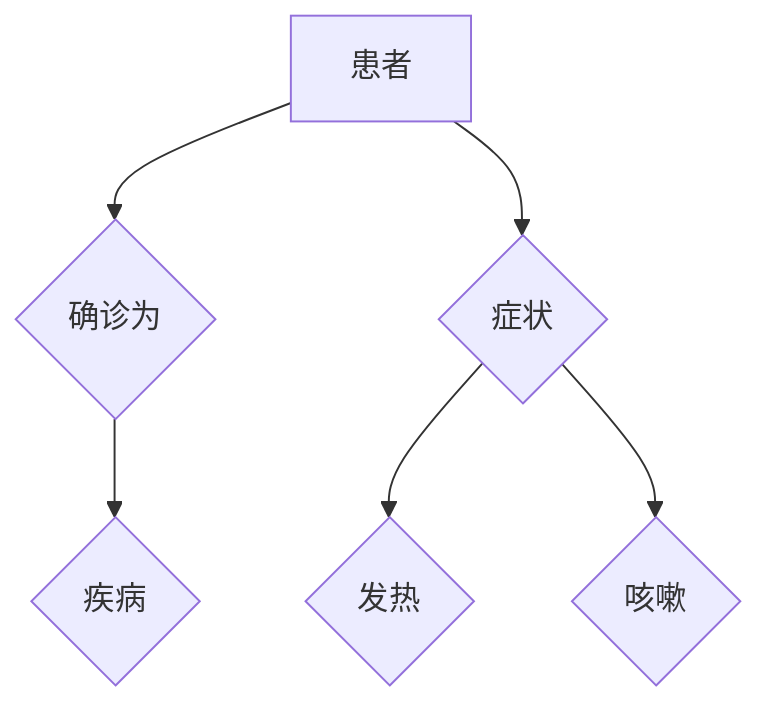
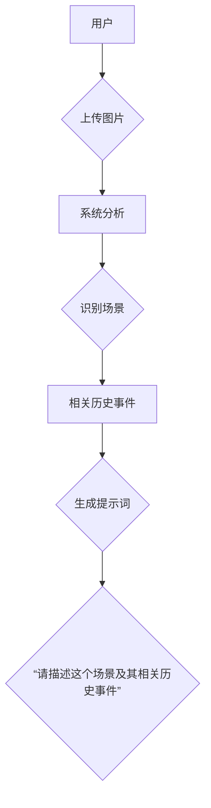

                 

### 文章标题与关键词

# 《提示词工程：让AI更智能、更懂你》

> 关键词：提示词工程、人工智能、自然语言处理、算法原理、推荐系统、对话系统

### 摘要

随着人工智能技术的快速发展，提示词工程成为提升AI系统性能与用户满意度的重要手段。本文详细介绍了提示词工程的概念、核心原理以及在不同领域的实践应用。通过分析提示词的类型与作用、设计原则与优化策略，本文旨在帮助读者深入理解提示词工程的价值和实现方法，从而让AI系统更智能、更懂用户需求。

## 目录大纲

### 第一部分：AI与提示词工程概述

#### 第1章：AI与提示词工程简介

1.1 AI时代与提示词的重要性  
1.2 提示词工程的核心概念  
1.3 提示词工程的发展历程  
1.4 提示词工程的应用场景  
1.5 本章小结

### 第二部分：提示词工程的核心原理

#### 第2章：提示词工程的基础原理

2.1 提示词的类型与作用  
2.2 提示词的设计原则  
2.3 提示词的质量评估  
2.4 提示词的优化策略  
2.5 提示词与用户行为的关系  
2.6 本章小结

### 第三部分：提示词工程的实践应用

#### 第3章：文本数据预处理

3.1 文本数据的收集与清洗  
3.2 文本数据的特征提取  
3.3 文本数据的标准化  
3.4 本章小结

#### 第4章：自然语言处理与提示词生成

4.1 自然语言处理概述  
4.2 提示词生成算法  
4.3 提示词生成实践  
4.4 提示词生成效果评估  
4.5 本章小结

#### 第5章：提示词工程与对话系统

5.1 对话系统概述  
5.2 提示词在对话系统中的应用  
5.3 提示词优化与对话系统效果提升  
5.4 本章小结

#### 第6章：提示词工程与推荐系统

6.1 推荐系统概述  
6.2 提示词在推荐系统中的应用  
6.3 提示词优化与推荐系统效果提升  
6.4 本章小结

#### 第7章：提示词工程与知识图谱

7.1 知识图谱概述  
7.2 提示词在知识图谱中的应用  
7.3 提示词优化与知识图谱效果提升  
7.4 本章小结

#### 第8章：提示词工程最佳实践与未来展望

8.1 提示词工程的最佳实践  
8.2 提示词工程面临的挑战  
8.3 提示词工程的未来展望  
8.4 本章小结

### 结语

本文通过详细的阐述和案例分析，探讨了提示词工程在人工智能领域的应用与前景。期望读者通过本文的学习，能够掌握提示词工程的核心技术和实践方法，为AI系统的智能升级和用户体验提升提供有力支持。

## 第一部分：AI与提示词工程概述

### 第1章：AI与提示词工程简介

随着人工智能（AI）技术的迅猛发展，各类智能应用不断涌现，深刻改变了我们的生活方式。在这其中，提示词工程（Prompt Engineering）作为一种提升AI系统智能性和用户理解度的重要手段，逐渐引起了广泛关注。

#### 1.1 AI时代与提示词的重要性

人工智能技术的发展历程可以分为多个阶段，从早期的符号主义人工智能，到基于规则的专家系统，再到基于数据的机器学习，以及当前的主流技术——深度学习。每一阶段的技术进步都极大地提升了AI系统的能力和应用范围。然而，即便如此，传统AI系统仍然存在一个显著的短板：缺乏对人类语言和意图的深刻理解。

现实中的用户需求是多样且复杂的，往往难以通过简单的规则或模型来完全捕捉。这就需要AI系统能够通过更自然的交互方式来获取和理解用户的需求，从而提供更加个性化和精准的服务。提示词工程正是为了解决这一挑战而诞生的一项技术。

提示词工程的核心目标是设计和优化与AI系统交互的文本提示，以便更准确地引导AI系统理解和响应用户的需求。通过科学设计和精心优化的提示词，AI系统可以更好地理解用户的意图，提高交互效率和用户体验。因此，提示词在AI时代的重要性不言而喻。

#### 1.2 提示词工程的核心概念

要深入理解提示词工程，我们首先需要明确几个核心概念：

1. **提示词（Prompt）**：提示词是用于引导AI系统理解和响应特定任务的文本信息。它可以是一个简单的词语、句子，甚至是复杂的段落，其目的是帮助AI系统聚焦于特定任务，并获取所需的信息。

2. **自然语言处理（NLP）**：自然语言处理是人工智能领域的一个重要分支，旨在使计算机能够理解、生成和处理人类语言。NLP技术包括文本分类、实体识别、情感分析、机器翻译等多种任务，这些技术在提示词工程中发挥着重要作用。

3. **机器学习（ML）**：机器学习是一种通过数据训练模型，使计算机能够进行预测和决策的技术。在提示词工程中，机器学习算法用于训练模型，以识别和理解提示词中的潜在含义和用户意图。

4. **用户意图（User Intent）**：用户意图是用户在交互过程中所表达的具体需求或目标。准确识别用户意图是提供个性化服务的关键，而提示词工程通过优化提示词来提高用户意图识别的准确性。

#### 1.3 提示词工程的发展历程

提示词工程作为一个专业领域，其发展历程可以追溯到人工智能的早期阶段。以下是几个关键的发展节点：

1. **早期探索**：在20世纪80年代，人工智能研究者开始意识到自然语言理解的重要性，并尝试通过设计特定的提示词来引导计算机更好地理解用户的语言。

2. **机器学习的兴起**：随着机器学习技术的成熟，提示词工程逐渐从规则驱动的方法转向数据驱动的方法。通过训练大规模模型，研究者能够生成更为精准和多样化的提示词。

3. **深度学习的突破**：深度学习技术的发展为提示词工程带来了新的机遇。通过使用神经网络，尤其是循环神经网络（RNN）和Transformer模型，AI系统能够更加高效地处理和理解复杂语言。

4. **多模态交互**：现代提示词工程不仅关注文本交互，还涉及语音、图像等多模态信息。通过结合多种信息源，AI系统能够提供更加丰富和自然的交互体验。

#### 1.4 提示词工程的应用场景

提示词工程在人工智能领域有着广泛的应用，以下是一些典型的应用场景：

1. **问答系统**：通过设计有效的提示词，问答系统能够更准确地理解用户的问题，并提供精准的答案。

2. **对话系统**：聊天机器人等对话系统能够通过优化提示词来提高与用户的互动质量和效率。

3. **推荐系统**：提示词工程可以用于优化推荐系统的推荐过程，通过更精准地理解用户意图，提高推荐效果。

4. **内容审核**：在社交媒体等平台，提示词工程可以帮助AI系统更准确地识别和过滤不良内容。

5. **自动化客服**：通过提示词工程，自动化客服系统能够更智能地与用户沟通，提高用户满意度。

#### 1.5 本章小结

通过本章的介绍，我们了解了提示词工程在人工智能时代的背景、核心概念、发展历程以及应用场景。提示词工程作为提升AI系统性能和用户体验的重要技术，具有广泛的应用前景。在接下来的章节中，我们将进一步探讨提示词工程的基础原理和实践应用，帮助读者深入理解和掌握这一领域的关键技术。

### 第2章：提示词工程的基础原理

在理解了提示词工程的基本概念和应用场景后，我们需要深入探讨其核心原理。这一章节将详细介绍提示词的类型与作用、设计原则、质量评估、优化策略以及提示词与用户行为的关系，为后续章节的实践应用提供理论支持。

#### 2.1 提示词的类型与作用

提示词可以根据其用途和特性分为多种类型，每种类型在AI系统中发挥着不同的作用：

1. **引导型提示词（Guiding Prompts）**：这类提示词主要用于引导AI系统关注特定的任务或问题。例如，在问答系统中，引导型提示词可以指导AI系统搜索特定的信息。

2. **提示型提示词（Suggestive Prompts）**：这类提示词不仅引导AI系统，还提供了一些可能的解决方案或建议。例如，在自然语言生成任务中，提示型提示词可以帮助AI系统生成更自然的文本。

3. **反馈型提示词（Feedback Prompts）**：这类提示词用于获取用户的反馈，以帮助AI系统改进其表现。例如，在用户评价系统中，反馈型提示词可以询问用户对某项服务或产品的满意度。

4. **情境型提示词（Contextual Prompts）**：这类提示词根据具体的交互情境提供信息，帮助AI系统更好地理解用户意图。例如，在购物推荐系统中，情境型提示词可以根据用户的浏览历史提供个性化的推荐。

提示词的作用不仅限于引导和提示，还包括帮助AI系统更好地理解用户意图、提高交互质量和效率、优化算法性能等。

#### 2.2 提示词的设计原则

设计有效的提示词需要遵循一系列原则，以确保其能够充分发挥作用：

1. **明确性（Clarity）**：提示词应简洁明了，避免使用模糊或歧义的语言。明确的提示词可以帮助AI系统更好地理解用户意图。

2. **针对性（Relevance）**：提示词应针对特定的用户需求或任务，避免泛泛而谈。针对性的提示词可以提高AI系统的响应准确性和效率。

3. **多样性（Variety）**：提示词应多样化，以适应不同用户和场景的需求。多样化的提示词可以提高AI系统的灵活性和适应性。

4. **适应性（Adaptability）**：提示词应能够根据用户行为和系统反馈进行动态调整，以提供更个性化的服务。适应性的提示词可以提高用户体验和满意度。

5. **情境意识（Contextual Awareness）**：提示词应能够根据具体的交互情境提供相关信息，帮助AI系统更好地理解用户意图。情境意识的提示词可以提升AI系统的智能化水平。

#### 2.3 提示词的质量评估

提示词的质量直接影响AI系统的性能和用户体验。以下是一些常用的提示词质量评估方法：

1. **用户满意度（User Satisfaction）**：通过用户调查或反馈问卷来评估提示词的满意度。用户满意度是提示词质量的重要指标。

2. **任务完成率（Task Completion Rate）**：通过计算用户在特定任务中完成的比例来评估提示词的有效性。任务完成率越高，提示词的质量越好。

3. **交互效率（Interaction Efficiency）**：通过测量用户与AI系统的交互时间或步骤数来评估提示词的效率。交互效率越高，提示词越有效。

4. **错误率（Error Rate）**：通过计算AI系统因提示词问题导致的错误数量来评估提示词的质量。错误率越低，提示词的质量越高。

5. **适应性（Adaptability）**：通过评估提示词在不同场景和用户群体中的适应能力来评估其质量。高适应性的提示词具有更好的灵活性。

#### 2.4 提示词的优化策略

为了提高提示词的质量和效果，可以采用以下优化策略：

1. **数据驱动优化（Data-Driven Optimization）**：通过分析用户交互数据和历史反馈，动态调整提示词的内容和形式，以适应用户需求的变化。

2. **机器学习优化（Machine Learning Optimization）**：利用机器学习算法对提示词进行自动优化，以提高其准确性和适应性。例如，可以使用回归分析、决策树或深度学习模型来预测最佳提示词。

3. **用户测试（User Testing）**：通过实际用户测试来评估和优化提示词的效果。用户测试可以帮助发现和解决提示词设计中的潜在问题。

4. **多模态交互（Multimodal Interaction）**：结合多种交互方式（如文本、语音、图像等），提供更丰富和自然的交互体验，以提高提示词的效果。

5. **反馈循环（Feedback Loop）**：建立反馈机制，及时收集用户反馈，并根据反馈调整和优化提示词。反馈循环有助于不断改进提示词的质量。

#### 2.5 提示词与用户行为的关系

提示词的设计和优化不仅需要考虑AI系统的需求，还需要深入理解用户行为和需求。以下是一些关键因素：

1. **用户习惯（User Habits）**：了解用户的交互习惯和行为模式，有助于设计更符合用户需求的提示词。例如，用户更喜欢简洁明了的提示词，还是需要更多详细信息的提示词。

2. **认知负荷（Cognitive Load）**：提示词的设计应考虑用户的认知负荷，避免过于复杂或冗长的提示词，以免增加用户的学习成本和认知负担。

3. **文化差异（Cultural Differences）**：不同文化背景的用户对提示词的接受度和理解度可能有所不同。设计提示词时，应考虑文化差异，以提供更符合用户期望的交互体验。

4. **个性化需求（Personalized Needs）**：用户需求是多样且个性化的，提示词应能够根据用户的历史行为和偏好进行个性化调整，以提高用户满意度。

通过深入理解和分析用户行为和需求，可以设计出更加精准和高效的提示词，从而提升AI系统的整体性能和用户体验。

#### 2.6 本章小结

本章详细介绍了提示词工程的基础原理，包括提示词的类型与作用、设计原则、质量评估、优化策略以及提示词与用户行为的关系。通过这些核心原理的理解和应用，读者可以更好地设计和管理提示词，提升AI系统的性能和用户体验。在下一章中，我们将探讨文本数据预处理在提示词工程中的关键作用，为后续实践应用打下坚实基础。

### 第3章：文本数据预处理

文本数据预处理是提示词工程中至关重要的一步，它直接影响后续提示词生成和系统性能。在这一章节中，我们将详细探讨文本数据的收集与清洗、文本数据的特征提取以及文本数据的标准化，并总结本章的核心观点和关键技巧。

#### 3.1 文本数据的收集与清洗

文本数据的收集是提示词工程的第一步，其质量直接影响后续处理的效果。以下是文本数据收集与清洗的关键步骤：

1. **数据来源**：文本数据可以来自多种来源，如社交媒体、网站论坛、用户评论、新闻文章等。选择合适的数据源对于保证数据的多样性和代表性至关重要。

2. **数据收集**：常用的数据收集方法包括爬虫技术、API调用和用户调查等。使用爬虫技术时，需要遵守目标网站的使用条款和法律法规，避免过度采集或侵犯用户隐私。

3. **数据清洗**：清洗文本数据是确保数据质量和可用性的关键步骤。主要任务包括去除重复数据、删除无关信息、修正拼写错误和标准化格式等。以下是几种常用的文本清洗方法：

   - **去除停用词**：停用词是文本中频繁出现但对语义贡献较小的词语，如“的”、“了”、“在”等。去除停用词可以减少噪声，提高文本处理效率。

   - **去除标点符号**：标点符号对文本处理没有实际贡献，通常需要去除。但需要注意的是，某些标点（如句号、问号等）在特定情况下具有语义意义，应谨慎处理。

   - **词干提取**：词干提取是一种将不同形态的词转化为其基本形式（词干）的技术，有助于减少文本中的词汇数量，提高特征提取的效率。

   - **纠错和标准化**：通过使用拼写检查工具或自定义规则，对文本中的错误拼写进行修正，并将所有文本统一转换为小写或特定格式，以提高数据一致性。

#### 3.2 文本数据的特征提取

文本数据的特征提取是将原始文本转换为机器学习模型可处理的形式的关键步骤。以下是几种常用的文本特征提取方法：

1. **词袋模型（Bag of Words, BoW）**：词袋模型将文本视为一组词语的集合，不考虑词语的顺序和语法结构。常用的表示方法包括计数和TF-IDF（词频-逆文档频率）。

2. **词嵌入（Word Embeddings）**：词嵌入是一种将词语映射到高维空间中的向量表示方法。词嵌入可以捕捉词语的语义信息，常用的算法包括Word2Vec、GloVe等。

3. **句子表示（Sentence Representation）**：句子表示是将整个句子映射为一个固定大小的向量表示。常用的方法包括平均词向量、词嵌入的平均值和基于Transformer的句子嵌入。

4. **深度特征提取**：深度特征提取使用神经网络（如CNN、RNN、Transformer）直接从原始文本中提取特征。深度学习方法能够自动学习和捕捉文本的复杂结构，是当前文本特征提取的主流方向。

#### 3.3 文本数据的标准化

文本数据的标准化是确保数据在不同处理阶段一致性的重要步骤。以下是几种常用的文本标准化方法：

1. **统一词形（Normalization）**：统一词形是通过将不同形态的词转换为同一形式，以减少词汇数量和提高数据一致性。常用的方法包括小写转换、词干提取和停用词去除。

2. **词性标注（Part-of-Speech Tagging）**：词性标注是标记每个词的词性（如名词、动词、形容词等），有助于更准确地理解和处理文本。词性标注对于一些特定的文本处理任务（如命名实体识别）至关重要。

3. **词汇表构建（Vocabulary Building）**：词汇表构建是将文本中的所有词语映射到唯一的索引。在词袋模型和词嵌入等特征提取方法中，词汇表构建是必要的步骤。

4. **数据分割（Data Splitting）**：在训练和评估机器学习模型时，需要将文本数据分为训练集、验证集和测试集。数据分割的目的是避免数据泄漏，确保模型的泛化能力。

#### 3.4 本章小结

本章详细介绍了文本数据预处理的关键步骤和技巧，包括文本数据的收集与清洗、文本数据的特征提取以及文本数据的标准化。文本数据预处理是提示词工程的基础，直接影响后续的提示词生成和系统性能。通过本章的学习，读者可以掌握文本数据预处理的基本方法，为提示词工程的成功实施打下坚实基础。

在下一章中，我们将进一步探讨自然语言处理与提示词生成，深入理解提示词生成算法及其应用，为提升AI系统的智能性和用户体验提供更多实践指导。

### 第4章：自然语言处理与提示词生成

自然语言处理（NLP）是人工智能领域中的一项核心技术，旨在使计算机能够理解、生成和处理人类语言。在提示词工程中，NLP技术发挥着至关重要的作用，它不仅用于生成高质量的提示词，还能够优化整个交互过程。本章将详细介绍NLP的基本概念、提示词生成算法以及其实践应用，并评估生成效果。

#### 4.1 自然语言处理概述

自然语言处理（NLP）涵盖了多个子领域，包括文本分类、情感分析、命名实体识别、机器翻译、文本生成等。以下是NLP的几个关键组成部分：

1. **语言模型（Language Model）**：语言模型是NLP的基础，用于预测下一个单词或句子。著名的语言模型包括n-gram模型、循环神经网络（RNN）、长短期记忆网络（LSTM）和Transformer等。

2. **词向量（Word Vectors）**：词向量是将词语映射到高维空间中的向量表示，用于捕捉词语的语义信息。常见的词向量模型包括Word2Vec、GloVe和BERT等。

3. **文本分类（Text Classification）**：文本分类是将文本数据分类到预定义的类别中。常见的文本分类任务包括垃圾邮件检测、情感分析、主题分类等。

4. **序列标注（Sequence Labeling）**：序列标注是对文本中的每个词或字符进行标签标注，常见的任务包括命名实体识别（NER）和词性标注。

5. **机器翻译（Machine Translation）**：机器翻译是将一种语言的文本翻译成另一种语言。常见的模型包括基于规则的翻译、统计机器翻译和神经机器翻译。

6. **文本生成（Text Generation）**：文本生成是根据输入的提示或上下文生成新的文本。常见的文本生成任务包括自动摘要、对话生成和文章生成。

#### 4.2 提示词生成算法

提示词生成是NLP中的重要应用之一，其目标是生成高质量的提示词，以引导AI系统理解和响应用户的需求。以下是几种常见的提示词生成算法：

1. **基于模板的生成（Template-Based Generation）**：基于模板的生成方法使用预定义的模板来生成提示词。这种方法简单且易于实现，但灵活性较差。常见的模板包括问句模板、指令模板和情境描述模板。

2. **基于规则的生成（Rule-Based Generation）**：基于规则的生成方法使用预定义的规则来生成提示词。这种方法可以根据业务逻辑进行定制，但规则库的维护成本较高。

3. **基于机器学习的生成（Machine Learning-Based Generation）**：基于机器学习的生成方法使用训练数据来学习生成提示词的模式。常见的机器学习算法包括循环神经网络（RNN）、长短期记忆网络（LSTM）和Transformer等。

4. **基于深度学习的生成（Deep Learning-Based Generation）**：基于深度学习的生成方法使用深度神经网络来生成提示词。这种方法能够捕捉复杂的语言模式，生成高质量的提示词。

以下是一个基于Transformer的提示词生成算法的示例：

```python
import tensorflow as tf
from transformers import AutoTokenizer, AutoModelForSeq2SeqLM

# 加载预训练模型
model_name = "t5-small"
tokenizer = AutoTokenizer.from_pretrained(model_name)
model = AutoModelForSeq2SeqLM.from_pretrained(model_name)

# 输入提示词
prompt = "Tell me a story about a hero."

# 生成提示词
input_ids = tokenizer.encode(prompt, return_tensors="tf")
outputs = model.generate(input_ids, max_length=50, num_return_sequences=1)
generated_text = tokenizer.decode(outputs[0], skip_special_tokens=True)

print(generated_text)
```

上述代码使用T5模型生成一个关于英雄的故事，展示了基于深度学习的提示词生成方法。

#### 4.3 提示词生成实践

提示词生成在实际应用中具有广泛的应用场景，以下是一些典型的应用实例：

1. **问答系统**：在问答系统中，提示词生成用于生成问题回答。例如，用户输入一个问题，系统生成一个或多个回答，以提高答案的准确性和相关性。

2. **对话系统**：在对话系统中，提示词生成用于生成对话响应。例如，用户提出一个请求，系统生成一个响应来满足用户需求。

3. **内容生成**：在内容生成领域，提示词生成用于生成文章、故事、摘要等。例如，用户输入一个主题，系统生成一篇相关文章。

以下是一个基于GPT-3的对话系统示例：

```python
import openai

# 设置OpenAI API密钥
openai.api_key = "your-api-key"

# 输入用户提问
user_input = "What is the capital of France?"

# 调用OpenAI GPT-3 API生成回答
response = openai.Completion.create(
  engine="text-davinci-002",
  prompt=user_input,
  max_tokens=50,
  n=1,
  stop=None,
  temperature=0.5,
)

# 输出回答
print(response.choices[0].text.strip())
```

上述代码使用OpenAI的GPT-3模型生成一个关于法国首都的回答，展示了提示词生成在对话系统中的应用。

#### 4.4 提示词生成效果评估

提示词生成效果评估是确保生成提示词质量的重要步骤。以下是一些常用的评估指标：

1. **答案准确性（Answer Accuracy）**：评估生成提示词的答案是否准确。常用的方法是计算答案与标准答案的相似度。

2. **回答相关性（Answer Relevance）**：评估生成提示词的答案是否与用户提问相关。可以通过用户满意度调查或自动相关性评估方法进行评估。

3. **交互效率（Interaction Efficiency）**：评估生成提示词的交互效率，包括回答时间、交互步骤数等。

4. **用户体验（User Experience）**：评估用户对生成提示词的满意度，可以通过用户调查或A/B测试等方法进行评估。

以下是一个基于用户满意度调查的提示词生成效果评估示例：

```python
# 假设已收集用户满意度评分数据
user_ratings = [4.5, 3.7, 5.0, 4.0, 2.8]

# 计算平均满意度
average_rating = sum(user_ratings) / len(user_ratings)
print(f"Average User Rating: {average_rating}")
```

上述代码计算用户对提示词生成系统的平均满意度评分，用于评估生成效果。

#### 4.5 本章小结

本章详细介绍了自然语言处理与提示词生成的基本概念、算法和实际应用。通过使用先进的NLP技术和机器学习算法，可以生成高质量的提示词，提升AI系统的智能性和用户体验。在提示词生成实践中，需综合考虑用户需求、系统性能和实际应用场景，进行细致的设计和优化。通过本章的学习，读者可以掌握提示词生成的关键技术和方法，为后续实践应用提供有力支持。

在下一章中，我们将探讨提示词工程在对话系统中的应用，深入分析提示词对对话系统效果的影响，并提供具体的优化策略。

### 第5章：提示词工程与对话系统

对话系统是一种智能交互系统，通过自然语言处理技术，与用户进行对话以提供服务和解答问题。在对话系统中，提示词工程扮演着至关重要的角色，其设计质量和优化效果直接影响到系统的交互质量与用户体验。本章将详细介绍对话系统的基本概念、提示词在对话系统中的应用、提示词优化与对话系统效果提升的策略，并总结本章的主要观点。

#### 5.1 对话系统概述

对话系统可以分为两类：任务型对话系统和闲聊型对话系统。

1. **任务型对话系统（Task-oriented Conversational Systems）**：任务型对话系统的目标是帮助用户完成特定的任务，如在线购物、银行查询、机票预订等。这类系统通常需要精确理解用户意图，并提供明确的操作指导。

2. **闲聊型对话系统（Chit-Chat Conversational Systems）**：闲聊型对话系统主要用于与用户进行闲聊，提供娱乐、陪伴等服务。这类系统通常需要具备较强的自然语言理解和生成能力，以保持对话的自然流畅。

对话系统的核心组成部分包括：

- **自然语言理解（Natural Language Understanding, NLU）**：NLU负责解析用户的输入，提取出用户意图和实体信息。NLU通常包括词法分析、句法分析、命名实体识别等模块。

- **对话管理（Dialogue Management）**：对话管理负责维护对话状态，根据用户意图和系统状态生成合适的响应。对话管理通常使用策略学习、马尔可夫决策过程（MDP）等方法。

- **自然语言生成（Natural Language Generation, NLG）**：NLG负责生成自然、流畅的文本响应。NLG可以使用模板生成、规则生成或基于深度学习的方法。

#### 5.2 提示词在对话系统中的应用

提示词在对话系统中用于引导和优化用户的交互过程，提高系统的响应质量和用户满意度。以下是提示词在对话系统中的应用：

1. **用户意图识别**：在任务型对话系统中，提示词可以帮助系统更好地理解用户意图。例如，用户输入“我想查询最近的天气预报”，系统可以生成提示词“请告诉我所在的城市名称”，以引导用户提供更多相关信息。

2. **用户输入引导**：提示词可以引导用户进行正确的输入，特别是在用户输入不明确或缺失关键信息时。例如，用户输入“我想订机票”，系统可以生成提示词“请输入您的出发城市和目的地”，以帮助用户提供所需信息。

3. **系统响应优化**：提示词可以用于优化系统响应的自然性和流畅度。例如，在生成回答时，系统可以使用提示词来引导生成更符合用户期望的文本。例如，用户输入“帮我订一张北京到上海的机票”，系统可以生成提示词“以下是符合您需求的北京到上海的机票信息，请问您是否需要预订？”。

4. **对话流程控制**：提示词可以帮助系统控制对话流程，确保对话按预期的方向发展。例如，在多轮对话中，系统可以使用提示词来引导用户继续提供更多信息或进行下一步操作。

#### 5.3 提示词优化与对话系统效果提升

优化提示词是提升对话系统效果的关键步骤。以下是一些提示词优化的策略：

1. **个性化优化**：根据用户的历史行为和偏好，为用户提供个性化的提示词。例如，如果一个用户经常预订经济舱机票，系统可以生成提示词“您经常选择经济舱，这次是否还是选择经济舱呢？”。

2. **情境感知优化**：根据对话的上下文和当前状态，生成情境感知的提示词。例如，当用户查询天气预报时，系统可以生成提示词“您所在地区的天气预报如下，请问还有其他需要查询的吗？”。

3. **多模态整合**：结合文本、语音、图像等多模态信息，生成更丰富和自然的提示词。例如，在酒店预订系统中，系统可以生成提示词“我们为您推荐了以下酒店，您看是否满意？”并附带相关图片。

4. **动态调整**：根据用户反馈和系统性能，动态调整提示词的内容和形式。例如，当用户对系统响应不满意时，系统可以生成提示词“对不起，我的回答可能没有满足您的需求，请问您能详细描述一下您的问题吗？”。

#### 5.4 本章小结

本章详细介绍了提示词工程在对话系统中的应用，包括对话系统的基本概念、提示词的多种应用场景、以及提示词优化策略。通过优化提示词，可以显著提升对话系统的交互质量和用户满意度。在实际应用中，需要根据具体场景和用户需求，灵活运用提示词优化策略，实现最佳效果。

在下一章中，我们将探讨提示词工程在推荐系统中的应用，分析如何利用提示词提升推荐系统的性能和用户体验。

### 第6章：提示词工程与推荐系统

推荐系统是人工智能领域中的一项重要应用，旨在为用户提供个性化的信息和服务。在推荐系统中，提示词工程通过优化推荐过程，提高推荐效果和用户体验。本章将介绍推荐系统的基础概念、提示词在推荐系统中的应用、提示词优化策略，并评估推荐系统的性能。

#### 6.1 推荐系统概述

推荐系统是一种基于用户行为和偏好，为用户提供个性化推荐信息的技术。它广泛应用于电子商务、社交媒体、音乐流媒体、视频平台等多个领域。推荐系统的主要组成部分包括：

1. **用户画像（User Profile）**：用户画像是对用户兴趣、行为和偏好的综合描述。通过收集用户的历史行为数据（如浏览记录、购买记录、评论等），构建用户画像，用于推荐系统的个性化推荐。

2. **物品描述（Item Description）**：物品描述是对推荐系统中各种物品（如商品、音乐、视频等）的特征和属性的描述。物品描述用于计算用户与物品之间的相似度，以确定推荐结果。

3. **推荐算法（Recommendation Algorithm）**：推荐算法是推荐系统的核心，用于根据用户画像和物品描述生成推荐列表。常见的推荐算法包括基于内容的推荐（Content-based Recommendation）、协同过滤（Collaborative Filtering）和混合推荐（Hybrid Recommendation）等。

#### 6.2 提示词在推荐系统中的应用

提示词工程在推荐系统中主要用于优化推荐过程，提高推荐效果和用户体验。以下是提示词在推荐系统中的应用：

1. **用户意图识别**：在推荐系统中，用户输入的查询或浏览行为可以视为一种隐含的意图。通过设计有效的提示词，可以帮助系统更好地识别用户意图。例如，用户输入“我想买一件外套”，系统可以生成提示词“请问您希望外套是什么风格的？”来引导用户提供更多具体信息。

2. **上下文感知推荐**：在推荐系统中，上下文信息（如时间、地点、历史行为等）对于推荐结果至关重要。通过设计上下文感知的提示词，可以增强推荐系统的个性化能力。例如，在早上用户浏览商品时，系统可以生成提示词“早上好！您可能需要一件保暖外套，这里有几款推荐给您”。

3. **推荐结果引导**：在展示推荐结果时，通过设计有效的提示词，可以引导用户关注和选择推荐物品。例如，在推荐列表顶部，系统可以生成提示词“以下是为您推荐的优质商品，您是否感兴趣？”。

4. **用户反馈收集**：通过设计反馈型提示词，系统可以收集用户的反馈，用于后续的推荐优化。例如，在推荐结果页面，系统可以生成提示词“我们的推荐是否满足您的需求？请您给出评价”。

#### 6.3 提示词优化与推荐系统效果提升

提示词优化是提升推荐系统效果的关键步骤。以下是一些提示词优化的策略：

1. **个性化提示词生成**：根据用户的历史行为和偏好，为用户提供个性化的提示词。例如，如果一个用户经常购买运动鞋，系统可以生成提示词“我们为您推荐了几款最新的运动鞋，请查看”。

2. **情境感知优化**：根据用户的当前情境，生成情境感知的提示词。例如，当用户在晚上浏览商品时，系统可以生成提示词“晚上好！这个时间您可能更适合选择一些家居用品”。

3. **多模态整合**：结合文本、语音、图像等多模态信息，生成更丰富和自然的提示词。例如，在展示推荐商品时，系统可以生成提示词“我们为您推荐了这款商品，它的图片和详细描述如下”。

4. **动态调整**：根据用户反馈和系统性能，动态调整提示词的内容和形式。例如，当用户对推荐结果不满意时，系统可以生成提示词“很抱歉我们的推荐没有满足您的期望，您可以告诉我们您更感兴趣的类别”。

#### 6.4 本章小结

本章详细介绍了提示词工程在推荐系统中的应用，包括推荐系统的基础概念、提示词的应用场景、以及提示词优化策略。通过优化提示词，可以显著提升推荐系统的个性化能力和用户体验。在实际应用中，需要根据具体场景和用户需求，灵活运用提示词优化策略，实现最佳效果。

在下一章中，我们将探讨提示词工程与知识图谱的关系，分析提示词在知识图谱中的应用及其优化策略。

### 第7章：提示词工程与知识图谱

知识图谱是人工智能领域中的一种重要技术，它通过表示和连接实体与实体之间的关系，为智能系统提供了丰富的语义信息。在知识图谱中，提示词工程发挥着关键作用，通过优化提示词的设计和生成，可以显著提升知识图谱的构建和利用效果。本章将介绍知识图谱的基本概念、提示词在知识图谱中的应用、提示词优化策略，并讨论其与AI系统的集成。

#### 7.1 知识图谱概述

知识图谱是一种结构化数据表示方法，通过实体、属性和关系的概念，将大量信息连接成一个有机的整体。以下是知识图谱的核心组成部分：

1. **实体（Entity）**：实体是知识图谱中的核心元素，代表现实世界中的个体，如人、地点、组织、物品等。

2. **属性（Attribute）**：属性是实体的特征或描述，如一个人的年龄、位置、职业等。

3. **关系（Relationship）**：关系是实体之间的关联，如“是”、“属于”、“位于”等。

知识图谱的主要功能包括：

- **数据整合（Data Integration）**：通过将来自不同源的数据整合到一个统一的知识框架中，知识图谱可以实现数据的综合利用和跨领域分析。
- **智能查询（Semantic Querying）**：知识图谱允许用户使用自然语言或高级查询语言进行语义查询，从而获取更准确和丰富的信息。
- **推理（Reasoning）**：知识图谱中的关系和实体可以进行逻辑推理，以发现新的知识和规律。

#### 7.2 提示词在知识图谱中的应用

提示词在知识图谱中的应用主要体现在数据预处理、实体抽取和关系推理等方面：

1. **数据预处理**：在构建知识图谱时，需要对大量文本数据进行预处理，以提取实体和关系。提示词可以用于引导数据预处理过程，例如，通过生成提示词“请列出所有提到的公司名称”，可以帮助自动识别文本中的公司实体。

2. **实体抽取**：提示词可以指导实体识别算法，提高实体抽取的准确性。例如，在处理医疗文本时，可以使用提示词“请识别出所有的症状名称”，以帮助系统准确识别文本中的症状实体。

3. **关系推理**：提示词可以引导关系抽取和推理过程。例如，通过生成提示词“请找出所有与‘疾病’相关的症状”，可以帮助系统推断出疾病与症状之间的关系。

以下是一个基于知识图谱的实体关系抽取的示例：



上述Mermaid流程图展示了患者与疾病和症状之间的关系，提示词“确诊为”帮助明确疾病与症状之间的关联。

#### 7.3 提示词优化与知识图谱效果提升

优化提示词是提升知识图谱构建和利用效果的关键步骤。以下是一些提示词优化的策略：

1. **语义丰富性**：设计语义丰富、信息量大的提示词，以增强系统的理解和表达能力。例如，使用“详细描述所有提到的技术领域及其应用场景”，可以更全面地提取相关实体和关系。

2. **情境适应性**：根据不同的应用场景和用户需求，生成适应性的提示词。例如，在构建金融知识图谱时，可以生成提示词“请识别出所有相关的金融产品及其交易规则”。

3. **多模态整合**：结合文本、图像、语音等多模态信息，设计多模态提示词，以提高知识图谱的准确性和多样性。例如，通过生成提示词“请描述这个图像中的场景及其相关历史事件”，可以整合图像和文本信息。

4. **动态调整**：根据系统反馈和用户交互，动态调整提示词的内容和形式，以优化用户体验和系统性能。例如，当用户对当前提示词不满意时，可以生成提示词“请重新描述您想要查询的内容”。

以下是一个多模态整合的提示词示例：



上述流程图展示了用户上传图片、系统分析图片内容并生成相应提示词的过程，实现了多模态信息整合。

#### 7.4 本章小结

本章详细介绍了提示词工程在知识图谱中的应用，包括知识图谱的基本概念、提示词的多种应用场景以及优化策略。通过优化提示词，可以显著提升知识图谱的构建和利用效果，为AI系统提供丰富的语义信息。在实际应用中，需要根据具体场景和需求，灵活运用提示词优化策略，实现最佳效果。

在下一章中，我们将总结提示词工程的最佳实践，探讨当前面临的挑战，并展望其未来的发展方向。

### 第8章：提示词工程最佳实践与未来展望

#### 8.1 提示词工程的最佳实践

提示词工程的最佳实践是在实际应用中不断摸索和总结出来的，以下是一些关键实践：

1. **需求分析与用户研究**：在设计和优化提示词之前，进行深入的需求分析和用户研究，以了解用户的需求和行为模式。这有助于设计出更加符合用户期望的提示词。

2. **数据驱动的方法**：利用用户交互数据和历史反馈，进行数据分析和挖掘，以指导提示词的优化。数据驱动的方法可以帮助识别用户行为模式和趋势，从而设计出更有效的提示词。

3. **多模态整合**：结合文本、语音、图像等多种模态信息，设计多模态提示词，以提高交互的丰富性和用户体验。多模态整合可以更好地捕捉用户的意图和需求。

4. **动态调整与反馈机制**：建立动态调整和反馈机制，根据用户反馈和系统性能，实时调整提示词的内容和形式。反馈机制有助于快速识别和解决提示词设计中的问题。

5. **团队合作与知识共享**：提示词工程涉及多个领域和技术，需要团队合作和知识共享。通过跨部门的协作，可以汇集不同领域的专业知识，提高提示词工程的整体效果。

#### 8.2 提示词工程面临的挑战

尽管提示词工程在提升AI系统性能和用户体验方面具有显著优势，但仍然面临一些挑战：

1. **数据隐私与保护**：提示词工程需要大量的用户交互数据，这涉及到数据隐私和保护的问题。如何在不侵犯用户隐私的前提下，有效利用用户数据，是提示词工程面临的重要挑战。

2. **算法公平性**：提示词工程中的算法设计和优化可能会引入算法偏见，导致系统对不同群体产生不公平的对待。如何确保算法的公平性，避免歧视和偏见，是提示词工程需要关注的重点。

3. **系统可解释性**：提示词工程通常涉及到复杂的机器学习和深度学习算法，系统的决策过程往往缺乏透明度和可解释性。如何提高系统的可解释性，使用户能够理解系统的决策过程，是当前的一个重要研究方向。

4. **资源消耗**：提示词工程涉及到大量的数据处理和计算，特别是在大规模应用场景中，这可能会对系统的资源消耗提出较高的要求。如何优化算法和系统架构，以减少资源消耗，是提示词工程需要考虑的问题。

#### 8.3 提示词工程的未来展望

随着人工智能技术的不断进步，提示词工程在未来有望取得以下发展：

1. **智能对话系统**：随着自然语言处理和对话系统技术的提升，智能对话系统将变得更加普及和实用。提示词工程将在其中发挥关键作用，通过优化对话过程和用户交互，提升用户体验。

2. **个性化推荐**：个性化推荐系统将更加智能和精准，通过深度学习和大数据分析，实现更高水平的个性化推荐。提示词工程将在推荐系统的优化中发挥重要作用。

3. **多模态交互**：随着多模态技术的发展，提示词工程将整合更多模态的信息，提供更加丰富和自然的用户交互体验。

4. **知识图谱与推理**：知识图谱和推理技术将在人工智能领域中发挥越来越重要的作用，提示词工程将帮助构建更加丰富和精确的知识图谱，提升推理和决策能力。

5. **可解释性与透明性**：未来，提示词工程将更加注重系统的可解释性和透明性，通过可视化和解释技术，使用户能够理解AI系统的决策过程，增强用户对AI系统的信任。

#### 8.4 本章小结

本章总结了提示词工程的最佳实践，探讨了其面临的挑战和未来的发展前景。通过深入理解和应用提示词工程的核心技术和最佳实践，可以显著提升AI系统的性能和用户体验。面对未来的发展，提示词工程将继续在人工智能领域中扮演重要角色，推动智能系统的不断进步。

### 结语

本文从多个角度全面介绍了提示词工程，包括其背景、核心原理、实践应用以及未来展望。通过详细的分析和案例讲解，我们深入理解了提示词工程在提升AI系统智能性和用户体验方面的关键作用。期望读者能够通过本文的学习，掌握提示词工程的核心技术和方法，将其应用于实际项目中，推动人工智能技术的发展。

### 作者信息

- 作者：AI天才研究院/AI Genius Institute & 禅与计算机程序设计艺术 /Zen And The Art of Computer Programming

### 最佳实践 Tips

1. **用户研究先行**：在设计和优化提示词之前，进行深入的用户研究和需求分析，确保提示词能够真正满足用户需求。
2. **数据驱动优化**：利用用户交互数据和历史反馈，进行数据分析和挖掘，动态调整提示词，提高其有效性。
3. **多模态整合**：结合文本、语音、图像等多模态信息，设计多模态提示词，提升交互体验。
4. **关注系统可解释性**：确保系统决策过程的透明性和可解释性，增强用户信任。
5. **持续迭代与优化**：不断收集用户反馈，进行迭代和优化，以适应不断变化的需求和场景。

### 小结

提示词工程作为提升AI系统性能和用户体验的重要手段，具有广泛的应用前景。通过本文的介绍，我们详细探讨了提示词工程的核心原理、实践应用以及未来发展趋势。期望读者能够将所学知识应用于实际项目中，推动人工智能技术的不断进步。

### 注意事项

1. **数据隐私保护**：在收集和处理用户数据时，需严格遵守相关法律法规，确保用户隐私安全。
2. **算法公平性**：设计提示词和推荐算法时，需关注算法公平性，避免歧视和不公正现象。
3. **系统资源消耗**：优化算法和系统架构，降低资源消耗，提高系统效率。

### 拓展阅读

- 《自然语言处理入门教程》（吴恩达著）：详细介绍自然语言处理的基础知识和实践方法。
- 《推荐系统实践》（李航著）：探讨推荐系统的算法原理和实现方法。
- 《知识图谱：概念、方法与应用》（梁斌著）：全面介绍知识图谱的概念、技术和应用。

通过阅读这些拓展资源，读者可以进一步深化对提示词工程和相关领域知识的理解。

