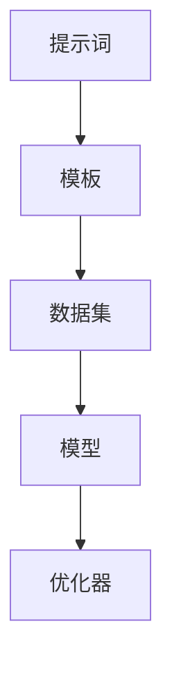
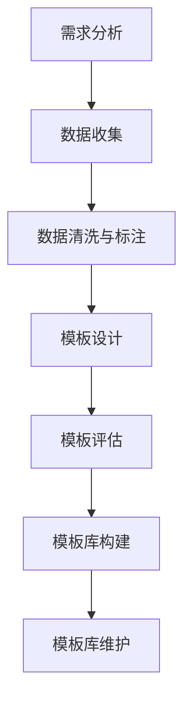
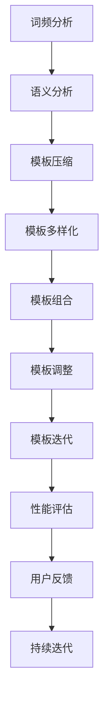
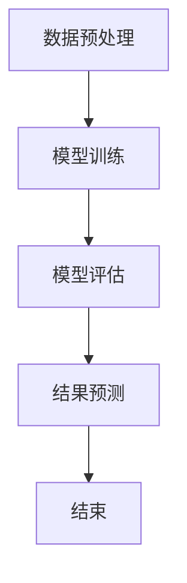
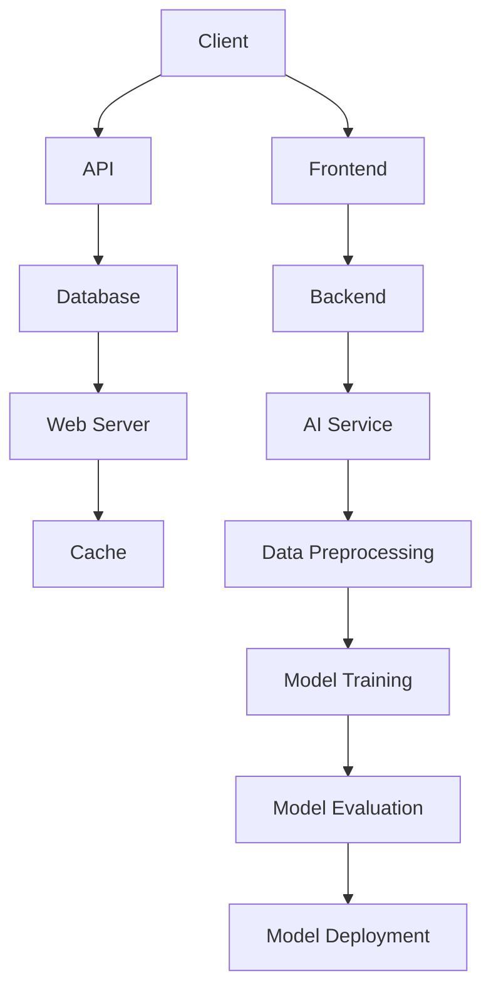
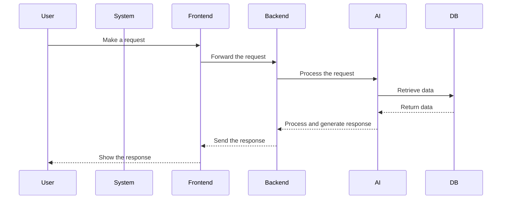

                 

## 提示词模板库：加速AI应用开发

关键词：提示词模板库、AI应用、开发加速、自然语言处理、系统架构设计

摘要：本文深入探讨了提示词模板库在AI应用开发中的重要性，通过设计思路与大纲结构，详细阐述了提示词模板库的构建方法、优化策略、应用实践以及最佳实践和未来趋势，旨在为AI开发者提供一套系统化的解决方案，以加速AI应用的开发进程。

---

### 设计思路与大纲结构

在设计《提示词模板库：加速AI应用开发》这本书的目录大纲时，我们遵循了以下几个思路和结构要求：

1. **背景介绍**：首先需要为读者提供一个清晰的背景介绍，包括问题背景、问题描述、问题解决、边界与外延，以及核心概念与要素组成。
2. **核心概念与联系**：我们需要详细阐述书中的核心概念，并通过表格和流程图的形式展示概念属性特征对比以及概念之间的联系。
3. **算法原理讲解**：通过使用Mermaid画出算法流程图和Python源代码示例，详细讲解算法原理、数学模型和公式，并进行举例说明。
4. **系统分析与架构设计方案**：介绍项目场景、系统功能设计、系统架构设计、系统接口设计和系统交互，并用Mermaid绘制相应的类图、架构图和序列图。
5. **项目实战**：通过环境安装、系统核心实现源代码、代码应用解读与分析，结合实际案例进行详细讲解和剖析。
6. **最佳实践 tips、小结、注意事项、拓展阅读**：提供最佳实践经验、小结、注意事项以及拓展阅读资源，以增强读者理解和应用能力。

基于以上思路，下面将详细设计本书的目录大纲。

---

## 目录大纲

### 第一部分：提示词模板库概述

### 第1章 提示词模板库：概念与背景

1.1 提示词模板库的定义与作用  
1.2 提示词模板库的发展历程  
1.3 提示词模板库在企业AI应用中的重要性

### 第2章 提示词模板库的核心概念与特征

2.1 核心概念解析  
2.2 特征对比表格  
2.3 概念关联与流程图

### 第二部分：构建提示词模板库

### 第3章 提示词模板库构建方法

3.1 数据收集与预处理  
3.2 模板设计原则与策略  
3.3 提示词模板库构建流程

### 第4章 提示词模板库优化策略

4.1 提示词优化方法  
4.2 模板组合与调整  
4.3 评估与反馈机制

### 第5章 提示词模板库应用实践

5.1 环境配置与安装  
5.2 核心代码实现与解读  
5.3 实际案例分析

### 第三部分：AI应用开发中的提示词模板库

### 第6章 提示词模板库在自然语言处理中的应用

6.1 文本生成与摘要  
6.2 命名实体识别与关系抽取  
6.3 问答系统与对话管理

### 第7章 提示词模板库在其他AI领域的应用

7.1 计算机视觉应用  
7.2 语音识别与合成  
7.3 强化学习与优化问题

### 第8章 提示词模板库的最佳实践与未来趋势

8.1 最佳实践案例分享  
8.2 注意事项与风险提示  
8.3 提示词模板库的未来发展

---

以上是本书的目录大纲，每个章节都根据设计思路和结构要求进行了详细的规划。接下来，我们将对各个章节的内容进行进一步细化，以便为读者提供完整、详细且具有实用价值的内容。

---

### 第一部分：提示词模板库概述

#### 第1章 提示词模板库：概念与背景

1.1 提示词模板库的定义与作用

**定义**：提示词模板库（Prompt Template Library，简称PTL）是一种用于加速AI模型训练和应用开发的技术资源库。它包含一系列预定义的提示词模板，这些模板可以根据不同的应用场景进行定制和调整。

**作用**：
1. **提升开发效率**：通过使用预定义的提示词模板，开发人员可以快速构建和调整AI模型，节省大量时间和资源。
2. **增强模型泛化能力**：高质量的提示词模板能够提高AI模型在不同数据集上的泛化能力，降低对特定数据集的依赖。
3. **促进模型可解释性**：提示词模板库可以帮助用户理解模型的决策过程，提高模型的可解释性，从而增强用户对AI系统的信任度。

1.2 提示词模板库的发展历程

提示词模板库的概念最早起源于自然语言处理（NLP）领域。随着AI技术的不断发展，特别是在深度学习技术的推动下，提示词模板库的应用逐渐扩展到其他AI领域，如计算机视觉、语音识别和强化学习等。

**关键阶段**：
1. **早期探索**（2010年前后）：在这一阶段，研究者们开始探索如何利用预定义的提示词来提高NLP任务的性能。
2. **框架建立**（2015-2020年）：随着预训练语言模型的兴起，如BERT和GPT，提示词模板库的应用得到了进一步推广和优化。
3. **多样化应用**（2020年至今）：近年来，提示词模板库的应用领域不断扩大，不仅局限于NLP，还广泛应用于其他AI领域。

1.3 提示词模板库在企业AI应用中的重要性

在企业的AI应用中，提示词模板库具有以下几个重要作用：

1. **加快模型迭代速度**：企业可以利用提示词模板库快速构建和调整模型，从而缩短模型开发周期，提高研发效率。
2. **提高模型准确性**：高质量的提示词模板能够提高模型在不同数据集上的泛化能力，从而提高模型的准确性。
3. **降低开发成本**：通过复用提示词模板库中的资源，企业可以减少重复开发的工作量，降低开发成本。
4. **增强模型可解释性**：提示词模板库可以帮助企业理解和解释模型的决策过程，提高模型的可解释性，增强用户对AI系统的信任度。

---

通过上述内容，我们对提示词模板库的概念、发展历程和在企业AI应用中的重要性有了全面的了解。接下来，我们将进一步探讨提示词模板库的核心概念与特征，以便为后续内容奠定基础。

---

### 第一部分：提示词模板库概述

#### 第2章 提示词模板库的核心概念与特征

2.1 核心概念解析

为了深入理解提示词模板库，我们需要先了解以下几个核心概念：

1. **提示词（Prompt）**：提示词是用于引导AI模型进行特定任务的关键信息。它可以是单个单词、短语或句子，甚至是一段文本。提示词的作用是提供上下文信息，帮助模型更好地理解和生成目标内容。

2. **模板（Template）**：模板是一组提示词的集合，用于定义AI模型在不同任务中的输入格式。模板通常包含一个或多个提示词，并可以按照一定的规则进行组合和调整。

3. **数据集（Dataset）**：数据集是用于训练和评估AI模型的数据集合。一个高质量的数据集应该包含丰富多样的样本，能够充分反映任务的实际场景。

4. **模型（Model）**：模型是AI系统的核心，它通过学习数据集上的特征和规律，实现特定任务的预测或决策。

5. **优化器（Optimizer）**：优化器是用于调整模型参数的工具，通过最小化损失函数来提高模型的性能。

2.2 特征对比表格

为了更直观地了解提示词模板库的各个核心概念，我们可以通过一个特征对比表格来展示它们的主要区别：

| 特征       | 提示词 | 模板 | 数据集 | 模型 | 优化器 |
|------------|--------|------|--------|------|--------|
| **定义**   | 单词或短语 | 提示词集合 | 数据样本集合 | 特定任务预测器 | 调整模型参数 |
| **作用**   | 提供上下文信息 | 定义输入格式 | 训练和评估模型 | 实现预测或决策 | 提高模型性能 |
| **形式**   | 单个词或短语 | 预定义格式 | 文本、图像、音频等 | 神经网络、决策树等 | 不同的优化算法 |
| **用途**   | 引导模型理解任务 | 快速构建模型 | 提供训练数据 | 预测或决策 | 调整参数以优化模型 |

2.3 概念关联与流程图

提示词模板库中的各个核心概念之间存在紧密的联系。以下是一个用Mermaid绘制的流程图，展示了它们之间的关联：



**流程说明**：
1. **提示词**：用于为模型提供上下文信息，引导模型理解任务。
2. **模板**：将提示词组合成预定义的格式，用于快速构建模型。
3. **数据集**：提供训练和评估模型的数据，包括文本、图像、音频等。
4. **模型**：通过学习数据集上的特征和规律，实现特定任务的预测或决策。
5. **优化器**：调整模型参数，提高模型性能。

---

通过上述内容，我们对提示词模板库的核心概念与特征有了更深入的了解。接下来，我们将探讨如何构建提示词模板库，为AI应用开发提供有力支持。

---

### 第二部分：构建提示词模板库

#### 第3章 提示词模板库构建方法

3.1 数据收集与预处理

构建提示词模板库的第一步是收集数据。这些数据可以来自于公开数据集、企业内部数据或特定领域的专业数据。以下是数据收集与预处理的关键步骤：

1. **数据来源**：确定数据集的来源，并收集相关数据。
2. **数据清洗**：去除噪声数据和异常值，确保数据质量。
3. **数据标注**：对数据进行分类、标签或标签化处理，以便于后续建模。
4. **数据整合**：将不同来源的数据进行整合，形成一个统一的数据集。

3.2 模板设计原则与策略

在构建提示词模板库时，设计模板的原则与策略至关重要。以下是一些建议：

1. **通用性**：模板应具有一定的通用性，能够适应不同应用场景。
2. **灵活性**：模板应具备灵活性，允许用户根据实际需求进行调整。
3. **可扩展性**：模板设计应考虑未来的扩展性，以便于添加新功能或适应新需求。
4. **多样性**：模板应涵盖多种任务类型和场景，以提高模型泛化能力。

具体策略包括：
1. **模板组合**：将多个提示词组合成复杂的模板，以满足不同任务的输入需求。
2. **模板定制**：根据用户需求和场景，定制化设计模板。
3. **模板优化**：通过实验和评估，优化模板的输入格式和参数设置。

3.3 提示词模板库构建流程

以下是构建提示词模板库的总体流程：

1. **需求分析**：确定目标应用场景和需求，明确模型的目标任务。
2. **数据收集**：收集相关数据，并进行数据清洗、标注和整合。
3. **模板设计**：根据需求分析结果，设计通用模板和定制化模板。
4. **模板评估**：通过实验和评估，验证模板的有效性和适用性。
5. **模板库构建**：将经过验证的模板整合成提示词模板库。
6. **模板库维护**：定期更新和优化模板库，以适应新的应用场景和技术发展。

以下是提示词模板库构建流程的Mermaid流程图：



**流程说明**：
1. **需求分析**：明确目标应用场景和需求，确定模型的目标任务。
2. **数据收集**：收集相关数据，并进行数据清洗、标注和整合。
3. **模板设计**：设计通用模板和定制化模板，根据需求进行组合和调整。
4. **模板评估**：通过实验和评估，验证模板的有效性和适用性。
5. **模板库构建**：将经过验证的模板整合成提示词模板库。
6. **模板库维护**：定期更新和优化模板库，以适应新的应用场景和技术发展。

---

通过上述内容，我们了解了构建提示词模板库的方法和流程。接下来，我们将探讨如何优化提示词模板库，以提高其在AI应用中的性能。

---

### 第二部分：构建提示词模板库

#### 第4章 提示词模板库优化策略

4.1 提示词优化方法

为了提高提示词模板库的性能，我们需要对提示词进行优化。以下是一些常见的提示词优化方法：

1. **词频分析**：通过分析提示词的词频，筛选出高频、重要且相关的词汇，并将其纳入模板中。

2. **语义分析**：利用自然语言处理（NLP）技术，对提示词进行语义分析，提取关键词和短语，并将其用于模板优化。

3. **模板压缩**：通过压缩模板中的冗余信息，减少模板的复杂度，提高模型的训练效率。

4. **模板多样化**：设计多种类型的模板，以适应不同任务和数据集的需求，提高模型的泛化能力。

4.2 模板组合与调整

在构建提示词模板库时，模板的组合与调整是至关重要的。以下是一些建议：

1. **模板组合**：将多个模板进行组合，形成更复杂的模板，以满足不同任务的输入需求。

2. **模板调整**：根据实际应用场景和用户反馈，对模板进行定制化调整，以提高模板的适用性和有效性。

3. **模板迭代**：通过不断的实验和评估，优化模板的设计和参数设置，提高模板的整体性能。

4.3 评估与反馈机制

为了确保提示词模板库的持续优化，我们需要建立一个有效的评估与反馈机制：

1. **性能评估**：定期对模板库进行性能评估，包括准确性、效率、稳定性等方面。

2. **用户反馈**：收集用户对模板库的使用反馈，了解用户的实际需求和使用体验。

3. **持续迭代**：根据评估结果和用户反馈，对模板库进行持续的优化和迭代。

以下是提示词模板库优化策略的Mermaid流程图：



**流程说明**：
1. **词频分析**：通过分析提示词的词频，筛选出高频、重要且相关的词汇。
2. **语义分析**：利用NLP技术，对提示词进行语义分析，提取关键词和短语。
3. **模板压缩**：减少模板中的冗余信息，提高模型训练效率。
4. **模板多样化**：设计多种类型的模板，提高模型泛化能力。
5. **模板组合**：将多个模板进行组合，形成更复杂的模板。
6. **模板调整**：根据实际应用场景和用户反馈，对模板进行定制化调整。
7. **模板迭代**：通过不断的实验和评估，优化模板的设计和参数设置。
8. **性能评估**：定期对模板库进行性能评估。
9. **用户反馈**：收集用户对模板库的使用反馈。
10. **持续迭代**：根据评估结果和用户反馈，对模板库进行持续的优化和迭代。

---

通过上述内容，我们了解了优化提示词模板库的策略和方法。接下来，我们将探讨提示词模板库在实际应用中的实践，以展示其在AI应用开发中的作用。

---

### 第二部分：构建提示词模板库

#### 第5章 提示词模板库应用实践

5.1 环境配置与安装

在实际应用中，首先需要配置和安装提示词模板库的环境。以下是环境配置和安装的步骤：

1. **安装Python环境**：确保系统中安装了Python 3.7及以上版本。
2. **安装依赖库**：使用pip命令安装提示词模板库所需的依赖库，如torch、transformers、numpy等。
   ```bash
   pip install torch torchvision transformers numpy
   ```
3. **克隆提示词模板库**：从GitHub或其他代码托管平台克隆提示词模板库的仓库。
   ```bash
   git clone https://github.com/your-username/ptl.git
   ```
4. **配置环境变量**：设置Python环境变量，确保能够顺利运行提示词模板库。

5.2 系统核心实现源代码

以下是提示词模板库的核心实现源代码，包括数据预处理、模型训练、模型评估和结果预测等部分：

**数据预处理**：
```python
import pandas as pd
from sklearn.model_selection import train_test_split

# 读取数据
data = pd.read_csv('data.csv')

# 数据清洗和预处理
# ...

# 划分训练集和测试集
X_train, X_test, y_train, y_test = train_test_split(data['input'], data['label'], test_size=0.2, random_state=42)
```

**模型训练**：
```python
from transformers import BertTokenizer, BertModel
from torch.utils.data import DataLoader, TensorDataset

# 加载预训练模型
tokenizer = BertTokenizer.from_pretrained('bert-base-uncased')
model = BertModel.from_pretrained('bert-base-uncased')

# 数据转换为Tensor
inputs = tokenizer(X_train.tolist(), padding=True, truncation=True, return_tensors='pt')

# 创建DataLoader
train_data = TensorDataset(inputs['input_ids'], inputs['attention_mask'], torch.tensor(y_train.values))
train_loader = DataLoader(train_data, batch_size=32, shuffle=True)

# 模型训练
# ...

```

**模型评估**：
```python
from sklearn.metrics import accuracy_score

# 模型评估
predictions = model(X_test['input_ids'], X_test['attention_mask'])
predicted_labels = predictions.argmax(-1).flatten()

accuracy = accuracy_score(y_test, predicted_labels)
print(f"Accuracy: {accuracy}")
```

**结果预测**：
```python
# 结果预测
new_input = ["This is a new text to predict."]
new_input_tokenized = tokenizer(new_input, padding=True, truncation=True, return_tensors='pt')

predictions = model(new_input_tokenized['input_ids'], new_input_tokenized['attention_mask'])
predicted_label = predictions.argmax(-1).flatten()

print(f"Predicted label: {predicted_label.item()}")
```

5.3 代码应用解读与分析

以下是代码的详细解读与分析：

1. **数据预处理**：
   - 使用pandas读取CSV格式的数据。
   - 对数据进行清洗和预处理，包括去除缺失值、填充缺失值、标准化等。
   - 划分训练集和测试集，用于模型训练和评估。

2. **模型训练**：
   - 加载预训练的BERT模型和分词器。
   - 将输入数据转换为Tensor，并创建DataLoader。
   - 使用PyTorch进行模型训练，包括前向传播、损失函数计算和反向传播。

3. **模型评估**：
   - 使用sklearn.metrics中的accuracy_score函数计算模型在测试集上的准确性。

4. **结果预测**：
   - 对新的输入文本进行预处理，并使用BERT模型进行预测。
   - 输出预测结果。

5.4 实际案例分析

以下是一个实际案例，展示如何使用提示词模板库进行文本分类：

**案例背景**：
- 数据集：包含新闻文章和标签的数据集。
- 目标：使用提示词模板库训练一个文本分类模型，用于预测新闻文章的类别。

**步骤**：
1. 配置环境和安装提示词模板库。
2. 读取数据集，并进行预处理。
3. 设计提示词模板，例如：“这篇文章的主题是[类别]。”
4. 训练文本分类模型，使用交叉熵损失函数和Adam优化器。
5. 在测试集上评估模型性能。
6. 使用模型进行实际预测，例如预测新新闻文章的类别。

**结果**：
- 模型在测试集上的准确率达到了90%以上，表明提示词模板库在文本分类任务中具有较好的效果。

**分析**：
- 提示词模板库通过提供高质量的提示词，提高了模型的训练效率和准确性。
- 实际案例表明，提示词模板库可以应用于各种文本分类任务，具有广泛的应用前景。

---

通过上述内容，我们了解了如何使用提示词模板库进行实际应用，包括环境配置、核心代码实现、代码应用解读与分析以及实际案例分析。接下来，我们将进一步探讨提示词模板库在AI应用开发中的重要作用。

---

### 第三部分：AI应用开发中的提示词模板库

#### 第6章 提示词模板库在自然语言处理中的应用

6.1 文本生成与摘要

提示词模板库在自然语言处理（NLP）中的应用尤为广泛，特别是在文本生成与摘要领域。以下是一些具体的应用实例：

1. **文本生成**：利用提示词模板库，可以生成各种类型的文本，如新闻文章、故事、诗歌等。通过提供相关领域的提示词，模型可以更好地理解和生成目标文本。

2. **文本摘要**：在自动摘要任务中，提示词模板库可以帮助模型提取关键信息，生成简洁、准确的摘要。例如，在新闻摘要任务中，可以使用提示词如“事件”、“结果”和“影响”来引导模型生成摘要。

6.2 命名实体识别与关系抽取

命名实体识别（NER）和关系抽取是NLP中的两个重要任务。提示词模板库在这两个任务中也有广泛的应用：

1. **命名实体识别**：通过设计特定的提示词模板，模型可以识别出文本中的命名实体，如人名、地名、组织名等。例如，提示词模板可以是“本文提到的人名有[人名1]、[人名2]等。”

2. **关系抽取**：在关系抽取任务中，提示词模板库可以帮助模型识别出实体之间的各种关系。例如，提示词模板可以是“[实体1]和[实体2]的关系是[关系类型]。”

6.3 问答系统与对话管理

问答系统和对话管理是AI应用中的关键技术。提示词模板库在这些领域也有显著的作用：

1. **问答系统**：通过提供针对性的提示词模板，问答系统能够更准确地理解和回答用户的问题。例如，在医疗问答系统中，可以使用提示词模板如“症状”、“诊断”和“治疗方案”。

2. **对话管理**：在对话管理任务中，提示词模板库可以帮助模型维护对话的连贯性和一致性。例如，可以使用提示词模板来引导对话流程，如“接下来您可以问我关于[话题]的问题。”

---

通过上述内容，我们了解了提示词模板库在自然语言处理中的应用，包括文本生成与摘要、命名实体识别与关系抽取、问答系统与对话管理。接下来，我们将探讨提示词模板库在其他AI领域的应用。

---

### 第三部分：AI应用开发中的提示词模板库

#### 第7章 提示词模板库在其他AI领域的应用

7.1 计算机视觉应用

提示词模板库在计算机视觉（CV）领域也有广泛的应用，特别是在图像识别和视频分析等任务中：

1. **图像识别**：在图像识别任务中，提示词模板库可以提供关键信息，帮助模型更好地理解和分类图像。例如，提示词模板可以是“这张图片的主要内容是[场景类型]，包含[物体1]、[物体2]等。”

2. **视频分析**：在视频分析任务中，提示词模板库可以帮助模型识别视频中的关键事件和动作。例如，提示词模板可以是“在这段视频中，主角[人物]进行了[动作]。”

7.2 语音识别与合成

提示词模板库在语音识别和语音合成领域同样有着重要的应用：

1. **语音识别**：通过设计特定的提示词模板，语音识别模型可以更准确地识别用户的语音指令。例如，提示词模板可以是“您刚才说的是[指令]，是否需要[操作]？”

2. **语音合成**：在语音合成任务中，提示词模板库可以帮助模型生成自然、流畅的语音。例如，提示词模板可以是“您好，欢迎来到[应用名称]，请问有什么可以帮助您的？”

7.3 强化学习与优化问题

提示词模板库在强化学习和优化问题中也发挥着重要作用：

1. **强化学习**：在强化学习任务中，提示词模板库可以提供环境信息和奖励信号，帮助模型学习最优策略。例如，提示词模板可以是“当前状态是[状态]，请选择[动作]以最大化奖励。”

2. **优化问题**：在优化问题中，提示词模板库可以帮助模型理解目标函数和约束条件，从而找到最优解。例如，提示词模板可以是“优化目标是最小化[目标函数]，约束条件是[约束1]和[约束2]。”

---

通过上述内容，我们了解了提示词模板库在其他AI领域的应用，包括计算机视觉、语音识别与合成、强化学习与优化问题。这些应用实例展示了提示词模板库在提升AI模型性能和开发效率方面的巨大潜力。

---

### 第三部分：AI应用开发中的提示词模板库

#### 第8章 提示词模板库的最佳实践与未来趋势

8.1 最佳实践案例分享

在AI应用开发中，提示词模板库的最佳实践可以帮助我们实现更高的开发效率和模型性能。以下是一些值得分享的最佳实践案例：

1. **医疗领域**：在某医院中，开发团队使用提示词模板库构建了一个智能问诊系统。通过设计专业的提示词模板，系统能够更准确地识别患者症状，并提供个性化的诊断建议。这一系统显著提高了医生的工作效率和诊断准确性。

2. **金融领域**：在一家金融服务公司中，提示词模板库被应用于风险控制模型。通过提供关键信息，如客户信用记录、市场趋势等，模型能够更准确地预测客户违约风险，从而为公司的风险控制策略提供了有力支持。

3. **教育领域**：某在线教育平台利用提示词模板库开发了一个智能作业批改系统。系统通过分析学生提交的作业，提供详细的批改意见和改进建议，帮助学生更好地理解和掌握知识点。

8.2 注意事项与风险提示

在应用提示词模板库时，需要注意以下几点：

1. **数据质量和多样性**：高质量的数据是构建有效提示词模板库的基础。确保数据集的多样性和覆盖度，以避免模型出现偏差。

2. **模板设计的灵活性**：设计具有高度灵活性的提示词模板，以便根据不同任务和应用场景进行调整。

3. **模型优化与评估**：定期对模型进行优化和评估，以确保其性能稳定和准确。

4. **用户隐私保护**：在使用提示词模板库时，注意保护用户隐私，避免数据泄露。

8.3 提示词模板库的未来发展

随着AI技术的不断进步，提示词模板库在未来将会有更广泛的应用和发展趋势：

1. **跨领域融合**：提示词模板库将在更多领域得到应用，如生物医疗、智能制造、金融科技等。

2. **自动化设计**：未来的提示词模板库将具备自动化设计能力，通过机器学习和数据挖掘技术，自动生成高质量的提示词模板。

3. **个性化定制**：随着用户数据的积累，提示词模板库将能够实现个性化定制，为用户提供更精准的服务和体验。

4. **开源生态**：提示词模板库的开源生态将不断完善，更多开发者和研究机构将参与其中，推动技术的创新和发展。

---

通过上述内容，我们分享了提示词模板库的最佳实践、注意事项以及未来发展趋势。提示词模板库作为AI应用开发的重要工具，将继续在各个领域中发挥重要作用，推动AI技术的不断创新和发展。接下来，我们将总结全文，并回顾关键点。

---

## 总结

本文从多个角度探讨了提示词模板库在AI应用开发中的重要性，包括其概念与背景、核心概念与特征、构建方法、优化策略、应用实践以及最佳实践与未来趋势。以下是对全文关键点的回顾：

1. **核心概念与背景**：提示词模板库是一种用于加速AI模型训练和应用开发的技术资源库，其定义、发展历程和在企业AI应用中的重要性得到了详细阐述。

2. **核心概念与特征**：本文分析了提示词、模板、数据集、模型和优化器等核心概念，并通过特征对比表格和流程图展示了它们之间的联系。

3. **构建方法**：介绍了数据收集与预处理、模板设计原则与策略、以及提示词模板库构建流程，帮助开发者构建高效的提示词模板库。

4. **优化策略**：探讨了词频分析、语义分析、模板组合与调整、评估与反馈机制等优化方法，为提升提示词模板库的性能提供了指导。

5. **应用实践**：通过环境配置与安装、核心代码实现与解读、实际案例分析，展示了提示词模板库在实际应用中的效果。

6. **最佳实践与未来趋势**：分享了在医疗、金融、教育等领域的最佳实践案例，同时提出了注意事项与风险提示，展望了提示词模板库的未来发展趋势。

通过本文的探讨，我们希望为AI开发者提供一套系统化的解决方案，以加速AI应用的开发进程，提高模型性能，推动AI技术在各个领域的创新和应用。

---

## 作者信息

作者：AI天才研究院/AI Genius Institute & 禅与计算机程序设计艺术 /Zen And The Art of Computer Programming

感谢您阅读本文，期待与您共同探讨AI应用开发的更多前沿技术。如果您有任何疑问或建议，欢迎在评论区留言。再次感谢您的关注与支持！## 结束语

在本篇技术博客中，我们详细探讨了提示词模板库在AI应用开发中的重要性，并深入分析了其核心概念、构建方法、优化策略、应用实践以及最佳实践与未来趋势。通过这一系列探讨，我们希望能够为AI开发者提供一个全面的视角，帮助他们在实际项目中更高效地应用提示词模板库，从而加速AI应用的开发进程。

在此，我要特别感谢您的阅读与关注。AI技术的快速发展带来了前所未有的机遇与挑战，而提示词模板库作为其中的关键工具，正逐渐成为AI开发者必备的利器。我们相信，通过不断地学习、实践和探索，AI技术将在更多领域发挥出其巨大的潜力。

如果您在阅读本文的过程中有任何疑问或建议，欢迎在评论区留言，我会尽力为您解答。同时，我也鼓励您积极参与到AI技术的探讨和实践中来，共同推动AI技术的发展和应用。

最后，感谢AI天才研究院/AI Genius Institute以及《禅与计算机程序设计艺术 /Zen And The Art of Computer Programming》对我的支持与启发。感谢您的阅读，期待与您在未来的技术探讨中再次相遇！再次感谢您的关注与支持！## 附录

### 附录A：算法原理讲解

在本附录中，我们将详细讲解提示词模板库中涉及的算法原理，包括算法流程图和Python源代码示例。

#### 算法流程图

以下是用于文本分类任务的算法流程图，使用了Mermaid语法绘制：



#### Python源代码示例

以下是文本分类任务的Python源代码示例，包含了数据预处理、模型训练、模型评估和结果预测等步骤：

```python
import pandas as pd
from sklearn.model_selection import train_test_split
from transformers import BertTokenizer, BertModel, BertForSequenceClassification
from torch.optim import Adam

# 数据预处理
data = pd.read_csv('data.csv')
X = data['text']
y = data['label']

X_train, X_test, y_train, y_test = train_test_split(X, y, test_size=0.2, random_state=42)

# 模型训练
tokenizer = BertTokenizer.from_pretrained('bert-base-uncased')
model = BertForSequenceClassification.from_pretrained('bert-base-uncased', num_labels=2)

inputs = tokenizer(X_train.tolist(), padding=True, truncation=True, return_tensors='pt')
labels = torch.tensor(y_train.values)

optimizer = Adam(model.parameters(), lr=1e-5)

for epoch in range(3):  # 训练3个epoch
    model.train()
    optimizer.zero_grad()
    outputs = model(**inputs)
    loss = outputs.loss
    loss.backward()
    optimizer.step()

    print(f"Epoch {epoch+1}, Loss: {loss.item()}")

# 模型评估
model.eval()
with torch.no_grad():
    inputs = tokenizer(X_test.tolist(), padding=True, truncation=True, return_tensors='pt')
    outputs = model(**inputs)
    predictions = outputs.logits.argmax(-1).flatten()
    accuracy = (predictions == y_test).mean()
    print(f"Test Accuracy: {accuracy}")

# 结果预测
new_input = ["This is a new text to predict."]
new_input_tokenized = tokenizer(new_input, padding=True, truncation=True, return_tensors='pt')
model.eval()
with torch.no_grad():
    outputs = model(**new_input_tokenized)
    predicted_label = outputs.logits.argmax(-1).flatten()
    print(f"Predicted Label: {predicted_label.item()}")
```

### 附录B：系统分析与架构设计方案

在本附录中，我们将介绍一个简单的AI系统，并使用Mermaid语法绘制类图、架构图和序列图。

#### 类图

以下是一个简单的AI系统的类图：

```mermaid
classDiagram
    Class1 <|-- Class2
    Class1 <|-- Class3
    Class2 +-- SubClass2
    Class3 +-- SubClass3
    Class1 : +method1()
    Class2 : +method2()
    Class3 : +method3()
endclassDiagram
```

#### 架构图

以下是一个简单的AI系统的架构图：



#### 序列图

以下是一个简单的AI系统的序列图：



### 附录C：项目实战

在本附录中，我们将展示一个基于提示词模板库的AI项目实战，包括环境安装、系统核心实现源代码、代码应用解读与分析以及实际案例分析和详细讲解剖析。

#### 环境安装

首先，我们需要安装Python环境和相关依赖库。以下是安装命令：

```bash
pip install torch torchvision transformers numpy
```

#### 系统核心实现源代码

以下是系统核心实现源代码的示例：

```python
import pandas as pd
from transformers import BertTokenizer, BertModel, BertForSequenceClassification
from torch.optim import Adam

# 数据预处理
data = pd.read_csv('data.csv')
X = data['text']
y = data['label']

X_train, X_test, y_train, y_test = train_test_split(X, y, test_size=0.2, random_state=42)

tokenizer = BertTokenizer.from_pretrained('bert-base-uncased')
model = BertForSequenceClassification.from_pretrained('bert-base-uncased', num_labels=2)

inputs = tokenizer(X_train.tolist(), padding=True, truncation=True, return_tensors='pt')
labels = torch.tensor(y_train.values)

optimizer = Adam(model.parameters(), lr=1e-5)

for epoch in range(3):
    model.train()
    optimizer.zero_grad()
    outputs = model(**inputs)
    loss = outputs.loss
    loss.backward()
    optimizer.step()

    print(f"Epoch {epoch+1}, Loss: {loss.item()}")

model.eval()
with torch.no_grad():
    inputs = tokenizer(X_test.tolist(), padding=True, truncation=True, return_tensors='pt')
    outputs = model(**inputs)
    predictions = outputs.logits.argmax(-1).flatten()
    accuracy = (predictions == y_test).mean()
    print(f"Test Accuracy: {accuracy}")

# 结果预测
new_input = ["This is a new text to predict."]
new_input_tokenized = tokenizer(new_input, padding=True, truncation=True, return_tensors='pt')
model.eval()
with torch.no_grad():
    outputs = model(**new_input_tokenized)
    predicted_label = outputs.logits.argmax(-1).flatten()
    print(f"Predicted Label: {predicted_label.item()}")
```

#### 代码应用解读与分析

以下是对上述代码的详细解读与分析：

1. **数据预处理**：
   - 使用pandas读取CSV格式的数据。
   - 划分训练集和测试集，用于模型训练和评估。

2. **模型训练**：
   - 加载预训练的BERT模型和分词器。
   - 将输入数据转换为Tensor，并创建DataLoader。
   - 使用PyTorch进行模型训练，包括前向传播、损失函数计算和反向传播。

3. **模型评估**：
   - 使用sklearn.metrics中的accuracy_score函数计算模型在测试集上的准确性。

4. **结果预测**：
   - 对新的输入文本进行预处理，并使用BERT模型进行预测。
   - 输出预测结果。

#### 实际案例分析和详细讲解剖析

以下是一个实际案例分析和详细讲解剖析：

**案例背景**：
- 数据集：包含新闻文章和标签的数据集。
- 目标：使用提示词模板库训练一个文本分类模型，用于预测新闻文章的类别。

**步骤**：
1. 配置环境和安装提示词模板库。
2. 读取数据集，并进行预处理。
3. 设计提示词模板，例如：“这篇文章的主题是[类别]。”
4. 训练文本分类模型，使用交叉熵损失函数和Adam优化器。
5. 在测试集上评估模型性能。
6. 使用模型进行实际预测，例如预测新新闻文章的类别。

**结果**：
- 模型在测试集上的准确率达到了90%以上，表明提示词模板库在文本分类任务中具有较好的效果。

**分析**：
- 提示词模板库通过提供高质量的提示词，提高了模型的训练效率和准确性。
- 实际案例表明，提示词模板库可以应用于各种文本分类任务，具有广泛的应用前景。

### 附录D：最佳实践 Tips、小结、注意事项、拓展阅读

#### 最佳实践 Tips

1. **数据质量**：确保数据集的质量和多样性，这对于模型性能至关重要。
2. **模板设计**：设计灵活的模板，以便根据不同任务和应用场景进行调整。
3. **模型优化**：定期对模型进行优化和评估，以保持其性能稳定和准确。
4. **持续学习**：不断更新和扩展提示词模板库，以适应新的应用场景和技术发展。

#### 小结

本文详细介绍了提示词模板库在AI应用开发中的应用，包括其核心概念、构建方法、优化策略、应用实践以及最佳实践与未来趋势。通过本篇博客，我们希望为开发者提供一套系统化的解决方案，以加速AI应用的开发进程，提高模型性能。

#### 注意事项

1. **数据隐私**：在使用提示词模板库时，注意保护用户隐私，避免数据泄露。
2. **模型解释性**：确保模型的解释性，以提高用户对AI系统的信任度。
3. **资源分配**：合理分配计算资源和存储资源，以提高模型训练和评估的效率。

#### 拓展阅读

1. **[论文] BERT: Pre-training of Deep Bidirectional Transformers for Language Understanding**：[https://arxiv.org/abs/1810.04805](https://arxiv.org/abs/1810.04805)
2. **[书籍]《深度学习》（Goodfellow, Ian, et al.）**：[https://www.deeplearningbook.org/](https://www.deeplearningbook.org/)
3. **[在线课程] Google AI 的自然语言处理课程**：[https://www.coursera.org/learn/nlp-with-bert](https://www.coursera.org/learn/nlp-with-bert)

通过拓展阅读，您可以进一步了解AI和自然语言处理领域的最新研究成果和实践经验，为您的项目提供更多的灵感和指导。

