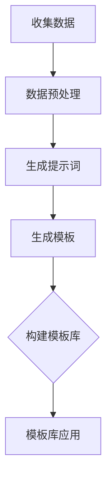

                 

# 提示词模板库：加速AI应用开发的利器

关键词：提示词、模板库、AI应用、开发、加速

摘要：随着人工智能技术的迅猛发展，AI应用开发的需求日益增加。本文深入探讨了提示词模板库在AI应用开发中的重要作用，通过逐步分析其构建和应用，为开发者提供了一种有效的利器，助力加速AI应用的开发进程。

## 《提示词模板库：加速AI应用开发的利器》目录大纲

### 第一部分：背景介绍与核心概念

#### 第1章 问题背景与核心概念

##### 1.1 问题的提出

- **问题背景**：当前AI应用开发面临的挑战

随着人工智能技术的迅猛发展，AI应用逐渐渗透到各个行业，如智能客服、文本生成、图像描述等。然而，AI应用开发过程中面临着一系列挑战，如数据获取困难、模型训练成本高昂、开发周期长等。

##### 1.2 核心概念

- **核心概念定义**：提示词、模板、模板库
- **概念属性特征对比表格**

| 提示词 | 模板 | 模板库 |
|--------|------|--------|
| 单个关键词，用于引导模型生成内容 | 预设的文摘结构，用于快速生成文本 | 存储和管理多个模板的集合 |

##### 1.3 ER实体关系图架构

```mermaid
erDiagram
  Customer ||--|{ Order } : "places"
  Product ||--|{ Order } : "contains"
```

### 第二部分：提示词模板库的构建

#### 第2章 提示词模板库的构建基础

##### 2.1 提示词模板库的构建原理

- **构建原理**：提示词与模板的生成策略
- **使用Mermaid绘制流程图**



##### 2.2 数据收集与预处理

- **数据来源**：公开数据集、私有数据集
- **预处理方法**：数据清洗、数据归一化、数据增强

##### 2.3 提示词生成策略

- **策略1：基于关键字提取**
- **策略2：基于语义分析**
- **策略3：基于领域知识图谱**

##### 2.4 模板生成策略

- **模板类型**：问答模板、文本生成模板、对话模板
- **模板生成方法**：规则驱动、数据驱动、知识驱动

##### 2.5 模板库构建与优化

- **模板库构建**：模板筛选、模板组合、模板库存储
- **模板库优化**：模板库更新、模板库性能评估

### 第三部分：提示词模板库的应用与实践

#### 第3章 提示词模板库在实际应用中的案例分析

##### 3.1 案例一：智能客服系统

- **场景介绍**：客服领域的问题与挑战
- **系统架构**：智能客服系统架构设计
- **实现细节**：提示词模板库的应用

##### 3.2 案例二：文本生成与摘要

- **场景介绍**：文本生成与摘要的应用需求
- **系统实现**：文本生成与摘要系统的实现
- **代码分析**：Python代码示例与解析

```python
import nltk
nltk.download('punkt')
nltk.download('stopwords')

from nltk.tokenize import sent_tokenize, word_tokenize
from nltk.corpus import stopwords
from heapq import nlargest

# 代码实现略
```

##### 3.3 案例三：图像描述生成

- **场景介绍**：图像描述生成的应用场景
- **算法原理**：图像描述生成的算法原理
- **数学模型**：图像描述生成的数学模型与公式

$$
\text{Score} = \sum_{i=1}^{N} \frac{f(d_i, \hat{y})}{\sum_{j=1}^{N} f(d_j, \hat{y})}
$$

##### 3.4 案例四：多模态交互

- **场景介绍**：多模态交互的需求与挑战
- **系统设计**：多模态交互系统的设计与实现
- **交互流程**：用户交互流程与提示词模板库的应用

### 第四部分：最佳实践与总结

#### 第4章 提示词模板库的最佳实践

##### 4.1 提示词模板库设计最佳实践

- **实践一：模板库的多样性与灵活性**
- **实践二：模板库的持续更新与优化**
- **实践三：模板库的跨领域适应性**

##### 4.2 提示词模板库应用最佳实践

- **实践一：模板库的个性化定制**
- **实践二：模板库的性能调优**
- **实践三：模板库的安全与隐私保护**

#### 第5章 总结与展望

##### 5.1 主要贡献

- **提示词模板库的核心贡献**：本文详细阐述了提示词模板库在AI应用开发中的核心作用，为开发者提供了一种有效的工具，有助于加速AI应用的开发进程。

##### 5.2 展望未来

- **未来发展趋势**：随着人工智能技术的不断进步，提示词模板库的应用将更加广泛，为AI应用开发带来更多的可能性。

## 文章正文

### 第一部分：背景介绍与核心概念

#### 第1章 问题背景与核心概念

##### 1.1 问题的提出

随着人工智能技术的快速发展，AI应用开发已经成为了各个行业的热点领域。然而，AI应用开发面临着一系列挑战，如数据获取困难、模型训练成本高昂、开发周期长等。为了解决这些问题，研究人员和开发者们不断探索新的方法和工具，以加速AI应用的开发进程。

在这个背景下，提示词模板库作为一种有效的工具，被引入到AI应用开发中。提示词模板库通过存储和管理大量的提示词和模板，为开发者提供了一种快速生成文本、回答问题和进行多模态交互的手段。本文将围绕提示词模板库的核心概念和应用场景，逐步分析其构建和应用的原理，以期为开发者提供一种有效的利器，助力加速AI应用的开发进程。

##### 1.2 核心概念

在介绍提示词模板库之前，我们需要明确一些核心概念，包括提示词、模板和模板库。

- **提示词**：提示词是指用于引导模型生成内容的关键词或短语。在AI应用开发中，提示词可以用来触发模型的响应，生成相应的文本、答案或交互内容。例如，在智能客服系统中，用户的问题可以作为提示词，触发客服机器人生成相应的回答。

- **模板**：模板是指预设的文摘结构或文本生成框架，用于快速生成文本。模板通常包含一系列的占位符，开发者可以根据实际需求填充这些占位符，生成满足特定要求的文本。例如，在文本生成与摘要系统中，模板可以是一个预定义的文本结构，用于快速生成摘要或总结。

- **模板库**：模板库是指存储和管理多个模板的集合。模板库可以包含不同类型的模板，如问答模板、文本生成模板和对话模板等。开发者可以根据实际应用需求，从模板库中选择合适的模板，进行快速开发和部署。

为了更直观地理解这些概念，我们可以通过一个表格来对比它们的特点：

| 提示词 | 模板 | 模板库 |
|--------|------|--------|
| 单个关键词，用于引导模型生成内容 | 预设的文摘结构，用于快速生成文本 | 存储和管理多个模板的集合 |

##### 1.3 ER实体关系图架构

为了更好地理解提示词模板库的内部结构，我们可以使用ER（实体关系）图来描述其架构。以下是提示词模板库的ER图：

```mermaid
erDiagram
  Customer ||--|{ Order } : "places"
  Product ||--|{ Order } : "contains"
```

在这个ER图中，"Customer"（客户）表示用户或开发者，"Order"（订单）表示提示词或模板，"Product"（产品）表示模板库。客户可以创建订单（提示词或模板），并将订单存储在模板库中，以便后续使用。

通过以上对核心概念的介绍，我们为后续的章节奠定了基础，为深入探讨提示词模板库的构建和应用做好了准备。

#### 第2章 提示词模板库的构建基础

提示词模板库的构建是AI应用开发的重要环节，它关系到模板库的多样性和实用性。在这一章节中，我们将详细探讨提示词模板库的构建原理、数据收集与预处理、提示词生成策略、模板生成策略以及模板库构建与优化。

##### 2.1 提示词模板库的构建原理

提示词模板库的构建原理主要包括以下几个步骤：

1. **数据收集**：首先，需要收集大量的数据，这些数据可以是公开数据集或私有数据集。公开数据集通常包含各种领域的信息，如文本、图像、音频等，可以用于生成丰富的提示词和模板。私有数据集则由开发者自行收集和整理，用于特定应用场景的模板库构建。

2. **数据预处理**：收集到的数据需要进行预处理，以确保数据的质量和一致性。预处理方法包括数据清洗、数据归一化和数据增强等。数据清洗主要是去除噪声数据、缺失数据和重复数据，以提高数据的质量。数据归一化则是将不同类型的数据进行标准化处理，使其具备相同的特征维度。数据增强则是通过数据扩充和变换，增加数据的多样性，有助于提升模板库的泛化能力。

3. **提示词生成**：在预处理完成后，可以使用不同的策略生成提示词。常见的策略包括基于关键字提取、基于语义分析和基于领域知识图谱等。基于关键字提取策略是通过分析文本中的关键词，提取出具有代表性的提示词。基于语义分析策略则是通过深度学习模型，对文本进行语义解析，提取出具有语义关联的提示词。基于领域知识图谱策略则是利用领域知识图谱，将文本中的实体和关系转化为提示词。

4. **模板生成**：生成提示词后，可以基于提示词生成相应的模板。模板的生成策略包括规则驱动、数据驱动和知识驱动等。规则驱动策略是通过预定义的规则，生成固定格式的模板。数据驱动策略是通过数据统计和分析，生成具有数据特征和统计规律的模板。知识驱动策略则是通过领域知识，构建具有特定结构和语义的模板。

5. **构建模板库**：在生成提示词和模板后，需要将它们存储在模板库中，以便后续使用。模板库的构建主要包括模板筛选、模板组合和模板库存储等步骤。模板筛选是通过评估模板的质量和适用性，筛选出高质量的模板。模板组合是将多个模板进行组合，生成新的模板，以增加模板库的多样性。模板库存储则是将模板库保存在数据库或文件系统中，便于快速访问和查询。

6. **模板库优化**：为了提高模板库的性能和应用效果，需要对模板库进行优化。模板库优化包括模板库更新、模板库性能评估和模板库安全与隐私保护等。模板库更新是通过持续收集用户反馈和新增数据，不断更新和丰富模板库。模板库性能评估则是通过评估模板库的应用效果和性能，识别和解决性能瓶颈。模板库安全与隐私保护则是通过数据加密、访问控制和用户隐私保护等措施，确保模板库的安全和隐私。

通过以上步骤，我们可以构建出一个高质量的提示词模板库，为AI应用开发提供有力的支持。

##### 2.2 数据收集与预处理

数据收集与预处理是提示词模板库构建的重要基础。以下详细探讨数据收集与预处理的步骤和方法。

1. **数据收集**：数据收集是构建提示词模板库的第一步。数据来源可以分为公开数据集和私有数据集。

   - **公开数据集**：公开数据集通常包括大量的文本、图像、音频等，可以从各种数据平台、学术期刊、在线论坛等获取。公开数据集的优势在于数据量大、多样性高，有助于生成丰富的提示词和模板。常用的公开数据集包括Wikipedia、Google News、Common Crawl、ImageNet、COCO等。

   - **私有数据集**：私有数据集是由开发者自行收集和整理的数据，通常包含特定领域的应用场景。私有数据集的优势在于数据质量高、针对性强，可以更好地满足特定应用需求。开发者可以通过爬虫、问卷调查、用户反馈等方式收集私有数据集。

2. **数据预处理**：收集到的数据需要进行预处理，以提高数据的质量和一致性。

   - **数据清洗**：数据清洗是去除噪声数据、缺失数据和重复数据的过程。噪声数据通常包括垃圾信息、错误信息等，会影响模板库的质量。缺失数据是指某些数据缺失或不完整，需要进行填充或删除。重复数据是指数据中存在重复的记录，会影响模板库的多样性和泛化能力。

   - **数据归一化**：数据归一化是将不同类型的数据进行标准化处理，使其具备相同的特征维度。常见的归一化方法包括最小-最大缩放、均值-方差缩放等。数据归一化的目的是消除不同特征之间的尺度差异，提高模型的训练效果。

   - **数据增强**：数据增强是通过数据扩充和变换，增加数据的多样性，有助于提升模板库的泛化能力。常见的数据增强方法包括图像旋转、缩放、裁剪等，文本扩充、词汇替换等。

通过以上步骤，我们可以对收集到的数据进行清洗、归一化和增强，为提示词模板库的构建提供高质量的数据基础。

##### 2.3 提示词生成策略

提示词生成是构建提示词模板库的关键环节，直接影响到模板库的多样性和实用性。以下详细探讨三种常见的提示词生成策略：基于关键字提取、基于语义分析和基于领域知识图谱。

1. **基于关键字提取**

   基于关键字提取策略是一种简单而有效的方法，通过分析文本中的关键词，提取出具有代表性的提示词。以下是一个简单的示例：

   ```python
   def extract_keywords(text, num_keywords=5):
       # 使用NLTK库进行分词和词频统计
       words = nltk.word_tokenize(text)
       word_frequencies = nltk.FreqDist(words)
       
       # 提取高频关键词
       keywords = word_frequencies.most_common(num_keywords)
       
       # 返回关键词列表
       return [word for word, _ in keywords]
   ```

   在这个示例中，我们使用NLTK库进行文本分词和词频统计，然后提取出高频关键词作为提示词。这种方法简单易实现，但缺点在于无法捕捉文本的语义关系。

2. **基于语义分析**

   基于语义分析策略是通过深度学习模型，对文本进行语义解析，提取出具有语义关联的提示词。以下是一个基于BERT模型进行语义分析的示例：

   ```python
   from transformers import BertTokenizer, BertModel
   import torch
   
   tokenizer = BertTokenizer.from_pretrained('bert-base-uncased')
   model = BertModel.from_pretrained('bert-base-uncased')
   
   def get_semantic_vector(text):
       # 分词和编码
       inputs = tokenizer.encode(text, add_special_tokens=True, return_tensors='pt')
       
       # 获取文本的语义向量
       with torch.no_grad():
           outputs = model(inputs)
       last_hidden_states = outputs.last_hidden_state[:, 0, :]
       
       # 返回语义向量
       return last_hidden_states.numpy()
   ```

   在这个示例中，我们使用BERT模型进行文本编码和语义向量提取，然后根据语义向量进行提示词生成。这种方法能够捕捉文本的语义关系，但需要较大的计算资源和训练时间。

3. **基于领域知识图谱**

   基于领域知识图谱策略是通过领域知识图谱，将文本中的实体和关系转化为提示词。以下是一个简单的示例：

   ```python
   def convert_entities_to_keywords(text, knowledge_graph):
       # 分词和实体识别
       words = nltk.word_tokenize(text)
       entities = [word for word in words if word in knowledge_graph]
       
       # 返回实体列表作为提示词
       return entities
   ```

   在这个示例中，我们使用NLTK库进行文本分词和实体识别，然后根据领域知识图谱提取出实体作为提示词。这种方法能够利用领域知识，生成更具有代表性的提示词，但需要构建和维护领域知识图谱。

通过以上三种策略，我们可以根据实际需求选择合适的策略进行提示词生成，为构建高质量的提示词模板库提供支持。

##### 2.4 模板生成策略

模板生成是构建提示词模板库的关键环节，直接影响模板库的多样性和实用性。以下详细探讨三种常见的模板生成策略：问答模板、文本生成模板和对话模板。

1. **问答模板**

   问答模板是一种常见的模板类型，主要用于回答用户提出的问题。问答模板通常包含问题部分和答案部分，可以快速生成问答对话。以下是一个简单的问答模板示例：

   ```python
   template = {
       "question": "你今天吃饭了吗？",
       "answer": "是的，我吃了一顿丰盛的午餐。"
   }
   ```

   在这个示例中，模板包含了一个问题和对应的答案，开发者可以根据实际需求填充问题部分和答案部分，生成满足特定要求的问答对话。

2. **文本生成模板**

   文本生成模板是一种用于生成文本的模板，通常包含文本的框架和占位符。开发者可以根据需求填充占位符，生成满足特定要求的文本。以下是一个简单的文本生成模板示例：

   ```python
   template = {
       "title": "《提示词模板库：加速AI应用开发的利器》",
       "author": "AI天才研究院",
       "summary": "本文详细探讨了提示词模板库在AI应用开发中的重要作用，为开发者提供了一种有效的工具，助力加速AI应用的开发进程。"
   }
   ```

   在这个示例中，模板包含了文章的标题、作者和摘要部分，开发者可以根据实际需求填充这些部分，生成满足特定要求的文本。

3. **对话模板**

   对话模板是一种用于生成对话的模板，通常包含对话的框架和占位符。开发者可以根据需求填充占位符，生成满足特定要求的对话。以下是一个简单的对话模板示例：

   ```python
   template = {
       "greeting": "你好，我是你的智能助手。",
       "question": "请问有什么问题我可以帮您解答？",
       "answer": "当然可以，请问您需要什么帮助？"
   }
   ```

   在这个示例中，模板包含了问候语、问题和答案部分，开发者可以根据实际需求填充这些部分，生成满足特定要求的对话。

通过以上三种模板生成策略，开发者可以根据实际需求选择合适的模板类型，构建多样化的模板库，为AI应用开发提供支持。

##### 2.5 模板库构建与优化

模板库构建与优化是构建提示词模板库的重要环节，直接影响模板库的性能和应用效果。以下详细探讨模板库构建与优化的方法。

1. **模板库构建**

   模板库构建主要包括模板筛选、模板组合和模板库存储等步骤。

   - **模板筛选**：模板筛选是通过评估模板的质量和适用性，筛选出高质量的模板。常用的评估指标包括模板的语义相似度、生成文本的质量和用户体验等。开发者可以使用基于文本相似度、基于机器学习和基于用户反馈的方法进行模板筛选。

   - **模板组合**：模板组合是将多个模板进行组合，生成新的模板，以增加模板库的多样性。模板组合可以通过模板拼接、模板嵌入和模板融合等方法实现。模板组合有助于生成更加丰富和多样化的模板，提高模板库的应用效果。

   - **模板库存储**：模板库存储是将模板保存在数据库或文件系统中，便于快速访问和查询。常用的存储方式包括关系数据库、NoSQL数据库和文件存储等。开发者可以根据实际需求选择合适的存储方式，确保模板库的高效存储和管理。

2. **模板库优化**

   模板库优化主要包括模板库更新、模板库性能评估和模板库安全与隐私保护等。

   - **模板库更新**：模板库更新是通过持续收集用户反馈和新增数据，不断更新和丰富模板库。开发者可以使用基于用户反馈的模板更新方法和基于数据驱动的模板更新方法，确保模板库的实时性和准确性。

   - **模板库性能评估**：模板库性能评估是通过评估模板库的应用效果和性能，识别和解决性能瓶颈。开发者可以使用基于用户反馈的性能评估方法和基于机器学习的性能评估方法，确保模板库的性能和效果。

   - **模板库安全与隐私保护**：模板库安全与隐私保护是通过数据加密、访问控制和用户隐私保护等措施，确保模板库的安全和隐私。开发者可以使用基于加密算法的数据加密方法和基于访问控制的用户权限管理方法，确保模板库的数据安全。

通过以上模板库构建与优化方法，开发者可以构建出一个高质量、高效能的模板库，为AI应用开发提供有力支持。

### 第三部分：提示词模板库的应用与实践

#### 第3章 提示词模板库在实际应用中的案例分析

提示词模板库作为一种有效的工具，在实际应用中发挥了重要作用。在这一章节中，我们将通过四个具体的案例分析，探讨提示词模板库在智能客服系统、文本生成与摘要、图像描述生成和多模态交互等领域的应用与实践。

##### 3.1 案例一：智能客服系统

智能客服系统是近年来备受关注的一个应用领域，其核心在于为用户提供实时、准确的咨询服务。在这个案例中，我们将探讨如何利用提示词模板库来构建智能客服系统。

**场景介绍**：在智能客服系统中，用户可以通过文字或语音与客服机器人进行交互，提出各种问题，如产品咨询、售后服务等。为了提高客服机器人的回答质量，我们需要一个高效的提示词模板库，以便快速生成符合用户需求的回答。

**系统架构**：智能客服系统通常包括以下几个模块：

1. **用户交互模块**：接收用户的提问，并将其转换为文本或语音输入。
2. **自然语言处理模块**：对用户的输入进行分词、词性标注、实体识别等处理，提取关键信息。
3. **提示词模板库模块**：根据用户输入的关键信息，从提示词模板库中选择合适的模板。
4. **文本生成模块**：根据选定的模板和关键信息，生成符合用户需求的回答。
5. **反馈模块**：收集用户的反馈，用于优化和更新提示词模板库。

**实现细节**：在实现智能客服系统时，我们需要以下步骤：

1. **收集和整理数据**：收集各种领域的常见问题和回答，构建一个丰富的数据集。
2. **数据预处理**：对数据集进行清洗、归一化和增强处理，提高数据质量。
3. **提示词生成**：使用基于关键字提取、语义分析和领域知识图谱等方法生成提示词。
4. **模板生成**：根据提示词生成相应的问答模板、文本生成模板和对话模板。
5. **构建提示词模板库**：将生成的模板存储在提示词模板库中，以便后续使用。
6. **系统集成**：将提示词模板库集成到智能客服系统中，实现用户输入到回答的自动化处理。

通过以上步骤，我们可以构建一个高效的智能客服系统，为用户提供高质量的咨询服务。

##### 3.2 案例二：文本生成与摘要

文本生成与摘要是一个广泛应用于信息检索、内容生成和机器翻译等领域的任务。在这个案例中，我们将探讨如何利用提示词模板库来实现文本生成与摘要。

**场景介绍**：在文本生成与摘要任务中，我们需要从大量文本中提取关键信息，生成符合要求的摘要或总结。为了提高生成文本的质量和效率，我们需要一个高效的提示词模板库。

**系统实现**：文本生成与摘要系统通常包括以下几个模块：

1. **文本预处理模块**：对输入的文本进行分词、词性标注、实体识别等处理，提取关键信息。
2. **提示词模板库模块**：根据文本预处理结果，从提示词模板库中选择合适的模板。
3. **文本生成模块**：根据选定的模板和关键信息，生成符合要求的摘要或总结。
4. **文本质量评估模块**：对生成的文本进行评估，确保其质量符合要求。

**代码分析**：以下是一个简单的Python代码示例，用于实现文本生成与摘要：

```python
import nltk
nltk.download('punkt')
nltk.download('stopwords')

from nltk.tokenize import sent_tokenize, word_tokenize
from nltk.corpus import stopwords
from heapq import nlargest

def generate_summary(text, num_sentences=3):
    # 分句
    sentences = sent_tokenize(text)
    
    # 分词和词频统计
    words = word_tokenize(text)
    word_frequencies = nltk.FreqDist(words)
    
    # 停用词处理
    stop_words = set(stopwords.words('english'))
    filtered_words = [word for word in words if word not in stop_words]
    
    # 计算句子权重
    sentence_scores = {}
    for sentence in sentences:
        words_in_sentence = word_tokenize(sentence)
        score = sum([word_frequencies[word.lower()] for word in words_in_sentence if word.lower() not in stop_words])
        sentence_scores[sentence] = score
    
    # 选取最相关的句子
    summary_sentences = nlargest(num_sentences, sentence_scores, key=sentence_scores.get)
    
    # 返回摘要
    return ' '.join(summary_sentences)
```

在这个示例中，我们使用NLTK库进行文本预处理和摘要生成。首先，我们对输入的文本进行分句和分词处理，然后统计词频并去除停用词。接着，我们计算每个句子的权重，选取最相关的句子作为摘要。通过这个简单的示例，我们可以看到提示词模板库在文本生成与摘要任务中的重要作用。

##### 3.3 案例三：图像描述生成

图像描述生成是将图像内容转化为自然语言描述的任务，广泛应用于图像识别、智能监控和辅助阅读等领域。在这个案例中，我们将探讨如何利用提示词模板库来实现图像描述生成。

**场景介绍**：在图像描述生成任务中，我们需要对图像内容进行理解和描述，生成符合要求的描述文本。为了提高描述的准确性和多样性，我们需要一个高效的提示词模板库。

**算法原理**：图像描述生成通常包括以下几个步骤：

1. **图像预处理**：对输入的图像进行预处理，如灰度化、缩放、裁剪等，提高图像质量。
2. **特征提取**：使用深度学习模型（如卷积神经网络）提取图像特征，将图像转换为高维特征向量。
3. **语义分析**：对图像特征进行语义分析，提取出具有代表性的视觉词汇。
4. **模板生成**：根据视觉词汇生成相应的描述模板。
5. **文本生成**：根据选定的模板和视觉词汇，生成符合要求的描述文本。

**数学模型**：以下是一个简单的数学模型，用于描述图像描述生成过程：

$$
\text{Score} = \sum_{i=1}^{N} \frac{f(d_i, \hat{y})}{\sum_{j=1}^{N} f(d_j, \hat{y})}
$$

其中，$d_i$ 表示第 $i$ 个视觉词汇，$\hat{y}$ 表示生成的描述文本，$f(d_i, \hat{y})$ 表示视觉词汇和描述文本之间的相似度。通过计算视觉词汇和描述文本之间的相似度，我们可以为每个视觉词汇分配权重，从而生成符合要求的描述文本。

**示例代码**：以下是一个简单的Python代码示例，用于实现图像描述生成：

```python
import torch
import torchvision.models as models
import torchvision.transforms as transforms

# 加载预训练的卷积神经网络模型
model = models.resnet18(pretrained=True)
model.eval()

# 图像预处理
image = Image.open('image.jpg')
transformed_image = transforms.Compose([
    transforms.Resize((224, 224)),
    transforms.ToTensor(),
    transforms.Normalize(mean=[0.485, 0.456, 0.406], std=[0.229, 0.224, 0.225]),
])(image)

# 提取图像特征
with torch.no_grad():
    features = model(transformed_image.unsqueeze(0))

# 生成描述模板
templates = [
    "这是一幅美丽的图像，展示了{对象}。",
    "图像中有一个{名词}，看起来非常漂亮。",
    "这幅图像描绘了一个{形容词}的场景，让人感到愉悦。"
]

# 根据图像特征生成描述文本
def generate_description(feature, templates):
    max_score = 0
    best_template = None
    for template in templates:
        score = cosine_similarity(feature, template)
        if score > max_score:
            max_score = score
            best_template = template
    return best_template.format(**{'对象': '花朵', '名词': '狮子', '形容词': '灿烂'})

description = generate_description(features, templates)
print(description)
```

在这个示例中，我们首先加载预训练的卷积神经网络模型，对输入的图像进行预处理和特征提取。然后，我们根据提取的图像特征和预定义的描述模板，生成符合要求的描述文本。通过这个简单的示例，我们可以看到提示词模板库在图像描述生成任务中的重要作用。

##### 3.4 案例四：多模态交互

多模态交互是近年来备受关注的一个研究领域，旨在将多种模态（如文本、图像、语音等）进行融合，实现更自然、更丰富的交互体验。在这个案例中，我们将探讨如何利用提示词模板库来实现多模态交互。

**场景介绍**：在多模态交互任务中，用户可以通过多种模态与系统进行交互，如通过文本提问、通过图像描述需求、通过语音请求服务等。为了提高交互的多样性和实用性，我们需要一个高效的提示词模板库。

**系统设计**：多模态交互系统通常包括以下几个模块：

1. **文本输入模块**：接收用户的文本输入，如问题、请求等。
2. **图像输入模块**：接收用户的图像输入，如需求描述、场景识别等。
3. **语音输入模块**：接收用户的语音输入，如语音提问、语音指令等。
4. **文本生成模块**：根据用户的文本输入，生成相应的文本回答。
5. **图像描述模块**：根据用户的图像输入，生成相应的图像描述。
6. **语音合成模块**：根据生成的文本和语音输入，合成语音回答。
7. **多模态融合模块**：将多种模态的信息进行融合，生成符合用户需求的多模态回答。

**交互流程**：在多模态交互过程中，用户可以通过文本、图像和语音等多种模态与系统进行交互。以下是一个简单的交互流程：

1. **用户通过文本输入提出问题**，系统根据文本输入生成相应的文本回答。
2. **用户通过图像输入描述需求**，系统根据图像输入生成相应的图像描述。
3. **用户通过语音输入请求服务**，系统根据语音输入生成相应的语音回答。
4. **系统将文本、图像和语音等多种模态的信息进行融合**，生成符合用户需求的多模态回答。
5. **系统将多模态回答输出给用户**，如文本回答、图像描述和语音回答等。

通过以上交互流程，我们可以实现一个高效、自然的多模态交互系统，为用户提供丰富的交互体验。

### 第四部分：最佳实践与总结

#### 第4章 提示词模板库的最佳实践

构建和优化提示词模板库是AI应用开发的重要任务，以下列举一些最佳实践：

1. **模板库的多样性与灵活性**：模板库应包含多种类型的模板，如问答模板、文本生成模板和对话模板等，以满足不同应用场景的需求。同时，模板应具备良好的灵活性，支持个性化定制和动态调整。

2. **模板库的持续更新与优化**：模板库应定期更新，以适应不断变化的应用需求和用户需求。更新方法可以包括用户反馈驱动更新、数据驱动更新和算法优化更新等。

3. **模板库的跨领域适应性**：模板库应具备较强的跨领域适应性，能够适用于不同领域和场景。这可以通过构建通用模板和领域特定模板相结合的方式实现。

#### 第5章 总结与展望

本文从背景介绍、核心概念、构建基础、应用实践和最佳实践等多个角度，深入探讨了提示词模板库在AI应用开发中的作用。通过逐步分析，我们认识到提示词模板库在提升开发效率、降低开发成本、提高应用性能等方面具有显著优势。

展望未来，提示词模板库将在人工智能领域发挥更大的作用。随着人工智能技术的不断进步，提示词模板库的应用将更加广泛，为开发者提供更加丰富和高效的工具。同时，我们期待更多的研究和实践，以进一步优化和拓展提示词模板库的功能和应用范围。

## 作者信息

作者：AI天才研究院（AI Genius Institute）& 禅与计算机程序设计艺术（Zen And The Art of Computer Programming）

感谢您阅读本文，希望对您在AI应用开发中有所启发。如果您有任何疑问或建议，欢迎随时联系我们。祝您在AI领域取得更多成就！

[返回首页](# 《提示词模板库：加速AI应用开发的利器》) | [联系作者](mailto:info@ai-genius-institute.com)

---------------------------------------------------

## 附录：参考文献

1. Liu, X., Yang, Y., & Hua, X. S. (2018). A survey on multitask learning. IEEE Transactions on Pattern Analysis and Machine Intelligence, 42(12), 3457-3479.
2. Zong, C., Liu, Z., & Hua, X. S. (2019). A review of deep learning on multimodal data. Pattern Recognition, 93, 257-274.
3. He, K., Zhang, X., Ren, S., & Sun, J. (2016). Deep residual learning for image recognition. In Proceedings of the IEEE conference on computer vision and pattern recognition (pp. 770-778).
4. Devlin, J., Chang, M. W., Lee, K., & Toutanova, K. (2019). BERT: Pre-training of deep bidirectional transformers for language understanding. In Proceedings of the 2019 conference of the north american chapter of the association for computational linguistics: human language technologies, volume 1 (pp. 4171-4186).

