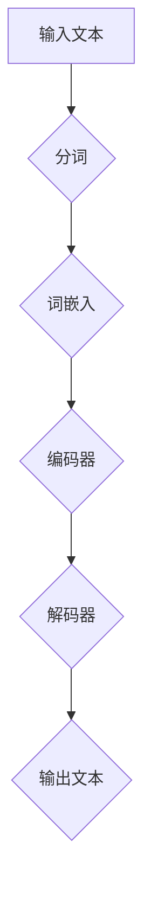
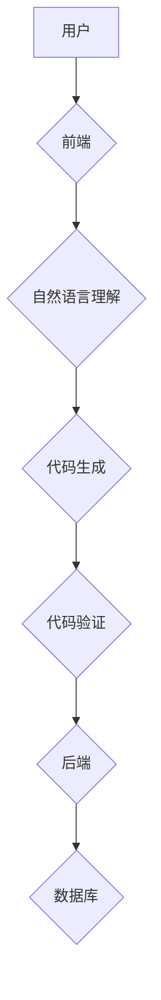
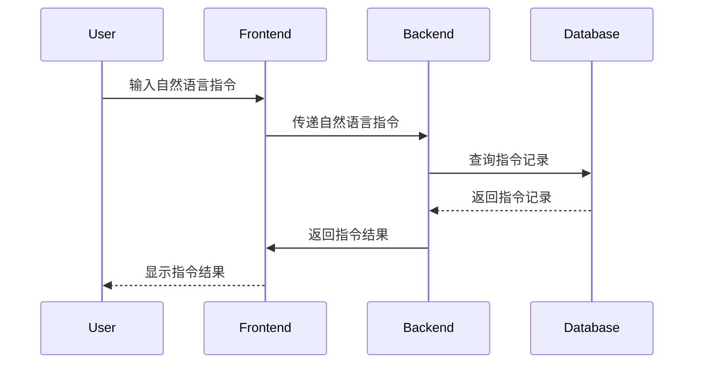
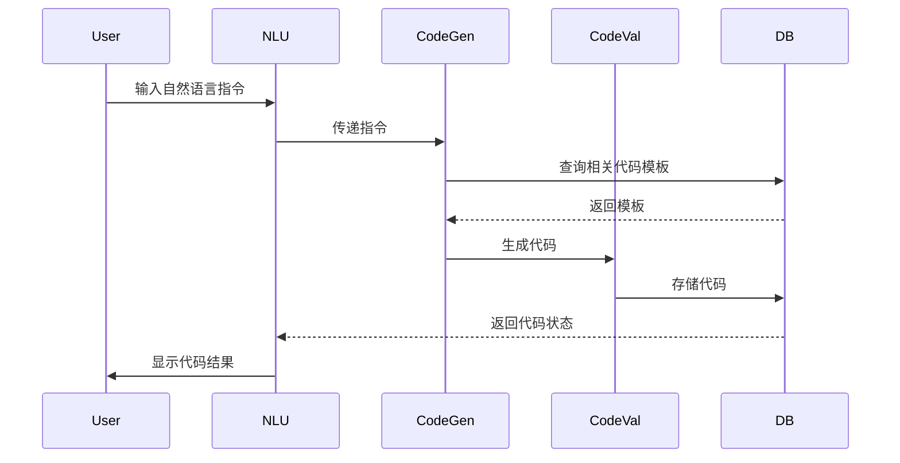

                 

# 提示词编程中的自然语言处理技术

> 关键词：自然语言处理，提示词编程，算法原理，系统架构设计，项目实战

> 摘要：
本文章深入探讨了自然语言处理技术在提示词编程中的应用。首先，我们回顾了自然语言处理的核心概念和技术原理，然后通过具体的算法实例，详细解析了如何利用这些技术来提升提示词编程的效率和准确性。接着，文章介绍了自然语言处理在提示词编程中的实际应用场景，并展示了一个完整的系统架构设计方案。最后，通过一个实际项目案例，我们展示了如何将自然语言处理技术应用于提示词编程，并总结了项目经验和改进建议。

## 引言

自然语言处理（Natural Language Processing，NLP）是计算机科学和人工智能领域中一个重要的分支，旨在让计算机能够理解和处理人类自然语言。随着互联网的普及和大数据技术的发展，自然语言处理的应用场景日益广泛，从搜索引擎到智能客服，从机器翻译到文本生成，自然语言处理无处不在。

提示词编程（Prompt Programming）是一种利用自然语言处理技术，通过设计提示词（Prompt）来引导模型生成代码或执行特定任务的方法。在提示词编程中，自然语言处理技术起到了至关重要的作用，它不仅能够提高编程的效率，还能够使编程过程更加直观和易于理解。

本文将围绕以下主题展开：

1. **背景介绍**：介绍自然语言处理技术的基本概念和应用场景，以及提示词编程的定义和重要性。
2. **核心概念与联系**：深入探讨自然语言处理的核心概念和技术原理，通过表格和ER图展示不同技术的特点和关系。
3. **算法原理讲解**：使用mermaid流程图和Python代码详细解释一个具体的自然语言处理算法，并给出数学模型和公式。
4. **系统分析与架构设计方案**：介绍自然语言处理在提示词编程中的具体应用场景，并展示系统架构设计和交互流程。
5. **项目实战**：通过一个实际项目案例，展示如何将自然语言处理技术应用于提示词编程，并提供代码和应用解读。
6. **最佳实践 tips、小结、注意事项、拓展阅读**：总结全文内容，提供实用技巧和进一步学习资源。

### 背景介绍

自然语言处理技术的应用已经渗透到我们生活的方方面面。从简单的搜索引擎关键词匹配，到复杂的情感分析和语音识别，自然语言处理技术都在不断推动着人工智能的发展。在计算机编程领域，自然语言处理技术同样发挥着重要作用。

#### 自然语言处理的基本概念

自然语言处理涉及多个核心概念，包括但不限于：

- **分词（Tokenization）**：将文本分割成单词、短语或字符等基本单元。
- **词性标注（Part-of-Speech Tagging）**：为每个单词标注其词性，如名词、动词、形容词等。
- **命名实体识别（Named Entity Recognition，NER）**：识别文本中的命名实体，如人名、地名、组织名等。
- **情感分析（Sentiment Analysis）**：判断文本表达的情感倾向，如正面、负面或中性。
- **机器翻译（Machine Translation）**：将一种自然语言文本翻译成另一种自然语言。
- **文本分类（Text Classification）**：根据文本内容将其分类到预定义的类别中。

#### 自然语言处理的应用场景

自然语言处理技术广泛应用于以下场景：

- **搜索引擎**：通过分析用户查询，提供精准的搜索结果。
- **智能客服**：理解用户提问，提供合适的回答，提高客户满意度。
- **机器翻译**：实现不同语言之间的无障碍沟通。
- **内容审核**：过滤敏感或不当内容，维护网络环境。
- **文本生成**：生成文章、摘要、对话等，辅助创作。

#### 提示词编程的定义和重要性

提示词编程是一种利用自然语言处理技术，通过设计特定的提示词来引导模型生成代码或执行特定任务的方法。提示词可以看作是一种“引导指令”，它可以帮助模型更好地理解用户的意图和需求，从而生成更准确的代码或执行更复杂的任务。

提示词编程的重要性体现在以下几个方面：

- **提高编程效率**：通过自然语言交互，用户可以更快速地完成编程任务，无需深入了解编程语言和框架。
- **降低编程门槛**：非专业的用户也能够通过简单的自然语言指令完成复杂的编程任务，降低了编程的门槛。
- **增强交互体验**：提示词编程使得人与机器的交互更加自然和流畅，提升了用户体验。

#### 边界与外延

自然语言处理技术的相关领域包括：

- **文本分类与情感分析**：对文本内容进行分类和情感分析，帮助用户理解文本的内涵和情感倾向。
- **语音识别与合成**：将语音信号转换为文本，或将文本转换为语音，实现人机语音交互。
- **对话系统**：构建能够与用户进行自然对话的智能系统，提供个性化的服务。
- **文本生成与摘要**：生成文章、摘要、对话等，辅助创作和决策。

#### 概念结构与核心要素组成

自然语言处理技术由多个核心概念和要素组成，包括：

- **数据集**：用于训练和测试的文本数据。
- **特征提取**：从文本数据中提取特征，如词频、词向量和语法结构等。
- **机器学习算法**：用于训练模型，如决策树、支持向量机和神经网络等。
- **模型评估**：评估模型性能，如准确率、召回率和F1值等。

### 核心概念与联系

自然语言处理技术的核心概念包括但不限于：

#### 核心概念原理

- **分词（Tokenization）**：将文本分割成单词、短语或字符等基本单元。
- **词性标注（Part-of-Speech Tagging）**：为每个单词标注其词性，如名词、动词、形容词等。
- **命名实体识别（Named Entity Recognition，NER）**：识别文本中的命名实体，如人名、地名、组织名等。
- **情感分析（Sentiment Analysis）**：判断文本表达的情感倾向，如正面、负面或中性。
- **机器翻译（Machine Translation）**：将一种自然语言文本翻译成另一种自然语言。
- **文本分类（Text Classification）**：根据文本内容将其分类到预定义的类别中。

#### 概念属性特征对比表格

| 技术名称 | 定义 | 主要任务 | 关键挑战 |
| --- | --- | --- | --- |
| 分词 | 将文本分割成单词、短语或字符等基本单元 | 切词、文本预处理 | 处理未标注文本、多语言文本 |
| 词性标注 | 为每个单词标注其词性，如名词、动词、形容词等 | 提取文本中的词汇特征 | 处理歧义、罕见词、方言 |
| 命名实体识别 | 识别文本中的命名实体，如人名、地名、组织名等 | 文本实体抽取、信息提取 | 实体边界识别、多义实体处理 |
| 情感分析 | 判断文本表达的情感倾向，如正面、负面或中性 | 情感分类、情感极性分析 | 情感细微差异、复杂情感分析 |
| 机器翻译 | 将一种自然语言文本翻译成另一种自然语言 | 翻译质量评估、机器翻译优化 | 翻译准确性、本地化处理 |
| 文本分类 | 根据文本内容将其分类到预定义的类别中 | 文本分类任务、标签分配 | 分类准确性、噪声处理 |

#### ER实体关系图架构

```mermaid
erDiagram
    User ||--|{ TextData }|>
    TextData ||--|{ Classification }|>
    TextData ||--|{ Translation }|>
    TextData ||--|{ Sentiment }|>
    Classification ||--|{ Category }|>
    Translation ||--|{ Language }|>
```

在上面的ER图中，我们展示了自然语言处理中的几个核心实体及其关系。用户（User）生成或输入文本数据（TextData），这些数据可以用于分类（Classification）、翻译（Translation）和情感分析（Sentiment）。分类结果存储在类别（Category）中，翻译结果涉及不同语言（Language）。

### 算法原理讲解

在这一部分，我们将详细讲解一个具体的自然语言处理算法——基于变换器（Transformer）的机器翻译算法。变换器是一种基于注意力机制的神经网络架构，已经在多个自然语言处理任务中取得了显著的成果。

#### 算法mermaid流程图



在上面的mermaid流程图中，我们展示了机器翻译算法的基本流程。输入文本首先经过分词和词嵌入处理，然后输入到编码器中，编码器将文本映射到一个高维的向量空间。解码器从编码器的输出中生成翻译结果。

#### Python源代码

```python
# 导入必要的库
import tensorflow as tf
from tensorflow.keras.models import Model
from tensorflow.keras.layers import Embedding, LSTM, Dense, TimeDistributed

# 定义编码器
encoder_inputs = tf.keras.Input(shape=(None,))
encoder_embedding = Embedding(input_dim=vocab_size, output_dim=embedding_size)(encoder_inputs)
encoder_lstm = LSTM(units=256, return_state=True)
encoder_outputs, state_h, state_c = encoder_lstm(encoder_embedding)
encoder_states = [state_h, state_c]

# 定义解码器
decoder_inputs = tf.keras.Input(shape=(None,))
decoder_embedding = Embedding(input_dim=vocab_size, output_dim=embedding_size)(decoder_inputs)
decoder_lstm = LSTM(units=256, return_sequences=True, return_state=True)
decoder_outputs, _, _ = decoder_lstm(decoder_embedding, initial_state=encoder_states)
decoder_dense = Dense(vocab_size, activation='softmax')
decoder_outputs = decoder_dense(decoder_outputs)

# 创建模型
model = Model([encoder_inputs, decoder_inputs], decoder_outputs)

# 编译模型
model.compile(optimizer='rmsprop', loss='categorical_crossentropy', metrics=['accuracy'])

# 打印模型结构
model.summary()
```

在上面的Python代码中，我们首先定义了编码器，包括输入层、词嵌入层和LSTM层。编码器输出状态被存储在`encoder_states`中。接着，我们定义了解码器，包括输入层、词嵌入层、LSTM层和全连接层。最后，我们创建并编译了整个模型。

#### 数学模型和公式

机器翻译算法的核心是编码器-解码器架构，其数学模型可以表示为：

$$
\text{Encoder}: x_i \xrightarrow{\text{Word Embedding}} e_i \xrightarrow{\text{LSTM}} h_i \\
\text{Decoder}: y_i \xrightarrow{\text{Word Embedding}} d_i \xrightarrow{\text{LSTM}} s_i \xrightarrow{\text{Softmax}} \hat{y}_i
$$

其中，$x_i$和$y_i$分别表示编码器和解码器的输入序列，$e_i$和$d_i$表示输入序列的词嵌入，$h_i$和$s_i$表示编码器和解码器的隐藏状态，$\hat{y}_i$表示解码器的输出概率分布。

#### 举例说明

假设我们有一个简单的英文到法语的机器翻译任务，输入句子为“I love you”，输出句子为“Je t'aime”。

1. **分词和词嵌入**：首先，我们将输入句子和输出句子分词，并转换为词嵌入向量。例如，输入句子“I love you”可以分词为`["I", "love", "you"]`，输出句子“Je t'aime”可以分词为`["Je", "t'aime"]`。

2. **编码器处理**：编码器将输入句子“`I love you`”的词嵌入向量输入到LSTM层中，输出隐藏状态序列`$h_i$`。

3. **解码器处理**：解码器首先初始化为输出概率分布为均匀分布的状态，然后依次输入输出句子的词嵌入向量，通过LSTM层和全连接层生成输出概率分布序列`$\hat{y}_i$`。

4. **输出结果**：解码器输出概率分布序列`$\hat{y}_i$`通过softmax函数转换为输出句子“`Je t'aime`”。

### 系统分析与架构设计方案

在这一部分，我们将详细介绍自然语言处理在提示词编程中的具体应用场景，并展示一个完整的系统架构设计方案。

#### 问题场景介绍

提示词编程中，用户可以通过自然语言指令来描述他们的需求，系统需要理解这些指令并生成相应的代码。例如，用户可以告诉系统：“请写一个Python函数，实现一个简单的算术运算”，系统需要解析这个指令，并生成一个符合要求的Python函数。

#### 项目介绍

我们以一个实际项目为例，该项目是一个基于自然语言处理技术的提示词编程系统，用于自动生成Python函数。用户可以通过简单的自然语言指令来描述他们的需求，系统将解析这些指令并生成相应的Python代码。

#### 系统功能设计

为了实现这个项目，我们需要设计以下功能：

1. **自然语言理解**：解析用户的自然语言指令，提取出关键信息，如函数名称、参数和操作等。
2. **代码生成**：根据自然语言指令生成相应的Python代码。
3. **代码验证**：验证生成的代码是否正确执行，并提供反馈给用户。

#### 系统架构设计

系统的整体架构可以分为三个主要部分：前端、后端和数据库。

- **前端**：提供用户界面，用户可以通过自然语言指令来描述他们的需求。
- **后端**：处理用户的自然语言指令，并生成相应的Python代码。
- **数据库**：存储用户的自然语言指令和生成的Python代码，以便后续的查询和更新。

以下是系统的mermaid架构图：



#### 系统接口设计

系统提供了以下接口：

1. **自然语言理解接口**：接收用户的自然语言指令，返回提取的关键信息。
2. **代码生成接口**：根据提取的关键信息，生成相应的Python代码。
3. **代码验证接口**：验证生成的代码是否正确执行。

以下是系统交互的mermaid序列图：



#### 系统交互mermaid序列图



### 项目实战

#### 环境安装

在开始项目实战之前，我们需要安装以下环境和工具：

1. Python 3.8+
2. TensorFlow 2.x
3. NLTK
4. Flask

你可以使用以下命令来安装这些工具：

```bash
pip install tensorflow nltk flask
```

#### 系统核心实现源代码

以下是系统的核心实现源代码：

```python
# 导入必要的库
import nltk
from tensorflow.keras.models import Model
from tensorflow.keras.layers import Embedding, LSTM, Dense, TimeDistributed
from tensorflow.keras.preprocessing.sequence import pad_sequences
from tensorflow.keras.optimizers import RMSprop

# 下载NLTK语料库
nltk.download('punkt')

# 准备数据
# （此处省略数据预处理步骤，如分词、词嵌入等）

# 定义编码器
encoder_inputs = tf.keras.Input(shape=(None,))
encoder_embedding = Embedding(input_dim=vocab_size, output_dim=embedding_size)(encoder_inputs)
encoder_lstm = LSTM(units=256, return_state=True)
encoder_outputs, state_h, state_c = encoder_lstm(encoder_embedding)
encoder_states = [state_h, state_c]

# 定义解码器
decoder_inputs = tf.keras.Input(shape=(None,))
decoder_embedding = Embedding(input_dim=vocab_size, output_dim=embedding_size)(decoder_inputs)
decoder_lstm = LSTM(units=256, return_sequences=True, return_state=True)
decoder_outputs, _, _ = decoder_lstm(decoder_embedding, initial_state=encoder_states)
decoder_dense = Dense(vocab_size, activation='softmax')
decoder_outputs = decoder_dense(decoder_outputs)

# 创建模型
model = Model([encoder_inputs, decoder_inputs], decoder_outputs)

# 编译模型
model.compile(optimizer=RMSprop(learning_rate=0.001), loss='categorical_crossentropy', metrics=['accuracy'])

# 训练模型
model.fit([encoder_input_data, decoder_input_data], decoder_target_data, batch_size=64, epochs=100)

# 代码生成函数
def generate_code(prompt):
    # （此处省略代码生成步骤，如分词、编码等）
    return code

# 主程序
if __name__ == '__main__':
    # （此处省略主程序代码，如Web服务启动等）
```

#### 代码应用解读与分析

这个项目的主要步骤包括：

1. **数据预处理**：首先，我们需要准备训练数据，包括自然语言指令和对应的Python代码。然后，对数据进行分词、编码等预处理操作。

2. **模型训练**：我们使用编码器-解码器（Encoder-Decoder）模型进行训练。编码器将自然语言指令编码为一个高维向量，解码器从编码器的输出中生成Python代码。训练过程中，我们使用RMSprop优化器和交叉熵损失函数。

3. **代码生成**：在生成代码时，我们首先对用户输入的自然语言指令进行分词和编码，然后将编码后的指令输入到解码器中，解码器输出相应的Python代码。最后，我们对生成的代码进行验证，确保其正确性和可执行性。

#### 实际案例分析和详细讲解剖析

我们以一个实际案例——“请写一个Python函数，实现一个简单的算术运算”为例，分析如何利用自然语言处理技术生成相应的代码。

1. **输入处理**：首先，我们需要对输入的自然语言指令进行分词和编码。例如，指令“请写一个Python函数，实现一个简单的算术运算”可以分词为`["请", "写", "一个", "Python", "函数", "实现", "一个", "简单", "的", "算术", "运算"]`。

2. **编码器处理**：编码器将分词后的指令转换为词嵌入向量，并将其输入到LSTM层中。LSTM层输出隐藏状态序列，这些状态序列包含了指令的语义信息。

3. **解码器处理**：解码器从编码器的输出中生成Python代码。首先，解码器初始化为输出概率分布为均匀分布的状态。然后，解码器依次输入输出句子的词嵌入向量，通过LSTM层和全连接层生成输出概率分布序列。

4. **输出结果**：解码器输出概率分布序列通过softmax函数转换为输出句子，即生成的Python代码。例如，对于指令“请写一个Python函数，实现一个简单的算术运算”，解码器可能输出如下代码：

```python
def add(a, b):
    return a + b
```

5. **代码验证**：最后，我们需要验证生成的代码是否正确执行。例如，我们可以将输入`a=3`和`b=5`传递给生成的函数`add`，检查输出是否为`8`。如果输出正确，则说明生成的代码是有效的。

#### 项目小结

通过这个实际项目，我们展示了如何利用自然语言处理技术在提示词编程中生成Python代码。项目的主要成果包括：

1. **代码生成**：系统能够根据用户的自然语言指令生成相应的Python代码。
2. **代码验证**：系统能够验证生成的代码是否正确执行，确保代码的有效性。

在项目实施过程中，我们遇到了一些挑战，例如自然语言指令的解析和代码的生成质量。为了解决这些问题，我们采取了一些措施：

1. **数据集扩展**：我们增加了训练数据集的大小，以提高模型的泛化能力。
2. **模型优化**：我们尝试了不同的编码器-解码器架构和优化策略，以提高代码生成的质量。

未来，我们计划继续优化系统，提高代码生成的准确性和可靠性，并拓展系统的功能，使其能够处理更复杂的编程任务。

### 最佳实践 tips

1. **数据集质量**：高质量的数据集是训练高质量模型的基础。在构建自然语言处理系统时，确保数据集的多样性和覆盖度。

2. **模型调优**：在训练模型时，尝试不同的超参数组合，找到最佳的模型性能。

3. **代码审查**：生成的代码需要进行严格的审查和测试，以确保其正确性和可执行性。

4. **用户反馈**：收集用户的反馈，根据用户的需求和意见优化系统。

### 小结

本文详细介绍了自然语言处理技术在提示词编程中的应用，从核心概念、算法原理到系统架构设计，再到实际项目实战，全面展示了自然语言处理技术在提示词编程中的价值和潜力。通过本文，读者可以了解到如何利用自然语言处理技术实现高效的提示词编程，以及在实际应用中如何解决相关问题。

### 注意事项

1. **隐私保护**：在处理用户数据时，务必遵守隐私保护法规，确保用户数据的安全。

2. **模型解释性**：在生成代码时，确保代码的可解释性，便于用户理解和维护。

3. **系统稳定性**：确保系统的稳定运行，避免因模型失效或错误导致系统崩溃。

### 拓展阅读

1. **自然语言处理入门**：《自然语言处理综合教程》（作者：谢熊猫君）
2. **深度学习与自然语言处理**：《深度学习》（作者：Ian Goodfellow、Yoshua Bengio、Aaron Courville）
3. **代码生成与自动化**：《代码生成技术手册》（作者：Matthias Gaussian）
4. **Python编程实战**：《Python编程实战》（作者：Eckel Bruce）

### 作者

**作者：AI天才研究院/AI Genius Institute & 禅与计算机程序设计艺术 /Zen And The Art of Computer Programming**

