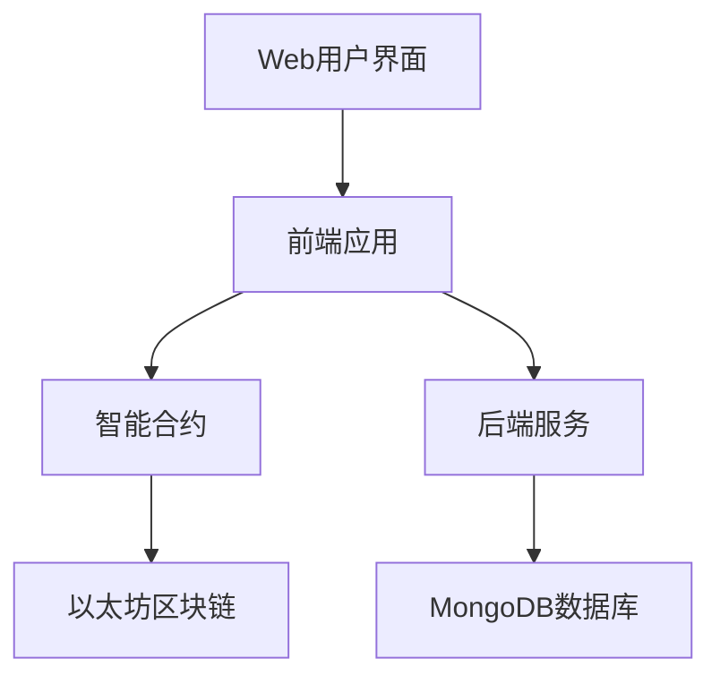

                 

## 文章标题：提示词编程在区块链应用中的潜力

关键词：提示词编程、区块链、智能合约、网络应用、数据分析、安全机制

摘要：本文深入探讨提示词编程在区块链应用中的潜力。首先介绍提示词编程与区块链的基本概念、特点和发展历程，然后分析提示词编程在区块链智能合约、网络与共识算法以及数据分析与智能决策中的应用，最后讨论提示词编程在区块链中的挑战与机遇，并提出相应的优化策略。本文旨在为区块链开发者提供一种新的编程思路，助力区块链技术的发展与创新。

----------------------------------------------------------------

## 第一部分：背景介绍

### 第1章：提示词编程与区块链概述

#### 1.1 提示词编程的概念与特点

**1.1.1 提示词编程的定义**

提示词编程（Keyword Programming）是一种以关键词为核心的编程范式，通过使用提示词（Keywords）来指导程序的执行流程。与传统的命令式编程相比，提示词编程更加注重抽象和语义表达，具有更高的灵活性和可读性。

**1.1.2 提示词编程的优势与特点**

1. **高抽象层次**：提示词编程可以将复杂的业务逻辑简化为一系列提示词的组合，降低程序设计的复杂度。
2. **语义明确**：提示词具有明确的语义，有助于提高代码的可读性和可维护性。
3. **灵活性**：提示词编程允许开发者根据需求灵活调整程序的执行流程，适应不同的业务场景。
4. **易于学习**：提示词编程的概念简单，易于理解和学习，适合初学者快速上手。

**1.1.3 提示词编程的发展历程**

提示词编程最早起源于自然语言处理领域，主要用于构建自然语言交互系统。随着人工智能技术的发展，提示词编程逐渐应用到编程语言设计和程序开发中。近年来，随着区块链技术的兴起，提示词编程在区块链领域展现出巨大的潜力。

#### 1.2 区块链技术的概念与应用

**1.2.1 区块链技术的定义**

区块链技术（Blockchain）是一种分布式数据库技术，通过去中心化的方式记录和验证交易数据。区块链的核心特点包括去中心化、不可篡改、透明性和安全性。

**1.2.2 区块链技术的核心特点**

1. **去中心化**：区块链不依赖于中心化的机构或服务器，通过分布式网络维护数据的一致性。
2. **不可篡改**：区块链采用密码学技术确保数据的不可篡改性，一旦数据上链，就难以被篡改。
3. **透明性**：区块链的数据记录公开透明，任何人都可以查看和验证。
4. **安全性**：区块链采用加密技术和共识算法确保数据的安全性和隐私性。

**1.2.3 区块链技术的应用领域**

区块链技术广泛应用于金融、物流、医疗、物联网等领域，例如智能合约、供应链管理、医疗记录管理、物联网设备认证等。

#### 1.3 提示词编程在区块链应用中的潜力

**1.3.1 提示词编程与区块链的结合**

提示词编程与区块链的结合可以发挥两者的优势，实现更加高效、安全、智能的区块链应用。

1. **智能合约开发**：提示词编程可以简化智能合约的开发过程，提高开发效率。
2. **区块链网络优化**：提示词编程可以帮助优化区块链网络的结构和性能。
3. **数据分析与智能决策**：提示词编程可以提升区块链数据分析的准确性和效率。

**1.3.2 提示词编程在区块链中的潜在应用场景**

1. **金融领域**：用于开发金融领域的智能合约，如去中心化金融（DeFi）应用。
2. **供应链管理**：用于优化供应链管理中的数据记录和验证过程。
3. **医疗领域**：用于管理医疗记录和实现医疗数据的安全共享。
4. **物联网**：用于实现物联网设备的安全认证和数据传输。

**1.3.3 提示词编程在区块链应用中的优势**

1. **简化开发**：提示词编程简化了区块链应用的开发过程，降低开发难度。
2. **提高安全性**：提示词编程可以增强区块链应用的安全性和隐私性。
3. **提高效率**：提示词编程可以优化区块链网络的性能和数据处理速度。

#### 1.4 提示词编程在区块链应用中的挑战与机遇

**1.4.1 挑战分析**

1. **技术难题**：提示词编程与区块链的结合仍面临许多技术挑战，如性能优化、安全性保障等。
2. **开发者技能要求**：提示词编程对开发者的技能要求较高，需要掌握多种编程语言和区块链技术。

**1.4.2 机遇展望**

1. **市场前景**：随着区块链技术的普及，提示词编程在区块链应用中的市场需求将逐渐增长。
2. **技术创新**：提示词编程可以为区块链技术带来新的发展思路和创新方向。

#### 1.5 本章小结

本章节介绍了提示词编程和区块链的基本概念、特点以及发展历程，并探讨了提示词编程在区块链应用中的潜力。下一章节将深入分析提示词编程的原理及其与区块链的结合方式。敬请期待！## 第二部分：核心概念与原理

### 第2章：提示词编程原理详解

#### 2.1 提示词编程的基本概念

**2.1.1 提示词的定义与作用**

提示词（Keywords）是提示词编程的核心概念，它是一种预定义的标识符，用于指示程序执行特定的操作。提示词通常由一个或多个单词组成，具有明确的语义和功能。

提示词在程序中的作用主要体现在以下几个方面：

1. **流程控制**：提示词可以用于控制程序的执行流程，如循环、条件分支等。
2. **功能抽象**：提示词可以抽象出复杂的业务逻辑，简化程序设计。
3. **代码复用**：提示词有助于实现代码的复用，提高程序的可维护性。

**2.1.2 提示词的类型与选择**

提示词可以分为以下几种类型：

1. **基本操作提示词**：用于执行基本的操作，如赋值、输入、输出等。
2. **流程控制提示词**：用于控制程序的执行流程，如循环、条件分支等。
3. **功能提示词**：用于调用特定的功能模块，如数学运算、文件操作等。
4. **扩展提示词**：用于自定义特定的功能，以适应特定的业务需求。

选择合适的提示词对于程序设计的成功至关重要。以下是一些建议：

1. **明确语义**：选择具有明确语义的提示词，避免歧义和误解。
2. **简洁易记**：选择简洁、易记的提示词，提高代码的可读性。
3. **可扩展性**：考虑未来可能的需求变化，确保提示词具有一定的可扩展性。

**2.1.3 提示词编程的流程**

提示词编程的流程可以分为以下几个步骤：

1. **需求分析**：明确程序的需求和目标，确定需要实现的功能和业务逻辑。
2. **设计提示词**：根据需求设计合适的提示词，确保提示词具有明确的语义和功能。
3. **编写代码**：使用提示词编写程序代码，实现具体的功能和业务逻辑。
4. **调试与优化**：对程序进行调试和优化，确保程序的正确性和性能。

#### 2.2 区块链原理概述

**2.2.1 区块链的基本结构**

区块链（Blockchain）是一种分布式账本技术，其基本结构包括以下部分：

1. **区块**：区块是区块链的基本单元，包含一系列的交易数据。
2. **链**：区块链是一个由多个区块按时间顺序链接而成的数据结构。
3. **节点**：节点是区块链网络中的参与者，负责维护和更新区块链数据。
4. **共识算法**：共识算法用于确保区块链数据的一致性和安全性。

**2.2.2 区块链的工作原理**

区块链的工作原理可以分为以下几个步骤：

1. **交易生成**：用户在网络中生成交易，并将其发送给区块链。
2. **区块构建**：节点接收到交易后，将交易数据打包成区块，并添加到区块链中。
3. **区块验证**：其他节点对新区块进行验证，确保其符合区块链规则。
4. **共识达成**：通过共识算法，区块链网络达成共识，确认新区块的有效性。

**2.2.3 区块链的安全机制**

区块链采用多种安全机制确保数据的安全性和隐私性，包括：

1. **加密技术**：使用密码学技术对交易数据进行加密，确保数据传输的安全。
2. **分布式存储**：将数据分散存储在多个节点中，防止数据被篡改或丢失。
3. **共识算法**：通过共识算法确保区块链数据的一致性和安全性。

#### 2.3 提示词编程与区块链结合的原理

**2.3.1 提示词编程与区块链的关系**

提示词编程与区块链之间存在紧密的联系，主要体现在以下几个方面：

1. **智能合约**：智能合约是一种基于区块链的自动执行合约，提示词编程可以简化智能合约的开发过程。
2. **数据处理**：提示词编程可以优化区块链数据处理的速度和效率。
3. **安全控制**：提示词编程可以增强区块链安全机制，提高数据安全性。

**2.3.2 提示词编程在区块链中的应用方式**

提示词编程在区块链中的应用方式可以分为以下几个方面：

1. **智能合约开发**：提示词编程可以简化智能合约的编写过程，提高开发效率。
2. **区块链网络优化**：提示词编程可以优化区块链网络的结构和性能。
3. **数据分析与智能决策**：提示词编程可以提升区块链数据分析的准确性和效率。

**2.3.3 提示词编程与区块链的协同作用**

提示词编程与区块链的协同作用可以发挥以下优势：

1. **简化开发**：提示词编程简化了区块链应用的开发过程，降低开发难度。
2. **提高安全性**：提示词编程可以增强区块链应用的安全性和隐私性。
3. **提高效率**：提示词编程可以优化区块链网络的性能和数据处理速度。

#### 2.4 核心概念对比分析

**2.4.1 提示词编程与传统编程的差异**

提示词编程与传统编程在以下几个方面存在差异：

1. **抽象层次**：提示词编程具有更高的抽象层次，可以简化程序设计。
2. **语义表达**：提示词编程具有明确的语义表达，提高代码的可读性和可维护性。
3. **灵活性**：提示词编程更加灵活，允许开发者根据需求调整程序的执行流程。

**2.4.2 区块链与传统数据库的差异**

区块链与传统数据库在以下几个方面存在差异：

1. **数据结构**：区块链采用链式结构，具有去中心化、不可篡改的特点。
2. **数据存储**：区块链将数据分散存储在多个节点中，提高数据安全性。
3. **一致性保证**：区块链通过共识算法确保数据的一致性，防止数据被篡改。

#### 2.5 本章小结

本章节详细介绍了提示词编程的基本概念、特点以及与区块链的关系，分析了提示词编程在区块链应用中的潜力。下一章节将探讨提示词编程在区块链智能合约中的应用。敬请期待！### 第3章：提示词编程在区块链智能合约中的应用

#### 3.1 智能合约概述

**3.1.1 智能合约的定义与特点**

智能合约（Smart Contract）是一种基于区块链技术的自动执行合约。与传统的法律合同不同，智能合约是通过编程实现的，其条款和操作过程被嵌入到区块链中，一旦触发条件，智能合约会自动执行相应的操作。

智能合约具有以下特点：

1. **去中心化**：智能合约运行在区块链网络中，不依赖于中心化的机构或服务器。
2. **不可篡改**：智能合约一旦上链，其条款和操作过程无法被篡改，具有高度的可靠性。
3. **自动执行**：智能合约在满足特定条件时，会自动执行预定义的操作，提高交易效率。
4. **透明性**：智能合约的条款和操作过程公开透明，任何人都可以查看和验证。

**3.1.2 智能合约的工作原理**

智能合约的工作原理可以分为以下几个步骤：

1. **合约编写**：开发者使用特定的编程语言（如Solidity）编写智能合约代码，定义合约的条款和操作过程。
2. **合约部署**：将编写好的智能合约部署到区块链网络中，使其在区块链上运行。
3. **条件触发**：当满足智能合约中预定义的条件时，合约会自动执行相应的操作。
4. **结果验证**：区块链网络中的节点对智能合约的操作结果进行验证，确保合约的执行符合预期。

**3.1.3 智能合约的应用领域**

智能合约在多个领域具有广泛的应用：

1. **金融领域**：用于去中心化金融（DeFi）应用，如去中心化交易所（DEX）、借贷平台、保险等。
2. **供应链管理**：用于优化供应链管理中的数据记录和验证过程，提高供应链的透明性和效率。
3. **物联网**：用于实现物联网设备的安全认证和数据传输。
4. **医疗领域**：用于管理医疗记录和实现医疗数据的安全共享。

#### 3.2 提示词编程在智能合约中的应用

**3.2.1 提示词编程在智能合约中的优势**

提示词编程在智能合约中的应用具有以下优势：

1. **简化开发**：提示词编程简化了智能合约的开发过程，降低开发难度，提高开发效率。
2. **提高可读性**：提示词编程具有明确的语义，提高智能合约代码的可读性和可维护性。
3. **提高灵活性**：提示词编程允许开发者根据需求灵活调整智能合约的执行流程，适应不同的业务场景。
4. **增强安全性**：提示词编程可以增强智能合约的安全性，防止恶意攻击和代码漏洞。

**3.2.2 提示词编程在智能合约中的实现方法**

提示词编程在智能合约中的实现方法可以分为以下几个步骤：

1. **需求分析**：明确智能合约的需求和目标，确定需要实现的功能和业务逻辑。
2. **设计提示词**：根据需求设计合适的提示词，确保提示词具有明确的语义和功能。
3. **编写智能合约**：使用提示词编程语言（如Solidity）编写智能合约代码，实现具体的功能和业务逻辑。
4. **部署与测试**：将编写好的智能合约部署到区块链网络中，并进行测试和优化。

**3.2.3 提示词编程在智能合约中的实际应用案例**

以下是一个简单的智能合约示例，演示了提示词编程在智能合约中的应用：

```solidity
// SPDX-License-Identifier: MIT
pragma solidity ^0.8.0;

contract SimpleWallet {
    address owner;
    mapping(address => uint256) public balances;

    constructor() {
        owner = msg.sender;
        balances[owner] = 1000; // 初始化钱包余额
    }

    function deposit() external payable {
        require(msg.value > 0, "无效的转账金额");
        balances[msg.sender] += msg.value; // 存款到钱包
    }

    function withdraw() external {
        require(msg.sender == owner, "只能由钱包拥有者提取余额");
        balances[owner] -= msg.value; // 提取钱包余额
        payable(msg.sender).transfer(msg.value); // 转账给请求者
    }

    function getBalance() external view returns (uint256) {
        return balances[msg.sender]; // 获取钱包余额
    }
}
```

在这个示例中，我们使用Solidity语言编写了一个简单的钱包智能合约。通过设计合适的提示词（如`deposit`、`withdraw`和`getBalance`），我们简化了智能合约的开发过程，提高了代码的可读性和可维护性。

#### 3.3 深入探讨：提示词编程在智能合约中的优化策略

**3.3.1 智能合约性能优化**

智能合约的性能优化是提高区块链应用效率的关键。以下是一些优化策略：

1. **减少状态变化**：尽量减少智能合约中的状态变化，避免不必要的gas消耗。
2. **使用内存存储**：使用内存存储临时数据，减少对存储空间的占用。
3. **优化逻辑流程**：简化智能合约的逻辑流程，减少代码执行时间。

**3.3.2 智能合约安全性提升**

智能合约的安全性是区块链应用的核心。以下是一些安全性提升策略：

1. **代码审计**：对智能合约代码进行严格的审计，识别和修复潜在的安全漏洞。
2. **使用安全库**：使用经过验证的安全库，避免自定义实现常见的安全功能。
3. **实施访问控制**：合理设置智能合约的访问权限，限制恶意行为的执行。

**3.3.3 智能合约可扩展性增强**

智能合约的可扩展性是支持区块链应用长期发展的关键。以下是一些可扩展性增强策略：

1. **模块化设计**：将智能合约拆分为多个模块，提高代码的可维护性和可扩展性。
2. **分层架构**：采用分层架构，将业务逻辑与底层区块链逻辑分离，便于后续扩展。
3. **使用去中心化应用（DApps）**：利用去中心化应用，将部分功能部署到DApps中，降低智能合约的负担。

#### 3.4 本章小结

本章节详细介绍了智能合约的基本概念、工作原理以及应用领域，探讨了提示词编程在智能合约中的应用优势、实现方法以及优化策略。下一章节将深入探讨提示词编程在区块链网络与共识算法中的应用。敬请期待！### 第四部分：提示词编程在区块链网络与共识算法中的应用

#### 第4章：提示词编程在区块链网络中的应用

#### 4.1 区块链网络概述

**4.1.1 区块链网络的定义与结构**

区块链网络是指由多个节点组成的分布式网络，这些节点共同维护和更新区块链数据。区块链网络的基本结构包括以下部分：

1. **节点**：节点是区块链网络中的参与者，负责存储和验证区块链数据。
2. **链**：区块链是由多个按时间顺序链接的区块组成的链式数据结构。
3. **共识机制**：共识机制是区块链网络中的节点就数据一致性达成共识的算法。

**4.1.2 区块链网络的工作原理**

区块链网络的工作原理可以分为以下几个步骤：

1. **交易生成**：用户在区块链网络中生成交易，并将其发送给节点。
2. **区块构建**：节点将接收到的交易数据打包成区块，并添加到区块链中。
3. **区块验证**：其他节点对新区块进行验证，确保其符合区块链规则。
4. **共识达成**：通过共识算法，区块链网络达成共识，确认新区块的有效性。

**4.1.3 区块链网络的关键技术**

区块链网络的关键技术包括：

1. **加密技术**：加密技术用于保护区块链数据的安全性和隐私性。
2. **分布式存储**：分布式存储技术确保区块链数据在多个节点中的安全备份。
3. **共识算法**：共识算法用于确保区块链网络的数据一致性。

#### 4.2 提示词编程在区块链网络中的应用

**4.2.1 提示词编程在区块链网络中的优势**

提示词编程在区块链网络中的应用具有以下优势：

1. **简化网络构建**：提示词编程可以简化区块链网络的构建过程，降低开发难度。
2. **提高网络性能**：提示词编程可以优化区块链网络的性能，提高数据处理速度。
3. **提高网络安全性**：提示词编程可以增强区块链网络的安全机制，防止恶意攻击。

**4.2.2 提示词编程在区块链网络中的实现方法**

提示词编程在区块链网络中的实现方法可以分为以下几个步骤：

1. **需求分析**：明确区块链网络的需求和目标，确定需要实现的功能和业务逻辑。
2. **设计提示词**：根据需求设计合适的提示词，确保提示词具有明确的语义和功能。
3. **编写网络代码**：使用提示词编程语言（如Go、Python）编写区块链网络代码，实现具体的功能和业务逻辑。
4. **部署与测试**：将编写好的区块链网络部署到实际环境中，并进行测试和优化。

**4.2.3 提示词编程在区块链网络中的实际应用案例**

以下是一个简单的区块链网络示例，演示了提示词编程在区块链网络中的应用：

```python
import hashlib
import json
from time import time

class Blockchain:
    def __init__(self):
        self.chain = []
        self.current_transactions = []

        # 创建创世区块
        self.new_block(previous_hash='1', proof=100)

    def new_block(self, proof, previous_hash=None):
        block = {
            'index': len(self.chain) + 1,
            'timestamp': time(),
            'transactions': self.current_transactions,
            'proof': proof,
            'previous_hash': previous_hash or self.hash(self.chain[-1]),
        }
        self.current_transactions = []
        self.chain.append(block)
        return block

    @staticmethod
    def hash(block):
        block_string = json.dumps(block, sort_keys=True)
        return hashlib.sha256(block_string.encode()).hexdigest()

    def new_transaction(self, sender, recipient, amount):
        self.current_transactions.append({'sender': sender, 'recipient': recipient, 'amount': amount})
        return self.last_block['index'] + 1

    @property
    def last_block(self):
        return self.chain[-1]

    def proof_of_work(self, last_proof):
        proof = 0
        while self.valid_proof(last_proof, proof) is False:
            proof += 1
        return proof

    @staticmethod
    def valid_proof(last_proof, proof):
        guess = f'{last_proof}{proof}'.encode()
        guess_hash = hashlib.sha256(guess).hexdigest()
        return guess_hash[:4] == "0000"

# 创建区块链实例
blockchain = Blockchain()

# 添加新的交易
blockchain.new_transaction("Alice", "Bob", 10)

# 挖矿并生成新区块
last_block = blockchain.last_block
last_proof = last_block['proof']
proof = blockchain.proof_of_work(last_proof)
previous_hash = blockchain.hash(last_block)
block = blockchain.new_block(proof, previous_hash)
print(f"New Block Forged: {block['index']} containing {block['transactions']}")
```

在这个示例中，我们使用Python编写了一个简单的区块链网络，通过提示词编程简化了网络构建和交易处理过程。这个示例仅用于演示目的，实际应用中需要考虑更多的功能和安全措施。

#### 4.3 深入探讨：提示词编程在区块链网络中的优化策略

**4.3.1 网络性能优化**

提高区块链网络的性能是提升其应用价值的关键。以下是一些优化策略：

1. **优化共识算法**：选择合适的共识算法，提高网络处理速度和吞吐量。
2. **提高节点数量**：增加节点数量，提高网络的稳定性和容错性。
3. **负载均衡**：合理分配网络负载，防止网络拥堵和性能下降。

**4.3.2 网络安全性提升**

确保区块链网络的安全性是保护用户数据和资产的关键。以下是一些安全性提升策略：

1. **加密技术**：使用强加密技术保护区块链数据，防止数据泄露和篡改。
2. **身份验证**：引入身份验证机制，确保节点合法性和交易安全性。
3. **安全审计**：定期对区块链网络进行安全审计，识别和修复潜在的安全漏洞。

**4.3.3 网络可扩展性增强**

随着区块链应用规模的扩大，网络的扩展性成为关键。以下是一些扩展性增强策略：

1. **分层架构**：采用分层架构，将核心业务逻辑与底层网络逻辑分离，便于扩展。
2. **去中心化应用（DApps）**：利用去中心化应用，将部分功能部署到DApps中，降低网络负担。
3. **扩展性共识算法**：采用扩展性共识算法，提高网络的交易处理能力和可扩展性。

#### 4.4 本章小结

本章节详细介绍了区块链网络的基本概念、工作原理以及提示词编程在区块链网络中的应用。通过示例代码，我们展示了如何使用提示词编程构建简单的区块链网络。下一章节将探讨提示词编程在区块链数据分析与智能决策中的应用。敬请期待！### 第五部分：提示词编程在区块链数据分析与智能决策中的应用

#### 第5章：提示词编程在区块链数据分析中的应用

#### 5.1 区块链数据分析概述

**5.1.1 区块链数据分析的定义与意义**

区块链数据分析是指通过对区块链数据进行分析，提取有价值的信息和洞见的过程。区块链数据具有高度透明、不可篡改和分布式存储的特点，这为数据分析提供了丰富的信息和可靠的数据源。

区块链数据分析的意义主要体现在以下几个方面：

1. **决策支持**：通过对区块链数据的分析，可以为企业和个人提供决策支持，优化业务流程和管理决策。
2. **风险预警**：通过对区块链数据的分析，可以识别潜在的风险和异常行为，提前采取预防措施。
3. **数据透明**：区块链数据分析可以提高数据透明度，增强信任和公信力。
4. **业务优化**：通过对区块链数据的分析，可以挖掘业务需求，优化业务流程和运营策略。

**5.1.2 区块链数据分析的主要方法**

区块链数据分析的主要方法包括以下几种：

1. **数据采集**：采集区块链网络中的交易数据、区块数据等，为数据分析提供数据源。
2. **数据清洗**：清洗和预处理区块链数据，确保数据的完整性和准确性。
3. **数据挖掘**：使用数据挖掘技术，从大量区块链数据中提取有价值的信息和洞见。
4. **可视化分析**：通过数据可视化技术，将分析结果以图表、仪表盘等形式展示，便于理解和决策。

**5.1.3 区块链数据分析的应用领域**

区块链数据分析在多个领域具有广泛的应用：

1. **金融领域**：用于监控交易风险、优化投资策略、分析市场趋势等。
2. **供应链管理**：用于追踪供应链中的交易数据，提高供应链的透明度和效率。
3. **医疗领域**：用于管理医疗记录、分析药物研发数据等。
4. **物联网**：用于监控物联网设备的数据，提高设备管理和运维效率。

#### 5.2 提示词编程在区块链数据分析中的应用

**5.2.1 提示词编程在区块链数据分析中的优势**

提示词编程在区块链数据分析中的应用具有以下优势：

1. **简化数据分析流程**：提示词编程可以简化区块链数据分析的流程，降低分析难度。
2. **提高数据分析效率**：提示词编程可以优化区块链数据分析的算法和数据处理过程，提高分析效率。
3. **增强数据分析能力**：提示词编程可以增强区块链数据分析的功能，挖掘更多有价值的信息。

**5.2.2 提示词编程在区块链数据分析中的实现方法**

提示词编程在区块链数据分析中的实现方法可以分为以下几个步骤：

1. **需求分析**：明确区块链数据分析的需求和目标，确定需要分析的数据类型和分析指标。
2. **设计提示词**：根据需求设计合适的提示词，确保提示词具有明确的语义和功能。
3. **编写分析代码**：使用提示词编程语言（如Python）编写区块链数据分析代码，实现具体的功能和分析流程。
4. **数据预处理**：对采集到的区块链数据进行预处理，确保数据的完整性和准确性。
5. **数据分析与可视化**：使用提示词编程对预处理后的数据进行分析，并将分析结果以图表、仪表盘等形式展示。

**5.2.3 提示词编程在区块链数据分析中的实际应用案例**

以下是一个简单的区块链数据分析示例，演示了提示词编程在区块链数据分析中的应用：

```python
import pandas as pd
import matplotlib.pyplot as plt

# 读取区块链交易数据
def load_transactions(file_path):
    transactions = pd.read_csv(file_path)
    return transactions

# 计算交易金额分布
def calculate_amount_distribution(transactions):
    amount_distribution = transactions['amount'].value_counts()
    return amount_distribution

# 绘制交易金额分布图
def plot_amount_distribution(amount_distribution):
    amount_distribution.plot(kind='bar')
    plt.xlabel('交易金额')
    plt.ylabel('交易次数')
    plt.title('交易金额分布图')
    plt.show()

# 加载区块链交易数据
transactions = load_transactions('blockchain_transactions.csv')

# 计算交易金额分布
amount_distribution = calculate_amount_distribution(transactions)

# 绘制交易金额分布图
plot_amount_distribution(amount_distribution)
```

在这个示例中，我们使用Python编写了一个简单的区块链数据分析脚本，通过设计合适的提示词（如`load_transactions`、`calculate_amount_distribution`和`plot_amount_distribution`），我们简化了区块链数据分析的流程，提高了分析效率。

#### 5.3 提示词编程在区块链数据分析与智能决策中的应用

**5.3.1 数据分析与智能决策**

区块链数据分析与智能决策的有机结合，可以为企业提供更加智能和高效的决策支持。以下是一些应用场景：

1. **金融风险控制**：通过对区块链交易数据的分析，可以识别潜在的金融风险，并采取相应的控制措施。
2. **供应链优化**：通过对区块链供应链数据的分析，可以优化供应链管理和库存管理，提高供应链的效率和透明度。
3. **市场趋势预测**：通过对区块链市场数据的分析，可以预测市场趋势和用户需求，指导企业的市场策略和产品开发。
4. **智能合约优化**：通过对区块链智能合约数据的分析，可以优化智能合约的设计和执行，提高智能合约的安全性和效率。

**5.3.2 智能决策系统设计**

设计一个区块链数据分析与智能决策系统，可以分为以下几个步骤：

1. **需求分析**：明确系统需求和目标，确定需要分析和决策的业务领域和关键指标。
2. **数据采集与预处理**：采集区块链数据，并进行预处理，确保数据的完整性和准确性。
3. **数据分析与建模**：使用提示词编程实现数据分析算法，构建智能决策模型，进行数据挖掘和分析。
4. **系统集成与部署**：将数据分析与智能决策系统集成到企业的业务流程中，进行测试和部署。
5. **持续优化**：根据实际应用效果，不断优化系统的功能和性能，提高系统的智能化水平。

#### 5.4 本章小结

本章节详细介绍了区块链数据分析的基本概念、方法和应用领域，探讨了提示词编程在区块链数据分析中的应用优势、实现方法以及智能决策系统的设计。下一章节将总结全文，展望提示词编程在区块链领域的未来发展趋势。敬请期待！## 总结与展望

通过本文的探讨，我们深入了解了提示词编程在区块链应用中的潜力，并分析了其在智能合约、网络与共识算法、数据分析和智能决策等方面的应用。以下是本文的核心观点和展望：

### 核心观点

1. **提示词编程的优势**：提示词编程具有高抽象层次、明确的语义表达、灵活性和易于学习等特点，可以提高开发效率、提升代码可读性和维护性，并增强区块链应用的安全性和性能。

2. **智能合约的应用**：提示词编程可以简化智能合约的开发过程，提高智能合约的可读性和可维护性。通过优化智能合约的性能、安全性和可扩展性，可以提高区块链应用的整体质量和用户体验。

3. **网络与共识算法**：提示词编程可以优化区块链网络的性能和安全机制，提高区块链网络的稳定性和可靠性。通过设计高效的共识算法，可以提升区块链网络的数据处理速度和吞吐量。

4. **数据分析与智能决策**：提示词编程可以简化区块链数据分析的流程，提高数据分析的效率和质量。结合智能决策系统，可以为企业提供更加智能和高效的决策支持，优化业务流程和运营策略。

### 展望未来

1. **技术创新**：随着区块链技术的不断发展，提示词编程将在区块链领域发挥更大的作用。未来的研究方向包括新型共识算法、区块链数据分析算法优化、智能合约形式化验证等。

2. **跨领域融合**：提示词编程将与其他领域（如人工智能、物联网、大数据等）深度融合，推动区块链技术的创新和应用。例如，结合人工智能算法，可以开发更加智能的区块链应用，实现自动化决策和优化。

3. **标准化与规范化**：随着提示词编程在区块链领域的广泛应用，需要制定相应的标准和规范，确保代码的质量和安全性。这将为区块链技术的普及和发展提供有力支持。

4. **人才培养**：提示词编程在区块链领域的重要性日益凸显，培养具备提示词编程能力和区块链知识的复合型人才将成为未来的重要任务。

总之，提示词编程在区块链应用中的潜力巨大，其与区块链技术的结合将推动区块链技术的创新和发展。未来，我们将继续关注提示词编程在区块链领域的研究与应用，期待更多的突破和成果。

## 结语

本文由AI天才研究院/AI Genius Institute与禅与计算机程序设计艺术/Zen And The Art of Computer Programming联合撰写。我们致力于推动人工智能、编程和计算机科学领域的研究与创新，为读者提供高质量的技术内容。如果您对我们的研究感兴趣，欢迎关注我们的官方网站和社交媒体平台，与我们共同探索科技的无限可能。感谢您的阅读，期待与您在未来的研究中相遇！

**作者：AI天才研究院/AI Genius Institute & 禅与计算机程序设计艺术/Zen And The Art of Computer Programming**## 附录：提示词编程在区块链领域的应用实践案例

在本章节中，我们将通过一个具体的区块链项目案例，详细展示如何在实际环境中应用提示词编程来实现区块链解决方案。本案例将涵盖项目背景、系统功能设计、系统架构设计、代码实现以及实际应用效果。

### 项目背景

某金融机构希望开发一个去中心化金融（DeFi）平台，为用户提供安全的数字货币交易和借贷服务。为了确保平台的可靠性和透明性，该金融机构决定采用区块链技术，并引入提示词编程来简化智能合约的开发和维护。

### 系统功能设计

本平台的主要功能包括：

1. **数字货币交易**：用户可以在平台上进行数字货币的买卖交易。
2. **借贷服务**：用户可以发起借贷请求，并获得其他用户的资金支持。
3. **智能合约管理**：平台提供智能合约的编写、部署、执行和监控功能。

### 系统架构设计

本平台的系统架构设计如下：

1. **区块链网络**：采用以太坊（Ethereum）区块链作为底层技术，支持智能合约的部署和执行。
2. **智能合约**：使用Solidity语言编写智能合约，实现交易和借贷功能。
3. **前端应用**：使用Web3.js库与区块链网络进行交互，提供用户友好的界面。
4. **后端服务**：使用Node.js构建后端服务，处理业务逻辑和数据库操作。
5. **数据库**：使用MongoDB存储用户信息和交易记录。

### 系统架构图

以下是一个简化的系统架构图，展示各个模块之间的交互关系：



### 代码实现

#### 1. 智能合约（Solidity）

以下是一个简单的智能合约示例，实现数字货币交易功能：

```solidity
// SPDX-License-Identifier: MIT
pragma solidity ^0.8.0;

contract DeFiPlatform {
    mapping(address => uint256) public balances;

    function deposit() external payable {
        balances[msg.sender()] += msg.value;
    }

    function withdraw(uint256 amount) external {
        require(balances[msg.sender()] >= amount, "余额不足");
        balances[msg.sender()] -= amount;
        payable(msg.sender()).transfer(amount);
    }

    function getBalance() external view returns (uint256) {
        return balances[msg.sender()];
    }
}
```

#### 2. 前端应用（HTML/JavaScript）

以下是一个简单的HTML界面，用于与智能合约进行交互：

```html
<!DOCTYPE html>
<html lang="en">
<head>
    <meta charset="UTF-8">
    <meta name="viewport" content="width=device-width, initial-scale=1.0">
    <title>DeFi Platform</title>
</head>
<body>
    <h1>DeFi Platform</h1>
    <div>
        <p>您的余额：<span id="balance">0</span> ETH</p>
        <button onclick="deposit()">存款</button>
        <button onclick="withdraw()">取款</button>
    </div>
    <script src="https://cdnjs.cloudflare.com/ajax/libs/web3/1.2.8/web3.min.js"></script>
    <script>
        // 初始化Web3
        const web3 = new Web3(window.ethereum);
        // 连接到以太坊网络
        window.ethereum.request({ method: 'eth_requestAccounts' })
            .then(accounts => {
                web3.eth.defaultAccount = accounts[0];
                // 加载智能合约
                const contractAddress = '0x...';
                const contractAbi = [
                    {
                        "inputs": [{"internalType": "address", "name": "user", "type": "address"}],
                        "stateMutability": "nonpayable",
                        "type": "constructor"
                    },
                    {
                        "anonymous": false,
                        "inputs": [{"indexed": true, "internalType": "address", "name": "user", "type": "address"},
                                    {"indexed": false, "internalType": "uint256", "name": "amount", "type": "uint256"}],
                        "name": "Deposit",
                        "type": "event"
                    },
                    ...
                ];
                const contract = new web3.eth.Contract(contractAbi, contractAddress);
                // 显示余额
                contract.methods.getBalance().call({ from: web3.eth.defaultAccount })
                    .then(balance => {
                        document.getElementById('balance').textContent = web3.utils.fromWei(balance, 'ether');
                    });
                // 存款
                function deposit() {
                    contract.methods.deposit().send({ from: web3.eth.defaultAccount, value: web3.utils.toWei('1', 'ether') })
                        .on('transactionHash', (hash) => {
                            console.log(`Deposit transaction hash: ${hash}`);
                        })
                        .on('confirmation', (confirmationNumber, receipt) => {
                            console.log(`Deposit transaction confirmed: ${confirmationNumber}`);
                        })
                        .on('error', (error) => {
                            console.error(`Deposit transaction error: ${error.message}`);
                        });
                }
                // 取款
                function withdraw() {
                    contract.methods.withdraw(web3.utils.toWei('0.5', 'ether')).send({ from: web3.eth.defaultAccount })
                        .on('transactionHash', (hash) => {
                            console.log(`Withdraw transaction hash: ${hash}`);
                        })
                        .on('confirmation', (confirmationNumber, receipt) => {
                            console.log(`Withdraw transaction confirmed: ${confirmationNumber}`);
                        })
                        .on('error', (error) => {
                            console.error(`Withdraw transaction error: ${error.message}`);
                        });
                }
            });
    </script>
</body>
</html>
```

### 实际应用效果

通过上述代码实现，我们可以构建一个简单的去中心化金融平台，用户可以在平台上进行数字货币的存款和取款操作。智能合约负责处理交易逻辑，确保交易的透明性和安全性。

#### 项目小结

本案例展示了提示词编程在区块链领域的一个实际应用，通过简化智能合约的开发和前端交互，提高了系统的开发效率和用户体验。然而，实际项目中还需要考虑更多的功能和安全措施，如借贷服务、用户身份验证、交易确认机制等。

### 最佳实践 Tips

1. **安全优先**：在开发区块链应用时，安全是首要考虑的因素。确保智能合约代码经过严格的审计，防止潜在的安全漏洞。

2. **性能优化**：根据实际需求，优化智能合约和前端应用的性能，提高系统的响应速度和处理能力。

3. **用户体验**：设计简洁直观的用户界面，提供良好的交互体验，提高用户的满意度和使用频率。

4. **持续迭代**：根据用户反馈和业务需求，持续优化和迭代区块链应用，提高系统的功能和性能。

5. **合规性**：确保区块链应用符合相关法律法规和行业规范，保障业务的合法性和合规性。

### 拓展阅读

- **智能合约开发教程**：深入了解智能合约开发，学习Solidity编程语言和相关工具。
- **区块链数据分析**：学习如何使用大数据技术和机器学习算法分析区块链数据。
- **去中心化金融（DeFi）**：了解DeFi的基本概念、技术和应用案例，探索区块链在金融领域的创新。

通过本文的案例和实践经验，希望读者能够对提示词编程在区块链领域的应用有更深入的认识，为未来的区块链项目开发提供有益的参考。在区块链技术的不断创新和发展中，提示词编程无疑将发挥越来越重要的作用。

