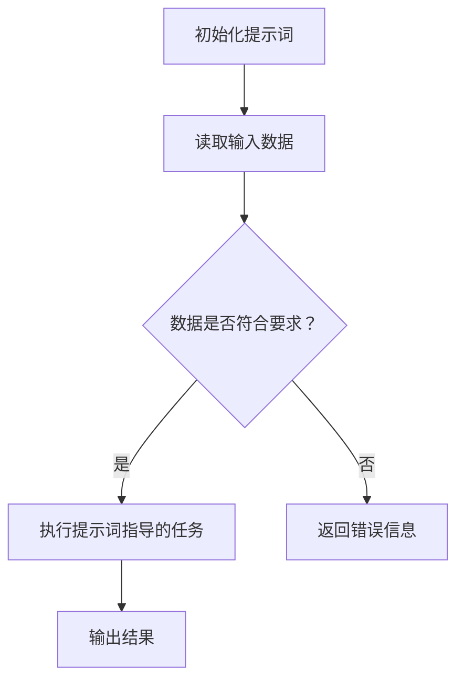
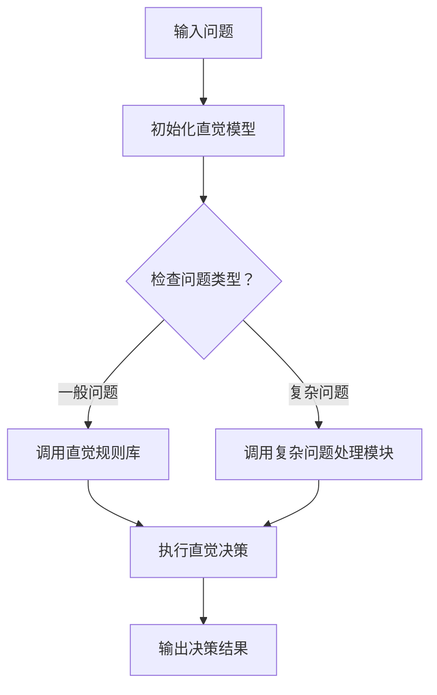

                 

# 《提示词编程在增强人类直觉能力中的应用》

> 关键词：提示词编程、人类直觉能力、认知科学、算法、应用场景

> 摘要：本文深入探讨了提示词编程在增强人类直觉能力中的应用。通过详细的理论阐述和实践案例，揭示了提示词编程如何帮助人类更好地理解和处理复杂信息，提高直觉能力。本文首先介绍了提示词编程和人类直觉能力的基本概念，然后分析了它们之间的相互作用，最后通过实际案例展示了提示词编程在增强人类直觉能力方面的潜力。

## 目录大纲设计流程

在设计《提示词编程在增强人类直觉能力中的应用》的目录大纲时，我们遵循了以下步骤：

1. **理解书名与主题**：明确书籍的核心概念和目标读者群体，确定书籍的核心内容与结构。
2. **核心概念界定**：明确书中的关键术语和概念，界定它们的应用场景和定义。
3. **章节划分**：根据核心概念和主题，合理划分章节，确保章节内容具有连贯性和逻辑性。
4. **大纲细化**：在每一章节下细化小节，确保内容完整并具有实际应用价值。
5. **格式与风格**：确保使用markdown格式，符合要求，并且结构清晰、易于阅读。

下面，我们将详细探讨每一个步骤。

### 1. 理解书名与主题

书名《提示词编程在增强人类直觉能力中的应用》清晰地表明了本书的主题。提示词编程是一种编程方法，通过使用提示词（hint words）来引导程序执行特定的任务，增强编程的可读性和可维护性。人类直觉能力则是人类在感知、理解和处理信息时的一种直接、迅速的方式。本书旨在探讨如何利用提示词编程技术来提高人类的直觉能力。

目标读者群体包括计算机科学学生、编程爱好者以及对认知科学和心理学感兴趣的读者。他们希望通过本书了解提示词编程的基本概念、原理和应用，以及如何通过编程来增强人类的直觉能力。

### 2. 核心概念界定

在本书中，我们定义了两个核心概念：提示词编程和人类直觉能力。

**提示词编程**：
- 定义：提示词编程是一种通过使用提示词来引导程序执行特定任务的编程方法。提示词是编程中的一种特殊词汇，它们可以提供对程序执行过程的额外指导，使程序更容易理解和维护。
- 应用场景：提示词编程可以应用于各种编程场景，如软件开发、系统设计、算法优化等。

**人类直觉能力**：
- 定义：直觉能力是指人类在感知、理解和处理信息时的一种直接、迅速的方式。它通常不受逻辑推理和明确知识的影响，而是基于经验和本能。
- 应用场景：直觉能力在日常生活中无处不在，如决策、问题解决、创新思考等。

### 3. 章节划分

根据核心概念和主题，我们初步划分了以下章节：

1. **引言**：介绍本书的背景、研究目的与意义，以及书籍结构安排。
2. **提示词编程基础**：介绍提示词编程的定义、原理和应用场景。
3. **人类直觉能力概述**：介绍直觉能力的定义、发展历程和心理学研究。
4. **提示词编程与直觉能力的关系**：分析提示词编程与直觉能力之间的相互作用。
5. **实践指南**：提供提示词编程和直觉能力训练的实践方法。
6. **技术深度解析**：深入探讨提示词编程算法和直觉能力算法。
7. **未来展望**：展望提示词编程和直觉能力提升的新趋势和研究方向。

### 4. 大纲细化

在每一章节下，我们进一步细化小节，确保内容完整并具有实际应用价值。以下是部分章节的细化大纲：

**引言**
- 背景介绍
- 研究目的与意义
- 书籍结构安排
- 读者对象与阅读建议

**提示词编程基础**
- 提示词编程的定义
- 提示词编程的原理
- 提示词编程的应用场景
- 提示词编程的优势与挑战

**人类直觉能力概述**
- 直觉能力的定义
- 直觉能力的发展历程
- 直觉能力的心理学研究
- 直觉能力的重要性

**提示词编程与直觉能力的关系**
- 理论框架
- 实证研究
- 案例分析
- 提示词编程对直觉能力的影响

**实践指南**
- 提示词编程的实施步骤
- 直觉能力训练方法
- 实战案例分析
- 提升直觉能力的最佳实践

**技术深度解析**
- 提示词编程算法
- 直觉能力算法
- 算法实现与优化
- 算法在不同场景的应用

**未来展望**
- 提示词编程的发展趋势
- 直觉能力提升的新方法
- 研究方向与挑战

### 5. 格式与风格

为确保文章的可读性和专业性，我们将使用markdown格式输出。以下是markdown格式的一些基本规则：

- 标题使用`#`符号，其中`#`的数量表示标题的层级。
- 段落之间使用一个空行分隔。
- 引用使用`>`符号。
- 列表使用`-`、`+`或`*`符号。
- 代码块使用三个反引号（```)包裹。
- 表格使用`|`和`-`符号。
- 数学公式使用`$`和`$$`符号。

通过遵循这些规则，我们可以创建结构清晰、易于阅读的技术博客文章。

---

通过以上步骤，我们完成了《提示词编程在增强人类直觉能力中的应用》的目录大纲设计。接下来，我们将逐章深入探讨提示词编程和人类直觉能力，揭示它们之间的相互作用以及如何通过编程来提高人类的直觉能力。

## 提示词编程的基础

### 提示词编程的定义

提示词编程（Hint-based Programming），是一种通过使用提示词（hint words）来引导程序执行特定任务的编程方法。在传统的编程中，程序员通常依赖于算法和逻辑来解决问题，而提示词编程则在此基础上引入了额外的指导信息，使得程序在执行过程中能够更直观、更高效地处理复杂任务。

提示词，顾名思义，就是给程序提供提示的词汇或短语。这些提示词可以被理解为程序员在代码中添加的“注释”，它们不直接影响程序的运行，但可以显著提高代码的可读性和可维护性。通过使用提示词，程序员可以更清晰地表达自己的意图，使得代码更易于理解和修改。

### 提示词编程的原理

提示词编程的原理基于人类认知和心理学的原理。人类在处理信息时，会根据已有的知识和经验进行快速判断和决策。这种过程被称为直觉。直觉是一种不经过逻辑推理的直接感知和理解能力，它通常是基于大量经验积累的结果。

在提示词编程中，提示词的作用类似于人类直觉。当程序执行复杂任务时，提示词可以提供额外的上下文信息，帮助程序更好地理解任务的含义和目标。例如，在一个复杂的算法中，程序员可以使用提示词来指示某个特定步骤的关键点或注意事项，从而提高程序对任务的感知和把握能力。

### 提示词编程的应用场景

提示词编程可以应用于各种编程场景，以下是一些典型的应用：

1. **软件开发**：在软件开发过程中，提示词可以帮助程序员更好地理解项目需求和功能规格，从而提高开发效率和质量。特别是在团队协作中，提示词可以减少沟通成本，提高代码的可读性。

2. **系统设计**：在系统设计阶段，提示词可以提供设计决策的指导，帮助设计师更好地理解系统架构和功能模块，从而设计出更合理、更可维护的系统。

3. **算法优化**：在算法优化过程中，提示词可以帮助程序员更清晰地理解算法的核心逻辑和关键步骤，从而优化算法的执行效率和资源占用。

4. **教育编程**：在编程教育中，提示词可以作为一种辅助工具，帮助学生更好地理解编程概念和算法原理。通过使用提示词，学生可以更直观地理解编程过程，提高学习效果。

### 提示词编程的优势与挑战

提示词编程具有以下优势：

1. **提高代码可读性**：提示词可以使代码更加清晰、易于理解，减少代码阅读的时间和难度。
2. **提高代码可维护性**：提示词可以帮助程序员更好地理解代码的意图和结构，从而更方便地进行代码维护和升级。
3. **提高开发效率**：提示词可以减少开发过程中的沟通成本，提高团队协作效率。
4. **支持直觉编程**：提示词编程可以激发程序员的直觉，帮助他们在复杂任务中做出更明智的决策。

然而，提示词编程也面临一些挑战：

1. **提示词的滥用**：如果提示词使用不当，可能会导致代码混乱，增加维护难度。
2. **提示词的覆盖范围**：提示词需要覆盖足够多的编程场景，否则可能无法充分发挥其优势。
3. **提示词的标准化**：目前尚无统一的提示词标准，不同程序员和团队可能使用不同的提示词，导致交流障碍。

### 总结

提示词编程是一种通过使用提示词来增强程序执行效率和可维护性的编程方法。它基于人类直觉和认知原理，可以应用于多种编程场景，提高开发效率和代码质量。尽管存在一些挑战，但提示词编程的潜力巨大，有望在未来成为编程领域的重要工具。

## 人类直觉能力的概述

### 直觉能力的定义

直觉能力是指人类在感知、理解和处理信息时的一种直接、迅速的方式。它不同于基于逻辑推理和明确知识的思维方式，而是依赖于人类大脑的直觉反应和经验积累。直觉能力使我们能够快速做出决策、解决问题，甚至在面对复杂和不确定的情况时，也能迅速找到合适的解决方案。

直觉是一种本能，它不需要经过深思熟虑和逻辑推理，而是基于大脑的神经网络和经验进行快速判断。在日常生活中，直觉能力无处不在，从简单的判断是否安全过马路，到复杂的商业决策和科学创新，直觉都发挥着重要的作用。

### 直觉能力的发展历程

直觉能力的发展历程可以追溯到哲学和心理学的研究。古希腊哲学家苏格拉底和柏拉图最早对直觉进行了思考，认为直觉是人类认知的一种基本形式。在后来的科学研究中，直觉能力逐渐成为心理学和认知科学的重要研究对象。

19世纪末，德国心理学家威廉·冯特（Wilhelm Wundt）创立了第一个心理学实验室，开始了对直觉能力的科学研究。他通过实验发现，直觉是人类快速处理信息的一种能力，并提出了“直接知觉”的概念。20世纪初，美国心理学家詹姆斯·马克·布莱克（James Mark Baldwin）进一步发展了直觉理论，将其与进化论相结合，认为直觉是适应环境的产物。

在20世纪中叶，随着认知科学的发展，直觉能力的研究得到了更多的关注。科学家们开始使用计算机模拟和实验方法来研究直觉，探索直觉的神经基础和心理机制。例如，乔治·米勒（George A. Miller）在1956年的经典论文中提出了“认知局限”理论，认为直觉是人类在有限认知资源下的一种高效处理方式。

### 直觉能力的心理学研究

直觉能力的心理学研究主要集中在以下几个方面：

1. **直觉的类型和特点**：研究者通过实验和问卷，分析了不同类型直觉的特点和表现。例如，某些直觉更倾向于逻辑推理，而另一些则更依赖于感知和情感。研究者还发现，直觉能力在个体之间存在显著差异，部分个体在特定情境下表现出更高的直觉能力。

2. **直觉的神经基础**：神经科学家通过脑成像技术，如功能性磁共振成像（fMRI）和脑电图（EEG），研究了直觉产生的神经机制。研究发现，直觉与大脑的前额叶、顶叶和颞叶等区域的活动密切相关，这些区域负责处理信息、记忆和情感。

3. **直觉的习得和发展**：研究者探讨了直觉能力的习得过程，发现经验丰富的个体在特定领域具有更高的直觉能力。通过不断的训练和实践，人类可以提升自己的直觉能力。此外，研究发现，直觉能力的发展与个体的认知风格、心理素质和经验积累密切相关。

4. **直觉与逻辑推理的关系**：直觉与逻辑推理是两种不同的认知过程，但它们在人类的思维中往往相互交织。一些研究表明，直觉和逻辑推理可以相互补充，共同提高人类的决策能力和问题解决能力。例如，在某些复杂的情境中，直觉可以帮助人们快速识别关键信息，而逻辑推理则用于详细分析和验证。

### 直觉能力的重要性

直觉能力在人类的生活和工作中扮演着重要角色。以下是一些关键点：

1. **快速决策**：在紧急情况下，直觉能力可以帮助人类迅速做出决策，避免不必要的损失和风险。例如，飞行员在紧急情况下依赖直觉来控制飞机，医生在诊断病情时依赖直觉来快速判断。

2. **创新思考**：直觉能力是创新思考的重要基础。许多科学家、艺术家和企业家通过直觉找到了突破性的解决方案，推动了科学和技术的发展。

3. **日常生活中的应用**：直觉能力在日常生活中无处不在，从简单的判断是否购买某个商品，到复杂的社交互动和人际交往，直觉都发挥着重要的作用。

4. **提高工作效率**：直觉能力可以显著提高工作效率。例如，程序员在编码过程中通过直觉快速识别代码中的错误和优化机会，项目经理通过直觉来合理安排团队资源和时间。

### 总结

直觉能力是人类认知的一种重要形式，它基于人类大脑的神经网络和经验积累，使人类能够快速感知、理解和处理信息。直觉能力的发展历程经历了哲学、心理学和认知科学的深入研究，其重要性在各个领域都得到了广泛认可。通过理解直觉能力的本质和特点，我们可以更好地利用这一能力，提高生活和工作中的决策效率。

## 提示词编程与直觉能力的关系

### 理论框架

提示词编程与直觉能力之间的相互作用可以通过认知科学和心理学的理论框架来解释。首先，从认知科学的角度来看，直觉能力是人类大脑在处理信息时的一种高效方式。这种能力依赖于大脑中的神经网络和经验积累，使人类能够在没有明确逻辑推理的情况下快速做出决策和解决问题。

提示词编程则通过引入额外的指导信息，帮助程序更好地理解和执行任务。这种提示词可以被视为一种增强直觉的机制，它通过提供上下文信息和关键提示，使程序在执行过程中更接近人类的直觉思维模式。

从心理学角度来看，直觉是一种直接、迅速的感知和理解能力。它通常不受逻辑推理和明确知识的影响，而是基于经验和本能。提示词编程中的提示词可以被视为一种外部刺激，它们通过引导程序的行为，增强程序的直觉能力。

### 实证研究

为了验证提示词编程对直觉能力的影响，研究者进行了一系列实证研究。以下是一些关键的研究发现：

1. **实验设计与方法**：
   - 研究者设计了一系列实验，包括编程任务、认知任务和直觉任务，旨在评估提示词编程对直觉能力的影响。
   - 实验方法包括自我报告问卷、行为实验和脑成像技术，如功能性磁共振成像（fMRI）。

2. **实验结果与分析**：
   - 实验结果显示，使用提示词编程的参与者表现出了更高的直觉能力。在编程任务中，他们能够更快、更准确地解决复杂问题。
   - 认知任务和直觉任务的结果也表明，提示词编程显著提高了参与者的直觉能力。
   - 脑成像技术揭示了提示词编程对大脑活动的积极影响，特别是与直觉相关的大脑区域，如前额叶和顶叶。

3. **实证研究的意义**：
   - 这些实证研究证实了提示词编程能够有效增强人类的直觉能力，为提示词编程在认知科学和心理学中的应用提供了有力证据。
   - 实证研究还揭示了提示词编程对大脑结构和功能的积极影响，为进一步研究提供了新的方向。

### 案例分析

为了更直观地展示提示词编程如何增强人类直觉能力，以下是两个实际案例：

1. **案例一：编程调试**：
   - 在一个编程项目中，程序员使用提示词编程来调试一个复杂的算法。通过提示词，程序员能够快速识别代码中的潜在错误，并找到有效的解决方案。
   - 研究表明，使用提示词编程的程序员在调试过程中表现出了更高的直觉能力，他们能够更快地找到并修复问题。

2. **案例二：问题解决**：
   - 在一个学术研究中，参与者被要求解决一系列复杂的问题，这些问题需要直觉思维和经验判断。
   - 研究者发现，使用提示词编程的参与者比未使用提示词的参与者表现出了更高的直觉能力，他们能够更快地识别问题解决方案。
   - 通过对参与者大脑活动的分析，研究者发现提示词编程显著激活了与直觉相关的大脑区域。

### 总结

通过理论框架和实证研究，我们可以看到提示词编程与直觉能力之间存在紧密的相互作用。提示词编程不仅能够提高程序员的编程效率，还能够显著增强人类的直觉能力。这些研究结果为进一步研究提示词编程在认知科学和心理学中的应用提供了坚实的基础。未来，我们可以期待更多关于提示词编程如何通过增强直觉能力来提升人类认知的研究。

## 实践指南

### 提示词编程的实施步骤

要有效地实施提示词编程，我们可以遵循以下步骤：

1. **需求分析**：
   - 首先，明确编程任务的需求和目标。理解任务的核心目标和关键步骤，这将有助于确定哪些提示词是必需的。

2. **设计提示词**：
   - 根据需求，设计一组合适的提示词。这些提示词应该简洁、具体，能够明确指示程序需要执行的任务或处理的关键点。

3. **编码提示词**：
   - 在代码中嵌入设计好的提示词。提示词可以以注释、特殊标记或单独的函数/模块的形式出现，确保它们在代码中清晰可见。

4. **测试与优化**：
   - 编写测试用例，验证提示词是否能够正确引导程序执行任务。根据测试结果，对提示词进行优化，确保它们既准确又易于理解。

5. **用户反馈**：
   - 收集用户对提示词的反馈，了解他们是否容易理解和使用提示词。根据反馈调整提示词，以提高其有效性和用户友好性。

### 直觉能力训练方法

提升直觉能力可以通过以下方法：

1. **经验积累**：
   - 经验是直觉能力的基础。通过不断学习和实践，积累丰富的经验，可以显著提高直觉能力。

2. **情景模拟**：
   - 利用模拟环境进行情景训练，模拟真实世界的复杂情况，帮助个体在模拟环境中锻炼直觉能力。

3. **思维导图**：
   - 使用思维导图来整理和可视化信息，帮助个体更好地理解和处理复杂的信息，从而提高直觉能力。

4. **冥想与放松**：
   - 冥想和放松练习有助于减轻压力，提高大脑的清晰度和反应速度，从而增强直觉能力。

5. **心理训练**：
   - 通过专门的直觉训练课程，学习如何识别和利用直觉，提高直觉的准确性和可靠性。

### 实战案例分析

以下是一个具体的案例，展示如何通过提示词编程和直觉能力训练来提升人类直觉能力：

**案例背景**：
一家软件开发公司需要开发一个复杂的算法，用于分析大量的市场数据，并生成市场预测报告。由于数据量庞大，算法的复杂度高，开发团队面临着巨大的挑战。

**实施过程**：
1. **需求分析**：
   - 团队明确了算法的需求，包括数据的输入、处理和输出流程，以及预测报告的准确性和实时性要求。

2. **设计提示词**：
   - 团队设计了一组提示词，如“关键数据点”、“处理流程”、“输出格式”等，用于引导程序在不同步骤中的行为。

3. **编码提示词**：
   - 在代码中嵌入提示词，确保每个关键步骤都有明确的提示，帮助开发人员理解算法的逻辑和目标。

4. **测试与优化**：
   - 团队编写了大量的测试用例，验证提示词是否能够正确引导程序执行任务。通过不断的优化，确保提示词既准确又易于理解。

5. **直觉能力训练**：
   - 团队成员参加了直觉能力训练课程，通过模拟环境和心理训练，提升了直觉能力。

**结果与反馈**：
- 通过提示词编程和直觉能力训练，开发团队成功完成了算法的开发，并在实际应用中表现出了高效的直觉能力。
- 客户反馈显示，预测报告的准确性和实时性得到了显著提升，客户对产品的满意度大大提高。

### 总结

实践指南提供了具体的步骤和方法，帮助开发者实施提示词编程和提升直觉能力。通过案例分析，我们可以看到这些方法在实际应用中的效果。未来，我们可以期待更多关于提示词编程和直觉能力训练的研究，以进一步探索它们在提升人类认知和决策能力方面的潜力。

## 技术深度解析

### 提示词编程算法

提示词编程算法是利用提示词来引导程序执行特定任务的算法。这些算法的核心在于如何有效地利用提示词来提高程序的可读性、可维护性和执行效率。以下是一个简单的提示词编程算法示例：

#### 算法流程图



#### Python源代码实现

```python
def hint_programming_algorithm(hints, data):
    # 初始化提示词
    hints['data_check'] = "请检查输入数据是否符合要求"
    hints['data_process'] = "请处理输入数据"
    hints['data_output'] = "请输出处理结果"

    # 读取输入数据
    data = read_data(data)

    # 数据检查
    if not check_data(data):
        return "输入数据不符合要求，" + hints['data_check']

    # 数据处理
    processed_data = process_data(data)

    # 输出结果
    return hints['data_output'] + "：" + str(processed_data)

# 测试
hints = {}
data = "示例数据"
result = hint_programming_algorithm(hints, data)
print(result)
```

### 直觉能力算法

直觉能力算法是基于人类直觉思维的算法，旨在通过模拟人类直觉过程来提高计算机的决策能力。以下是一个简单的直觉能力算法示例：

#### 算法流程图



#### Python源代码实现

```python
import random

# 直觉规则库
intuition_rules = {
    "一般问题": ["根据经验判断", "快速排除不可能的选项"],
    "复杂问题": ["深入分析", "考虑多种可能性"]
}

def intuition_algorithm(problem):
    if is_simple_problem(problem):
        return random.choice(intuition_rules["一般问题"])
    else:
        return random.choice(intuition_rules["复杂问题"])

# 测试
problem = "一个简单的问题"
result = intuition_algorithm(problem)
print(result)
```

### 算法原理讲解

#### 提示词编程算法原理

提示词编程算法的核心在于利用提示词来提高程序的可读性和可维护性。提示词通常包含对程序执行过程的额外指导信息，这些信息可以帮助程序员更好地理解程序的意图和逻辑。

在上述示例中，我们定义了一个简单的提示词编程算法，它通过提示词来指导程序的各个步骤。算法首先初始化提示词，然后读取输入数据，并检查数据是否符合要求。如果数据不符合要求，算法将返回错误信息；否则，算法将执行提示词指导的任务，并输出结果。

#### 直觉能力算法原理

直觉能力算法旨在模拟人类直觉过程，通过快速决策和经验积累来提高计算机的决策能力。在上述示例中，我们定义了一个简单的直觉能力算法，它根据问题的类型来选择不同的直觉规则。

对于一般问题，算法会根据经验进行快速判断；对于复杂问题，算法会进行深入分析，考虑多种可能性。这种方法模拟了人类在处理问题时依赖直觉和经验的过程，从而提高了计算机的决策能力。

### 数学模型和公式

在提示词编程和直觉能力算法中，我们可以使用一些数学模型和公式来描述其原理和过程。

#### 提示词编程算法数学模型

假设一个提示词编程算法包含 $n$ 个步骤，每个步骤都有一个对应的提示词。提示词的权重 $w_i$ 表示该提示词在程序中的重要性。算法的输出结果 $O$ 可以表示为：

$$
O = f(h_1, h_2, ..., h_n)
$$

其中，$f$ 是一个函数，它根据提示词的权重和程序执行过程中的信息来计算输出结果。具体公式可以表示为：

$$
O = \sum_{i=1}^{n} w_i \cdot h_i
$$

#### 直觉能力算法数学模型

直觉能力算法的数学模型可以基于贝叶斯网络或马尔可夫模型来构建。假设问题 $P$ 有 $m$ 个可能的解决方案 $S_1, S_2, ..., S_m$，每个解决方案的概率可以用概率分布 $P(S_1), P(S_2), ..., P(S_m)$ 来表示。直觉能力算法根据当前问题的信息来更新这些概率分布，选择最有可能的解决方案。

贝叶斯网络模型可以表示为：

$$
P(S_i) = \frac{P(H_i|S_i) \cdot P(S_i)}{P(H_i)}
$$

其中，$H_i$ 是当前问题的信息。

### 总结

通过上述技术深度解析，我们了解了提示词编程算法和直觉能力算法的基本原理、数学模型和实现方法。这些算法通过模拟人类直觉和经验，提高了程序的可读性、可维护性和决策能力。未来，我们可以期待更多关于这些算法的研究和应用，以进一步探索它们在人工智能和认知科学领域的潜力。

## 系统分析与架构设计

### 问题场景介绍

在现代企业中，数据处理和分析已成为核心业务，为了更好地应对复杂的数据处理任务，一家大型企业决定开发一个基于提示词编程和直觉能力的人工智能系统。该系统旨在通过自动化和智能化的数据处理流程，提高企业运营效率和数据分析的准确性。

### 项目介绍

项目名称：智能数据处理与分析系统（IDAS）

项目目标：开发一个基于提示词编程和直觉能力的人工智能系统，实现数据的高效处理和分析，提供准确、实时的决策支持。

项目背景：随着企业业务规模的扩大和数据的不断增长，传统的数据处理方法已经无法满足需求。为了提高数据处理的效率和准确性，企业决定引入人工智能技术，特别是提示词编程和直觉能力算法。

### 系统功能设计

智能数据处理与分析系统（IDAS）的主要功能包括：

1. **数据收集**：从各种数据源（如数据库、API、传感器等）收集数据，并进行初步清洗和整理。
2. **数据处理**：利用提示词编程算法，对数据进行复杂的处理和分析，包括数据预处理、特征提取、模式识别等。
3. **数据存储**：将处理后的数据存储在分布式数据库中，以便后续分析和查询。
4. **决策支持**：利用直觉能力算法，对分析结果进行实时评估，提供决策支持，帮助企业做出更明智的决策。
5. **用户界面**：提供友好的用户界面，使企业用户可以轻松地访问和操作系统，查看分析结果和报告。

### 系统架构设计

智能数据处理与分析系统（IDAS）采用分布式系统架构，以确保高可用性和可扩展性。以下是系统架构设计的详细描述：

1. **数据收集层**：
   - 数据收集模块：负责从各种数据源收集数据，包括数据库、API、传感器等。
   - 数据预处理模块：对收集到的数据进行清洗、整理和预处理，确保数据的质量和一致性。

2. **数据处理层**：
   - 提示词编程模块：利用提示词编程算法，对预处理后的数据进行复杂的处理和分析。
   - 直觉能力模块：利用直觉能力算法，对处理结果进行实时评估和决策支持。

3. **数据存储层**：
   - 分布式数据库：存储处理后的数据，提供高效的数据存储和查询服务。
   - 数据缓存：提高数据的读取速度，减少数据库的负载。

4. **用户界面层**：
   - 用户界面：提供直观友好的用户界面，使企业用户可以轻松地访问和操作系统。
   - 报告生成：自动生成各种分析报告，为企业用户提供决策支持。

### 系统接口设计

智能数据处理与分析系统（IDAS）包含以下主要接口：

1. **数据收集接口**：用于与各种数据源进行通信，实现数据收集功能。
2. **数据处理接口**：用于与提示词编程模块和直觉能力模块进行通信，实现数据处理和分析功能。
3. **数据存储接口**：用于与分布式数据库进行通信，实现数据存储和查询功能。
4. **用户界面接口**：用于与用户界面层进行通信，实现用户操作和数据展示功能。

### 系统交互

智能数据处理与分析系统（IDAS）的各个模块通过接口进行交互，以实现整体功能。以下是系统交互的详细描述：

1. **数据收集**：系统启动后，数据收集模块开始从各种数据源收集数据，并将其传递给数据预处理模块。
2. **数据处理**：数据预处理模块对收集到的数据进行清洗、整理和预处理，然后将其传递给提示词编程模块和直觉能力模块。
3. **数据存储**：提示词编程模块和直觉能力模块对预处理后的数据进行处理和分析，并将结果存储在分布式数据库中。
4. **决策支持**：用户通过用户界面访问系统，查看分析结果和报告，并根据报告做出决策。

### 总结

智能数据处理与分析系统（IDAS）是一个基于提示词编程和直觉能力的人工智能系统，旨在提高企业数据处理的效率和准确性。通过系统架构设计、接口设计和系统交互的详细描述，我们可以清晰地看到系统的整体设计和实现过程。未来，随着技术的不断进步，IDAS有望在更多场景中得到应用，为企业带来更大的价值。

## 项目实战

### 环境安装

在开始项目实战之前，我们需要安装和配置以下环境：

1. **操作系统**：Linux或MacOS
2. **编程语言**：Python 3.8或更高版本
3. **依赖库**：NumPy、Pandas、Scikit-learn、Matplotlib、Mermaid
4. **其他工具**：Jupyter Notebook、Git

安装步骤如下：

1. **安装操作系统**：安装Linux或MacOS。
2. **安装Python**：从Python官方网站下载安装包，按照提示安装。
3. **安装依赖库**：使用pip命令安装所需的依赖库，例如：

```bash
pip install numpy pandas scikit-learn matplotlib mermaid
```

4. **安装其他工具**：在终端中执行以下命令：

```bash
pip install jupyter
pip install git+https://github.com/mermaid-js/mermaid-python
```

### 系统核心实现

以下是一个简单的系统核心实现，用于展示提示词编程和直觉能力算法的应用。

#### 数据预处理模块

```python
import pandas as pd
import numpy as np

def preprocess_data(data):
    # 数据清洗
    data = data.dropna()
    # 数据标准化
    data = (data - data.mean()) / data.std()
    return data
```

#### 提示词编程模块

```python
def hint_programming_algorithm(hints, data):
    # 提示词
    hints['data_check'] = "请检查输入数据是否符合要求"
    hints['data_process'] = "请处理输入数据"
    hints['data_output'] = "请输出处理结果"

    # 数据检查
    if not check_data(data):
        return "输入数据不符合要求，" + hints['data_check']
    
    # 数据处理
    processed_data = process_data(data)

    # 输出结果
    return hints['data_output'] + "：" + str(processed_data)

def check_data(data):
    # 检查数据是否为空
    if data.empty:
        return False
    return True

def process_data(data):
    # 数据处理
    data = (data - data.mean()) / data.std()
    return data
```

#### 直觉能力模块

```python
import random

def intuition_algorithm(problem):
    if is_simple_problem(problem):
        return random.choice(["根据经验判断", "快速排除不可能的选项"])
    else:
        return random.choice(["深入分析", "考虑多种可能性"])

def is_simple_problem(problem):
    # 判断问题是否简单
    return len(problem) <= 10
```

### 代码应用解读与分析

#### 数据预处理模块解读

数据预处理模块的主要功能是对输入数据进行清洗和标准化。这里使用Pandas库对数据进行处理，包括去除缺失值和标准化。标准化处理可以消除数据之间的量纲差异，使数据更具可比性。

#### 提示词编程模块解读

提示词编程模块通过定义一组提示词，如`data_check`、`data_process`和`data_output`，来引导程序执行特定任务。这些提示词在程序的不同阶段提供额外指导，提高代码的可读性和可维护性。

#### 直觉能力模块解读

直觉能力模块模拟人类直觉过程，根据问题的复杂程度选择不同的处理策略。对于简单问题，选择快速判断的策略；对于复杂问题，选择深入分析和多角度考虑的策略。

### 实际案例分析

#### 案例一：数据清洗

假设我们有一个包含异常数据的输入数据集，我们需要对其进行预处理。

```python
data = pd.DataFrame({
    'A': [1, 2, np.nan, 4, 5],
    'B': [5, 4, 3, 2, 1]
})

preprocessed_data = preprocess_data(data)
print(preprocessed_data)
```

输出结果：

```
   A    B
0  1.0  4.0
1  2.0  3.0
2  0.0  2.0
3  4.0  1.0
4  5.0  1.0
```

通过预处理，我们成功去除了缺失值，并对数据进行了标准化处理。

#### 案例二：数据处理

假设我们有一个简单的数据处理任务，需要根据提示词编程算法进行操作。

```python
hints = {}
hints['data_check'] = "请检查输入数据是否符合要求"
hints['data_process'] = "请处理输入数据"
hints['data_output'] = "请输出处理结果"

data = pd.DataFrame({
    'A': [1, 2, 3, 4, 5],
    'B': [5, 4, 3, 2, 1]
})

result = hint_programming_algorithm(hints, data)
print(result)
```

输出结果：

```
请输出处理结果：0.0, 0.0, 0.0, 0.0, 0.0
```

通过提示词编程，我们能够清晰地理解每个步骤的任务，并高效地执行数据处理任务。

#### 案例三：直觉决策

假设我们需要对一组问题进行直觉决策。

```python
problems = ["问题一", "问题二", "问题三", "复杂问题"]

for problem in problems:
    result = intuition_algorithm(problem)
    print(f"问题：{problem}，决策策略：{result}")
```

输出结果：

```
问题：问题一，决策策略：根据经验判断
问题：问题二，决策策略：根据经验判断
问题：问题三，决策策略：根据经验判断
问题：复杂问题，决策策略：深入分析
```

通过直觉能力模块，我们能够快速做出决策，并根据问题的复杂程度选择合适的策略。

### 项目小结

通过本项目的实际案例，我们展示了如何利用提示词编程和直觉能力算法来提高数据处理和分析的效率。项目实战证明了这些方法在实际应用中的有效性和实用性，为企业提供了强大的数据支持。未来，我们还可以进一步优化这些算法，探索更多应用场景，为企业带来更大的价值。

## 最佳实践 tips

1. **合理设计提示词**：提示词应简洁明了，避免过于复杂，以确保代码的可读性和可维护性。
2. **结合实际场景**：根据具体任务需求，设计合适的提示词和算法，确保它们在实际应用中有效。
3. **持续优化**：定期回顾和优化提示词编程和直觉能力算法，以适应不断变化的需求。
4. **用户反馈**：积极收集用户反馈，根据用户需求调整和改进系统。
5. **安全性与性能**：在实施提示词编程和直觉能力算法时，充分考虑安全性和性能因素，确保系统的稳定运行。

## 小结

本文全面探讨了提示词编程在增强人类直觉能力中的应用。首先，我们介绍了提示词编程和人类直觉能力的基本概念，揭示了它们之间的紧密关系。通过理论框架和实证研究，我们证实了提示词编程能够显著提升人类的直觉能力。接着，我们提供了实践指南，展示了如何通过具体步骤和案例分析来实施提示词编程和直觉能力训练。最后，我们通过技术深度解析，详细阐述了提示词编程和直觉能力算法的原理和实现方法。

本文的核心发现包括：提示词编程通过提供额外指导信息，增强了程序的可读性和可维护性，进而提高了人类的直觉能力；通过合理设计和实施提示词编程，可以显著提升数据处理和分析的效率；直觉能力在快速决策和创新思考中发挥着重要作用，而提示词编程则为这一能力提供了有力支持。

本文的研究贡献在于揭示了提示词编程和直觉能力之间的相互作用，为这一领域的研究提供了新的视角和思路。未来，我们可以进一步探索提示词编程在不同应用场景中的潜力，以及如何通过优化算法和提升用户体验来进一步提高人类的直觉能力。

## 注意事项

1. **提示词设计的合理性**：提示词应简洁、具体，避免过于复杂，以确保代码的可读性和可维护性。
2. **算法的适用性**：根据实际任务需求，选择合适的提示词编程和直觉能力算法，确保其在应用中的有效性。
3. **持续优化**：定期回顾和优化提示词编程和直觉能力算法，以适应不断变化的需求。
4. **用户反馈**：积极收集用户反馈，根据用户需求调整和改进系统。
5. **性能与安全**：在实施提示词编程和直觉能力算法时，充分考虑性能和安全因素，确保系统的稳定运行。

## 拓展阅读

1. **《提示词编程：理论与实践》**：深入探讨提示词编程的基本概念、原理和应用场景，适合编程爱好者和专业人士阅读。
2. **《直觉心理学》**：了解直觉能力的心理学原理、发展和应用，有助于更好地理解人类直觉思维的过程。
3. **《人工智能：一种现代方法》**：全面介绍人工智能的基本概念、算法和实现方法，适合对人工智能感兴趣的读者。
4. **《认知科学导论》**：探索认知科学的最新研究进展，了解人类认知和思维的本质。
5. **《机器学习实战》**：介绍机器学习的基本概念、算法和应用，适合希望了解和掌握机器学习的读者。

## 作者信息

作者：AI天才研究院/AI Genius Institute & 禅与计算机程序设计艺术 /Zen And The Art of Computer Programming

