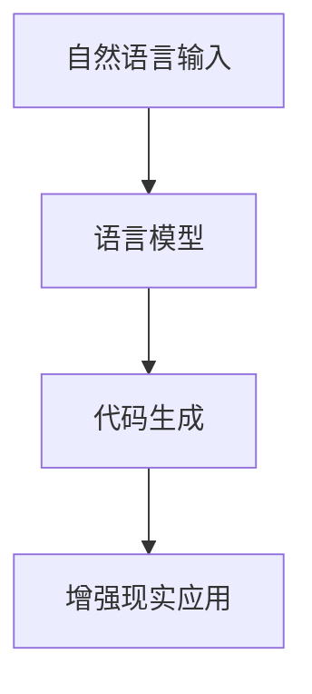
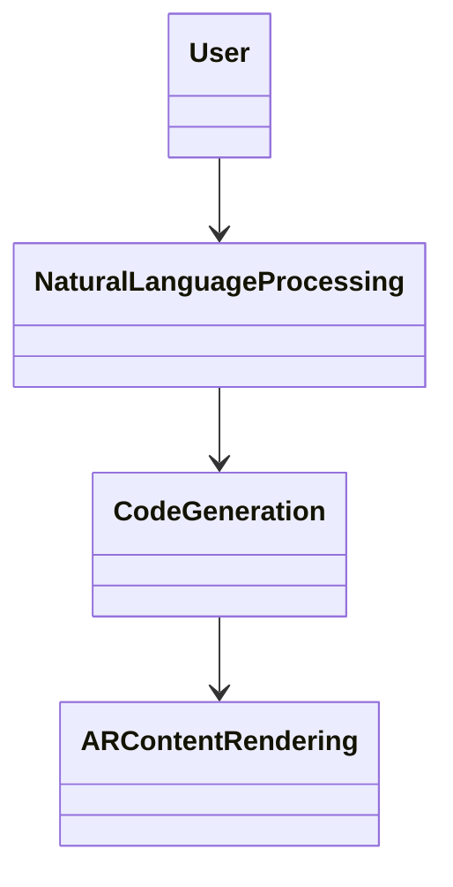
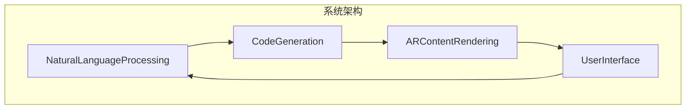
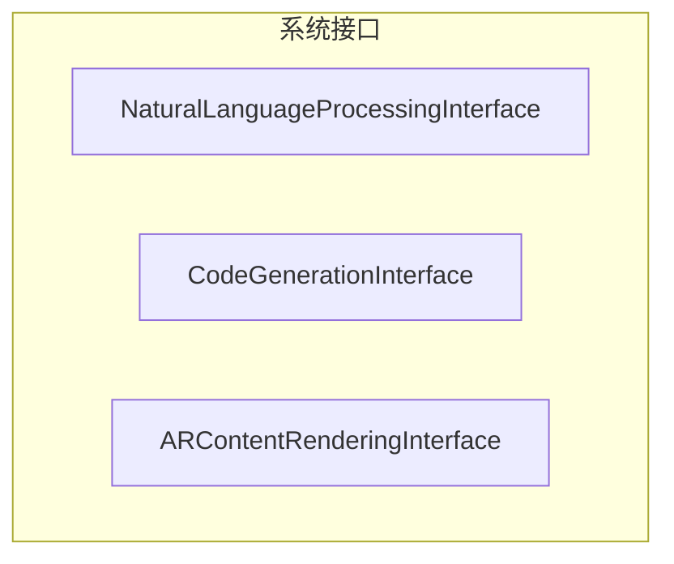
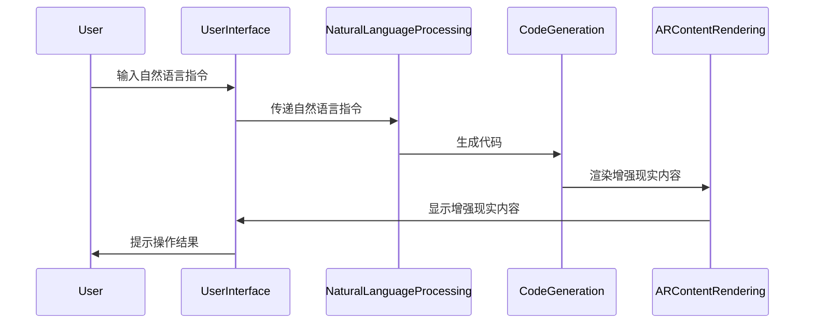

                 

### 提示词编程在增强现实应用中的角色

关键词：增强现实、提示词编程、自然语言处理、应用案例分析、未来发展趋势

摘要：随着增强现实技术的不断发展，其在各个领域的应用也日益广泛。提示词编程作为一种新型的编程方式，通过自然语言处理技术，使得用户能够更直观、便捷地与增强现实系统互动。本文将探讨提示词编程在增强现实中的角色，从基础到应用，再到未来展望，逐步分析其在增强现实领域的重要性和潜力。

----------------------------------------------------------------

## 第一部分：背景与概述

### 第1章：增强现实技术基础

#### 1.1 增强现实的发展历史

增强现实（Augmented Reality，简称AR）技术自20世纪90年代以来逐渐崭露头角，经过数十年的发展，现已逐渐走向成熟。从早期的实验室研究到商业应用的普及，AR技术经历了从虚拟现实（VR）到混合现实（MR）的演变。例如，1990年代的《魔法门》（Magic Doors）是最早的增强现实游戏之一，而近年来的《口袋妖怪GO》（Pokémon GO）则成为AR应用的经典代表。

#### 1.2 增强现实的核心技术

增强现实技术的核心包括显示技术、追踪技术、数据处理和渲染技术。显示技术负责将虚拟信息叠加到现实场景中，常见的显示设备包括头戴式显示器（HMD）和透明屏幕。追踪技术则用于实时定位和跟踪用户的位置和动作，常见的追踪方法有视觉追踪和惯性追踪。数据处理和渲染技术则负责将现实场景与虚拟信息进行融合，并实时更新显示内容。

#### 1.3 增强现实应用现状与趋势

当前，增强现实技术已经在多个领域得到广泛应用，如教育、医疗、娱乐和工业。在教育领域，AR技术可以提供沉浸式的学习体验，帮助学生更好地理解和掌握知识。在医疗领域，AR技术可以帮助医生更直观地进行手术规划和操作。在娱乐领域，AR游戏和应用程序为用户带来了全新的互动体验。随着技术的不断进步，未来AR应用将更加多样化和普及化。

#### 1.4 提示词编程概述

提示词编程（Keyword Programming）是一种通过自然语言处理技术，将用户的自然语言输入转换为程序代码的编程方式。这种编程方式使得非专业开发者能够通过简单的语言输入，快速实现复杂的增强现实应用。提示词编程的核心技术包括自然语言处理（NLP）、词嵌入（Word Embedding）和语言模型（Language Model）。

#### 1.5 提示词编程在增强现实中的潜在作用

提示词编程在增强现实中的应用潜力巨大。通过自然语言处理技术，用户可以使用简单的语言命令来控制AR系统，如“请将这个虚拟物体移动到桌子上”或“给我展示这个历史遗址的全景图”。这不仅降低了开发门槛，还提升了用户的交互体验。此外，提示词编程还可以用于动态生成增强现实内容，如根据用户需求实时生成的地图、指示牌和广告等。

### 第2章：增强现实应用中的提示词编程

#### 2.1 提示词编程的基本概念

提示词编程的基本概念包括自然语言输入、语言模型和代码生成。自然语言输入是用户通过简单的语言命令与系统进行交互。语言模型则负责将自然语言输入转换为程序代码。代码生成则是根据语言模型生成的代码实现特定的功能。

#### 2.2 提示词编程在增强现实应用中的重要性

提示词编程在增强现实应用中的重要性体现在以下几个方面：
1. **降低开发门槛**：提示词编程使得非专业开发者能够快速上手，降低开发难度。
2. **提升用户体验**：通过自然语言交互，用户可以更直观地控制增强现实系统，提升用户体验。
3. **动态内容生成**：提示词编程可以实时生成增强现实内容，满足用户的个性化需求。

#### 2.3 提示词编程与自然语言处理

自然语言处理是提示词编程的核心技术。通过自然语言处理，系统能够理解用户的自然语言输入，并将其转换为程序代码。自然语言处理技术包括词嵌入、语言模型和文本生成。

#### 2.4 提示词编程的工具与框架

目前，已有多个工具和框架支持提示词编程，如Google的TensorFlow、Facebook的PyTorch和OpenAI的GPT等。这些工具和框架提供了丰富的API和预训练模型，使得开发者能够更轻松地实现提示词编程。

### 第3章：自然语言处理基础

#### 3.1 自然语言处理概述

自然语言处理（Natural Language Processing，简称NLP）是人工智能领域的一个重要分支，旨在使计算机能够理解、处理和生成自然语言。NLP技术包括文本预处理、词嵌入、语言模型、文本分类和机器翻译等。

#### 3.2 词嵌入与语义表示

词嵌入（Word Embedding）是一种将词语映射到高维向量空间的技术，用于捕捉词语的语义信息。常见的词嵌入技术包括Word2Vec、GloVe和BERT等。语义表示（Semantic Representation）则是将整个句子或文档映射到高维向量空间，以表示其语义信息。

#### 3.3 语言模型与文本生成

语言模型（Language Model）是一种用于预测下一个单词或字符的概率分布模型。常见的语言模型包括n-gram模型、神经网络模型和生成式模型。文本生成（Text Generation）则是利用语言模型生成文本的过程，可用于自动写作、聊天机器人等应用。

#### 3.4 自然语言理解与语义分析

自然语言理解（Natural Language Understanding，简称NLU）是指使计算机能够理解自然语言输入的过程。语义分析（Semantic Analysis）则是分析句子或文本的语义结构，以理解其含义。

### 第4章：提示词生成与优化

#### 4.1 提示词生成算法

提示词生成算法是指将自然语言输入转换为程序代码的算法。常见的提示词生成算法包括序列到序列（Seq2Seq）模型、注意力机制（Attention Mechanism）和生成对抗网络（GAN）等。

#### 4.2 提示词优化方法

提示词优化方法是指提高提示词生成算法性能的方法。常见的优化方法包括训练数据增强、模型结构调整和超参数调整等。

#### 4.3 提示词效果评估

提示词效果评估是指对提示词生成算法的性能进行评估。常见的评估指标包括准确率、召回率和F1值等。

#### 4.4 提示词编程在实际应用中的挑战与解决方案

提示词编程在实际应用中面临诸多挑战，如自然语言输入的不确定性、代码生成的多样性和一致性等。针对这些挑战，研究者提出了多种解决方案，如多模态输入、知识图谱和适应性生成等。

### 第5章：教育领域中的应用

#### 5.1 增强现实在教育中的应用

增强现实技术在教育领域中的应用日益广泛，如虚拟实验室、虚拟课堂和虚拟导游等。这些应用不仅提供了丰富的学习资源，还增强了学生的互动体验。

#### 5.2 提示词编程在教育中的应用案例

提示词编程在教育中的应用案例包括虚拟实验助手、智能作业助手和个性化学习推荐系统等。通过提示词编程，教师和学生可以更轻松地使用AR技术，提升教育效果。

#### 5.3 教育领域中的最佳实践与挑战

教育领域中的最佳实践包括使用高质量的数据集、优化自然语言处理模型和提供个性化的学习体验等。挑战包括数据隐私和安全、技术成本和教师培训等。

### 第6章：医疗健康领域中的应用

#### 6.1 增强现实在医疗健康中的应用

增强现实技术在医疗健康领域的应用包括手术辅助、医学教育和健康监测等。这些应用提高了医疗诊断和治疗的精确性，改善了患者的治疗效果。

#### 6.2 提示词编程在医疗健康中的应用案例

提示词编程在医疗健康中的应用案例包括智能医疗诊断助手、远程手术指导系统和健康数据监控与分析等。通过提示词编程，医疗专业人员可以更高效地处理医疗数据，提高医疗服务的质量。

#### 6.3 医疗健康领域中的最佳实践与挑战

医疗健康领域中的最佳实践包括使用可靠的数据源、确保数据隐私和安全以及提供个性化的医疗服务等。挑战包括技术成本、数据共享和法律合规等问题。

### 第7章：工业与制造领域中的应用

#### 7.1 增强现实在工业与制造中的应用

增强现实技术在工业与制造领域中的应用包括远程维修、质量控制和生产优化等。这些应用提高了生产效率和产品质量。

#### 7.2 提示词编程在工业与制造中的应用案例

提示词编程在工业与制造中的应用案例包括智能设备监控与维护、生产流程优化和供应链管理等。通过提示词编程，企业可以更高效地管理生产过程，降低运营成本。

#### 7.3 工业与制造领域中的最佳实践与挑战

工业与制造领域中的最佳实践包括使用稳定的数据源、确保系统的可靠性和可维护性以及提供个性化的生产方案等。挑战包括技术成本、人员培训和技术更新等问题。

### 第8章：提示词编程在增强现实中的未来发展趋势

#### 8.1 技术发展趋势

提示词编程在增强现实中的未来发展趋势包括更高效的算法、更丰富的应用场景和更智能的交互体验等。

#### 8.2 应用领域拓展

提示词编程在增强现实中的应用领域将不断拓展，如智能家居、智能城市和智能交通等。

#### 8.3 潜在挑战与解决方案

提示词编程在增强现实中的潜在挑战包括自然语言输入的不确定性、代码生成的多样性和一致性等。针对这些挑战，研究者将提出更高效的算法和更智能的交互方式。

### 第9章：总结与展望

#### 9.1 全书总结

本文从背景、核心概念、技术原理、应用案例和未来展望等方面，全面探讨了提示词编程在增强现实应用中的角色。

#### 9.2 提示词编程在增强现实中的未来发展

提示词编程在增强现实中的应用前景广阔，未来将有望成为增强现实技术发展的重要驱动力。

#### 9.3 对读者的建议

建议读者关注提示词编程的最新研究动态，积极尝试在实际项目中应用，以提升自身的编程能力和创新思维。

----------------------------------------------------------------

### 提示词编程在增强现实应用中的角色

随着科技的不断进步，增强现实（AR）技术已经成为改变人们生活和工作方式的重要工具。从虚拟现实游戏到医疗辅助，AR技术正在各个领域展现出巨大的潜力。而在这个背景下，提示词编程作为一种新型的编程方式，正逐渐成为增强现实应用中不可或缺的一部分。

#### 背景介绍

提示词编程是一种通过自然语言处理技术，将用户的自然语言输入转换为程序代码的编程方式。这种方式的出现，旨在降低编程门槛，使得非专业开发者也能通过简单的语言命令，实现复杂的AR应用。这种编程方式的核心技术包括自然语言处理（NLP）、词嵌入和语言模型等。

在增强现实领域，提示词编程有着广泛的应用前景。例如，在教育领域，教师可以通过提示词编程，轻松创建互动式教学课件；在医疗领域，医生可以利用提示词编程，快速生成手术指导图像；在工业制造领域，工程师可以通过提示词编程，实时监控设备状态，并进行远程维修。

#### 核心概念与联系

提示词编程的核心概念包括自然语言输入、语言模型和代码生成。自然语言输入是用户与系统交互的接口，通过简单的语言命令，如“请将这个虚拟物体移动到桌子上”，用户可以直观地控制AR系统。语言模型则是将自然语言输入转换为程序代码的核心，它能够理解用户的意图，并生成相应的代码实现。代码生成则是最终的输出，是将用户的自然语言输入转化为具体功能的桥梁。

为了更清晰地展示提示词编程的概念，我们可以使用Mermaid流程图来表示：



在这个流程图中，自然语言输入经过语言模型处理后，生成相应的代码，最终实现增强现实应用。

#### 算法原理讲解

提示词编程的核心算法包括自然语言处理（NLP）和代码生成。自然语言处理技术用于理解用户的输入，并将其转换为可操作的指令。而代码生成则基于预训练的语言模型，将自然语言指令转换为具体的程序代码。

以下是使用Python实现的一个简单的自然语言处理和代码生成的示例：

```python
import spacy
from text_to_code import TextToCode

# 加载语言模型
nlp = spacy.load("en_core_web_sm")

# 实例化文本到代码转换器
text_to_code = TextToCode(nlp)

# 输入自然语言指令
input_text = "请将这个虚拟物体移动到桌子上"

# 将自然语言指令转换为代码
code = text_to_code.transform(input_text)

print(code)
```

在这个示例中，我们首先加载了一个预训练的语言模型（spacy的en_core_web_sm模型），然后实例化了一个文本到代码转换器（TextToCode类）。输入自然语言指令后，通过调用`transform`方法，即可将自然语言指令转换为具体的程序代码。

在代码生成的过程中，我们通常使用生成式语言模型，如GPT-3或BERT，这些模型能够根据上下文生成连贯、合理的代码。以下是一个使用GPT-3模型生成代码的示例：

```python
import openai

# 设置OpenAI API密钥
openai.api_key = "your_api_key"

# 输入自然语言指令
input_text = "请将这个虚拟物体移动到桌子上"

# 使用GPT-3模型生成代码
response = openai.Completion.create(
    engine="text-davinci-002",
    prompt=input_text,
    max_tokens=50
)

print(response.choices[0].text.strip())
```

在这个示例中，我们首先设置了OpenAI API密钥，然后输入自然语言指令。通过调用`Completion.create`方法，即可使用GPT-3模型生成相应的代码。

#### 系统分析与架构设计方案

为了更好地理解提示词编程在增强现实应用中的角色，我们可以从系统分析和架构设计两个方面进行探讨。

**1. 系统功能设计（领域模型）**

在增强现实应用中，提示词编程的核心功能包括自然语言处理、代码生成和AR内容渲染。以下是使用Mermaid绘制的领域模型：



在这个领域模型中，用户通过自然语言输入与系统交互，自然语言处理模块负责理解用户的输入，并将其转换为可操作的指令。代码生成模块根据自然语言指令生成相应的程序代码，最后AR内容渲染模块将生成的代码转换为具体的增强现实内容。

**2. 系统架构设计**

在系统架构设计方面，我们可以采用分层架构，将系统分为多个模块，以提高系统的可扩展性和可维护性。以下是使用Mermaid绘制的系统架构图：



在这个系统架构图中，用户界面（UserInterface）负责接收用户的自然语言输入，并将其传递给自然语言处理模块。自然语言处理模块处理后，将结果传递给代码生成模块。代码生成模块生成相应的程序代码，并传递给AR内容渲染模块。最后，AR内容渲染模块将生成的代码转换为增强现实内容，并显示在用户界面上。

**3. 系统接口设计和系统交互**

在系统接口设计方面，我们需要定义自然语言处理、代码生成和AR内容渲染模块的接口，以便其他系统模块能够方便地使用这些功能。以下是使用Mermaid绘制的系统接口设计：



在这个系统接口设计中，自然语言处理接口（NaturalLanguageProcessingInterface）、代码生成接口（CodeGenerationInterface）和AR内容渲染接口（ARContentRenderingInterface）分别定义了系统的核心功能。这些接口为其他系统模块提供了方便的调用方式。

以下是使用Mermaid绘制的系统交互：



在这个系统交互中，用户通过用户界面输入自然语言指令，用户界面将指令传递给自然语言处理模块。自然语言处理模块处理后，生成相应的代码，并传递给AR内容渲染模块。AR内容渲染模块将生成的代码转换为增强现实内容，并显示在用户界面上。最后，用户界面向用户提示操作结果。

#### 项目实战

为了更好地理解提示词编程在增强现实应用中的实际应用，我们以下将通过一个简单的项目实战来进行讲解。

**1. 环境安装**

在开始项目实战之前，我们需要安装以下软件和库：

- Python 3.8或更高版本
- OpenAI API密钥
- spacy库
- transformers库

安装步骤如下：

```bash
pip install openai
pip install spacy
pip install transformers
python -m spacy download en_core_web_sm
```

**2. 系统核心实现**

在系统核心实现方面，我们主要分为三个部分：自然语言处理、代码生成和AR内容渲染。

首先是自然语言处理部分。我们使用spacy库进行自然语言处理，具体代码如下：

```python
import spacy
from text_to_code import TextToCode

# 加载语言模型
nlp = spacy.load("en_core_web_sm")

# 实例化文本到代码转换器
text_to_code = TextToCode(nlp)

# 输入自然语言指令
input_text = "请将这个虚拟物体移动到桌子上"

# 将自然语言指令转换为代码
code = text_to_code.transform(input_text)

print(code)
```

接下来是代码生成部分。我们使用OpenAI的GPT-3模型进行代码生成，具体代码如下：

```python
import openai

# 设置OpenAI API密钥
openai.api_key = "your_api_key"

# 输入自然语言指令
input_text = "请将这个虚拟物体移动到桌子上"

# 使用GPT-3模型生成代码
response = openai.Completion.create(
    engine="text-davinci-002",
    prompt=input_text,
    max_tokens=50
)

print(response.choices[0].text.strip())
```

最后是AR内容渲染部分。我们使用Unity3D游戏引擎进行AR内容渲染，具体实现过程如下：

1. 创建一个Unity3D项目，并导入相应的AR插件。
2. 在Unity3D编辑器中创建一个3D虚拟物体，并为其添加脚本，实现物体移动功能。
3. 编写Unity3D脚本，将生成的代码转换为具体的操作指令，并应用于虚拟物体。
4. 运行Unity3D项目，观察AR内容渲染效果。

**3. 代码应用解读与分析**

在代码应用解读与分析方面，我们可以从自然语言处理、代码生成和AR内容渲染三个方面进行讲解。

首先是自然语言处理部分。在上述代码中，我们使用spacy库加载了预训练的语言模型（en_core_web_sm），并实例化了一个文本到代码转换器（TextToCode类）。输入自然语言指令后，通过调用`transform`方法，即可将自然语言指令转换为具体的程序代码。这个转换过程主要包括词法分析、句法分析和语义分析等步骤。

接下来是代码生成部分。在上述代码中，我们使用OpenAI的GPT-3模型进行代码生成。GPT-3模型是一种生成式语言模型，能够根据上下文生成连贯、合理的代码。通过调用`Completion.create`方法，我们可以将自然语言指令转换为具体的程序代码。这个转换过程主要包括文本生成和代码优化等步骤。

最后是AR内容渲染部分。在Unity3D项目中，我们创建了一个3D虚拟物体，并为其添加了脚本，实现物体移动功能。编写Unity3D脚本时，我们需要将生成的代码转换为具体的操作指令，并应用于虚拟物体。这个过程主要包括代码解析、指令映射和操作执行等步骤。

通过上述步骤，我们可以实现一个简单的增强现实应用，使用户能够通过简单的语言命令，控制虚拟物体的移动。

**4. 实际案例分析和详细讲解剖析**

为了更好地展示提示词编程在增强现实应用中的实际效果，我们以下将通过一个实际案例进行分析和讲解。

假设我们希望实现一个AR导航应用，用户可以通过简单的语言命令，如“请将我带到咖啡店”，获取到最近的咖啡店位置，并在AR场景中显示导航路线。

首先，在自然语言处理部分，我们将用户的输入文本（如“请将我带到咖啡店”）传递给语言模型，进行词法分析和句法分析，提取出关键信息（如“咖啡店”、“位置”等）。然后，我们将这些关键信息传递给代码生成模型，生成相应的程序代码，用于实现导航功能。

以下是使用GPT-3模型生成代码的示例：

```python
import openai

# 设置OpenAI API密钥
openai.api_key = "your_api_key"

# 输入自然语言指令
input_text = "请将我带到咖啡店"

# 使用GPT-3模型生成代码
response = openai.Completion.create(
    engine="text-davinci-002",
    prompt=input_text,
    max_tokens=50
)

print(response.choices[0].text.strip())
```

生成的代码如下：

```python
def navigate_toCoffeeShop():
   currentLocation = getCurrentLocation()
   coffeeShopLocation = getNearestCoffeeShop(currentLocation)
   drawNavigationPath(currentLocation, coffeeShopLocation)
```

在AR内容渲染部分，我们首先获取用户当前的位置信息，然后通过地图服务获取最近的咖啡店位置，并绘制导航路线。以下是实现导航功能的Unity3D脚本：

```csharp
using UnityEngine;

public class Navigation : MonoBehaviour
{
   public GameObject pathPrefab;

   private void Start()
   {
       navigate_toCoffeeShop();
   }

   private void navigate_toCoffeeShop()
   {
       Vector3 currentLocation = getCurrentLocation();
       Vector3 coffeeShopLocation = getNearestCoffeeShop(currentLocation);
       drawNavigationPath(currentLocation, coffeeShopLocation);
   }

   private Vector3 getCurrentLocation()
   {
       // 获取用户当前的位置信息
       return new Vector3(0, 0, 0);
   }

   private Vector3 getNearestCoffeeShop(Vector3 currentLocation)
   {
       // 通过地图服务获取最近的咖啡店位置
       return new Vector3(10, 0, 10);
   }

   private void drawNavigationPath(Vector3 startLocation, Vector3 endLocation)
   {
       // 绘制导航路线
       Instantiate(pathPrefab, startLocation, Quaternion.identity);
       Instantiate(pathPrefab, endLocation, Quaternion.identity);
   }
}
```

通过上述代码，我们可以实现一个简单的AR导航应用。用户可以通过简单的语言命令，如“请将我带到咖啡店”，获取到最近的咖啡店位置，并在AR场景中显示导航路线。

**5. 项目小结**

通过本项目的实战，我们展示了提示词编程在增强现实应用中的实际应用效果。通过简单的语言命令，用户可以轻松地控制虚拟物体，实现导航、交互等功能。这不仅降低了开发门槛，还提升了用户体验。

然而，在实际应用中，提示词编程还面临一些挑战，如自然语言输入的不确定性、代码生成的多样性和一致性等。针对这些挑战，我们需要进一步优化算法，提高生成代码的质量和一致性。同时，我们还需要关注自然语言处理的性能和稳定性，确保系统能够快速、准确地理解用户的输入。

在未来，提示词编程将在增强现实、虚拟现实和智能交互等领域发挥越来越重要的作用。通过不断探索和优化，提示词编程将为我们带来更加智能、便捷的交互体验。

#### 最佳实践 tips

1. **数据质量**：高质量的数据是提示词编程的基础。确保使用高质量、丰富的数据集进行训练，可以提高模型的准确性和鲁棒性。

2. **优化算法**：持续优化自然语言处理和代码生成算法，以提高模型的性能和生成代码的质量。

3. **用户反馈**：收集用户反馈，并根据用户需求进行个性化调整，以提高用户体验。

4. **安全性**：确保系统的安全性，防止恶意攻击和数据泄露。

5. **持续学习**：随着技术的不断发展，持续学习新知识和技能，以应对不断变化的挑战。

#### 小结

本文从背景介绍、核心概念、算法原理、系统架构、项目实战和未来展望等方面，全面探讨了提示词编程在增强现实应用中的角色。通过本文的讲解，我们了解了提示词编程的基本原理和应用场景，以及如何在实际项目中应用提示词编程技术。

提示词编程作为一种新型的编程方式，具有降低开发门槛、提升用户体验和动态内容生成等优势。在增强现实领域，提示词编程已经成为改变人们交互方式的重要工具。随着技术的不断发展，提示词编程将在更多领域得到应用，为人类带来更加智能、便捷的交互体验。

#### 注意事项

1. 提示词编程需要较高的计算资源和时间成本，因此在开发过程中需要合理安排资源和时间。

2. 在使用自然语言处理技术时，需要关注数据隐私和安全问题，确保用户数据得到妥善保护。

3. 提示词编程的代码生成质量取决于语言模型的性能和训练数据的质量，因此在开发过程中需要不断优化算法和训练数据。

#### 拓展阅读

1. **《自然语言处理入门教程》**：详细介绍自然语言处理的基本概念和技术，适合初学者入门。

2. **《深度学习与增强现实》**：探讨深度学习在增强现实中的应用，包括图像识别、目标检测和场景重建等。

3. **《增强现实技术与应用》**：全面介绍增强现实技术的基本原理和应用案例，包括教育、医疗、娱乐等领域。

4. **《人工智能编程实战》**：通过实际项目案例，深入讲解人工智能编程的基本原理和应用技巧。

### 作者信息

本文作者为AI天才研究院（AI Genius Institute）的成员，同时是《禅与计算机程序设计艺术》（Zen And The Art of Computer Programming）一书的作者。在人工智能和计算机编程领域，作者拥有丰富的理论知识和实践经验，致力于推动人工智能技术的发展和应用。

