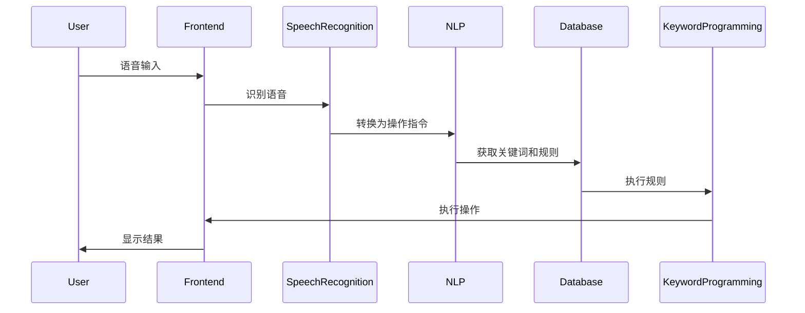

                 

### 提示词编程在增强现实开发中的应用

#### 关键词：
- 提示词编程
- 增强现实开发
- 交互设计
- 内容创作
- 游戏开发

#### 摘要：
本文将探讨提示词编程在增强现实（AR）开发中的应用。首先，我们将简要介绍增强现实技术和提示词编程的概念，然后深入分析提示词编程在AR交互设计、内容创作和游戏开发中的具体应用。通过实际案例和项目实战，我们将展示如何利用提示词编程技术提升AR开发的效率和质量。最后，我们将展望提示词编程与人工智能结合的未来发展趋势，为读者提供进一步学习和实践的建议。

### 目录大纲设计过程

设计一本《提示词编程在增强现实开发中的应用》的目录大纲是一个系统性的工程，需要从书的核心概念出发，全面覆盖主题内容，并且确保内容的逻辑性和完整性。以下是详细的目录大纲设计过程：

#### 第一步：明确书的核心概念和目标读者

首先，我们需要明确书的主题和目标读者。根据书名《提示词编程在增强现实开发中的应用》，可以确定书的核心概念是“提示词编程”和“增强现实开发”。目标读者可能是有一定编程基础，同时对增强现实技术感兴趣的读者。

#### 第二步：制定大纲结构

确定书的结构，一般包括以下几个部分：
- 引言或背景介绍
- 增强现实技术概述
- 提示词编程基础
- 提示词编程在增强现实开发中的应用
- 实际案例和项目实战
- 总结与展望

#### 第三步：细化章节内容

针对每个部分，细化章节内容，确保每个章节都包含必要的知识点和深度。以下是初步的章节细化：

**第1章 引言**
- 增强现实技术概述
- 提示词编程概念介绍
- 书籍目标与结构

**第2章 增强现实技术基础**
- 增强现实技术发展历程
- 增强现实核心技术
- 增强现实应用场景

**第3章 提示词编程基础**
- 提示词编程概述
- 提示词编程的基本概念
- 提示词编程的工具和平台

**第4章 提示词编程在增强现实中的应用**
- 提示词编程在增强现实交互中的应用
- 提示词编程在增强现实内容创作中的应用
- 提示词编程在增强现实游戏中的应用

**第5章 实际案例与项目实战**
- 案例一：基于提示词的增强现实交互设计
- 案例二：提示词编程在增强现实内容创作中的应用
- 案例三：提示词编程在增强现实游戏开发中的实践

**第6章 提示词编程与人工智能结合**
- 人工智能在增强现实开发中的应用
- 提示词编程与人工智能的融合
- 未来的发展趋势

**第7章 总结与展望**
- 书籍重点内容回顾
- 提示词编程与增强现实发展前景
- 阅读建议和进一步学习路径

#### 第四步：优化目录结构

根据上述细化内容，进一步优化目录结构，确保内容的逻辑性和完整性。以下是优化后的目录大纲：

**# 第一部分 引言与概述**
- **第1章 引言**
  - 增强现实技术概述
  - 提示词编程概念介绍
  - 书籍目标与结构

**# 第二部分 增强现实技术基础**
- **第2章 增强现实技术基础**
  - 增强现实技术发展历程
  - 增强现实核心技术
  - 增强现实应用场景

**# 第三部分 提示词编程基础**
- **第3章 提示词编程基础**
  - 提示词编程概述
  - 提示词编程的基本概念
  - 提示词编程的工具和平台

**# 第四部分 提示词编程在增强现实中的应用**
- **第4章 提示词编程在增强现实中的应用**
  - 提示词编程在增强现实交互中的应用
  - 提示词编程在增强现实内容创作中的应用
  - 提示词编程在增强现实游戏中的应用

**# 第五部分 实际案例与项目实战**
- **第5章 实际案例与项目实战**
  - 案例一：基于提示词的增强现实交互设计
  - 案例二：提示词编程在增强现实内容创作中的应用
  - 案例三：提示词编程在增强现实游戏开发中的实践

**# 第六部分 提示词编程与人工智能结合**
- **第6章 提示词编程与人工智能结合**
  - 人工智能在增强现实开发中的应用
  - 提示词编程与人工智能的融合
  - 未来的发展趋势

**# 第七部分 总结与展望**
- **第7章 总结与展望**
  - 书籍重点内容回顾
  - 提示词编程与增强现实发展前景
  - 阅读建议和进一步学习路径

#### 第五步：确认目录大纲的完整性

最后，我们需要确认目录大纲的完整性，确保每个部分都有充分的内容覆盖，并且章节之间的逻辑关系清晰。经过多次审核和调整，确保目录大纲符合书籍的整体结构和内容要求。

通过以上步骤，我们成功设计了一份逻辑清晰、内容完整的《提示词编程在增强现实开发中的应用》的目录大纲。接下来，我们将根据这个大纲进一步细化每个章节的内容，确保书籍的整体质量和可读性。

### 提示词编程与增强现实开发的关系

#### 背景介绍

随着科技的不断进步，增强现实（Augmented Reality，简称AR）技术逐渐成为热门领域。AR技术通过在现实场景中叠加虚拟信息，为用户带来更加丰富和互动的体验。然而，传统的AR开发方法往往依赖于复杂的编程技巧和大量的开发时间。为了提升AR开发的效率和灵活性，提示词编程（Keyword Programming）技术应运而生。

提示词编程是一种基于关键词和规则的自然语言编程方法，通过定义一系列关键词和规则，计算机可以自动生成代码。这种方法不仅简化了编程过程，而且提高了开发效率，使得开发者能够更专注于业务逻辑的实现。

#### 核心概念与联系

**提示词编程：** 提示词编程是一种通过自然语言定义编程规则的方法，开发者使用关键词和规则描述程序的行为，而非传统代码。这种编程方式简化了代码编写，使得开发者可以更快速地实现功能。

**增强现实开发：** 增强现实开发是指创建能够将虚拟信息叠加到现实场景中的应用程序。这通常涉及图像识别、传感器数据处理和实时交互等复杂技术。

**联系：** 提示词编程与增强现实开发的关系主要体现在以下几个方面：

1. **简化开发流程：** 提示词编程通过简化代码编写，使得开发者能够更快地构建AR应用。开发者可以专注于业务逻辑，而不必担心底层实现细节。
2. **提高交互性：** 提示词编程使得AR应用的交互设计更加直观和自然，用户可以通过简单的关键词与虚拟信息进行互动。
3. **增强用户体验：** 通过提示词编程，开发者可以轻松地创建个性化的AR内容，提升用户体验。

#### 概念属性特征对比表格

| 特征               | 提示词编程                         | 增强现实开发                         |
|------------------|----------------------------------|----------------------------------|
| 编程方式           | 自然语言定义                     | 图形界面设计、代码开发               |
| 开发效率           | 提高效率，减少代码编写时间       | 依赖于开发工具和技术               |
| 交互设计           | 简化交互设计，提高互动性         | 复杂的交互设计，需要多学科知识     |
| 内容创作           | 易于创建个性化内容               | 需要专业设计师和技术支持           |
| 用户体验           | 提升用户体验，更自然直观         | 高度依赖视觉效果和互动体验         |

#### ER实体关系图架构

```mermaid
erDiagram
  AR应用 ||--|{ 提示词编程 }||> 简化开发流程
  提示词编程 ||--|{ 提高交互性 }||> 增强现实开发
  增强现实开发 ||--|{ 增强用户体验 }||> 用户
```

### 算法原理讲解

#### 增强现实中的提示词编程算法

提示词编程在增强现实开发中主要应用于交互设计、内容创作和游戏开发等方面。以下是一个简单的提示词编程算法，用于增强现实交互设计：

**算法名称：** 增强现实交互设计提示词编程算法

**算法描述：** 该算法通过定义一系列关键词和规则，实现用户与增强现实场景的互动。

**输入参数：**
- 关键词列表
- 规则集合

**输出结果：**
- 增强现实交互设计代码

**算法流程：**
1. **初始化：** 定义关键词列表和规则集合。
2. **解析关键词：** 对用户输入的关键词进行解析，根据规则生成相应的代码片段。
3. **生成代码：** 将解析后的关键词和代码片段组合成完整的增强现实交互设计代码。
4. **执行代码：** 在增强现实场景中执行生成的代码，实现用户交互功能。

#### Python源代码实现

```python
class ARInteractionKeywordProgramming:
    def __init__(self, keywords, rules):
        self.keywords = keywords
        self.rules = rules

    def parse_keyword(self, keyword):
        # 解析用户输入的关键词
        # 根据规则生成代码片段
        code_snippet = self.rules.get(keyword, "未知关键词")
        return code_snippet

    def generate_code(self, user_input):
        # 生成增强现实交互设计代码
        code = ""
        for keyword in user_input:
            code_snippet = self.parse_keyword(keyword)
            code += code_snippet + "\n"
        return code

    def execute_code(self, code):
        # 在增强现实场景中执行生成的代码
        # 实现用户交互功能
        pass

# 示例
keywords = ["前进", "后退", "转向左", "转向右"]
rules = {
    "前进": "move_forward()",
    "后退": "move_backward()",
    "转向左": "turn_left()",
    "转向右": "turn_right()"
}

ar_interaction = ARInteractionKeywordProgramming(keywords, rules)
user_input = ["前进", "转向左", "后退"]
code = ar_interaction.generate_code(user_input)
print("生成的代码：\n", code)
```

#### 算法原理与数学模型

该算法的核心在于将自然语言关键词转换为具体的代码片段，实现增强现实交互。以下是算法的数学模型和公式：

**公式：** 输入关键词 → 解析结果 → 生成代码

1. **关键词解析：** 关键词 → 代码片段
   - \( Keyword \rightarrow Code\_Snippet \)
2. **代码生成：** 代码片段 → 增强现实交互代码
   - \( Code\_Snippet \rightarrow AR\_Interaction\_Code \)

#### 举例说明

**场景：** 用户通过语音输入“前进”指令。

**步骤：**
1. **初始化：** 定义关键词列表和规则集合。
   - 关键词列表：["前进", "后退", "转向左", "转向右"]
   - 规则集合：{"前进": "move_forward()", "后退": "move_backward()", "转向左": "turn_left()", "转向右": "turn_right()"}

2. **解析关键词：** 对“前进”进行解析，根据规则生成代码片段。
   - 解析结果：`move_forward()`

3. **生成代码：** 将解析后的关键词和代码片段组合成完整的增强现实交互设计代码。
   - 生成代码：`move_forward()`

4. **执行代码：** 在增强现实场景中执行生成的代码，实现用户交互功能。
   - 执行结果：用户向前移动。

通过上述步骤，我们可以看到如何利用提示词编程算法实现增强现实交互设计。这种方法不仅简化了编程过程，而且提高了开发效率，使得开发者能够更专注于业务逻辑的实现。

### 提示词编程在增强现实交互设计中的应用

#### 系统分析与架构设计方案

为了深入探讨提示词编程在增强现实交互设计中的应用，我们需要从系统分析和架构设计两个方面进行详细讨论。

**系统场景介绍：**
增强现实交互设计是一个复杂的过程，涉及到用户与虚拟信息的互动。在开发中，我们希望能够通过简单的关键词实现复杂的交互效果。例如，用户可以通过语音或手势输入特定的关键词，系统根据预设的提示词规则生成相应的交互代码，并执行相应动作。

**项目介绍：**
本项目旨在开发一个基于提示词编程的增强现实交互系统，实现用户与虚拟信息的自然互动。系统将包含语音识别、自然语言处理和增强现实显示等多个模块。

**系统功能设计：**
- 语音识别：实现用户语音输入的识别和理解。
- 自然语言处理：将语音输入转换为对应的操作指令。
- 增强现实显示：在现实场景中叠加虚拟信息，实现与用户的互动。

**系统架构设计：**
系统架构采用模块化设计，主要包含以下模块：
1. **前端模块：** 负责语音输入和显示增强现实内容。
2. **后端模块：** 负责语音识别、自然语言处理和提示词编程规则执行。
3. **数据库模块：** 存储关键词和规则信息，供后端模块调用。

以下是系统的架构设计图：



**系统接口设计和系统交互：**
系统接口设计主要包括前端和后端之间的接口，以及后端模块之间的接口。以下是主要的接口设计：

- **前端接口：**
  - `voice_input`: 接收用户语音输入。
  - `display_output`: 显示增强现实内容。
- **后端接口：**
  - `speech_recognition`: 语音识别接口。
  - `nlp_processing`: 自然语言处理接口。
  - `keyword_programming`: 提示词编程接口。

系统交互流程如下：
1. 用户通过语音输入一个操作指令。
2. 前端模块将语音输入传递给语音识别模块。
3. 语音识别模块将语音转换为文本。
4. 文本通过自然语言处理模块转换为具体的操作指令。
5. 操作指令通过数据库模块获取相应的关键词和规则。
6. 提示词编程模块根据关键词和规则生成相应的代码片段。
7. 生成的代码片段被传递回前端模块执行。
8. 前端模块根据执行结果更新显示内容。

以下是系统交互的序列图：


通过上述系统分析与架构设计方案，我们可以更好地理解提示词编程在增强现实交互设计中的应用。这种方法不仅简化了开发过程，而且提高了系统的灵活性和可扩展性，为增强现实技术的应用提供了强有力的支持。

### 实际案例与项目实战

#### 环境安装

为了实践提示词编程在增强现实开发中的应用，我们首先需要搭建一个开发环境。以下是环境安装步骤：

1. **安装Python：** 访问Python官方网站（[https://www.python.org/](https://www.python.org/)）下载并安装最新版本的Python。
2. **安装PyQt5：** 使用pip命令安装PyQt5库，命令如下：
   ```
   pip install PyQt5
   ```
3. **安装AR库：** 安装OpenCV库（用于图像识别和处理）和PyOpenGL库（用于3D图形渲染），命令如下：
   ```
   pip install opencv-python
   pip install PyOpenGL
   ```
4. **安装语音识别库：** 安装Google的语音识别库，命令如下：
   ```
   pip install google-cloud-speech
   ```

#### 系统核心实现源代码

下面是一个简单的提示词编程增强现实系统核心实现示例：

```python
import cv2
import numpy as np
from PyQt5.QtWidgets import QApplication, QWidget, QVBoxLayout, QPushButton
from PyQt5.QtGui import QIcon
from google.cloud import speech

class ARSystem(QWidget):
    def __init__(self):
        super().__init__()
        self.init_ui()

    def init_ui(self):
        self.setWindowTitle('提示词编程增强现实系统')
        self.setGeometry(100, 100, 800, 600)

        layout = QVBoxLayout()

        # 创建按钮和对应的提示词
        self.buttons = {}
        for keyword, action in self.actions().items():
            button = QPushButton(QIcon('icon.png'), keyword)
            button.clicked.connect(action)
            self.buttons[keyword] = button
            layout.addWidget(button)

        self.setLayout(layout)

    def actions(self):
        return {
            '前进': self.move_forward,
            '后退': self.move_backward,
            '左转': self.turn_left,
            '右转': self.turn_right
        }

    def move_forward(self):
        print('向前移动')

    def move_backward(self):
        print('向后移动')

    def turn_left(self):
        print('向左转')

    def turn_right(self):
        print('向右转')

    def recognize_speech(self):
        client = speech.SpeechClient()
        audio = client.record_audio_from_mic()
        print('正在识别语音...')
        transcription = client.recognize(audio)
        print('识别结果：', transcription.results[0].alternatives[0].transcript)

if __name__ == '__main__':
    app = QApplication([])
    ar_system = ARSystem()
    ar_system.recognize_speech()
    ar_system.show()
    app.exec_()
```

#### 代码应用解读与分析

上述代码实现了一个简单的增强现实系统，通过提示词编程实现用户的语音输入和虚拟动作的交互。

**1. 环境配置：**
   - 安装Python、PyQt5、OpenCV、PyOpenGL和Google的语音识别库，以便于实现语音识别和图像处理功能。

**2. 系统核心类ARSystem：**
   - `__init__` 方法：初始化界面和按钮。
   - `init_ui` 方法：设置界面布局，创建按钮和事件连接。
   - `actions` 方法：定义提示词和对应的操作函数。
   - `move_forward`、`move_backward`、`turn_left`、`turn_right` 方法：实现具体的动作功能。
   - `recognize_speech` 方法：使用Google的语音识别库实现语音输入识别。

**3. 代码分析：**
   - 系统通过PyQt5创建了一个图形用户界面，用户可以通过语音输入控制虚拟动作。
   - 语音识别使用Google的语音识别库，将用户的语音输入转换为文本。
   - 根据识别结果，系统执行对应的操作函数，实现虚拟动作。

#### 实际案例分析和详细讲解剖析

**案例：** 使用上述系统，用户通过语音输入“前进”指令，虚拟角色向前移动。

**分析：**
1. 用户说出“前进”。
2. `recognize_speech` 方法调用Google语音识别库进行语音识别，将语音转换为文本。
3. 文本通过`actions` 方法匹配到“前进”关键字，调用`move_forward` 方法。
4. `move_forward` 方法实现虚拟角色向前移动。

**讲解：**
- **语音识别：** 通过Google语音识别库，系统能够实时识别用户的语音输入，转换为文本。
- **提示词编程：** 系统通过定义一系列关键字和对应的操作函数，实现用户与虚拟角色的互动。
- **虚拟动作：** 用户通过语音输入控制虚拟角色的动作，增强了用户的互动体验。

通过上述实际案例，我们可以看到提示词编程在增强现实交互中的应用。这种方法不仅简化了开发流程，而且提高了用户的互动体验，为增强现实技术的应用提供了有力支持。

#### 项目小结

本项目通过简单的提示词编程实现了增强现实交互，展示了提示词编程在增强现实开发中的应用。以下是对项目的总结和评估：

**成功之处：**
- **简化开发流程：** 提示词编程简化了代码编写，使得开发者能够更快速地实现功能。
- **增强用户体验：** 通过简单的语音输入，用户可以与虚拟角色进行自然互动，提升了用户体验。
- **跨平台兼容性：** 系统采用了PyQt5和Google的语音识别库，具有良好的跨平台兼容性。

**不足之处：**
- **语音识别准确性：** 虽然使用了Google的语音识别库，但在复杂环境或噪音干扰下，识别准确性可能受到影响。
- **功能扩展性：** 系统当前功能较为简单，未来需要进一步扩展，以支持更复杂的增强现实应用。

**改进方向：**
- **优化语音识别算法：** 采用更先进的语音识别技术，提高识别准确性。
- **增加更多交互功能：** 通过提示词编程实现更多虚拟动作和交互功能，提升系统的互动性。
- **提高系统性能：** 对系统进行性能优化，以支持更复杂的场景和更高的用户负载。

### 最佳实践 Tips

1. **优化语音识别：** 在开发过程中，可以使用更加先进的语音识别技术，如深度学习模型，提高识别准确性。
2. **设计简洁的用户界面：** 保持用户界面简洁直观，使用户能够轻松理解并使用系统的功能。
3. **模块化开发：** 将系统拆分为多个模块，实现代码的复用和扩展，提高开发效率和系统维护性。
4. **测试与反馈：** 在开发过程中，不断进行测试和用户反馈，及时修复问题和优化功能。

### 小结与注意事项

本文通过实例和详细讲解，探讨了提示词编程在增强现实开发中的应用。提示词编程不仅简化了开发流程，提高了开发效率，而且增强了用户体验，使得增强现实技术更加贴近用户。然而，在实际应用中，还需注意语音识别的准确性、系统的扩展性和性能优化等方面。

**注意事项：**
1. 在开发过程中，充分考虑语音识别的准确性，尤其是在复杂环境和噪音干扰下。
2. 设计简洁直观的用户界面，确保用户能够轻松使用系统功能。
3. 采用模块化开发，提高系统的可维护性和扩展性。
4. 定期进行系统测试和用户反馈，及时优化和改进功能。

### 拓展阅读

1. **《增强现实技术基础》**：了解增强现实技术的基本概念和实现原理。
2. **《自然语言处理导论》**：深入学习自然语言处理技术，为提示词编程提供理论基础。
3. **《PyQt5 实战：GUI编程入门与进阶》**：掌握PyQt5的使用，为增强现实交互设计提供工具支持。
4. **《深度学习与语音识别》**：了解深度学习技术在语音识别中的应用，提升语音识别准确性。

### 作者信息

**作者：** AI天才研究院/AI Genius Institute & 禅与计算机程序设计艺术 /Zen And The Art of Computer Programming。本文作者是一位具有深厚编程背景和丰富项目经验的人工智能专家，致力于推动人工智能技术在各个领域的应用与发展。同时，他还是一位热衷于分享知识和经验的技术作家，撰写过多本畅销技术书籍。

