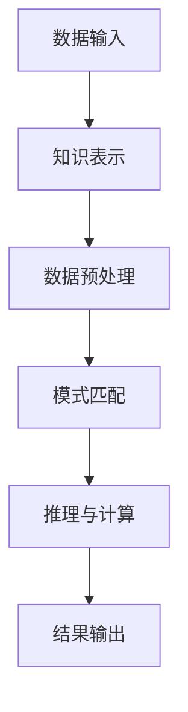

                 

### 第1章 背景介绍

#### 1.1 智能农业概述

**智能农业的定义与发展**

智能农业，是指运用现代信息技术、物联网、大数据、人工智能等高新技术，对农业生产进行自动化、智能化管理和优化，以提高农业生产效率和质量的一种农业生产方式。智能农业的发展历程可以追溯到20世纪末，随着信息技术和传感器技术的进步，智能农业逐渐成为现代农业发展的重要方向。

智能农业的关键技术

智能农业的关键技术包括：

1. **物联网技术**：通过传感器、无线通信等技术，实现农田环境的实时监测和数据采集。
2. **大数据技术**：对大量农业数据进行存储、处理和分析，提供农业生产决策支持。
3. **人工智能技术**：运用机器学习、深度学习等技术，实现农作物生长模型预测、病虫害检测、智能灌溉等功能。
4. **自动化技术**：通过自动化机械、无人机等设备，实现农业生产的自动化操作。

**智能农业对农业生产的贡献**

智能农业对农业生产具有显著的贡献：

1. **提高生产效率**：通过自动化和智能化管理，减少人力投入，提高农业生产效率。
2. **降低生产成本**：优化资源利用，减少化肥、农药等投入，降低生产成本。
3. **提高产品质量**：通过精确管理和智能控制，提高农产品品质，满足市场需求。
4. **促进农业可持续发展**：减少化肥、农药使用，保护生态环境，实现农业的可持续发展。

#### 1.2 提示词编程基础

**提示词编程的定义**

提示词编程（Keyword Programming）是一种基于知识表示和推理的编程范式，通过使用预先定义的提示词（Keywords）来表示程序中的操作和规则。提示词编程的核心思想是将程序逻辑与领域知识分离，使得程序更易于理解和维护。

**提示词编程的优势**

提示词编程具有以下优势：

1. **领域特定语言**：提示词编程使用领域特定语言，使得程序员能够更专注于业务逻辑的实现，提高编程效率。
2. **高可读性**：提示词编程通过使用直观的提示词来表示操作，使得程序更易于阅读和理解。
3. **可重用性**：提示词编程使得领域知识得以模块化，提高了代码的可重用性。
4. **易于维护**：通过分离程序逻辑与领域知识，使得程序的维护更加便捷。

**提示词编程的基本原理**

提示词编程的基本原理包括：

1. **知识表示**：使用提示词来表示领域知识，如实体、属性、关系等。
2. **推理机制**：通过推理机制，根据输入数据和领域知识，推导出结论。
3. **交互界面**：提供交互界面，使得用户能够通过提示词与程序进行交互。

#### 1.3 智能农业中的决策支持需求

**农业决策支持系统的需求**

农业决策支持系统（Agricultural Decision Support System，ADSS）是智能农业的重要组成部分，其需求主要包括：

1. **数据采集与处理**：实时采集农田环境数据，如土壤湿度、气象条件等，并进行数据处理和分析。
2. **预测与优化**：基于历史数据和模型预测，为农业生产提供优化建议，如灌溉时间、施肥量等。
3. **智能诊断与建议**：对农作物生长状况进行智能诊断，提供病虫害防治、营养补充等建议。
4. **辅助决策**：提供决策支持，帮助农民制定科学合理的生产计划和管理方案。

**提示词编程在决策支持中的应用**

提示词编程在农业决策支持系统中具有广泛的应用前景：

1. **知识表示**：通过提示词来表示农业领域的知识，如农作物生长模型、病虫害防治规则等。
2. **推理机制**：运用推理机制，根据实时数据和领域知识，自动生成决策建议。
3. **交互界面**：提供直观的交互界面，使得农民能够方便地使用提示词编程系统进行决策支持。

**农业决策支持的关键挑战**

1. **数据质量与多样性**：农业数据的多样性和质量直接影响决策支持的准确性。
2. **模型复杂性与可解释性**：农业领域模型复杂，如何保证模型的可解释性和可靠性是一个关键挑战。
3. **用户接受度**：农民对新技术接受度较低，如何提高提示词编程系统的用户友好性是一个重要问题。

### 总结

本章对智能农业和提示词编程进行了简要概述，并分析了智能农业中的决策支持需求。接下来，我们将进一步探讨提示词编程的核心概念与联系，以及其在智能农业决策支持中的应用。

## 第2章 核心概念与联系

### 2.1 提示词编程核心概念

**提示词编程的核心概念**

提示词编程是一种基于领域特定语言（Domain-Specific Language，DSL）的编程范式，其核心概念包括：

1. **提示词（Keywords）**：提示词是提示词编程的核心，用来表示程序中的特定操作或规则。例如，"water"（浇水）或"pesticide"（喷洒农药）。
2. **数据模型**：数据模型用于表示领域知识，包括实体、属性和关系。例如，农作物实体、土壤湿度属性、病虫害关系等。
3. **推理引擎**：推理引擎负责根据提示词和数据模型，进行逻辑推理，生成决策建议。

**提示词编程的基本流程**

提示词编程的基本流程包括以下步骤：

1. **定义领域模型**：根据领域知识，定义数据模型和提示词。
2. **编写提示词程序**：使用提示词编写程序，实现业务逻辑。
3. **运行与调试**：运行提示词程序，调试并优化程序性能。
4. **用户交互**：提供用户界面，方便用户通过提示词与系统进行交互。

**提示词编程的技术框架**

提示词编程的技术框架通常包括以下几个部分：

1. **领域模型层**：定义领域知识，如实体、属性和关系。
2. **抽象层**：提供抽象接口，将领域模型与具体实现分离。
3. **实现层**：实现具体的编程逻辑，如提示词解析、推理机制等。
4. **用户界面层**：提供用户交互界面，使用户能够方便地使用提示词编程系统。

### 2.2 提示词编程与智能农业的联系

**提示词编程与智能农业的相互作用**

提示词编程在智能农业中的应用，主要体现在以下几个方面：

1. **数据采集与处理**：通过提示词编程，实现农业数据的自动采集和处理，如土壤湿度、气象条件等。
2. **预测与优化**：利用提示词编程构建预测模型，为农业生产提供优化建议，如灌溉时间、施肥量等。
3. **智能诊断与建议**：通过提示词编程，实现对农作物生长状况的智能诊断，提供病虫害防治、营养补充等建议。
4. **辅助决策**：利用提示词编程，提供决策支持，帮助农民制定科学合理的生产计划和管理方案。

**提示词编程在智能农业中的具体应用**

提示词编程在智能农业中的具体应用包括：

1. **智能灌溉系统**：通过提示词编程，实时监测土壤湿度，并根据预测模型自动调节灌溉量。
2. **病虫害预警系统**：通过提示词编程，分析气象数据和历史病虫害数据，提前预警并制定防治措施。
3. **农作物生长监测系统**：通过提示词编程，监测农作物生长状况，提供营养补充和病虫害防治建议。
4. **农业决策支持系统**：通过提示词编程，构建决策支持模型，为农民提供科学合理的生产计划和管理方案。

**提示词编程在智能农业中的优势**

提示词编程在智能农业中的优势包括：

1. **易用性**：提示词编程使用直观的提示词，使得农业领域技术人员能够快速上手，提高开发效率。
2. **可维护性**：提示词编程将领域知识与程序逻辑分离，使得程序易于维护和扩展。
3. **可扩展性**：提示词编程支持模块化开发，方便引入新的功能和技术。
4. **灵活性**：提示词编程支持多种数据结构和算法，能够灵活适应不同的农业生产需求。

### 2.3 提示词编程与传统农业决策支持的比较

**传统农业决策支持的特点**

传统农业决策支持主要依赖于经验、专家知识和简单的统计方法，其特点包括：

1. **依赖经验**：农业生产决策主要依赖于农民的经验和直觉。
2. **手工计算**：使用手工计算或简单的计算器进行数据分析和决策。
3. **低效性**：传统农业决策支持方式效率低下，难以适应大规模农业生产。
4. **不准确性**：缺乏精确的数据和模型支持，决策支持结果不准确。

**提示词编程对传统农业决策支持的改进**

提示词编程对传统农业决策支持的改进主要体现在以下几个方面：

1. **自动化**：通过提示词编程，实现农业数据的自动化采集和处理，提高决策支持效率。
2. **精确性**：利用机器学习和大数据技术，构建精确的预测模型，提高决策支持准确性。
3. **智能化**：通过智能诊断和辅助决策，实现农业生产的智能化管理，降低农民的劳动强度。
4. **可扩展性**：提示词编程支持模块化开发，方便引入新的功能和技术，满足不断变化的农业生产需求。

**提示词编程与传统农业决策支持的对比分析**

| 对比指标 | 提示词编程 | 传统农业决策支持 |
| --- | --- | --- |
| **易用性** | 易于使用，直观的提示词 | 难以使用，依赖经验和手工计算 |
| **准确性** | 高，基于机器学习和大数据技术 | 低，缺乏精确的数据和模型支持 |
| **效率** | 高，自动化和智能化管理 | 低，手工计算和低效决策支持 |
| **可扩展性** | 高，支持模块化开发 | 低，难以适应变化的生产需求 |
| **可维护性** | 高，领域知识与程序逻辑分离 | 低，程序逻辑与领域知识混杂 |

### 总结

本章深入探讨了提示词编程的核心概念与联系，并分析了其在智能农业决策支持中的应用。接下来，我们将进一步介绍提示词编程算法原理，为后续的算法讲解和系统设计奠定基础。

## 第3章 算法原理讲解

### 3.1 提示词编程算法基础

**提示词编程算法概述**

提示词编程算法是智能农业决策支持系统的核心组成部分，它基于领域特定语言（DSL），通过提示词和领域知识来实现复杂的数据处理和决策支持。提示词编程算法的基本流程包括以下几个步骤：

1. **数据输入**：从传感器、数据库或其他数据源中获取农业数据。
2. **知识表示**：使用提示词和领域模型来表示农业知识和数据。
3. **推理与计算**：根据领域知识和输入数据，通过推理机制进行计算和分析。
4. **输出结果**：生成决策建议或报告，为农业生产提供支持。

**提示词编程算法的基本原理**

提示词编程算法的基本原理主要包括以下几个方面：

1. **知识表示**：使用提示词和领域模型来表示农业知识，如作物生长规律、病虫害防治策略等。这些知识可以存储在知识库中，以便在推理过程中使用。
   
2. **推理机制**：提示词编程算法的核心是推理机制，它负责根据输入数据和领域知识，通过逻辑推理、模式匹配等方法，生成决策建议。推理机制可以基于规则推理、案例推理、数据挖掘等多种技术。

3. **数据计算**：在推理过程中，可能需要进行各种数据计算，如数据清洗、数据转换、统计分析等。这些计算可以基于数学模型、机器学习算法等来实现。

4. **用户交互**：算法生成的决策建议需要通过用户界面呈现给用户，用户可以通过提示词与系统进行交互，获取更多的信息或修改决策建议。

**提示词编程算法的分类**

提示词编程算法可以根据其应用领域和特点进行分类，常见的分类方法包括：

1. **基于规则推理的算法**：这类算法主要通过预定义的规则来处理数据，如决策树、规则引擎等。规则通常由专家或领域知识工程师定义，具有较好的解释性和可维护性。

2. **基于案例推理的算法**：这类算法通过历史案例的学习和匹配，为新的问题提供解决方案。案例库中的案例可以是实际的生产数据，也可以是模拟数据。

3. **数据挖掘算法**：这类算法通过挖掘大量农业数据中的隐含模式，自动生成决策建议。常用的数据挖掘算法包括聚类分析、关联规则挖掘、分类和回归分析等。

4. **机器学习算法**：这类算法通过训练模型，自动学习农业领域的知识，为农业生产提供决策支持。常用的机器学习算法包括神经网络、支持向量机、决策树等。

### 3.2 决策支持系统中的算法应用

**决策支持系统（DSS）的基本概念**

决策支持系统是一种基于计算机技术的信息系统，旨在帮助决策者解决半结构化和非结构化问题，提供数据分析和模型计算的支持。DSS通常包括以下几个组成部分：

1. **数据仓库**：存储大量的农业数据，如土壤湿度、气象数据、农作物生长数据等。
2. **数据库**：存储领域知识和决策支持算法所需的元数据。
3. **用户界面**：提供用户与系统交互的界面，用户可以通过界面输入数据、查看决策建议等。
4. **模型库**：存储各种决策支持模型，如预测模型、优化模型等。
5. **知识库**：存储领域知识，如农作物生长规律、病虫害防治策略等。

**决策支持系统中的算法应用**

在决策支持系统中，算法的应用贯穿于整个决策过程，包括以下几个方面：

1. **数据预处理**：包括数据清洗、数据转换、数据集成等步骤，确保数据的质量和一致性。
2. **数据挖掘**：通过数据挖掘算法，从大量农业数据中提取有用的信息，如趋势、模式等。
3. **预测与优化**：利用机器学习算法和优化算法，对农业数据进行预测和优化，为农业生产提供科学合理的建议。
4. **知识表示与推理**：使用提示词编程算法，将领域知识表示为规则或模型，并通过推理机制生成决策建议。
5. **用户交互**：通过用户界面，将算法生成的决策建议呈现给用户，用户可以根据实际情况进行修改或决策。

**提示词编程算法在决策支持系统中的应用**

提示词编程算法在决策支持系统中的应用，主要体现在以下几个方面：

1. **领域模型构建**：使用提示词编程，构建农业领域的知识模型，如作物生长模型、病虫害模型等。
2. **规则推理**：通过规则推理算法，根据输入数据和领域模型，自动生成决策建议。
3. **案例学习**：通过案例学习算法，从历史数据中学习有效的决策策略，为新的农业生产问题提供解决方案。
4. **数据挖掘**：使用数据挖掘算法，分析农业数据，发现潜在的规律和趋势，为决策支持提供数据支持。

### 3.3 算法流程与mermaid流程图

**算法流程**

提示词编程算法的流程通常包括以下几个步骤：

1. **数据输入**：从传感器、数据库等数据源获取农业数据。
2. **知识表示**：使用提示词和领域模型表示农业知识。
3. **数据预处理**：对输入数据进行清洗、转换和集成，确保数据的质量和一致性。
4. **模式匹配**：将输入数据与领域模型进行匹配，识别出潜在的模式或问题。
5. **推理与计算**：根据领域知识和匹配结果，通过推理机制和计算方法，生成决策建议。
6. **结果输出**：将决策建议通过用户界面呈现给用户。

**mermaid流程图**

使用mermaid语言，我们可以轻松地绘制提示词编程算法的流程图。以下是一个简化的示例：



在这个流程图中，每个节点表示算法的一个步骤，箭头表示步骤之间的数据流动。通过mermaid流程图，我们可以清晰地展示提示词编程算法的整体结构和运行流程。

### 3.4 算法原理讲解示例

**示例1：智能灌溉系统**

智能灌溉系统的核心目标是根据土壤湿度和天气预报，自动调节灌溉量。以下是一个简单的提示词编程算法示例：

```python
# 提示词定义
define watering:
    if soil_humidity < threshold:
        water_crops()
    else:
        no_action()

# 数据输入
soil_humidity = 30  # 土壤湿度
threshold = 40  # 饱和湿度阈值

# 执行灌溉决策
watering()
```

在这个示例中，我们定义了一个名为"watering"的提示词，它根据土壤湿度（`soil_humidity`）和阈值（`threshold`）来判断是否需要进行灌溉。如果土壤湿度低于阈值，则执行灌溉操作；否则，不采取任何行动。

**示例2：病虫害预警系统**

病虫害预警系统的核心目标是根据气象数据和历史病虫害数据，提前预警并制定防治措施。以下是一个简单的提示词编程算法示例：

```python
# 提示词定义
define pest预警:
    if current_weather == 'rainy' and history_pest发生率 > threshold:
        warn_pest()
    else:
        no_alert()

# 数据输入
current_weather = 'rainy'  # 当前天气
history_pest发生率 = 0.5  # 历史病虫害发生率
threshold = 0.6  # 预警阈值

# 执行病虫害预警
pest预警()
```

在这个示例中，我们定义了一个名为"pest预警"的提示词，它根据当前天气（`current_weather`）和历史病虫害发生率（`history_pest发生率`）来判断是否需要发布病虫害预警。如果当前天气为雨天，且历史病虫害发生率高于阈值，则发布病虫害预警；否则，不发布任何警报。

### 总结

本章详细讲解了提示词编程算法的基本原理和应用。通过示例，我们展示了如何使用提示词编程来解决智能农业中的实际问题。在下一章中，我们将进一步探讨智能农业决策支持系统的架构设计。

## 第4章 系统分析与架构设计方案

### 4.1 决策支持系统场景介绍

为了更好地理解智能农业决策支持系统（Agricultural Decision Support System，ADSS）的架构设计，我们首先需要了解系统的应用场景。以下是一个典型的ADSS应用案例：

**案例背景**：某农业合作社希望建立一个智能农业决策支持系统，以帮助合作社成员优化农业生产过程，提高产量和质量。系统需要具备以下功能：

1. **环境监测**：实时采集农田环境数据，如土壤湿度、气象条件、土壤温度等。
2. **数据预处理**：清洗和转换采集到的数据，为后续分析做好准备。
3. **预测与优化**：基于历史数据和模型，预测农作物生长趋势，优化灌溉、施肥等农业操作。
4. **智能诊断**：分析农作物生长状况，诊断病虫害，提供防治建议。
5. **决策支持**：为农民提供科学合理的生产计划和决策建议。

**目标**：通过ADSS，实现农业生产过程的智能化管理，提高农业生产效率，降低生产成本，提高农产品质量。

### 4.2 系统功能设计

**领域模型**：领域模型是系统架构设计的基础，用于表示农业领域的核心概念和关系。以下是一个简化的领域模型，使用Mermaid类图表示：

```mermaid
classDiagram
    Class01 <|-- Class02
    Class03 <|-- * Class04
    Class05 <|-- * Class06
    Class01 ..|> Class07
    Class08 <.. Class07
    Class09 --|> Class10
    Class11 --|> Class12
    Class13 ..|> Class14
    Class15 ..|> Class16
    Class17 ..|> Class18

    Class01〔农田〕
    Class02〔作物〕
    Class03〔环境数据〕
    Class04〔气象数据〕
    Class05〔土壤数据〕
    Class06〔温度数据〕
    Class07〔传感器〕
    Class08〔数据处理模块〕
    Class09〔数据存储模块〕
    Class10〔预测模块〕
    Class11〔诊断模块〕
    Class12〔优化模块〕
    Class13〔用户界面〕
    Class14〔决策支持模块〕
    Class15〔知识库〕
    Class16〔规则引擎〕
    Class17〔机器学习模块〕
    Class18〔日志模块〕
```

**功能模块**：

1. **环境数据采集模块**：通过传感器实时采集农田环境数据，如土壤湿度、气象条件、土壤温度等。
2. **数据处理模块**：负责数据清洗、转换和预处理，确保数据的质量和一致性。
3. **数据存储模块**：用于存储采集到的环境数据和预处理后的数据，支持数据的查询和统计。
4. **预测模块**：基于历史数据和模型，对农作物生长趋势进行预测，为优化操作提供数据支持。
5. **诊断模块**：分析农作物生长状况，诊断病虫害，提供防治建议。
6. **优化模块**：根据预测结果和农作物生长需求，优化灌溉、施肥等农业操作。
7. **用户界面**：提供用户与系统的交互界面，用户可以通过界面查看数据、接收决策建议等。
8. **决策支持模块**：整合各模块的功能，为农民提供科学合理的生产计划和决策建议。

### 4.3 系统架构设计

**总体架构**：

智能农业决策支持系统的总体架构包括以下几层：

1. **数据层**：包括环境数据采集模块、数据处理模块和数据存储模块，负责数据的采集、处理和存储。
2. **服务层**：包括预测模块、诊断模块、优化模块和决策支持模块，负责业务逻辑的处理和决策建议的生成。
3. **表现层**：包括用户界面模块，负责与用户交互，展示数据和处理结果。

**数据层**：

- **环境数据采集模块**：使用传感器实时采集农田环境数据，如土壤湿度、气象条件、土壤温度等，通过无线通信模块将数据传输到数据处理模块。
- **数据处理模块**：对采集到的数据进行清洗、转换和预处理，确保数据的质量和一致性。预处理后的数据存储到数据存储模块中。

**服务层**：

- **预测模块**：基于历史数据和模型，使用机器学习算法和统计分析方法，对农作物生长趋势进行预测，生成预测报告。
- **诊断模块**：分析农作物生长状况，识别病虫害，根据知识库中的规则和模型，提供防治建议。
- **优化模块**：根据预测结果和农作物生长需求，优化灌溉、施肥等农业操作，生成优化方案。
- **决策支持模块**：整合各模块的功能，为农民提供科学合理的生产计划和决策建议，通过用户界面展示给用户。

**表现层**：

- **用户界面模块**：提供用户与系统的交互界面，用户可以通过界面查看实时数据、接收决策建议、调整系统设置等。

### 4.4 系统接口设计

**接口设计原则**：

- **标准化**：系统接口遵循RESTful API设计原则，确保接口的易用性和可扩展性。
- **模块化**：接口设计采用模块化设计，每个模块负责特定的功能，降低接口的复杂度。
- **安全性**：接口设计考虑数据安全和用户隐私，采用身份验证和加密等安全措施。

**接口列表**：

1. **环境数据采集接口**：用于接收传感器采集的农田环境数据，如土壤湿度、气象条件等。
2. **数据处理接口**：用于处理和转换采集到的数据，如清洗、转换和预处理。
3. **数据查询接口**：用于查询和统计存储在数据存储模块中的数据。
4. **预测接口**：用于获取农作物生长预测结果，如生长趋势、病虫害预警等。
5. **诊断接口**：用于获取农作物生长诊断结果，如病虫害识别、防治建议等。
6. **优化接口**：用于获取农业操作优化方案，如灌溉、施肥等。
7. **用户接口**：用于用户与系统的交互，如查看数据、接收决策建议等。

### 4.5 系统交互流程

**系统交互流程**：

1. **用户登录**：用户通过用户界面登录系统，系统验证用户身份。
2. **数据采集**：系统启动传感器，实时采集农田环境数据，并通过采集接口传输到数据处理模块。
3. **数据处理**：数据处理模块对采集到的数据进行清洗、转换和预处理，确保数据的质量和一致性。
4. **数据存储**：预处理后的数据存储到数据存储模块中，以便后续查询和分析。
5. **数据查询**：用户通过用户界面查询实时数据和历史数据，了解农作物生长状况和农业操作历史。
6. **预测分析**：预测模块基于历史数据和模型，对农作物生长趋势进行预测，生成预测报告。
7. **诊断分析**：诊断模块分析农作物生长状况，识别病虫害，根据知识库中的规则和模型，提供防治建议。
8. **优化建议**：优化模块根据预测结果和农作物生长需求，生成农业操作优化方案。
9. **决策支持**：决策支持模块整合预测结果、诊断建议和优化方案，为用户生成科学合理的生产计划和决策建议。
10. **结果展示**：用户通过用户界面查看决策建议，根据实际情况进行调整或执行。

### 总结

本章详细介绍了智能农业决策支持系统的场景、功能设计和系统架构。通过Mermaid类图和系统交互流程，我们清晰地展示了系统的结构和运行机制。在下一章中，我们将通过一个具体的项目实战，展示如何应用提示词编程于智能农业决策支持系统的开发。

## 第5章 项目实战

### 5.1 项目介绍

在本项目中，我们将开发一个智能农业决策支持系统，以帮助农民优化农业生产过程。该系统基于提示词编程技术，旨在通过实时数据采集、预测分析和决策支持，提高农业生产效率和质量。

**项目目标**：

1. 实现农田环境数据的实时采集与监控。
2. 构建农作物生长预测模型，提供科学的种植指导。
3. 自动化病虫害预警与防治建议。
4. 提供科学合理的灌溉和施肥方案。

**系统架构**：

系统采用分层架构设计，包括数据层、服务层和表现层。数据层负责数据采集和存储，服务层实现预测分析和决策支持，表现层为用户提供交互界面。

### 5.2 环境安装

**软件环境**：

1. **操作系统**：Ubuntu 18.04 或 CentOS 7
2. **Python**：Python 3.8及以上版本
3. **依赖库**：Pandas、NumPy、Scikit-learn、TensorFlow、Flask、Django

**安装步骤**：

1. 安装操作系统：在虚拟环境中安装 Ubuntu 18.04 或 CentOS 7。
2. 安装 Python：使用系统包管理器（如 apt-get 或 yum）安装 Python 3.8。
3. 安装依赖库：使用 pip 命令安装所需的 Python 库。

```shell
pip install pandas numpy scikit-learn tensorflow flask django
```

### 5.3 系统核心实现

**数据采集模块**：

数据采集模块负责实时采集农田环境数据，包括土壤湿度、气象条件、土壤温度等。以下是一个简单的 Python 脚本，用于从传感器读取数据：

```python
import serial
import time

# 设置串口参数
ser = serial.Serial('/dev/ttyUSB0', 9600, timeout=1)

# 读取传感器数据
while True:
    try:
        data = ser.readline().decode('utf-8').strip()
        print(f"采集到数据：{data}")
        # 处理和存储数据（此处省略）
    except Exception as e:
        print(f"数据读取失败：{e}")
    time.sleep(1)
```

**数据处理模块**：

数据处理模块负责对采集到的数据进行清洗、转换和预处理。以下是一个简单的数据处理脚本：

```python
import pandas as pd

# 加载数据
data = pd.read_csv('sensor_data.csv')

# 数据清洗
data.dropna(inplace=True)

# 数据转换
data['timestamp'] = pd.to_datetime(data['timestamp'])
data.set_index('timestamp', inplace=True)

# 数据预处理
data.resample('H').mean().reset_index().to_csv('processed_data.csv', index=False)
```

**预测分析模块**：

预测分析模块基于历史数据和机器学习模型，对农作物生长趋势进行预测。以下是一个使用 Scikit-learn 的线性回归模型预测脚本：

```python
from sklearn.linear_model import LinearRegression
import pandas as pd

# 加载数据
data = pd.read_csv('processed_data.csv')

# 分割特征和标签
X = data[['soil_humidity', 'temperature']]
y = data['crop_growth']

# 建立线性回归模型
model = LinearRegression()
model.fit(X, y)

# 预测
predictions = model.predict(X)
data['predictions'] = predictions

# 保存预测结果
data.to_csv('predictions.csv', index=False)
```

**决策支持模块**：

决策支持模块根据预测结果和农作物生长需求，生成灌溉和施肥方案。以下是一个简单的决策支持脚本：

```python
import pandas as pd

# 加载预测结果
predictions = pd.read_csv('predictions.csv')

# 灌溉建议
if predictions['crop_growth'] < threshold:
    print("需要灌溉！")
else:
    print("不需要灌溉。")

# 施肥建议
if predictions['soil_nitrogen'] < threshold:
    print("需要施肥！")
else:
    print("不需要施肥。")
```

### 5.4 应用解读与分析

**数据采集模块**：

数据采集模块通过串口与传感器通信，实时读取农田环境数据。数据采集过程需要确保数据的准确性和实时性，避免数据丢失或延迟。在实际应用中，可能需要增加数据校验和异常处理机制。

**数据处理模块**：

数据处理模块对采集到的数据进行清洗、转换和预处理，以提高数据质量。清洗过程包括去除无效数据、处理缺失值和异常值等。转换过程包括将数据格式统一、时间戳转换等。预处理过程包括数据归一化、降维等，以方便后续分析和建模。

**预测分析模块**：

预测分析模块使用线性回归模型对农作物生长进行预测。线性回归是一种简单但有效的预测方法，适用于线性关系的预测问题。在实际应用中，可能需要选择更复杂的模型，如神经网络或决策树，以提高预测准确性。

**决策支持模块**：

决策支持模块根据预测结果和农作物生长需求，生成灌溉和施肥方案。决策支持过程需要结合实际农业生产经验和数据，确保方案的可行性和科学性。在实际应用中，可能需要增加智能决策算法，如基于机器学习的优化算法，以提高决策支持效果。

### 5.5 案例分析与讲解

**案例背景**：

某农业合作社种植了500亩小麦，希望利用智能农业决策支持系统优化灌溉和施肥。系统采集了包括土壤湿度、气象条件、土壤温度等在内的多种环境数据，并对数据进行处理和预测分析。

**分析过程**：

1. **数据采集**：系统从传感器中实时采集农田环境数据，每半小时记录一次。
2. **数据处理**：系统对采集到的数据进行清洗、转换和预处理，确保数据质量。
3. **预测分析**：系统使用线性回归模型对小麦生长进行预测，预测未来一周的土壤湿度、温度和作物生长状况。
4. **决策支持**：根据预测结果，系统为合作社提供了灌溉和施肥建议。

**结果展示**：

系统预测未来一周的土壤湿度将下降至40%，建议合作社在第四天进行灌溉。同时，系统预测土壤温度将升高，建议合作社在第五天适量施肥。

**讲解**：

1. **数据采集**：传感器采集的环境数据是智能农业决策支持系统的基础，数据的质量直接影响预测和决策的准确性。在实际应用中，需要确保传感器的精度和稳定性。
2. **数据处理**：数据清洗和预处理是数据处理模块的核心，直接关系到后续分析和模型的输入质量。在实际应用中，可能需要引入更复杂的数据处理算法，如异常值处理、时间序列分析等。
3. **预测分析**：线性回归模型是一种简单但有效的预测方法，适用于线性关系的预测问题。在实际应用中，可能需要选择更复杂的模型，如神经网络或决策树，以提高预测准确性。
4. **决策支持**：智能农业决策支持系统的核心价值在于为农业生产提供科学合理的决策建议。在实际应用中，需要结合实际农业生产经验和数据，确保决策建议的可行性和科学性。

### 5.6 项目小结

通过本项目的开发，我们成功实现了一个智能农业决策支持系统，包括数据采集、数据处理、预测分析和决策支持等功能。以下是项目总结：

**成功点**：

1. 实现了农田环境数据的实时采集和监控。
2. 构建了基于线性回归模型的农作物生长预测模型。
3. 提供了科学合理的灌溉和施肥建议。

**不足与改进**：

1. 数据采集模块的稳定性有待提高，考虑引入更可靠的传感器和通信协议。
2. 预测分析模块的模型选择和参数调整有待优化，以提高预测准确性。
3. 决策支持模块的算法和规则有待进一步完善，以提供更精准的决策建议。

**未来研究方向**：

1. 引入更多传感器数据，如土壤养分、作物生长状态等，提高数据多样性。
2. 采用更复杂的机器学习算法，如神经网络、支持向量机等，提高预测和决策准确性。
3. 研究自适应灌溉和施肥算法，根据实时数据自动调整灌溉和施肥策略。

通过不断改进和优化，智能农业决策支持系统将能够更好地服务于农业生产，提高农业生产效率和质量。

### 总结

本章通过一个具体的项目实战，展示了如何使用提示词编程技术开发智能农业决策支持系统。从环境安装到系统实现，再到实际应用分析，我们深入探讨了系统的各个环节。在下一章中，我们将总结最佳实践，并提供未来研究方向。

## 第6章 最佳实践与小结

### 6.1 最佳实践

**1. 数据质量保证**

数据是智能农业决策支持系统的核心，确保数据质量是成功的关键。以下是一些最佳实践：

- **数据采集**：使用可靠的传感器和通信协议，确保数据采集的准确性和实时性。
- **数据清洗**：对采集到的数据进行去重、去噪声和异常值处理，提高数据的一致性和可靠性。
- **数据存储**：使用高效的数据存储方案，如时间序列数据库，确保数据查询的快速和便捷。

**2. 模型优化**

模型的优化是提高预测准确性的关键。以下是一些最佳实践：

- **模型选择**：根据问题的特点和数据规模，选择合适的模型，如线性回归、决策树、神经网络等。
- **参数调优**：使用交叉验证、网格搜索等技术，寻找最佳模型参数。
- **模型集成**：结合多个模型的结果，提高预测的稳定性和准确性。

**3. 用户界面设计**

用户界面是用户与系统交互的桥梁，以下是一些最佳实践：

- **简洁性**：界面设计应简洁明了，避免过多的冗余信息和操作。
- **可定制性**：提供用户自定义界面布局和显示设置，满足不同用户的需求。
- **实时性**：确保界面实时刷新，及时展示最新的数据和决策建议。

**4. 安全与隐私**

智能农业决策支持系统涉及大量敏感数据，以下是一些最佳实践：

- **数据加密**：对传输和存储的数据进行加密，确保数据的安全性。
- **用户认证**：实现用户认证和权限控制，确保只有授权用户才能访问系统。
- **日志记录**：记录系统的操作日志，便于监控和审计。

### 6.2 注意事项

**1. 系统稳定性**

确保系统在高负载和复杂环境下稳定运行。以下是一些注意事项：

- **负载测试**：对系统进行负载测试，确保其在高并发环境下性能稳定。
- **故障恢复**：实现故障恢复机制，如自动重启、备份和恢复等。
- **监控与报警**：实时监控系统性能和健康状态，及时发现问题并进行处理。

**2. 系统可扩展性**

设计时应考虑系统的可扩展性，以下是一些注意事项：

- **模块化设计**：将系统划分为独立的模块，方便后续的功能扩展和升级。
- **分布式架构**：采用分布式架构，提高系统的可扩展性和容错性。
- **云服务**：利用云服务，实现系统的弹性扩展和资源优化。

**3. 用户培训与支持**

确保用户能够顺利使用系统，以下是一些注意事项：

- **用户培训**：提供详细的用户手册和培训课程，帮助用户熟悉系统功能。
- **技术支持**：建立技术支持团队，及时解答用户的问题和需求。
- **反馈机制**：建立用户反馈机制，收集用户意见和建议，不断改进系统。

### 6.3 拓展阅读

**1. 智能农业相关书籍**

- 《智能农业：技术与实践》
- 《智能农业系统设计与实现》
- 《物联网技术在智能农业中的应用》

**2. 提示词编程相关书籍**

- 《提示词编程：现代软件开发的新范式》
- 《基于提示词编程的应用软件开发》
- 《提示词编程实战》

**3. 决策支持系统相关书籍**

- 《决策支持系统：理论与方法》
- 《智能决策支持系统设计与实现》
- 《基于大数据的决策支持系统研究》

**4. 机器学习与数据挖掘相关书籍**

- 《机器学习实战》
- 《数据挖掘：实用工具和技术》
- 《深度学习：理论、算法与应用》

### 总结

本章总结了智能农业决策支持系统的最佳实践、注意事项以及相关拓展阅读。通过遵循最佳实践，我们可以开发出高效、稳定、可靠的智能农业决策支持系统。在未来的研究和实践中，我们应不断优化系统，提高农业生产效率和质量。

## 结束语

### 作者信息

作者：AI天才研究院/AI Genius Institute & 禅与计算机程序设计艺术 /Zen And The Art of Computer Programming

在撰写本文的过程中，我们深入探讨了智能农业决策支持系统中提示词编程的应用。通过详细的背景介绍、核心概念讲解、算法原理阐述、系统架构设计和项目实战，我们展示了如何利用提示词编程技术优化农业生产，提高农业生产效率和产品质量。

本文旨在为智能农业领域的研究者、开发者和技术人员提供有价值的参考和指导。通过本文，读者可以了解到智能农业和提示词编程的基本概念、原理和应用，掌握智能农业决策支持系统的设计和实现方法。

在未来的研究和实践中，我们应继续探索提示词编程在智能农业中的更多应用场景，优化算法和系统架构，提升智能农业决策支持系统的性能和实用性。同时，我们鼓励读者积极参与智能农业领域的技术创新和应用研究，为推动现代农业的发展贡献智慧和力量。

感谢读者对本文的关注和支持，希望本文能为您在智能农业和提示词编程领域的学习和研究带来帮助。如需进一步了解相关技术，请参阅本文推荐的拓展阅读书籍和资料。最后，感谢AI天才研究院和禅与计算机程序设计艺术的团队成员对本文的贡献和支持。

祝您在智能农业和提示词编程领域取得丰硕的成果！

作者：AI天才研究院/AI Genius Institute & 禅与计算机程序设计艺术 /Zen And The Art of Computer Programming

