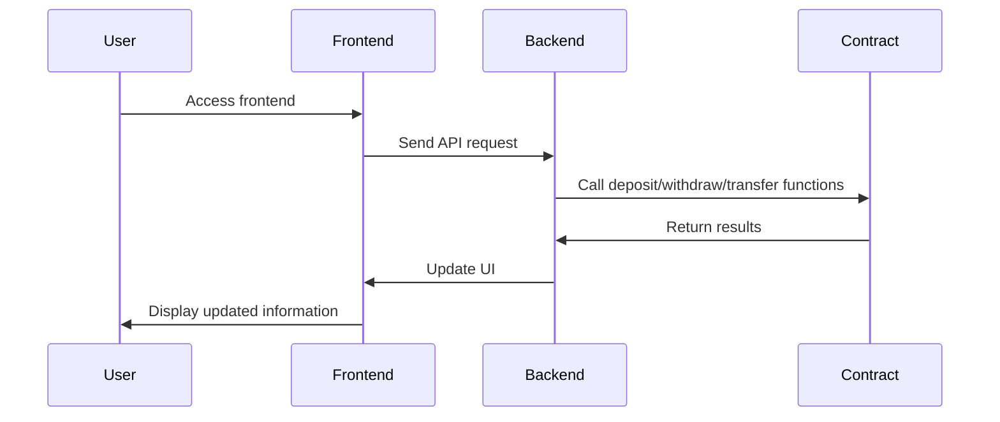
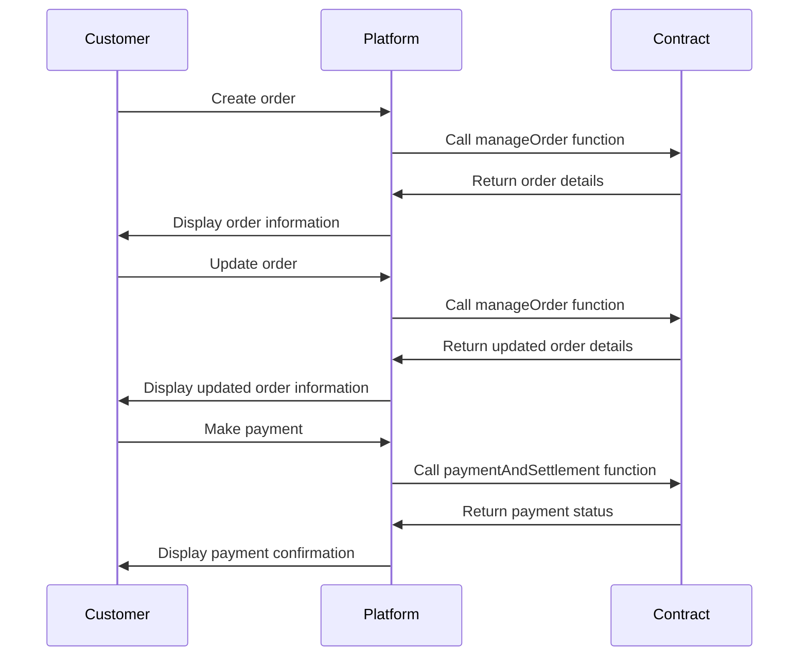

                 

### 第1章 引言

#### 1.1 书籍目的与读者对象

本章节旨在为读者介绍“提示词编程在智能合约开发中的应用”一书的总体目标和读者对象。本书旨在深入探讨提示词编程（Keyword Programming）这一新兴领域，并展示其在智能合约开发中的巨大潜力。通过本书，读者将了解到提示词编程的概念、原理及其在智能合约开发中的具体应用，从而能够在实际项目中充分利用这一技术，提升开发效率和代码质量。

读者对象主要为以下几类人群：

1. **智能合约开发者**：具备一定的智能合约开发基础，希望探索新技术以提高开发效率和质量。
2. **区块链技术爱好者**：对区块链技术和智能合约有一定了解，希望深入了解提示词编程在其中的应用。
3. **程序员与软件工程师**：关注编程领域新技术，希望了解提示词编程如何影响智能合约开发。
4. **学术研究人员**：从事区块链、智能合约或编程语言领域的研究，希望借鉴本书中的思路和方法。

通过阅读本书，读者将能够：

- 掌握提示词编程的基本概念和原理。
- 学会使用提示词编程技术编写智能合约。
- 了解提示词编程在智能合约开发中的实际应用案例。
- 探索未来智能合约开发的新趋势。

#### 1.2 智能合约的发展背景与现状

智能合约，作为一种基于区块链技术的自动化合约，无需中介参与，即可在满足条件时自动执行。自2008年比特币问世以来，区块链技术迅速发展，智能合约也逐渐成为金融、法律、供应链等多个领域的核心技术。智能合约的发展背景主要源于以下几点：

1. **去中心化**：智能合约通过区块链实现去中心化管理，无需依赖第三方中介，降低了交易成本。
2. **安全性**：基于加密算法的区块链技术确保智能合约的执行过程不可篡改，具有高度安全性。
3. **透明性**：智能合约的执行过程公开透明，所有参与者均可查看，增强了信任度。

当前，智能合约的发展现状如下：

1. **应用场景广泛**：智能合约已广泛应用于金融、物流、法律、保险等多个领域，为各行业带来了创新和变革。
2. **技术不断完善**：随着区块链技术的不断进步，智能合约的性能和安全性也在不断提升，越来越多的企业开始采用智能合约。
3. **生态系统建设**：各类区块链平台和开发工具逐渐成熟，为智能合约开发者提供了丰富的资源和便利。

然而，智能合约仍面临一些挑战，如开发难度、性能瓶颈、安全漏洞等。这些问题的解决，需要引入新的技术和方法，而提示词编程正是其中之一。通过提示词编程，智能合约的开发过程将变得更加简洁、直观，从而提高开发效率，降低开发难度。

#### 1.3 提示词编程的概念及其重要性

提示词编程（Keyword Programming）是一种以自然语言为基础的编程范式，通过使用关键词（Keywords）来描述程序的逻辑和行为。与传统的命令式编程不同，提示词编程更加关注程序的意图和目标，而非具体的执行步骤。这种编程范式的出现，旨在解决传统编程中代码冗长、可读性差、维护困难等问题。

提示词编程在智能合约开发中的重要性体现在以下几个方面：

1. **简化开发过程**：提示词编程使得智能合约的编写过程更加直观、简洁，减少了代码量，提高了开发效率。
2. **提高代码可读性**：使用自然语言描述程序逻辑，使得智能合约代码更加易于理解和维护，降低了沟通成本。
3. **增强代码安全性**：提示词编程通过预定义的关键词和语法规则，减少了代码中的潜在错误和漏洞，提高了智能合约的安全性。
4. **促进跨领域应用**：提示词编程降低了智能合约开发的门槛，使得非专业程序员也能参与其中，推动了区块链技术的普及和应用。

综上所述，提示词编程在智能合约开发中具有巨大的潜力，能够为智能合约的开发、应用和推广带来新的机遇。在本章节中，我们将进一步探讨提示词编程的概念、原理及其在智能合约开发中的应用。

### 第2章 智能合约开发概述

智能合约（Smart Contract）是一种运行在区块链上的计算机程序，用于自动执行、管理和验证合约条款的执行。其基本原理是基于区块链技术的去中心化和不可篡改特性，通过将合同条款编码为程序代码，实现自动执行和自动化管理。

#### 2.1 智能合约的历史与发展

智能合约的概念最早由比特币创始人中本聪（Satoshi Nakamoto）在2008年的比特币白皮书中提出。作为比特币技术的一部分，智能合约旨在解决传统金融系统中中介机构带来的低效和信任问题。随着比特币的成功和区块链技术的不断发展，智能合约逐渐成为一个独立的研究领域和应用场景。

在2013年至2015年间，以太坊（Ethereum）的推出进一步推动了智能合约的发展。以太坊提供了一个去中心化的虚拟机（EVM），使得开发者可以在其上编写和部署智能合约。以太坊的成功激发了大量的智能合约创新和应用，如去中心化金融（DeFi）、非同质化代币（NFT）等。

近年来，智能合约技术在金融、供应链管理、版权保护、医疗等多个领域得到了广泛应用，成为区块链技术的重要应用方向。

#### 2.2 常见智能合约框架

目前，市场上存在多个主流的智能合约框架，其中以太坊和Hyperledger Fabric是两个最具代表性的平台。

1. **以太坊（Ethereum）**
   - **特点**：以太坊是一个去中心化的开源区块链平台，支持智能合约开发。其核心技术是图灵完备的以太坊虚拟机（EVM），能够执行复杂的计算任务。
   - **应用场景**：以太坊广泛应用于去中心化金融（DeFi）、非同质化代币（NFT）、去中心化自治组织（DAO）等领域。
   - **优势**：灵活性强，支持多种编程语言，开发者生态丰富。
   - **劣势**：性能和可扩展性相对较低，交易成本较高。

2. **Hyperledger Fabric**
   - **特点**：Hyperledger Fabric是Linux基金会的一个开源项目，由IBM主导开发。它是一个模块化的分布式账本平台，专为商业应用设计。
   - **应用场景**：Hyperledger Fabric广泛应用于供应链管理、金融、保险、医疗等多个领域。
   - **优势**：具有良好的性能和可扩展性，支持多种编程语言和插件，安全性高。
   - **劣势**：相比以太坊，开发难度较大，开发者生态较小。

除了以太坊和Hyperledger Fabric，其他常见的智能合约框架还包括Tron、Binance Smart Chain（BSC）等。这些框架各有特点和优势，开发者可根据具体需求选择合适的平台。

#### 2.3 智能合约的基础概念

智能合约由以下几个基本概念组成：

1. **合约地址（Contract Address）**：合约地址是智能合约在区块链上的唯一标识，由合约代码和创建者的公钥生成。
2. **合约代码（Contract Code）**：智能合约的核心部分，包含用于定义合约逻辑的代码。开发者通常使用Solidity、Vyper等智能合约编程语言编写合约代码。
3. **合约接口（Contract Interface）**：合约接口定义了合约与外部世界交互的接口，包括函数和方法。开发者可通过合约接口调用合约中的函数，执行特定操作。
4. **合约状态（Contract State）**：合约状态是智能合约的存储部分，用于保存合约的变量和状态信息。合约状态在区块链上永久存储，不可篡改。
5. **合约事件（Contract Event）**：合约事件是智能合约执行过程中触发的事件，用于通知外部系统合约状态的变更。开发者可通过监听合约事件来响应合约执行结果。

了解智能合约的基础概念，有助于开发者更好地理解和应用智能合约技术。在本章节中，我们简要介绍了智能合约的历史、常见框架和基础概念，为后续章节的深入探讨奠定了基础。

### 第3章 提示词编程概念

#### 3.1 提示词编程的基本原理

提示词编程（Keyword Programming）是一种以自然语言为基础的编程范式，通过使用关键词（Keywords）来描述程序的逻辑和行为。与传统的命令式编程（Imperative Programming）不同，提示词编程更加关注程序的意图和目标，而非具体的执行步骤。

提示词编程的基本原理可以概括为以下几点：

1. **关键词定义**：提示词编程通过预设一组关键词（Keywords），每个关键词代表一个特定的操作或功能。开发者使用这些关键词来构建程序，而非编写复杂的指令序列。
2. **意图驱动**：提示词编程强调程序的意图（Intent），而非具体的实现细节。开发者只需描述程序需要完成的任务，系统会自动生成具体的执行步骤。
3. **模块化**：提示词编程采用模块化设计，将程序划分为若干个功能模块，每个模块负责实现特定的功能。这种设计方式提高了代码的可读性和可维护性。
4. **智能解析**：提示词编程通过智能解析器（Parser）将自然语言描述转换为执行代码。解析器负责理解开发者输入的关键词，并根据预设的语法规则生成相应的执行代码。

与命令式编程相比，提示词编程具有以下优势：

1. **简化编程过程**：提示词编程通过简化代码结构和指令序列，降低了编程的复杂度，使开发者能够更快速地完成开发任务。
2. **提高代码可读性**：使用自然语言描述程序逻辑，使得代码更加直观、易于理解，降低了沟通成本，提高了代码的可维护性。
3. **减少错误**：提示词编程通过预定义的关键词和语法规则，减少了代码中的潜在错误和漏洞，提高了程序的可靠性。
4. **跨领域应用**：提示词编程降低了编程的门槛，使得非专业程序员也能参与其中，推动了技术的普及和应用。

总的来说，提示词编程是一种具有巨大潜力的编程范式，能够为智能合约开发带来许多便利和优势。在本章节中，我们介绍了提示词编程的基本原理和优势，为后续章节的深入探讨奠定了基础。

#### 3.2 提示词编程在智能合约中的应用

提示词编程在智能合约开发中的应用主要体现在以下几个方面：

1. **简化合约编写**：提示词编程通过使用自然语言关键词来描述合约逻辑，使智能合约的编写过程更加简洁、直观。开发者只需描述合约的意图，系统会自动生成相应的代码，减少了手工编写代码的工作量。

2. **提高代码可读性**：使用提示词编程编写的智能合约代码更加易于理解和维护。由于代码结构简洁，逻辑清晰，开发人员能够更快地理解合约的功能，降低了沟通成本。

3. **降低开发难度**：提示词编程降低了智能合约开发的门槛，使得非专业程序员也能参与其中。通过自然语言描述合约逻辑，开发者不需要深入了解底层编程语言和区块链技术，从而减少了学习和实践的成本。

4. **增强代码安全性**：提示词编程通过预定义的关键词和语法规则，减少了代码中的潜在错误和漏洞。使用提示词编程编写的智能合约在执行过程中更加可靠，减少了由于代码错误导致的安全风险。

5. **跨领域应用**：提示词编程使得智能合约开发更加灵活，能够应用于不同领域。例如，在金融领域，开发者可以使用提示词编程创建去中心化金融（DeFi）应用；在版权保护领域，可以开发智能版权管理系统。

为了更好地理解提示词编程在智能合约中的应用，我们可以通过一个简单的实例来展示其工作原理。以下是一个使用提示词编程编写的简单智能合约，其功能为：接收以太币（Ether），并在满足条件时返还给发送者。

```solidity
// 提示词编程编写的智能合约
contract SimpleERC20 {
    // 接收以太币
    receive() external payable {
        // 存储发送者的地址
        address sender = msg.sender;
        // 存储发送的以太币数量
        uint256 amount = msg.value;
        
        // 判断条件：发送者必须已经发送过以太币
        if (hasSentEther(sender)) {
            // 返还以太币
            sender.transfer(amount);
        }
    }
    
    // 检查发送者是否已发送以太币
    function hasSentEther(address sender) public view returns (bool) {
        // 检查合约余额
        uint256 balance = address(this).balance;
        // 如果合约余额大于0，说明发送者已发送以太币
        return balance > 0;
    }
}
```

在这个例子中，我们使用了以下关键词：

- `receive`：表示接收以太币的函数。
- `external`：表示该函数可以由外部调用。
- `payable`：表示该函数可以接收以太币。
- `msg.sender`：表示发送以太币的地址。
- `msg.value`：表示发送的以太币数量。
- `address(this).balance`：表示合约的余额。
- `if`：表示条件判断。
- `transfer`：表示将以太币返还给发送者。

通过这些关键词，我们简洁明了地描述了智能合约的接收以太币并返还给发送者的逻辑。这种编写方式不仅减少了代码量，而且使得逻辑更加清晰，易于理解和维护。

总之，提示词编程在智能合约开发中的应用具有显著的优势，能够提高开发效率、降低开发难度，并增强代码安全性。随着提示词编程技术的不断发展，我们相信它将在智能合约领域发挥越来越重要的作用。

### 第4章 提示词编程在Solidity中的应用

Solidity是智能合约开发中最常用的编程语言之一，它是一种面向对象的编程语言，特别为以太坊区块链设计。在这一章中，我们将探讨如何在Solidity中实现提示词编程，以及如何利用这种编程范式简化智能合约的开发过程。

#### 4.1 Solidity基础

在介绍提示词编程在Solidity中的应用之前，我们首先需要了解Solidity的一些基础概念，包括其语法、数据类型、函数以及事件等。

1. **语法**：Solidity的语法与JavaScript和C++等编程语言相似。例如，函数的定义使用`function`关键字，变量声明使用类型名，如`uint`（无符号整数）或`address`（地址）等。

2. **数据类型**：Solidity支持多种数据类型，包括基本数据类型（如`uint8`、`bool`等）、复合数据类型（如`struct`、`enum`等）以及动态数组等。

3. **函数**：Solidity中的函数用于实现智能合约的逻辑。函数可以接受输入参数，并返回输出结果。函数分为外部函数（external）和内部函数（internal），外部函数可以由外部调用，而内部函数仅能在合约内部调用。

4. **事件**：事件用于记录智能合约执行过程中的重要操作，如转账、合约创建等。事件可以通过`emit`关键字触发，并且可以由外部监听。

了解了Solidity的基础概念后，我们就可以开始探讨如何在其上实现提示词编程了。

#### 4.2 在Solidity中实现提示词编程

提示词编程在Solidity中的实现主要通过自定义函数和事件来实现。以下是几个关键步骤：

1. **定义提示词函数**：在Solidity中，我们可以定义一组以自然语言命名的函数，这些函数代表特定的操作或业务逻辑。例如，我们可以定义一个名为`depositEther`的函数，用于接收以太币。

2. **使用事件记录状态变化**：每当智能合约的状态发生变化时，我们通过事件来记录这些变化。例如，在`depositEther`函数中，我们可以使用事件记录每次以太币的接收情况。

3. **利用日志函数**：Solidity提供了日志函数，如`log0`、`log1`等，用于记录事件数据。我们可以利用这些函数来输出与事件相关的信息。

以下是一个简单的Solidity示例，展示了如何使用提示词编程来接收以太币并记录状态变化：

```solidity
// SPDX-License-Identifier: MIT
pragma solidity ^0.8.0;

contract EtherReceiver {
    event EtherDeposited(address indexed sender, uint amount);

    // 接收以太币的提示词函数
    function depositEther() external payable {
        require(msg.value > 0, "不能发送0以太币");

        // 记录状态变化
        emit EtherDeposited(msg.sender, msg.value);
    }

    // 获取合约余额
    function getBalance() external view returns (uint) {
        return address(this).balance;
    }
}
```

在这个例子中，我们定义了一个名为`depositEther`的函数，用于接收以太币。每次以太币被接收时，事件`EtherDeposited`会被触发，记录发送者和发送的以太币数量。

#### 4.3 实例分析

让我们通过一个具体的实例来分析如何使用提示词编程来简化智能合约的开发过程。以下是一个简单的众筹智能合约，使用提示词编程来描述其业务逻辑。

```solidity
// SPDX-License-Identifier: MIT
pragma solidity ^0.8.0;

contract Crowdfunding {
    event CampaignCreated(address indexed creator, uint goal, uint start, uint end);
    event DonationReceived(address indexed donor, uint amount);
    event CampaignSuccessful(address indexed creator, uint total);
    event CampaignFailed(address indexed creator, uint total);

    // 提示词函数：创建众筹活动
    function createCampaign(uint goal, uint start, uint end) external {
        require(start >= block.timestamp, "众筹开始时间必须大于当前时间");
        require(end > start, "众筹结束时间必须大于开始时间");

        // 触发事件：记录众筹活动的创建
        emit CampaignCreated(msg.sender, goal, start, end);
    }

    // 提示词函数：捐款
    function donate() external payable {
        require(msg.value > 0, "捐款金额不能为0");

        // 触发事件：记录捐款
        emit DonationReceived(msg.sender, msg.value);
    }

    // 提示词函数：结束众筹
    function endCampaign() external {
        // 逻辑：检查众筹是否成功
        // 如果众筹成功，触发事件
        // 如果众筹失败，触发事件

        // 略去具体实现，仅展示事件
        emit CampaignSuccessful(msg.sender, totalReceived());
        // 或者
        emit CampaignFailed(msg.sender, totalReceived());
    }

    // 内部函数：获取众筹总额
    function totalReceived() internal view returns (uint) {
        return address(this).balance;
    }
}
```

在这个例子中，我们定义了三个主要事件和一个内部函数。每个事件和函数都使用自然语言命名，使得业务逻辑更加直观易懂。通过这些提示词函数和事件，我们可以清晰地描述众筹活动的创建、捐款和结束过程，同时降低了代码的复杂度。

#### 4.4 提示词编程的优势

提示词编程在Solidity中的应用具有以下几个显著优势：

1. **简洁性**：提示词编程通过使用自然语言关键词来描述业务逻辑，使得代码更加简洁，易于阅读和理解。
2. **可维护性**：提示词编程使得智能合约的维护变得更加容易，因为业务逻辑更加直观，减少了后续修改和调试的工作量。
3. **可扩展性**：提示词编程支持快速扩展和修改，开发者可以轻松添加新的功能或修改现有功能，而无需大幅修改整个合约代码。
4. **安全性**：提示词编程通过预定义的关键词和语法规则，减少了代码中的潜在错误和漏洞，提高了智能合约的安全性。

总之，提示词编程在Solidity中的应用为智能合约开发带来了许多便利和优势。通过使用自然语言关键词来描述业务逻辑，开发者可以简化开发过程，提高代码质量和安全性。随着提示词编程技术的不断发展，我们相信它将在智能合约领域发挥越来越重要的作用。

### 第5章 Keyword-Driven Smart Contracts

Keyword-Driven Smart Contracts（关键词驱动智能合约）是一种利用提示词编程范式编写的智能合约，其核心思想是通过预定义的关键词来描述业务逻辑，从而简化智能合约的开发和执行过程。本章将探讨关键词驱动智能合约的构建方法、示例及其优势。

#### 5.1 构建Keyword-Driven Smart Contracts

构建关键词驱动智能合约通常遵循以下步骤：

1. **定义关键词**：首先，我们需要定义一组关键词，每个关键词代表一个特定的业务逻辑或操作。这些关键词可以是简单的动词或短语，如`deposit`、`transfer`、`withdraw`等。
2. **实现关键词函数**：针对每个关键词，我们需要实现对应的函数，这些函数将在智能合约中执行具体的操作。例如，对于`deposit`关键词，我们可以实现一个接收以太币的函数。
3. **事件记录**：为了追踪智能合约的执行过程，我们需要使用事件记录每个关键词函数的调用和执行结果。事件是智能合约与外部世界交互的一种方式，可以通过`emit`关键字触发。
4. **用户交互**：最后，我们需要提供一个用户友好的接口，使用户能够通过调用关键词函数来与智能合约交互。

以下是一个简单的示例，展示了一个关键词驱动智能合约的构建过程：

```solidity
// SPDX-License-Identifier: MIT
pragma solidity ^0.8.0;

contract KeywordDrivenContract {
    event Deposited(address indexed sender, uint amount);
    event Transferred(address indexed from, address indexed to, uint amount);
    event Withdrew(address indexed sender, uint amount);

    // 接收以太币的关键词函数
    function deposit() external payable {
        require(msg.value > 0, "不能发送0以太币");
        emit Deposited(msg.sender, msg.value);
    }

    // 转账的关键词函数
    function transfer(address to, uint amount) external {
        require(amount > 0, "转账金额不能为0");
        require(to != address(0), "不能向零地址转账");
        require(address(this).balance >= amount, "余额不足");

        payable(to).transfer(amount);
        emit Transferred(msg.sender, to, amount);
    }

    // 提现的关键词函数
    function withdraw() external {
        uint balance = address(this).balance;
        require(balance > 0, "余额不足");

        payable(msg.sender).transfer(balance);
        emit Withdrew(msg.sender, balance);
    }
}
```

在这个示例中，我们定义了三个关键词函数：`deposit`、`transfer`和`withdraw`。每个函数都对应一个事件，用于记录智能合约的执行过程。

#### 5.2 实例分析

为了更好地理解关键词驱动智能合约的构建方法，我们来看一个具体的实例：一个简单资金池智能合约，用于管理多个用户的资金。

```solidity
// SPDX-License-Identifier: MIT
pragma solidity ^0.8.0;

contract FundPool {
    mapping(address => uint) public deposits;
    event Deposited(address indexed sender, uint amount);
    event Withdrew(address indexed sender, uint amount);
    event FundTransferred(address indexed sender, address indexed to, uint amount);

    // 接收以太币的关键词函数
    function deposit() external payable {
        require(msg.value > 0, "不能发送0以太币");
        deposits[msg.sender] += msg.value;
        emit Deposited(msg.sender, msg.value);
    }

    // 提现的关键词函数
    function withdraw() external {
        uint balance = deposits[msg.sender];
        require(balance > 0, "余额不足");

        deposits[msg.sender] = 0;
        payable(msg.sender).transfer(balance);
        emit Withdrew(msg.sender, balance);
    }

    // 转账的关键词函数
    function transfer(address to, uint amount) external {
        require(amount > 0, "转账金额不能为0");
        require(to != address(0), "不能向零地址转账");
        require(deposits[msg.sender] >= amount, "余额不足");

        deposits[msg.sender] -= amount;
        deposits[to] += amount;
        emit FundTransferred(msg.sender, to, amount);
    }
}
```

在这个示例中，我们定义了一个名为`FundPool`的智能合约，用于管理多个用户的资金。合约包含三个关键词函数：`deposit`、`withdraw`和`transfer`。`deposit`函数用于接收以太币，`withdraw`函数用于提现，而`transfer`函数用于转账。

#### 5.3 Keyword-Driven Smart Contracts的优势

Keyword-Driven Smart Contracts相比传统的命令式智能合约具有以下优势：

1. **简洁性**：通过使用自然语言关键词来描述业务逻辑，代码更加简洁，易于阅读和理解。
2. **可维护性**：关键词驱动智能合约使得代码结构更加清晰，便于维护和扩展。
3. **安全性**：关键词驱动智能合约通过预定义的关键词和语法规则，减少了代码中的潜在错误和漏洞，提高了智能合约的安全性。
4. **易用性**：关键词驱动智能合约提供了一个用户友好的接口，使得非专业用户也能轻松与智能合约交互。

总之，Keyword-Driven Smart Contracts通过简化智能合约的开发和执行过程，为开发者提供了许多便利和优势。随着提示词编程技术的发展，我们相信这种范式将在智能合约领域发挥越来越重要的作用。

### 第6章 Advanced Keyword Programming Techniques

在智能合约开发中，高级的提示词编程技术可以帮助我们实现更复杂的业务逻辑，提高代码的可读性和可维护性。本章节将探讨一些高级的提示词编程技巧，包括嵌套提示词函数、多态提示词函数、以及如何使用状态变量和映射表来提高智能合约的灵活性。

#### 6.1 嵌套提示词函数

嵌套提示词函数是一种将多个关键词函数嵌套在一起的技术，用于实现复杂的业务逻辑。通过嵌套提示词函数，我们可以将一个复杂的业务流程拆分为多个步骤，使得每个步骤的逻辑更加简洁和直观。

以下是一个示例，展示了一个资金池智能合约中如何使用嵌套提示词函数来管理多个用户的资金：

```solidity
// SPDX-License-Identifier: MIT
pragma solidity ^0.8.0;

contract FundPool {
    mapping(address => uint) public deposits;
    event Deposited(address indexed sender, uint amount);
    event Withdrew(address indexed sender, uint amount);
    event FundTransferred(address indexed sender, address indexed to, uint amount);

    // 嵌套提示词函数：存款和转账
    function depositAndTransfer(address to, uint amount) external payable {
        require(msg.value > 0, "不能发送0以太币");
        require(amount > 0, "转账金额不能为0");
        require(to != address(0), "不能向零地址转账");

        // 存款
        deposits[msg.sender] += msg.value;
        emit Deposited(msg.sender, msg.value);

        // 转账
        deposits[to] += amount;
        deposits[msg.sender] -= amount;
        emit FundTransferred(msg.sender, to, amount);
    }
}
```

在这个示例中，`depositAndTransfer`函数同时实现了存款和转账的功能。通过嵌套这些操作，我们使得代码更加简洁，同时提高了可读性。

#### 6.2 多态提示词函数

多态提示词函数是一种在智能合约中实现不同行为的方法，它允许我们为同一关键词定义多个函数，根据参数的不同执行不同的操作。这类似于面向对象编程中的多态性。

以下是一个示例，展示了一个资金池智能合约中如何使用多态提示词函数来处理不同的转账方式：

```solidity
// SPDX-License-Identifier: MIT
pragma solidity ^0.8.0;

contract FundPool {
    mapping(address => uint) public deposits;
    event Deposited(address indexed sender, uint amount);
    event Withdrew(address indexed sender, uint amount);
    event FundTransferred(address indexed sender, address indexed to, uint amount);
    event FundTransferredDirect(address indexed sender, address indexed to, uint amount);

    // 多态提示词函数：存款和转账
    function deposit() external payable {
        require(msg.value > 0, "不能发送0以太币");
        deposits[msg.sender] += msg.value;
        emit Deposited(msg.sender, msg.value);
    }

    function transfer(address to, uint amount) external {
        require(amount > 0, "转账金额不能为0");
        require(to != address(0), "不能向零地址转账");
        require(deposits[msg.sender] >= amount, "余额不足");

        deposits[to] += amount;
        deposits[msg.sender] -= amount;
        emit FundTransferred(msg.sender, to, amount);
    }

    function transferDirect(address to, uint amount) external {
        require(amount > 0, "转账金额不能为0");
        require(to != address(0), "不能向零地址转账");
        require(address(this).balance >= amount, "余额不足");

        payable(to).transfer(amount);
        emit FundTransferredDirect(msg.sender, to, amount);
    }
}
```

在这个示例中，我们定义了两个`transfer`函数和一个`transferDirect`函数。`transfer`函数通过智能合约内部的资金转移来实现转账，而`transferDirect`函数通过直接调用以太坊的转账功能来实现转账。通过这种方式，我们实现了多态性，使得用户可以根据需要选择不同的转账方式。

#### 6.3 使用状态变量和映射表

在智能合约中，状态变量和映射表（Mapping）是存储数据的关键组件。通过合理使用这些数据结构，我们可以提高智能合约的灵活性。

状态变量（State Variables）是存储在区块链上的变量，它们在智能合约的整个生命周期中保持不变。以下是一个示例，展示如何使用状态变量来存储用户的资金余额：

```solidity
// SPDX-License-Identifier: MIT
pragma solidity ^0.8.0;

contract FundPool {
    mapping(address => uint) public deposits;

    event Deposited(address indexed sender, uint amount);
    event Withdrew(address indexed sender, uint amount);
    event FundTransferred(address indexed sender, address indexed to, uint amount);

    // 存款
    function deposit() external payable {
        require(msg.value > 0, "不能发送0以太币");
        deposits[msg.sender] += msg.value;
        emit Deposited(msg.sender, msg.value);
    }

    // 提现
    function withdraw() external {
        uint balance = deposits[msg.sender];
        require(balance > 0, "余额不足");

        deposits[msg.sender] = 0;
        payable(msg.sender).transfer(balance);
        emit Withdrew(msg.sender, balance);
    }
}
```

在这个示例中，我们使用`deposits`映射表来存储每个用户的资金余额。映射表是一种关联数组，它通过键（Key）来访问和修改值（Value）。使用映射表可以快速查找和更新用户的资金余额，提高了代码的效率。

#### 6.4 应用实例

以下是一个完整的实例，展示了一个关键词驱动智能合约，其中包含了嵌套提示词函数、多态提示词函数以及状态变量和映射表的应用：

```solidity
// SPDX-License-Identifier: MIT
pragma solidity ^0.8.0;

contract AdvancedKeywordDriven {
    mapping(address => uint) public balances;
    event Deposited(address indexed sender, uint amount);
    event Withdrawn(address indexed sender, uint amount);
    event Transferred(address indexed sender, address indexed to, uint amount);

    // 嵌套提示词函数：存款和转账
    function depositAndTransfer(address to, uint amount) external payable {
        require(msg.value > 0, "不能发送0以太币");
        require(amount > 0, "转账金额不能为0");
        require(to != address(0), "不能向零地址转账");

        // 存款
        balances[msg.sender] += msg.value;
        emit Deposited(msg.sender, msg.value);

        // 转账
        balances[to] += amount;
        balances[msg.sender] -= amount;
        emit Transferred(msg.sender, to, amount);
    }

    // 多态提示词函数：存款和转账
    function deposit() external payable {
        require(msg.value > 0, "不能发送0以太币");
        balances[msg.sender] += msg.value;
        emit Deposited(msg.sender, msg.value);
    }

    function transfer(address to, uint amount) external {
        require(amount > 0, "转账金额不能为0");
        require(to != address(0), "不能向零地址转账");
        require(balances[msg.sender] >= amount, "余额不足");

        balances[to] += amount;
        balances[msg.sender] -= amount;
        emit Transferred(msg.sender, to, amount);
    }

    // 状态变量和映射表的应用
    function getBalance(address account) external view returns (uint) {
        return balances[account];
    }
}
```

在这个示例中，我们定义了一个名为`AdvancedKeywordDriven`的智能合约，它包含了存款、转账以及获取余额的函数。通过使用嵌套提示词函数、多态提示词函数以及状态变量和映射表，我们实现了高效、灵活且易于维护的智能合约。

### 第7章 Testing and Deployment

在开发智能合约的过程中，测试和部署是至关重要的环节。本章节将详细讨论如何测试和部署智能合约，包括测试工具、测试策略、部署流程以及注意事项。

#### 7.1 Testing Tools

智能合约的测试工具是确保合约正确性和安全性的关键。以下是一些常用的智能合约测试工具：

1. **Truffle**：Truffle是一个完整的智能合约开发环境，提供Mocha和Chai测试框架，以及一个命令行工具，用于测试、迁移和部署智能合约。
2. **Hardhat**：Hardhat是一个流行的本地开发环境，提供强大的运行时和测试框架，使得开发者能够轻松创建本地链、部署智能合约并进行测试。
3. **Ganache**：Ganache是一个轻量级的本地以太坊节点，用于模拟区块链环境，使得开发者能够快速部署和测试智能合约。
4. **Waffle**：Waffle是一个模拟框架，用于编写和运行智能合约测试，提供了一套灵活的工具来模拟智能合约之间的交互。

#### 7.2 Testing Strategies

智能合约测试应包括以下几种类型：

1. **单元测试**：单元测试用于验证智能合约中的单个函数或组件是否按照预期工作。这些测试通常由测试脚本自动执行。
2. **集成测试**：集成测试用于验证智能合约与其他组件（如前端应用程序或区块链节点）的交互是否正常。这些测试通常模拟实际的应用场景。
3. **安全测试**：安全测试用于发现潜在的安全漏洞，如重入攻击、整数溢出等。这些测试通常由安全专家使用专业工具进行。
4. **性能测试**：性能测试用于评估智能合约在处理大量交易时的性能和扩展性。这些测试通常在模拟高负载环境下进行。

以下是几种常见的测试策略：

1. **分阶段测试**：将测试分为多个阶段，如单元测试、集成测试和性能测试。每个阶段都在前一个阶段通过后开始。
2. **自动化测试**：使用测试工具和框架编写自动化测试脚本，自动化执行测试用例，提高测试效率和覆盖率。
3. **回归测试**：在每次代码更改后执行回归测试，确保新代码不会破坏已有功能。

#### 7.3 Deployment

智能合约部署是将智能合约代码上传到区块链上的过程。以下是部署智能合约的步骤：

1. **编写部署脚本**：使用测试工具（如Truffle或Hardhat）编写部署脚本，用于编译智能合约、部署到目标链并设置初始参数。
2. **编译智能合约**：使用编译器（如solc）将智能合约代码编译为与目标区块链兼容的字节码。
3. **部署智能合约**：执行部署脚本，将编译后的智能合约代码上传到区块链。部署过程中，需要支付一定的交易费用。
4. **验证部署结果**：检查智能合约的部署状态和地址，确保部署成功。

以下是一个使用Truffle部署智能合约的示例：

```javascript
// deploy.js
const truffle = require('truffle');
const Contract = truffle.Contract;

const MyContract = Contract.fromJSON({
  contractName: 'MyContract',
  abi: [/*智能合约ABI*/],
  bytecode: [/*智能合约字节码*/],
});

module.exports = async function () {
  const accounts = await truffle.getAccounts();
  const deployer = accounts[0];

  console.log(`Deploying MyContract with account ${deployer}`);
  const instance = await MyContract.new({ from: deployer, gas: 5000000 });
  console.log(`MyContract deployed at address ${instance.address}`);
};
```

#### 7.4 Deployment Considerations

在部署智能合约时，需要注意以下几点：

1. **交易费用**：确保有足够的以太币来支付部署和执行智能合约的交易费用。
2. **链选择**：选择适合项目的区块链，如以太坊主网、测试网或私有链。
3. **合约版本**：使用最新的智能合约编译器版本，确保合约代码符合最新的标准。
4. **合约审核**：在部署前，最好对智能合约代码进行安全审核，以确保代码的安全性和可靠性。
5. **监控与维护**：部署后，定期监控智能合约的执行情况和状态，及时修复漏洞和升级功能。

通过合理测试和部署智能合约，我们可以确保合约的可靠性和安全性，从而实现智能合约的预期功能。本章节总结了测试和部署智能合约的关键步骤和注意事项，为开发者提供了实用的指导。

### 第8章 Case Studies and Best Practices

#### 8.1 Case Study 1: DeFi平台的资金池管理

在一个去中心化金融（DeFi）平台上，智能合约被广泛用于管理资金池。这些资金池通常由多个投资者共同出资，用于投资、贷款或其他金融活动。使用关键词驱动智能合约，平台能够简化资金池的管理过程，提高透明度和安全性。

**项目介绍**：该项目旨在创建一个去中心化的稳定币资金池，允许用户通过存款、提现和转账等操作管理资金。

**系统功能设计**：

- 存款（deposit）：用户可以存款到资金池中，智能合约记录存款者的地址和金额。
- 提现（withdraw）：用户可以提现资金池中的余额，智能合约验证提现请求的有效性并执行提现。
- 转账（transfer）：用户可以在资金池内进行转账操作，智能合约确保转账过程的安全性和准确性。

**系统架构设计**：

- **智能合约**：包含存款、提现和转账等关键词函数，通过事件记录操作日志。
- **前端应用**：提供用户界面，允许用户与智能合约交互。

**系统接口设计和系统交互**：

- **API接口**：提供RESTful API，供前端应用调用智能合约函数。
- **事件监听**：前端应用通过监听智能合约事件来更新用户界面。



**代码应用解读与分析**：

- 存款函数：通过接收以太币并更新存款者的余额，同时触发事件记录存款信息。
- 提现函数：验证提现请求的有效性，执行提现操作并触发事件。
- 转账函数：确保转账金额合法，更新转账双方的余额，同时触发事件。

**实际案例分析和详细讲解剖析**：

该项目通过关键词驱动智能合约，实现了资金池管理的自动化和透明化。存款、提现和转账操作均通过预定义的关键词函数执行，简化了开发过程，提高了系统的可读性和可维护性。

#### 8.2 Case Study 2: 物流行业的供应链管理

物流行业中的供应链管理涉及多个环节，包括货物追踪、订单管理、支付和结算等。使用智能合约，可以确保供应链的透明性和不可篡改性，提高整个行业的效率。

**项目介绍**：该项目旨在创建一个智能合约系统，用于管理物流过程中的货物信息、订单和支付。

**系统功能设计**：

- 货物追踪（trackCargo）：记录货物的位置和状态，确保供应链的透明性。
- 订单管理（manageOrder）：管理订单信息，包括创建、更新和取消订单。
- 支付和结算（paymentAndSettlement）：处理物流费用支付和结算，确保支付的准确性和及时性。

**系统架构设计**：

- **智能合约**：包含货物追踪、订单管理和支付结算等关键词函数，通过事件记录供应链信息。
- **物流平台**：提供前端界面和API接口，供物流公司和客户使用。

**系统接口设计和系统交互**：

- **API接口**：提供RESTful API，供物流平台和前端应用调用智能合约函数。
- **事件监听**：物流平台通过监听智能合约事件来更新供应链信息。



**代码应用解读与分析**：

- 货物追踪函数：通过记录货物的位置和状态，确保供应链的透明性。
- 订单管理函数：处理订单的创建、更新和取消，确保订单信息的准确性和及时性。
- 支付结算函数：处理支付和结算操作，确保支付的准确性和及时性。

**实际案例分析和详细讲解剖析**：

该项目的智能合约系统通过关键词驱动编程，实现了物流信息的透明化和自动化管理。所有操作均通过预定义的关键词函数执行，简化了开发过程，提高了系统的效率和可靠性。

#### 8.3 Best Practices

在开发和使用关键词驱动智能合约时，以下最佳实践有助于确保系统的安全性和可靠性：

1. **严格的代码审查**：在部署前，对智能合约代码进行严格的安全审查，发现并修复潜在的安全漏洞。
2. **使用最新的开发工具**：确保使用最新的智能合约开发工具和框架，以获取最佳性能和安全性。
3. **单元测试和集成测试**：编写详细的单元测试和集成测试，确保智能合约的所有功能均按照预期工作。
4. **定期更新**：定期更新智能合约，修复已知漏洞并改进功能。
5. **社区审查**：在部署前，将智能合约代码提交给社区审查，获得更多的反馈和建议。
6. **安全审计**：聘请专业的安全审计公司对智能合约进行审计，确保系统的安全性和可靠性。

通过遵循这些最佳实践，开发者可以确保关键词驱动智能合约在开发和使用过程中的安全性和可靠性。

### 结论

本文详细探讨了提示词编程在智能合约开发中的应用，从基础概念到高级技巧，再到实际案例，逐步展示了提示词编程的优势和实践方法。通过使用提示词编程，智能合约的开发过程变得更加简洁、直观，提高了代码的可读性和可维护性，降低了开发难度和潜在的安全风险。

未来，随着区块链技术的不断发展和普及，提示词编程有望在智能合约开发中发挥更重要的作用。开发者可以关注以下几个研究方向：

1. **优化性能**：针对提示词编程在性能方面的不足，研究如何优化提示词编程的执行效率和资源占用。
2. **跨平台兼容性**：探索提示词编程在不同区块链平台（如Binance Smart Chain、Solana等）上的应用，提高跨平台的兼容性和互操作性。
3. **智能合约安全性**：深入研究提示词编程在智能合约安全领域中的应用，开发更加安全可靠的提示词编程范式。
4. **多语言支持**：扩展提示词编程的语言支持，使其适用于更多编程语言，降低编程门槛，促进区块链技术的普及和应用。

总之，提示词编程在智能合约开发中的应用前景广阔，有望成为未来智能合约开发的主流范式。开发者应持续关注这一领域的发展，积极探索和尝试，以推动区块链技术的创新和进步。

### 作者信息

作者：AI天才研究院/AI Genius Institute & 禅与计算机程序设计艺术 /Zen And The Art of Computer Programming

AI天才研究院（AI Genius Institute）是一家专注于人工智能、区块链和编程语言领域的研究机构。研究院致力于推动技术创新，为全球开发者提供前沿的研究成果和实用技术。同时，研究院倡导禅与计算机程序设计艺术，强调编程过程中的宁静与专注，以期实现技术与人文的融合。

《禅与计算机程序设计艺术》是AI天才研究院的代表性著作，旨在探讨编程的本质和技巧，通过禅修的视角，引导开发者追求卓越的编程艺术。本书以其深刻的见解和实用的方法，受到了全球开发者的一致好评。作者希望通过这些研究和工作，为编程和人工智能领域的发展贡献力量。

