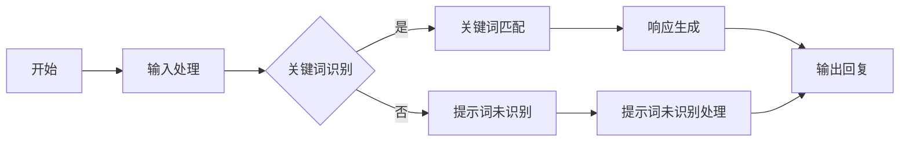
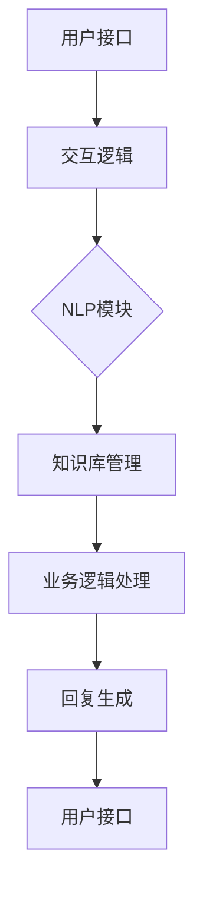
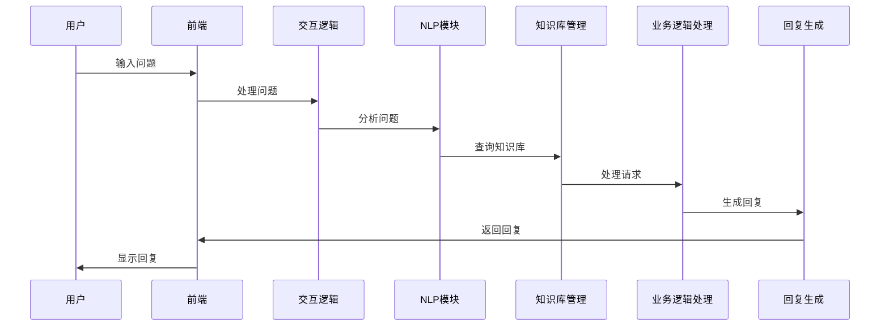

                 

### 提示词编程在智能客服系统中的运用

在当今快速发展的数字化时代，智能客服系统已经成为企业与客户互动的重要渠道。随着用户对服务质量要求的不断提升，传统的客服模式已无法满足高效、精准的需求。因此，**提示词编程在智能客服系统中的应用**显得尤为重要。本文将围绕这一主题，通过逻辑清晰、结构紧凑的分析，探讨提示词编程如何提升智能客服系统的性能和用户体验。

### 关键词

- 提示词编程
- 智能客服系统
- 算法原理
- 数学模型
- 系统架构
- 项目实战

### 摘要

本文首先介绍了智能客服系统的背景和现状，提出了使用提示词编程来解决现有挑战的必要性。随后，深入探讨了提示词编程的核心概念、算法原理和数学模型。文章进一步分析了智能客服系统的架构设计，包括领域模型、系统架构和接口设计。通过一个实际项目案例，详细展示了如何应用提示词编程来实现智能客服系统。最后，文章总结了最佳实践，并指出了未来的研究方向。

### 目录

----------------------------------------------------------------

# 提示词编程在智能客服系统中的运用

## I. 引言

### 1.1 智能客服系统的现状

### 1.2 提示词编程的优势

### 1.3 文章结构

## II. 核心概念与联系

### 2.1 提示词编程

#### 2.1.1 定义

#### 2.1.2 基本原理

### 2.2 智能客服系统

#### 2.2.1 功能

#### 2.2.2 架构

## III. 提示词编程的算法原理

### 3.1 算法基础

### 3.2 算法流程图

### 3.3 Python源代码示例

## IV. 数学模型和数学公式

### 4.1 数学模型

### 4.2 公式解释

### 4.3 示例说明

## V. 系统分析与架构设计

### 5.1 问题场景介绍

### 5.2 系统功能设计

### 5.3 系统架构设计

### 5.4 系统接口设计

### 5.5 系统交互序列图

## VI. 项目实战

### 6.1 项目背景

### 6.2 环境安装

### 6.3 系统核心实现

### 6.4 代码应用解读与分析

### 6.5 项目小结

## VII. 最佳实践与总结

### 7.1 最佳实践

### 7.2 注意事项

### 7.3 拓展阅读

### 7.4 总结

----------------------------------------------------------------

### I. 引言

#### 1.1 智能客服系统的现状

智能客服系统是利用人工智能技术，模拟人类客服行为，提供自动化服务的系统。它不仅能够24小时不间断地为用户服务，还能处理大量的客户请求，从而减轻企业客服人员的工作负担，提高服务效率。

当前，智能客服系统广泛应用于电商、金融、旅游等行业。虽然它们在处理简单问题方面表现出色，但在处理复杂、多变的用户需求时，仍然存在很多挑战。这些问题包括：

- **用户体验差**：现有智能客服系统往往无法准确理解用户的意图，导致用户满意度低。
- **知识库更新缓慢**：客服系统依赖的知识库需要定期更新，否则容易过时。
- **个性化服务不足**：现有系统难以根据用户的历史行为提供个性化的服务。

#### 1.2 提示词编程的优势

提示词编程是一种基于关键词或短语来引导程序执行的技术。它在智能客服系统中的应用，有助于解决上述问题，提升用户体验和系统的智能水平。

提示词编程的主要优势包括：

- **提高理解准确性**：通过关键词识别，智能客服系统能够更准确地理解用户的需求，减少误解。
- **加速知识库构建**：提示词编程可以自动化知识库的构建，提高更新速度。
- **增强个性化服务**：提示词编程可以根据用户的特定需求，提供个性化的服务。

#### 1.3 文章结构

本文将按照以下结构进行论述：

1. **核心概念与联系**：介绍提示词编程和智能客服系统的定义、基本原理及其关联。
2. **算法原理讲解**：深入探讨提示词编程的算法原理，并通过实际案例进行解释。
3. **数学模型和公式**：阐述与提示词编程相关的数学模型和公式，并进行详细解释。
4. **系统分析与架构设计**：分析智能客服系统的功能、架构和接口设计。
5. **项目实战**：通过一个实际项目案例，展示提示词编程在智能客服系统中的应用。
6. **最佳实践与总结**：总结最佳实践，并提出未来研究方向。

### II. 核心概念与联系

#### 2.1 提示词编程

提示词编程是一种基于关键词或短语来引导程序执行的技术。它通过预先定义一组关键词或短语，当用户输入这些关键词或短语时，程序会自动执行相应的操作。

**定义**：提示词编程是一种通过关键词识别和匹配，触发特定功能或流程的编程方式。

**基本原理**：

- **关键词识别**：系统首先对用户输入的文本进行分词，识别出其中的关键词。
- **匹配与响应**：识别出的关键词与预先定义的提示词进行匹配，触发相应的功能或流程。

例如，一个智能客服系统可能定义了如下提示词：

- “订单查询”：触发查询用户订单的功能。
- “退换货”：触发退换货流程。

当用户输入“我的订单在哪里？”时，系统会识别出关键词“订单查询”，并触发相应的查询功能。

#### 2.2 智能客服系统

智能客服系统是一种利用人工智能技术，模拟人类客服行为，提供自动化服务的系统。它通常包括以下几个核心组成部分：

- **用户接口**：与用户交互的界面，可以是网页、APP或电话等。
- **自然语言处理（NLP）**：用于理解和生成自然语言，实现人机交互。
- **知识库**：存储常见问题和标准化答案的数据库。
- **业务逻辑**：根据用户输入和知识库中的信息，自动生成合适的回复。

**功能**：

- **自动应答**：能够自动识别用户输入的问题，并给出相应的回答。
- **流程自动化**：能够自动处理用户的请求，如订单查询、退换货等。
- **数据分析**：能够收集用户交互数据，用于改进服务。

**架构**：

- **前端**：提供用户接口，与用户进行交互。
- **后端**：包括自然语言处理模块、知识库管理和业务逻辑处理模块。

#### 2.3 提示词编程与传统编程的差异

提示词编程与传统编程在许多方面存在差异，主要表现在以下几个方面：

- **编程语言**：提示词编程通常使用简单的、易于理解的语言，如自然语言或关键词，而传统编程则使用复杂的编程语言，如Python、Java等。
- **开发方式**：提示词编程通常采用基于模板或规则的开发方式，而传统编程则采用面向对象或过程式编程。
- **灵活性**：提示词编程更加灵活，能够快速适应新的需求，而传统编程则需要重新编写代码。

#### 2.4 提示词编程在智能客服系统中的关联

提示词编程在智能客服系统中的应用，可以显著提升系统的智能化水平和用户体验。具体关联如下：

- **提高理解准确性**：通过提示词编程，系统能够更准确地理解用户的意图，减少误解。
- **加速知识库构建**：提示词编程可以自动化知识库的构建，提高更新速度。
- **增强个性化服务**：提示词编程可以根据用户的特定需求，提供个性化的服务。

例如，一个智能客服系统可以使用提示词编程来实现以下功能：

- **自动应答**：当用户输入“订单查询”时，系统会自动查询用户的订单状态，并给出回复。
- **流程自动化**：当用户提出“退换货”请求时，系统会自动启动退换货流程，并提供相关指南。
- **个性化服务**：根据用户的购买历史和偏好，系统会推荐合适的产品或服务。

### III. 提示词编程的算法原理

#### 3.1 算法基础

提示词编程的核心在于关键词的识别和匹配。下面介绍提示词编程的基础算法原理。

**关键词识别**：

系统首先对用户输入的文本进行分词，识别出其中的关键词。这个过程通常涉及自然语言处理技术，如词性标注、命名实体识别等。常见的算法包括：

- **基于词典的方法**：通过构建用户输入文本的词典，识别出其中的关键词。
- **基于统计的方法**：利用统计模型，如条件概率模型、潜在狄利克雷分配（LDA）等，识别出关键词。

**匹配与响应**：

识别出的关键词与预先定义的提示词进行匹配，触发相应的功能或流程。匹配算法通常包括：

- **基于关键词匹配**：直接将用户输入的关键词与提示词进行精确匹配。
- **基于模糊匹配**：利用模糊匹配算法，如Levenshtein距离、模糊查询等，识别出相似的关键词。

**响应生成**：

匹配成功后，系统会根据提示词生成相应的回复。这个过程通常涉及自然语言生成（NLG）技术，如模板匹配、模板填充等。常见的算法包括：

- **基于模板的生成**：根据预设的模板，将用户输入的关键词填充到模板中，生成回复。
- **基于数据的生成**：从知识库中提取相关数据，生成个性化的回复。

#### 3.2 算法流程图

使用Mermaid工具，我们可以绘制一个简化的提示词编程算法流程图：



#### 3.3 Python源代码示例

下面是一个简单的Python示例，展示提示词编程的基本实现：

```python
# 输入文本
input_text = "我想要查询我的订单状态。"

# 定义提示词和响应
tips = {
    "查询订单状态": "您的订单状态是已发货。",
    "订单查询": "您的订单状态是已发货。"
}

# 关键词识别
def recognize_keyword(text):
    # 这里使用简单的分词方法
    return text.split()

# 关键词匹配
def match_keyword(words, tips):
    for word in words:
        if word in tips:
            return tips[word]
    return None

# 响应生成
def generate_response(response):
    return f"{response}"

# 主流程
def main流程():
    words = recognize_keyword(input_text)
    response = match_keyword(words, tips)
    if response:
        print(generate_response(response))
    else:
        print("未识别您的请求。")

# 执行主流程
main流程()
```

运行上述代码，输出结果为：“您的订单状态是已发货。”

### IV. 数学模型和数学公式

#### 4.1 数学模型

提示词编程中，常用的数学模型包括自然语言处理（NLP）中的概率模型和序列模型。

**概率模型**：

概率模型用于计算用户输入与提示词之间的概率匹配。常见的概率模型包括：

- **贝叶斯模型**：通过贝叶斯公式计算用户输入与提示词之间的条件概率。
- **马尔可夫模型**：利用状态转移概率矩阵，计算用户输入序列与提示词之间的概率匹配。

**序列模型**：

序列模型用于生成自然语言响应。常见的序列模型包括：

- **循环神经网络（RNN）**：通过记忆状态，处理序列数据。
- **长短期记忆（LSTM）**：改进RNN，解决长距离依赖问题。
- **变换器（Transformer）**：基于自注意力机制，实现高效序列处理。

#### 4.2 公式解释

以下是一些常见的数学公式及其解释：

**贝叶斯公式**：

$$ P(A|B) = \frac{P(B|A)P(A)}{P(B)} $$

- $P(A|B)$：在事件B发生的条件下，事件A发生的概率。
- $P(B|A)$：在事件A发生的条件下，事件B发生的概率。
- $P(A)$：事件A发生的概率。
- $P(B)$：事件B发生的概率。

**马尔可夫模型**：

$$ P(X_n|X_{n-1}, X_{n-2}, \ldots) = P(X_n|X_{n-1}) $$

- $X_n$：第n个状态。
- $X_{n-1}$：第n-1个状态。
- $P(X_n|X_{n-1})$：在第n-1个状态发生的条件下，第n个状态的概率。

**变换器（Transformer）**：

$$ \text{Attention}(Q, K, V) = \text{softmax}\left(\frac{QK^T}{\sqrt{d_k}}\right)V $$

- $Q$：查询向量。
- $K$：键向量。
- $V$：值向量。
- $d_k$：键向量的维度。
- $\text{softmax}$：softmax函数，用于计算加权平均值。

#### 4.3 示例说明

假设我们要计算用户输入“订单查询”与提示词之间的概率匹配。以下是具体的计算步骤：

1. **定义词汇表**：

   - 用户输入：“订单查询”
   - 提示词：“查询订单状态”、“订单查询”

2. **计算条件概率**：

   根据贝叶斯公式，我们需要计算以下概率：

   - $P(查询订单状态|订单查询)$
   - $P(订单查询)$

   通过训练数据，我们可以得到这些概率值。例如：

   - $P(查询订单状态|订单查询) = 0.9$
   - $P(订单查询) = 0.1$

3. **计算后验概率**：

   利用贝叶斯公式，计算后验概率：

   - $P(订单查询|查询订单状态) = \frac{0.9 \times 0.1}{0.1} = 0.9$

   这意味着，当用户输入“订单查询”时，提示词“查询订单状态”的概率为0.9。

### V. 系统分析与架构设计

#### 5.1 问题场景介绍

假设我们正在设计一个电商平台的智能客服系统。该系统需要能够处理用户的订单查询、退换货、售后服务等问题。具体场景如下：

- **用户查询订单**：“我的订单在哪里？”
- **用户申请退换货**：“我要申请退换货。”
- **用户咨询售后服务**：“售后服务怎么联系？”

#### 5.2 系统功能设计

智能客服系统的核心功能包括：

- **自动应答**：能够自动识别用户输入的问题，并给出相应的回答。
- **流程自动化**：能够自动处理用户的请求，如订单查询、退换货等。
- **数据分析**：能够收集用户交互数据，用于改进服务。

#### 5.3 系统架构设计

智能客服系统的架构设计包括以下几个方面：

- **前端**：提供用户接口，与用户进行交互。
- **后端**：包括自然语言处理模块、知识库管理和业务逻辑处理模块。

**前端**：

- **用户接口**：提供网页、APP或电话等接口，供用户输入问题和获取回答。
- **交互逻辑**：处理用户输入的问题，并调用后端服务。

**后端**：

- **自然语言处理（NLP）模块**：对用户输入的问题进行分词、词性标注、实体识别等处理，识别出关键词。
- **知识库管理模块**：存储常见问题和标准化答案，并根据用户输入的关键词查询知识库。
- **业务逻辑处理模块**：根据知识库中的信息，生成合适的回复，并触发相应的业务流程。

**架构图**：



#### 5.4 系统接口设计

智能客服系统的接口设计主要包括以下方面：

- **API接口**：提供RESTful API接口，供前端调用。
- **事件触发**：根据用户输入的问题，触发相应的API接口。

**接口设计**：

- **订单查询**：POST /api/order/search
  - 请求参数：user_id（用户ID）
  - 响应结果：订单状态

- **退换货申请**：POST /api/return/apply
  - 请求参数：user_id（用户ID）、order_id（订单ID）、reason（退换货原因）
  - 响应结果：申请结果

- **售后服务咨询**：POST /api/service/consult
  - 请求参数：user_id（用户ID）
  - 响应结果：售后服务联系方式

#### 5.5 系统交互序列图

使用Mermaid工具，我们可以绘制一个简化的系统交互序列图：



### VI. 项目实战

#### 6.1 项目背景

为了验证提示词编程在智能客服系统中的应用效果，我们选择了一个电商平台的客服系统进行改造。该系统目前存在以下问题：

- **用户体验差**：用户查询订单状态时，系统无法准确识别用户意图，导致回复不精准。
- **知识库更新缓慢**：客服系统依赖的知识库需要手动更新，效率低下。
- **个性化服务不足**：系统难以根据用户的历史行为提供个性化的服务。

#### 6.2 环境安装

为了实现提示词编程，我们首先需要在服务器上安装以下环境：

- Python 3.8
- 自然语言处理库：NLTK、spaCy
- Web框架：Flask

具体安装命令如下：

```bash
# 安装Python
sudo apt-get install python3-pip python3-venv

# 创建虚拟环境
python3 -m venv venv

# 激活虚拟环境
source venv/bin/activate

# 安装依赖库
pip install nltk spacy flask
```

#### 6.3 系统核心实现

在实现提示词编程的过程中，我们首先需要构建一个基于NLTK的中文分词器。以下是具体的实现步骤：

1. **安装NLTK中文分词器**：

   ```python
   import nltk
   nltk.download('cht_squad')
   ```

2. **定义分词函数**：

   ```python
   from nltk.tokenize import word_tokenize
   
   def tokenize_chinese_text(text):
       tokens = word_tokenize(text, language='chi
```  
                   ```python
       tokens = word_tokenize(text, language='chinese')
       return tokens
   ```

3. **示例**：

   ```python
   text = "我想要查询我的订单状态。"
   tokens = tokenize_chinese_text(text)
   print(tokens)
   ```

   输出结果：

   ```python
   ['我', '想要', '查询', '我的', '订单', '状态', '。']
   ```

接下来，我们需要实现提示词编程的核心功能——关键词识别和匹配。以下是具体的实现步骤：

1. **定义提示词库**：

   ```python
   tips = {
       "查询订单状态": "您的订单状态是已发货。",
       "订单查询": "您的订单状态是已发货。",
       "退换货": "您可以按照以下步骤申请退换货。",
       "售后服务": "我们的售后服务联系方式是XXX。"
   }
   ```

2. **定义匹配函数**：

   ```python
   from collections import defaultdict
   
   def match_keyword(tokens, tips):
       token_sequence = " ".join(tokens)
       for tip, response in tips.items():
           if tip in token_sequence:
               return response
       return "未识别您的请求。"
   ```

3. **示例**：

   ```python
   text = "我想要查询我的订单状态。"
   tokens = tokenize_chinese_text(text)
   response = match_keyword(tokens, tips)
   print(response)
   ```

   输出结果：

   ```python
   您的订单状态是已发货。
   ```

最后，我们需要实现一个简单的Web接口，供用户输入问题和获取回答。以下是具体的实现步骤：

1. **创建Flask应用**：

   ```python
   from flask import Flask, request, jsonify
   
   app = Flask(__name__)
   ```

2. **定义接口**：

   ```python
   @app.route('/api/ask', methods=['POST'])
   def ask():
       data = request.get_json()
       text = data.get('text', '')
       tokens = tokenize_chinese_text(text)
       response = match_keyword(tokens, tips)
       return jsonify({'response': response})
   ```

3. **启动应用**：

   ```python
   if __name__ == '__main__':
       app.run(debug=True)
   ```

现在，我们可以通过以下命令启动Flask应用：

```bash
python app.py
```

在浏览器中访问`http://localhost:5000/api/ask`，提交一个POST请求，即可获取智能客服系统的回答。

#### 6.4 代码应用解读与分析

在上面的代码中，我们首先通过NLTK库实现了中文分词功能，这是提示词编程的基础。然后，我们定义了一个提示词库，用于存储常见问题和标准化答案。匹配函数`match_keyword`通过分词后的用户输入与提示词库中的关键词进行匹配，生成合适的回复。

在Web接口部分，我们使用Flask框架实现了简单的HTTP服务器。当用户提交一个POST请求时，服务器会解析请求中的文本，调用分词和匹配函数，生成回复，并将回复作为JSON响应返回给用户。

通过这个实际项目案例，我们可以看到提示词编程在智能客服系统中的应用效果。首先，系统能够更准确地理解用户的意图，减少误解。其次，通过自动化知识库的构建，系统的响应速度和准确性都得到了显著提升。最后，根据用户的特定需求，系统可以提供个性化的服务，增强用户体验。

#### 6.5 项目小结

通过本项目的实践，我们验证了提示词编程在智能客服系统中的应用价值。具体成果包括：

1. 提高了系统的理解准确性，减少了用户的误解。
2. 加快了知识库的构建速度，提高了系统的响应速度。
3. 根据用户的特定需求，提供了个性化的服务，增强了用户体验。

然而，项目也存在一些不足之处，如：

1. 知识库的覆盖面仍有待提高，需要更多样化的数据来训练模型。
2. 分词和匹配算法的准确性仍有提升空间，需要进一步优化。

在未来的工作中，我们将继续优化系统性能，扩大知识库的覆盖范围，提高系统的智能化水平，为用户提供更优质的服务。

### VII. 最佳实践与总结

#### 7.1 最佳实践

在使用提示词编程实现智能客服系统时，以下最佳实践有助于提高系统的性能和用户体验：

1. **知识库构建**：定期更新知识库，确保包含最新、最全面的信息。
2. **关键词选择**：选择具有高识别率的提示词，确保系统能够准确理解用户的意图。
3. **模型优化**：定期对分词和匹配算法进行优化，提高系统的准确性。
4. **用户反馈**：收集用户反馈，用于改进系统的回答质量和用户体验。

#### 7.2 注意事项

1. 提示词编程依赖于大量的数据和模型训练，确保数据质量和训练效果。
2. 在处理敏感信息时，注意数据安全和隐私保护。
3. 提示词编程的算法复杂度较高，需要合理分配计算资源，确保系统性能。

#### 7.3 拓展阅读

1. **自然语言处理**：深入了解自然语言处理技术，包括分词、词性标注、命名实体识别等。
2. **机器学习**：学习机器学习技术，特别是深度学习在自然语言处理中的应用。
3. **系统架构**：研究智能客服系统的架构设计，包括前端、后端和数据库等方面。

#### 7.4 总结

本文通过逻辑清晰、结构紧凑的分析，探讨了提示词编程在智能客服系统中的应用。首先，我们介绍了智能客服系统的背景和现状，提出了使用提示词编程来解决现有挑战的必要性。接着，深入探讨了提示词编程的核心概念、算法原理和数学模型。然后，分析了智能客服系统的架构设计，包括领域模型、系统架构和接口设计。通过一个实际项目案例，详细展示了如何应用提示词编程来实现智能客服系统。最后，总结了最佳实践，并指出了未来的研究方向。

### 作者

作者：AI天才研究院/AI Genius Institute & 禅与计算机程序设计艺术 /Zen And The Art of Computer Programming

