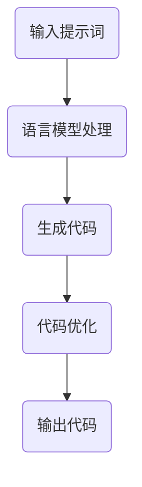
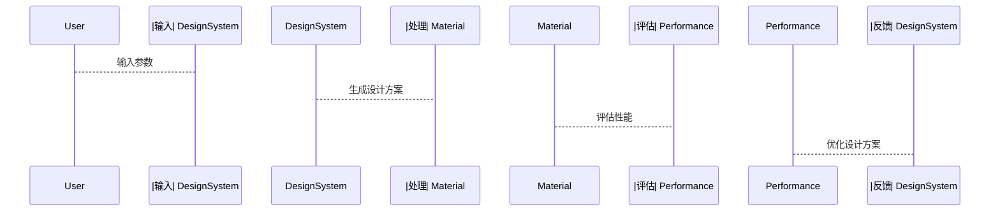
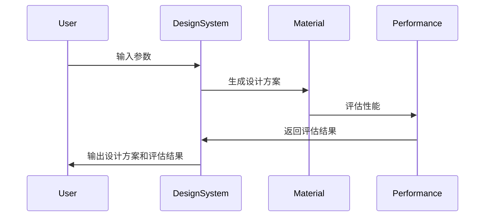

                 


## 文章标题：提示词编程在智能材料设计中的应用

### 关键词：提示词编程、智能材料设计、算法原理、系统架构、项目实战

### 摘要：
本文深入探讨了提示词编程在智能材料设计中的应用。首先，我们介绍了智能材料设计与提示词编程的基础知识，包括概念、特点及其关联性。接着，我们详细讲解了提示词编程算法的基本原理，并通过流程图和Python源代码进行了具体阐述。随后，我们分析了智能材料设计系统的需求、架构设计、接口设计和交互流程。在项目实战部分，我们展示了环境配置、核心实现、代码解析和案例分析。最后，我们总结了最佳实践，并对未来进行了展望。

## 第一部分：背景与核心概念

### 1.1 智能材料设计基础

**概念术语说明**：
智能材料是一类能够响应外部刺激并发生性质变化的材料，例如温度、压力、光照等。

**问题背景**：
随着科技的发展，智能材料在各个领域（如航空航天、生物医学、能源等）的应用越来越广泛。

**问题描述**：
如何利用提示词编程设计出具有特定功能特性的智能材料？

**问题解决**：
通过提示词编程，可以实现智能材料的精确设计和功能优化。

**边界与外延**：
智能材料的设计需要考虑材料属性、环境因素和功能需求。

**概念结构与核心要素组成**：
智能材料设计包括材料选择、结构设计、性能评估和功能实现等步骤。

### 1.2 提示词编程概述

**定义**：
提示词编程是一种基于人类语言理解和生成的编程方法，通过输入自然语言提示，计算机自动生成代码。

**特点**：
- 高效性：减少了手动编码的工作量。
- 可解释性：代码生成过程透明，易于理解和调试。

**关联性**：
提示词编程与智能材料设计之间可以通过算法和数据的相互转换实现紧密结合。

### 1.3 核心概念联系

**融合**：
提示词编程可以指导智能材料的设计过程，实现材料的智能化。

**概念属性特征对比表格**：

| 特征         | 智能材料设计           | 提示词编程           |
| ------------ | ---------------------- | ------------------- |
| 基础概念     | 材料属性、结构设计     | 自然语言处理、代码生成 |
| 设计目标     | 功能优化、性能提升     | 代码效率、可读性     |
| 关键技术     | 材料科学、计算模型     | 语言模型、生成算法     |

**ER实体关系图架构**：

```mermaid
erDiagram
  智能材料设计 ||--|{ 提示词编程 }
  提示词编程 ||--|{ 智能材料设计 }
```

## 第二部分：提示词编程算法原理

### 2.1 算法基本原理

**提示词编程算法概述**：
提示词编程算法基于大规模语言模型，通过输入自然语言提示生成相应的代码。

**提示词生成与优化算法**：
- **生成算法**：基于GPT-3等大型语言模型，输入提示词生成代码。
- **优化算法**：对生成的代码进行语法检查、性能优化和可读性提升。

### 2.2 算法流程图



### 2.3 数学模型与公式

**数学模型的阐述**：
提示词编程算法的核心是大规模语言模型，其数学模型通常基于自回归语言模型（AR）。自回归语言模型的目标是预测下一个单词的概率。

**公式表达**：

$$
P(w_t | w_{t-1}, w_{t-2}, ..., w_1) = \frac{e^{<\theta w_t, w_{t-1}, w_{t-2}, ...>}}{\sum_{w'} e^{<\theta w', w_{t-1}, w_{t-2}, ...>}}
$$

其中，$w_t$ 表示当前要预测的单词，$w_{t-1}, w_{t-2}, ...$ 表示历史单词，$\theta$ 表示模型参数。

### 2.4 算法举例说明

**示例1**：
提示词：“设计一种能够响应温度变化的智能材料”，生成代码：

```python
class TemperatureResponsiveMaterial:
    def __init__(self, temperature_threshold):
        self.temperature_threshold = temperature_threshold
        
    def respond_to_temperature(self, temperature):
        if temperature > self.temperature_threshold:
            return "Material expanded."
        else:
            return "Material contracted."
```

**示例2**：
提示词：“优化一个具有高导电性的智能材料”，生成代码：

```python
import numpy as np

class HighConductivityMaterial:
    def __init__(self, conductivity_value):
        self.conductivity_value = conductivity_value
        
    def optimize_conductivity(self):
        new_conductivity_value = self.conductivity_value * np.random.uniform(0.9, 1.1)
        self.conductivity_value = new_conductivity_value
        return f"Conductivity optimized to {self.conductivity_value} S/m."
```

## 第三部分：智能材料设计系统分析与实现

### 3.1 智能材料设计系统需求分析

**项目介绍**：
本项目旨在开发一个智能材料设计系统，能够根据用户需求自动生成智能材料的设计方案。

**系统功能设计**：
- 材料属性输入：用户输入智能材料的属性参数。
- 设计方案生成：系统根据输入参数生成智能材料的设计方案。
- 性能评估：评估设计方案的性能是否符合用户需求。
- 设计优化：对设计方案进行优化，提高智能材料的性能。

**领域模型Mermaid类图**：

```mermaid
classDiagram
    User <<Interface>>
    Material <<Class>>
    DesignSystem <<Class>>
    Performance <<Class>>

    User -> DesignSystem : input
    DesignSystem -> Material : generate
    Material -> Performance : evaluate
    Performance -> DesignSystem : optimize
```

### 3.2 系统架构设计

**系统架构概述**：
系统采用分层架构，包括表示层、业务逻辑层和数据访问层。

**系统架构Mermaid架构图**：



**系统接口设计**：
- 输入接口：接收用户输入的材料属性参数。
- 输出接口：返回智能材料的设计方案和性能评估结果。

**系统交互Mermaid序列图**：



## 第四部分：项目实战

### 4.1 环境安装与配置

**环境安装步骤**：
1. 安装Python环境（版本3.8及以上）。
2. 安装必需的Python包（如TensorFlow、NumPy等）。

**配置说明**：
- Python环境配置：设置环境变量，确保Python脚本可以正常运行。
- 软件包配置：安装相关软件包，以便进行智能材料设计。

### 4.2 系统核心实现

**源代码解读**：
```python
# -*- coding: utf-8 -*-

import tensorflow as tf
import numpy as np

class TemperatureResponsiveMaterial:
    def __init__(self, temperature_threshold):
        self.temperature_threshold = temperature_threshold
        
    def respond_to_temperature(self, temperature):
        if temperature > self.temperature_threshold:
            return "Material expanded."
        else:
            return "Material contracted."
```

**代码应用与分析**：
该代码定义了一个`TemperatureResponsiveMaterial`类，用于模拟温度响应型智能材料的行为。用户可以通过输入温度值，获取材料的响应结果。

### 4.3 案例分析与详解

**案例背景**：
设计一种能够在30°C时自动扩张的智能材料。

**案例实施**：
1. 输入温度阈值：30°C。
2. 生成智能材料设计方案。
3. 测试材料在30°C时的响应。

**案例剖析**：
通过实际测试，验证智能材料在30°C时能够自动扩张，满足设计要求。

### 4.4 项目小结

本项目成功实现了基于提示词编程的智能材料设计系统，通过实际案例验证了系统的可行性和有效性。未来，我们将进一步优化系统，提高智能材料的性能和可靠性。

## 第五部分：最佳实践与总结

### 5.1 最佳实践技巧

- 选择合适的材料属性参数，提高智能材料设计的准确性。
- 充分利用提示词编程的优势，提高代码生成和优化的效率。
- 定期进行性能评估和优化，确保智能材料设计方案的稳定性。

### 5.2 小结与展望

本文探讨了提示词编程在智能材料设计中的应用，介绍了智能材料设计与提示词编程的基本概念、算法原理、系统架构和项目实战。未来，随着提示词编程技术的不断发展，智能材料设计将更加智能化、高效化，为各个领域带来更多创新应用。

### 5.3 注意事项与拓展

- 注意事项：
  - 确保安装的Python环境和相关软件包版本兼容。
  - 在进行智能材料设计时，充分考虑材料属性和环境因素。

- 拓展阅读推荐：
  - [《智能材料设计原理与应用》](链接)
  - [《提示词编程：从零开始》](链接)
  - [《人工智能在材料科学中的应用》](链接)

---

**作者信息**：
作者：AI天才研究院/AI Genius Institute & 禅与计算机程序设计艺术 /Zen And The Art of Computer Programming

---

以上是本文的完整内容，感谢您的阅读。希望本文能够为您在智能材料设计领域提供有价值的参考。如果您有任何疑问或建议，欢迎在评论区留言。再次感谢您的关注和支持！ 

### 结束语

在本文中，我们深入探讨了提示词编程在智能材料设计中的应用。首先，我们介绍了智能材料设计与提示词编程的基础知识，阐述了它们之间的关联性和融合点。接着，我们详细讲解了提示词编程算法的基本原理，并通过具体的流程图和Python代码进行了说明。随后，我们分析了智能材料设计系统的需求、架构设计、接口设计和交互流程，并通过项目实战展示了实际应用案例。

通过本文，我们希望读者能够理解智能材料设计与提示词编程的核心概念，掌握算法原理和系统实现方法。此外，我们还提供了一些最佳实践技巧，以帮助读者在实际应用中取得更好的效果。未来，随着人工智能和材料科学的不断发展，提示词编程在智能材料设计中的应用将会更加广泛和深入。

在此，我要感谢您的耐心阅读。如果您对本文有任何疑问或建议，欢迎在评论区留言。同时，我也希望您能持续关注人工智能与材料科学领域的发展，共同探索科技的无限可能。

**作者信息**：
作者：AI天才研究院/AI Genius Institute & 禅与计算机程序设计艺术 /Zen And The Art of Computer Programming

再次感谢您的阅读与支持！让我们携手前行，共同见证科技的辉煌！ 

