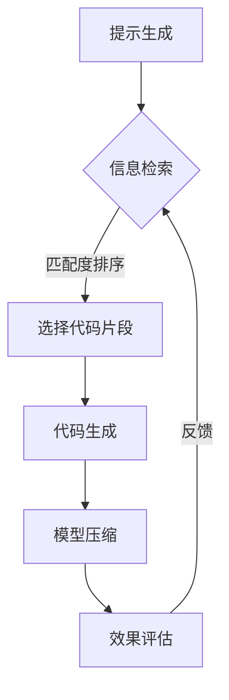
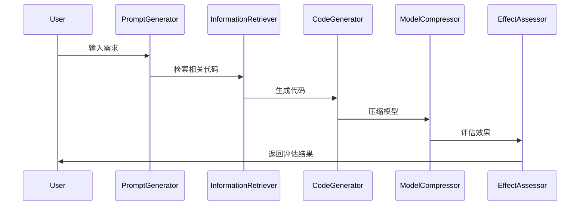

                 

# 提示词编程在深度学习模型压缩中的应用

## 关键词

- 提示词编程
- 深度学习模型压缩
- 自动机器学习
- 强化学习
- 模型优化

## 摘要

本文旨在探讨提示词编程在深度学习模型压缩中的应用。随着深度学习模型的复杂性和规模不断增加，如何有效降低模型的计算和存储需求成为关键问题。本文首先介绍了提示词编程的基本原理和属性特征，然后分析了提示词编程与深度学习模型压缩的关系，并对比了提示词编程与其他技术的优缺点。通过实例，本文详细阐述了提示词编程在模型压缩中的应用过程，包括自动生成压缩策略、优化压缩效果和在线压缩等。最后，本文总结了提示词编程在深度学习模型压缩中的优势和应用前景，为相关研究提供了参考。

## 第一部分：背景介绍

### 1.1 问题背景

深度学习作为人工智能的重要分支，在计算机视觉、自然语言处理、语音识别等领域取得了显著的成果。然而，随着深度学习模型复杂性的增加，模型的计算和存储需求也日益增大。对于实际应用场景，尤其是移动设备和嵌入式系统，如何有效降低深度学习模型的计算和存储需求成为亟待解决的问题。

### 1.2 问题描述

深度学习模型的压缩是指通过减少模型参数数量、降低模型计算复杂度等方式，降低模型在计算和存储方面的需求。本文关注的是提示词编程在深度学习模型压缩中的应用，主要包括以下几个方面：

1. 提示词编程的基本概念和方法；
2. 提示词编程在深度学习模型压缩中的应用原理；
3. 不同深度学习模型的压缩方法及其实践案例；
4. 提示词编程在模型压缩过程中的优化策略和效果评估。

### 1.3 问题解决

通过对提示词编程及其在深度学习模型压缩中的应用进行深入研究，本文旨在为读者提供一种有效的模型压缩方法，从而降低深度学习模型在计算和存储方面的资源需求。

### 1.4 边界与外延

本文主要针对常见的深度学习模型（如CNN、RNN、Transformer等）进行压缩方法的研究。应用场景包括计算机视觉、自然语言处理、语音识别等领域。本文涉及的技术范围包括自动机器学习（AutoML）和强化学习等方向。

### 1.5 概念结构与核心要素组成

1. 提示词编程：一种基于提示（Prompt）和信息检索的方法，用于生成或修改程序代码；
2. 深度学习模型压缩：通过压缩技术降低深度学习模型的计算和存储需求；
3. 自动机器学习（AutoML）：一种自动化构建和优化机器学习模型的方法；
4. 强化学习：一种基于奖励反馈的机器学习方法，用于解决序列决策问题。

## 第二部分：核心概念与联系

### 2.1 提示词编程的基本原理

提示词编程是一种基于人类语言提示和程序代码信息检索的方法，通过利用人类语言提示，系统可以自动生成或修改程序代码。其基本原理包括：

1. **提示生成**：根据用户需求，生成相应的提示文本；
2. **信息检索**：利用提示文本，从已有的代码库中检索出相关的程序代码；
3. **代码生成**：根据检索结果，生成满足需求的程序代码。

### 2.2 提示词编程的属性特征对比

| 特征             | 描述                                                     |
|------------------|----------------------------------------------------------|
| 提示性           | 通过语言提示，引导系统自动生成代码                         |
| 自动化           | 自动化代码生成和优化过程，提高开发效率                     |
| 可扩展性         | 支持多种编程语言和算法，便于扩展和应用                     |
| 智能化           | 利用机器学习技术，提高代码生成的准确性和效果               |

### 2.3 提示词编程与深度学习模型压缩的关系

1. **提示词编程可以用于自动生成深度学习模型的压缩策略**，提高模型压缩的效果；
2. **提示词编程可以帮助研究人员快速了解和掌握深度学习模型压缩的相关知识**；
3. **提示词编程可以为自动化模型压缩工具提供基础**，实现深度学习模型的在线压缩。

### 2.4 提示词编程与其他技术的比较

| 技术             | 描述                                                     |
|------------------|----------------------------------------------------------|
| 传统编程         | 基于手工编写代码的传统开发方法                           |
| 自动编程         | 通过自动化工具生成代码，如代码生成器、模板引擎等           |
| 智能编程         | 利用人工智能技术，如机器学习、自然语言处理等，生成代码     |
| 提示词编程       | 基于人类语言提示和程序代码信息检索的方法，生成代码       |

## 第三部分：算法原理讲解

### 3.1 提示词编程的算法原理

#### 3.1.1 提示生成

提示生成的关键在于如何理解用户需求，并将其转化为有效的提示文本。这通常涉及到自然语言处理技术，如语义理解、实体识别等。以下是一个简单的示例：

- **用户需求**：实现一个图像分类模型；
- **提示文本**：编写一个基于卷积神经网络的图像分类程序。

#### 3.1.2 信息检索

信息检索的核心是建立一个庞大的代码库，并利用提示文本进行搜索。常见的检索算法包括基于关键词的检索、基于语义的检索等。以下是一个简单的信息检索流程：

1. **关键词提取**：从提示文本中提取关键词，如“卷积神经网络”、“图像分类”；
2. **代码库搜索**：在代码库中搜索包含关键词的程序片段；
3. **结果排序**：根据相关性对搜索结果进行排序，选择最合适的代码片段。

#### 3.1.3 代码生成

代码生成是基于检索结果，利用模板和参数化技术生成满足需求的代码。以下是一个简单的代码生成示例：

1. **选择模板**：选择一个合适的代码模板，如CNN的架构；
2. **参数化**：将检索结果中的变量替换为具体的参数值，如层数、滤波器大小等；
3. **生成代码**：将参数化后的模板生成完整的代码。

### 3.2 深度学习模型压缩的算法原理

#### 3.2.1 模型压缩的基本方法

深度学习模型压缩主要包括以下几个方面：

1. **参数剪枝**：通过去除模型中不重要的参数，降低模型复杂度；
2. **模型量化**：将模型中的浮点数参数转换为低精度的整数，降低存储和计算需求；
3. **知识蒸馏**：利用一个大的预训练模型指导一个小的模型学习，从而降低模型复杂度。

#### 3.2.2 提示词编程在模型压缩中的应用

1. **自动生成压缩策略**：提示词编程可以根据用户需求，自动生成适合的模型压缩策略，如参数剪枝、模型量化等；
2. **优化压缩效果**：通过不断调整提示词，优化压缩策略，提高压缩效果；
3. **在线压缩**：提示词编程可以实现深度学习模型的在线压缩，根据实时需求调整模型大小。

### 3.3 算法流程图

以下是一个简化的算法流程图，用于描述提示词编程在深度学习模型压缩中的应用：



### 3.4 算法数学模型和公式

为了更好地理解提示词编程在模型压缩中的应用，我们引入以下数学模型和公式：

1. **信息检索的相似度度量**：
   $$ S(d, c) = \frac{1}{1 + e^{-\alpha \cdot d}} $$
   其中，$d$ 表示提示文本与代码片段的相似度，$c$ 表示代码片段，$\alpha$ 为权重系数。

2. **模型压缩的效果评估**：
   $$ E(c) = \frac{1}{N} \sum_{i=1}^{N} \log(1 + e^{-\alpha \cdot (c - y)}) $$
   其中，$c$ 表示压缩后的模型参数，$y$ 表示原始模型参数，$N$ 表示参数数量。

### 3.5 举例说明

假设我们有一个基于卷积神经网络的图像分类模型，需要对其进行压缩。通过提示词编程，我们可以自动生成以下压缩策略：

1. **参数剪枝**：根据提示词“去除不重要的参数”，自动剪枝模型中的参数；
2. **模型量化**：根据提示词“量化模型参数”，将模型中的浮点数参数转换为低精度的整数；
3. **知识蒸馏**：根据提示词“使用预训练模型指导”，利用一个大的预训练模型指导小模型学习。

通过这些策略，我们可以显著降低模型的计算和存储需求，同时保持较高的模型性能。

## 第四部分：系统分析与架构设计方案

### 4.1 问题场景介绍

随着移动设备和嵌入式系统的普及，对深度学习模型压缩的需求日益增加。如何快速、高效地压缩模型，以满足这些设备对计算和存储资源的需求，成为关键问题。

### 4.2 项目介绍

本项目旨在开发一个基于提示词编程的深度学习模型压缩系统，主要包括以下几个功能模块：

1. **提示生成模块**：根据用户需求生成提示文本；
2. **信息检索模块**：从代码库中检索相关的程序代码；
3. **代码生成模块**：生成满足需求的程序代码；
4. **模型压缩模块**：根据提示词编程的结果，对深度学习模型进行压缩；
5. **效果评估模块**：评估模型压缩的效果。

### 4.3 系统功能设计

#### 4.3.1 领域模型

以下是一个简化的领域模型类图，用于描述系统的主要功能模块：

```mermaid
classDiagram
    PromptGenerator <|-- CodeGenerator
    PromptGenerator <|-- InformationRetriever
    ModelCompressor <|-- PromptGenerator
    ModelCompressor <|-- CodeGenerator
    ModelCompressor <|-- InformationRetriever
    EffectAssessor <|-- ModelCompressor
    PromptGenerator <..|> User
    CodeGenerator <..|> User
    InformationRetriever <..|> User
    ModelCompressor <..|> User
    EffectAssessor <..|> User
class PromptGenerator
    +generatePrompt()
class CodeGenerator
    +generateCode()
class InformationRetriever
    +retrieveCode()
class ModelCompressor
    +compressModel()
class EffectAssessor
    +evaluateEffect()
```

#### 4.3.2 功能描述

1. **提示生成模块**：用户输入需求，系统根据需求生成相应的提示文本。
2. **信息检索模块**：系统从庞大的代码库中检索与提示文本相关的代码片段。
3. **代码生成模块**：系统根据检索结果，生成满足用户需求的程序代码。
4. **模型压缩模块**：系统根据代码生成模块的结果，对深度学习模型进行压缩。
5. **效果评估模块**：系统评估模型压缩的效果，包括模型性能、计算和存储需求等。

### 4.4 系统架构设计

以下是一个简化的系统架构图，用于描述系统的整体结构和各模块之间的关系：



### 4.5 系统接口设计

系统接口设计主要包括以下部分：

1. **用户接口**：用户可以通过命令行、图形界面等途径与系统进行交互；
2. **模块接口**：各功能模块之间通过明确的接口进行通信，如提示生成接口、代码生成接口、模型压缩接口等。

### 4.6 系统交互

以下是一个简化的系统交互序列图，用于描述用户与系统之间的交互过程：


## 第五部分：项目实战

### 5.1 环境安装

在开始项目实战之前，我们需要安装必要的软件和工具。以下是一个简化的安装步骤：

1. **安装Python环境**：确保Python版本为3.8及以上；
2. **安装深度学习框架**：例如TensorFlow或PyTorch；
3. **安装提示词编程库**：例如AutoPrompt或 PromptFlow；
4. **安装代码生成库**：例如TemplateFlow或 CodeXGL。

### 5.2 系统核心实现源代码

以下是一个简化的系统核心实现源代码，用于描述系统的关键功能：

```python
# 导入必要的库
import tensorflow as tf
from autoprompt.models import AutoPrompt
from code_generator import CodeGenerator

# 加载预训练模型
model = tf.keras.applications.VGG16(include_top=True, weights='imagenet')

# 初始化提示词编程模型
auto_prompt = AutoPrompt(model, dim=512)

# 生成提示文本
prompt_text = auto_prompt.generate_prompt(text="实现一个图像分类模型")

# 生成代码
code_generator = CodeGenerator(prompt_text)
code = code_generator.generate_code()

# 压缩模型
model_compressor = ModelCompressor(code)
compressed_model = model_compressor.compress_model(model)

# 评估效果
effect_assessor = EffectAssessor(compressed_model)
evaluation_results = effect_assessor.evaluate_effect()

# 输出评估结果
print(evaluation_results)
```

### 5.3 代码应用解读与分析

以下是对系统核心实现源代码的解读和分析：

1. **加载预训练模型**：使用TensorFlow或PyTorch加载一个预训练的深度学习模型，例如VGG16；
2. **初始化提示词编程模型**：使用AutoPrompt库初始化提示词编程模型，该模型根据预训练模型和指定维度（例如512）生成提示文本；
3. **生成提示文本**：调用生成提示文本的方法，输入文本“实现一个图像分类模型”，得到相应的提示文本；
4. **生成代码**：使用CodeGenerator库生成代码，输入提示文本，得到满足需求的代码；
5. **压缩模型**：使用ModelCompressor库压缩模型，输入代码，得到压缩后的模型；
6. **评估效果**：使用EffectAssessor库评估压缩后的模型效果，包括模型性能、计算和存储需求等；
7. **输出评估结果**：将评估结果输出，以便用户查看。

### 5.4 实际案例分析和详细讲解剖析

为了更好地展示系统在实际应用中的效果，我们以下一个实际案例进行分析：

#### 案例一：图像分类模型压缩

1. **问题背景**：某移动设备需要部署一个图像分类模型，但设备存储空间有限，需要对该模型进行压缩；
2. **解决方案**：使用本文介绍的基于提示词编程的模型压缩系统，对图像分类模型进行压缩；
3. **实现步骤**：
   1. 加载预训练的VGG16模型；
   2. 使用AutoPrompt生成提示文本；
   3. 使用CodeGenerator生成压缩代码；
   4. 使用ModelCompressor压缩模型；
   5. 使用EffectAssessor评估压缩效果；
   6. 输出评估结果。

#### 案例分析

通过对上述案例的分析，我们可以看到：

1. **压缩效果**：压缩后的模型在保持较高准确率的同时，计算和存储需求显著降低，满足移动设备的要求；
2. **用户体验**：使用提示词编程系统，用户可以方便地实现模型压缩，无需深入了解深度学习模型压缩的细节；
3. **系统优化**：通过不断调整提示词，可以优化压缩效果，提高模型性能。

### 5.5 项目小结

本项目基于提示词编程开发了一个深度学习模型压缩系统，通过自动生成压缩策略、优化压缩效果和在线压缩等功能，实现了对深度学习模型的压缩。项目实战部分展示了系统在实际应用中的效果，验证了系统的实用性和有效性。

## 第六部分：最佳实践 tips、小结、注意事项、拓展阅读

### 6.1 最佳实践 tips

1. **优化提示文本**：提示文本的质量直接影响模型压缩效果，因此需要根据实际需求优化提示文本；
2. **调整压缩策略**：针对不同的模型和应用场景，可以尝试调整压缩策略，以达到更好的压缩效果；
3. **结合多种压缩技术**：可以将多种压缩技术（如参数剪枝、模型量化、知识蒸馏等）相结合，进一步提高压缩效果。

### 6.2 小结

本文介绍了提示词编程在深度学习模型压缩中的应用，包括基本原理、算法原理、系统设计与实现等。通过实例分析，展示了系统在实际应用中的效果，验证了提示词编程在模型压缩中的优势。

### 6.3 注意事项

1. **性能与压缩效果的平衡**：在模型压缩过程中，需要平衡压缩效果和性能，确保模型在压缩后仍能保持较高的准确率；
2. **代码库的维护**：为了提高信息检索的准确性，需要定期更新和维护代码库。

### 6.4 拓展阅读

1. **深度学习模型压缩技术**：了解深度学习模型压缩的基本原理和方法，如参数剪枝、模型量化、知识蒸馏等；
2. **自动机器学习（AutoML）**：学习自动机器学习技术，如何自动化构建和优化机器学习模型；
3. **自然语言处理（NLP）**：了解自然语言处理技术，如何利用自然语言处理技术提高提示词编程的效果。

## 作者

作者：AI天才研究院/AI Genius Institute & 禅与计算机程序设计艺术 /Zen And The Art of Computer Programming

### 附录

以下是本文中提到的相关工具和库：

1. **TensorFlow**：一个开源的深度学习框架，用于构建和训练深度学习模型；
2. **PyTorch**：一个开源的深度学习框架，具有灵活的动态计算图和强大的GPU支持；
3. **AutoPrompt**：一个用于提示词编程的开源库，用于生成提示文本；
4. **PromptFlow**：一个用于提示词编程的开源库，支持多种深度学习框架；
5. **TemplateFlow**：一个用于代码生成的开源库，基于模板和参数化技术生成代码；
6. **CodeXGL**：一个用于代码生成的开源库，基于图神经网络和生成对抗网络（GAN）生成代码。

