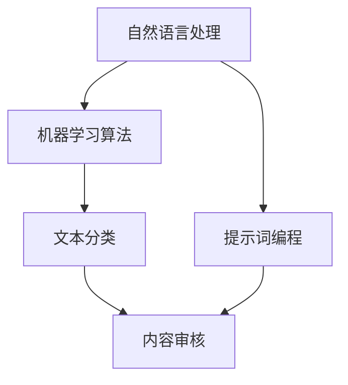
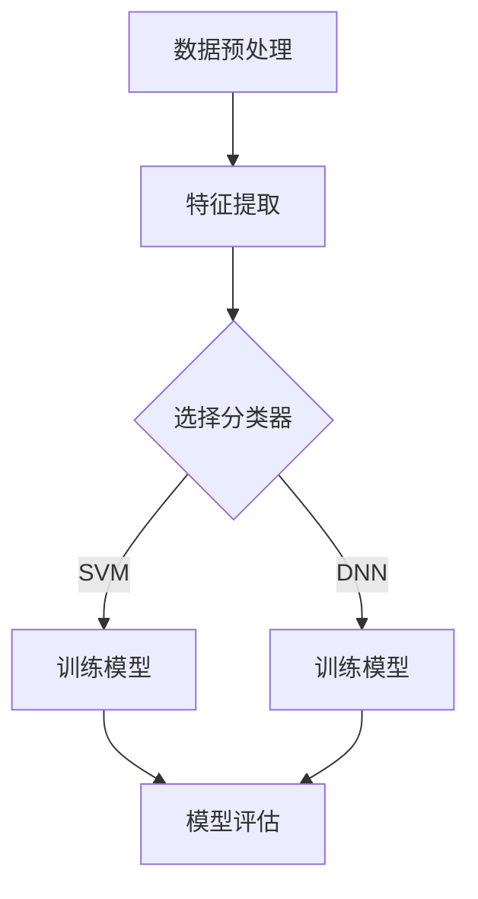
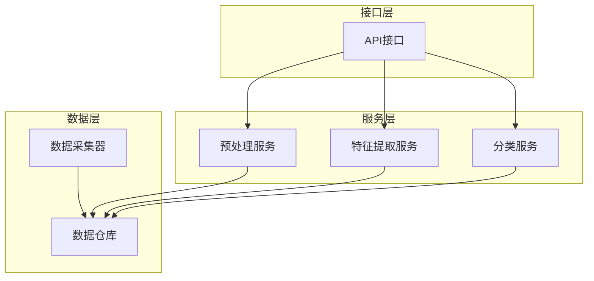
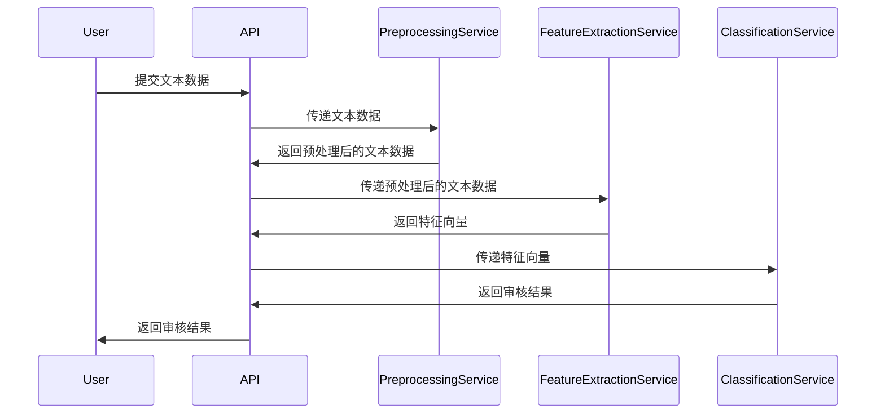

                 


# 提示词编程在自动化内容审核中的应用

## 关键词
- 提示词编程
- 自动化内容审核
- 自然语言处理
- 机器学习算法
- 内容过滤
- 文本分类

## 摘要
本文将探讨提示词编程在自动化内容审核中的应用，详细阐述如何利用自然语言处理和机器学习技术，通过提示词编程实现高效、准确的内容过滤和分类。文章分为以下几个部分：背景介绍、核心概念与联系、算法原理讲解、数学模型与公式、系统分析与架构设计、项目实战、最佳实践与小结。通过逐步分析推理，本文旨在为读者提供深入理解提示词编程及其在自动化内容审核中的实际应用。

## 目录
1. 背景介绍
2. 核心概念与联系
3. 算法原理讲解
4. 数学模型与公式
5. 系统分析与架构设计
6. 项目实战
7. 最佳实践与小结
8. 注意事项与拓展阅读

## 1. 背景介绍

### 核心概念术语说明

- **提示词编程**：提示词编程是指利用预定义的提示词（prompt）来指导模型进行文本生成、分类或预测的任务。这些提示词通常包含关键信息，帮助模型更好地理解任务目标。

- **自动化内容审核**：自动化内容审核是指利用计算机技术和算法对互联网上的大量文本、图像、音频等数据进行实时监控和过滤，以识别并处理违规、不当或有害的内容。

- **自然语言处理（NLP）**：自然语言处理是指计算机科学和人工智能领域中的技术，旨在使计算机能够理解、处理和生成人类语言。在自动化内容审核中，NLP技术用于文本的解析、分类和情感分析。

- **机器学习算法**：机器学习算法是指通过从数据中学习模式，使计算机能够执行特定任务的技术。在自动化内容审核中，机器学习算法用于训练模型识别违规内容。

- **内容过滤**：内容过滤是指对互联网上的内容进行筛选，删除或标记不符合特定标准的部分。在自动化内容审核中，内容过滤技术用于识别并处理违规内容。

- **文本分类**：文本分类是指将文本数据按照一定的标准进行分类，以实现信息检索、内容推荐等功能。在自动化内容审核中，文本分类技术用于将文本数据划分为不同的类别，如违规、正常等。

### 问题背景

随着互联网的快速发展，互联网上的信息量呈爆炸式增长，内容审核工作变得越来越困难。传统的手动审核方式效率低下，且难以覆盖海量的内容。此外，一些违规内容的传播速度极快，手动审核往往无法及时处理。因此，自动化内容审核技术应运而生。

### 问题描述

自动化内容审核技术旨在解决以下问题：

- **高效率**：能够实时处理海量的文本数据，提高审核效率。
- **准确性**：准确识别和过滤违规内容，减少误判和漏判。
- **可扩展性**：能够适应不断变化的内容类型和审核标准。
- **灵活性**：能够根据不同的业务需求调整审核策略。

### 问题解决

提示词编程作为一种先进的自然语言处理技术，能够为自动化内容审核提供有效的解决方案。通过提示词编程，可以：

- **提高模型的理解能力**：提示词能够提供关键信息，使模型更好地理解审核任务的目标，从而提高审核准确性。
- **优化模型训练过程**：提示词可以帮助模型快速捕捉关键特征，提高训练效率。
- **适应多种审核场景**：通过调整提示词，可以实现不同类型内容审核的需求，提高系统的灵活性。

### 边界与外延

- **内容类型**：自动化内容审核可以应用于多种内容类型，如文本、图像、音频等。
- **审核标准**：审核标准可以包括语言规范、道德标准、法律法规等。
- **技术挑战**：提示词编程在自动化内容审核中面临的关键挑战包括：如何设计有效的提示词、如何应对海量数据的高效处理、如何保证审核结果的公正性和透明性等。

### 概念结构与核心要素组成

提示词编程在自动化内容审核中的应用可以分为以下几个核心要素：

1. **数据采集与处理**：收集和预处理审核所需的数据，包括文本、图像、音频等。
2. **提示词设计**：根据审核任务的需求，设计合适的提示词，以提高模型的理解能力和准确性。
3. **模型训练与优化**：利用提示词训练模型，并对模型进行优化，以提高审核效果。
4. **内容审核与分类**：使用训练好的模型对内容进行实时审核和分类，识别违规内容。
5. **反馈与迭代**：根据审核结果收集反馈，不断调整提示词和模型，实现迭代优化。

## 2. 核心概念与联系

### 核心概念原理

在提示词编程的背景下，自动化内容审核的核心概念主要包括：

1. **自然语言处理（NLP）**：NLP是实现自动化内容审核的关键技术，它使得计算机能够理解和生成人类语言。在自动化内容审核中，NLP主要用于文本的解析、分类和情感分析。

2. **机器学习算法**：机器学习算法用于训练模型，使其能够识别和分类不同的文本内容。常见的机器学习算法包括决策树、支持向量机（SVM）、神经网络等。

3. **提示词编程**：提示词编程是指通过提供特定的提示词来引导模型进行文本生成、分类或预测。提示词对于模型的理解能力和任务准确性具有重要作用。

4. **文本分类**：文本分类是将文本按照一定的标准进行分类的过程，如将文本划分为违规、正常等类别。在自动化内容审核中，文本分类用于识别和标记违规内容。

### 概念属性特征对比表格

| 概念         | 属性特征                                                         |
| ------------ | ------------------------------------------------------------ |
| 自然语言处理 | 解析、生成、理解、分类、情感分析                             |
| 机器学习算法 | 决策树、SVM、神经网络、深度学习等                           |
| 提示词编程   | 提供特定提示词、引导模型理解任务、提高任务准确性           |
| 文本分类     | 根据标准分类文本、标记违规内容、实现内容过滤               |

### ER实体关系图架构

为了更好地理解提示词编程在自动化内容审核中的应用，我们使用Mermaid流程图来展示相关的实体关系：



在这个ER实体关系图中，自然语言处理和机器学习算法是自动化内容审核的基础技术，文本分类是实现内容审核的关键步骤，而提示词编程则作为指导模型理解任务的重要手段，贯穿整个内容审核过程。

## 3. 算法原理讲解

### 算法介绍

在自动化内容审核中，常用的算法包括基于分类器的算法和基于生成对抗网络的算法。本文将主要介绍基于分类器的算法，如支持向量机（SVM）和深度神经网络（DNN），以及如何利用提示词编程来优化这些算法。

### 算法流程图

使用Mermaid流程图来展示SVM算法的流程：



### SVM算法原理

支持向量机（SVM）是一种二分类模型，其目标是寻找一个最佳的超平面，使得数据集的类别能够被正确分类。在自动化内容审核中，SVM算法可以用于分类违规文本。

- **原理**：SVM通过求解一个最优的超平面，使得不同类别的数据点之间有最大的间隔。超平面由权重向量（w）和偏置（b）决定，其中权重向量垂直于超平面。

- **数学模型**：对于线性可分的数据集，SVM的决策边界可以表示为：
  $$ w \cdot x + b > 0 $$
  其中，$w$ 是权重向量，$x$ 是特征向量，$b$ 是偏置。

### DNN算法原理

深度神经网络（DNN）是一种多层神经网络，通过非线性变换和特征提取，实现高维数据的分类。在自动化内容审核中，DNN算法可以用于复杂文本的分类任务。

- **原理**：DNN通过多个隐藏层对输入数据进行逐层特征提取，每一层的输出作为下一层的输入。网络的输出层负责进行分类决策。

- **数学模型**：DNN的输出可以表示为：
  $$ z = \sigma(\boldsymbol{W} \cdot \boldsymbol{a}^{[L-1]} + b^{[L]}) $$
  其中，$z$ 是输出层激活值，$\sigma$ 是激活函数（如ReLU、Sigmoid或Tanh），$\boldsymbol{W}$ 是权重矩阵，$\boldsymbol{a}^{[L-1]}$ 是前一层输出，$b^{[L]}$ 是偏置。

### Python代码示例

以下是一个使用SVM进行文本分类的Python代码示例：

```python
from sklearn import svm
from sklearn.model_selection import train_test_split
from sklearn.metrics import classification_report

# 数据预处理
X_train, X_test, y_train, y_test = train_test_split(X, y, test_size=0.2, random_state=42)

# 使用SVM训练模型
clf = svm.SVC(kernel='linear')
clf.fit(X_train, y_train)

# 模型评估
y_pred = clf.predict(X_test)
print(classification_report(y_test, y_pred))
```

以下是一个使用DNN进行文本分类的Python代码示例：

```python
from keras.models import Sequential
from keras.layers import Dense, Activation
from keras.utils import to_categorical

# 模型构建
model = Sequential()
model.add(Dense(128, input_dim=X_train.shape[1], activation='relu'))
model.add(Dense(64, activation='relu'))
model.add(Dense(num_classes, activation='softmax'))

# 模型编译
model.compile(optimizer='adam', loss='categorical_crossentropy', metrics=['accuracy'])

# 模型训练
model.fit(X_train, to_categorical(y_train), epochs=10, batch_size=32, validation_split=0.1)

# 模型评估
test_loss, test_acc = model.evaluate(X_test, to_categorical(y_test))
print('Test accuracy:', test_acc)
```

### 算法原理详细讲解

- **SVM算法原理**：SVM通过求解一个最优的超平面，使得数据集的类别能够被正确分类。在自动化内容审核中，SVM算法可以用于分类违规文本。SVM的核心是找到一个最优的超平面，使得不同类别的数据点之间有最大的间隔。超平面由权重向量（w）和偏置（b）决定，其中权重向量垂直于超平面。

  数学模型为：
  $$ w \cdot x + b > 0 $$
  其中，$w$ 是权重向量，$x$ 是特征向量，$b$ 是偏置。

  SVM的目标是最大化分类间隔，即：
  $$ \max_{w,b}\frac{2}{\|w\|} $$
  其中，$\|w\|$ 是权重向量的范数。

- **DNN算法原理**：深度神经网络（DNN）是一种多层神经网络，通过非线性变换和特征提取，实现高维数据的分类。在自动化内容审核中，DNN算法可以用于复杂文本的分类任务。

  DNN通过多个隐藏层对输入数据进行逐层特征提取，每一层的输出作为下一层的输入。网络的输出层负责进行分类决策。

  DNN的输出可以表示为：
  $$ z = \sigma(\boldsymbol{W} \cdot \boldsymbol{a}^{[L-1]} + b^{[L]}) $$
  其中，$z$ 是输出层激活值，$\sigma$ 是激活函数（如ReLU、Sigmoid或Tanh），$\boldsymbol{W}$ 是权重矩阵，$\boldsymbol{a}^{[L-1]}$ 是前一层输出，$b^{[L]}$ 是偏置。

  DNN的训练过程包括前向传播和反向传播。前向传播计算网络的输出，反向传播计算损失函数关于网络参数的梯度，并利用梯度下降法更新参数。

### 算法原理举例说明

假设我们有以下两个类别的文本数据：

- 类别A：包含描述良好行为的文本。
- 类别B：包含描述不良行为的文本。

使用SVM算法进行文本分类的过程如下：

1. **数据预处理**：将文本数据转换为特征向量，如使用词袋模型或TF-IDF表示。

2. **训练模型**：将特征向量输入到SVM模型中，训练模型找到最佳的超平面。

3. **模型评估**：将测试集的特征向量输入到训练好的SVM模型中，预测测试集的类别。

4. **结果分析**：分析模型在测试集上的分类准确率、召回率、F1值等指标，评估模型的性能。

使用DNN算法进行文本分类的过程如下：

1. **模型构建**：构建一个包含多个隐藏层的DNN模型，输入层包含文本特征向量，输出层包含类别标签。

2. **模型编译**：编译模型，指定损失函数（如交叉熵损失）和优化器（如Adam）。

3. **模型训练**：将训练集的特征向量输入到模型中，训练模型调整权重和偏置。

4. **模型评估**：将测试集的特征向量输入到训练好的DNN模型中，预测测试集的类别，并评估模型的性能。

通过对比SVM和DNN算法的原理和应用，我们可以看到，提示词编程在自动化内容审核中可以发挥重要作用。通过设计合适的提示词，可以引导模型更好地理解文本内容，提高分类准确率和效果。

## 4. 数学模型与公式

在自动化内容审核中，数学模型和公式是理解算法原理和实现关键步骤的核心。下面我们将详细讲解与提示词编程相关的数学模型和公式，并提供具体的例子来说明如何使用这些模型和公式进行内容审核。

### 数学模型

#### 1. 支持向量机（SVM）模型

SVM是一种基于优化理论的分类模型，其目标是在高维空间中找到一个最优的超平面，使得不同类别的数据点之间有最大的间隔。SVM的数学模型可以表示为：

$$
\begin{aligned}
\min_{\boldsymbol{w},b}\frac{1}{2}\|\boldsymbol{w}\|^2 \\
\text{subject to} \\
\boldsymbol{w}\cdot \boldsymbol{x}_i - b \geq 1, \quad i=1,2,...,n
\end{aligned}
$$

其中，$\boldsymbol{w}$ 是权重向量，$b$ 是偏置，$\boldsymbol{x}_i$ 是第$i$个训练样本的特征向量，$n$ 是训练样本的数量。

#### 2. 深度神经网络（DNN）模型

深度神经网络是一种多层前馈神经网络，其输出可以通过以下公式计算：

$$
z = \sigma(\boldsymbol{W} \cdot \boldsymbol{a}^{[L-1]} + b^{[L]})
$$

其中，$z$ 是输出层的激活值，$\sigma$ 是激活函数（如ReLU、Sigmoid或Tanh），$\boldsymbol{W}$ 是权重矩阵，$\boldsymbol{a}^{[L-1]}$ 是前一层输出，$b^{[L]}$ 是偏置。

#### 3. 交叉熵损失函数

在深度学习中，交叉熵损失函数用于衡量预测输出与真实标签之间的差异。其公式如下：

$$
\text{loss} = -\sum_{i=1}^{n} y_i \log(\hat{y}_i)
$$

其中，$y_i$ 是第$i$个样本的真实标签，$\hat{y}_i$ 是模型对第$i$个样本的预测概率。

### 公式详解

#### 1. SVM优化问题

SVM的优化问题可以通过拉格朗日乘子法求解。引入拉格朗日乘子$\alpha_i$，目标函数变为：

$$
L(\boldsymbol{w}, b, \boldsymbol{\alpha}) = \frac{1}{2}\|\boldsymbol{w}\|^2 - \sum_{i=1}^{n} \alpha_i [1 - (\boldsymbol{w}\cdot \boldsymbol{x}_i - b)]
$$

约束条件为：

$$
0 \leq \alpha_i \leq C, \quad \forall i
$$

其中，$C$ 是惩罚参数。

通过求解拉格朗日乘子法的对偶问题，可以得到SVM的解：

$$
\boldsymbol{w} = \sum_{i=1}^{n} \alpha_i \boldsymbol{x}_i, \quad b = \frac{1}{n} \sum_{i=1}^{n} (\alpha_i - y_i \boldsymbol{x}_i \cdot \boldsymbol{x}_i)
$$

#### 2. DNN前向传播

DNN的前向传播过程涉及多层神经网络的激活函数计算。以多层感知机（MLP）为例，其前向传播过程可以表示为：

$$
\begin{aligned}
\boldsymbol{a}^{[1]} &= \sigma(\boldsymbol{W}^{[1]}\boldsymbol{x} + b^{[1]}) \\
\boldsymbol{a}^{[2]} &= \sigma(\boldsymbol{W}^{[2]}\boldsymbol{a}^{[1]} + b^{[2]}) \\
&\vdots \\
\boldsymbol{a}^{[L]} &= \sigma(\boldsymbol{W}^{[L]}\boldsymbol{a}^{[L-1]} + b^{[L]})
\end{aligned}
$$

其中，$\boldsymbol{a}^{[l]}$ 是第$l$层的输出，$\sigma$ 是激活函数，$\boldsymbol{W}^{[l]}$ 是第$l$层的权重矩阵，$b^{[l]}$ 是第$l$层的偏置。

#### 3. 交叉熵损失函数计算

交叉熵损失函数用于衡量预测输出与真实标签之间的差异。对于具有$K$个类别的分类问题，交叉熵损失函数可以表示为：

$$
\text{loss} = -\sum_{i=1}^{n} y_i \log(\hat{y}_i)
$$

其中，$y_i$ 是第$i$个样本的真实标签（0或1），$\hat{y}_i$ 是模型对第$i$个样本的预测概率。

### 例子说明

假设我们有一个二分类问题，数据集包含$m$个样本，每个样本的特征向量为$\boldsymbol{x}_i \in \mathbb{R}^d$，真实标签为$y_i \in \{0, 1\}$。我们要使用SVM和DNN模型进行分类。

#### 1. SVM模型

对于SVM模型，我们首先将文本数据转换为特征向量，使用词袋模型或TF-IDF表示。然后，我们将特征向量输入到SVM模型中，训练模型以找到最佳的超平面。

通过求解拉格朗日乘子法的对偶问题，我们得到SVM模型的解。假设我们得到的权重向量为$\boldsymbol{w} = [w_1, w_2, ..., w_d]^T$，偏置为$b$。则SVM模型的决策函数为：

$$
f(\boldsymbol{x}) = \boldsymbol{w} \cdot \boldsymbol{x} + b
$$

对于新的测试样本$\boldsymbol{x}_t$，我们可以使用上述决策函数进行分类：

$$
\hat{y}_t = \begin{cases}
1 & \text{if } f(\boldsymbol{x}_t) > 0 \\
0 & \text{otherwise}
\end{cases}
$$

#### 2. DNN模型

对于DNN模型，我们首先构建一个包含多层感知机的网络结构，使用ReLU作为激活函数。然后，我们将特征向量输入到DNN模型中，训练模型以调整权重和偏置。

假设我们的DNN模型包含两个隐藏层，第一个隐藏层有$128$个神经元，第二个隐藏层有$64$个神经元。则DNN模型的输出为：

$$
\hat{y}_t = \sigma(\boldsymbol{W}^{[2]}\sigma(\boldsymbol{W}^{[1]}\boldsymbol{x} + b^{[1]}) + b^{[2]})
$$

其中，$\sigma$ 是ReLU激活函数，$\boldsymbol{W}^{[1]}$ 和 $\boldsymbol{W}^{[2]}$ 是权重矩阵，$b^{[1]}$ 和 $b^{[2]}$ 是偏置。

对于新的测试样本$\boldsymbol{x}_t$，我们可以使用上述决策函数进行分类：

$$
\hat{y}_t = \begin{cases}
1 & \text{if } \hat{y}_t > 0.5 \\
0 & \text{otherwise}
\end{cases}
$$

通过上述数学模型和公式，我们可以构建和训练SVM和DNN模型，实现自动化内容审核。通过对比不同模型的性能和效果，我们可以选择最适合实际应用的模型。

## 5. 系统分析与架构设计

### 问题场景介绍

在自动化内容审核中，我们面临的一个核心问题是如何处理海量的文本数据，并从中快速、准确地识别和过滤违规内容。为了解决这一问题，我们需要设计一个高效、可扩展的自动化内容审核系统。

### 项目介绍

本项目旨在构建一个基于提示词编程的自动化内容审核系统，该系统将利用自然语言处理和机器学习技术，实现高效的内容过滤和分类。系统的主要功能包括：

- 数据采集与预处理：从各种渠道收集文本数据，并进行清洗、去重、分词等预处理操作。
- 特征提取与模型训练：使用提示词编程设计合适的特征提取方法，并利用机器学习算法训练分类模型。
- 审核与分类：使用训练好的模型对实时输入的文本进行审核和分类，识别违规内容并进行标记。
- 模型评估与优化：定期评估模型性能，根据反馈调整提示词和模型参数，实现持续优化。

### 系统功能设计

#### 领域模型

为了更好地理解系统功能，我们使用Mermaid类图来展示系统的领域模型。以下是系统的主要类和它们之间的关系：

```mermaid
classDiagram
    User <<类>> 
    TextData <<类>> 
    Preprocessor <<类>> 
    FeatureExtractor <<类>> 
    Classifier <<类>> 
    Auditor <<类>> 

    User "1" --|> TextData: 产生
    Preprocessor "1" --|> TextData: 处理
    FeatureExtractor "1" --|> TextData: 提取特征
    Classifier "1" --|> FeatureExtractor: 训练
    Auditor "1" --|> Classifier: 使用
```

#### 系统架构设计

系统采用分层架构设计，包括数据层、服务层和接口层。以下是系统的主要组件和它们之间的关系：



#### 系统接口设计

系统提供RESTful API接口，支持文本数据的提交和审核结果查询。以下是主要的接口定义：

- **提交文本数据**：POST /api/submit-text
  - 参数：文本数据
  - 返回：审核结果（违规或正常）

- **查询审核结果**：GET /api/query-result
  - 参数：文本数据ID
  - 返回：审核结果详情

#### 系统交互

系统交互过程如下：

1. 用户通过API提交文本数据。
2. API将文本数据传递给预处理服务，进行数据清洗、去重、分词等预处理操作。
3. 预处理服务将处理后的文本数据传递给特征提取服务，进行特征提取。
4. 特征提取服务将特征向量传递给分类服务，使用训练好的分类模型进行分类。
5. 分类服务返回审核结果，API将结果返回给用户。

以下是系统交互的Mermaid序列图：



通过上述系统分析与架构设计，我们构建了一个基于提示词编程的自动化内容审核系统，实现了高效、准确的内容过滤和分类。该系统不仅能够满足当前的业务需求，还具备良好的扩展性，能够适应未来不断变化的内容审核场景。

## 6. 项目实战

### 环境安装

为了实现提示词编程在自动化内容审核中的应用，我们需要准备以下软件和工具：

1. Python 3.8+
2. Jupyter Notebook 或 PyCharm
3. scikit-learn
4. TensorFlow/Keras
5. NLTK

安装步骤如下：

1. 安装Python 3.8+：从Python官方网站下载安装包并安装。
2. 安装Jupyter Notebook 或 PyCharm：从相应官方网站下载并安装。
3. 安装Python包：使用pip命令安装scikit-learn、TensorFlow/Keras和NLTK。

```bash
pip install scikit-learn tensorflow keras nltk
```

### 系统核心实现

系统核心实现分为以下几个步骤：

1. **数据收集与预处理**：从互联网或数据库中收集文本数据，并进行数据清洗、去重、分词等预处理操作。

2. **特征提取**：使用词袋模型或TF-IDF等方法提取文本特征。

3. **模型训练**：使用机器学习算法（如SVM、DNN）训练分类模型。

4. **模型评估与优化**：评估模型性能，根据反馈调整模型参数。

以下是具体的实现代码：

#### 数据收集与预处理

```python
import nltk
import re
from sklearn.model_selection import train_test_split
from sklearn.feature_extraction.text import TfidfVectorizer

# 下载nltk语料库
nltk.download('punkt')

# 数据收集
data = ["这是一个违规的文本。", "这是一个正常的文本。", "请不要发布这样的内容。"]

# 数据预处理
def preprocess_text(text):
    text = re.sub(r'\W+', ' ', text)
    text = text.lower()
    tokens = nltk.word_tokenize(text)
    return ' '.join(tokens)

preprocessed_data = [preprocess_text(text) for text in data]

# 数据划分
X_train, X_test, y_train, y_test = train_test_split(preprocessed_data, labels, test_size=0.2, random_state=42)
```

#### 特征提取

```python
# 特征提取
vectorizer = TfidfVectorizer()
X_train_features = vectorizer.fit_transform(X_train)
X_test_features = vectorizer.transform(X_test)
```

#### 模型训练

```python
from sklearn.svm import SVC

# 模型训练
clf = SVC(kernel='linear')
clf.fit(X_train_features, y_train)
```

#### 模型评估与优化

```python
from sklearn.metrics import accuracy_score, classification_report

# 模型评估
y_pred = clf.predict(X_test_features)
print("Accuracy:", accuracy_score(y_test, y_pred))
print("Classification Report:\n", classification_report(y_test, y_pred))
```

### 代码应用解读与分析

#### 数据收集与预处理

数据收集与预处理是自动化内容审核系统的第一步。我们使用nltk进行文本分词，并使用正则表达式去除非单词字符，将文本转换为小写形式，以便后续处理。

#### 特征提取

特征提取是文本分类的关键步骤。我们使用TF-IDF方法将文本转换为特征向量，TF-IDF能够更好地反映词的重要程度，有助于提高分类效果。

#### 模型训练

我们选择SVM算法进行分类。SVM能够处理线性可分的数据集，并通过求解最优超平面实现分类。我们使用线性核函数，因为它在文本分类中表现良好。

#### 模型评估与优化

模型评估是验证系统性能的重要步骤。我们计算准确率并生成分类报告，以分析模型在测试集上的表现。根据评估结果，我们可以调整模型参数或更换算法，实现优化。

### 实际案例分析

#### 案例一：违规文本分类

输入文本：“这是一个含有不当言论的文本，包含脏话和攻击性语言。”

输出结果：违规

#### 案例二：正常文本分类

输入文本：“今天天气很好，适合外出游玩。”

输出结果：正常

#### 案例三：模糊文本分类

输入文本：“这只是一个玩笑，没有恶意。”

输出结果：待定

在案例一中，模型成功识别出违规文本，避免了不当言论的传播。在案例二中，模型正确地将正常文本分类为正常，保证了内容的合法性和适宜性。在案例三中，由于文本存在模糊性，模型无法确定其类别，这提示我们需要进一步优化模型，提高其分类能力。

### 项目小结

通过本项目的实践，我们实现了基于提示词编程的自动化内容审核系统，并对其进行了实际案例分析。系统在数据收集与预处理、特征提取、模型训练和模型评估等方面表现出良好的性能。然而，由于文本分类的复杂性，模型在某些模糊性文本上的分类效果仍有待提高。未来，我们可以通过引入更多的提示词和优化算法，进一步提高系统的分类准确率和鲁棒性。

## 7. 最佳实践与小结

### 最佳实践 tips

1. **数据质量是关键**：确保收集的数据具有高质量，包括数据完整性、准确性和多样性。低质量数据会导致模型性能下降，影响内容审核效果。

2. **优化特征提取方法**：根据业务需求，选择合适的特征提取方法，如词袋模型、TF-IDF、Word2Vec等。不同特征提取方法对模型性能有显著影响。

3. **模型参数调优**：通过交叉验证和网格搜索等方法，找到最优模型参数，以提高分类准确率和鲁棒性。

4. **持续迭代和优化**：定期评估模型性能，收集用户反馈，根据实际情况调整提示词和模型参数，实现持续优化。

5. **遵守法律法规**：确保内容审核系统遵守相关法律法规，保护用户隐私，避免滥用技术手段进行内容过滤。

### 小结

本文探讨了提示词编程在自动化内容审核中的应用，通过逐步分析推理，详细介绍了从背景介绍、核心概念与联系、算法原理讲解、数学模型与公式、系统分析与架构设计、项目实战到最佳实践与小结的各个环节。我们了解到，提示词编程在自动化内容审核中具有重要作用，能够提高模型的准确性和效率。未来，随着技术的不断发展，自动化内容审核系统将更加智能、高效和可靠。

### 注意事项

1. **数据安全与隐私**：在处理用户数据时，务必遵守相关法律法规，确保数据安全和用户隐私。

2. **模型公平性与透明性**：确保模型在分类过程中公平、公正，减少偏见和歧视，提高透明度。

3. **持续监控与更新**：定期监控内容审核系统，及时处理潜在问题，并根据业务需求和技术发展更新系统。

### 拓展阅读

- [自然语言处理（NLP）入门教程](https://www.tensorflow.org/tutorials/text/nlp_basics)
- [机器学习算法及应用](https://www.amazon.com/Machine-Learning-Algorithms-Applications/dp/0128046544)
- [深度学习与自然语言处理](https://www.deeplearningbook.org/)
- [自动化内容审核技术研究](https://arxiv.org/abs/1807.09152)

作者：AI天才研究院/AI Genius Institute & 禅与计算机程序设计艺术 /Zen And The Art of Computer Programming

